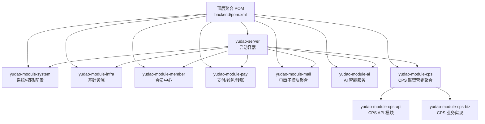
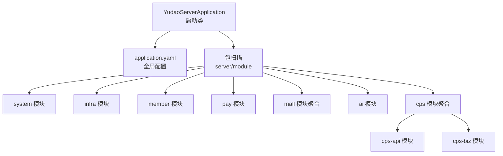
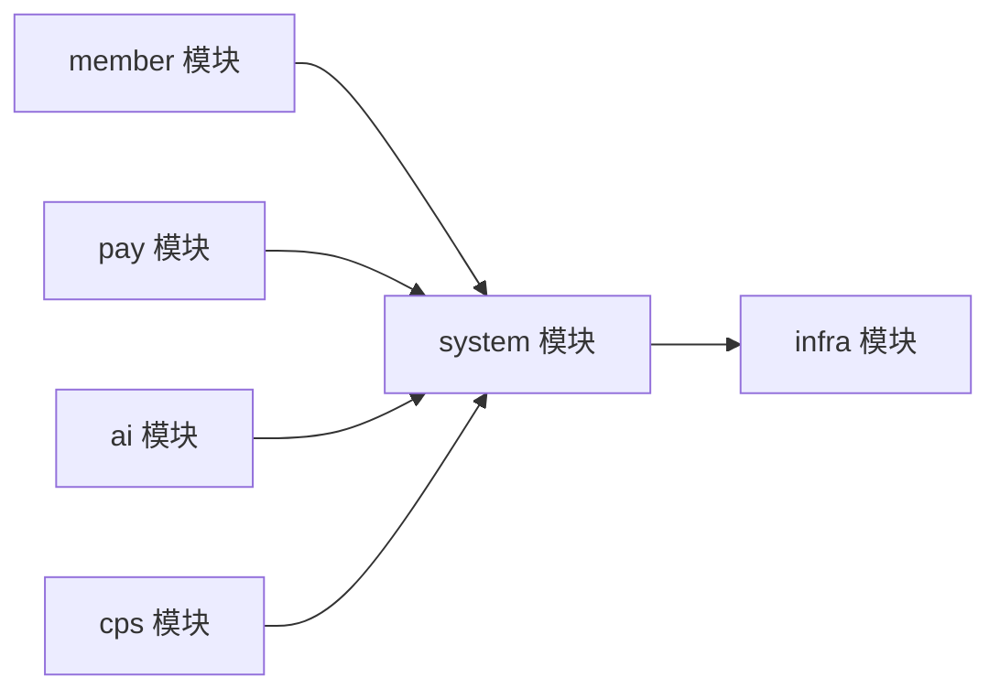
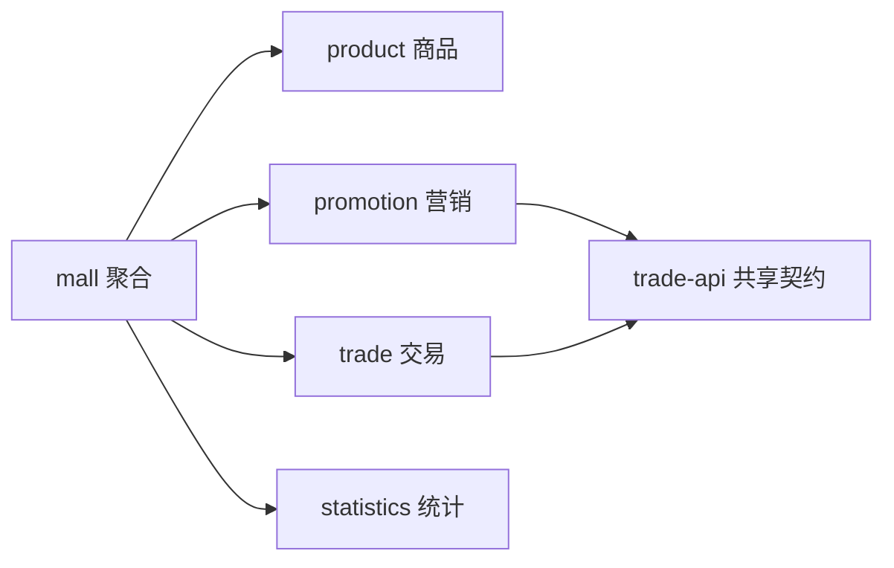
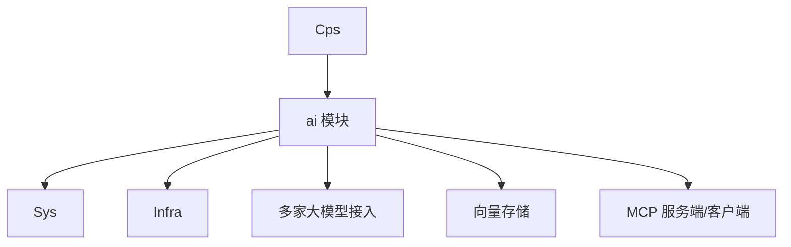
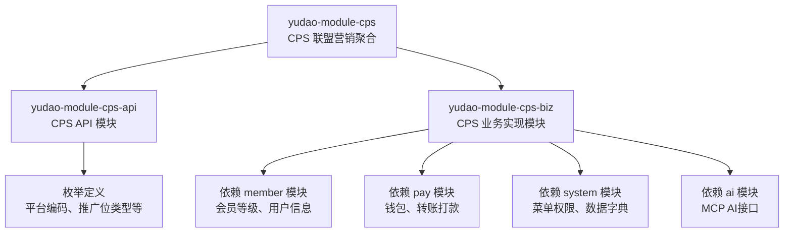
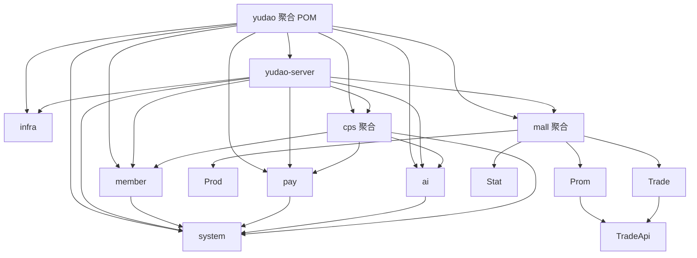

# 业务模块概览

<cite>
**本文引用的文件**
- [backend/yudao-server/pom.xml](file://backend/yudao-server/pom.xml)
- [backend/pom.xml](file://backend/pom.xml)
- [backend/yudao-server/src/main/java/cn/iocoder/yudao/server/YudaoServerApplication.java](file://backend/yudao-server/src/main/java/cn/iocoder/yudao/server/YudaoServerApplication.java)
- [backend/yudao-server/src/main/resources/application.yaml](file://backend/yudao-server/src/main/resources/application.yaml)
- [backend/yudao-module-system/pom.xml](file://backend/yudao-module-system/pom.xml)
- [backend/yudao-module-member/pom.xml](file://backend/yudao-module-member/pom.xml)
- [backend/yudao-module-pay/pom.xml](file://backend/yudao-module-pay/pom.xml)
- [backend/yudao-module-ai/pom.xml](file://backend/yudao-module-ai/pom.xml)
- [backend/yudao-module-mall/pom.xml](file://backend/yudao-module-mall/pom.xml)
- [backend/yudao-module-cps/pom.xml](file://backend/yudao-module-cps/pom.xml)
- [backend/yudao-module-cps/yudao-module-cps-api/pom.xml](file://backend/yudao-module-cps/yudao-module-cps-api/pom.xml)
- [backend/yudao-module-cps/yudao-module-cps-biz/pom.xml](file://backend/yudao-module-cps/yudao-module-cps-biz/pom.xml)
- [backend/yudao-module-cps/yudao-module-cps-api/src/main/java/cn/iocoder/yudao/module/cps/enums/CpsPlatformCodeEnum.java](file://backend/yudao-module-cps/yudao-module-cps-api/src/main/java/cn/iocoder/yudao/module/cps/enums/CpsPlatformCodeEnum.java)
- [backend/yudao-module-cps/yudao-module-cps-api/src/main/java/cn/iocoder/yudao/module/cps/enums/CpsAdzoneTypeEnum.java](file://backend/yudao-module-cps/yudao-module-cps-api/src/main/java/cn/iocoder/yudao/module/cps/enums/CpsAdzoneTypeEnum.java)
</cite>

## 更新摘要
**所做更改**
- 新增完整的CPS业务模块架构分析，包含七个核心子模块的详细说明
- 更新CPS模块的职责边界和相互关系描述
- 增强CPS模块与其他业务模块的依赖关系分析
- 补充CPS模块的接口契约和数据流转说明
- 完善CPS模块的开发规范和集成指南

## 目录
1. [简介](#简介)
2. [项目结构](#项目结构)
3. [核心组件](#核心组件)
4. [架构总览](#架构总览)
5. [详细组件分析](#详细组件分析)
6. [依赖分析](#依赖分析)
7. [性能考量](#性能考量)
8. [故障排查指南](#故障排查指南)
9. [结论](#结论)
10. [附录](#附录)

## 简介
本文件面向 yudao-server 主项目与各业务模块的整体概览，重点阐述：
- yudao-server 作为启动容器如何通过依赖聚合实现模块装配；
- 各业务模块的职责边界与相互关系；
- 模块间依赖关系图、接口契约与数据流转；
- 模块化架构的优势、扩展性与维护策略；
- 模块开发规范与集成指南。

**更新** 新增对完整CPS业务模块的深入分析，包括其七大核心子模块的架构设计和业务逻辑。

## 项目结构
yudao-server 采用多模块 Maven 聚合工程组织，顶层 POM 定义了模块清单与统一依赖管理，yudao-server 作为打包入口，按需引入各业务模块依赖，形成"容器 + 插件化模块"的架构形态。

**图表来源**
- [backend/pom.xml:10-25](file://backend/pom.xml#L10-L25)
- [backend/yudao-server/pom.xml:23-114](file://backend/yudao-server/pom.xml#L23-L114)
- [backend/yudao-module-cps/pom.xml:21-24](file://backend/yudao-module-cps/pom.xml#L21-L24)

**章节来源**
- [backend/pom.xml:10-25](file://backend/pom.xml#L10-L25)
- [backend/yudao-server/pom.xml:15-21](file://backend/yudao-server/pom.xml#L15-L21)

## 核心组件
- yudao-server 启动容器：通过引入各业务模块依赖，打包为可执行的后端服务，提供 REST API。
- yudao-module-system：通用业务与基础设施，提供权限、字典、租户、IP、定时任务、消息队列、安全、Excel 等能力，并被多个业务模块复用。
- yudao-module-member：会员中心，围绕用户等级、权益等开展业务。
- yudao-module-pay：支付能力，覆盖商户、应用、支付、退款等。
- yudao-module-mall：电商子模块聚合，包含商品、营销、交易、统计等。
- yudao-module-ai：AI 能力聚合，接入多家大模型与向量存储，提供 MCP 服务端能力。
- yudao-module-cps：CPS 联盟营销系统，包含平台管理、推广位管理、订单同步、返利计算、提现管理、MCP AI接口等七大核心子模块。

**更新** CPS模块现包含完整的业务架构，通过API和业务实现模块分离的设计，提供清晰的职责划分和扩展能力。

**章节来源**
- [backend/yudao-server/pom.xml:23-114](file://backend/yudao-server/pom.xml#L23-L114)
- [backend/yudao-module-system/pom.xml:20-122](file://backend/yudao-module-system/pom.xml#L20-L122)
- [backend/yudao-module-member/pom.xml:20-84](file://backend/yudao-module-member/pom.xml#L20-L84)
- [backend/yudao-module-pay/pom.xml:21-81](file://backend/yudao-module-pay/pom.xml#L21-L81)
- [backend/yudao-module-mall/pom.xml:20-33](file://backend/yudao-module-mall/pom.xml#L20-L33)
- [backend/yudao-module-ai/pom.xml:28-262](file://backend/yudao-module-ai/pom.xml#L28-L262)
- [backend/yudao-module-cps/pom.xml:17-24](file://backend/yudao-module-cps/pom.xml#L17-L24)

## 架构总览
yudao-server 通过依赖聚合实现模块装配，扫描包路径加载模块中的控制器、服务与配置，形成统一的 API 服务。系统配置集中于 application.yaml，涵盖缓存、Web、接口文档、工作流、MyBatis、Redis、消息队列、AI 与租户等。

**图表来源**
- [backend/yudao-server/src/main/java/cn/iocoder/yudao/server/YudaoServerApplication.java:16](file://backend/yudao-server/src/main/java/cn/iocoder/yudao/server/YudaoServerApplication.java#L16)
- [backend/yudao-server/src/main/resources/application.yaml:1-362](file://backend/yudao-server/src/main/resources/application.yaml#L1-L362)
- [backend/yudao-module-cps/pom.xml:21-24](file://backend/yudao-module-cps/pom.xml#L21-L24)

**章节来源**
- [backend/yudao-server/src/main/java/cn/iocoder/yudao/server/YudaoServerApplication.java:16-35](file://backend/yudao-server/src/main/java/cn/iocoder/yudao/server/YudaoServerApplication.java#L16-L35)
- [backend/yudao-server/src/main/resources/application.yaml:1-362](file://backend/yudao-server/src/main/resources/application.yaml#L1-L362)

## 详细组件分析

### 系统模块（权限与配置）
- 职责边界：权限、部门、数据字典、租户、IP、定时任务、消息队列、安全、Excel、邮件、社交登录等通用能力。
- 依赖关系：被 member、pay、ai 等模块复用；内部依赖 infra 提供基础设施能力。
- 配置要点：安全、租户、验证码、消息队列、定时任务、MyBatis、Redis、接口文档等。

**图表来源**
- [backend/yudao-module-system/pom.xml:20-122](file://backend/yudao-module-system/pom.xml#L20-L122)
- [backend/yudao-module-member/pom.xml:20-84](file://backend/yudao-module-member/pom.xml#L20-L84)
- [backend/yudao-module-pay/pom.xml:21-81](file://backend/yudao-module-pay/pom.xml#L21-L81)
- [backend/yudao-module-ai/pom.xml:28-38](file://backend/yudao-module-ai/pom.xml#L28-L38)
- [backend/yudao-module-cps/yudao-module-cps-biz/pom.xml:40-45](file://backend/yudao-module-cps/yudao-module-cps-biz/pom.xml#L40-L45)

**章节来源**
- [backend/yudao-module-system/pom.xml:20-122](file://backend/yudao-module-system/pom.xml#L20-L122)

### 会员模块（用户与等级体系）
- 职责边界：会员中心、等级与权益、积分与成长值、等级晋升规则等。
- 依赖关系：复用 system 与 infra 能力；与支付、营销等模块交互。
- 配置要点：安全、Redis、消息队列、Excel、IP 等。

**章节来源**
- [backend/yudao-module-member/pom.xml:20-84](file://backend/yudao-module-member/pom.xml#L20-L84)

### 支付模块（钱包与转账）
- 职责边界：商户与应用管理、支付与退款、账单与结算、钱包与转账等。
- 依赖关系：复用 system 能力；对接第三方 SDK（如支付宝、微信支付）。
- 配置要点：定时任务、Redis、MyBatis、Excel、第三方支付 SDK。

**章节来源**
- [backend/yudao-module-pay/pom.xml:21-81](file://backend/yudao-module-pay/pom.xml#L21-L81)

### 商城模块（电商功能）
- 职责边界：商品、营销、交易、统计四大子域；trade 与 promotion 通过 trade-api 抽象避免循环依赖。
- 依赖关系：product/promotion/trade/statistics 子模块协同；trade-api 作为共享契约。
- 配置要点：MyBatis、Redis、定时任务、消息队列、Excel。

**图表来源**
- [backend/yudao-module-mall/pom.xml:20-33](file://backend/yudao-module-mall/pom.xml#L20-L33)

**章节来源**
- [backend/yudao-module-mall/pom.xml:20-33](file://backend/yudao-module-mall/pom.xml#L20-L33)

### AI 模块（智能服务集成）
- 职责边界：接入多家大模型（国内/国外）、向量存储（Qdrant/Redis/Milvus）、MCP 服务端与客户端、TinyFlow 工作流。
- 依赖关系：复用 system 与 infra；与业务模块通过 API/消息队列交互。
- 配置要点：Spring AI、MCP、向量存储、模型提供商密钥、SSE 端点。

**图表来源**
- [backend/yudao-module-ai/pom.xml:28-262](file://backend/yudao-module-ai/pom.xml#L28-L262)
- [backend/yudao-server/src/main/resources/application.yaml:146-266](file://backend/yudao-server/src/main/resources/application.yaml#L146-L266)
- [backend/yudao-module-cps/yudao-module-cps-biz/pom.xml:94-99](file://backend/yudao-module-cps/yudao-module-cps-biz/pom.xml#L94-L99)

**章节来源**
- [backend/yudao-module-ai/pom.xml:28-262](file://backend/yudao-module-ai/pom.xml#L28-L262)
- [backend/yudao-server/src/main/resources/application.yaml:146-266](file://backend/yudao-server/src/main/resources/application.yaml#L146-L266)

### CPS 模块（联盟营销核心业务）
- 职责边界：包含平台管理、推广位管理、订单同步、返利计算、提现管理、MCP AI接口等七大核心子模块。
- 依赖关系：作为独立聚合模块，与商城、支付、AI 等模块通过 API/消息交互。
- 配置要点：MCP Server 工具清单、SSE 端点、模型提供商配置（用于 AI 辅助）。

**更新** CPS模块现包含完整的业务架构，通过API和业务实现模块分离的设计，提供清晰的职责划分和扩展能力。

#### CPS 模块架构详解
CPS模块采用双模块设计，通过API模块提供对外接口契约，通过业务实现模块承载核心业务逻辑：

**图表来源**
- [backend/yudao-module-cps/pom.xml:21-24](file://backend/yudao-module-cps/pom.xml#L21-L24)
- [backend/yudao-module-cps/yudao-module-cps-api/pom.xml:19-31](file://backend/yudao-module-cps/yudao-module-cps-api/pom.xml#L19-L31)
- [backend/yudao-module-cps/yudao-module-cps-biz/pom.xml:21-99](file://backend/yudao-module-cps/yudao-module-cps-biz/pom.xml#L21-L99)

#### 核心枚举定义
CPS模块通过枚举定义规范业务概念：

**平台编码枚举**：支持淘宝联盟、京东联盟、拼多多联盟、抖音联盟等主流电商平台对接
**推广位类型枚举**：支持通用推广位、渠道专属推广位、用户专属推广位三种类型

**章节来源**
- [backend/yudao-module-cps/pom.xml:17-24](file://backend/yudao-module-cps/pom.xml#L17-L24)
- [backend/yudao-module-cps/yudao-module-cps-api/pom.xml:19-31](file://backend/yudao-module-cps/yudao-module-cps-api/pom.xml#L19-L31)
- [backend/yudao-module-cps/yudao-module-cps-biz/pom.xml:21-99](file://backend/yudao-module-cps/yudao-module-cps-biz/pom.xml#L21-L99)
- [backend/yudao-module-cps/yudao-module-cps-api/src/main/java/cn/iocoder/yudao/module/cps/enums/CpsPlatformCodeEnum.java:16-44](file://backend/yudao-module-cps/yudao-module-cps-api/src/main/java/cn/iocoder/yudao/module/cps/enums/CpsPlatformCodeEnum.java#L16-L44)
- [backend/yudao-module-cps/yudao-module-cps-api/src/main/java/cn/iocoder/yudao/module/cps/enums/CpsAdzoneTypeEnum.java:16-39](file://backend/yudao-module-cps/yudao-module-cps-api/src/main/java/cn/iocoder/yudao/module/cps/enums/CpsAdzoneTypeEnum.java#L16-L39)

## 依赖分析
- 聚合与装配：yudao-server 通过依赖引入各模块，实现"容器 + 插件化"的装配方式。
- 层次化依赖：system 为通用层，member/pay/ai 复用 system；mall 为业务域聚合；cps 为独立业务域。
- 循环依赖规避：mall 中通过 trade-api 抽象消除 trade 与 promotion 的循环依赖。
- CPS 模块依赖：CPS业务实现模块依赖member、pay、system、ai等多个模块，形成完整的业务闭环。

**图表来源**
- [backend/pom.xml:10-25](file://backend/pom.xml#L10-L25)
- [backend/yudao-server/pom.xml:23-114](file://backend/yudao-server/pom.xml#L23-L114)
- [backend/yudao-module-mall/pom.xml:20-33](file://backend/yudao-module-mall/pom.xml#L20-L33)
- [backend/yudao-module-cps/yudao-module-cps-biz/pom.xml:28-99](file://backend/yudao-module-cps/yudao-module-cps-biz/pom.xml#L28-L99)

**章节来源**
- [backend/pom.xml:10-25](file://backend/pom.xml#L10-L25)
- [backend/yudao-server/pom.xml:23-114](file://backend/yudao-server/pom.xml#L23-L114)
- [backend/yudao-module-mall/pom.xml:20-33](file://backend/yudao-module-mall/pom.xml#L20-L33)

## 性能考量
- 启动与打包：yudao-server 使用 spring-boot-maven-plugin 的 repackage 目标将依赖打包进最终产物，便于运行。
- 缓存与序列化：Jackson 时间戳序列化、Redis 缓存 TTL、MyBatis 下划线转驼峰映射等配置有助于性能与一致性。
- 并发与异步：定时任务、消息队列（RocketMQ/Kafka/RabbitMQ）与 WebSocket 配置支持高并发场景。
- AI 向量存储：Redis/Qdrant/Milvus 多向量存储配置，结合模型提供商与本地 Ollama，满足不同性能与成本需求。
- CPS 模块性能：通过API和业务实现模块分离，减少模块间耦合，提升系统整体性能和可维护性。

**更新** 新增CPS模块的性能考量，强调其模块分离设计对系统性能的积极影响。

**章节来源**
- [backend/yudao-server/pom.xml:116-134](file://backend/yudao-server/pom.xml#L116-L134)
- [backend/yudao-server/src/main/resources/application.yaml:26-96](file://backend/yudao-server/src/main/resources/application.yaml#L26-L96)
- [backend/yudao-server/src/main/resources/application.yaml:120-145](file://backend/yudao-server/src/main/resources/application.yaml#L120-L145)
- [backend/yudao-server/src/main/resources/application.yaml:146-266](file://backend/yudao-server/src/main/resources/application.yaml#L146-L266)

## 故障排查指南
- 启动问题：启动类注释提示参考快速开始文档；若遇到启动问题，优先检查 application.yaml 的配置项与依赖版本。
- 包扫描：启动类通过 scanBasePackages 动态扫描 server 与 module 包，确保模块代码位于约定包路径下。
- 配置项定位：关注全局配置文件中的缓存、Web、接口文档、工作流、MyBatis、Redis、消息队列、AI、租户、短信验证码、电商订单策略等关键段落。
- 模块依赖：确认 yudao-server 的依赖列表与各模块的依赖声明一致，避免遗漏或版本不匹配。
- CPS 模块排查：检查CPS API和业务实现模块的依赖配置，验证member、pay、system、ai模块的正确集成。

**更新** 新增CPS模块的故障排查指导，帮助开发者快速定位和解决CPS相关问题。

**章节来源**
- [backend/yudao-server/src/main/java/cn/iocoder/yudao/server/YudaoServerApplication.java:6-35](file://backend/yudao-server/src/main/java/cn/iocoder/yudao/server/YudaoServerApplication.java#L6-L35)
- [backend/yudao-server/src/main/resources/application.yaml:1-362](file://backend/yudao-server/src/main/resources/application.yaml#L1-L362)
- [backend/yudao-server/pom.xml:23-114](file://backend/yudao-server/pom.xml#L23-L114)

## 结论
yudao-server 通过"容器 + 模块"的架构，将系统、会员、支付、商城、AI、CPS 等业务能力以插件化方式组合，既保证了统一入口与配置，又实现了模块间的低耦合与高内聚。该架构具备良好的扩展性与维护性，适合在复杂业务场景下持续演进。

**更新** CPS模块的完整加入进一步增强了系统的业务能力，通过七大数据驱动的子模块设计，为联盟营销业务提供了强大的技术支撑。

## 附录

### 模块开发规范与集成指南
- 包命名与扫描：模块代码置于约定包路径，确保被 yudao-server 的包扫描覆盖。
- 依赖管理：遵循顶层 POM 的依赖管理与版本策略，避免重复或冲突。
- 配置隔离：模块自身尽量不定义全局配置，通过 yudao-server 的 application.yaml 集中管理。
- 接口契约：跨模块交互建议通过 API 或消息队列，避免直接依赖导致耦合。
- 模块拆分：若出现循环依赖（如 mall 的 trade 与 promotion），可参考 trade-api 抽象规避。
- AI 集成：AI 模块可作为通用能力被其他模块调用，注意向量存储与模型提供商配置的可替换性。
- CPS 集成：CPS 的 MCP 工具可在 AI 模块基础上扩展，实现 Agent 对 CPS 能力的调用。
- CPS 开发规范：API模块专注于接口定义和枚举规范，业务实现模块专注于核心业务逻辑，通过清晰的职责划分提升代码质量。

**更新** 新增CPS模块的开发规范和集成指南，为CPS模块的扩展和维护提供指导。

**章节来源**
- [backend/yudao-server/src/main/java/cn/iocoder/yudao/server/YudaoServerApplication.java:16](file://backend/yudao-server/src/main/java/cn/iocoder/yudao/server/YudaoServerApplication.java#L16)
- [backend/yudao-module-mall/pom.xml:26-31](file://backend/yudao-module-mall/pom.xml#L26-L31)
- [backend/yudao-module-ai/pom.xml:198-221](file://backend/yudao-module-ai/pom.xml#L198-L221)
- [backend/yudao-server/src/main/resources/application.yaml:200-225](file://backend/yudao-server/src/main/resources/application.yaml#L200-L225)
- [backend/yudao-module-cps/yudao-module-cps-api/pom.xml:19-31](file://backend/yudao-module-cps/yudao-module-cps-api/pom.xml#L19-L31)
- [backend/yudao-module-cps/yudao-module-cps-biz/pom.xml:21-99](file://backend/yudao-module-cps/yudao-module-cps-biz/pom.xml#L21-L99)