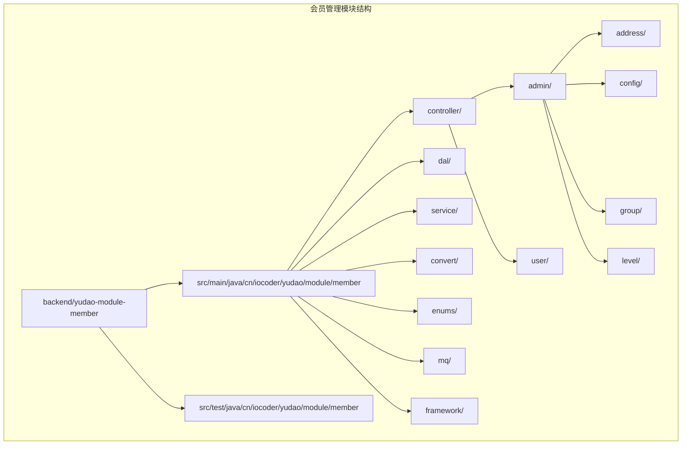
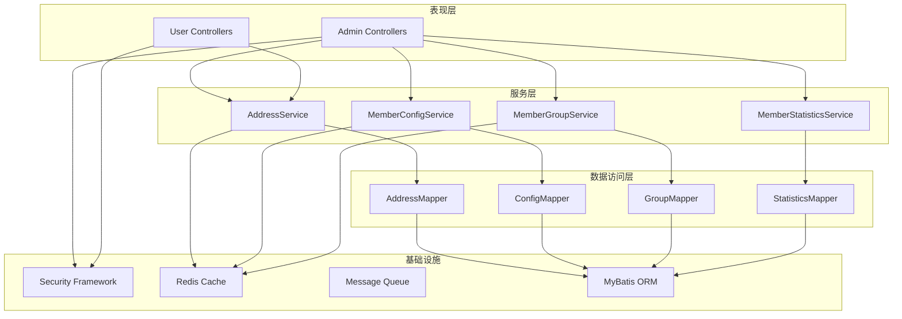
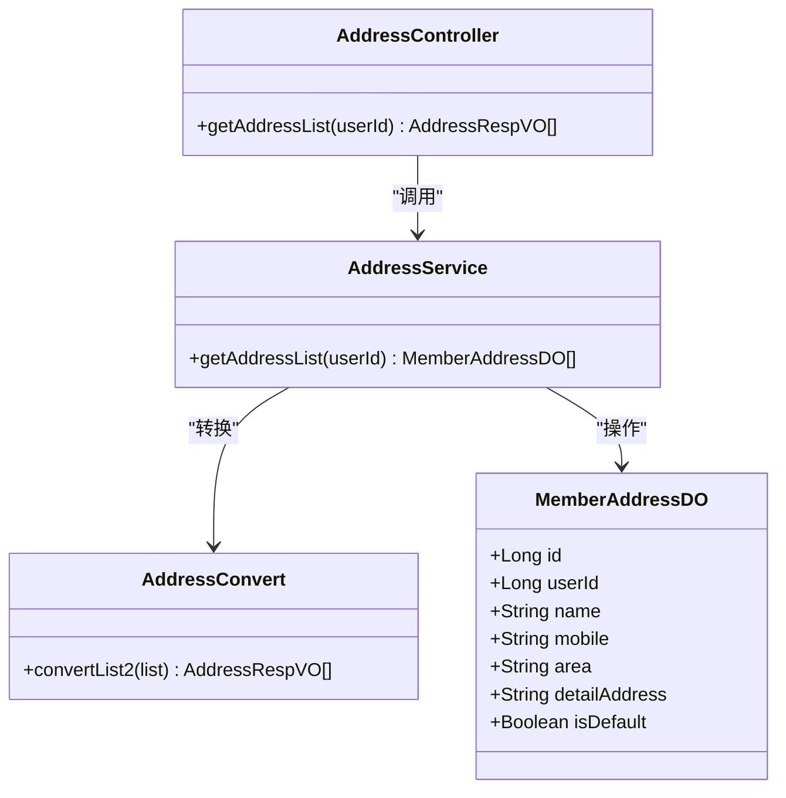
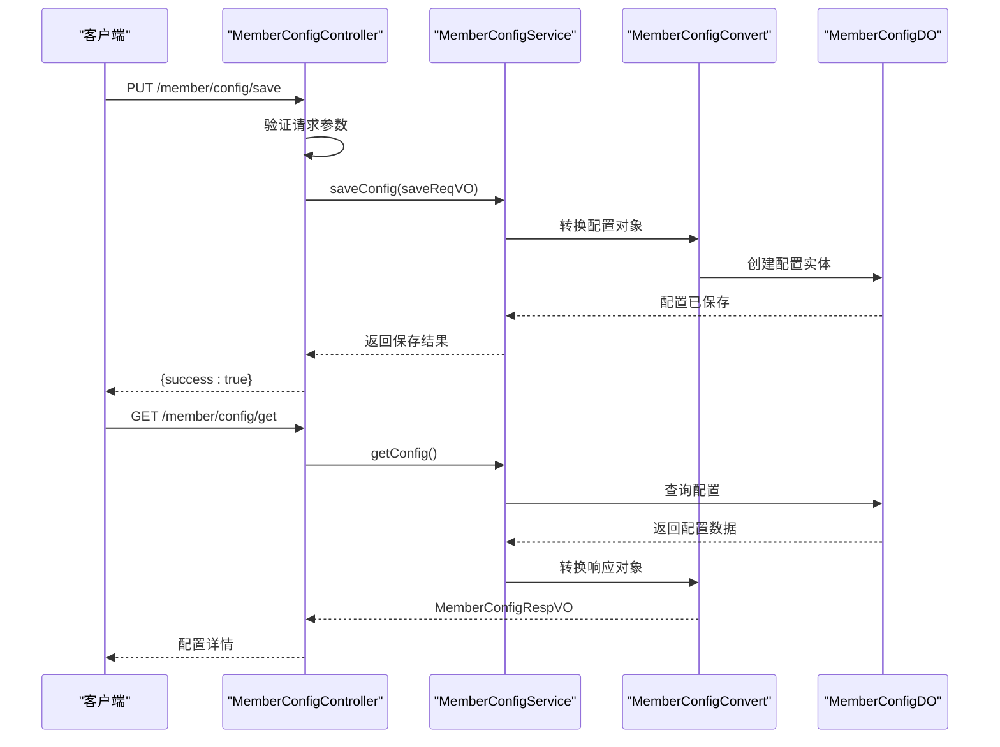
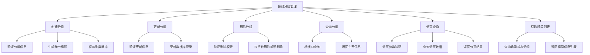
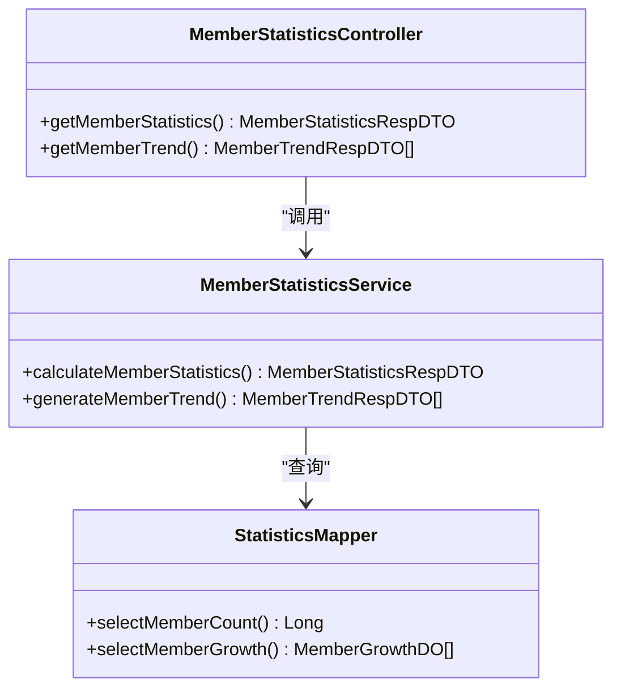
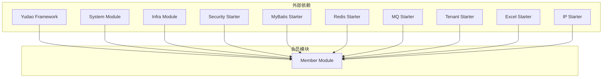

# 会员管理模块

<cite>
**本文档引用的文件**
- [package-info.java](file://backend/yudao-module-member/src/main/java/cn/iocoder/yudao/module/member/package-info.java)
- [pom.xml](file://backend/yudao-module-member/pom.xml)
- [AddressController.java](file://backend/yudao-module-member/src/main/java/cn/iocoder/yudao/module/member/controller/admin/address/AddressController.java)
- [MemberConfigController.java](file://backend/yudao-module-member/src/main/java/cn/iocoder/yudao/module/member/controller/admin/config/MemberConfigController.java)
- [MemberGroupController.java](file://backend/yudao-module-member/src/main/java/cn/iocoder/yudao/module/member/controller/admin/group/MemberGroupController.java)
- [MemberStatisticsController.java](file://backend/yudao-module-mall/yudao-module-statistics/src/main/java/cn/iocoder/yudao/module/statistics/controller/admin/member/MemberStatisticsController.java)
</cite>

## 目录
1. [简介](#简介)
2. [项目结构](#项目结构)
3. [核心组件](#核心组件)
4. [架构概览](#架构概览)
5. [详细组件分析](#详细组件分析)
6. [依赖分析](#依赖分析)
7. [性能考虑](#性能考虑)
8. [故障排除指南](#故障排除指南)
9. [结论](#结论)
10. [附录](#附录)

## 简介

会员管理模块是基于 Yudao 框架构建的电商会员管理系统，专注于提供完整的会员生命周期管理功能。该模块采用模块化设计，通过清晰的分层架构实现了会员相关的所有核心业务功能。

本模块遵循 Yudao 框架的设计规范，使用 `/member/` 作为控制器 URL 前缀，数据库表名使用 `member_` 前缀，确保了与其他模块的完全隔离。模块集成了安全认证、数据访问、消息队列等基础设施，为会员管理提供了稳定可靠的技术支撑。

## 项目结构

会员管理模块采用标准的 Maven 多模块结构，主要包含以下核心目录：

**图表来源**
- [package-info.java:1-9](file://backend/yudao-module-member/src/main/java/cn/iocoder/yudao/module/member/package-info.java#L1-L9)

**章节来源**
- [package-info.java:1-9](file://backend/yudao-module-member/src/main/java/cn/iocoder/yudao/module/member/package-info.java#L1-L9)

## 核心组件

会员管理模块的核心组件围绕三大业务领域构建：用户管理、配置管理和统计分析。

### 用户管理组件
- **收货地址管理**：提供完整的地址 CRUD 操作，支持批量查询和管理后台权限控制
- **会员分组管理**：实现用户分组的创建、更新、删除和查询功能
- **经验记录管理**：跟踪会员经验值变化历史，支持分页查询和统计分析

### 配置管理组件
- **会员配置管理**：集中管理会员系统的各项配置参数
- **系统设置**：提供灵活的配置项管理，支持动态更新和持久化存储

### 统计分析组件
- **会员统计**：提供会员相关的各类统计数据和报表
- **行为分析**：跟踪会员活跃度和消费行为模式

**章节来源**
- [AddressController.java:1-42](file://backend/yudao-module-member/src/main/java/cn/iocoder/yudao/module/member/controller/admin/address/AddressController.java#L1-L42)
- [MemberConfigController.java:1-46](file://backend/yudao-module-member/src/main/java/cn/iocoder/yudao/module/member/controller/admin/config/MemberConfigController.java#L1-L46)
- [MemberGroupController.java:1-82](file://backend/yudao-module-member/src/main/java/cn/iocoder/yudao/module/member/controller/admin/group/MemberGroupController.java#L1-L82)

## 架构概览

会员管理模块采用分层架构设计，确保了良好的可维护性和扩展性：

**图表来源**
- [AddressController.java:27-39](file://backend/yudao-module-member/src/main/java/cn/iocoder/yudao/module/member/controller/admin/address/AddressController.java#L27-L39)
- [MemberConfigController.java:26-43](file://backend/yudao-module-member/src/main/java/cn/iocoder/yudao/module/member/controller/admin/config/MemberConfigController.java#L26-L43)
- [MemberGroupController.java:30-79](file://backend/yudao-module-member/src/main/java/cn/iocoder/yudao/module/member/controller/admin/group/MemberGroupController.java#L30-L79)

## 详细组件分析

### 收货地址管理组件

收货地址管理是会员系统的基础功能之一，提供了完整的地址管理能力：

**图表来源**
- [AddressController.java:27-39](file://backend/yudao-module-member/src/main/java/cn/iocoder/yudao/module/member/controller/admin/address/AddressController.java#L27-L39)

#### 核心功能特性
- **权限控制**：基于 Spring Security 的细粒度权限管理
- **批量查询**：支持按用户 ID 查询所有收货地址
- **数据转换**：自动进行 DO/VO 对象转换
- **RESTful 设计**：符合 RESTful API 规范的接口设计

**章节来源**
- [AddressController.java:32-39](file://backend/yudao-module-member/src/main/java/cn/iocoder/yudao/module/member/controller/admin/address/AddressController.java#L32-L39)

### 会员配置管理组件

会员配置管理提供了灵活的系统配置能力：

**图表来源**
- [MemberConfigController.java:32-43](file://backend/yudao-module-member/src/main/java/cn/iocoder/yudao/module/member/controller/admin/config/MemberConfigController.java#L32-L43)

#### 配置管理流程
- **保存配置**：支持完整的配置项更新和验证
- **获取配置**：提供统一的配置查询接口
- **权限控制**：基于角色的访问权限管理
- **数据转换**：自动处理请求/响应对象转换

**章节来源**
- [MemberConfigController.java:29-43](file://backend/yudao-module-member/src/main/java/cn/iocoder/yudao/module/member/controller/admin/config/MemberConfigController.java#L29-L43)

### 会员分组管理组件

会员分组管理实现了灵活的用户分组功能：

**图表来源**
- [MemberGroupController.java:35-79](file://backend/yudao-module-member/src/main/java/cn/iocoder/yudao/module/member/controller/admin/group/MemberGroupController.java#L35-L79)

#### 分组管理特性
- **完整 CRUD**：支持分组的全生命周期管理
- **权限控制**：基于操作类型的细粒度权限管理
- **分页查询**：高效的大数据量分页查询
- **精简列表**：提供前端下拉框使用的精简数据

**章节来源**
- [MemberGroupController.java:32-79](file://backend/yudao-module-member/src/main/java/cn/iocoder/yudao/module/member/controller/admin/group/MemberGroupController.java#L32-L79)

### 会员统计分析组件

会员统计分析提供了丰富的数据分析能力：

**图表来源**
- [MemberStatisticsController.java:32](file://backend/yudao-module-mall/yudao-module-statistics/src/main/java/cn/iocoder/yudao/module/statistics/controller/admin/member/MemberStatisticsController.java#L32)

**章节来源**
- [MemberStatisticsController.java:32](file://backend/yudao-module-mall/yudao-module-statistics/src/main/java/cn/iocoder/yudao/module/statistics/controller/admin/member/MemberStatisticsController.java#L32)

## 依赖分析

会员管理模块的依赖关系体现了清晰的分层架构和模块化设计：

**图表来源**
- [pom.xml:20-84](file://backend/yudao-module-member/pom.xml#L20-L84)

### 核心依赖特性

**框架依赖**
- **Yudao Framework**：提供完整的微服务开发框架
- **Spring Security**：实现安全认证和授权控制
- **MyBatis**：提供强大的 ORM 能力
- **Redis**：支持高性能缓存和会话管理

**业务依赖**
- **System Module**：系统基础功能支持
- **Infra Module**：基础设施服务
- **Tenant Starter**：多租户支持

**工具依赖**
- **Excel Starter**：数据导出功能
- **IP Starter**：IP 地址解析
- **Validation**：数据验证支持

**章节来源**
- [pom.xml:20-84](file://backend/yudao-module-member/pom.xml#L20-L84)

## 性能考虑

会员管理模块在设计时充分考虑了性能优化和扩展性需求：

### 缓存策略
- **Redis 缓存**：利用 Redis Starter 提供的缓存支持
- **热点数据缓存**：对频繁访问的配置和分组信息进行缓存
- **分布式缓存**：支持多实例部署下的缓存一致性

### 数据访问优化
- **MyBatis 优化**：通过合理的 SQL 查询和索引设计
- **分页查询**：大数据量场景下的分页处理
- **批量操作**：支持批量数据处理提升效率

### 并发控制
- **线程安全**：服务层方法的线程安全性保证
- **事务管理**：基于注解的声明式事务管理
- **锁机制**：关键业务场景下的并发控制

## 故障排除指南

### 常见问题诊断

**权限相关问题**
- 确认用户是否具有相应的操作权限
- 检查 Spring Security 配置是否正确
- 验证权限表达式的语法格式

**数据访问问题**
- 检查数据库连接配置
- 验证 MyBatis 映射文件的正确性
- 确认数据库表结构是否完整

**缓存问题**
- 检查 Redis 服务器连接状态
- 验证缓存键值的正确性
- 确认缓存过期时间设置

### 调试建议

**日志监控**
- 启用详细的业务日志记录
- 监控关键业务流程的执行情况
- 记录异常情况和错误信息

**性能监控**
- 监控数据库查询性能
- 跟踪缓存命中率
- 分析接口响应时间

## 结论

会员管理模块是一个设计合理、架构清晰的电商会员管理系统。通过模块化的组件设计和完善的分层架构，该模块为会员管理提供了全面的功能支持。

模块的主要优势包括：
- **清晰的职责划分**：各组件职责明确，便于维护和扩展
- **完善的安全机制**：基于 Spring Security 的权限控制
- **灵活的配置管理**：支持动态配置和运行时调整
- **良好的性能表现**：通过缓存和优化技术提升响应速度

未来可以考虑的功能增强包括：
- 更丰富的会员等级体系
- 积分管理功能的完善
- 更多的营销活动支持
- 实时数据分析能力

## 附录

### API 接口规范

**收货地址管理**
- GET `/member/address/list?userId={userId}` - 获取用户收货地址列表

**会员配置管理**
- PUT `/member/config/save` - 保存会员配置
- GET `/member/config/get` - 获取会员配置

**会员分组管理**
- POST `/member/group/create` - 创建用户分组
- PUT `/member/group/update` - 更新用户分组
- DELETE `/member/group/delete?id={id}` - 删除用户分组
- GET `/member/group/get?id={id}` - 获取用户分组
- GET `/member/group/list-all-simple` - 获取精简分组列表
- GET `/member/group/page` - 分页查询用户分组

### 配置参数说明

模块支持的配置参数主要包括：
- 会员注册相关设置
- 收货地址管理配置
- 会员分组规则定义
- 系统默认参数设置

### 扩展接口建议

为满足不同业务场景的需求，建议考虑以下扩展：
- 会员等级升级规则配置
- 积分获取和消费规则
- 签到活动管理接口
- 会员营销活动集成