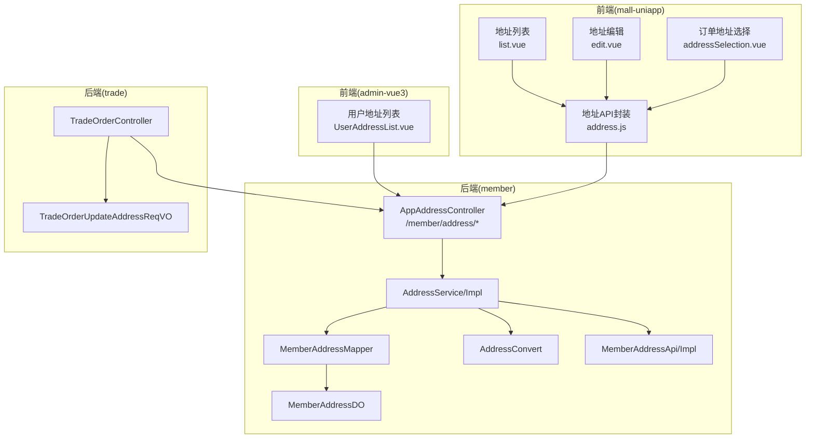
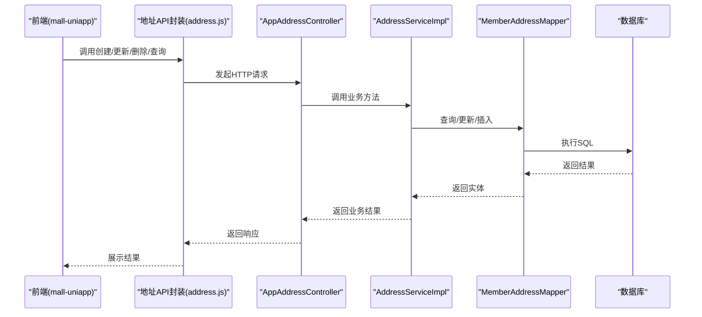
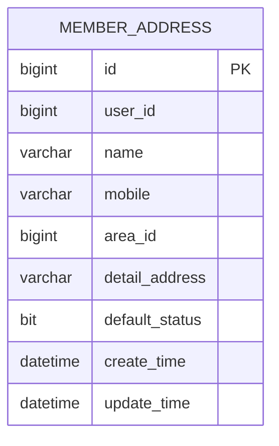
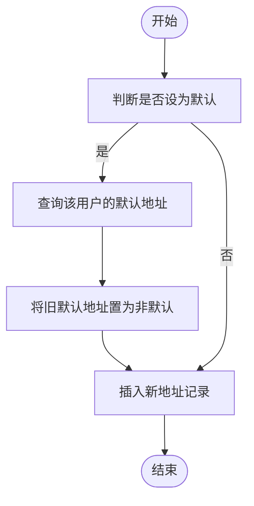
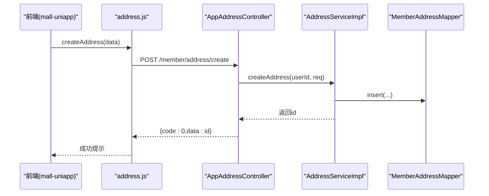
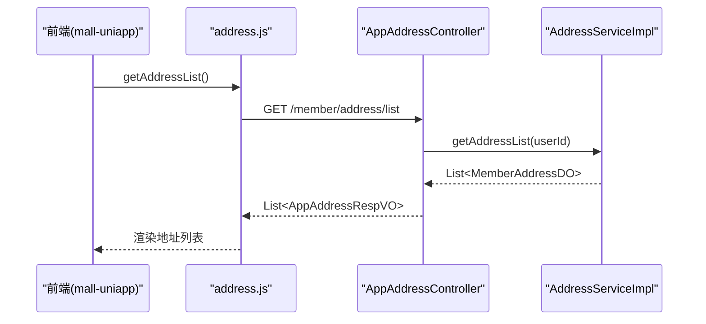
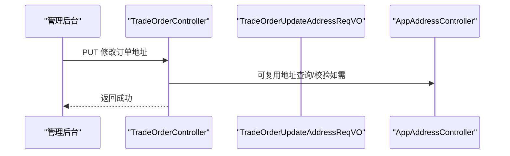
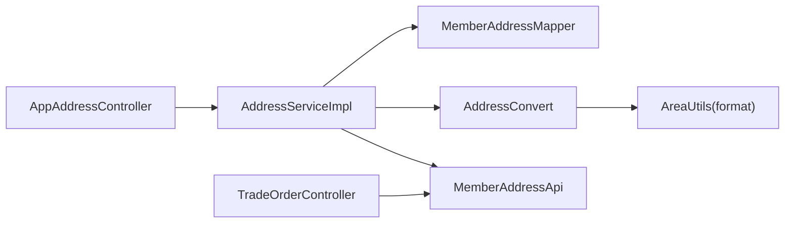

# 收货地址

<cite>
**本文引用的文件**
- [AppAddressController.java](file://backend/yudao-module-member/src/main/java/cn/iocoder/yudao/module/member/controller/app/address/AppAddressController.java)
- [AddressController.java](file://backend/yudao-module-member/src/main/java/cn/iocoder/yudao/module/member/controller/admin/address/AddressController.java)
- [AddressService.java](file://backend/yudao-module-member/src/main/java/cn/iocoder/yudao/module/member/service/address/AddressService.java)
- [AddressServiceImpl.java](file://backend/yudao-module-member/src/main/java/cn/iocoder/yudao/module/member/service/address/AddressServiceImpl.java)
- [MemberAddressMapper.java](file://backend/yudao-module-member/src/main/java/cn/iocoder/yudao/module/member/dal/mysql/address/MemberAddressMapper.java)
- [MemberAddressDO.java](file://backend/yudao-module-member/src/main/java/cn/iocoder/yudao/module/member/dal/dataobject/address/MemberAddressDO.java)
- [AddressConvert.java](file://backend/yudao-module-member/src/main/java/cn/iocoder/yudao/module/member/convert/address/AddressConvert.java)
- [AppAddressCreateReqVO.java](file://backend/yudao-module-member/src/main/java/cn/iocoder/yudao/module/member/controller/app/address/vo/AppAddressCreateReqVO.java)
- [AppAddressUpdateReqVO.java](file://backend/yudao-module-member/src/main/java/cn/iocoder/yudao/module/member/controller/app/address/vo/AppAddressUpdateReqVO.java)
- [AppAddressRespVO.java](file://backend/yudao-module-member/src/main/java/cn/iocoder/yudao/module/member/controller/app/address/vo/AppAddressRespVO.java)
- [AddressBaseVO.java](file://backend/yudao-module-member/src/main/java/cn/iocoder/yudao/module/member/controller/admin/address/vo/AddressBaseVO.java)
- [AddressRespVO.java](file://backend/yudao-module-member/src/main/java/cn/iocoder/yudao/module/member/controller/admin/address/vo/AddressRespVO.java)
- [MemberAddressApi.java](file://backend/yudao-module-member/src/main/java/cn/iocoder/yudao/module/member/api/address/MemberAddressApi.java)
- [MemberAddressApiImpl.java](file://backend/yudao-module-member/src/main/java/cn/iocoder/yudao/module/member/api/address/MemberAddressApiImpl.java)
- [MemberAddressRespDTO.java](file://backend/yudao-module-member/src/main/java/cn/iocoder/yudao/module/member/api/address/dto/MemberAddressRespDTO.java)
- [TradeOrderUpdateAddressReqVO.java](file://backend/yudao-module-mall/yudao-module-trade/src/main/java/cn/iocoder/yudao/module/trade/controller/admin/order/vo/TradeOrderUpdateAddressReqVO.java)
- [TradeOrderController.java](file://backend/yudao-module-mall/yudao-module-trade/src/main/java/cn/iocoder/yudao/module/trade/controller/admin/order/TradeOrderController.java)
- [create_tables.sql（member）](file://backend/yudao-module-member/src/test/resources/sql/create_tables.sql)
- [create_tables.sql（trade）](file://backend/yudao-module-mall/yudao-module-trade/src/test/resources/sql/create_tables.sql)
- [address.js（mall-uniapp）](file://frontend/mall-uniapp/sheep/api/member/address.js)
- [addressSelection.vue（mall-uniapp）](file://frontend/mall-uniapp/pages/order/addressSelection.vue)
- [edit.vue（mall-uniapp）](file://frontend/mall-uniapp/pages/user/address/edit.vue)
- [list.vue（mall-uniapp）](file://frontend/mall-uniapp/pages/user/address/list.vue)
- [s-address-item.vue（mall-uniapp）](file://frontend/mall-uniapp/sheep/components/s-address-item/s-address-item.vue)
- [UserAddressList.vue（admin-vue3）](file://frontend/admin-vue3/src/views/member/user/detail/UserAddressList.vue)
</cite>

## 目录
1. [简介](#简介)
2. [项目结构](#项目结构)
3. [核心组件](#核心组件)
4. [架构总览](#架构总览)
5. [详细组件分析](#详细组件分析)
6. [依赖分析](#依赖分析)
7. [性能考虑](#性能考虑)
8. [故障排查指南](#故障排查指南)
9. [结论](#结论)
10. [附录](#附录)

## 简介
本文件系统性梳理“收货地址”功能，覆盖地址添加、编辑、删除、设置默认地址等核心操作；阐述地址数据模型、地区联动、地址验证机制；文档化地址 API 接口、地址簿管理、批量地址操作思路；解释地址与订单、配送、发票的关系；并给出地址数据标准化、隐私保护、导入导出等高级功能的实现建议。

## 项目结构
地址相关能力横跨后端会员模块与商城交易模块，并在前端多端提供展示与交互：
- 后端会员模块（member）：提供地址的增删改查、默认地址逻辑、地区名转换、对外 API。
- 后端交易模块（trade）：在订单层面支持地址修改与展示。
- 前端 mall-uniapp：提供地址列表、编辑、选择等页面与 API 封装。
- 前端 admin-vue3：提供管理后台用户地址列表查看。

图表来源
- [AppAddressController.java:1-76](file://backend/yudao-module-member/src/main/java/cn/iocoder/yudao/module/member/controller/app/address/AppAddressController.java#L1-L76)
- [AddressServiceImpl.java:1-98](file://backend/yudao-module-member/src/main/java/cn/iocoder/yudao/module/member/service/address/AddressServiceImpl.java#L1-L98)
- [MemberAddressMapper.java:1-23](file://backend/yudao-module-member/src/main/java/cn/iocoder/yudao/module/member/dal/mysql/address/MemberAddressMapper.java#L1-L23)
- [MemberAddressDO.java:1-57](file://backend/yudao-module-member/src/main/java/cn/iocoder/yudao/module/member/dal/dataobject/address/MemberAddressDO.java#L1-L57)
- [AddressConvert.java:1-46](file://backend/yudao-module-member/src/main/java/cn/iocoder/yudao/module/member/convert/address/AddressConvert.java#L1-L46)
- [MemberAddressApi.java:1-29](file://backend/yudao-module-member/src/main/java/cn/iocoder/yudao/module/member/api/address/MemberAddressApi.java#L1-L29)
- [TradeOrderController.java:84-111](file://backend/yudao-module-mall/yudao-module-trade/src/main/java/cn/iocoder/yudao/module/trade/controller/admin/order/TradeOrderController.java#L84-L111)
- [TradeOrderUpdateAddressReqVO.java:1-33](file://backend/yudao-module-mall/yudao-module-trade/src/main/java/cn/iocoder/yudao/module/trade/controller/admin/order/vo/TradeOrderUpdateAddressReqVO.java#L1-L33)
- [address.js（mall-uniapp）:1-53](file://frontend/mall-uniapp/sheep/api/member/address.js#L1-L53)
- [list.vue（mall-uniapp）](file://frontend/mall-uniapp/pages/user/address/list.vue)
- [edit.vue（mall-uniapp）](file://frontend/mall-uniapp/pages/user/address/edit.vue)
- [addressSelection.vue（mall-uniapp）](file://frontend/mall-uniapp/pages/order/address/addressSelection.vue)
- [UserAddressList.vue（admin-vue3）:33-54](file://frontend/admin-vue3/src/views/member/user/detail/UserAddressList.vue#L33-L54)

章节来源
- [AppAddressController.java:1-76](file://backend/yudao-module-member/src/main/java/cn/iocoder/yudao/module/member/controller/app/address/AppAddressController.java#L1-L76)
- [AddressServiceImpl.java:1-98](file://backend/yudao-module-member/src/main/java/cn/iocoder/yudao/module/member/service/address/AddressServiceImpl.java#L1-L98)
- [MemberAddressMapper.java:1-23](file://backend/yudao-module-member/src/main/java/cn/iocoder/yudao/module/member/dal/mysql/address/MemberAddressMapper.java#L1-L23)
- [MemberAddressDO.java:1-57](file://backend/yudao-module-member/src/main/java/cn/iocoder/yudao/module/member/dal/dataobject/address/MemberAddressDO.java#L1-L57)
- [AddressConvert.java:1-46](file://backend/yudao-module-member/src/main/java/cn/iocoder/yudao/module/member/convert/address/AddressConvert.java#L1-L46)
- [MemberAddressApi.java:1-29](file://backend/yudao-module-member/src/main/java/cn/iocoder/yudao/module/member/api/address/MemberAddressApi.java#L1-L29)
- [TradeOrderController.java:84-111](file://backend/yudao-module-mall/yudao-module-trade/src/main/java/cn/iocoder/yudao/module/trade/controller/admin/order/TradeOrderController.java#L84-L111)
- [TradeOrderUpdateAddressReqVO.java:1-33](file://backend/yudao-module-mall/yudao-module-trade/src/main/java/cn/iocoder/yudao/module/trade/controller/admin/order/vo/TradeOrderUpdateAddressReqVO.java#L1-L33)
- [address.js（mall-uniapp）:1-53](file://frontend/mall-uniapp/sheep/api/member/address.js#L1-L53)
- [list.vue（mall-uniapp）](file://frontend/mall-uniapp/pages/user/address/list.vue)
- [edit.vue（mall-uniapp）](file://frontend/mall-uniapp/pages/user/address/edit.vue)
- [addressSelection.vue（mall-uniapp）](file://frontend/mall-uniapp/pages/order/address/addressSelection.vue)
- [UserAddressList.vue（admin-vue3）:33-54](file://frontend/admin-vue3/src/views/member/user/detail/UserAddressList.vue#L33-L54)

## 核心组件
- 控制层
  - AppAddressController：提供移动端地址的创建、更新、删除、查询、默认地址查询与列表查询。
  - AddressController（管理后台）：提供管理后台地址列表查询（与 App 端类似，但 VO 不同）。
- 服务层
  - AddressService/Impl：实现地址业务逻辑，包括默认地址互斥更新、存在性校验、列表与默认地址查询。
- 数据访问层
  - MemberAddressMapper：基于通用 Mapper 的查询封装，按用户与默认状态过滤。
  - MemberAddressDO：地址实体，包含用户标识、收件人、手机号、地区编号、详细地址、默认标记等。
- 转换层
  - AddressConvert：负责 VO/DTO 与 DO 的转换，含地区编号到地区名的格式化。
- 对外 API
  - MemberAddressApi/Impl：面向其他模块的地址查询接口，便于订单等场景复用。
- 订单集成
  - TradeOrderUpdateAddressReqVO：订单修改收货地址的请求体。
  - TradeOrderController：订单详情与物流轨迹等接口，地址信息在订单层面可见。

章节来源
- [AppAddressController.java:1-76](file://backend/yudao-module-member/src/main/java/cn/iocoder/yudao/module/member/controller/app/address/AppAddressController.java#L1-L76)
- [AddressService.java:1-68](file://backend/yudao-module-member/src/main/java/cn/iocoder/yudao/module/member/service/address/AddressService.java#L1-L68)
- [AddressServiceImpl.java:1-98](file://backend/yudao-module-member/src/main/java/cn/iocoder/yudao/module/member/service/address/AddressServiceImpl.java#L1-L98)
- [MemberAddressMapper.java:1-23](file://backend/yudao-module-member/src/main/java/cn/iocoder/yudao/module/member/dal/mysql/address/MemberAddressMapper.java#L1-L23)
- [MemberAddressDO.java:1-57](file://backend/yudao-module-member/src/main/java/cn/iocoder/yudao/module/member/dal/dataobject/address/MemberAddressDO.java#L1-L57)
- [AddressConvert.java:1-46](file://backend/yudao-module-member/src/main/java/cn/iocoder/yudao/module/member/convert/address/AddressConvert.java#L1-L46)
- [MemberAddressApi.java:1-29](file://backend/yudao-module-member/src/main/java/cn/iocoder/yudao/module/member/api/address/MemberAddressApi.java#L1-L29)
- [TradeOrderUpdateAddressReqVO.java:1-33](file://backend/yudao-module-mall/yudao-module-trade/src/main/java/cn/iocoder/yudao/module/trade/controller/admin/order/vo/TradeOrderUpdateAddressReqVO.java#L1-L33)
- [TradeOrderController.java:84-111](file://backend/yudao-module-mall/yudao-module-trade/src/main/java/cn/iocoder/yudao/module/trade/controller/admin/order/TradeOrderController.java#L84-L111)

## 架构总览
地址功能遵循典型的分层架构：前端通过 API 调用后端控制层，控制层委托服务层，服务层操作数据访问层，最终持久化到数据库。默认地址采用“同一用户仅允许一个默认”的互斥策略，确保业务一致性。

图表来源
- [AppAddressController.java:32-73](file://backend/yudao-module-member/src/main/java/cn/iocoder/yudao/module/member/controller/app/address/AppAddressController.java#L32-L73)
- [AddressServiceImpl.java:32-72](file://backend/yudao-module-member/src/main/java/cn/iocoder/yudao/module/member/service/address/AddressServiceImpl.java#L32-L72)
- [MemberAddressMapper.java:13-20](file://backend/yudao-module-member/src/main/java/cn/iocoder/yudao/module/member/dal/mysql/address/MemberAddressMapper.java#L13-L20)
- [address.js（mall-uniapp）:1-53](file://frontend/mall-uniapp/sheep/api/member/address.js#L1-L53)

## 详细组件分析

### 数据模型与地区联动
- 数据模型
  - 实体字段：用户标识、收件人、手机号、地区编号、详细地址、默认标记、创建/更新时间等。
  - 默认地址约束：同一用户仅能有一个默认地址，新增或更新时自动将旧默认地址取消。
- 地区联动
  - 前端通过地区树获取省市区层级，提交时仅需地区编号。
  - 后端在转换层将地区编号格式化为完整地区名，供前端展示使用。

图表来源
- [create_tables.sql（member）:31-45](file://backend/yudao-module-member/src/test/resources/sql/create_tables.sql#L31-L45)

章节来源
- [MemberAddressDO.java:22-56](file://backend/yudao-module-member/src/main/java/cn/iocoder/yudao/module/member/dal/dataobject/address/MemberAddressDO.java#L22-L56)
- [AddressConvert.java:38-41](file://backend/yudao-module-member/src/main/java/cn/iocoder/yudao/module/member/convert/address/AddressConvert.java#L38-L41)
- [AppAddressRespVO.java:12-20](file://backend/yudao-module-member/src/main/java/cn/iocoder/yudao/module/member/controller/app/address/vo/AppAddressRespVO.java#L12-L20)

### 默认地址互斥策略
- 新增默认地址：若请求标记为默认，则先查询该用户已存在的默认地址并全部取消，再插入新记录。
- 更新默认地址：若更新标记为默认，则排除自身后取消其他默认地址，再更新当前记录。
- 查询默认地址：按用户与默认标记查询第一条记录。

图表来源
- [AddressServiceImpl.java:32-46](file://backend/yudao-module-member/src/main/java/cn/iocoder/yudao/module/member/service/address/AddressServiceImpl.java#L32-L46)
- [AddressServiceImpl.java:48-64](file://backend/yudao-module-member/src/main/java/cn/iocoder/yudao/module/member/service/address/AddressServiceImpl.java#L48-L64)

章节来源
- [AddressServiceImpl.java:32-64](file://backend/yudao-module-member/src/main/java/cn/iocoder/yudao/module/member/service/address/AddressServiceImpl.java#L32-L64)

### API 接口清单与调用流程
- 移动端接口
  - POST /member/address/create：创建地址
  - PUT /member/address/update：更新地址
  - DELETE /member/address/delete?id=...：删除地址
  - GET /member/address/get?id=...：获取单条地址
  - GET /member/address/get-default：获取默认地址
  - GET /member/address/list：获取地址列表
- 管理后台接口
  - GET /member/address/list：获取地址列表（管理端 VO）

图表来源
- [address.js（mall-uniapp）:11-22](file://frontend/mall-uniapp/sheep/api/member/address.js#L11-L22)
- [AppAddressController.java:32-36](file://backend/yudao-module-member/src/main/java/cn/iocoder/yudao/module/member/controller/app/address/AppAddressController.java#L32-L36)
- [AddressServiceImpl.java:32-46](file://backend/yudao-module-member/src/main/java/cn/iocoder/yudao/module/member/service/address/AddressServiceImpl.java#L32-L46)

章节来源
- [AppAddressController.java:32-73](file://backend/yudao-module-member/src/main/java/cn/iocoder/yudao/module/member/controller/app/address/AppAddressController.java#L32-L73)
- [AddressController.java:32-33](file://backend/yudao-module-member/src/main/java/cn/iocoder/yudao/module/member/controller/admin/address/AddressController.java#L32-L33)
- [address.js（mall-uniapp）:1-53](file://frontend/mall-uniapp/sheep/api/member/address.js#L1-L53)

### 地址簿管理与前端页面
- 地址列表：展示用户所有地址，支持编辑、删除、设为默认。
- 地址编辑：表单包含收件人、手机号、地区选择、详细地址、默认标记。
- 订单地址选择：下单时从地址簿选择或新建地址。

图表来源
- [address.js（mall-uniapp）:4-10](file://frontend/mall-uniapp/sheep/api/member/address.js#L4-L10)
- [AppAddressController.java:68-73](file://backend/yudao-module-member/src/main/java/cn/iocoder/yudao/module/member/controller/app/address/AppAddressController.java#L68-L73)
- [AddressServiceImpl.java:86-89](file://backend/yudao-module-member/src/main/java/cn/iocoder/yudao/module/member/service/address/AddressServiceImpl.java#L86-L89)

章节来源
- [list.vue（mall-uniapp）](file://frontend/mall-uniapp/pages/user/address/list.vue)
- [edit.vue（mall-uniapp）](file://frontend/mall-uniapp/pages/user/address/edit.vue)
- [addressSelection.vue（mall-uniapp）](file://frontend/mall-uniapp/pages/order/address/addressSelection.vue)
- [s-address-item.vue（mall-uniapp）](file://frontend/mall-uniapp/sheep/components/s-address-item/s-address-item.vue)

### 与订单、配送、发票的关系
- 订单修改地址
  - 管理后台可通过 TradeOrderUpdateAddressReqVO 修改订单收货人姓名、手机、地区编号、详细地址。
  - TradeOrderController 提供订单详情与物流轨迹查询，地址信息在订单层面可见。
- 发票关联
  - 发票通常与订单绑定，地址作为订单收货信息，间接影响发票寄送地址（如适用）。

图表来源
- [TradeOrderUpdateAddressReqVO.java:1-33](file://backend/yudao-module-mall/yudao-module-trade/src/main/java/cn/iocoder/yudao/module/trade/controller/admin/order/vo/TradeOrderUpdateAddressReqVO.java#L1-L33)
- [TradeOrderController.java:84-111](file://backend/yudao-module-mall/yudao-module-trade/src/main/java/cn/iocoder/yudao/module/trade/controller/admin/order/TradeOrderController.java#L84-L111)

章节来源
- [TradeOrderUpdateAddressReqVO.java:1-33](file://backend/yudao-module-mall/yudao-module-trade/src/main/java/cn/iocoder/yudao/module/trade/controller/admin/order/vo/TradeOrderUpdateAddressReqVO.java#L1-L33)
- [TradeOrderController.java:84-111](file://backend/yudao-module-mall/yudao-module-trade/src/main/java/cn/iocoder/yudao/module/trade/controller/admin/order/TradeOrderController.java#L84-L111)

### 地址验证与输入规范
- 请求体校验
  - AppAddressCreateReqVO/AppAddressUpdateReqVO 继承自 AppAddressBaseVO，包含收件人、手机号、地区编号、详细地址、默认标记等字段的非空校验。
- 管理后台 VO
  - AddressBaseVO：定义管理端地址的基础字段与校验规则。
- 建议补充
  - 手机号正则校验、地区编号有效性校验、详细地址长度限制等可在服务层或校验层增强。

章节来源
- [AppAddressCreateReqVO.java:1-12](file://backend/yudao-module-member/src/main/java/cn/iocoder/yudao/module/member/controller/app/address/vo/AppAddressCreateReqVO.java#L1-L12)
- [AppAddressUpdateReqVO.java:1-17](file://backend/yudao-module-member/src/main/java/cn/iocoder/yudao/module/member/controller/app/address/vo/AppAddressUpdateReqVO.java#L1-L17)
- [AddressBaseVO.java:14-37](file://backend/yudao-module-member/src/main/java/cn/iocoder/yudao/module/member/controller/admin/address/vo/AddressBaseVO.java#L14-L37)

### 批量地址操作（实现建议）
- 批量删除：在服务层增加批量删除方法，按用户与 ID 列表进行删除，注意权限与存在性校验。
- 批量设默认：对同一用户批量更新默认标记，保持互斥一致性。
- 批量导入/导出：结合 Excel 工具与批量接口，导入时进行字段校验与重复性检查，导出时按模板输出字段。

（本节为实现建议，未直接对应现有代码文件）

## 依赖分析
- 控制层依赖服务层；服务层依赖数据访问层与转换层；转换层依赖地区工具进行地区名格式化。
- 订单模块通过 MemberAddressApi 获取地址信息，实现解耦与复用。

图表来源
- [AppAddressController.java:28-30](file://backend/yudao-module-member/src/main/java/cn/iocoder/yudao/module/member/controller/app/address/AppAddressController.java#L28-L30)
- [AddressServiceImpl.java:28-29](file://backend/yudao-module-member/src/main/java/cn/iocoder/yudao/module/member/service/address/AddressServiceImpl.java#L28-L29)
- [AddressConvert.java:38-41](file://backend/yudao-module-member/src/main/java/cn/iocoder/yudao/module/member/convert/address/AddressConvert.java#L38-L41)
- [MemberAddressApi.java:1-29](file://backend/yudao-module-member/src/main/java/cn/iocoder/yudao/module/member/api/address/MemberAddressApi.java#L1-L29)
- [TradeOrderController.java:84-111](file://backend/yudao-module-mall/yudao-module-trade/src/main/java/cn/iocoder/yudao/module/trade/controller/admin/order/TradeOrderController.java#L84-L111)

章节来源
- [AddressServiceImpl.java:28-29](file://backend/yudao-module-member/src/main/java/cn/iocoder/yudao/module/member/service/address/AddressServiceImpl.java#L28-L29)
- [AddressConvert.java:38-41](file://backend/yudao-module-member/src/main/java/cn/iocoder/yudao/module/member/convert/address/AddressConvert.java#L38-L41)
- [MemberAddressApi.java:1-29](file://backend/yudao-module-member/src/main/java/cn/iocoder/yudao/module/member/api/address/MemberAddressApi.java#L1-L29)

## 性能考虑
- 查询优化
  - 地址列表按用户与默认标记查询，建议在用户维度建立索引，避免全表扫描。
- 默认地址互斥
  - 新增/更新默认地址时需遍历并更新，建议在用户维度加唯一性约束与原子性事务保障。
- 转换成本
  - 地区名格式化依赖外部工具，建议缓存常用地区名，减少重复计算。

（本节为通用性能建议，未直接对应特定代码行）

## 故障排查指南
- 地址不存在
  - 删除/更新前会校验地址是否存在，不存在时抛出异常。前端应捕获错误并提示。
- 默认地址冲突
  - 若出现多个默认地址，检查服务层默认互斥逻辑是否正确执行。
- 地区名为空
  - 检查转换层地区编号到名称的映射是否生效，确认地区数据完整性。

章节来源
- [AddressServiceImpl.java:74-79](file://backend/yudao-module-member/src/main/java/cn/iocoder/yudao/module/member/service/address/AddressServiceImpl.java#L74-L79)
- [AddressServiceImpl.java:32-64](file://backend/yudao-module-member/src/main/java/cn/iocoder/yudao/module/member/service/address/AddressServiceImpl.java#L32-L64)
- [AddressConvert.java:38-41](file://backend/yudao-module-member/src/main/java/cn/iocoder/yudao/module/member/convert/address/AddressConvert.java#L38-L41)

## 结论
地址管理功能以清晰的分层架构实现，具备默认地址互斥、地区联动与统一转换等关键特性。通过对外 API 与订单模块的集成，实现了地址在业务链路中的稳定复用。建议后续完善批量操作、导入导出与更严格的输入校验，以进一步提升可用性与安全性。

## 附录

### 地址数据标准化与隐私保护（建议）
- 数据标准化
  - 统一手机号、地址字段格式，建立清洗规则与校验规则。
- 隐私保护
  - 对敏感字段（如手机号）在展示层脱敏显示；在日志与导出中进行脱敏处理。
- 导入导出
  - 导入：提供模板与字段映射，进行重复性与合法性校验；失败项单独导出。
  - 导出：按模板输出，包含必要字段与脱敏处理。

（本节为通用实践建议，未直接对应特定代码文件）