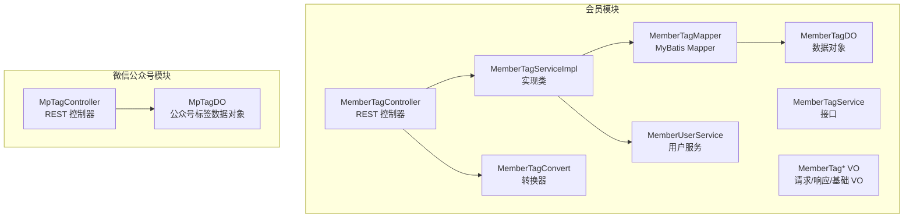
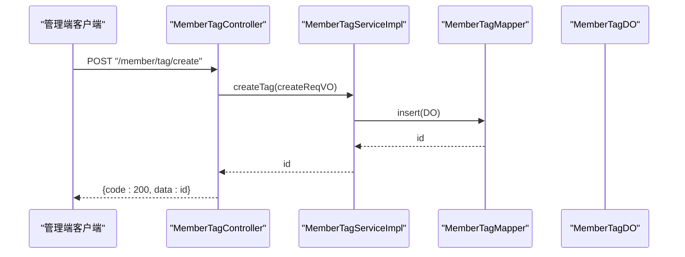
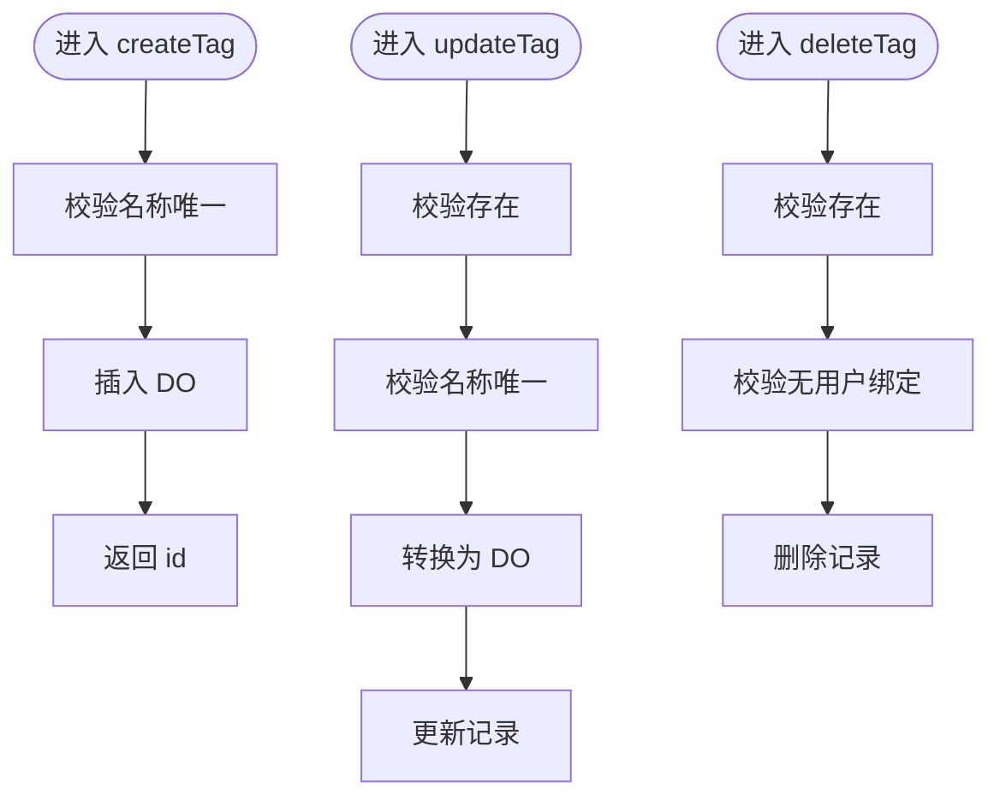
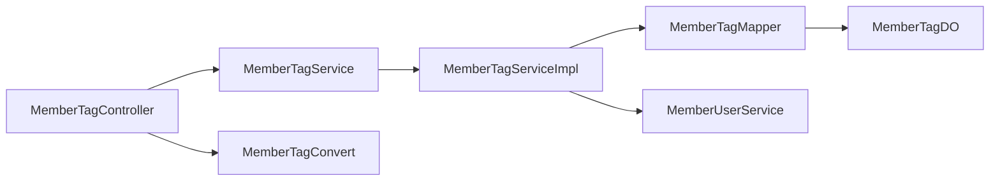

# 标签管理

<cite>
**本文引用的文件**
- [MemberTagController.java](file://backend/yudao-module-member/src/main/java/cn/iocoder/yudao/module/member/controller/admin/tag/MemberTagController.java)
- [MemberTagService.java](file://backend/yudao-module-member/src/main/java/cn/iocoder/yudao/module/member/service/tag/MemberTagService.java)
- [MemberTagServiceImpl.java](file://backend/yudao-module-member/src/main/java/cn/iocoder/yudao/module/member/service/tag/MemberTagServiceImpl.java)
- [MemberTagMapper.java](file://backend/yudao-module-member/src/main/java/cn/iocoder/yudao/module/member/dal/mysql/tag/MemberTagMapper.java)
- [MemberTagDO.java](file://backend/yudao-module-member/src/main/java/cn/iocoder/yudao/module/member/dal/dataobject/tag/MemberTagDO.java)
- [MemberTagConvert.java](file://backend/yudao-module-member/src/main/java/cn/iocoder/yudao/module/member/convert/tag/MemberTagConvert.java)
- [MemberTagBaseVO.java](file://backend/yudao-module-member/src/main/java/cn/iocoder/yudao/module/member/controller/admin/tag/vo/MemberTagBaseVO.java)
- [MemberTagCreateReqVO.java](file://backend/yudao-module-member/src/main/java/cn/iocoder/yudao/module/member/controller/admin/tag/vo/MemberTagCreateReqVO.java)
- [MemberTagUpdateReqVO.java](file://backend/yudao-module-member/src/main/java/cn/iocoder/yudao/module/member/controller/admin/tag/vo/MemberTagUpdateReqVO.java)
- [MemberTagPageReqVO.java](file://backend/yudao-module-member/src/main/java/cn/iocoder/yudao/module/member/controller/admin/tag/vo/MemberTagPageReqVO.java)
- [MemberTagRespVO.java](file://backend/yudao-module-member/src/main/java/cn/iocoder/yudao/module/member/controller/admin/tag/vo/MemberTagRespVO.java)
- [MemberUserService.java](file://backend/yudao-module-member/src/main/java/cn/iocoder/yudao/module/member/service/user/MemberUserService.java)
- [MpTagController.java](file://backend/yudao-module-mp/src/main/java/cn/iocoder/yudao/module/mp/controller/admin/tag/MpTagController.java)
- [MpTagDO.java](file://backend/yudao-module-mp/src/main/java/cn/iocoder/yudao/module/mp/dal/dataobject/tag/MpTagDO.java)
</cite>

## 目录
1. [简介](#简介)
2. [项目结构](#项目结构)
3. [核心组件](#核心组件)
4. [架构总览](#架构总览)
5. [详细组件分析](#详细组件分析)
6. [依赖分析](#依赖分析)
7. [性能考虑](#性能考虑)
8. [故障排查指南](#故障排查指南)
9. [结论](#结论)
10. [附录](#附录)

## 简介
本文件面向“会员标签管理系统”的综合文档，覆盖标签分类、标签创建、标签分配、标签统计分析等核心能力，并结合现有代码实现，系统性阐述标签数据模型、标签与用户的关联关系、标签 API 接口、批量操作与权重管理建议、以及在精准营销、用户画像与个性化推荐中的应用思路。同时给出标签体系设计、运营策略与效果评估的实践方案。

## 项目结构
标签管理功能主要分布在会员模块与微信公众号模块：
- 会员模块提供“会员标签”能力，支持标签的创建、更新、删除、分页查询与简单列表。
- 微信公众号模块提供“公众号标签”能力，支持标签的创建、更新、删除、分页查询、简单列表与远程同步。



图表来源
- [MemberTagController.java:30-94](file://backend/yudao-module-member/src/main/java/cn/iocoder/yudao/module/member/controller/admin/tag/MemberTagController.java#L30-L94)
- [MemberTagServiceImpl.java:31-125](file://backend/yudao-module-member/src/main/java/cn/iocoder/yudao/module/member/service/tag/MemberTagServiceImpl.java#L31-L125)
- [MemberTagMapper.java:15-28](file://backend/yudao-module-member/src/main/java/cn/iocoder/yudao/module/member/dal/mysql/tag/MemberTagMapper.java#L15-L28)
- [MemberTagDO.java:22-34](file://backend/yudao-module-member/src/main/java/cn/iocoder/yudao/module/member/dal/dataobject/tag/MemberTagDO.java#L22-L34)
- [MemberTagConvert.java:18-33](file://backend/yudao-module-member/src/main/java/cn/iocoder/yudao/module/member/convert/tag/MemberTagConvert.java#L18-L33)
- [MemberTagBaseVO.java:12-19](file://backend/yudao-module-member/src/main/java/cn/iocoder/yudao/module/member/controller/admin/tag/vo/MemberTagBaseVO.java#L12-L19)
- [MemberUserService.java:179-179](file://backend/yudao-module-member/src/main/java/cn/iocoder/yudao/module/member/service/user/MemberUserService.java#L179-L179)
- [MpTagController.java:22-88](file://backend/yudao-module-mp/src/main/java/cn/iocoder/yudao/module/mp/controller/admin/tag/MpTagController.java#L22-L88)
- [MpTagDO.java:23-58](file://backend/yudao-module-mp/src/main/java/cn/iocoder/yudao/module/mp/dal/dataobject/tag/MpTagDO.java#L23-L58)

章节来源
- [MemberTagController.java:30-94](file://backend/yudao-module-member/src/main/java/cn/iocoder/yudao/module/member/controller/admin/tag/MemberTagController.java#L30-L94)
- [MemberTagServiceImpl.java:31-125](file://backend/yudao-module-member/src/main/java/cn/iocoder/yudao/module/member/service/tag/MemberTagServiceImpl.java#L31-L125)
- [MemberTagMapper.java:15-28](file://backend/yudao-module-member/src/main/java/cn/iocoder/yudao/module/member/dal/mysql/tag/MemberTagMapper.java#L15-L28)
- [MemberTagDO.java:22-34](file://backend/yudao-module-member/src/main/java/cn/iocoder/yudao/module/member/dal/dataobject/tag/MemberTagDO.java#L22-L34)
- [MemberTagConvert.java:18-33](file://backend/yudao-module-member/src/main/java/cn/iocoder/yudao/module/member/convert/tag/MemberTagConvert.java#L18-L33)
- [MemberTagBaseVO.java:12-19](file://backend/yudao-module-member/src/main/java/cn/iocoder/yudao/module/member/controller/admin/tag/vo/MemberTagBaseVO.java#L12-L19)
- [MemberUserService.java:179-179](file://backend/yudao-module-member/src/main/java/cn/iocoder/yudao/module/member/service/user/MemberUserService.java#L179-L179)
- [MpTagController.java:22-88](file://backend/yudao-module-mp/src/main/java/cn/iocoder/yudao/module/mp/controller/admin/tag/MpTagController.java#L22-L88)
- [MpTagDO.java:23-58](file://backend/yudao-module-mp/src/main/java/cn/iocoder/yudao/module/mp/dal/dataobject/tag/MpTagDO.java#L23-L58)

## 核心组件
- 控制层（MemberTagController）
  - 提供标签的创建、更新、删除、单条查询、列表查询、分页查询、简单列表等接口。
  - 基于权限注解控制访问。
- 业务层（MemberTagService/Impl）
  - 标签创建：校验名称唯一后持久化。
  - 标签更新：校验存在与名称唯一后更新。
  - 标签删除：校验存在且无用户绑定后删除。
  - 查询：按 ID、ID 列表、分页、全部列表。
- 数据访问层（MemberTagMapper）
  - 提供分页查询、按名称查询等默认方法。
- 数据对象（MemberTagDO）
  - 标签实体，包含主键与名称。
- 转换器（MemberTagConvert）
  - VO 与 DO 的映射。
- 视图对象（MemberTag* VO）
  - 统一的请求/响应/基础 VO 结构。
- 用户服务（MemberUserService）
  - 提供按标签统计用户数量的能力，支撑标签统计分析。

章节来源
- [MemberTagController.java:35-92](file://backend/yudao-module-member/src/main/java/cn/iocoder/yudao/module/member/controller/admin/tag/MemberTagController.java#L35-L92)
- [MemberTagService.java:18-73](file://backend/yudao-module-member/src/main/java/cn/iocoder/yudao/module/member/service/tag/MemberTagService.java#L18-L73)
- [MemberTagServiceImpl.java:39-123](file://backend/yudao-module-member/src/main/java/cn/iocoder/yudao/module/member/service/tag/MemberTagServiceImpl.java#L39-L123)
- [MemberTagMapper.java:18-27](file://backend/yudao-module-member/src/main/java/cn/iocoder/yudao/module/member/dal/mysql/tag/MemberTagMapper.java#L18-L27)
- [MemberTagDO.java:22-34](file://backend/yudao-module-member/src/main/java/cn/iocoder/yudao/module/member/dal/dataobject/tag/MemberTagDO.java#L22-L34)
- [MemberTagConvert.java:23-31](file://backend/yudao-module-member/src/main/java/cn/iocoder/yudao/module/member/convert/tag/MemberTagConvert.java#L23-L31)
- [MemberTagBaseVO.java:12-19](file://backend/yudao-module-member/src/main/java/cn/iocoder/yudao/module/member/controller/admin/tag/vo/MemberTagBaseVO.java#L12-L19)
- [MemberUserService.java:173-179](file://backend/yudao-module-member/src/main/java/cn/iocoder/yudao/module/member/service/user/MemberUserService.java#L173-L179)

## 架构总览
标签管理采用经典的分层架构：控制层负责接口定义与鉴权，业务层封装领域逻辑与校验，数据访问层负责持久化，转换器统一数据格式。微信公众号模块提供独立的标签体系，便于与外部平台对接。



图表来源
- [MemberTagController.java:35-40](file://backend/yudao-module-member/src/main/java/cn/iocoder/yudao/module/member/controller/admin/tag/MemberTagController.java#L35-L40)
- [MemberTagServiceImpl.java:40-48](file://backend/yudao-module-member/src/main/java/cn/iocoder/yudao/module/member/service/tag/MemberTagServiceImpl.java#L40-L48)
- [MemberTagMapper.java:15-28](file://backend/yudao-module-member/src/main/java/cn/iocoder/yudao/module/member/dal/mysql/tag/MemberTagMapper.java#L15-L28)

## 详细组件分析

### 1) 标签数据模型与关系
- 会员标签（MemberTagDO）
  - 字段：主键、名称；继承通用创建时间字段。
  - 表：member_tag。
- 用户与标签的关系
  - 通过用户服务提供的按标签统计用户数量能力，支撑标签统计分析。
  - 若需实现“标签分配”，可在用户实体中引入标签集合或建立中间表（当前仓库未见用户-标签中间表，仅提供统计能力）。

```mermaid
erDiagram
MEMBER_TAG {
bigint id PK
varchar name
datetime create_time
}
MEMBER_USER {
bigint id PK
-- 用户实体字段 --
}
-- 当前仓库未见用户-标签中间表，仅提供统计能力
```

图表来源
- [MemberTagDO.java:22-34](file://backend/yudao-module-member/src/main/java/cn/iocoder/yudao/module/member/dal/dataobject/tag/MemberTagDO.java#L22-L34)
- [MemberUserService.java:173-179](file://backend/yudao-module-member/src/main/java/cn/iocoder/yudao/module/member/service/user/MemberUserService.java#L173-L179)

章节来源
- [MemberTagDO.java:22-34](file://backend/yudao-module-member/src/main/java/cn/iocoder/yudao/module/member/dal/dataobject/tag/MemberTagDO.java#L22-L34)
- [MemberUserService.java:173-179](file://backend/yudao-module-member/src/main/java/cn/iocoder/yudao/module/member/service/user/MemberUserService.java#L173-L179)

### 2) 标签 API 接口
- 创建标签
  - 方法：POST /member/tag/create
  - 权限：member:tag:create
  - 输入：MemberTagCreateReqVO（包含名称）
  - 输出：Long（标签编号）
- 更新标签
  - 方法：PUT /member/tag/update
  - 权限：member:tag:update
  - 输入：MemberTagUpdateReqVO（包含名称）
  - 输出：Boolean
- 删除标签
  - 方法：DELETE /member/tag/delete?id=...
  - 权限：member:tag:delete
  - 校验：标签存在且无用户绑定
  - 输出：Boolean
- 查询标签
  - 方法：GET /member/tag/get?id=...
  - 权限：member:tag:query
  - 输出：MemberTagRespVO
- 列表查询
  - 方法：GET /member/tag/list?ids=...
  - 权限：member:tag:query
  - 输出：List<MemberTagRespVO>
- 简名单列表
  - 方法：GET /member/tag/list-all-simple
  - 输出：List<MemberTagRespVO>
- 分页查询
  - 方法：GET /member/tag/page
  - 权限：member:tag:query
  - 输入：MemberTagPageReqVO（名称、创建时间范围）
  - 输出：PageResult<MemberTagRespVO>

章节来源
- [MemberTagController.java:35-92](file://backend/yudao-module-member/src/main/java/cn/iocoder/yudao/module/member/controller/admin/tag/MemberTagController.java#L35-L92)
- [MemberTagCreateReqVO.java:12-14](file://backend/yudao-module-member/src/main/java/cn/iocoder/yudao/module/member/controller/admin/tag/vo/MemberTagCreateReqVO.java#L12-L14)
- [MemberTagUpdateReqVO.java](file://backend/yudao-module-member/src/main/java/cn/iocoder/yudao/module/member/controller/admin/tag/vo/MemberTagUpdateReqVO.java)
- [MemberTagPageReqVO.java:18-27](file://backend/yudao-module-member/src/main/java/cn/iocoder/yudao/module/member/controller/admin/tag/vo/MemberTagPageReqVO.java#L18-L27)
- [MemberTagRespVO.java:14-22](file://backend/yudao-module-member/src/main/java/cn/iocoder/yudao/module/member/controller/admin/tag/vo/MemberTagRespVO.java#L14-L22)

### 3) 标签创建与更新流程
- 创建流程
  - 校验名称唯一性
  - 转换为 DO 并插入
  - 返回编号
- 更新流程
  - 校验标签存在
  - 校验名称唯一性
  - 转换为 DO 并更新
- 删除流程
  - 校验标签存在
  - 校验无用户绑定
  - 删除标签



图表来源
- [MemberTagServiceImpl.java:40-100](file://backend/yudao-module-member/src/main/java/cn/iocoder/yudao/module/member/service/tag/MemberTagServiceImpl.java#L40-L100)

章节来源
- [MemberTagServiceImpl.java:40-100](file://backend/yudao-module-member/src/main/java/cn/iocoder/yudao/module/member/service/tag/MemberTagServiceImpl.java#L40-L100)

### 4) 标签统计分析
- 统计入口
  - 通过用户服务提供的按标签统计用户数量能力，实现标签维度的用户规模统计。
- 应用场景
  - 精准营销：按标签筛选目标人群。
  - 用户画像：多标签组合刻画用户特征。
  - 个性化推荐：标签作为特征输入到推荐系统。

章节来源
- [MemberUserService.java:173-179](file://backend/yudao-module-member/src/main/java/cn/iocoder/yudao/module/member/service/user/MemberUserService.java#L173-L179)

### 5) 标签与用户关联关系
- 当前实现
  - 未发现用户与标签的直接关联关系或中间表。
  - 仅提供按标签统计用户数量的查询能力。
- 建议扩展
  - 引入用户-标签中间表，支持用户打标与批量分配。
  - 提供标签分配/移除接口，配合批量操作与权重管理。

章节来源
- [MemberUserService.java:173-179](file://backend/yudao-module-member/src/main/java/cn/iocoder/yudao/module/member/service/user/MemberUserService.java#L173-L179)

### 6) 微信公众号标签
- 功能概述
  - 支持公众号标签的创建、更新、删除、分页、简单列表与远程同步。
- 数据模型
  - 包含公众号账号编号、appId、标签 id、名称、粉丝数等字段。
- 同步机制
  - 提供同步接口，将远端标签同步至本地，便于统一管理与查询。

章节来源
- [MpTagController.java:31-86](file://backend/yudao-module-mp/src/main/java/cn/iocoder/yudao/module/mp/controller/admin/tag/MpTagController.java#L31-L86)
- [MpTagDO.java:23-58](file://backend/yudao-module-mp/src/main/java/cn/iocoder/yudao/module/mp/dal/dataobject/tag/MpTagDO.java#L23-L58)

## 依赖分析
- 控制层依赖业务层接口，业务层依赖数据访问层与转换器。
- 业务层依赖用户服务以实现标签统计。
- 微信公众号模块独立于会员模块，提供公众号标签能力。



图表来源
- [MemberTagController.java:30-33](file://backend/yudao-module-member/src/main/java/cn/iocoder/yudao/module/member/controller/admin/tag/MemberTagController.java#L30-L33)
- [MemberTagServiceImpl.java:33-37](file://backend/yudao-module-member/src/main/java/cn/iocoder/yudao/module/member/service/tag/MemberTagServiceImpl.java#L33-L37)
- [MemberTagMapper.java:15-28](file://backend/yudao-module-member/src/main/java/cn/iocoder/yudao/module/member/dal/mysql/tag/MemberTagMapper.java#L15-L28)
- [MemberTagConvert.java:18-33](file://backend/yudao-module-member/src/main/java/cn/iocoder/yudao/module/member/convert/tag/MemberTagConvert.java#L18-L33)
- [MemberUserService.java:179-179](file://backend/yudao-module-member/src/main/java/cn/iocoder/yudao/module/member/service/user/MemberUserService.java#L179-L179)

章节来源
- [MemberTagController.java:30-33](file://backend/yudao-module-member/src/main/java/cn/iocoder/yudao/module/member/controller/admin/tag/MemberTagController.java#L30-L33)
- [MemberTagServiceImpl.java:33-37](file://backend/yudao-module-member/src/main/java/cn/iocoder/yudao/module/member/service/tag/MemberTagServiceImpl.java#L33-L37)
- [MemberTagMapper.java:15-28](file://backend/yudao-module-member/src/main/java/cn/iocoder/yudao/module/member/dal/mysql/tag/MemberTagMapper.java#L15-L28)
- [MemberTagConvert.java:18-33](file://backend/yudao-module-member/src/main/java/cn/iocoder/yudao/module/member/convert/tag/MemberTagConvert.java#L18-L33)
- [MemberUserService.java:179-179](file://backend/yudao-module-member/src/main/java/cn/iocoder/yudao/module/member/service/user/MemberUserService.java#L179-L179)

## 性能考虑
- 分页查询
  - 已内置分页与排序，建议在大数据量场景下合理设置分页参数与索引。
- 名称唯一性校验
  - 在创建/更新时进行名称唯一性检查，避免重复标签导致的歧义。
- 统计查询
  - 按标签统计用户数量可作为高频统计指标，建议结合缓存与定时刷新策略降低压力。

## 故障排查指南
- 标签名称冲突
  - 现象：创建/更新时报名称已存在。
  - 处理：更换唯一名称后重试。
- 标签已被使用
  - 现象：删除时报标签下仍有用户。
  - 处理：先移除用户标签再删除。
- 标签不存在
  - 现象：更新/删除时报标签不存在。
  - 处理：确认标签 ID 正确或重新创建。

章节来源
- [MemberTagServiceImpl.java:71-100](file://backend/yudao-module-member/src/main/java/cn/iocoder/yudao/module/member/service/tag/MemberTagServiceImpl.java#L71-L100)

## 结论
当前标签管理实现了会员标签的基础 CRUD 与分页查询能力，并通过用户服务提供标签维度的用户统计。若要实现标签分配、批量操作与权重管理，建议引入用户-标签中间表与相应接口，并结合缓存与定时任务优化统计性能。微信公众号模块提供了独立的标签体系与同步能力，便于统一管理多渠道标签。

## 附录

### A. 标签 API 定义（摘要）
- 创建标签
  - 方法：POST /member/tag/create
  - 权限：member:tag:create
  - 输入：MemberTagCreateReqVO（名称必填）
  - 输出：标签编号
- 更新标签
  - 方法：PUT /member/tag/update
  - 权限：member:tag:update
  - 输入：MemberTagUpdateReqVO（名称必填）
  - 输出：布尔值
- 删除标签
  - 方法：DELETE /member/tag/delete?id=...
  - 权限：member:tag:delete
  - 校验：存在且无用户绑定
  - 输出：布尔值
- 查询标签
  - 方法：GET /member/tag/get?id=...
  - 权限：member:tag:query
  - 输出：MemberTagRespVO
- 列表查询
  - 方法：GET /member/tag/list?ids=...
  - 权限：member:tag:query
  - 输出：List<MemberTagRespVO>
- 简名单列表
  - 方法：GET /member/tag/list-all-simple
  - 输出：List<MemberTagRespVO>
- 分页查询
  - 方法：GET /member/tag/page
  - 权限：member:tag:query
  - 输入：MemberTagPageReqVO（名称、创建时间范围）
  - 输出：PageResult<MemberTagRespVO>

章节来源
- [MemberTagController.java:35-92](file://backend/yudao-module-member/src/main/java/cn/iocoder/yudao/module/member/controller/admin/tag/MemberTagController.java#L35-L92)
- [MemberTagCreateReqVO.java:12-14](file://backend/yudao-module-member/src/main/java/cn/iocoder/yudao/module/member/controller/admin/tag/vo/MemberTagCreateReqVO.java#L12-L14)
- [MemberTagUpdateReqVO.java](file://backend/yudao-module-member/src/main/java/cn/iocoder/yudao/module/member/controller/admin/tag/vo/MemberTagUpdateReqVO.java)
- [MemberTagPageReqVO.java:18-27](file://backend/yudao-module-member/src/main/java/cn/iocoder/yudao/module/member/controller/admin/tag/vo/MemberTagPageReqVO.java#L18-L27)
- [MemberTagRespVO.java:14-22](file://backend/yudao-module-member/src/main/java/cn/iocoder/yudao/module/member/controller/admin/tag/vo/MemberTagRespVO.java#L14-L22)

### B. 标签体系设计与运营策略（建议）
- 体系设计
  - 分类分级：按业务域划分一级标签，二级标签细化用户特征。
  - 命名规范：统一命名规则，避免歧义与重复。
  - 权重与优先级：为标签设定权重，支持排序与筛选。
- 运营策略
  - 自动打标：基于行为日志自动标注用户标签。
  - 人工复核：对高价值标签进行人工审核与修正。
  - A/B 测试：通过标签分群验证营销效果。
- 效果评估
  - 指标：转化率、客单价、复购率、留存率等。
  - 方法：对比实验组与对照组，评估标签分群的有效性。

### C. 批量操作与权重管理（建议）
- 批量操作
  - 批量分配：支持按条件批量为用户打上标签。
  - 批量移除：支持批量移除用户标签。
  - 导入导出：支持标签模板导入与标签清单导出。
- 权重管理
  - 权重计算：基于用户行为频次、金额、时长等维度计算权重。
  - 权重排序：在推荐与营销中按权重排序。
  - 动态调整：根据业务变化动态调整权重阈值。