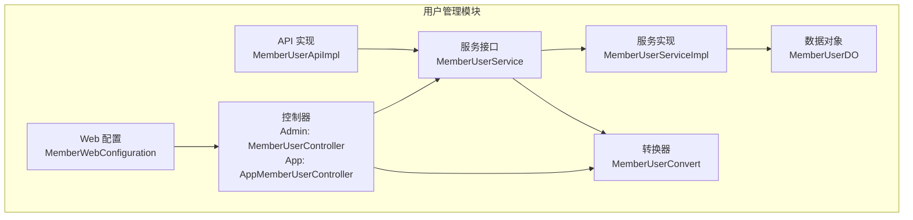
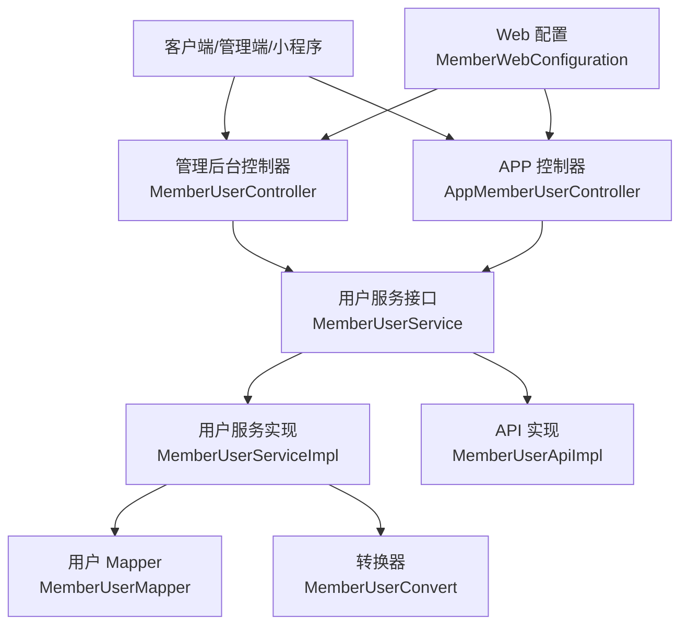
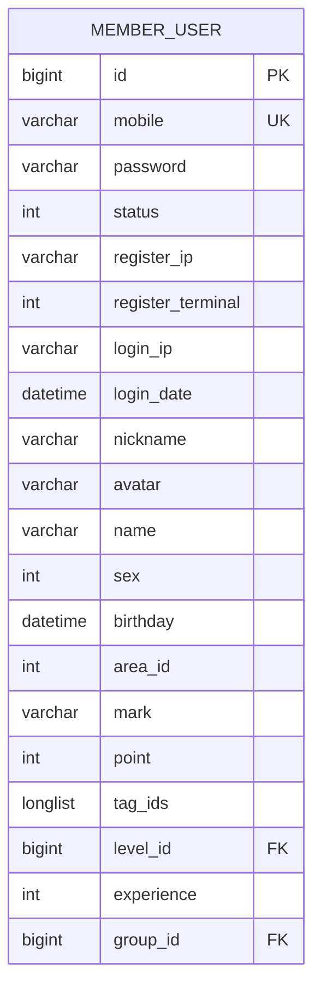
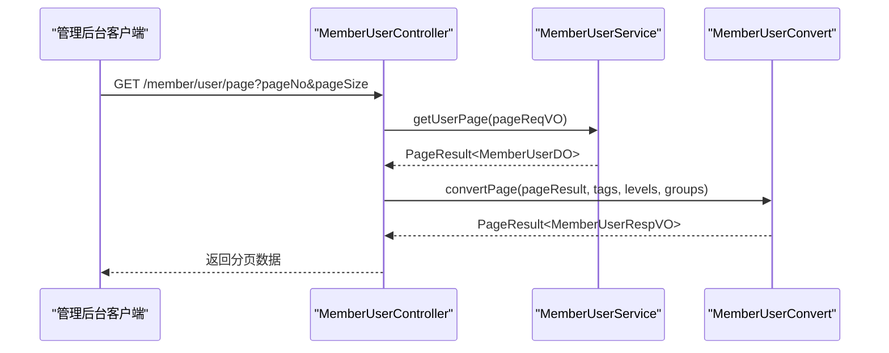
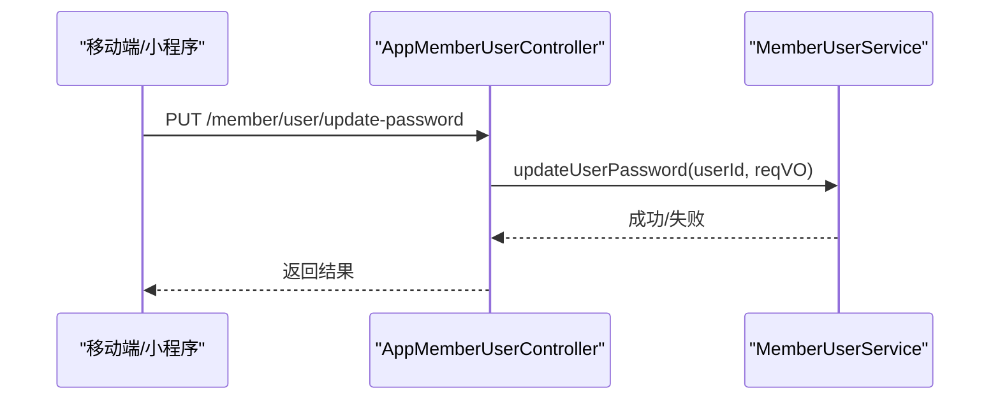
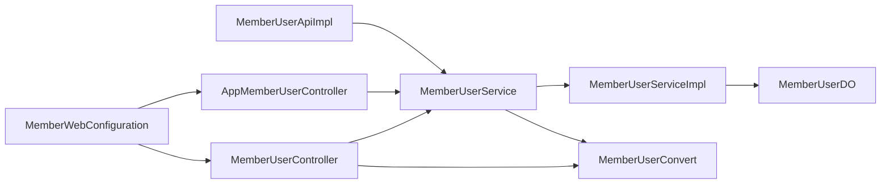

# 用户管理

<cite>
**本文引用的文件**
- [MemberUserController.java](file://backend/yudao-module-member/src/main/java/cn/iocoder/yudao/module/member/controller/admin/user/MemberUserController.java)
- [AppMemberUserController.java](file://backend/yudao-module-member/src/main/java/cn/iocoder/yudao/module/member/controller/app/user/AppMemberUserController.java)
- [MemberUserService.java](file://backend/yudao-module-member/src/main/java/cn/iocoder/yudao/module/member/service/user/MemberUserService.java)
- [MemberUserApiImpl.java](file://backend/yudao-module-member/src/main/java/cn/iocoder/yudao/module/member/api/user/MemberUserApiImpl.java)
- [MemberUserDO.java](file://backend/yudao-module-member/src/main/java/cn/iocoder/yudao/module/member/dal/dataobject/user/MemberUserDO.java)
- [MemberUserRespVO.java](file://backend/yudao-module-member/src/main/java/cn/iocoder/yudao/module/member/controller/admin/user/vo/MemberUserRespVO.java)
- [MemberUserConvert.java](file://backend/yudao-module-member/src/main/java/cn/iocoder/yudao/module/member/convert/user/MemberUserConvert.java)
- [MemberWebConfiguration.java](file://backend/yudao-module-member/src/main/java/cn/iocoder/yudao/module/member/framework/web/config/MemberWebConfiguration.java)
- [package-info.java](file://backend/yudao-module-member/src/main/java/cn/iocoder/yudao/module/member/package-info.java)
</cite>

## 目录
1. [简介](#简介)
2. [项目结构](#项目结构)
3. [核心组件](#核心组件)
4. [架构总览](#架构总览)
5. [详细组件分析](#详细组件分析)
6. [依赖分析](#依赖分析)
7. [性能考虑](#性能考虑)
8. [故障排查指南](#故障排查指南)
9. [结论](#结论)
10. [附录](#附录)

## 简介
本文件系统性梳理并文档化“用户管理”能力，覆盖会员用户的注册、登录、信息管理、密码重置等核心功能；阐述用户数据模型设计、状态与权限控制、认证授权机制、会话管理、以及高级能力如用户数据迁移、批量导入导出与用户行为分析的实现思路。文档面向技术与非技术读者，既提供高层概览也包含代码级细节与可视化图示。

## 项目结构
用户管理模块位于后端 yudao-module-member 中，采用按职责分层组织：
- 控制层：admin 与 app 两套控制器，分别面向管理后台与移动端/小程序场景
- 服务层：用户服务接口与实现，负责业务逻辑编排
- 数据访问层：MyBatis Mapper 与 DO 对象，映射 member_user 表
- 转换层：MapStruct 转换器，统一 VO/DTO/DO 的映射
- API 封装：对外暴露用户查询与校验能力
- Web 配置：OpenAPI 分组配置，便于接口文档聚合

图表来源
- [MemberUserController.java:1-124](file://backend/yudao-module-member/src/main/java/cn/iocoder/yudao/module/member/controller/admin/user/MemberUserController.java#L1-L124)
- [AppMemberUserController.java:1-78](file://backend/yudao-module-member/src/main/java/cn/iocoder/yudao/module/member/controller/app/user/AppMemberUserController.java#L1-L78)
- [MemberUserService.java:1-191](file://backend/yudao-module-member/src/main/java/cn/iocoder/yudao/module/member/service/user/MemberUserService.java#L1-L191)
- [MemberUserApiImpl.java:1-59](file://backend/yudao-module-member/src/main/java/cn/iocoder/yudao/module/member/api/user/MemberUserApiImpl.java#L1-L59)
- [MemberUserDO.java:1-146](file://backend/yudao-module-member/src/main/java/cn/iocoder/yudao/module/member/dal/dataobject/user/MemberUserDO.java#L1-L146)
- [MemberUserConvert.java:1-69](file://backend/yudao-module-member/src/main/java/cn/iocoder/yudao/module/member/convert/user/MemberUserConvert.java#L1-L69)
- [MemberWebConfiguration.java:1-24](file://backend/yudao-module-member/src/main/java/cn/iocoder/yudao/module/member/framework/web/config/MemberWebConfiguration.java#L1-L24)

章节来源
- [package-info.java:1-9](file://backend/yudao-module-member/src/main/java/cn/iocoder/yudao/module/member/package-info.java#L1-L9)

## 核心组件
- 控制器
  - 管理后台控制器：提供用户更新、等级/积分调整、分页查询、详情查询等接口
  - APP 控制器：提供用户信息查询、基本信息修改、手机修改（含微信授权码）、密码修改、密码重置等接口
- 服务接口与实现
  - 用户服务接口定义了用户查询、创建、登录信息更新、密码校验、密码修改/重置、分页查询等方法
  - 服务实现承载具体业务逻辑（如手机号创建用户、密码加密、登录信息记录）
- 数据对象
  - MemberUserDO 描述用户表结构，包含账号信息、基础信息、积分/等级/标签/分组等字段
- 转换器
  - 统一 VO/DTO/DO 的映射，支持分页结果的关联数据填充
- API 实现
  - 对外提供用户查询与存在性校验能力，供其他模块调用
- Web 配置
  - OpenAPI 分组，使用户相关接口在文档中聚合展示

章节来源
- [MemberUserController.java:54-121](file://backend/yudao-module-member/src/main/java/cn/iocoder/yudao/module/member/controller/admin/user/MemberUserController.java#L54-L121)
- [AppMemberUserController.java:34-76](file://backend/yudao-module-member/src/main/java/cn/iocoder/yudao/module/member/controller/app/user/AppMemberUserController.java#L34-L76)
- [MemberUserService.java:20-191](file://backend/yudao-module-member/src/main/java/cn/iocoder/yudao/module/member/service/user/MemberUserService.java#L20-L191)
- [MemberUserDO.java:21-146](file://backend/yudao-module-member/src/main/java/cn/iocoder/yudao/module/member/dal/dataobject/user/MemberUserDO.java#L21-L146)
- [MemberUserConvert.java:24-69](file://backend/yudao-module-member/src/main/java/cn/iocoder/yudao/module/member/convert/user/MemberUserConvert.java#L24-L69)
- [MemberUserApiImpl.java:22-59](file://backend/yudao-module-member/src/main/java/cn/iocoder/yudao/module/member/api/user/MemberUserApiImpl.java#L22-L59)
- [MemberWebConfiguration.java:13-24](file://backend/yudao-module-member/src/main/java/cn/iocoder/yudao/module/member/framework/web/config/MemberWebConfiguration.java#L13-L24)

## 架构总览
用户管理遵循“控制器-服务-数据访问-转换”的分层架构，结合权限注解与 OpenAPI 文档分组，形成清晰的边界与职责划分。

图表来源
- [MemberUserController.java:41-52](file://backend/yudao-module-member/src/main/java/cn/iocoder/yudao/module/member/controller/admin/user/MemberUserController.java#L41-L52)
- [AppMemberUserController.java:27-32](file://backend/yudao-module-member/src/main/java/cn/iocoder/yudao/module/member/controller/app/user/AppMemberUserController.java#L27-L32)
- [MemberUserService.java:20-191](file://backend/yudao-module-member/src/main/java/cn/iocoder/yudao/module/member/service/user/MemberUserService.java#L20-L191)
- [MemberUserApiImpl.java:24-27](file://backend/yudao-module-member/src/main/java/cn/iocoder/yudao/module/member/api/user/MemberUserApiImpl.java#L24-L27)
- [MemberWebConfiguration.java:19-22](file://backend/yudao-module-member/src/main/java/cn/iocoder/yudao/module/member/framework/web/config/MemberWebConfiguration.java#L19-L22)

## 详细组件分析

### 数据模型设计（MemberUserDO）
- 账号信息：用户ID、手机号、加密密码、状态、注册/登录IP与时间、注册终端
- 基础信息：昵称、头像、真实姓名、性别、出生日期、所在地、备注
- 其他信息：积分、标签集合（LongListTypeHandler 存储）、等级ID、经验、分组ID
- 设计要点
  - 使用 BCrypt 密码加密，无需手动盐值处理
  - 注册手机号建立唯一索引（uk_mobile），保证唯一性
  - 使用租户基类，支持多租户隔离
  - 地区ID与枚举类型配合，便于前端渲染

图表来源
- [MemberUserDO.java:28-146](file://backend/yudao-module-member/src/main/java/cn/iocoder/yudao/module/member/dal/dataobject/user/MemberUserDO.java#L28-L146)

章节来源
- [MemberUserDO.java:35-146](file://backend/yudao-module-member/src/main/java/cn/iocoder/yudao/module/member/dal/dataobject/user/MemberUserDO.java#L35-L146)

### 管理后台接口（MemberUserController）
- 接口清单
  - PUT /member/user/update：管理员更新会员用户信息（权限：member:user:update）
  - PUT /member/user/update-level：管理员更新会员用户等级（权限：member:user:update-level）
  - PUT /member/user/update-point：管理员调整会员用户积分（权限：member:user:update-point）
  - GET /member/user/get?id=：根据ID获取会员用户详情（权限：member:user:query）
  - GET /member/user/page：分页查询会员用户（权限：member:user:query）
- 关联数据处理
  - 分页查询时，批量加载标签、等级、分组名称，回填到响应VO
- 权限控制
  - 使用 @PreAuthorize 注解，基于权限字符串进行细粒度控制

图表来源
- [MemberUserController.java:98-121](file://backend/yudao-module-member/src/main/java/cn/iocoder/yudao/module/member/controller/admin/user/MemberUserController.java#L98-L121)
- [MemberUserConvert.java:50-66](file://backend/yudao-module-member/src/main/java/cn/iocoder/yudao/module/member/convert/user/MemberUserConvert.java#L50-L66)

章节来源
- [MemberUserController.java:54-121](file://backend/yudao-module-member/src/main/java/cn/iocoder/yudao/module/member/controller/admin/user/MemberUserController.java#L54-L121)

### APP 接口（AppMemberUserController）
- 接口清单
  - GET /member/user/get：获取当前登录用户信息（含等级名称）
  - PUT /member/user/update：修改基本信息
  - PUT /member/user/update-mobile：修改手机（短信验证码）
  - PUT /member/user/update-mobile-by-weixin：基于微信授权码修改手机
  - PUT /member/user/update-password：修改密码
  - PUT /member/user/reset-password：忘记密码重置（开放接口）
- 会话与鉴权
  - 通过登录上下文获取当前用户ID，保障操作仅限本人
  - 修改密码与重置密码接口对当前登录用户生效

图表来源
- [AppMemberUserController.java:63-68](file://backend/yudao-module-member/src/main/java/cn/iocoder/yudao/module/member/controller/app/user/AppMemberUserController.java#L63-L68)
- [MemberUserService.java:110-122](file://backend/yudao-module-member/src/main/java/cn/iocoder/yudao/module/member/service/user/MemberUserService.java#L110-L122)

章节来源
- [AppMemberUserController.java:34-76](file://backend/yudao-module-member/src/main/java/cn/iocoder/yudao/module/member/controller/app/user/AppMemberUserController.java#L34-L76)
- [MemberUserService.java:85-122](file://backend/yudao-module-member/src/main/java/cn/iocoder/yudao/module/member/service/user/MemberUserService.java#L85-L122)

### 用户服务接口（MemberUserService）
- 关键方法
  - 用户查询：按手机号、昵称模糊匹配、按ID/IDs 查询
  - 用户创建：基于手机号或昵称/头像创建用户
  - 登录信息更新：记录最后登录IP与时间
  - 密码相关：密码校验、修改、重置
  - 管理员操作：更新用户信息、分页查询、等级/积分调整
- 设计要点
  - 方法命名区分“管理员”与“会员”两类操作，避免混淆
  - 密码采用 BCrypt 加密，提供明文比对方法

章节来源
- [MemberUserService.java:20-191](file://backend/yudao-module-member/src/main/java/cn/iocoder/yudao/module/member/service/user/MemberUserService.java#L20-L191)

### API 封装（MemberUserApiImpl）
- 能力
  - 获取单个/多个用户、按昵称模糊查询
  - 校验用户是否存在（不存在抛出异常）
- 适用场景
  - 其他模块需要读取用户信息或进行存在性校验时复用

章节来源
- [MemberUserApiImpl.java:22-59](file://backend/yudao-module-member/src/main/java/cn/iocoder/yudao/module/member/api/user/MemberUserApiImpl.java#L22-L59)

### 转换器（MemberUserConvert）
- 职责
  - VO/DTO/DO 之间的映射
  - 分页结果的关联数据填充（标签名、等级名、分组名）
- 性能优化
  - 使用 Map 进行批量映射，减少多次查询

章节来源
- [MemberUserConvert.java:24-69](file://backend/yudao-module-member/src/main/java/cn/iocoder/yudao/module/member/convert/user/MemberUserConvert.java#L24-L69)

### Web 配置（MemberWebConfiguration）
- 职责
  - 为 member 模块注册 OpenAPI 分组，聚合用户相关接口文档
- 影响
  - 便于统一查看与调试用户管理接口

章节来源
- [MemberWebConfiguration.java:13-24](file://backend/yudao-module-member/src/main/java/cn/iocoder/yudao/module/member/framework/web/config/MemberWebConfiguration.java#L13-L24)

## 依赖分析
- 控制器依赖服务接口，服务实现依赖 Mapper 与转换器
- 管理后台控制器同时依赖标签、等级、分组服务，用于分页查询时的关联数据回显
- API 实现依赖服务接口，提供跨模块的用户查询能力

图表来源
- [MemberUserController.java:43-52](file://backend/yudao-module-member/src/main/java/cn/iocoder/yudao/module/member/controller/admin/user/MemberUserController.java#L43-L52)
- [AppMemberUserController.java:29-32](file://backend/yudao-module-member/src/main/java/cn/iocoder/yudao/module/member/controller/app/user/AppMemberUserController.java#L29-L32)
- [MemberUserApiImpl.java:24-27](file://backend/yudao-module-member/src/main/java/cn/iocoder/yudao/module/member/api/user/MemberUserApiImpl.java#L24-L27)
- [MemberWebConfiguration.java:19-22](file://backend/yudao-module-member/src/main/java/cn/iocoder/yudao/module/member/framework/web/config/MemberWebConfiguration.java#L19-L22)

## 性能考虑
- 分页查询的 N+1 关联数据问题
  - 已通过一次性批量加载标签、等级、分组并映射填充解决
- 密码存储与校验
  - 使用 BCrypt，安全性高；注意不要在日志中输出明文或哈希
- 唯一性约束
  - 手机号唯一索引 uk_mobile，避免重复注册
- 批量操作
  - 建议在管理后台提供批量更新等级/积分/标签的能力，减少请求次数

## 故障排查指南
- 常见问题
  - 手机号重复注册：检查 uk_mobile 唯一索引与创建逻辑
  - 密码修改失败：确认传入明文与 BCrypt 匹配逻辑
  - 分页查询缺少等级/标签名称：确认已调用批量加载与映射填充
  - 权限不足：核对权限字符串与 @PreAuthorize 注解
- 排查步骤
  - 查看控制器参数校验与权限注解
  - 定位服务层方法与数据访问层 SQL
  - 检查转换器映射是否完整
  - 核对 OpenAPI 文档分组是否正确

章节来源
- [MemberUserController.java:54-121](file://backend/yudao-module-member/src/main/java/cn/iocoder/yudao/module/member/controller/admin/user/MemberUserController.java#L54-L121)
- [AppMemberUserController.java:34-76](file://backend/yudao-module-member/src/main/java/cn/iocoder/yudao/module/member/controller/app/user/AppMemberUserController.java#L34-L76)
- [MemberUserConvert.java:50-66](file://backend/yudao-module-member/src/main/java/cn/iocoder/yudao/module/member/convert/user/MemberUserConvert.java#L50-L66)

## 结论
用户管理模块以清晰的分层架构实现了从注册、登录、信息维护到权限控制与数据展示的完整闭环。通过 VO/DTO/DO 的统一转换、权限注解与 OpenAPI 分组，既保证了扩展性，又提升了可维护性。建议后续补充批量导入导出与用户行为分析能力，进一步完善用户生命周期管理。

## 附录

### 用户 API 接口一览（按场景）
- 管理后台
  - PUT /member/user/update：更新会员用户（权限：member:user:update）
  - PUT /member/user/update-level：更新会员用户等级（权限：member:user:update-level）
  - PUT /member/user/update-point：更新会员用户积分（权限：member:user:update-point）
  - GET /member/user/get?id=：获取会员用户详情（权限：member:user:query）
  - GET /member/user/page：分页查询会员用户（权限：member:user:query）
- APP/小程序
  - GET /member/user/get：获取当前用户信息
  - PUT /member/user/update：修改基本信息
  - PUT /member/user/update-mobile：修改手机（短信验证码）
  - PUT /member/user/update-mobile-by-weixin：基于微信授权码修改手机
  - PUT /member/user/update-password：修改密码
  - PUT /member/user/reset-password：忘记密码重置（开放）

章节来源
- [MemberUserController.java:54-121](file://backend/yudao-module-member/src/main/java/cn/iocoder/yudao/module/member/controller/admin/user/MemberUserController.java#L54-L121)
- [AppMemberUserController.java:34-76](file://backend/yudao-module-member/src/main/java/cn/iocoder/yudao/module/member/controller/app/user/AppMemberUserController.java#L34-L76)

### 认证授权与会话管理
- 会话获取
  - 通过登录上下文获取当前用户ID，确保操作主体正确
- 权限控制
  - 使用 @PreAuthorize 基于权限字符串进行细粒度控制
- 安全策略
  - 密码使用 BCrypt 加密；禁止在日志中输出敏感信息

章节来源
- [AppMemberUserController.java:19-20](file://backend/yudao-module-member/src/main/java/cn/iocoder/yudao/module/member/controller/app/user/AppMemberUserController.java#L19-L20)
- [MemberUserController.java:56-67](file://backend/yudao-module-member/src/main/java/cn/iocoder/yudao/module/member/controller/admin/user/MemberUserController.java#L56-L67)

### 用户状态管理
- 状态字段
  - MemberUserDO.status：账户状态（启用/停用等）
- 管理建议
  - 提供状态变更接口与审计日志，便于风控与合规

章节来源
- [MemberUserDO.java:55-59](file://backend/yudao-module-member/src/main/java/cn/iocoder/yudao/module/member/dal/dataobject/user/MemberUserDO.java#L55-L59)

### 高级功能实现方案（建议）
- 用户数据迁移
  - 建议提供导入模板与校验规则，支持批量创建用户并设置初始等级/积分/标签
- 批量导入导出
  - 导出：按筛选条件生成 CSV/Excel，包含基础信息、等级、积分、标签、分组
  - 导入：校验手机号唯一性与格式，失败项单独列出
- 用户行为分析
  - 基于登录IP、时间、设备信息统计活跃度与画像，结合标签/等级进行分群

[本节为概念性内容，不涉及具体文件分析]