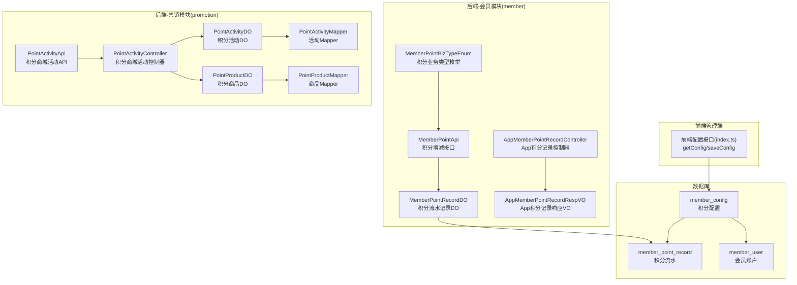
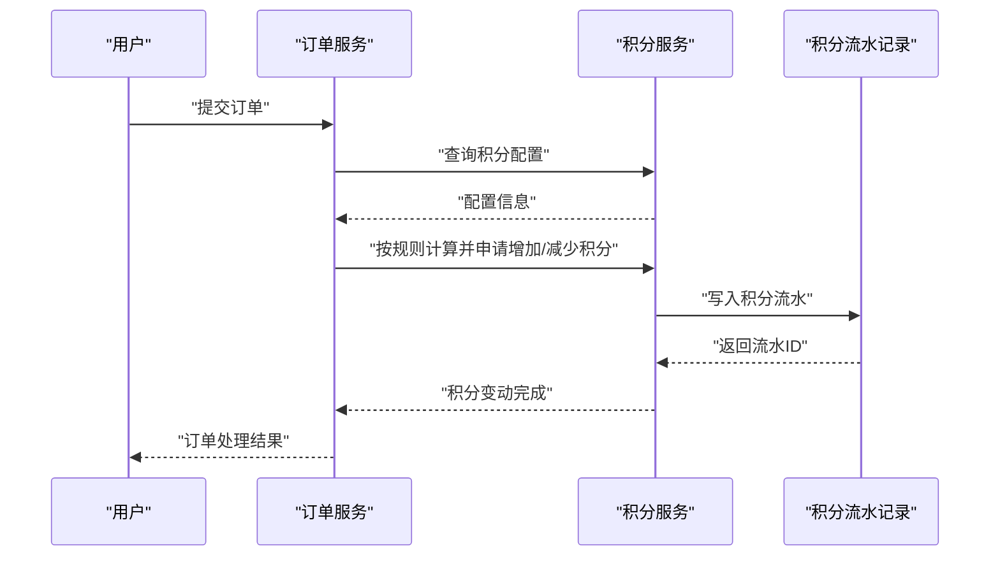
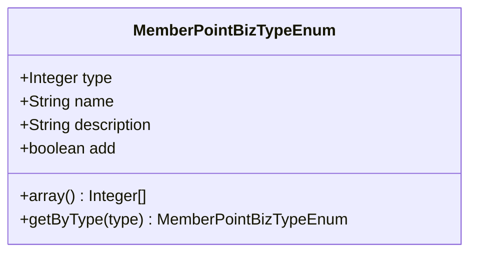
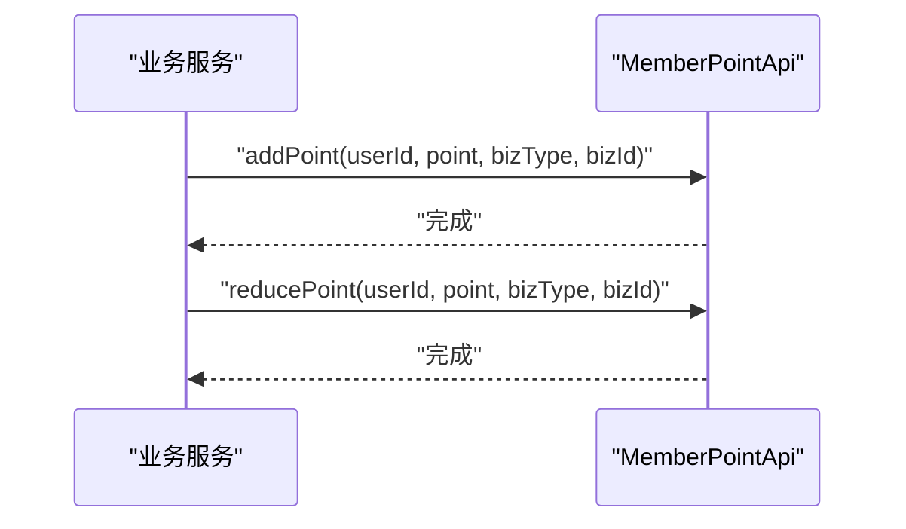
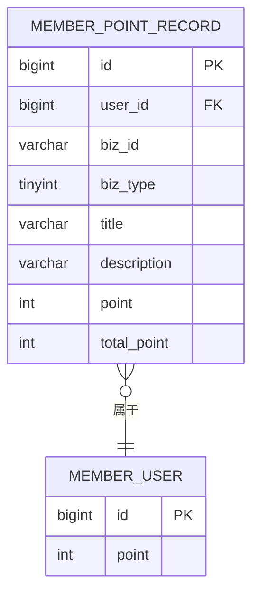
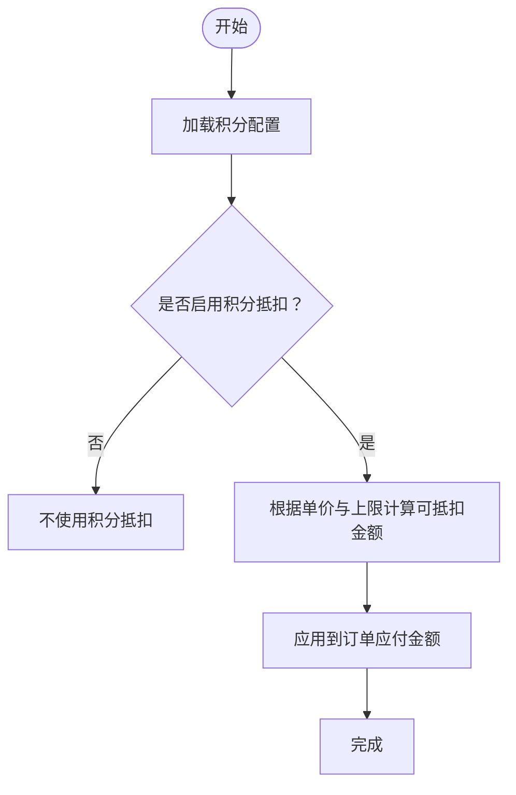
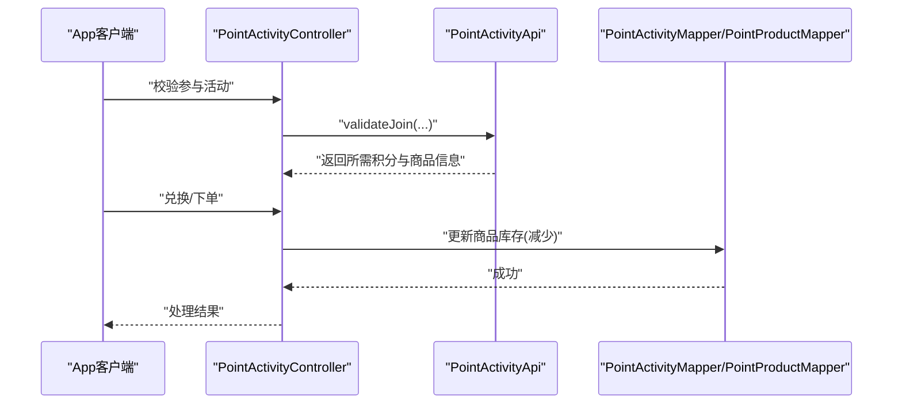
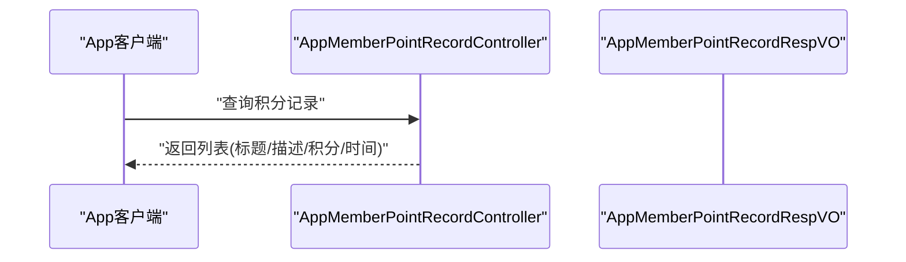
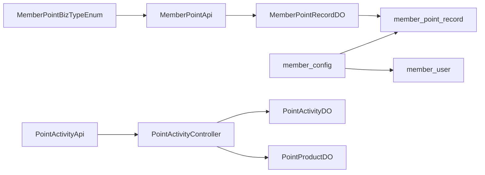

# 积分管理

<cite>
**本文引用的文件**
- [MemberPointBizTypeEnum.java](file://backend/yudao-module-member/src/main/java/cn/iocoder/yudao/module/member/enums/point/MemberPointBizTypeEnum.java)
- [MemberPointApi.java](file://backend/yudao-module-member/src/main/java/cn/iocoder/yudao/module/member/api/point/MemberPointApi.java)
- [MemberPointRecordDO.java](file://backend/yudao-module-member/src/main/java/cn/iocoder/yudao/module/member/dal/dataobject/point/MemberPointRecordDO.java)
- [MemberPointRecordController.java](file://backend/yudao-module-member/src/main/java/cn/iocoder/yudao/module/member/controller/app/point/AppMemberPointRecordController.java)
- [AppMemberPointRecordRespVO.java](file://backend/yudao-module-member/src/main/java/cn/iocoder/yudao/module/member/controller/app/point/vo/AppMemberPointRecordRespVO.java)
- [member-2024-01-18.sql](file://backend/sql/module/member-2024-01-18.sql)
- [PointActivityApi.java](file://backend/yudao-module-mall/yudao-module-promotion/src/main/java/cn/iocoder/yudao/module/promotion/api/point/PointActivityApi.java)
- [PointActivityApiImpl.java](file://backend/yudao-module-mall/yudao-module-promotion/src/main/java/cn/iocoder/yudao/module/promotion/api/point/PointActivityApiImpl.java)
- [PointValidateJoinRespDTO.java](file://backend/yudao-module-mall/yudao-module-promotion/src/main/java/cn/iocoder/yudao/module/promotion/api/point/dto/PointValidateJoinRespDTO.java)
- [PointActivityController.java](file://backend/yudao-module-mall/yudao-module-promotion/src/main/java/cn/iocoder/yudao/module/promotion/controller/admin/point/PointActivityController.java)
- [PointActivityDO.java](file://backend/yudao-module-mall/yudao-module-promotion/src/main/java/cn/iocoder/yudao/module/promotion/dal/dataobject/point/PointActivityDO.java)
- [PointProductDO.java](file://backend/yudao-module-mall/yudao-module-promotion/src/main/java/cn/iocoder/yudao/module/promotion/dal/dataobject/point/PointProductDO.java)
- [PointActivityMapper.java](file://backend/yudao-module-mall/yudao-module-promotion/src/main/java/cn/iocoder/yudao/module/promotion/dal/mysql/point/PointActivityMapper.java)
- [PointProductMapper.java](file://backend/yudao-module-mall/yudao-module-promotion/src/main/java/cn/iocoder/yudao/module/promotion/dal/mysql/point/PointProductMapper.java)
- [index.ts](file://frontend/admin-vue3/src/api/member/config/index.ts)
</cite>

## 目录
1. [简介](#简介)
2. [项目结构](#项目结构)
3. [核心组件](#核心组件)
4. [架构总览](#架构总览)
5. [详细组件分析](#详细组件分析)
6. [依赖分析](#依赖分析)
7. [性能考虑](#性能考虑)
8. [故障排查指南](#故障排查指南)
9. [结论](#结论)
10. [附录](#附录)

## 简介
本文件面向“会员积分管理系统”，系统性梳理积分获取规则、消费抵扣、积分兑换（积分商城）、积分类型枚举、积分流水记录、积分账户管理、API 设计、积分计算算法、有效期管理、与订单/优惠券/等级的关联关系，并提供营销活动配置方案、风控策略与性能优化建议。文档以仓库现有代码为依据，结合数据库脚本与前后端接口定义进行说明。

## 项目结构
积分相关能力主要分布在以下模块与文件中：
- 后端会员模块（member）：积分业务类型枚举、积分 API、积分记录 DO、前端控制器与 VO
- 后端营销模块（promotion）：积分商城活动 API、控制器与数据对象
- 数据库脚本：member_config、member_point_record、member_user 等表结构与初始数据
- 前端管理端：积分配置接口定义

**图表来源**
- [MemberPointBizTypeEnum.java:15-58](file://backend/yudao-module-member/src/main/java/cn/iocoder/yudao/module/member/enums/point/MemberPointBizTypeEnum.java#L15-L58)
- [MemberPointApi.java:12-36](file://backend/yudao-module-member/src/main/java/cn/iocoder/yudao/module/member/api/point/MemberPointApi.java#L12-L36)
- [MemberPointRecordDO.java:23-69](file://backend/yudao-module-member/src/main/java/cn/iocoder/yudao/module/member/dal/dataobject/point/MemberPointRecordDO.java#L23-L69)
- [AppMemberPointRecordController.java](file://backend/yudao-module-member/src/main/java/cn/iocoder/yudao/module/member/controller/app/point/AppMemberPointRecordController.java)
- [AppMemberPointRecordRespVO.java:10-27](file://backend/yudao-module-member/src/main/java/cn/iocoder/yudao/module/member/controller/app/point/vo/AppMemberPointRecordRespVO.java#L10-L27)
- [PointActivityApi.java:1-33](file://backend/yudao-module-mall/yudao-module-promotion/src/main/java/cn/iocoder/yudao/module/promotion/api/point/PointActivityApi.java#L1-L33)
- [PointActivityController.java:33-108](file://backend/yudao-module-mall/yudao-module-promotion/src/main/java/cn/iocoder/yudao/module/promotion/controller/admin/point/PointActivityController.java#L33-L108)
- [PointActivityDO.java](file://backend/yudao-module-mall/yudao-module-promotion/src/main/java/cn/iocoder/yudao/module/promotion/dal/dataobject/point/PointActivityDO.java)
- [PointProductDO.java](file://backend/yudao-module-mall/yudao-module-promotion/src/main/java/cn/iocoder/yudao/module/promotion/dal/dataobject/point/PointProductDO.java)
- [PointActivityMapper.java](file://backend/yudao-module-mall/yudao-module-promotion/src/main/java/cn/iocoder/yudao/module/promotion/dal/mysql/point/PointActivityMapper.java)
- [PointProductMapper.java](file://backend/yudao-module-mall/yudao-module-promotion/src/main/java/cn/iocoder/yudao/module/promotion/dal/mysql/point/PointProductMapper.java)
- [member-2024-01-18.sql:50-73](file://backend/sql/module/member-2024-01-18.sql#L50-L73)
- [member-2024-01-18.sql:192-220](file://backend/sql/module/member-2024-01-18.sql#L192-L220)
- [member-2024-01-18.sql:298-329](file://backend/sql/module/member-2024-01-18.sql#L298-L329)
- [index.ts:1-19](file://frontend/admin-vue3/src/api/member/config/index.ts#L1-L19)

**章节来源**
- [MemberPointBizTypeEnum.java:15-58](file://backend/yudao-module-member/src/main/java/cn/iocoder/yudao/module/member/enums/point/MemberPointBizTypeEnum.java#L15-L58)
- [MemberPointApi.java:12-36](file://backend/yudao-module-member/src/main/java/cn/iocoder/yudao/module/member/api/point/MemberPointApi.java#L12-L36)
- [MemberPointRecordDO.java:23-69](file://backend/yudao-module-member/src/main/java/cn/iocoder/yudao/module/member/dal/dataobject/point/MemberPointRecordDO.java#L23-L69)
- [AppMemberPointRecordController.java](file://backend/yudao-module-member/src/main/java/cn/iocoder/yudao/module/member/controller/app/point/AppMemberPointRecordController.java)
- [AppMemberPointRecordRespVO.java:10-27](file://backend/yudao-module-member/src/main/java/cn/iocoder/yudao/module/member/controller/app/point/vo/AppMemberPointRecordRespVO.java#L10-L27)
- [PointActivityApi.java:1-33](file://backend/yudao-module-mall/yudao-module-promotion/src/main/java/cn/iocoder/yudao/module/promotion/api/point/PointActivityApi.java#L1-L33)
- [PointActivityController.java:33-108](file://backend/yudao-module-mall/yudao-module-promotion/src/main/java/cn/iocoder/yudao/module/promotion/controller/admin/point/PointActivityController.java#L33-L108)
- [PointActivityDO.java](file://backend/yudao-module-mall/yudao-module-promotion/src/main/java/cn/iocoder/yudao/module/promotion/dal/dataobject/point/PointActivityDO.java)
- [PointProductDO.java](file://backend/yudao-module-mall/yudao-module-promotion/src/main/java/cn/iocoder/yudao/module/promotion/dal/dataobject/point/PointProductDO.java)
- [PointActivityMapper.java](file://backend/yudao-module-mall/yudao-module-promotion/src/main/java/cn/iocoder/yudao/module/promotion/dal/mysql/point/PointActivityMapper.java)
- [PointProductMapper.java](file://backend/yudao-module-mall/yudao-module-promotion/src/main/java/cn/iocoder/yudao/module/promotion/dal/mysql/point/PointProductMapper.java)
- [member-2024-01-18.sql:50-73](file://backend/sql/module/member-2024-01-18.sql#L50-L73)
- [member-2024-01-18.sql:192-220](file://backend/sql/module/member-2024-01-18.sql#L192-L220)
- [member-2024-01-18.sql:298-329](file://backend/sql/module/member-2024-01-18.sql#L298-L329)
- [index.ts:1-19](file://frontend/admin-vue3/src/api/member/config/index.ts#L1-L19)

## 核心组件
- 积分业务类型枚举：定义签到、管理员调整、订单抵扣/奖励及其取消/退款场景，区分“是否为正向增加”
- 积分 API：对外暴露增加/减少积分的能力，参数包含用户 ID、积分数量、业务类型、业务编号
- 积分流水记录 DO：持久化积分流水，字段包括用户 ID、业务 ID/类型、标题/描述、变动积分、变动后余额
- 积分配置：控制积分抵扣开关、单价、上限、每元赠送积分等
- 积分商城活动：支持下单前校验是否参与活动、更新库存（减少/增加）

**章节来源**
- [MemberPointBizTypeEnum.java:15-58](file://backend/yudao-module-member/src/main/java/cn/iocoder/yudao/module/member/enums/point/MemberPointBizTypeEnum.java#L15-L58)
- [MemberPointApi.java:12-36](file://backend/yudao-module-member/src/main/java/cn/iocoder/yudao/module/member/api/point/MemberPointApi.java#L12-L36)
- [MemberPointRecordDO.java:23-69](file://backend/yudao-module-member/src/main/java/cn/iocoder/yudao/module/member/dal/dataobject/point/MemberPointRecordDO.java#L23-L69)
- [member-2024-01-18.sql:50-73](file://backend/sql/module/member-2024-01-18.sql#L50-L73)
- [PointActivityApi.java:1-33](file://backend/yudao-module-mall/yudao-module-promotion/src/main/java/cn/iocoder/yudao/module/promotion/api/point/PointActivityApi.java#L1-L33)

## 架构总览
系统围绕“会员账户”“积分流水”“积分配置”“积分商城活动”四条主线协作：
- 会员账户持有当前积分余额；积分流水记录每次变动
- 积分配置决定抵扣策略（是否启用、单价、上限、每元赠送）
- 订单流程触发积分增减（支付获得、取消/退款处理）
- 积分商城活动提供积分兑换通道

**图表来源**
- [MemberPointApi.java:12-36](file://backend/yudao-module-member/src/main/java/cn/iocoder/yudao/module/member/api/point/MemberPointApi.java#L12-L36)
- [MemberPointRecordDO.java:23-69](file://backend/yudao-module-member/src/main/java/cn/iocoder/yudao/module/member/dal/dataobject/point/MemberPointRecordDO.java#L23-L69)
- [member-2024-01-18.sql:50-73](file://backend/sql/module/member-2024-01-18.sql#L50-L73)

## 详细组件分析

### 组件一：积分业务类型枚举（MemberPointBizTypeEnum）
- 覆盖签到、管理员调整、订单抵扣（整单/单项）、订单奖励（整单/单项）
- 字段包含类型、名称、描述、是否为正向增加，便于统一处理与展示
- 提供按类型查询方法，便于业务侧快速匹配

**图表来源**
- [MemberPointBizTypeEnum.java:15-58](file://backend/yudao-module-member/src/main/java/cn/iocoder/yudao/module/member/enums/point/MemberPointBizTypeEnum.java#L15-L58)

**章节来源**
- [MemberPointBizTypeEnum.java:15-58](file://backend/yudao-module-member/src/main/java/cn/iocoder/yudao/module/member/enums/point/MemberPointBizTypeEnum.java#L15-L58)

### 组件二：积分 API（MemberPointApi）
- 增加积分：传入用户 ID、正数积分、业务类型、业务编号
- 减少积分：传入用户 ID、正数积分、业务类型、业务编号
- 业务类型由枚举约束，确保一致性与可追溯性

**图表来源**
- [MemberPointApi.java:12-36](file://backend/yudao-module-member/src/main/java/cn/iocoder/yudao/module/member/api/point/MemberPointApi.java#L12-L36)

**章节来源**
- [MemberPointApi.java:12-36](file://backend/yudao-module-member/src/main/java/cn/iocoder/yudao/module/member/api/point/MemberPointApi.java#L12-L36)

### 组件三：积分流水记录（MemberPointRecordDO）
- 字段覆盖用户 ID、业务 ID/类型、标题/描述、变动积分、变动后余额
- 与数据库表 member_point_record 对应，支持按用户与标题索引查询

**图表来源**
- [MemberPointRecordDO.java:23-69](file://backend/yudao-module-member/src/main/java/cn/iocoder/yudao/module/member/dal/dataobject/point/MemberPointRecordDO.java#L23-L69)
- [member-2024-01-18.sql:192-220](file://backend/sql/module/member-2024-01-18.sql#L192-L220)
- [member-2024-01-18.sql:298-329](file://backend/sql/module/member-2024-01-18.sql#L298-L329)

**章节来源**
- [MemberPointRecordDO.java:23-69](file://backend/yudao-module-member/src/main/java/cn/iocoder/yudao/module/member/dal/dataobject/point/MemberPointRecordDO.java#L23-L69)
- [member-2024-01-18.sql:192-220](file://backend/sql/module/member-2024-01-18.sql#L192-L220)
- [member-2024-01-18.sql:298-329](file://backend/sql/module/member-2024-01-18.sql#L298-L329)

### 组件四：积分配置与抵扣策略
- 表 member_config 存储积分抵扣开关、单价（分）、最大抵扣金额、每元赠送积分
- 前端通过 GET /member/config/get 与 PUT /member/config/save 获取与保存配置
- 抵扣单价与上限用于订单结算时的积分抵扣计算

**图表来源**
- [member-2024-01-18.sql:50-73](file://backend/sql/module/member-2024-01-18.sql#L50-L73)
- [index.ts:1-19](file://frontend/admin-vue3/src/api/member/config/index.ts#L1-L19)

**章节来源**
- [member-2024-01-18.sql:50-73](file://backend/sql/module/member-2024-01-18.sql#L50-L73)
- [index.ts:1-19](file://frontend/admin-vue3/src/api/member/config/index.ts#L1-L19)

### 组件五：积分商城活动（PointActivity）
- API 支持下单前校验是否参与活动、更新库存（减少/增加）
- 控制器提供创建、更新、关闭、删除、查询、分页等管理能力
- 数据对象包含活动与商品信息，Mapper 负责持久化

**图表来源**
- [PointActivityApi.java:1-33](file://backend/yudao-module-mall/yudao-module-promotion/src/main/java/cn/iocoder/yudao/module/promotion/api/point/PointActivityApi.java#L1-L33)
- [PointActivityApiImpl.java:1-200](file://backend/yudao-module-mall/yudao-module-promotion/src/main/java/cn/iocoder/yudao/module/promotion/api/point/PointActivityApiImpl.java#L1-L200)
- [PointActivityController.java:33-108](file://backend/yudao-module-mall/yudao-module-promotion/src/main/java/cn/iocoder/yudao/module/promotion/controller/admin/point/PointActivityController.java#L33-L108)
- [PointActivityDO.java](file://backend/yudao-module-mall/yudao-module-promotion/src/main/java/cn/iocoder/yudao/module/promotion/dal/dataobject/point/PointActivityDO.java)
- [PointProductDO.java](file://backend/yudao-module-mall/yudao-module-promotion/src/main/java/cn/iocoder/yudao/module/promotion/dal/dataobject/point/PointProductDO.java)
- [PointActivityMapper.java](file://backend/yudao-module-mall/yudao-module-promotion/src/main/java/cn/iocoder/yudao/module/promotion/dal/mysql/point/PointActivityMapper.java)
- [PointProductMapper.java](file://backend/yudao-module-mall/yudao-module-promotion/src/main/java/cn/iocoder/yudao/module/promotion/dal/mysql/point/PointProductMapper.java)

**章节来源**
- [PointActivityApi.java:1-33](file://backend/yudao-module-mall/yudao-module-promotion/src/main/java/cn/iocoder/yudao/module/promotion/api/point/PointActivityApi.java#L1-L33)
- [PointActivityController.java:33-108](file://backend/yudao-module-mall/yudao-module-promotion/src/main/java/cn/iocoder/yudao/module/promotion/controller/admin/point/PointActivityController.java#L33-L108)
- [PointActivityDO.java](file://backend/yudao-module-mall/yudao-module-promotion/src/main/java/cn/iocoder/yudao/module/promotion/dal/dataobject/point/PointActivityDO.java)
- [PointProductDO.java](file://backend/yudao-module-mall/yudao-module-promotion/src/main/java/cn/iocoder/yudao/module/promotion/dal/dataobject/point/PointProductDO.java)
- [PointActivityMapper.java](file://backend/yudao-module-mall/yudao-module-promotion/src/main/java/cn/iocoder/yudao/module/promotion/dal/mysql/point/PointActivityMapper.java)
- [PointProductMapper.java](file://backend/yudao-module-mall/yudao-module-promotion/src/main/java/cn/iocoder/yudao/module/promotion/dal/mysql/point/PointProductMapper.java)

### 组件六：App 端积分记录展示
- AppMemberPointRecordController 提供积分记录查询
- AppMemberPointRecordRespVO 定义返回字段（标题、描述、积分、时间等）

**图表来源**
- [AppMemberPointRecordController.java](file://backend/yudao-module-member/src/main/java/cn/iocoder/yudao/module/member/controller/app/point/AppMemberPointRecordController.java)
- [AppMemberPointRecordRespVO.java:10-27](file://backend/yudao-module-member/src/main/java/cn/iocoder/yudao/module/member/controller/app/point/vo/AppMemberPointRecordRespVO.java#L10-L27)

**章节来源**
- [AppMemberPointRecordController.java](file://backend/yudao-module-member/src/main/java/cn/iocoder/yudao/module/member/controller/app/point/AppMemberPointRecordController.java)
- [AppMemberPointRecordRespVO.java:10-27](file://backend/yudao-module-member/src/main/java/cn/iocoder/yudao/module/member/controller/app/point/vo/AppMemberPointRecordRespVO.java#L10-L27)

## 依赖分析
- 低耦合：积分业务类型枚举与 API 解耦，便于扩展新业务类型
- 关系清晰：积分流水记录与会员账户存在外键关系，保证数据一致性
- 模块边界：积分配置在会员模块，积分商城在营销模块，职责清晰

**图表来源**
- [MemberPointBizTypeEnum.java:15-58](file://backend/yudao-module-member/src/main/java/cn/iocoder/yudao/module/member/enums/point/MemberPointBizTypeEnum.java#L15-L58)
- [MemberPointApi.java:12-36](file://backend/yudao-module-member/src/main/java/cn/iocoder/yudao/module/member/api/point/MemberPointApi.java#L12-L36)
- [MemberPointRecordDO.java:23-69](file://backend/yudao-module-member/src/main/java/cn/iocoder/yudao/module/member/dal/dataobject/point/MemberPointRecordDO.java#L23-L69)
- [member-2024-01-18.sql:50-73](file://backend/sql/module/member-2024-01-18.sql#L50-L73)
- [member-2024-01-18.sql:192-220](file://backend/sql/module/member-2024-01-18.sql#L192-L220)
- [member-2024-01-18.sql:298-329](file://backend/sql/module/member-2024-01-18.sql#L298-L329)
- [PointActivityApi.java:1-33](file://backend/yudao-module-mall/yudao-module-promotion/src/main/java/cn/iocoder/yudao/module/promotion/api/point/PointActivityApi.java#L1-L33)
- [PointActivityController.java:33-108](file://backend/yudao-module-mall/yudao-module-promotion/src/main/java/cn/iocoder/yudao/module/promotion/controller/admin/point/PointActivityController.java#L33-L108)
- [PointActivityDO.java](file://backend/yudao-module-mall/yudao-module-promotion/src/main/java/cn/iocoder/yudao/module/promotion/dal/dataobject/point/PointActivityDO.java)
- [PointProductDO.java](file://backend/yudao-module-mall/yudao-module-promotion/src/main/java/cn/iocoder/yudao/module/promotion/dal/dataobject/point/PointProductDO.java)

**章节来源**
- 同上图表来源

## 性能考虑
- 索引优化：member_point_record 已对 user_id、title 建立索引，建议在高频查询条件上保持合理索引
- 写入削峰：积分流水写入量大，可通过消息队列异步化或批量入库降低数据库压力
- 缓存策略：会员积分余额可缓存于 Redis，读多写少场景下显著降低 DB 压力
- 分页查询：App 端积分记录建议分页，避免一次性拉取大量数据
- 配置读取：积分配置可缓存，减少频繁访问数据库

[本节为通用建议，无需特定文件引用]

## 故障排查指南
- 积分抵扣异常
  - 检查 member_config 中抵扣开关、单价、上限是否正确
  - 确认订单结算时是否按配置计算
- 积分流水缺失
  - 核对 MemberPointApi 是否被调用
  - 检查 MemberPointRecordDO 字段与数据库表字段映射
- 积分商城库存不一致
  - 核对 PointActivityApi 的库存更新逻辑
  - 检查并发场景下的库存扣减/回滚

**章节来源**
- [member-2024-01-18.sql:50-73](file://backend/sql/module/member-2024-01-18.sql#L50-L73)
- [MemberPointApi.java:12-36](file://backend/yudao-module-member/src/main/java/cn/iocoder/yudao/module/member/api/point/MemberPointApi.java#L12-L36)
- [MemberPointRecordDO.java:23-69](file://backend/yudao-module-member/src/main/java/cn/iocoder/yudao/module/member/dal/dataobject/point/MemberPointRecordDO.java#L23-L69)
- [PointActivityApi.java:1-33](file://backend/yudao-module-mall/yudao-module-promotion/src/main/java/cn/iocoder/yudao/module/promotion/api/point/PointActivityApi.java#L1-L33)

## 结论
本系统以“业务类型枚举+积分 API+流水记录+配置管理+积分商城活动”为核心，形成闭环的积分管理体系。通过清晰的模块划分与数据模型，既能满足日常积分获取、抵扣、兑换需求，也为后续扩展营销活动与风控策略提供了良好基础。

[本节为总结，无需特定文件引用]

## 附录

### A. 积分获取规则
- 订单奖励：支付成功后按规则赠送积分（业务类型：订单奖励）
- 签到奖励：按签到配置发放积分
- 管理员调整：人工调整积分

**章节来源**
- [MemberPointBizTypeEnum.java:15-58](file://backend/yudao-module-member/src/main/java/cn/iocoder/yudao/module/member/enums/point/MemberPointBizTypeEnum.java#L15-L58)
- [member-2024-01-18.sql:223-246](file://backend/sql/module/member-2024-01-18.sql#L223-L246)

### B. 消费抵扣
- 开关、单价、上限由 member_config 控制
- 订单结算时按配置计算可抵扣金额并应用到应付金额

**章节来源**
- [member-2024-01-18.sql:50-73](file://backend/sql/module/member-2024-01-18.sql#L50-L73)

### C. 积分兑换（积分商城）
- 下单前校验是否参与活动
- 兑换时减少库存与用户积分
- 支持取消/退款场景的库存与积分回滚

**章节来源**
- [PointActivityApi.java:1-33](file://backend/yudao-module-mall/yudao-module-promotion/src/main/java/cn/iocoder/yudao/module/promotion/api/point/PointActivityApi.java#L1-L33)
- [PointActivityController.java:33-108](file://backend/yudao-module-mall/yudao-module-promotion/src/main/java/cn/iocoder/yudao/module/promotion/controller/admin/point/PointActivityController.java#L33-L108)

### D. 积分类型枚举与业务含义
- 签到、管理员调整、订单抵扣（整单/单项）、订单奖励（整单/单项）

**章节来源**
- [MemberPointBizTypeEnum.java:15-58](file://backend/yudao-module-member/src/main/java/cn/iocoder/yudao/module/member/enums/point/MemberPointBizTypeEnum.java#L15-L58)

### E. 积分流水记录字段说明
- 用户 ID、业务 ID/类型、标题/描述、变动积分、变动后余额

**章节来源**
- [MemberPointRecordDO.java:23-69](file://backend/yudao-module-member/src/main/java/cn/iocoder/yudao/module/member/dal/dataobject/point/MemberPointRecordDO.java#L23-L69)

### F. 积分账户管理
- 会员账户持有当前积分余额，积分流水记录每次变动后的累计值

**章节来源**
- [member-2024-01-18.sql:298-329](file://backend/sql/module/member-2024-01-18.sql#L298-L329)
- [member-2024-01-18.sql:192-220](file://backend/sql/module/member-2024-01-18.sql#L192-L220)

### G. API 接口设计要点
- 增加/减少积分：参数含用户 ID、正数积分、业务类型、业务编号
- 积分配置：GET /member/config/get、PUT /member/config/save

**章节来源**
- [MemberPointApi.java:12-36](file://backend/yudao-module-member/src/main/java/cn/iocoder/yudao/module/member/api/point/MemberPointApi.java#L12-L36)
- [index.ts:1-19](file://frontend/admin-vue3/src/api/member/config/index.ts#L1-L19)

### H. 积分计算算法
- 抵扣金额 = min(订单应付金额, 积分余额 × 单价上限)
- 奖励积分 = 订单金额 × 每元赠送积分

**章节来源**
- [member-2024-01-18.sql:50-73](file://backend/sql/module/member-2024-01-18.sql#L50-L73)

### I. 积分有效期管理
- 当前代码未体现积分有效期字段与到期逻辑；如需引入，可在 member_user 或新增表中扩展字段，并配合定时任务清理过期积分

[本小节为扩展建议，无需特定文件引用]

### J. 与订单、优惠券、等级的关联
- 订单：抵扣与奖励均与订单生命周期绑定
- 优惠券：抵扣策略与优惠券叠加规则需在订单结算处统一处理
- 等级：等级与经验相关，积分与等级无直接字段关联，但可作为升级经验值的来源之一

**章节来源**
- [member-2024-01-18.sql:132-158](file://backend/sql/module/member-2024-01-18.sql#L132-L158)
- [member-2024-01-18.sql:76-97](file://backend/sql/module/member-2024-01-18.sql#L76-L97)

### K. 积分营销活动配置方案
- 活动类型：满额抵扣、满额赠积分、限时兑换
- 规则：设置门槛金额、抵扣比例/上限、赠积分数量、活动时间窗口
- 配置入口：管理端活动管理页面，支持启停与编辑

[本小节为方案建议，无需特定文件引用]

### L. 积分风控策略
- 单日/单月积分变动阈值报警
- 异常用户行为识别（短时间内大量签到/兑换）
- 限制同一设备/账号的异常操作频率
- 对高价值商品兑换设置额外校验

[本小节为策略建议，无需特定文件引用]