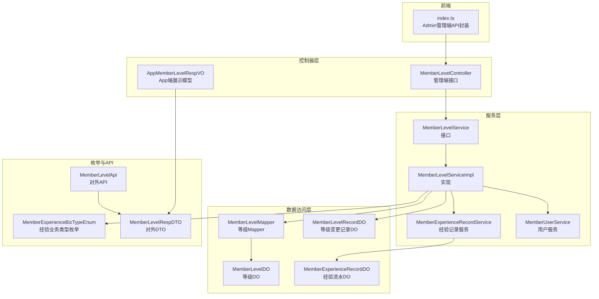
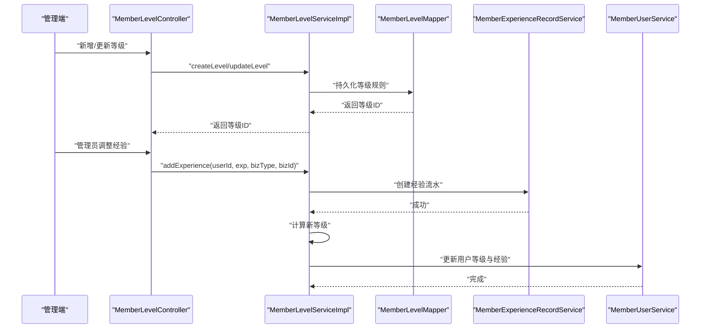
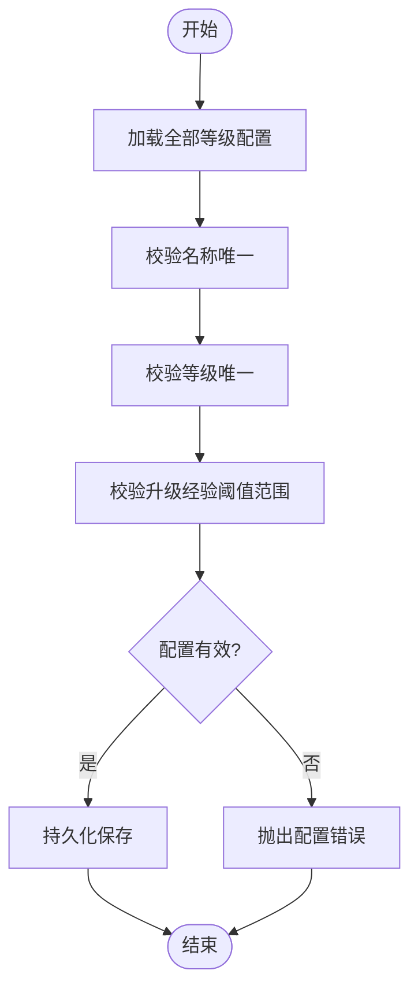
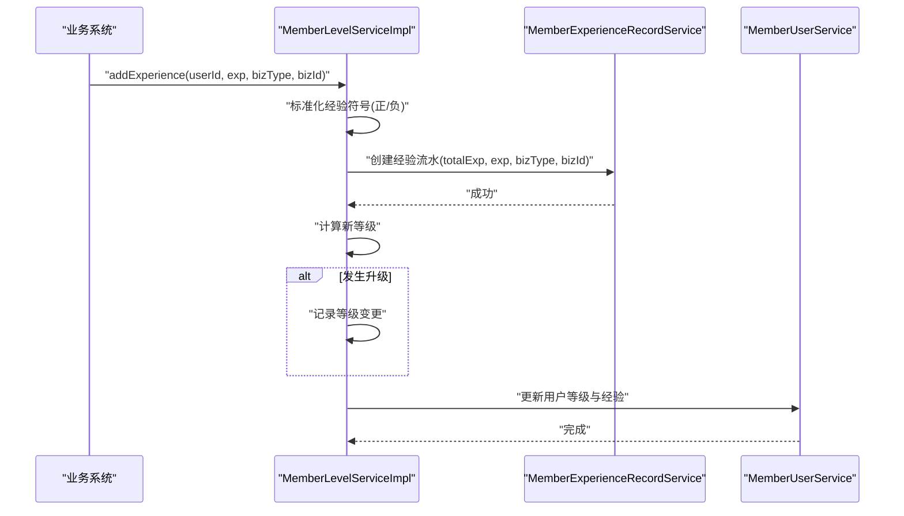
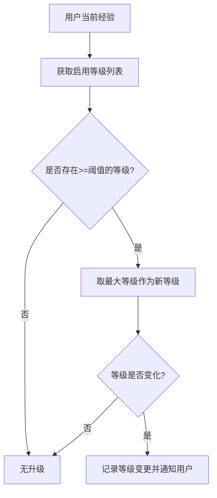
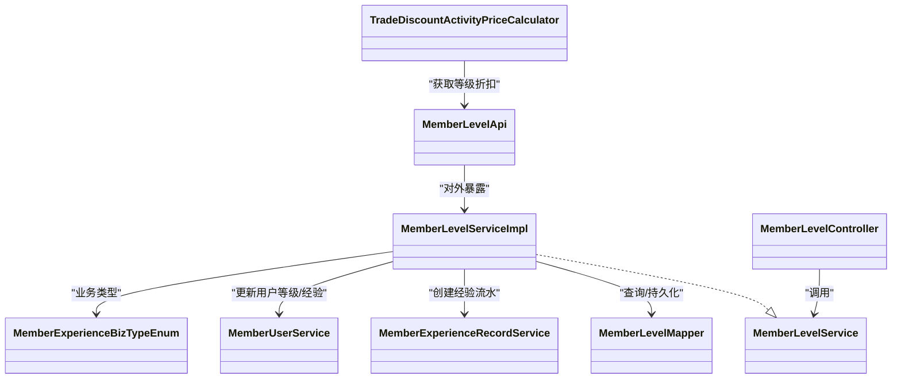

# 等级管理

<cite>
**本文引用的文件**
- [MemberLevelService.java](file://backend/yudao-module-member/src/main/java/cn/iocoder/yudao/module/member/service/level/MemberLevelService.java)
- [MemberLevelServiceImpl.java](file://backend/yudao-module-member/src/main/java/cn/iocoder/yudao/module/member/service/level/MemberLevelServiceImpl.java)
- [MemberLevelController.java](file://backend/yudao-module-member/src/main/java/cn/iocoder/yudao/module/member/controller/admin/level/MemberLevelController.java)
- [MemberLevelMapper.java](file://backend/yudao-module-member/src/main/java/cn/iocoder/yudao/module/member/dal/mysql/level/MemberLevelMapper.java)
- [MemberLevelDO.java](file://backend/yudao-module-member/src/main/java/cn/iocoder/yudao/module/member/dal/dataobject/level/MemberLevelDO.java)
- [MemberLevelRecordDO.java](file://backend/yudao-module-member/src/main/java/cn/iocoder/yudao/module/member/dal/dataobject/level/MemberLevelRecordDO.java)
- [MemberExperienceRecordDO.java](file://backend/yudao-module-member/src/main/java/cn/iocoder/yudao/module/member/dal/dataobject/level/MemberExperienceRecordDO.java)
- [MemberExperienceBizTypeEnum.java](file://backend/yudao-module-member/src/main/java/cn/iocoder/yudao/module/member/enums/MemberExperienceBizTypeEnum.java)
- [MemberExperienceRecordService.java](file://backend/yudao-module-member/src/main/java/cn/iocoder/yudao/module/member/service/level/MemberExperienceRecordService.java)
- [MemberUserService.java](file://backend/yudao-module-member/src/main/java/cn/iocoder/yudao/module/member/service/user/MemberUserService.java)
- [MemberLevelApi.java](file://backend/yudao-module-member/src/main/java/cn/iocoder/yudao/module/member/api/level/MemberLevelApi.java)
- [MemberLevelRespDTO.java](file://backend/yudao-module-member/src/main/java/cn/iocoder/yudao/module/member/api/level/dto/MemberLevelRespDTO.java)
- [AppMemberLevelRespVO.java](file://backend/yudao-module-member/src/main/java/cn/iocoder/yudao/module/member/controller/app/level/vo/level/AppMemberLevelRespVO.java)
- [TradeDiscountActivityPriceCalculator.java](file://backend/yudao-module-mall/yudao-module-trade/src/main/java/cn/iocoder/yudao/module/trade/service/price/calculator/TradeDiscountActivityPriceCalculator.java)
- [index.ts](file://frontend/admin-vue3/src/api/member/level/index.ts)
</cite>

## 目录
1. [简介](#简介)
2. [项目结构](#项目结构)
3. [核心组件](#核心组件)
4. [架构总览](#架构总览)
5. [详细组件分析](#详细组件分析)
6. [依赖关系分析](#依赖关系分析)
7. [性能考量](#性能考量)
8. [故障排查指南](#故障排查指南)
9. [结论](#结论)
10. [附录](#附录)

## 简介
本文件面向“会员等级管理系统”的设计与实现，围绕等级规则配置、经验值计算机制、等级升级条件、特权配置与权益管理、等级 API 接口、规则引擎与经验值流水记录展开，帮助产品、研发与运营人员全面理解系统能力与使用方式，并提供配置方案与最佳实践建议。

## 项目结构
等级管理模块位于后端 yudao-module-member 中，采用典型的分层架构：
- 控制器层：Admin 管理端接口与 App 端展示模型
- 服务层：等级规则校验、经验值计算与等级升降级处理
- 数据访问层：MyBatis Mapper 与 DO 数据对象
- 枚举与 API：业务类型枚举、对外 API 接口与 DTO
- 前端对接：Admin Vue3 管理端 API 封装

图表来源
- [MemberLevelController.java:1-81](file://backend/yudao-module-member/src/main/java/cn/iocoder/yudao/module/member/controller/admin/level/MemberLevelController.java#L1-L81)
- [MemberLevelService.java:1-103](file://backend/yudao-module-member/src/main/java/cn/iocoder/yudao/module/member/service/level/MemberLevelService.java#L1-L103)
- [MemberLevelServiceImpl.java:1-299](file://backend/yudao-module-member/src/main/java/cn/iocoder/yudao/module/member/service/level/MemberLevelServiceImpl.java#L1-L299)
- [MemberLevelMapper.java:1-34](file://backend/yudao-module-member/src/main/java/cn/iocoder/yudao/module/member/dal/mysql/level/MemberLevelMapper.java#L1-L34)
- [MemberLevelDO.java:1-64](file://backend/yudao-module-member/src/main/java/cn/iocoder/yudao/module/member/dal/dataobject/level/MemberLevelDO.java#L1-L64)
- [MemberLevelRecordDO.java:1-72](file://backend/yudao-module-member/src/main/java/cn/iocoder/yudao/module/member/dal/dataobject/level/MemberLevelRecordDO.java#L1-L72)
- [MemberExperienceRecordDO.java:1-64](file://backend/yudao-module-member/src/main/java/cn/iocoder/yudao/module/member/dal/dataobject/level/MemberExperienceRecordDO.java#L1-L64)
- [MemberExperienceBizTypeEnum.java:1-52](file://backend/yudao-module-member/src/main/java/cn/iocoder/yudao/module/member/enums/MemberExperienceBizTypeEnum.java#L1-L52)
- [MemberExperienceRecordService.java:1-54](file://backend/yudao-module-member/src/main/java/cn/iocoder/yudao/module/member/service/level/MemberExperienceRecordService.java#L1-L54)
- [MemberUserService.java:1-191](file://backend/yudao-module-member/src/main/java/cn/iocoder/yudao/module/member/service/user/MemberUserService.java#L1-L191)
- [MemberLevelApi.java:1-41](file://backend/yudao-module-member/src/main/java/cn/iocoder/yudao/module/member/api/level/MemberLevelApi.java#L1-L41)
- [MemberLevelRespDTO.java:1-41](file://backend/yudao-module-member/src/main/java/cn/iocoder/yudao/module/member/api/level/dto/MemberLevelRespDTO.java#L1-L41)
- [AppMemberLevelRespVO.java:1-28](file://backend/yudao-module-member/src/main/java/cn/iocoder/yudao/module/member/controller/app/level/vo/level/AppMemberLevelRespVO.java#L1-L28)
- [index.ts:1-42](file://frontend/admin-vue3/src/api/member/level/index.ts#L1-L42)

章节来源
- [MemberLevelController.java:1-81](file://backend/yudao-module-member/src/main/java/cn/iocoder/yudao/module/member/controller/admin/level/MemberLevelController.java#L1-L81)
- [MemberLevelService.java:1-103](file://backend/yudao-module-member/src/main/java/cn/iocoder/yudao/module/member/service/level/MemberLevelService.java#L1-L103)
- [MemberLevelServiceImpl.java:1-299](file://backend/yudao-module-member/src/main/java/cn/iocoder/yudao/module/member/service/level/MemberLevelServiceImpl.java#L1-L299)
- [MemberLevelMapper.java:1-34](file://backend/yudao-module-member/src/main/java/cn/iocoder/yudao/module/member/dal/mysql/level/MemberLevelMapper.java#L1-L34)
- [MemberLevelDO.java:1-64](file://backend/yudao-module-member/src/main/java/cn/iocoder/yudao/module/member/dal/dataobject/level/MemberLevelDO.java#L1-L64)
- [MemberLevelRecordDO.java:1-72](file://backend/yudao-module-member/src/main/java/cn/iocoder/yudao/module/member/dal/dataobject/level/MemberLevelRecordDO.java#L1-L72)
- [MemberExperienceRecordDO.java:1-64](file://backend/yudao-module-member/src/main/java/cn/iocoder/yudao/module/member/dal/dataobject/level/MemberExperienceRecordDO.java#L1-L64)
- [MemberExperienceBizTypeEnum.java:1-52](file://backend/yudao-module-member/src/main/java/cn/iocoder/yudao/module/member/enums/MemberExperienceBizTypeEnum.java#L1-L52)
- [MemberExperienceRecordService.java:1-54](file://backend/yudao-module-member/src/main/java/cn/iocoder/yudao/module/member/service/level/MemberExperienceRecordService.java#L1-L54)
- [MemberUserService.java:1-191](file://backend/yudao-module-member/src/main/java/cn/iocoder/yudao/module/member/service/user/MemberUserService.java#L1-L191)
- [MemberLevelApi.java:1-41](file://backend/yudao-module-member/src/main/java/cn/iocoder/yudao/module/member/api/level/MemberLevelApi.java#L1-L41)
- [MemberLevelRespDTO.java:1-41](file://backend/yudao-module-member/src/main/java/cn/iocoder/yudao/module/member/api/level/dto/MemberLevelRespDTO.java#L1-L41)
- [AppMemberLevelRespVO.java:1-28](file://backend/yudao-module-member/src/main/java/cn/iocoder/yudao/module/member/controller/app/level/vo/level/AppMemberLevelRespVO.java#L1-L28)
- [index.ts:1-42](file://frontend/admin-vue3/src/api/member/level/index.ts#L1-L42)

## 核心组件
- 等级规则配置
  - 等级名称、等级值、升级经验阈值、折扣百分比、图标与背景、状态
  - 通过 MemberLevelDO 与 MemberLevelMapper 进行持久化与查询
- 经验值计算与流水
  - 经验业务类型枚举定义各类业务场景（下单、签到、抽奖、邀新、取消等）
  - 经验流水记录与等级变更记录分别存储，便于审计与回溯
- 等级升级条件
  - 当前经验值达到某等级的“升级经验”阈值时触发升级
  - 仅当匹配到更高等级且等级发生变化时才产生升级
- 特权与权益
  - 等级折扣在交易价格计算中生效，体现等级特权
- 对外 API
  - 提供获取等级、增加/减少经验等能力，支持业务系统集成

章节来源
- [MemberLevelDO.java:1-64](file://backend/yudao-module-member/src/main/java/cn/iocoder/yudao/module/member/dal/dataobject/level/MemberLevelDO.java#L1-L64)
- [MemberLevelMapper.java:1-34](file://backend/yudao-module-member/src/main/java/cn/iocoder/yudao/module/member/dal/mysql/level/MemberLevelMapper.java#L1-L34)
- [MemberExperienceBizTypeEnum.java:1-52](file://backend/yudao-module-member/src/main/java/cn/iocoder/yudao/module/member/enums/MemberExperienceBizTypeEnum.java#L1-L52)
- [MemberExperienceRecordDO.java:1-64](file://backend/yudao-module-member/src/main/java/cn/iocoder/yudao/module/member/dal/dataobject/level/MemberExperienceRecordDO.java#L1-L64)
- [MemberLevelRecordDO.java:1-72](file://backend/yudao-module-member/src/main/java/cn/iocoder/yudao/module/member/dal/dataobject/level/MemberLevelRecordDO.java#L1-L72)
- [TradeDiscountActivityPriceCalculator.java:140-154](file://backend/yudao-module-mall/yudao-module-trade/src/main/java/cn/iocoder/yudao/module/trade/service/price/calculator/TradeDiscountActivityPriceCalculator.java#L140-L154)
- [MemberLevelApi.java:1-41](file://backend/yudao-module-member/src/main/java/cn/iocoder/yudao/module/member/api/level/MemberLevelApi.java#L1-L41)

## 架构总览
等级管理从“配置—计算—记录—应用”闭环运行：
- 配置阶段：Admin 后台维护等级规则（名称、等级值、升级经验、折扣、状态）
- 计算阶段：根据业务类型与经验值变动，计算是否升级
- 记录阶段：写入经验流水与等级变更记录
- 应用阶段：等级折扣在交易价格计算中生效，App 展示等级信息

图表来源
- [MemberLevelController.java:1-81](file://backend/yudao-module-member/src/main/java/cn/iocoder/yudao/module/member/controller/admin/level/MemberLevelController.java#L1-L81)
- [MemberLevelServiceImpl.java:1-299](file://backend/yudao-module-member/src/main/java/cn/iocoder/yudao/module/member/service/level/MemberLevelServiceImpl.java#L1-L299)
- [MemberLevelMapper.java:1-34](file://backend/yudao-module-member/src/main/java/cn/iocoder/yudao/module/member/dal/mysql/level/MemberLevelMapper.java#L1-L34)
- [MemberExperienceRecordService.java:1-54](file://backend/yudao-module-member/src/main/java/cn/iocoder/yudao/module/member/service/level/MemberExperienceRecordService.java#L1-L54)
- [MemberUserService.java:1-191](file://backend/yudao-module-member/src/main/java/cn/iocoder/yudao/module/member/service/user/MemberUserService.java#L1-L191)

## 详细组件分析

### 等级规则配置与校验
- 规则要素
  - 名称唯一性、等级值唯一性、升级经验阈值需满足“大于前一等级、小于下一等级”的连续递增约束
- 校验逻辑
  - 新增/更新时对上述三项进行一致性校验，防止配置冲突
  - 删除前检查是否存在用户绑定该等级，避免破坏数据完整性
- 查询与排序
  - 支持按状态与名称过滤，按等级升序排列，便于前端展示与计算

图表来源
- [MemberLevelServiceImpl.java:144-152](file://backend/yudao-module-member/src/main/java/cn/iocoder/yudao/module/member/service/level/MemberLevelServiceImpl.java#L144-L152)
- [MemberLevelMapper.java:19-31](file://backend/yudao-module-member/src/main/java/cn/iocoder/yudao/module/member/dal/mysql/level/MemberLevelMapper.java#L19-L31)

章节来源
- [MemberLevelServiceImpl.java:54-86](file://backend/yudao-module-member/src/main/java/cn/iocoder/yudao/module/member/service/level/MemberLevelServiceImpl.java#L54-L86)
- [MemberLevelServiceImpl.java:144-152](file://backend/yudao-module-member/src/main/java/cn/iocoder/yudao/module/member/service/level/MemberLevelServiceImpl.java#L144-L152)
- [MemberLevelMapper.java:19-31](file://backend/yudao-module-member/src/main/java/cn/iocoder/yudao/module/member/dal/mysql/level/MemberLevelMapper.java#L19-L31)

### 经验值计算与流水记录
- 业务类型
  - 包含管理员调整、邀新奖励、签到奖励、抽奖奖励、下单奖励及其取消/退款场景
- 流水规则
  - 经验流水记录包含业务类型、业务编号、标题、描述、经验变动与累计经验
  - 等级变更记录包含等级编号、等级值、折扣、升级经验、用户经验、备注与描述
- 计算流程
  - 根据用户当前经验与业务类型计算变动值（支持正负）
  - 防止经验扣减为负，确保非负边界
  - 若匹配到更高等级且等级发生变化，记录等级变更并通知用户

图表来源
- [MemberLevelServiceImpl.java:230-261](file://backend/yudao-module-member/src/main/java/cn/iocoder/yudao/module/member/service/level/MemberLevelServiceImpl.java#L230-L261)
- [MemberExperienceBizTypeEnum.java:16-28](file://backend/yudao-module-member/src/main/java/cn/iocoder/yudao/module/member/enums/MemberExperienceBizTypeEnum.java#L16-L28)
- [MemberExperienceRecordDO.java:24-64](file://backend/yudao-module-member/src/main/java/cn/iocoder/yudao/module/member/dal/dataobject/level/MemberExperienceRecordDO.java#L24-L64)
- [MemberLevelRecordDO.java:25-72](file://backend/yudao-module-member/src/main/java/cn/iocoder/yudao/module/member/dal/dataobject/level/MemberLevelRecordDO.java#L25-L72)

章节来源
- [MemberLevelServiceImpl.java:230-292](file://backend/yudao-module-member/src/main/java/cn/iocoder/yudao/module/member/service/level/MemberLevelServiceImpl.java#L230-L292)
- [MemberExperienceRecordService.java:40-52](file://backend/yudao-module-member/src/main/java/cn/iocoder/yudao/module/member/service/level/MemberExperienceRecordService.java#L40-L52)

### 等级升级条件与特权应用
- 升级条件
  - 当用户经验达到某等级的“升级经验”阈值时，系统取最大且不超过当前经验的等级作为新等级
- 特权应用
  - 等级折扣在交易价格计算中生效，体现等级特权
- 对外 API
  - 提供获取等级与增减经验的能力，便于业务系统接入

图表来源
- [MemberLevelServiceImpl.java:270-292](file://backend/yudao-module-member/src/main/java/cn/iocoder/yudao/module/member/service/level/MemberLevelServiceImpl.java#L270-L292)
- [TradeDiscountActivityPriceCalculator.java:140-154](file://backend/yudao-module-mall/yudao-module-trade/src/main/java/cn/iocoder/yudao/module/trade/service/price/calculator/TradeDiscountActivityPriceCalculator.java#L140-L154)
- [MemberLevelApi.java:19-41](file://backend/yudao-module-member/src/main/java/cn/iocoder/yudao/module/member/api/level/MemberLevelApi.java#L19-L41)

章节来源
- [MemberLevelServiceImpl.java:270-292](file://backend/yudao-module-member/src/main/java/cn/iocoder/yudao/module/member/service/level/MemberLevelServiceImpl.java#L270-L292)
- [TradeDiscountActivityPriceCalculator.java:140-154](file://backend/yudao-module-mall/yudao-module-trade/src/main/java/cn/iocoder/yudao/module/trade/service/price/calculator/TradeDiscountActivityPriceCalculator.java#L140-L154)
- [MemberLevelApi.java:19-41](file://backend/yudao-module-member/src/main/java/cn/iocoder/yudao/module/member/api/level/MemberLevelApi.java#L19-L41)

### 等级 API 接口与前端对接
- 管理端接口
  - 创建、更新、删除、查询等级，以及获取启用等级精简列表
- 对外 API
  - 提供获取等级与增减经验能力，供其他模块调用
- 前端对接
  - Admin Vue3 封装了等级列表、详情、创建、更新、删除等接口

章节来源
- [MemberLevelController.java:30-80](file://backend/yudao-module-member/src/main/java/cn/iocoder/yudao/module/member/controller/admin/level/MemberLevelController.java#L30-L80)
- [MemberLevelApi.java:19-41](file://backend/yudao-module-member/src/main/java/cn/iocoder/yudao/module/member/api/level/MemberLevelApi.java#L19-L41)
- [index.ts:14-42](file://frontend/admin-vue3/src/api/member/level/index.ts#L14-L42)

## 依赖关系分析
- 组件耦合
  - MemberLevelServiceImpl 依赖 MemberLevelMapper、MemberExperienceRecordService、MemberUserService
  - 与 MemberExperienceBizTypeEnum 枚举强关联，保证业务类型一致
- 外部依赖
  - 交易模块通过等级折扣参与价格计算，体现等级特权落地
- 循环依赖
  - 未发现循环依赖迹象，职责清晰

图表来源
- [MemberLevelService.java:1-103](file://backend/yudao-module-member/src/main/java/cn/iocoder/yudao/module/member/service/level/MemberLevelService.java#L1-L103)
- [MemberLevelServiceImpl.java:1-299](file://backend/yudao-module-member/src/main/java/cn/iocoder/yudao/module/member/service/level/MemberLevelServiceImpl.java#L1-L299)
- [MemberLevelMapper.java:1-34](file://backend/yudao-module-member/src/main/java/cn/iocoder/yudao/module/member/dal/mysql/level/MemberLevelMapper.java#L1-L34)
- [MemberExperienceRecordService.java:1-54](file://backend/yudao-module-member/src/main/java/cn/iocoder/yudao/module/member/service/level/MemberExperienceRecordService.java#L1-L54)
- [MemberUserService.java:1-191](file://backend/yudao-module-member/src/main/java/cn/iocoder/yudao/module/member/service/user/MemberUserService.java#L1-L191)
- [MemberExperienceBizTypeEnum.java:1-52](file://backend/yudao-module-member/src/main/java/cn/iocoder/yudao/module/member/enums/MemberExperienceBizTypeEnum.java#L1-L52)
- [MemberLevelController.java:1-81](file://backend/yudao-module-member/src/main/java/cn/iocoder/yudao/module/member/controller/admin/level/MemberLevelController.java#L1-L81)
- [MemberLevelApi.java:1-41](file://backend/yudao-module-member/src/main/java/cn/iocoder/yudao/module/member/api/level/MemberLevelApi.java#L1-L41)
- [TradeDiscountActivityPriceCalculator.java:140-154](file://backend/yudao-module-mall/yudao-module-trade/src/main/java/cn/iocoder/yudao/module/trade/service/price/calculator/TradeDiscountActivityPriceCalculator.java#L140-L154)

章节来源
- [MemberLevelServiceImpl.java:1-299](file://backend/yudao-module-member/src/main/java/cn/iocoder/yudao/module/member/service/level/MemberLevelServiceImpl.java#L1-L299)
- [MemberLevelController.java:1-81](file://backend/yudao-module-member/src/main/java/cn/iocoder/yudao/module/member/controller/admin/level/MemberLevelController.java#L1-L81)
- [TradeDiscountActivityPriceCalculator.java:140-154](file://backend/yudao-module-mall/yudao-module-trade/src/main/java/cn/iocoder/yudao/module/trade/service/price/calculator/TradeDiscountActivityPriceCalculator.java#L140-L154)

## 性能考量
- 等级计算复杂度
  - 计算新等级时对启用等级列表进行一次筛选与比较，时间复杂度近似 O(n)，n 为启用等级数量
- 数据一致性
  - 经验与等级更新采用事务包裹，确保经验流水、等级变更与用户信息同步
- 前端展示
  - 启用等级精简列表按等级升序返回，减少前端排序成本

## 故障排查指南
- 配置冲突
  - 名称重复、等级值重复、升级经验阈值不满足连续递增，均会触发相应异常
- 删除限制
  - 存在用户绑定等级时禁止删除，需先迁移或清空用户等级再执行删除
- 经验边界
  - 经验扣减不会出现负值，若出现异常需检查业务类型与传入经验符号

章节来源
- [MemberLevelServiceImpl.java:88-160](file://backend/yudao-module-member/src/main/java/cn/iocoder/yudao/module/member/service/level/MemberLevelServiceImpl.java#L88-L160)
- [MemberLevelServiceImpl.java:230-247](file://backend/yudao-module-member/src/main/java/cn/iocoder/yudao/module/member/service/level/MemberLevelServiceImpl.java#L230-L247)

## 结论
等级管理模块以“规则配置—经验计算—流水记录—特权应用”为主线，形成闭环的会员等级体系。通过严格的配置校验与事务保障，确保等级与经验数据的准确性；通过对外 API 与交易模块的折扣联动，使等级特权在业务中得到实际体现。建议在运营侧持续优化等级阈值与特权策略，结合前端与交易模块实现更好的用户体验与转化效果。

## 附录
- 等级与积分、消费金额、活跃度的关系
  - 本模块以“经验值”为核心驱动因素，通过业务类型枚举将不同行为转化为经验增量/减量
  - 积分与消费金额可通过业务类型映射到经验值，从而间接影响等级
- 等级营销活动配置方案与最佳实践
  - 活动设计：明确目标（拉新、复购、活跃），选择合适的业务类型（邀新、下单、签到、抽奖）
  - 阈值设计：保持升级经验阈值连续递增，避免“卡级”现象
  - 特权设计：折扣幅度与成本平衡，避免过度让利
  - 审计与回滚：保留经验流水与等级变更记录，便于活动复盘与问题定位