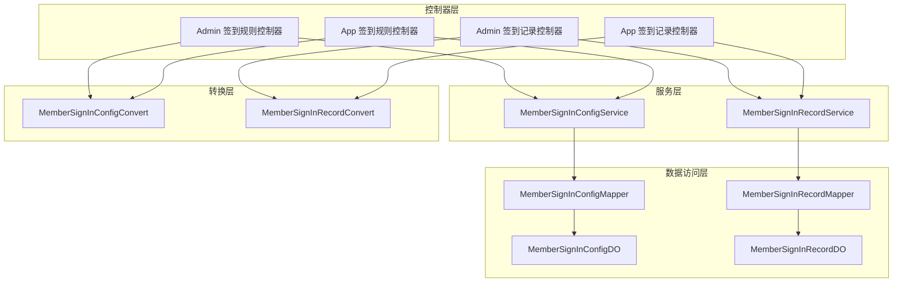
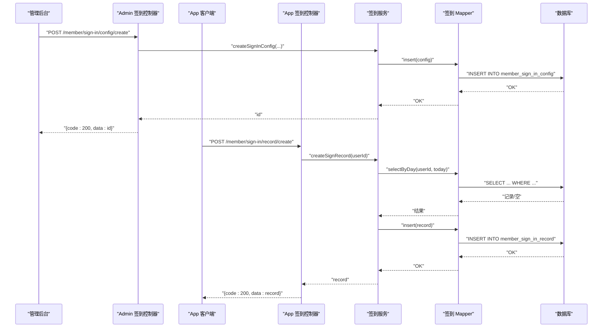
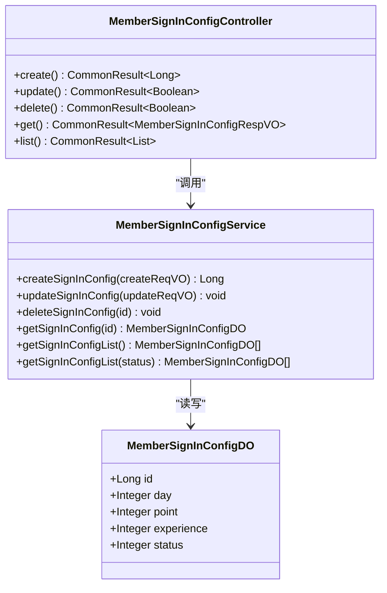
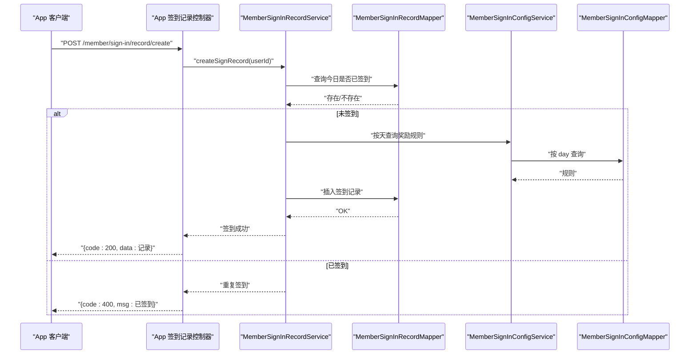
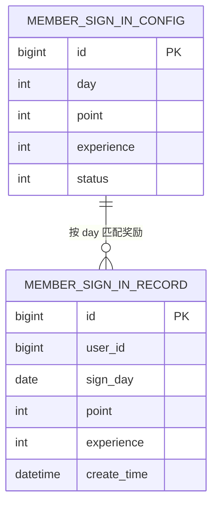
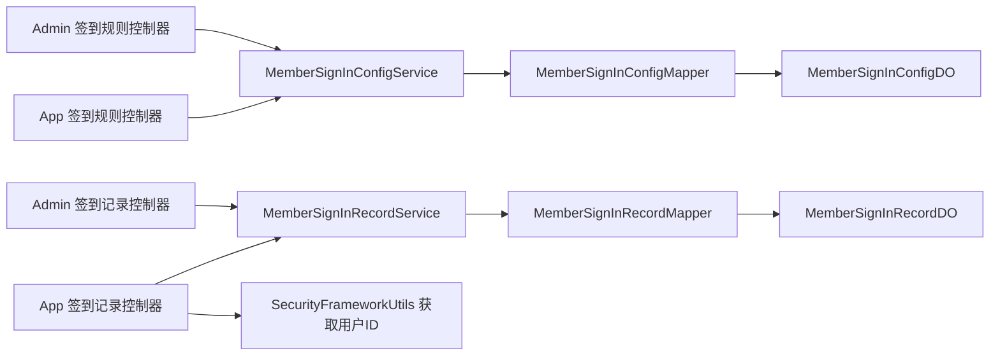
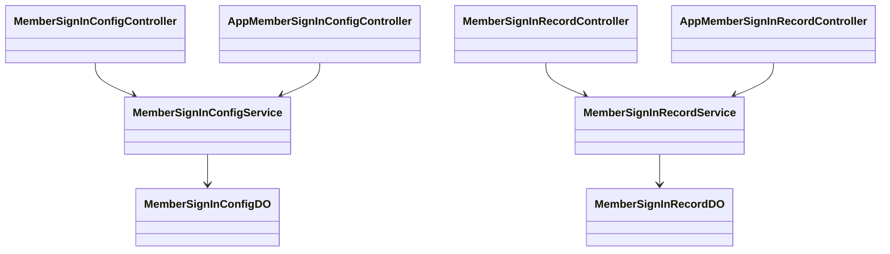

# 签到管理

<cite>
**本文引用的文件**
- [MemberSignInConfigController.java](file://backend/yudao-module-member/src/main/java/cn/iocoder/yudao/module/member/controller/admin/signin/MemberSignInConfigController.java)
- [MemberSignInRecordController.java](file://backend/yudao-module-member/src/main/java/cn/iocoder/yudao/module/member/controller/admin/signin/MemberSignInRecordController.java)
- [AppMemberSignInConfigController.java](file://backend/yudao-module-member/src/main/java/cn/iocoder/yudao/module/member/controller/app/signin/AppMemberSignInConfigController.java)
- [AppMemberSignInRecordController.java](file://backend/yudao-module-member/src/main/java/cn/iocoder/yudao/module/member/controller/app/signin/AppMemberSignInRecordController.java)
- [MemberSignInConfigService.java](file://backend/yudao-module-member/src/main/java/cn/iocoder/yudao/module/member/service/signin/MemberSignInConfigService.java)
- [MemberSignInRecordService.java](file://backend/yudao-module-member/src/main/java/cn/iocoder/yudao/module/member/service/signin/MemberSignInRecordService.java)
- [MemberSignInConfigDO.java](file://backend/yudao-module-member/src/main/java/cn/iocoder/yudao/module/member/dal/dataobject/signin/MemberSignInConfigDO.java)
- [MemberSignInRecordDO.java](file://backend/yudao-module-member/src/main/java/cn/iocoder/yudao/module/member/dal/dataobject/signin/MemberSignInRecordDO.java)
- [MemberSignInConfigMapper.java](file://backend/yudao-module-member/src/main/java/cn/iocoder/yudao/module/member/dal/mysql/signin/MemberSignInConfigMapper.java)
- [MemberSignInRecordMapper.java](file://backend/yudao-module-member/src/main/java/cn/iocoder/yudao/module/member/dal/mysql/signin/MemberSignInRecordMapper.java)
- [MemberSignInConfigConvert.java](file://backend/yudao-module-member/src/main/java/cn/iocoder/yudao/module/member/convert/signin/MemberSignInConfigConvert.java)
- [MemberSignInRecordConvert.java](file://backend/yudao-module-member/src/main/java/cn/iocoder/yudao/module/member/convert/signin/MemberSignInRecordConvert.java)
- [MemberSignInConfigCreateReqVO.java](file://backend/yudao-module-member/src/main/java/cn/iocoder/yudao/module/member/controller/admin/signin/vo/config/MemberSignInConfigCreateReqVO.java)
- [MemberSignInConfigUpdateReqVO.java](file://backend/yudao-module-member/src/main/java/cn/iocoder/yudao/module/member/controller/admin/signin/vo/config/MemberSignInConfigUpdateReqVO.java)
- [MemberSignInRecordPageReqVO.java](file://backend/yudao-module-member/src/main/java/cn/iocoder/yudao/module/member/controller/admin/signin/vo/record/MemberSignInRecordPageReqVO.java)
- [AppMemberSignInRecordSummaryRespVO.java](file://backend/yudao-module-member/src/main/java/cn/iocoder/yudao/module/member/controller/app/signin/vo/record/AppMemberSignInRecordSummaryRespVO.java)
- [CommonStatusEnum.java](file://backend/yudao-framework/yudao-common/src/main/java/cn/iocoder/yudao/framework/common/enums/CommonStatusEnum.java)
- [SecurityFrameworkUtils.java](file://backend/yudao-framework/yudao-spring-boot-starter-security/src/main/java/cn/iocoder/yudao/framework/security/core/util/SecurityFrameworkUtils.java)
</cite>

## 目录
1. [简介](#简介)
2. [项目结构](#项目结构)
3. [核心组件](#核心组件)
4. [架构总览](#架构总览)
5. [详细组件分析](#详细组件分析)
6. [依赖分析](#依赖分析)
7. [性能考虑](#性能考虑)
8. [故障排查指南](#故障排查指南)
9. [结论](#结论)
10. [附录](#附录)

## 简介
本文件面向“会员签到管理系统”的设计与实现，围绕签到规则配置、连续签到奖励、签到统计分析、签到数据模型、签到日历与流水记录等核心能力进行系统化文档化，并补充签到 API 接口、活动配置、提醒通知、与积分/等级/营销活动的关联关系，以及运营策略、数据分析与异常处理等高级功能的实现建议。

## 项目结构
签到模块位于后端 yudao-module-member 子模块中，采用典型的分层架构：
- 控制器层：Admin 与 App 双端控制器，分别暴露管理后台与移动端接口
- 服务层：签到规则与签到记录的服务接口与实现
- 数据访问层：MyBatis Mapper 与 DO 对象
- 转换层：VO/DTO 与 DO 的转换映射
- VO 层：请求与响应参数对象

图表来源
- [MemberSignInConfigController.java:1-75](file://backend/yudao-module-member/src/main/java/cn/iocoder/yudao/module/member/controller/admin/signin/MemberSignInConfigController.java#L1-75)
- [MemberSignInRecordController.java:1-56](file://backend/yudao-module-member/src/main/java/cn/iocoder/yudao/module/member/controller/admin/signin/MemberSignInRecordController.java#L1-56)
- [AppMemberSignInConfigController.java:1-40](file://backend/yudao-module-member/src/main/java/cn/iocoder/yudao/module/member/controller/app/signin/AppMemberSignInConfigController.java#L1-40)
- [AppMemberSignInRecordController.java:1-53](file://backend/yudao-module-member/src/main/java/cn/iocoder/yudao/module/member/controller/app/signin/AppMemberSignInRecordController.java#L1-53)
- [MemberSignInConfigService.java:1-63](file://backend/yudao-module-member/src/main/java/cn/iocoder/yudao/module/member/service/signin/MemberSignInConfigService.java#L1-63)
- [MemberSignInRecordService.java:1-51](file://backend/yudao-module-member/src/main/java/cn/iocoder/yudao/module/member/service/signin/MemberSignInRecordService.java#L1-51)
- [MemberSignInConfigMapper.java](file://backend/yudao-module-member/src/main/java/cn/iocoder/yudao/module/member/dal/mysql/signin/MemberSignInConfigMapper.java)
- [MemberSignInRecordMapper.java](file://backend/yudao-module-member/src/main/java/cn/iocoder/yudao/module/member/dal/mysql/signin/MemberSignInRecordMapper.java)
- [MemberSignInConfigDO.java:1-51](file://backend/yudao-module-member/src/main/java/cn/iocoder/yudao/module/member/dal/dataobject/signin/MemberSignInConfigDO.java#L1-51)
- [MemberSignInRecordDO.java](file://backend/yudao-module-member/src/main/java/cn/iocoder/yudao/module/member/dal/dataobject/signin/MemberSignInRecordDO.java)
- [MemberSignInConfigConvert.java](file://backend/yudao-module-member/src/main/java/cn/iocoder/yudao/module/member/convert/signin/MemberSignInConfigConvert.java)
- [MemberSignInRecordConvert.java](file://backend/yudao-module-member/src/main/java/cn/iocoder/yudao/module/member/convert/signin/MemberSignInRecordConvert.java)

章节来源
- [MemberSignInConfigController.java:1-75](file://backend/yudao-module-member/src/main/java/cn/iocoder/yudao/module/member/controller/admin/signin/MemberSignInConfigController.java#L1-L75)
- [MemberSignInRecordController.java:1-56](file://backend/yudao-module-member/src/main/java/cn/iocoder/yudao/module/member/controller/admin/signin/MemberSignInRecordController.java#L1-L56)
- [AppMemberSignInConfigController.java:1-40](file://backend/yudao-module-member/src/main/java/cn/iocoder/yudao/module/member/controller/app/signin/AppMemberSignInConfigController.java#L1-L40)
- [AppMemberSignInRecordController.java:1-53](file://backend/yudao-module-member/src/main/java/cn/iocoder/yudao/module/member/controller/app/signin/AppMemberSignInRecordController.java#L1-L53)

## 核心组件
- 管理后台接口
  - 签到规则：创建、更新、删除、查询单条、查询列表
  - 签到记录：分页查询
- App 端接口
  - 签到规则：查询启用状态的规则列表
  - 签到记录：个人签到统计、签到、分页查询
- 服务层
  - 签到规则服务：持久化规则、按状态过滤列表
  - 签到记录服务：分页查询、创建签到记录、个人统计
- 数据模型
  - 签到规则 DO：包含天数、积分奖励、经验奖励、状态
  - 签到记录 DO：记录用户签到日期、奖励等
- 转换层
  - 规则与记录的 DO/VO 转换

章节来源
- [MemberSignInConfigController.java:33-72](file://backend/yudao-module-member/src/main/java/cn/iocoder/yudao/module/member/controller/admin/signin/MemberSignInConfigController.java#L33-L72)
- [MemberSignInRecordController.java:40-54](file://backend/yudao-module-member/src/main/java/cn/iocoder/yudao/module/member/controller/admin/signin/MemberSignInRecordController.java#L40-L54)
- [AppMemberSignInConfigController.java:31-37](file://backend/yudao-module-member/src/main/java/cn/iocoder/yudao/module/member/controller/app/signin/AppMemberSignInConfigController.java#L31-L37)
- [AppMemberSignInRecordController.java:32-50](file://backend/yudao-module-member/src/main/java/cn/iocoder/yudao/module/member/controller/app/signin/AppMemberSignInRecordController.java#L32-L50)
- [MemberSignInConfigService.java:15-62](file://backend/yudao-module-member/src/main/java/cn/iocoder/yudao/module/member/service/signin/MemberSignInConfigService.java#L15-L62)
- [MemberSignInRecordService.java:14-50](file://backend/yudao-module-member/src/main/java/cn/iocoder/yudao/module/member/service/signin/MemberSignInRecordService.java#L14-L50)
- [MemberSignInConfigDO.java:23-50](file://backend/yudao-module-member/src/main/java/cn/iocoder/yudao/module/member/dal/dataobject/signin/MemberSignInConfigDO.java#L23-L50)
- [MemberSignInRecordDO.java](file://backend/yudao-module-member/src/main/java/cn/iocoder/yudao/module/member/dal/dataobject/signin/MemberSignInRecordDO.java)

## 架构总览
签到系统遵循前后端分离与分层架构，Admin 与 App 通过控制器暴露 REST 接口，服务层封装业务逻辑，数据访问层负责持久化，转换层统一输出格式。

图表来源
- [MemberSignInConfigController.java:33-38](file://backend/yudao-module-member/src/main/java/cn/iocoder/yudao/module/member/controller/admin/signin/MemberSignInConfigController.java#L33-L38)
- [AppMemberSignInRecordController.java:38-43](file://backend/yudao-module-member/src/main/java/cn/iocoder/yudao/module/member/controller/app/signin/AppMemberSignInRecordController.java#L38-L43)
- [MemberSignInConfigService.java:23](file://backend/yudao-module-member/src/main/java/cn/iocoder/yudao/module/member/service/signin/MemberSignInConfigService.java#L23)
- [MemberSignInRecordService.java:39](file://backend/yudao-module-member/src/main/java/cn/iocoder/yudao/module/member/service/signin/MemberSignInRecordService.java#L39)
- [MemberSignInConfigMapper.java](file://backend/yudao-module-member/src/main/java/cn/iocoder/yudao/module/member/dal/mysql/signin/MemberSignInConfigMapper.java)
- [MemberSignInRecordMapper.java](file://backend/yudao-module-member/src/main/java/cn/iocoder/yudao/module/member/dal/mysql/signin/MemberSignInRecordMapper.java)

## 详细组件分析

### 签到规则配置
- 功能要点
  - 支持创建、更新、删除、查询单条与列表
  - 列表支持按状态过滤（启用/禁用）
  - App 端仅展示启用状态的规则
- 数据模型
  - 字段：规则主键、签到天数、奖励积分、奖励经验、状态
- 控制器权限
  - 管理后台接口均带有权限注解，确保安全操作

图表来源
- [MemberSignInConfigDO.java:23-50](file://backend/yudao-module-member/src/main/java/cn/iocoder/yudao/module/member/dal/dataobject/signin/MemberSignInConfigDO.java#L23-L50)
- [MemberSignInConfigService.java:15-62](file://backend/yudao-module-member/src/main/java/cn/iocoder/yudao/module/member/service/signin/MemberSignInConfigService.java#L15-L62)
- [MemberSignInConfigController.java:33-72](file://backend/yudao-module-member/src/main/java/cn/iocoder/yudao/module/member/controller/admin/signin/MemberSignInConfigController.java#L33-L72)

章节来源
- [MemberSignInConfigController.java:33-72](file://backend/yudao-module-member/src/main/java/cn/iocoder/yudao/module/member/controller/admin/signin/MemberSignInConfigController.java#L33-L72)
- [MemberSignInConfigService.java:15-62](file://backend/yudao-module-member/src/main/java/cn/iocoder/yudao/module/member/service/signin/MemberSignInConfigService.java#L15-L62)
- [MemberSignInConfigDO.java:23-50](file://backend/yudao-module-member/src/main/java/cn/iocoder/yudao/module/member/dal/dataobject/signin/MemberSignInConfigDO.java#L23-L50)
- [MemberSignInConfigCreateReqVO.java](file://backend/yudao-module-member/src/main/java/cn/iocoder/yudao/module/member/controller/admin/signin/vo/config/MemberSignInConfigCreateReqVO.java)
- [MemberSignInConfigUpdateReqVO.java](file://backend/yudao-module-member/src/main/java/cn/iocoder/yudao/module/member/controller/admin/signin/vo/config/MemberSignInConfigUpdateReqVO.java)

### 签到记录与统计
- 功能要点
  - 管理后台：分页查询签到记录，按用户 ID 关联用户信息
  - App 端：个人签到统计、当日签到、分页查看历史
- 统计维度
  - 总签到次数、当月连续天数、累计天数、最近一次签到时间等（由服务层返回的统计 VO 定义）

图表来源
- [AppMemberSignInRecordController.java:38-43](file://backend/yudao-module-member/src/main/java/cn/iocoder/yudao/module/member/controller/app/signin/AppMemberSignInRecordController.java#L38-L43)
- [MemberSignInRecordService.java:39](file://backend/yudao-module-member/src/main/java/cn/iocoder/yudao/module/member/service/signin/MemberSignInRecordService.java#L39)
- [MemberSignInRecordMapper.java](file://backend/yudao-module-member/src/main/java/cn/iocoder/yudao/module/member/dal/mysql/signin/MemberSignInRecordMapper.java)
- [MemberSignInConfigService.java:54-60](file://backend/yudao-module-member/src/main/java/cn/iocoder/yudao/module/member/service/signin/MemberSignInConfigService.java#L54-L60)
- [MemberSignInConfigMapper.java](file://backend/yudao-module-member/src/main/java/cn/iocoder/yudao/module/member/dal/mysql/signin/MemberSignInConfigMapper.java)

章节来源
- [MemberSignInRecordController.java:40-54](file://backend/yudao-module-member/src/main/java/cn/iocoder/yudao/module/member/controller/admin/signin/MemberSignInRecordController.java#L40-L54)
- [AppMemberSignInRecordController.java:32-50](file://backend/yudao-module-member/src/main/java/cn/iocoder/yudao/module/member/controller/app/signin/AppMemberSignInRecordController.java#L32-L50)
- [MemberSignInRecordService.java:14-50](file://backend/yudao-module-member/src/main/java/cn/iocoder/yudao/module/member/service/signin/MemberSignInRecordService.java#L14-L50)
- [MemberSignInRecordDO.java](file://backend/yudao-module-member/src/main/java/cn/iocoder/yudao/module/member/dal/dataobject/signin/MemberSignInRecordDO.java)
- [MemberSignInRecordPageReqVO.java](file://backend/yudao-module-member/src/main/java/cn/iocoder/yudao/module/member/controller/admin/signin/vo/record/MemberSignInRecordPageReqVO.java)
- [AppMemberSignInRecordSummaryRespVO.java](file://backend/yudao-module-member/src/main/java/cn/iocoder/yudao/module/member/controller/app/signin/vo/record/AppMemberSignInRecordSummaryRespVO.java)

### 数据模型与字段定义
- 签到规则 DO
  - 主键、签到天数、奖励积分、奖励经验、状态
- 签到记录 DO
  - 记录用户、签到日期、奖励明细等（具体字段以 DO 实现为准）

图表来源
- [MemberSignInConfigDO.java:23-50](file://backend/yudao-module-member/src/main/java/cn/iocoder/yudao/module/member/dal/dataobject/signin/MemberSignInConfigDO.java#L23-L50)
- [MemberSignInRecordDO.java](file://backend/yudao-module-member/src/main/java/cn/iocoder/yudao/module/member/dal/dataobject/signin/MemberSignInRecordDO.java)

章节来源
- [MemberSignInConfigDO.java:23-50](file://backend/yudao-module-member/src/main/java/cn/iocoder/yudao/module/member/dal/dataobject/signin/MemberSignInConfigDO.java#L23-L50)
- [MemberSignInRecordDO.java](file://backend/yudao-module-member/src/main/java/cn/iocoder/yudao/module/member/dal/dataobject/signin/MemberSignInRecordDO.java)

### 签到日历与流水记录
- 日历展示
  - App 端可通过“分页查询签到记录”聚合出整月签到日历，标记已签到/未签到
- 流水记录
  - 每次签到产生一条记录，包含奖励积分与经验，便于后续对账与审计

章节来源
- [AppMemberSignInRecordController.java:45-50](file://backend/yudao-module-member/src/main/java/cn/iocoder/yudao/module/member/controller/app/signin/AppMemberSignInRecordController.java#L45-L50)
- [MemberSignInRecordService.java:31](file://backend/yudao-module-member/src/main/java/cn/iocoder/yudao/module/member/service/signin/MemberSignInRecordService.java#L31)

### 签到 API 接口清单
- 管理后台
  - POST /member/sign-in/config/create：创建签到规则
  - PUT /member/sign-in/config/update：更新签到规则
  - DELETE /member/sign-in/config/delete?id=...：删除签到规则
  - GET /member/sign-in/config/get?id=...：获取单条规则
  - GET /member/sign-in/config/list：获取规则列表
  - GET /member/sign-in/record/page：管理后台签到记录分页
- App 端
  - GET /member/sign-in/config/list：获取启用的签到规则列表
  - GET /member/sign-in/record/get-summary：获取个人签到统计
  - POST /member/sign-in/record/create：执行签到
  - GET /member/sign-in/record/page：获取签到记录分页

章节来源
- [MemberSignInConfigController.java:33-72](file://backend/yudao-module-member/src/main/java/cn/iocoder/yudao/module/member/controller/admin/signin/MemberSignInConfigController.java#L33-L72)
- [MemberSignInRecordController.java:40-54](file://backend/yudao-module-member/src/main/java/cn/iocoder/yudao/module/member/controller/admin/signin/MemberSignInRecordController.java#L40-L54)
- [AppMemberSignInConfigController.java:31-37](file://backend/yudao-module-member/src/main/java/cn/iocoder/yudao/module/member/controller/app/signin/AppMemberSignInConfigController.java#L31-L37)
- [AppMemberSignInRecordController.java:32-50](file://backend/yudao-module-member/src/main/java/cn/iocoder/yudao/module/member/controller/app/signin/AppMemberSignInRecordController.java#L32-L50)

### 签到与积分、等级、营销活动的关联
- 积分与经验
  - 规则配置中直接定义“奖励积分/经验”，签到成功后在记录中体现
- 等级
  - 可基于累计签到天数或活跃度计算等级（需在服务层扩展逻辑）
- 营销活动
  - 连续签到达到阈值触发活动奖励或翻倍活动，可在签到流程中判断并发放

章节来源
- [MemberSignInConfigDO.java:32-41](file://backend/yudao-module-member/src/main/java/cn/iocoder/yudao/module/member/dal/dataobject/signin/MemberSignInConfigDO.java#L32-L41)
- [MemberSignInRecordDO.java](file://backend/yudao-module-member/src/main/java/cn/iocoder/yudao/module/member/dal/dataobject/signin/MemberSignInRecordDO.java)

### 签到活动运营策略与数据分析
- 运营策略
  - 设置阶梯式奖励，前 N 天递增，突破节点额外奖励
  - 月度/季度达成奖励，结合营销活动做限时翻倍
- 数据分析
  - 统计维度：签到率、连续签到分布、活跃度趋势、奖励成本
  - 可通过管理后台分页接口导出数据进行离线分析

章节来源
- [MemberSignInRecordController.java:40-54](file://backend/yudao-module-member/src/main/java/cn/iocoder/yudao/module/member/controller/admin/signin/MemberSignInRecordController.java#L40-L54)
- [AppMemberSignInRecordSummaryRespVO.java](file://backend/yudao-module-member/src/main/java/cn/iocoder/yudao/module/member/controller/app/signin/vo/record/AppMemberSignInRecordSummaryRespVO.java)

### 签到提醒通知
- 建议方案
  - 使用定时任务检测未签到用户，推送站内信/短信/微信模板消息
  - 结合用户偏好设置与活跃时段，避免打扰

章节来源
- [MemberSignInRecordController.java:40-54](file://backend/yudao-module-member/src/main/java/cn/iocoder/yudao/module/member/controller/admin/signin/MemberSignInRecordController.java#L40-L54)

## 依赖分析
- 控制器依赖服务接口，服务接口依赖 Mapper 与 DO
- App 端通过登录上下文获取当前用户 ID
- 管理后台接口使用权限注解进行鉴权

图表来源
- [MemberSignInConfigController.java:30-31](file://backend/yudao-module-member/src/main/java/cn/iocoder/yudao/module/member/controller/admin/signin/MemberSignInConfigController.java#L30-L31)
- [MemberSignInRecordController.java:34-35](file://backend/yudao-module-member/src/main/java/cn/iocoder/yudao/module/member/controller/admin/signin/MemberSignInRecordController.java#L34-L35)
- [AppMemberSignInConfigController.java:28-29](file://backend/yudao-module-member/src/main/java/cn/iocoder/yudao/module/member/controller/app/signin/AppMemberSignInConfigController.java#L28-L29)
- [AppMemberSignInRecordController.java:29-30](file://backend/yudao-module-member/src/main/java/cn/iocoder/yudao/module/member/controller/app/signin/AppMemberSignInRecordController.java#L29-L30)
- [MemberSignInConfigMapper.java](file://backend/yudao-module-member/src/main/java/cn/iocoder/yudao/module/member/dal/mysql/signin/MemberSignInConfigMapper.java)
- [MemberSignInRecordMapper.java](file://backend/yudao-module-member/src/main/java/cn/iocoder/yudao/module/member/dal/mysql/signin/MemberSignInRecordMapper.java)
- [SecurityFrameworkUtils.java](file://backend/yudao-framework/yudao-spring-boot-starter-security/src/main/java/cn/iocoder/yudao/framework/security/core/util/SecurityFrameworkUtils.java)

章节来源
- [MemberSignInConfigController.java:30-31](file://backend/yudao-module-member/src/main/java/cn/iocoder/yudao/module/member/controller/admin/signin/MemberSignInConfigController.java#L30-L31)
- [MemberSignInRecordController.java:34-35](file://backend/yudao-module-member/src/main/java/cn/iocoder/yudao/module/member/controller/admin/signin/MemberSignInRecordController.java#L34-L35)
- [AppMemberSignInRecordController.java:29-30](file://backend/yudao-module-member/src/main/java/cn/iocoder/yudao/module/member/controller/app/signin/AppMemberSignInRecordController.java#L29-L30)

## 性能考虑
- 分页查询
  - 管理后台与 App 端均采用分页接口，避免一次性加载大量数据
- 索引建议
  - 在 member_sign_in_record 表上为 user_id 与 sign_day 建立复合索引，加速“今日是否已签到”与“分页查询”
- 缓存策略
  - 将签到规则列表缓存于 Redis，降低频繁读取数据库的压力
- 并发控制
  - 签到接口应加分布式锁，防止同一用户在极短时间内重复提交

## 故障排查指南
- 常见问题
  - 重复签到：若当日已签到，接口应返回明确错误提示
  - 规则缺失：按天查询奖励规则为空时，应给出默认值或错误提示
  - 权限不足：管理后台接口需确保登录用户具备相应权限
- 排查步骤
  - 检查当日签到记录是否存在
  - 核对签到规则 day 字段与当前日期匹配
  - 校验用户登录态与权限注解
  - 查看服务层日志与数据库事务提交情况

章节来源
- [AppMemberSignInRecordController.java:38-43](file://backend/yudao-module-member/src/main/java/cn/iocoder/yudao/module/member/controller/app/signin/AppMemberSignInRecordController.java#L38-L43)
- [MemberSignInRecordController.java:40-54](file://backend/yudao-module-member/src/main/java/cn/iocoder/yudao/module/member/controller/admin/signin/MemberSignInRecordController.java#L40-L54)
- [CommonStatusEnum.java](file://backend/yudao-framework/yudao-common/src/main/java/cn/iocoder/yudao/framework/common/enums/CommonStatusEnum.java)

## 结论
本签到系统以清晰的分层架构实现了规则配置、签到执行、记录统计与导出能力。通过规则 DO 与记录 DO 的简单设计，配合服务层的业务编排，能够快速支撑积分/经验奖励与营销活动联动。建议后续完善并发控制、缓存与提醒通知机制，并扩展更丰富的统计维度与运营策略。

## 附录
- 关键类关系图（代码级）

图表来源
- [MemberSignInConfigDO.java:23-50](file://backend/yudao-module-member/src/main/java/cn/iocoder/yudao/module/member/dal/dataobject/signin/MemberSignInConfigDO.java#L23-L50)
- [MemberSignInRecordDO.java](file://backend/yudao-module-member/src/main/java/cn/iocoder/yudao/module/member/dal/dataobject/signin/MemberSignInRecordDO.java)
- [MemberSignInConfigService.java:15-62](file://backend/yudao-module-member/src/main/java/cn/iocoder/yudao/module/member/service/signin/MemberSignInConfigService.java#L15-L62)
- [MemberSignInRecordService.java:14-50](file://backend/yudao-module-member/src/main/java/cn/iocoder/yudao/module/member/service/signin/MemberSignInRecordService.java#L14-L50)
- [MemberSignInConfigController.java:28](file://backend/yudao-module-member/src/main/java/cn/iocoder/yudao/module/member/controller/admin/signin/MemberSignInConfigController.java#L28)
- [MemberSignInRecordController.java:32](file://backend/yudao-module-member/src/main/java/cn/iocoder/yudao/module/member/controller/admin/signin/MemberSignInRecordController.java#L32)
- [AppMemberSignInConfigController.java:26](file://backend/yudao-module-member/src/main/java/cn/iocoder/yudao/module/member/controller/app/signin/AppMemberSignInConfigController.java#L26)
- [AppMemberSignInRecordController.java:27](file://backend/yudao-module-member/src/main/java/cn/iocoder/yudao/module/member/controller/app/signin/AppMemberSignInRecordController.java#L27)