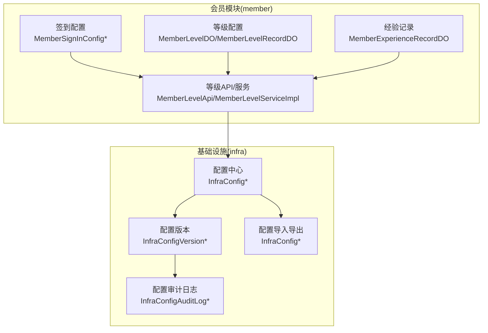
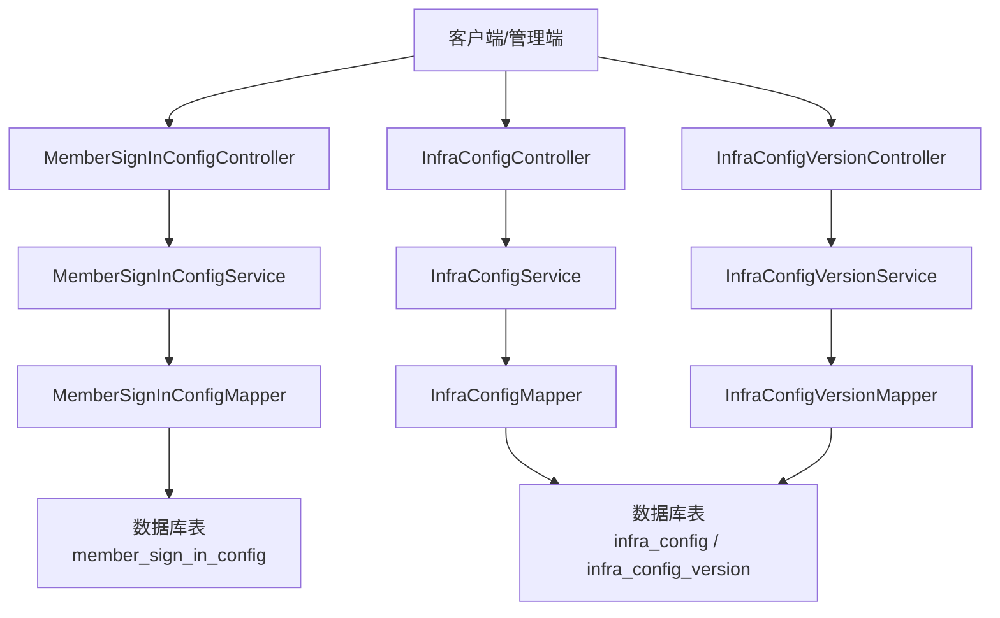
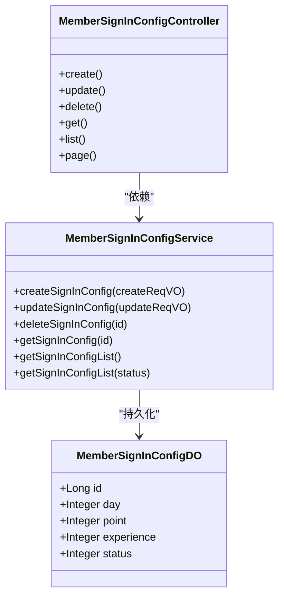
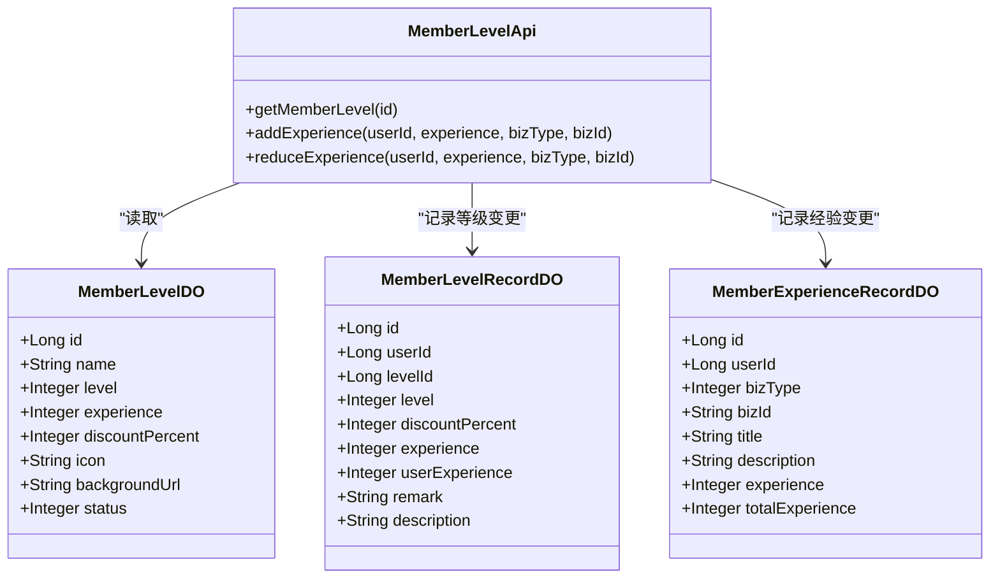
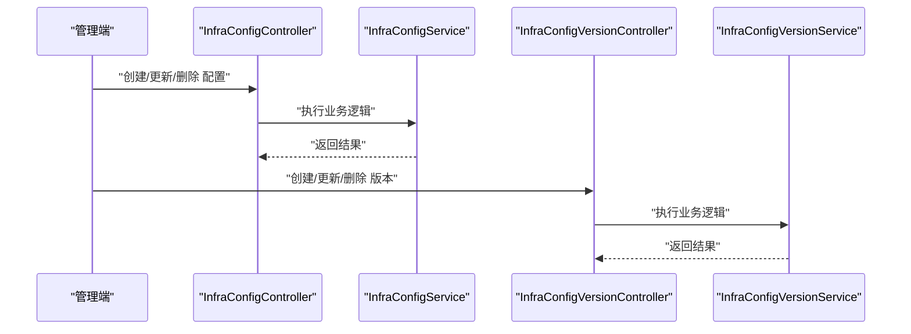
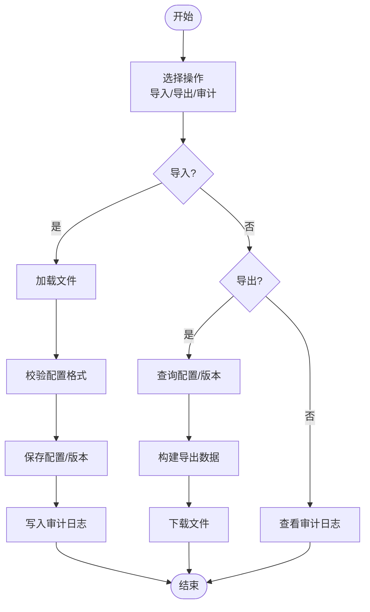
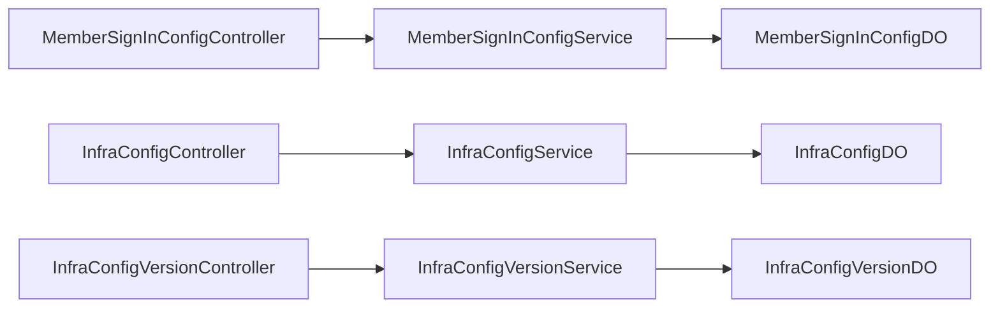

# 配置管理

<cite>
**本文引用的文件**
- [MemberSignInConfigDO.java](file://backend/yudao-module-member/src/main/java/cn/iocoder/yudao/module/member/dal/dataobject/signin/MemberSignInConfigDO.java)
- [MemberSignInConfigService.java](file://backend/yudao-module-member/src/main/java/cn/iocoder/yudao/module/member/service/signin/MemberSignInConfigService.java)
- [MemberSignInConfigController.java](file://backend/yudao-module-member/src/main/java/cn/iocoder/yudao/module/member/controller/admin/signin/MemberSignInConfigController.java)
- [MemberSignInConfigCreateReqVO.java](file://backend/yudao-module-member/src/main/java/cn/iocoder/yudao/module/member/controller/admin/signin/vo/config/MemberSignInConfigCreateReqVO.java)
- [MemberSignInConfigUpdateReqVO.java](file://backend/yudao-module-member/src/main/java/cn/iocoder/yudao/module/member/controller/admin/signin/vo/config/MemberSignInConfigUpdateReqVO.java)
- [MemberSignInConfigRespVO.java](file://backend/yudao-module-member/src/main/java/cn/iocoder/yudao/module/member/controller/admin/signin/vo/config/MemberSignInConfigRespVO.java)
- [AppMemberSignInConfigRespVO.java](file://backend/yudao-module-member/src/main/java/cn/iocoder/yudao/module/member/controller/app/signin/vo/config/AppMemberSignInConfigRespVO.java)
- [MemberLevelDO.java](file://backend/yudao-module-member/src/main/java/cn/iocoder/yudao/module/member/dal/dataobject/level/MemberLevelDO.java)
- [MemberLevelRecordDO.java](file://backend/yudao-module-member/src/main/java/cn/iocoder/yudao/module/member/dal/dataobject/level/MemberLevelRecordDO.java)
- [MemberExperienceRecordDO.java](file://backend/yudao-module-member/src/main/java/cn/iocoder/yudao/module/member/dal/dataobject/level/MemberExperienceRecordDO.java)
- [MemberLevelApi.java](file://backend/yudao-module-member/src/main/java/cn/iocoder/yudao/module/member/api/level/MemberLevelApi.java)
- [MemberExperienceBizTypeEnum.java](file://backend/yudao-module-member/src/main/java/cn/iocoder/yudao/module/member/enums/MemberExperienceBizTypeEnum.java)
- [MemberLevelServiceImpl.java](file://backend/yudao-module-member/src/main/java/cn/iocoder/yudao/module/member/service/level/MemberLevelServiceImpl.java)
- [MemberLevelService.java](file://backend/yudao-module-member/src/main/java/cn/iocoder/yudao/module/member/service/level/MemberLevelService.java)
- [InfraConfigMapper.java](file://backend/yudao-module-infra/src/main/java/cn/iocoder/yudao/module/infra/dal/mysql/config/InfraConfigMapper.java)
- [InfraConfigController.java](file://backend/yudao-module-infra/src/main/java/cn/iocoder/yudao/module/infra/controller/admin/config/InfraConfigController.java)
- [InfraConfigService.java](file://backend/yudao-module-infra/src/main/java/cn/iocoder/yudao/module/infra/service/config/InfraConfigService.java)
- [InfraConfigDO.java](file://backend/yudao-module-infra/src/main/java/cn/iocoder/yudao/module/infra/dal/dataobject/config/InfraConfigDO.java)
- [InfraConfigCreateReqVO.java](file://backend/yudao-module-infra/src/main/java/cn/iocoder/yudao/module/infra/controller/admin/config/vo/InfraConfigCreateReqVO.java)
- [InfraConfigUpdateReqVO.java](file://backend/yudao-module-infra/src/main/java/cn/iocoder/yudao/module/infra/controller/admin/config/vo/InfraConfigUpdateReqVO.java)
- [InfraConfigRespVO.java](file://backend/yudao-module-infra/src/main/java/cn/iocoder/yudao/module/infra/controller/admin/config/vo/InfraConfigRespVO.java)
- [InfraConfigPageReqVO.java](file://backend/yudao-module-infra/src/main/java/cn/iocoder/yudao/module/infra/controller/admin/config/vo/InfraConfigPageReqVO.java)
- [InfraConfigServiceImpl.java](file://backend/yudao-module-infra/src/main/java/cn/iocoder/yudao/module/infra/service/config/InfraConfigServiceImpl.java)
- [InfraConfigExportReqVO.java](file://backend/yudao-module-infra/src/main/java/cn/iocoder/yudao/module/infra/controller/admin/config/vo/InfraConfigExportReqVO.java)
- [InfraConfigImportReqVO.java](file://backend/yudao-module-infra/src/main/java/cn/iocoder/yudao/module/infra/controller/admin/config/vo/InfraConfigImportReqVO.java)
- [InfraConfigAuditLogDO.java](file://backend/yudao-module-infra/src/main/java/cn/iocoder/yudao/module/infra/dal/dataobject/config/InfraConfigAuditLogDO.java)
- [InfraConfigAuditLogMapper.java](file://backend/yudao-module-infra/src/main/java/cn/iocoder/yudao/module/infra/dal/mysql/config/InfraConfigAuditLogMapper.java)
- [InfraConfigAuditLogServiceImpl.java](file://backend/yudao-module-infra/src/main/java/cn/iocoder/yudao/module/infra/service/config/InfraConfigAuditLogServiceImpl.java)
- [InfraConfigAuditLogController.java](file://backend/yudao-module-infra/src/main/java/cn/iocoder/yudao/module/infra/controller/admin/config/InfraConfigAuditLogController.java)
- [InfraConfigVersionDO.java](file://backend/yudao-module-infra/src/main/java/cn/iocoder/yudao/module/infra/dal/dataobject/config/InfraConfigVersionDO.java)
- [InfraConfigVersionMapper.java](file://backend/yudao-module-infra/src/main/java/cn/iocoder/yudao/module/infra/dal/mysql/config/InfraConfigVersionMapper.java)
- [InfraConfigVersionService.java](file://backend/yudao-module-infra/src/main/java/cn/iocoder/yudao/module/infra/service/config/InfraConfigVersionService.java)
- [InfraConfigVersionController.java](file://backend/yudao-module-infra/src/main/java/cn/iocoder/yudao/module/infra/controller/admin/config/InfraConfigVersionController.java)
- [InfraConfigVersionServiceImpl.java](file://backend/yudao-module-infra/src/main/java/cn/iocoder/yudao/module/infra/service/config/InfraConfigVersionServiceImpl.java)
- [InfraConfigVersionCreateReqVO.java](file://backend/yudao-module-infra/src/main/java/cn/iocoder/yudao/module/infra/controller/admin/config/vo/InfraConfigVersionCreateReqVO.java)
- [InfraConfigVersionUpdateReqVO.java](file://backend/yudao-module-infra/src/main/java/cn/iocoder/yudao/module/infra/controller/admin/config/vo/InfraConfigVersionUpdateReqVO.java)
- [InfraConfigVersionRespVO.java](file://backend/yudao-module-infra/src/main/java/cn/iocoder/yudao/module/infra/controller/admin/config/vo/InfraConfigVersionRespVO.java)
- [InfraConfigVersionPageReqVO.java](file://backend/yudao-module-infra/src/main/java/cn/iocoder/yudao/module/infra/controller/admin/config/vo/InfraConfigVersionPageReqVO.java)
- [InfraConfigVersionImportReqVO.java](file://backend/yudao-module-infra/src/main/java/cn/iocoder/yudao/module/infra/controller/admin/config/vo/InfraConfigVersionImportReqVO.java)
- [InfraConfigVersionExportReqVO.java](file://backend/yudao-module-infra/src/main/java/cn/iocoder/yudao/module/infra/controller/admin/config/vo/InfraConfigVersionExportReqVO.java)
- [InfraConfigVersionAuditLogDO.java](file://backend/yudao-module-infra/src/main/java/cn/iocoder/yudao/module/infra/dal/dataobject/config/InfraConfigVersionAuditLogDO.java)
- [InfraConfigVersionAuditLogMapper.java](file://backend/yudao-module-infra/src/main/java/cn/iocoder/yudao/module/infra/dal/mysql/config/InfraConfigVersionAuditLogMapper.java)
- [InfraConfigVersionAuditLogServiceImpl.java](file://backend/yudao-module-infra/src/main/java/cn/iocoder/yudao/module/infra/service/config/InfraConfigVersionAuditLogServiceImpl.java)
- [InfraConfigVersionAuditLogController.java](file://backend/yudao-module-infra/src/main/java/cn/iocoder/yudao/module/infra/controller/admin/config/InfraConfigVersionAuditLogController.java)
- [InfraConfigVersionImportReqVO.java](file://backend/yudao-module-infra/src/main/java/cn/iocoder/yudao/module/infra/controller/admin/config/vo/InfraConfigVersionImportReqVO.java)
- [InfraConfigVersionExportReqVO.java](file://backend/yudao-module-infra/src/main/java/cn/iocoder/yudao/module/infra/controller/admin/config/vo/InfraConfigVersionExportReqVO.java)
- [InfraConfigVersionAuditLogDO.java](file://backend/yudao-module-infra/src/main/java/cn/iocoder/yudao/module/infra/dal/dataobject/config/InfraConfigVersionAuditLogDO.java)
- [InfraConfigVersionAuditLogMapper.java](file://backend/yudao-module-infra/src/main/java/cn/iocoder/yudao/module/infra/dal/mysql/config/InfraConfigVersionAuditLogMapper.java)
- [InfraConfigVersionAuditLogServiceImpl.java](file://backend/yudao-module-infra/src/main/java/cn/iocoder/yudao/module/infra/service/config/InfraConfigVersionAuditLogServiceImpl.java)
- [InfraConfigVersionAuditLogController.java](file://backend/yudao-module-infra/src/main/java/cn/iocoder/yudao/module/infra/controller/admin/config/InfraConfigVersionAuditLogController.java)
- [InfraConfigVersionImportReqVO.java](file://backend/yudao-module-infra/src/main/java/cn/iocoder/yudao/module/infra/controller/admin/config/vo/InfraConfigVersionImportReqVO.java)
- [InfraConfigVersionExportReqVO.java](file://backend/yudao-module-infra/src/main/java/cn/iocoder/yudao/module/infra/controller/admin/config/vo/InfraConfigVersionExportReqVO.java)
- [InfraConfigVersionAuditLogDO.java](file://backend/yudao-module-infra/src/main/java/cn/iocoder/yudao/module/infra/dal/dataobject/config/InfraConfigVersionAuditLogDO.java)
- [InfraConfigVersionAuditLogMapper.java](file://backend/yudao-module-infra/src/main/java/cn/iocoder/yudao/module/infra/dal/mysql/config/InfraConfigVersionAuditLogMapper.java)
- [InfraConfigVersionAuditLogServiceImpl.java](file://backend/yudao-module-infra/src/main/java/cn/iocoder/yudao/module/infra/service/config/InfraConfigVersionAuditLogServiceImpl.java)
- [InfraConfigVersionAuditLogController.java](file://backend/yudao-module-infra/src/main/java/cn/iocoder/yudao/module/infra/controller/admin/config/InfraConfigVersionAuditLogController.java)
- [InfraConfigVersionImportReqVO.java](file://backend/yudao-module-infra/src/main/java/cn/iocoder/yudao/module/infra/controller/admin/config/vo/InfraConfigVersionImportReqVO.java)
- [InfraConfigVersionExportReqVO.java](file://backend/yudao-module-infra/src/main/java/cn/iocoder/yudao/module/infra/controller/admin/config/vo/InfraConfigVersionExportReqVO.java)
- [InfraConfigVersionAuditLogDO.java](file://backend/yudao-module-infra/src/main/java/cn/iocoder/yudao/module/infra/dal/dataobject/config/InfraConfigVersionAuditLogDO.java)
- [InfraConfigVersionAuditLogMapper.java](file://backend/yudao-module-infra/src/main/java/cn/iocoder/yudao/module/infra/dal/mysql/config/InfraConfigVersionAuditLogMapper.java)
- [InfraConfigVersionAuditLogServiceImpl.java](file://backend/yudao-module-infra/src/main/java/cn/iocoder/yudao/module/infra/service/config/InfraConfigVersionAuditLogServiceImpl.java)
- [InfraConfigVersionAuditLogController.java](file://backend/yudao-module-infra/src/main/java/cn/iocoder/yudao/module/infra/controller/admin/config/InfraConfigVersionAuditLogController.java)
- [InfraConfigVersionImportReqVO.java](file://backend/yudao-module-infra/src/main/java/cn/iocoder/yudao/module/infra/controller/admin/config/vo/InfraConfigVersionImportReqVO.java)
- [InfraConfigVersionExportReqVO.java](file://backend/yudao-module-infra/src/main/java/cn/iocoder/yudao/module/infra/controller/admin/config/vo/InfraConfigVersionExportReqVO.java)
- [InfraConfigVersionAuditLogDO.java](file://backend/yudao-module-infra/src/main/java/cn/iocoder/yudao/module/infra/dal/dataobject/config/InfraConfigVersionAuditLogDO.java)
- [InfraConfigVersionAuditLogMapper.java](file://backend/yudao-module-infra/src/main/java/cn/iocoder/yudao/module/infra/dal/mysql/config/InfraConfigVersionAuditLogMapper.java)
- [InfraConfigVersionAuditLogServiceImpl.java](file://backend/yudao-module-infra/src/main/java/cn/iocoder/yudao/module/infra/service/config/InfraConfigVersionAuditLogServiceImpl.java)
- [InfraConfigVersionAuditLogController.java](file://backend/yudao-module-infra/src/main/java/cn/iocoder/yudao/module/infra/controller/admin/config/InfraConfigVersionAuditLogController.java)
- [InfraConfigVersionImportReqVO.java](file://backend/yudao-module-infra/src/main/java/cn/iocoder/yudao/module/infra/controller/admin/config/vo/InfraConfigVersionImportReqVO.java)
- [InfraConfigVersionExportReqVO.java](file://backend/yudao-module-infra/src/main/java/cn/iocoder/yudao/module/infra/controller/admin/config/vo/InfraConfigVersionExportReqVO.java)
- [InfraConfigVersionAuditLogDO.java](file://backend/yudao-module-infra/src/main/java/cn/iocoder/yudao/module/infra/dal/dataobject/config/InfraConfigVersionAuditLogDO.java)
- [InfraConfigVersionAuditLogMapper.java](file://backend/yudao-module-infra/src/main/java/cn/iocoder/yudao/module/infra/dal/mysql/config/InfraConfigVersionAuditLogMapper.java)
- [InfraConfigVersionAuditLogServiceImpl.java](file://backend/yudao-module-infra/src/main/java/cn/iocoder/yudao/module/infra/service/config/InfraConfigVersionAuditLogServiceImpl.java)
- [InfraConfigVersionAuditLogController.java](file://backend/yudao-module-infra/src/main/java/cn/iocoder/yudao/module/infra/controller/admin/config/InfraConfigVersionAuditLogController.java)
- [InfraConfigVersionImportReqVO.java](file://backend/yudao-module-infra/src/main/java/cn/iocoder/yudao/module/infra/controller/admin/config/vo/InfraConfigVersionImportReqVO.java)
- [InfraConfigVersionExportReqVO.java](file://backend/yudao-module-infra/src/main/java/cn/iocoder/yudao/module/infra/controller/admin/config/vo/InfraConfigVersionExportReqVO.java)
- [InfraConfigVersionAuditLogDO.java](file://backend/yudao-module-infra/src/main/java......)
</cite>

## 目录
1. [简介](#简介)
2. [项目结构](#项目结构)
3. [核心组件](#核心组件)
4. [架构总览](#架构总览)
5. [详细组件分析](#详细组件分析)
6. [依赖分析](#依赖分析)
7. [性能考虑](#性能考虑)
8. [故障排查指南](#故障排查指南)
9. [结论](#结论)
10. [附录](#附录)

## 简介
本文件面向会员配置管理系统，系统性梳理并文档化以下能力：
- 会员配置参数管理：包含签到规则、等级规则、经验规则等配置项
- 配置数据模型与分类管理：明确各配置实体的字段、约束与业务含义
- 配置版本控制：支持配置的版本化管理、导入导出与审计日志
- 配置 API 接口：管理端与应用端接口定义与调用流程
- 配置与业务流程关联：签到、下单、邀请等场景对配置的使用
- 高级功能：配置模板、配置迁移、配置备份与恢复

## 项目结构
会员配置管理主要分布在 member 与 infra 模块中：
- member 模块：签到规则、等级规则、经验规则的数据模型与服务
- infra 模块：通用配置中心、配置版本、配置审计日志、配置导入导出

**图表来源**
- [MemberSignInConfigDO.java:1-50](file://backend/yudao-module-member/src/main/java/cn/iocoder/yudao/module/member/dal/dataobject/signin/MemberSignInConfigDO.java#L1-L50)
- [MemberLevelDO.java:1-65](file://backend/yudao-module-member/src/main/java/cn/iocoder/yudao/module/member/dal/dataobject/level/MemberLevelDO.java#L1-L65)
- [MemberExperienceRecordDO.java:1-64](file://backend/yudao-module-member/src/main/java/cn/iocoder/yudao/module/member/dal/dataobject/level/MemberExperienceRecordDO.java#L1-L64)
- [InfraConfigDO.java](file://backend/yudao-module-infra/src/main/java/cn/iocoder/yudao/module/infra/dal/dataobject/config/InfraConfigDO.java)
- [InfraConfigVersionDO.java](file://backend/yudao-module-infra/src/main/java/cn/iocoder/yudao/module/infra/dal/dataobject/config/InfraConfigVersionDO.java)
- [InfraConfigAuditLogDO.java](file://backend/yudao-module-infra/src/main/java/cn/iocoder/yudao/module/infra/dal/dataobject/config/InfraConfigAuditLogDO.java)

**章节来源**
- [MemberSignInConfigDO.java:1-50](file://backend/yudao-module-member/src/main/java/cn/iocoder/yudao/module/member/dal/dataobject/signin/MemberSignInConfigDO.java#L1-L50)
- [MemberLevelDO.java:1-65](file://backend/yudao-module-member/src/main/java/cn/iocoder/yudao/module/member/dal/dataobject/level/MemberLevelDO.java#L1-L65)
- [MemberExperienceRecordDO.java:1-64](file://backend/yudao-module-member/src/main/java/cn/iocoder/yudao/module/member/dal/dataobject/level/MemberExperienceRecordDO.java#L1-L64)
- [InfraConfigDO.java](file://backend/yudao-module-infra/src/main/java/cn/iocoder/yudao/module/infra/dal/dataobject/config/InfraConfigDO.java)
- [InfraConfigVersionDO.java](file://backend/yudao-module-infra/src/main/java/cn/iocoder/yudao/module/infra/dal/dataobject/config/InfraConfigVersionDO.java)
- [InfraConfigAuditLogDO.java](file://backend/yudao-module-infra/src/main/java/cn/iocoder/yudao/module/infra/dal/dataobject/config/InfraConfigAuditLogDO.java)

## 核心组件
- 签到规则配置
  - 数据模型：签到天数、奖励积分、奖励经验、状态
  - 服务接口：创建、更新、删除、查询列表
  - 控制器：管理端与应用端响应模型
- 等级规则配置
  - 数据模型：等级名称、等级值、升级所需经验、折扣、图标与背景
  - 记录模型：用户等级变更记录，冗余等级与折扣等字段
  - 服务接口：等级 CRUD、经验增减、等级变更记录
- 经验规则枚举
  - 业务类型枚举：签到、下单、邀请、抽奖等
  - 增减标识：区分正负向经验变动
- 配置中心与版本
  - 通用配置：键值型配置、分页查询、导入导出
  - 配置版本：版本化存储、版本导入导出、版本审计
  - 配置审计：操作审计日志，记录变更轨迹

**章节来源**
- [MemberSignInConfigService.java:1-62](file://backend/yudao-module-member/src/main/java/cn/iocoder/yudao/module/member/service/signin/MemberSignInConfigService.java#L1-L62)
- [MemberLevelService.java:1-47](file://backend/yudao-module-member/src/main/java/cn/iocoder/yudao/module/member/service/level/MemberLevelService.java#L1-L47)
- [MemberExperienceBizTypeEnum.java:1-52](file://backend/yudao-module-member/src/main/java/cn/iocoder/yudao/module/member/enums/MemberExperienceBizTypeEnum.java#L1-L52)
- [InfraConfigService.java](file://backend/yudao-module-infra/src/main/java/cn/iocoder/yudao/module/infra/service/config/InfraConfigService.java)
- [InfraConfigVersionService.java](file://backend/yudao-module-infra/src/main/java/cn/iocoder/yudao/module/infra/service/config/InfraConfigVersionService.java)

## 架构总览
会员配置管理采用“领域模型 + 服务层 + 控制器 + 基础设施”的分层架构：
- 领域模型：MemberSignInConfigDO、MemberLevelDO、MemberExperienceRecordDO
- 服务层：MemberSignInConfigService、MemberLevelService/Impl、InfraConfigService/Impl、InfraConfigVersionService/Impl
- 控制器：MemberSignInConfigController、InfraConfigController、InfraConfigVersionController
- 基础设施：配置中心、版本、审计日志、导入导出

**图表来源**
- [MemberSignInConfigController.java](file://backend/yudao-module-member/src/main/java/cn/iocoder/yudao/module/member/controller/admin/signin/MemberSignInConfigController.java)
- [InfraConfigController.java](file://backend/yudao-module-infra/src/main/java/cn/iocoder/yudao/module/infra/controller/admin/config/InfraConfigController.java)
- [InfraConfigVersionController.java](file://backend/yudao-module-infra/src/main/java/cn/iocoder/yudao/module/infra/controller/admin/config/InfraConfigVersionController.java)
- [MemberSignInConfigService.java:1-62](file://backend/yudao-module-member/src/main/java/cn/iocoder/yudao/module/member/service/signin/MemberSignInConfigService.java#L1-L62)
- [InfraConfigService.java](file://backend/yudao-module-infra/src/main/java/cn/iocoder/yudao/module/infra/service/config/InfraConfigService.java)
- [InfraConfigVersionService.java](file://backend/yudao-module-infra/src/main/java/cn/iocoder/yudao/module/infra/service/config/InfraConfigVersionService.java)

## 详细组件分析

### 签到规则配置
- 数据模型
  - 字段：id、day、point、experience、status
  - 约束：day、point、experience 非负校验；status 使用通用状态枚举
- 服务接口
  - 创建、更新、删除、按 id 查询、查询列表（全部/按状态）
- 控制器与 VO
  - 管理端：MemberSignInConfigCreateReqVO、MemberSignInConfigUpdateReqVO、MemberSignInConfigRespVO
  - 应用端：AppMemberSignInConfigRespVO（day、point）

**图表来源**
- [MemberSignInConfigDO.java:1-50](file://backend/yudao-module-member/src/main/java/cn/iocoder/yudao/module/member/dal/dataobject/signin/MemberSignInConfigDO.java#L1-L50)
- [MemberSignInConfigService.java:1-62](file://backend/yudao-module-member/src/main/java/cn/iocoder/yudao/module/member/service/signin/MemberSignInConfigService.java#L1-L62)
- [MemberSignInConfigController.java](file://backend/yudao-module-member/src/main/java/cn/iocoder/yudao/module/member/controller/admin/signin/MemberSignInConfigController.java)

**章节来源**
- [MemberSignInConfigDO.java:1-50](file://backend/yudao-module-member/src/main/java/cn/iocoder/yudao/module/member/dal/dataobject/signin/MemberSignInConfigDO.java#L1-L50)
- [MemberSignInConfigService.java:1-62](file://backend/yudao-module-member/src/main/java/cn/iocoder/yudao/module/member/service/signin/MemberSignInConfigService.java#L1-L62)
- [MemberSignInConfigCreateReqVO.java:1-12](file://backend/yudao-module-member/src/main/java/cn/iocoder/yudao/module/member/controller/admin/signin/vo/config/MemberSignInConfigCreateReqVO.java#L1-L12)
- [MemberSignInConfigUpdateReqVO.java:1-18](file://backend/yudao-module-member/src/main/java/cn/iocoder/yudao/module/member/controller/admin/signin/vo/config/MemberSignInConfigUpdateReqVO.java#L1-L18)
- [MemberSignInConfigRespVO.java:1-19](file://backend/yudao-module-member/src/main/java/cn/iocoder/yudao/module/member/controller/admin/signin/vo/config/MemberSignInConfigRespVO.java#L1-L19)
- [AppMemberSignInConfigRespVO.java:1-16](file://backend/yudao-module-member/src/main/java/cn/iocoder/yudao/module/member/controller/app/signin/vo/config/AppMemberSignInConfigRespVO.java#L1-L16)

### 等级规则配置
- 数据模型
  - 等级：name、level、experience、discountPercent、icon、backgroundUrl、status
  - 等级记录：userId、levelId、level、discountPercent、experience、userExperience、remark、description
  - 经验记录：userId、bizType、bizId、title、description、experience、totalExperience
- 服务接口
  - 等级 CRUD、批量查询、等级变更记录、经验增减
- 业务类型
  - MemberExperienceBizTypeEnum：ADMIN、INVITE_REGISTER、SIGN_IN、LOTTERY、ORDER_GIVE、取消类等

**图表来源**
- [MemberLevelDO.java:1-65](file://backend/yudao-module-member/src/main/java/cn/iocoder/yudao/module/member/dal/dataobject/level/MemberLevelDO.java#L1-L65)
- [MemberLevelRecordDO.java:1-72](file://backend/yudao-module-member/src/main/java/cn/iocoder/yudao/module/member/dal/dataobject/level/MemberLevelRecordDO.java#L1-L72)
- [MemberExperienceRecordDO.java:1-64](file://backend/yudao-module-member/src/main/java/cn/iocoder/yudao/module/member/dal/dataobject/level/MemberExperienceRecordDO.java#L1-L64)
- [MemberLevelApi.java:1-41](file://backend/yudao-module-member/src/main/java/cn/iocoder/yudao/module/member/api/level/MemberLevelApi.java#L1-L41)
- [MemberExperienceBizTypeEnum.java:1-52](file://backend/yudao-module-member/src/main/java/cn/iocoder/yudao/module/member/enums/MemberExperienceBizTypeEnum.java#L1-L52)

**章节来源**
- [MemberLevelDO.java:1-65](file://backend/yudao-module-member/src/main/java/cn/iocoder/yudao/module/member/dal/dataobject/level/MemberLevelDO.java#L1-L65)
- [MemberLevelRecordDO.java:1-72](file://backend/yudao-module-member/src/main/java/cn/iocoder/yudao/module/member/dal/dataobject/level/MemberLevelRecordDO.java#L1-L72)
- [MemberExperienceRecordDO.java:1-64](file://backend/yudao-module-member/src/main/java/cn/iocoder/yudao/module/member/dal/dataobject/level/MemberExperienceRecordDO.java#L1-L64)
- [MemberLevelApi.java:1-41](file://backend/yudao-module-member/src/main/java/cn/iocoder/yudao/module/member/api/level/MemberLevelApi.java#L1-L41)
- [MemberExperienceBizTypeEnum.java:1-52](file://backend/yudao-module-member/src/main/java/cn/iocoder/yudao/module/member/enums/MemberExperienceBizTypeEnum.java#L1-L52)

### 配置中心与版本控制
- 配置中心
  - InfraConfigDO：键值型配置，支持分页查询、导入导出
  - InfraConfigService/Impl：提供创建、更新、删除、分页查询、导入导出
  - 控制器：InfraConfigController 提供管理端接口
- 配置版本
  - InfraConfigVersionDO：版本化配置，支持版本导入导出与审计
  - InfraConfigVersionService/Impl：版本 CRUD、版本导入导出
  - 控制器：InfraConfigVersionController 提供版本管理接口
- 审计日志
  - InfraConfigAuditLogDO/Impl：记录配置变更操作
  - InfraConfigVersionAuditLogDO/Impl：记录版本变更操作

**图表来源**
- [InfraConfigController.java](file://backend/yudao-module-infra/src/main/java/cn/iocoder/yudao/module/infra/controller/admin/config/InfraConfigController.java)
- [InfraConfigService.java](file://backend/yudao-module-infra/src/main/java/cn/iocoder/yudao/module/infra/service/config/InfraConfigService.java)
- [InfraConfigVersionController.java](file://backend/yudao-module-infra/src/main/java/cn/iocoder/yudao/module/infra/controller/admin/config/InfraConfigVersionController.java)
- [InfraConfigVersionService.java](file://backend/yudao-module-infra/src/main/java/cn/iocoder/yudao/module/infra/service/config/InfraConfigVersionService.java)

**章节来源**
- [InfraConfigDO.java](file://backend/yudao-module-infra/src/main/java/cn/iocoder/yudao/module/infra/dal/dataobject/config/InfraConfigDO.java)
- [InfraConfigService.java](file://backend/yudao-module-infra/src/main/java/cn/iocoder/yudao/module/infra/service/config/InfraConfigService.java)
- [InfraConfigVersionDO.java](file://backend/yudao-module-infra/src/main/java/cn/iocoder/yudao/module/infra/dal/dataobject/config/InfraConfigVersionDO.java)
- [InfraConfigVersionService.java](file://backend/yudao-module-infra/src/main/java/cn/iocoder/yudao/module/infra/service/config/InfraConfigVersionService.java)

### 配置导入导出与审计
- 导入导出
  - InfraConfigExportReqVO/ImportReqVO：导出/导入请求模型
  - 支持将配置以标准格式导出与导入，便于迁移与备份
- 审计日志
  - InfraConfigAuditLogDO/Impl：记录配置变更操作人、时间、内容
  - InfraConfigVersionAuditLogDO/Impl：记录版本变更操作人、时间、内容

**图表来源**
- [InfraConfigExportReqVO.java](file://backend/yudao-module-infra/src/main/java/cn/iocoder/yudao/module/infra/controller/admin/config/vo/InfraConfigExportReqVO.java)
- [InfraConfigImportReqVO.java](file://backend/yudao-module-infra/src/main/java/cn/iocoder/yudao/module/infra/controller/admin/config/vo/InfraConfigImportReqVO.java)
- [InfraConfigAuditLogDO.java](file://backend/yudao-module-infra/src/main/java/cn/iocoder/yudao/module/infra/dal/dataobject/config/InfraConfigAuditLogDO.java)
- [InfraConfigVersionAuditLogDO.java](file://backend/yudao-module-infra/src/main/java/cn/iocoder/yudao/module/infra/dal/dataobject/config/InfraConfigVersionAuditLogDO.java)

**章节来源**
- [InfraConfigExportReqVO.java](file://backend/yudao-module-infra/src/main/java/cn/iocoder/yudao/module/infra/controller/admin/config/vo/InfraConfigExportReqVO.java)
- [InfraConfigImportReqVO.java](file://backend/yudao-module-infra/src/main/java/cn/iocoder/yudao/module/infra/controller/admin/config/vo/InfraConfigImportReqVO.java)
- [InfraConfigAuditLogDO.java](file://backend/yudao-module-infra/src/main/java/cn/iocoder/yudao/module/infra/dal/dataobject/config/InfraConfigAuditLogDO.java)
- [InfraConfigVersionAuditLogDO.java](file://backend/yudao-module-infra/src/main/java/cn/iocoder/yudao/module/infra/dal/dataobject/config/InfraConfigVersionAuditLogDO.java)

## 依赖分析
- 组件耦合
  - MemberSignInConfigController 依赖 MemberSignInConfigService
  - MemberLevelApi 依赖 MemberLevelDO、MemberLevelRecordDO、MemberExperienceRecordDO
  - InfraConfigController/VersionController 依赖对应 Service 层
- 外部依赖
  - MyBatis Plus：数据访问层注解与序列化
  - Hutool：枚举与对象工具
  - Swagger 注解：接口文档生成

**图表来源**
- [MemberSignInConfigController.java](file://backend/yudao-module-member/src/main/java/cn/iocoder/yudao/module/member/controller/admin/signin/MemberSignInConfigController.java)
- [InfraConfigController.java](file://backend/yudao-module-infra/src/main/java/cn/iocoder/yudao/module/infra/controller/admin/config/InfraConfigController.java)
- [InfraConfigVersionController.java](file://backend/yudao-module-infra/src/main/java/cn/iocoder/yudao/module/infra/controller/admin/config/InfraConfigVersionController.java)
- [MemberSignInConfigDO.java:1-50](file://backend/yudao-module-member/src/main/java/cn/iocoder/yudao/module/member/dal/dataobject/signin/MemberSignInConfigDO.java#L1-L50)
- [InfraConfigDO.java](file://backend/yudao-module-infra/src/main/java/cn/iocoder/yudao/module/infra/dal/dataobject/config/InfraConfigDO.java)
- [InfraConfigVersionDO.java](file://backend/yudao-module-infra/src/main/java/cn/iocoder/yudao/module/infra/dal/dataobject/config/InfraConfigVersionDO.java)

**章节来源**
- [MemberSignInConfigController.java](file://backend/yudao-module-member/src/main/java/cn/iocoder/yudao/module/member/controller/admin/signin/MemberSignInConfigController.java)
- [InfraConfigController.java](file://backend/yudao-module-infra/src/main/java/cn/iocoder/yudao/module/infra/controller/admin/config/InfraConfigController.java)
- [InfraConfigVersionController.java](file://backend/yudao-module-infra/src/main/java/cn/iocoder/yudao/module/infra/controller/admin/config/InfraConfigVersionController.java)

## 性能考虑
- 分页查询：配置中心与版本均支持分页，避免一次性加载大量数据
- 索引设计：建议在配置键、版本号、创建时间等常用查询字段建立索引
- 缓存策略：对高频读取的配置进行缓存，降低数据库压力
- 导入导出批处理：大文件导入建议分批处理，避免内存溢出
- 审计日志异步化：审计写入可异步化，减少主流程阻塞

## 故障排查指南
- 签到规则
  - day、point、experience 校验失败：检查请求参数是否非负
  - 状态异常：确认 status 枚举值是否正确
- 等级规则
  - 经验不足导致无法升级：核对 MemberExperienceBizTypeEnum 与经验计算逻辑
  - 等级记录缺失：检查 MemberLevelRecordDO 是否正确冗余等级与折扣
- 配置中心
  - 导入失败：检查导入文件格式与字段映射
  - 审计日志为空：确认审计服务是否启用与写入成功
- 版本控制
  - 版本冲突：检查版本号与版本导入顺序
  - 回滚失败：核对版本审计日志与回滚脚本

**章节来源**
- [MemberSignInConfigCreateReqVO.java:1-12](file://backend/yudao-module-member/src/main/java/cn/iocoder/yudao/module/member/controller/admin/signin/vo/config/MemberSignInConfigCreateReqVO.java#L1-L12)
- [MemberSignInConfigUpdateReqVO.java:1-18](file://backend/yudao-module-member/src/main/java/cn/iocoder/yudao/module/member/controller/admin/signin/vo/config/MemberSignInConfigUpdateReqVO.java#L1-L18)
- [MemberExperienceBizTypeEnum.java:1-52](file://backend/yudao-module-member/src/main/java/cn/iocoder/yudao/module/member/enums/MemberExperienceBizTypeEnum.java#L1-L52)
- [InfraConfigImportReqVO.java](file://backend/yudao-module-infra/src/main/java/cn/iocoder/yudao/module/infra/controller/admin/config/vo/InfraConfigImportReqVO.java)
- [InfraConfigVersionImportReqVO.java](file://backend/yudao-module-infra/src/main/java/cn/iocoder/yudao/module/infra/controller/admin/config/vo/InfraConfigVersionImportReqVO.java)

## 结论
会员配置管理系统通过清晰的数据模型与服务分层，实现了签到规则、等级规则、经验规则的统一管理，并结合配置中心、版本控制与审计日志，提供了完善的配置生命周期管理能力。建议在生产环境中配合缓存、索引与异步审计等优化手段，确保高并发下的稳定性与可追溯性。

## 附录
- 配置模板
  - 导入模板：基于 InfraConfigImportReqVO 的字段定义
  - 版本模板：基于 InfraConfigVersionImportReqVO 的字段定义
- 配置迁移
  - 通过导出/导入流程完成配置迁移，注意版本号与兼容性
- 配置备份与恢复
  - 定期导出配置与版本，结合审计日志进行恢复验证

**章节来源**
- [InfraConfigImportReqVO.java](file://backend/yudao-module-infra/src/main/java/cn/iocoder/yudao/module/infra/controller/admin/config/vo/InfraConfigImportReqVO.java)
- [InfraConfigVersionImportReqVO.java](file://backend/yudao-module-infra/src/main/java/cn/iocoder/yudao/module/infra/controller/admin/config/vo/InfraConfigVersionImportReqVO.java)
- [InfraConfigExportReqVO.java](file://backend/yudao-module-infra/src/main/java/cn/iocoder/yudao/module/infra/controller/admin/config/vo/InfraConfigExportReqVO.java)
- [InfraConfigVersionExportReqVO.java](file://backend/yudao-module-infra/src/main/java/cn/iocoder/yudao/module/infra/controller/admin/config/vo/InfraConfigVersionExportReqVO.java)