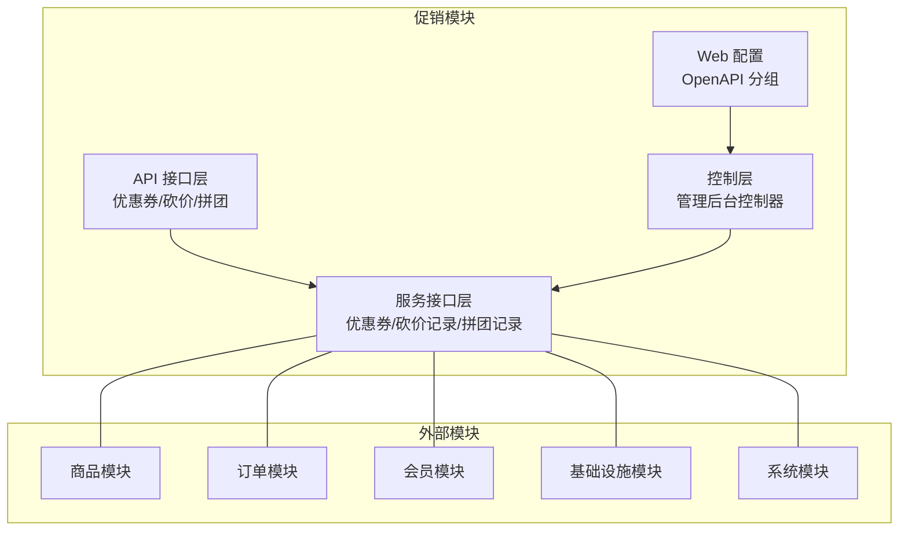
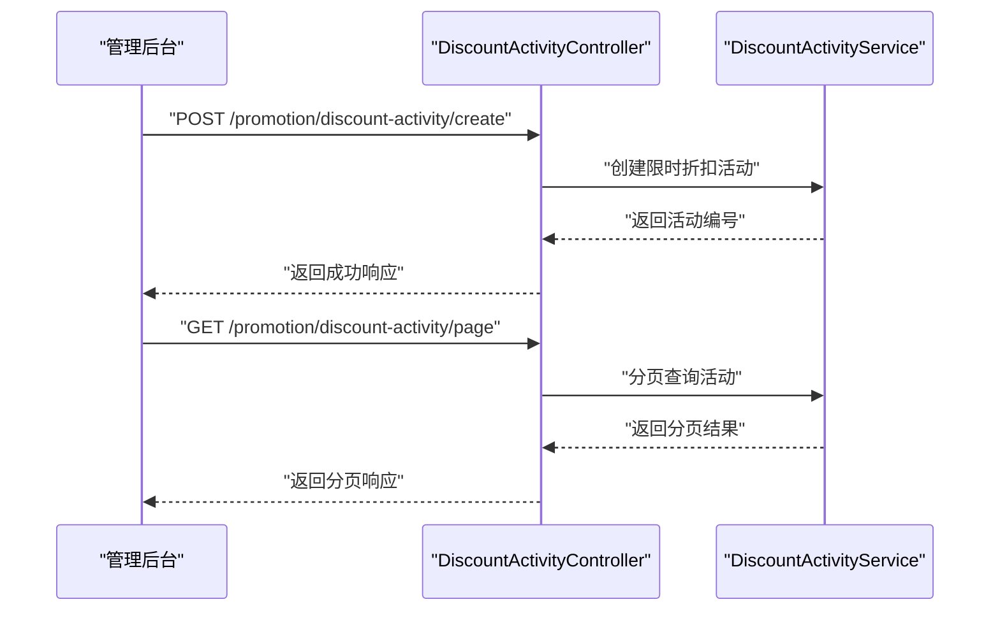
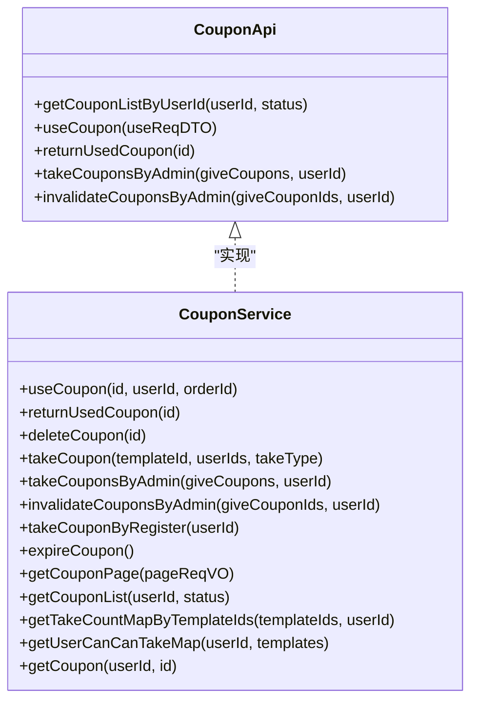
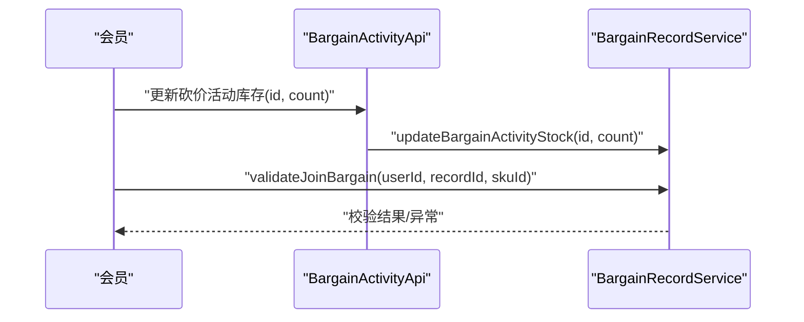
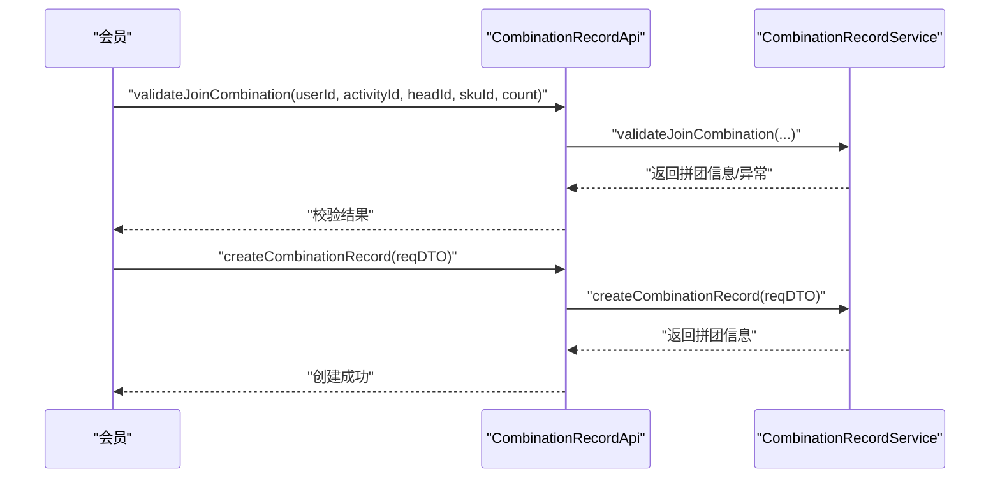
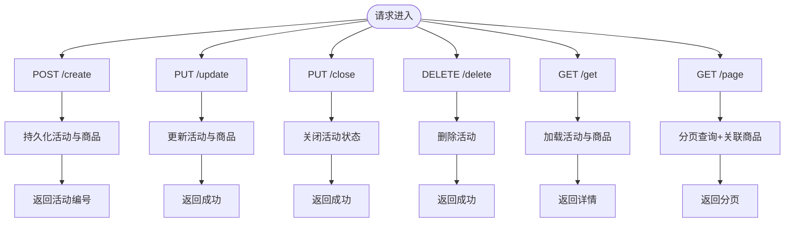
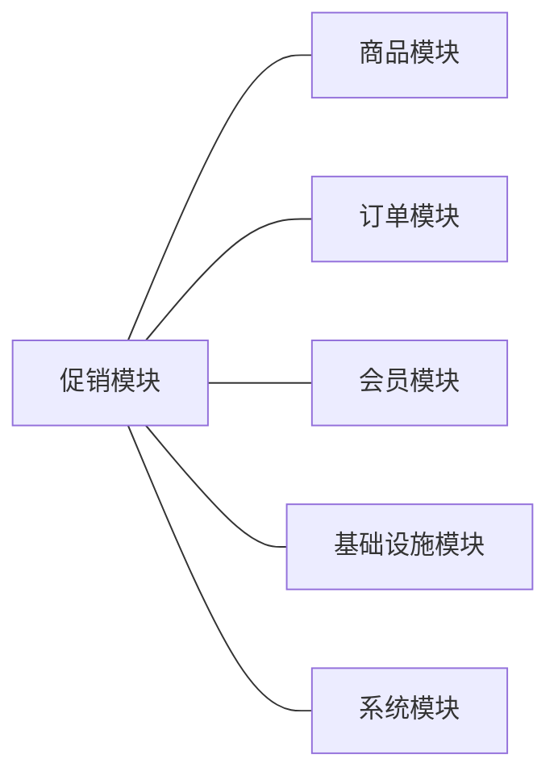

# 促销模块

<cite>
**本文引用的文件**
- [促销模块 POM](file://backend/yudao-module-mall/yudao-module-promotion/pom.xml)
- [促销模块 API 包说明](file://backend/yudao-module-mall/yudao-module-promotion/src/main/java/cn/iocoder/yudao/module/promotion/api/package-info.java)
- [优惠券 API 接口](file://backend/yudao-module-mall/yudao-module-promotion/src/main/java/cn/iocoder/yudao/module/promotion/api/coupon/CouponApi.java)
- [砍价活动 API 接口](file://backend/yudao-module-mall/yudao-module-promotion/src/main/java/cn/iocoder/yudao/module/promotion/api/bargain/BargainActivityApi.java)
- [拼团记录 API 接口](file://backend/yudao-module-mall/yudao-module-promotion/src/main/java/cn/iocoder/yudao/module/promotion/api/combination/CombinationRecordApi.java)
- [优惠券服务接口](file://backend/yudao-module-mall/yudao-module-promotion/src/main/java/cn/iocoder/yudao/module/promotion/service/coupon/CouponService.java)
- [砍价记录服务接口](file://backend/yudao-module-mall/yudao-module-promotion/src/main/java/cn/iocoder/yudao/module/promotion/service/bargain/BargainRecordService.java)
- [拼团记录服务接口](file://backend/yudao-module-mall/yudao-module-promotion/src/main/java/cn/iocoder/yudao/module/promotion/service/combination/CombinationRecordService.java)
- [限时折扣活动控制器](file://backend/yudao-module-mall/yudao-module-promotion/src/main/java/cn/iocoder/yudao/module/promotion/controller/admin/discount/DiscountActivityController.java)
- [促销模块 Web 配置](file://backend/yudao-module-mall/yudao-module-promotion/src/main/java/cn/iocoder/yudao/module/promotion/framework/web/config/PromotionWebConfiguration.java)
</cite>

## 目录
1. [简介](#简介)
2. [项目结构](#项目结构)
3. [核心组件](#核心组件)
4. [架构总览](#架构总览)
5. [详细组件分析](#详细组件分析)
6. [依赖关系分析](#依赖关系分析)
7. [性能考量](#性能考量)
8. [故障排查指南](#故障排查指南)
9. [结论](#结论)
10. [附录](#附录)

## 简介
本文件系统性梳理促销模块的功能体系与实现要点，覆盖以下核心能力：
- 优惠券管理：发放、使用、退回、作废、过期回收、分页查询、用户可领状态判断
- 砍价活动：库存联动、砍价金额更新、订单绑定、记录分页与统计
- 拼团活动：开团/参团校验、成团条件、过期处理、记录统计与分页
- 限时折扣：活动创建、更新、关闭、删除、分页查询
- 积分兑换：结合会员模块进行积分抵扣与使用（以现有接口为准）
- 规则与状态：生效时间、使用门槛、叠加规则、风控与防刷建议
- 协同机制：与商品模块、订单模块、会员模块的交互边界

## 项目结构
促销模块采用“接口 + 实现 + 控制器 + 服务 + 数据对象”的分层组织，核心包结构如下：
- api 层：对外暴露的领域 API 接口（如优惠券、砍价、拼团）
- service 层：业务逻辑接口（如优惠券、砍价记录、拼团记录）
- controller 层：管理后台 REST 接口（如限时折扣活动）
- framework/web：模块级 Web 配置（如 OpenAPI 分组）

图表来源
- [促销模块 POM:21-46](file://backend/yudao-module-mall/yudao-module-promotion/pom.xml#L21-L46)
- [促销模块 Web 配置:19-22](file://backend/yudao-module-mall/yudao-module-promotion/src/main/java/cn/iocoder/yudao/module/promotion/framework/web/config/PromotionWebConfiguration.java#L19-L22)

章节来源
- [促销模块 POM:1-84](file://backend/yudao-module-mall/yudao-module-promotion/pom.xml#L1-L84)
- [促销模块 Web 配置:1-24](file://backend/yudao-module-mall/yudao-module-promotion/src/main/java/cn/iocoder/yudao/module/promotion/framework/web/config/PromotionWebConfiguration.java#L1-L24)

## 核心组件
- 优惠券 API 与服务：提供用户优惠券列表、使用、退回、作废、管理员批量发放与作废、过期回收、分页查询、用户可领状态判断等能力
- 砍价活动 API 与服务：提供库存联动、砍价金额更新、订单绑定、记录分页与统计
- 拼团记录 API 与服务：提供开团/参团校验、成团条件、过期处理、记录统计与分页
- 限时折扣控制器：提供活动 CRUD 与分页查询
- Web 配置：统一注册促销模块的 OpenAPI 分组

章节来源
- [优惠券 API 接口:1-58](file://backend/yudao-module-mall/yudao-module-promotion/src/main/java/cn/iocoder/yudao/module/promotion/api/coupon/CouponApi.java#L1-L58)
- [优惠券服务接口:1-172](file://backend/yudao-module-mall/yudao-module-promotion/src/main/java/cn/iocoder/yudao/module/promotion/service/coupon/CouponService.java#L1-L172)
- [砍价活动 API 接口:1-19](file://backend/yudao-module-mall/yudao-module-promotion/src/main/java/cn/iocoder/yudao/module/promotion/api/bargain/BargainActivityApi.java#L1-L19)
- [砍价记录服务接口:1-138](file://backend/yudao-module-mall/yudao-module-promotion/src/main/java/cn/iocoder/yudao/module/promotion/service/bargain/BargainRecordService.java#L1-L138)
- [拼团记录 API 接口:1-60](file://backend/yudao-module-mall/yudao-module-promotion/src/main/java/cn/iocoder/yudao/module/promotion/api/combination/CombinationRecordApi.java#L1-L60)
- [拼团记录服务接口:1-159](file://backend/yudao-module-mall/yudao-module-promotion/src/main/java/cn/iocoder/yudao/module/promotion/service/combination/CombinationRecordService.java#L1-L159)
- [限时折扣活动控制器:1-100](file://backend/yudao-module-mall/yudao-module-promotion/src/main/java/cn/iocoder/yudao/module/promotion/controller/admin/discount/DiscountActivityController.java#L1-L100)

## 架构总览
促销模块通过 API 接口向其他模块提供能力，服务层承载核心业务逻辑，控制器层暴露管理后台接口，Web 配置统一注册 OpenAPI 分组。

图表来源
- [限时折扣活动控制器:37-97](file://backend/yudao-module-mall/yudao-module-promotion/src/main/java/cn/iocoder/yudao/module/promotion/controller/admin/discount/DiscountActivityController.java#L37-L97)

## 详细组件分析

### 优惠券管理
- 功能范围
  - 发放：支持管理员批量发放、系统新人券、会员主动领取
  - 使用：按订单使用、退回已使用券、回收无效券
  - 查询：分页、按用户与状态查询、统计领取数量、用户可领状态判断
  - 过期：定时任务扫描过期券并回收
- 关键接口
  - API：用户优惠券列表、使用、退回、管理员批量发放与作废
  - 服务：使用、退回、回收、领取、过期回收、分页、统计、用户可领判断
- 风控建议
  - 领取次数限制、同一模板单用户上限、并发使用加锁、IP/设备维度限流
  - 与订单模块联动：使用前校验订单商品范围、叠加规则、黑名单校验

图表来源
- [优惠券 API 接口:15-57](file://backend/yudao-module-mall/yudao-module-promotion/src/main/java/cn/iocoder/yudao/module/promotion/api/coupon/CouponApi.java#L15-L57)
- [优惠券服务接口:18-171](file://backend/yudao-module-mall/yudao-module-promotion/src/main/java/cn/iocoder/yudao/module/promotion/service/coupon/CouponService.java#L18-L171)

章节来源
- [优惠券 API 接口:1-58](file://backend/yudao-module-mall/yudao-module-promotion/src/main/java/cn/iocoder/yudao/module/promotion/api/coupon/CouponApi.java#L1-L58)
- [优惠券服务接口:1-172](file://backend/yudao-module-mall/yudao-module-promotion/src/main/java/cn/iocoder/yudao/module/promotion/service/coupon/CouponService.java#L1-L172)

### 砍价活动
- 功能范围
  - 库存联动：活动库存与订单购买数量联动
  - 砍价金额更新：支持并发安全更新，满足条件自动成功
  - 订单绑定：砍价成功后绑定订单编号
  - 统计与分页：按状态统计人数、分页查询记录
- 关键接口
  - API：活动库存更新
  - 服务：创建砍价记录、更新砍价金额、下单前校验、订单绑定、分页与统计

图表来源
- [砍价活动 API 接口:10-16](file://backend/yudao-module-mall/yudao-module-promotion/src/main/java/cn/iocoder/yudao/module/promotion/api/bargain/BargainActivityApi.java#L10-L16)
- [砍价记录服务接口:46-66](file://backend/yudao-module-mall/yudao-module-promotion/src/main/java/cn/iocoder/yudao/module/promotion/service/bargain/BargainRecordService.java#L46-L66)

章节来源
- [砍价活动 API 接口:1-19](file://backend/yudao-module-mall/yudao-module-promotion/src/main/java/cn/iocoder/yudao/module/promotion/api/bargain/BargainActivityApi.java#L1-L19)
- [砍价记录服务接口:1-138](file://backend/yudao-module-mall/yudao-module-promotion/src/main/java/cn/iocoder/yudao/module/promotion/service/bargain/BargainRecordService.java#L1-L138)

### 拼团活动
- 功能范围
  - 开团/参团校验：下单前校验用户、活动、团长、SKU、数量
  - 成团条件：过期处理、虚拟成团统计
  - 记录统计：按状态与活动统计、最近记录、团长维度查询
- 关键接口
  - API：开团记录创建、基于订单查询拼团记录、下单前校验
  - 服务：开团/参团校验、创建拼团记录、过期处理、统计与分页

图表来源
- [拼团记录 API 接口:25-33](file://backend/yudao-module-mall/yudao-module-promotion/src/main/java/cn/iocoder/yudao/module/promotion/api/combination/CombinationRecordApi.java#L25-L33)
- [拼团记录服务接口:25-46](file://backend/yudao-module-mall/yudao-module-promotion/src/main/java/cn/iocoder/yudao/module/promotion/service/combination/CombinationRecordService.java#L25-L46)

章节来源
- [拼团记录 API 接口:1-60](file://backend/yudao-module-mall/yudao-module-promotion/src/main/java/cn/iocoder/yudao/module/promotion/api/combination/CombinationRecordApi.java#L1-L60)
- [拼团记录服务接口:1-159](file://backend/yudao-module-mall/yudao-module-promotion/src/main/java/cn/iocoder/yudao/module/promotion/service/combination/CombinationRecordService.java#L1-L159)

### 限时折扣活动
- 功能范围
  - 活动生命周期：创建、更新、关闭、删除
  - 查询能力：详情、分页、关联商品列表
- 关键接口
  - 控制器：创建、更新、关闭、删除、详情、分页

图表来源
- [限时折扣活动控制器:37-97](file://backend/yudao-module-mall/yudao-module-promotion/src/main/java/cn/iocoder/yudao/module/promotion/controller/admin/discount/DiscountActivityController.java#L37-L97)

章节来源
- [限时折扣活动控制器:1-100](file://backend/yudao-module-mall/yudao-module-promotion/src/main/java/cn/iocoder/yudao/module/promotion/controller/admin/discount/DiscountActivityController.java#L1-L100)

## 依赖关系分析
促销模块对其他模块存在明确依赖，用于支撑商品、订单、会员、基础设施与系统能力。

图表来源
- [促销模块 POM:22-46](file://backend/yudao-module-mall/yudao-module-promotion/pom.xml#L22-L46)

章节来源
- [促销模块 POM:1-84](file://backend/yudao-module-mall/yudao-module-promotion/pom.xml#L1-L84)

## 性能考量
- 优惠券
  - 批量发放与作废建议异步化，避免阻塞主流程
  - 过期回收建议定时任务分批执行，控制单次扫描量
  - 分页查询与统计接口需配合索引优化
- 砍价/拼团
  - 并发更新砍价金额需采用乐观锁或原子更新
  - 过期处理与统计需分批执行，避免大事务
- 限时折扣
  - 分页查询与商品关联查询需合理设计索引与缓存

## 故障排查指南
- 优惠券使用失败
  - 检查用户与订单归属、券状态与有效期、叠加规则
  - 核对商品范围匹配与使用门槛
- 砍价金额更新冲突
  - 核对并发更新逻辑与成功条件，确认是否触发成功状态
- 拼团校验失败
  - 核对活动状态、团长有效性、SKU 与数量、参团条件
- 限时折扣查询为空
  - 检查活动状态与时间窗口、商品关联是否正确

## 结论
促销模块以清晰的分层与接口设计，覆盖了优惠券、砍价、拼团、限时折扣等核心促销能力，并通过与商品、订单、会员、基础设施与系统模块的协作，形成完整的营销闭环。建议在生产环境中完善风控策略、异步化批量操作与分批处理，并持续优化查询与统计性能。

## 附录
- API 分组
  - 促销模块 OpenAPI 分组已在 Web 配置中注册，便于统一管理与文档生成

章节来源
- [促销模块 Web 配置:19-22](file://backend/yudao-module-mall/yudao-module-promotion/src/main/java/cn/iocoder/yudao/module/promotion/framework/web/config/PromotionWebConfiguration.java#L19-L22)