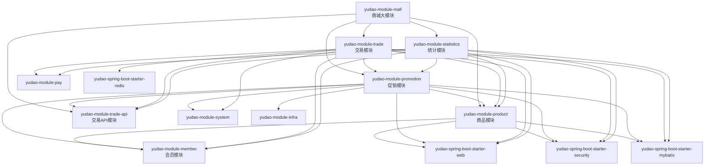
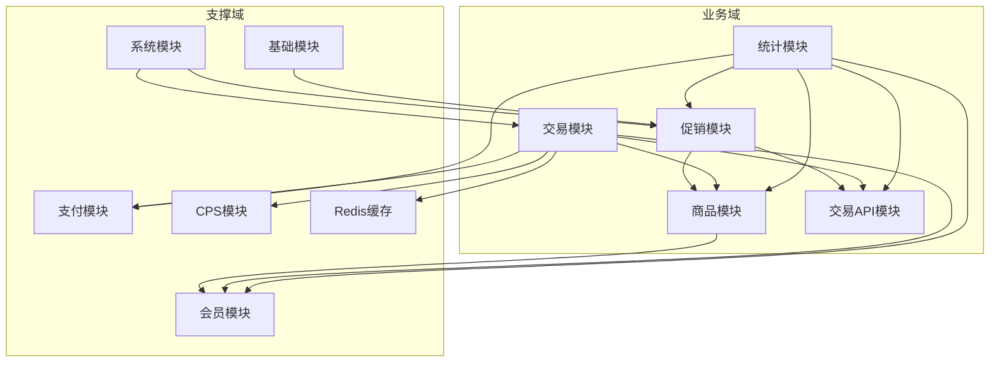
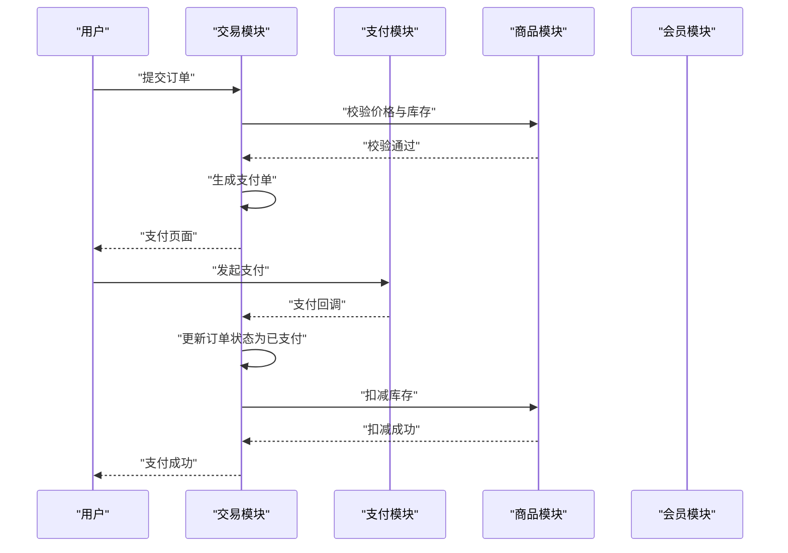
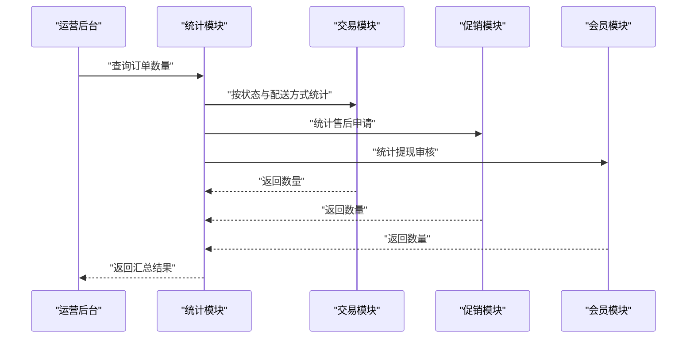
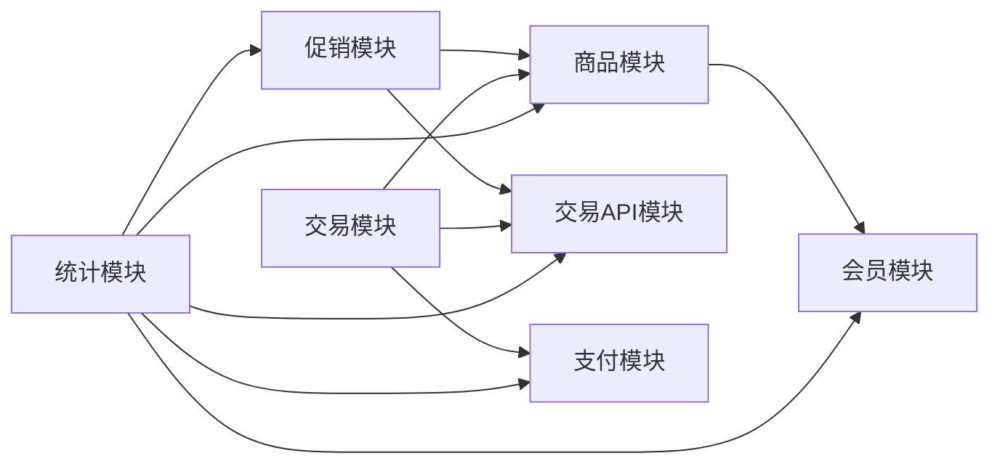

# 商城业务模块

<cite>
**本文档引用的文件**
- [yudao-module-mall/pom.xml](file://backend/yudao-module-mall/pom.xml)
- [yudao-module-product/pom.xml](file://backend/yudao-module-mall/yudao-module-product/pom.xml)
- [yudao-module-promotion/pom.xml](file://backend/yudao-module-mall/yudao-module-promotion/pom.xml)
- [yudao-module-trade/pom.xml](file://backend/yudao-module-mall/yudao-module-trade/pom.xml)
- [yudao-module-statistics/pom.xml](file://backend/yudao-module-mall/yudao-module-statistics/pom.xml)
- [yudao-module-trade-api/pom.xml](file://backend/yudao-module-mall/yudao-module-trade-api/pom.xml)
- [TradeStatisticsController.java](file://backend/yudao-module-mall/yudao-module-statistics/src/main/java/cn/iocoder/yudao/module/statistics/controller/admin/trade/TradeStatisticsController.java)
- [TradeStatisticsService.java](file://backend/yudao-module-mall/yudao-module-statistics/src/main/java/cn/iocoder/yudao/module/statistics/service/trade/TradeStatisticsService.java)
- [TradeSummaryRespBO.java](file://backend/yudao-module-mall/yudao-module-statistics/src/main/java/cn/iocoder/yudao/module/statistics/service/trade/bo/TradeSummaryRespBO.java)
- [TradeOrderSummaryRespBO.java](file://backend/yudao-module-mall/yudao-module-statistics/src/main/java/cn/iocoder/yudao/module/statistics/service/trade/bo/TradeOrderSummaryRespBO.java)
</cite>

## 目录
1. [简介](#简介)
2. [项目结构](#项目结构)
3. [核心组件](#核心组件)
4. [架构总览](#架构总览)
5. [详细组件分析](#详细组件分析)
6. [依赖分析](#依赖分析)
7. [性能考虑](#性能考虑)
8. [故障排查指南](#故障排查指南)
9. [结论](#结论)
10. [附录](#附录)

## 简介
本文件面向AgenticCPS项目中的商城业务模块，系统性梳理四大子模块：商品模块（产品管理、SKU管理、库存管理）、促销模块（优惠券、满减、拼团）、交易模块（下单、支付、发货、售后）、统计模块（销售统计、用户行为分析）。文档重点阐述各模块的业务流程、数据模型、API接口设计，并对商品搜索算法、价格计算、库存扣减、订单流转等核心逻辑进行抽象化说明。同时，明确与会员模块、支付模块、CPS模块的集成关系，提供性能优化、缓存策略与扩展开发指南，并总结电商行业最佳实践与合规要求。

## 项目结构
商城模块采用“大模块+子模块”的分层组织方式，通过yudao-module-mall聚合product、promotion、trade、statistics四个子模块，并单独拆分trade-api以打破模块间循环依赖问题。各子模块均引入通用框架能力（Web、Security、MyBatis、Redis等），并按需依赖其他业务模块。

**图表来源**
- [yudao-module-mall/pom.xml:17-33](file://backend/yudao-module-mall/pom.xml#L17-L33)
- [yudao-module-product/pom.xml:15-56](file://backend/yudao-module-mall/yudao-module-product/pom.xml#L15-L56)
- [yudao-module-promotion/pom.xml:16-81](file://backend/yudao-module-mall/yudao-module-promotion/pom.xml#L16-L81)
- [yudao-module-trade/pom.xml:15-95](file://backend/yudao-module-mall/yudao-module-trade/pom.xml#L15-L95)
- [yudao-module-statistics/pom.xml:15-84](file://backend/yudao-module-mall/yudao-module-statistics/pom.xml#L15-L84)

**章节来源**
- [yudao-module-mall/pom.xml:17-33](file://backend/yudao-module-mall/pom.xml#L17-L33)

## 核心组件
- 商品模块（product）
  - 职责：品牌、商品分类、SPU、SKU等商品基础数据管理
  - 关键依赖：会员模块（会员价/权益）、Web/Security/MyBatis
- 促销模块（promotion）
  - 职责：营销活动、优惠券、满减、拼团等促销能力
  - 关键依赖：商品模块（商品维度规则）、交易API（下单场景）、会员模块（会员专属）、System/Infra（配置与资源）
- 交易模块（trade）
  - 职责：下单、支付、发货、售后等交易全链路
  - 关键依赖：交易API、商品模块、支付模块、促销模块、会员模块、Redis（缓存）、Web/Security/MyBatis
- 统计模块（statistics）
  - 职责：销售统计、交易趋势、订单对比、费用统计等
  - 关键依赖：促销/商品/交易API、会员、支付模块
- 交易API模块（trade-api）
  - 职责：隔离交易领域公共接口，避免promotion与trade循环依赖

**章节来源**
- [yudao-module-product/pom.xml:15-56](file://backend/yudao-module-mall/yudao-module-product/pom.xml#L15-L56)
- [yudao-module-promotion/pom.xml:16-81](file://backend/yudao-module-mall/yudao-module-promotion/pom.xml#L16-L81)
- [yudao-module-trade/pom.xml:15-95](file://backend/yudao-module-mall/yudao-module-trade/pom.xml#L15-L95)
- [yudao-module-statistics/pom.xml:15-84](file://backend/yudao-module-mall/yudao-module-statistics/pom.xml#L15-L84)
- [yudao-module-mall/pom.xml:26-31](file://backend/yudao-module-mall/pom.xml#L26-L31)

## 架构总览
商城模块围绕“商品-促销-交易-统计”闭环构建，交易API作为共享契约层，促进模块解耦。交易模块与支付模块对接完成资金流闭环，与会员模块协作实现会员权益与风控，与CPS模块协同实现佣金结算与推广分成。

**图表来源**
- [yudao-module-mall/pom.xml:17-33](file://backend/yudao-module-mall/pom.xml#L17-L33)
- [yudao-module-product/pom.xml:21-25](file://backend/yudao-module-mall/yudao-module-product/pom.xml#L21-L25)
- [yudao-module-promotion/pom.xml:22-46](file://backend/yudao-module-mall/yudao-module-promotion/pom.xml#L22-L46)
- [yudao-module-trade/pom.xml:21-45](file://backend/yudao-module-mall/yudao-module-trade/pom.xml#L21-L45)
- [yudao-module-statistics/pom.xml:21-45](file://backend/yudao-module-mall/yudao-module-statistics/pom.xml#L21-L45)

## 详细组件分析

### 商品模块（产品管理、SKU管理、库存管理）
- 业务职责
  - 商品基础信息：品牌、分类、SPU/SKU定义与维护
  - SKU维度：规格组合、价格、库存、图片、卖点等
  - 库存管理：实时库存、冻结库存、库存扣减与回滚
- 数据模型（概念性）
  - 商品表：SPU主表，记录品牌、分类、基础属性
  - SKU表：SKU明细，关联SPU，记录价格、库存、规格值
  - 库存流水：记录出入库、冻结/释放、异常处理
- API设计（概念性）
  - 商品查询：分页、筛选、排序、搜索
  - SKU详情：规格组合校验、价格与库存校验
  - 库存锁定/扣减/释放：幂等、超卖保护、事务一致性
- 核心逻辑
  - 商品搜索算法：关键词分词、多维过滤、权重排序、分页
  - 价格计算：原价、会员价、促销价叠加/互斥、税费
  - 库存扣减：分布式锁/队列削峰、超卖保护、异步回滚
- 集成关系
  - 与会员模块：会员价、等级折扣
  - 与促销模块：参与满减、优惠券、拼团等
  - 与交易模块：下单时校验价格与库存
  - 与统计模块：销量、评价、转化率等指标

**章节来源**
- [yudao-module-product/pom.xml:15-56](file://backend/yudao-module-mall/yudao-module-product/pom.xml#L15-L56)

### 促销模块（优惠券、满减、拼团）
- 业务职责
  - 优惠券：发放、核销、使用范围、有效期
  - 满减：门槛、减免金额、适用商品/品类
  - 拼团：拼团规则、成团条件、团购价
- 数据模型（概念性）
  - 优惠券模板：面额、门槛、有效期、适用范围
  - 用户券：状态、使用记录、过期处理
  - 活动规则：满减阈值、折扣策略、互斥规则
  - 拼团活动：成团价、参团人数、有效期
- API设计（概念性）
  - 券列表/详情、领取、可用性校验
  - 订单结算页：可用券/满减/拼团价计算
  - 核销：券状态校验、幂等处理
- 核心逻辑
  - 价格计算：券/满减/拼团价叠加与互斥、边界值处理
  - 规则引擎：动态规则匹配、优先级与去重
  - 并发控制：券库存、活动库存、超卖防护
- 集成关系
  - 与商品模块：适用范围校验
  - 与交易模块：下单时生效、支付时确认
  - 与统计模块：券使用、活动效果分析

**章节来源**
- [yudao-module-promotion/pom.xml:16-81](file://backend/yudao-module-mall/yudao-module-promotion/pom.xml#L16-L81)

### 交易模块（下单、支付、发货、售后）
- 业务职责
  - 下单：购物车转订单、价格计算、库存锁定
  - 支付：支付渠道对接、支付状态同步、回调处理
  - 发货：订单出库、物流信息、发货通知
  - 售后：退款/退货申请、审核、打款
- 数据模型（概念性）
  - 订单主表：订单号、用户、收货信息、应付金额
  - 订单明细：商品SKU、单价、数量、实付
  - 支付单：支付渠道、支付金额、状态、回调记录
  - 售后单：类型、状态、凭证、处理结果
- API设计（概念性）
  - 提交订单、修改收货信息、取消订单
  - 支付下单、查询支付状态、支付回调
  - 发货、收货确认、申请售后、撤销售后
- 核心逻辑
  - 订单流转：待支付→已支付→已发货→已完成/已取消
  - 库存扣减：预占库存、支付成功扣减、失败回滚
  - 价格计算：商品价、运费、优惠、积分抵扣、实付
  - 售后闭环：申请→审核→处理→完结
- 集成关系
  - 与商品模块：价格与库存校验
  - 与支付模块：支付通道、回调、对账
  - 与会员模块：积分、优惠、风控
  - 与CPS模块：佣金计算与结算

**图表来源**
- [yudao-module-trade/pom.xml:21-45](file://backend/yudao-module-mall/yudao-module-trade/pom.xml#L21-L45)
- [yudao-module-pay/pom.xml:1-200](file://backend/yudao-module-pay/pom.xml#L1-L200)

**章节来源**
- [yudao-module-trade/pom.xml:15-95](file://backend/yudao-module-mall/yudao-module-trade/pom.xml#L15-L95)

### 统计模块（销售统计、用户行为分析）
- 业务职责
  - 销售统计：订单数量、支付金额、费用统计
  - 交易趋势：同比/环比、周期对比
  - 订单概览：创建/支付/发货/售后等关键指标
- 数据模型（概念性）
  - 交易统计表：日期、订单数、GMV、成本、利润
  - 行为分析表：浏览、加购、收藏、下单、支付等行为
- API设计（示例：基于现有统计控制器）
  - 获取交易订单数量：未发货、门店自提、售后申请、提现审核等
  - 获取交易订单对比：趋势对比、同比/环比
- 核心逻辑
  - 时间维度聚合：日/周/月/年
  - 指标计算：订单数、支付金额、退款金额、费用支出
  - 对比分析：基期/报告期、增减额/增长率

**图表来源**
- [TradeStatisticsController.java:96-117](file://backend/yudao-module-mall/yudao-module-statistics/src/main/java/cn/iocoder/yudao/module/statistics/controller/admin/trade/TradeStatisticsController.java#L96-L117)
- [TradeStatisticsService.java:16-46](file://backend/yudao-module-mall/yudao-module-statistics/src/main/java/cn/iocoder/yudao/module/statistics/service/trade/TradeStatisticsService.java#L16-L46)

**章节来源**
- [TradeStatisticsController.java:96-117](file://backend/yudao-module-mall/yudao-module-statistics/src/main/java/cn/iocoder/yudao/module/statistics/controller/admin/trade/TradeStatisticsController.java#L96-L117)
- [TradeStatisticsService.java:16-46](file://backend/yudao-module-mall/yudao-module-statistics/src/main/java/cn/iocoder/yudao/module/statistics/service/trade/TradeStatisticsService.java#L16-L46)
- [TradeSummaryRespBO.java:11-23](file://backend/yudao-module-mall/yudao-module-statistics/src/main/java/cn/iocoder/yudao/module/statistics/service/trade/bo/TradeSummaryRespBO.java#L11-L23)
- [TradeOrderSummaryRespBO.java:11-26](file://backend/yudao-module-mall/yudao-module-statistics/src/main/java/cn/iocoder/yudao/module/statistics/service/trade/bo/TradeOrderSummaryRespBO.java#L11-L26)

## 依赖分析
- 模块内聚与耦合
  - 商品模块：低耦合，主要依赖会员模块与基础框架
  - 促销模块：中等耦合，依赖商品、交易API、会员、系统与基础设施
  - 交易模块：高耦合，依赖支付、商品、促销、会员、系统与Redis
  - 统计模块：高耦合，依赖促销、商品、交易API、会员、支付
- 循环依赖规避
  - 通过trade-api抽取公共接口，promotion依赖trade-api，trade依赖promotion，形成单向依赖链

**图表来源**
- [yudao-module-mall/pom.xml:26-31](file://backend/yudao-module-mall/pom.xml#L26-L31)
- [yudao-module-product/pom.xml:21-25](file://backend/yudao-module-mall/yudao-module-product/pom.xml#L21-L25)
- [yudao-module-promotion/pom.xml:22-31](file://backend/yudao-module-mall/yudao-module-promotion/pom.xml#L22-L31)
- [yudao-module-trade/pom.xml:21-45](file://backend/yudao-module-mall/yudao-module-trade/pom.xml#L21-L45)
- [yudao-module-statistics/pom.xml:21-45](file://backend/yudao-module-mall/yudao-module-statistics/pom.xml#L21-L45)

**章节来源**
- [yudao-module-mall/pom.xml:26-31](file://backend/yudao-module-mall/pom.xml#L26-L31)

## 性能考虑
- 缓存策略
  - 商品详情与SKU：热点商品缓存（Redis），设置合理TTL，热点失效与异步刷新
  - 促销规则：规则模板缓存，版本号控制，灰度发布
  - 订单与支付：轻量查询走缓存，写路径采用最终一致
- 并发与限流
  - 秒杀/拼团：令牌桶/漏桶限流，库存预占+异步扣减
  - 支付回调：幂等处理、去重表、消息队列削峰
- 分布式一致性
  - 库存扣减：本地事务+异步补偿，超时回滚
  - 价格计算：规则缓存+版本校验，计算结果落库校验
- 数据库优化
  - 索引：订单号、用户、时间、状态等常用查询字段
  - 分表分库：按时间或用户ID分片，降低热点
- 监控与可观测性
  - 关键链路埋点：下单、支付、库存扣减、售后
  - 链路追踪：统一Trace ID，跨服务串联

## 故障排查指南
- 常见问题
  - 库存超卖：检查预占/扣减流程与回滚逻辑，确认分布式锁与事务
  - 价格异常：核对促销叠加规则、会员价、税费计算顺序
  - 支付回调不一致：检查幂等键、去重表、消息重试
  - 统计偏差：核对时间维度、口径一致、数据延迟
- 排查步骤
  - 快速定位：查看链路追踪与错误日志
  - 数据核对：订单、支付、库存、促销券流水
  - 回放验证：构造最小复现场景，验证修复
- 运维建议
  - 告警阈值：超时、错误率、库存预警、支付延迟
  - 自动化：压测、灰度发布、自动回滚

## 结论
商城模块通过清晰的模块划分与交易API契约，实现了商品、促销、交易、统计的高效协同。在保证高并发与一致性的前提下，结合缓存、限流、监控等手段，可满足电商业务的复杂需求。后续可在规则引擎、智能推荐、风控体系等方面持续演进，进一步提升用户体验与运营效率。

## 附录
- 电商最佳实践
  - 用户体验：极致首屏、流畅交互、一致的视觉与交互
  - 商品管理：标准化SPU/SKU、多图多规格、价格与库存透明
  - 促销策略：动态定价、A/B测试、效果追踪
  - 支付安全：合规接入、加密传输、风控模型、对账自动化
  - 售后服务：自助化、可视化、时效性与满意度
- 合规要求
  - 个人信息保护：收集与使用需明示同意，保障访问与删除权
  - 价格与广告合规：明码标价、不得虚构交易、不得误导性宣传
  - 支付与资金安全：第三方支付持牌、资金存管、反洗钱
  - 数据安全：数据分级、访问控制、审计日志、跨境传输合规