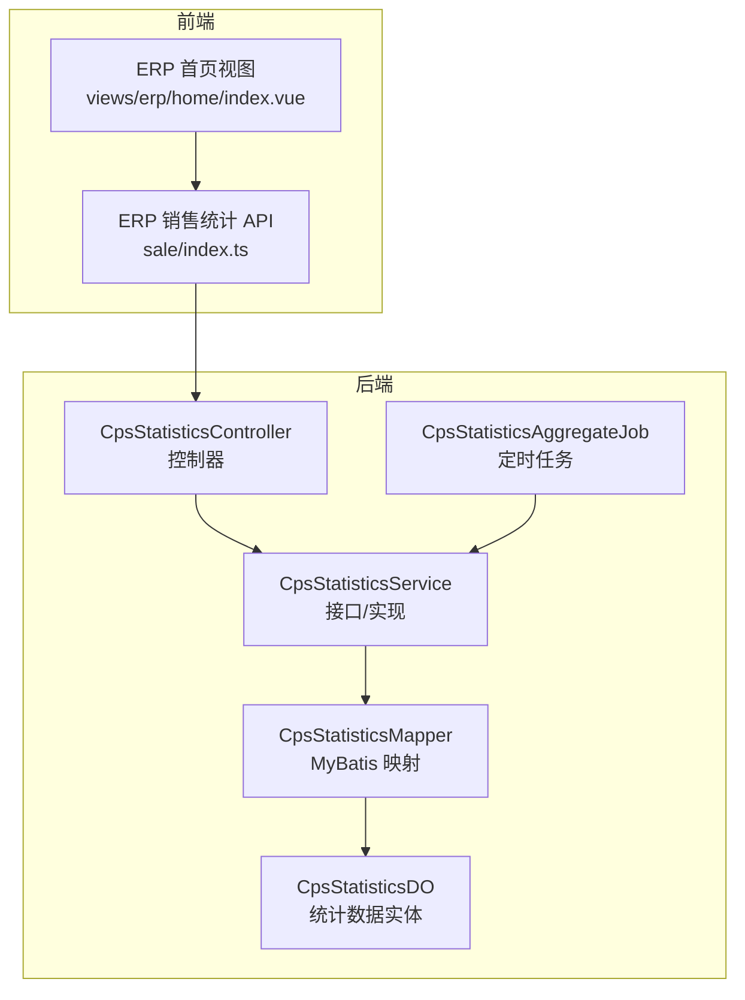
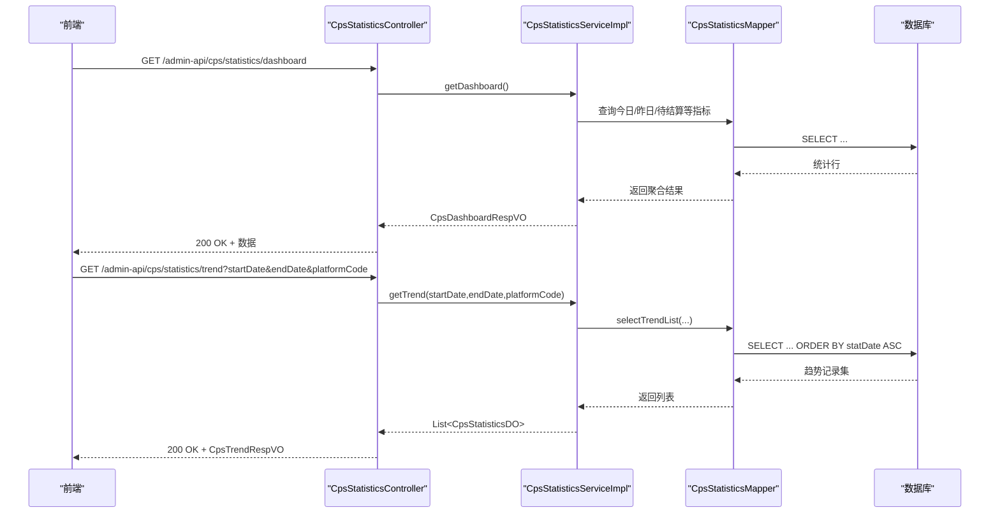
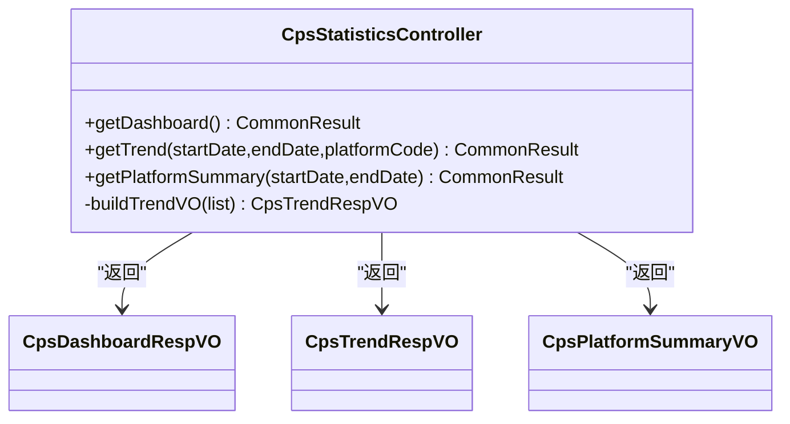
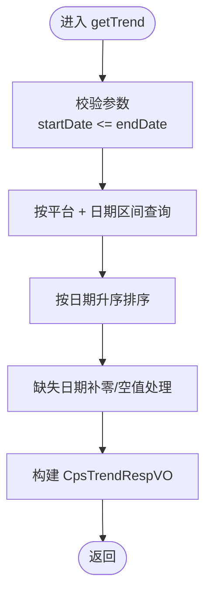
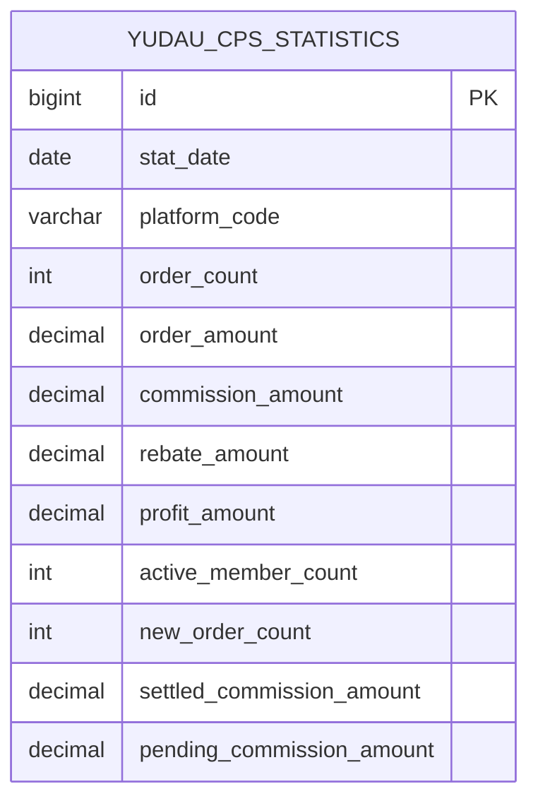
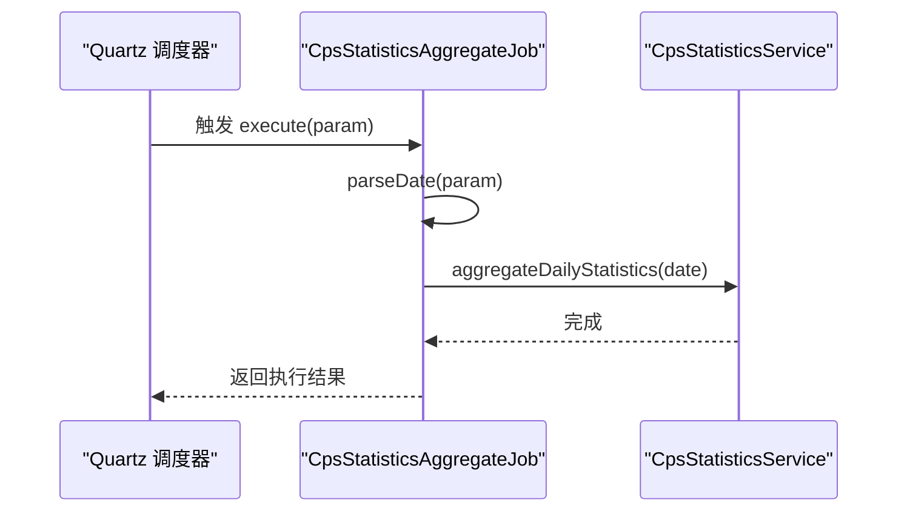
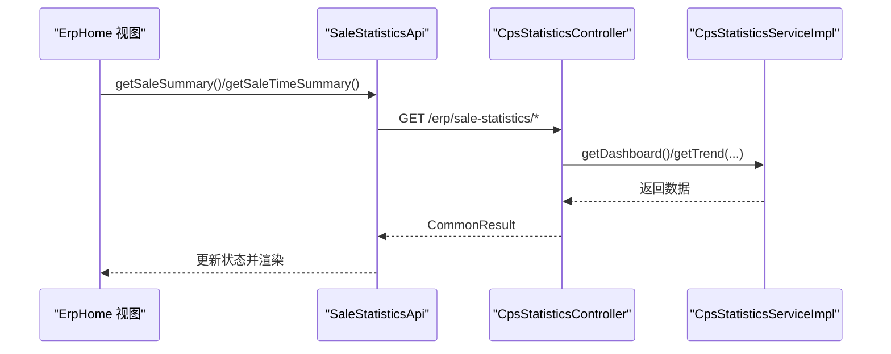
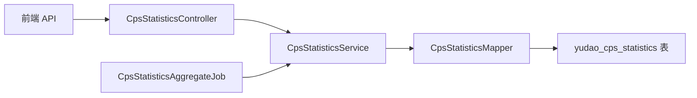

# 统计模块

<cite>
**本文引用的文件**
- [CpsStatisticsController.java](file://backend/yudao-module-cps/yudao-module-cps-biz/src/main/java/cn/iocoder/yudao/module/cps/controller/admin/statistics/CpsStatisticsController.java)
- [CpsStatisticsService.java](file://backend/yudao-module-cps/yudao-module-cps-biz/src/main/java/cn/iocoder/yudao/module/cps/service/statistics/CpsStatisticsService.java)
- [CpsStatisticsServiceImpl.java](file://backend/yudao-module-cps/yudao-module-cps-biz/src/main/java/cn/iocoder/yudao/module/cps/service/statistics/CpsStatisticsServiceImpl.java)
- [CpsStatisticsMapper.java](file://backend/yudao-module-cps/yudao-module-cps-biz/src/main/java/cn/iocoder/yudao/module/cps/dal/mysql/statistics/CpsStatisticsMapper.java)
- [CpsStatisticsDO.java](file://backend/yudao-module-cps/yudao-module-cps-biz/src/main/java/cn/iocoder/yudao/module/cps/dal/dataobject/statistics/CpsStatisticsDO.java)
- [CpsDashboardRespVO.java](file://backend/yudao-module-cps/yudao-module-cps-biz/src/main/java/cn/iocoder/yudao/module/cps/controller/admin/statistics/vo/CpsDashboardRespVO.java)
- [CpsPlatformSummaryVO.java](file://backend/yudao-module-cps/yudao-module-cps-biz/src/main/java/cn/iocoder/yudao/module/cps/controller/admin/statistics/vo/CpsPlatformSummaryVO.java)
- [CpsTrendRespVO.java](file://backend/yudao-module-cps/yudao-module-cps-biz/src/main/java/cn/iocoder/yudao/module/cps/controller/admin/statistics/vo/CpsTrendRespVO.java)
- [CpsStatisticsAggregateJob.java](file://backend/yudao-module-cps/yudao-module-cps-biz/src/main/java/cn/iocoder/yudao/module/cps/job/CpsStatisticsAggregateJob.java)
- [ErpSaleStatisticsApi](file://frontend/admin-vue3/src/api/erp/statistics/sale/index.ts)
- [ErpHome视图](file://frontend/admin-vue3/src/views/erp/home/index.vue)
</cite>

## 目录
1. [简介](#简介)
2. [项目结构](#项目结构)
3. [核心组件](#核心组件)
4. [架构总览](#架构总览)
5. [详细组件分析](#详细组件分析)
6. [依赖关系分析](#依赖关系分析)
7. [性能考虑](#性能考虑)
8. [故障排查指南](#故障排查指南)
9. [结论](#结论)
10. [附录](#附录)

## 简介
本文件系统性梳理电商系统的统计模块，覆盖销售统计、趋势分析、平台占比、运营看板等核心指标。文档重点阐述：
- 实时与离线统计的数据来源与计算逻辑
- 定时任务的调度机制与容错策略
- 数据模型与聚合算法、维度划分（时间、平台）
- 图表展示与前端集成方式
- 性能优化、数据一致性与历史数据处理建议

## 项目结构
统计模块位于后端 CPS 模块中，采用“控制层-服务层-数据访问层”分层设计，并通过 Quartz 定时任务进行离线聚合。

**图表来源**
- [CpsStatisticsController.java:33-72](file://backend/yudao-module-cps/yudao-module-cps-biz/src/main/java/cn/iocoder/yudao/module/cps/controller/admin/statistics/CpsStatisticsController.java#L33-L72)
- [CpsStatisticsService.java:15-46](file://backend/yudao-module-cps/yudao-module-cps-biz/src/main/java/cn/iocoder/yudao/module/cps/service/statistics/CpsStatisticsService.java#L15-L46)
- [CpsStatisticsServiceImpl.java](file://backend/yudao-module-cps/yudao-module-cps-biz/src/main/java/cn/iocoder/yudao/module/cps/service/statistics/CpsStatisticsServiceImpl.java)
- [CpsStatisticsAggregateJob.java:27-42](file://backend/yudao-module-cps/yudao-module-cps-biz/src/main/java/cn/iocoder/yudao/module/cps/job/CpsStatisticsAggregateJob.java#L27-L42)
- [CpsStatisticsMapper.java:16-50](file://backend/yudao-module-cps/yudao-module-cps-biz/src/main/java/cn/iocoder/yudao/module/cps/dal/mysql/statistics/CpsStatisticsMapper.java#L16-L50)
- [CpsStatisticsDO.java:25-76](file://backend/yudao-module-cps/yudao-module-cps-biz/src/main/java/cn/iocoder/yudao/module/cps/dal/dataobject/statistics/CpsStatisticsDO.java#L25-L76)

**章节来源**
- [CpsStatisticsController.java:33-72](file://backend/yudao-module-cps/yudao-module-cps-biz/src/main/java/cn/iocoder/yudao/module/cps/controller/admin/statistics/CpsStatisticsController.java#L33-L72)
- [CpsStatisticsService.java:15-46](file://backend/yudao-module-cps/yudao-module-cps-biz/src/main/java/cn/iocoder/yudao/module/cps/service/statistics/CpsStatisticsService.java#L15-L46)
- [CpsStatisticsMapper.java:16-50](file://backend/yudao-module-cps/yudao-module-cps-biz/src/main/java/cn/iocoder/yudao/module/cps/dal/mysql/statistics/CpsStatisticsMapper.java#L16-L50)
- [CpsStatisticsDO.java:25-76](file://backend/yudao-module-cps/yudao-module-cps-biz/src/main/java/cn/iocoder/yudao/module/cps/dal/dataobject/statistics/CpsStatisticsDO.java#L25-L76)

## 核心组件
- 控制器：提供运营看板、趋势图、平台占比等接口，负责参数校验与结果封装
- 服务层：定义聚合、看板、趋势、平台汇总等业务方法
- 数据访问层：基于 MyBatis 提供按日期+平台精确查询、趋势区间查询、平台汇总查询
- 数据对象：存储每日按平台维度的订单、佣金、返利、利润、活跃会员等指标
- 定时任务：每日凌晨聚合前一日数据，写入统计表
- 前端集成：ERP 销售统计 API 与首页视图联动展示

**章节来源**
- [CpsStatisticsController.java:33-72](file://backend/yudao-module-cps/yudao-module-cps-biz/src/main/java/cn/iocoder/yudao/module/cps/controller/admin/statistics/CpsStatisticsController.java#L33-L72)
- [CpsStatisticsService.java:15-46](file://backend/yudao-module-cps/yudao-module-cps-biz/src/main/java/cn/iocoder/yudao/module/cps/service/statistics/CpsStatisticsService.java#L15-L46)
- [CpsStatisticsMapper.java:16-50](file://backend/yudao-module-cps/yudao-module-cps-biz/src/main/java/cn/iocoder/yudao/module/cps/dal/mysql/statistics/CpsStatisticsMapper.java#L16-L50)
- [CpsStatisticsDO.java:25-76](file://backend/yudao-module-cps/yudao-module-cps-biz/src/main/java/cn/iocoder/yudao/module/cps/dal/dataobject/statistics/CpsStatisticsDO.java#L25-L76)
- [CpsStatisticsAggregateJob.java:27-42](file://backend/yudao-module-cps/yudao-module-cps-biz/src/main/java/cn/iocoder/yudao/module/cps/job/CpsStatisticsAggregateJob.java#L27-L42)
- [ErpSaleStatisticsApi:18-28](file://frontend/admin-vue3/src/api/erp/statistics/sale/index.ts#L18-L28)
- [ErpHome视图:45-66](file://frontend/admin-vue3/src/views/erp/home/index.vue#L45-L66)

## 架构总览
统计模块遵循“离线聚合 + 实时查询”的架构模式：
- 离线聚合：定时任务每日凌晨汇总前一日订单数据，写入 yudao_cps_statistics
- 实时查询：运营看板与趋势图从统计表按需查询，支持按平台筛选与时间区间过滤
- 前端展示：通过 API 获取数据并渲染图表与卡片

**图表来源**
- [CpsStatisticsController.java:42-61](file://backend/yudao-module-cps/yudao-module-cps-biz/src/main/java/cn/iocoder/yudao/module/cps/controller/admin/statistics/CpsStatisticsController.java#L42-L61)
- [CpsStatisticsService.java:27-44](file://backend/yudao-module-cps/yudao-module-cps-biz/src/main/java/cn/iocoder/yudao/module/cps/service/statistics/CpsStatisticsService.java#L27-L44)
- [CpsStatisticsMapper.java:29-48](file://backend/yudao-module-cps/yudao-module-cps-biz/src/main/java/cn/iocoder/yudao/module/cps/dal/mysql/statistics/CpsStatisticsMapper.java#L29-L48)

## 详细组件分析

### 控制器层：CpsStatisticsController
- 提供三个核心接口：
  - 运营看板：返回今日与昨日关键指标及累计待结算/已结算佣金
  - 趋势图：按日返回订单数、佣金、返利、利润序列
  - 平台占比：按平台汇总订单数与收益，用于饼图
- 参数校验：日期格式、平台编码默认 total（全平台）
- 结果封装：将 List<CpsStatisticsDO> 转换为 CpsTrendRespVO

**图表来源**
- [CpsStatisticsController.java:42-72](file://backend/yudao-module-cps/yudao-module-cps-biz/src/main/java/cn/iocoder/yudao/module/cps/controller/admin/statistics/CpsStatisticsController.java#L42-L72)
- [CpsDashboardRespVO.java:14-50](file://backend/yudao-module-cps/yudao-module-cps-biz/src/main/java/cn/iocoder/yudao/module/cps/controller/admin/statistics/vo/CpsDashboardRespVO.java#L14-L50)
- [CpsTrendRespVO.java:15-33](file://backend/yudao-module-cps/yudao-module-cps-biz/src/main/java/cn/iocoder/yudao/module/cps/controller/admin/statistics/vo/CpsTrendRespVO.java#L15-L33)
- [CpsPlatformSummaryVO.java:14-35](file://backend/yudao-module-cps/yudao-module-cps-biz/src/main/java/cn/iocoder/yudao/module/cps/controller/admin/statistics/vo/CpsPlatformSummaryVO.java#L14-L35)

**章节来源**
- [CpsStatisticsController.java:33-72](file://backend/yudao-module-cps/yudao-module-cps-biz/src/main/java/cn/iocoder/yudao/module/cps/controller/admin/statistics/CpsStatisticsController.java#L33-L72)
- [CpsDashboardRespVO.java:14-50](file://backend/yudao-module-cps/yudao-module-cps-biz/src/main/java/cn/iocoder/yudao/module/cps/controller/admin/statistics/vo/CpsDashboardRespVO.java#L14-L50)
- [CpsTrendRespVO.java:15-33](file://backend/yudao-module-cps/yudao-module-cps-biz/src/main/java/cn/iocoder/yudao/module/cps/controller/admin/statistics/vo/CpsTrendRespVO.java#L15-L33)
- [CpsPlatformSummaryVO.java:14-35](file://backend/yudao-module-cps/yudao-module-cps-biz/src/main/java/cn/iocoder/yudao/module/cps/controller/admin/statistics/vo/CpsPlatformSummaryVO.java#L14-L35)

### 服务层：CpsStatisticsService 与实现
- 职责边界：
  - aggregateDailyStatistics：供定时任务调用，按日聚合
  - getDashboard：返回今日/昨日关键指标与累计待结算/已结算
  - getTrend：按时间区间与平台维度返回趋势
  - getPlatformSummary：按平台汇总，用于饼图
- 实现要点：
  - 通过 Mapper 查询并聚合，确保时间维度连续性与平台维度完整性
  - 对空值进行安全处理（如 0、BigDecimal.ZERO）

**图表来源**
- [CpsStatisticsService.java:29-44](file://backend/yudao-module-cps/yudao-module-cps-biz/src/main/java/cn/iocoder/yudao/module/cps/service/statistics/CpsStatisticsService.java#L29-L44)
- [CpsStatisticsMapper.java:29-48](file://backend/yudao-module-cps/yudao-module-cps-biz/src/main/java/cn/iocoder/yudao/module/cps/dal/mysql/statistics/CpsStatisticsMapper.java#L29-L48)

**章节来源**
- [CpsStatisticsService.java:15-46](file://backend/yudao-module-cps/yudao-module-cps-biz/src/main/java/cn/iocoder/yudao/module/cps/service/statistics/CpsStatisticsService.java#L15-L46)
- [CpsStatisticsMapper.java:16-50](file://backend/yudao-module-cps/yudao-module-cps-biz/src/main/java/cn/iocoder/yudao/module/cps/dal/mysql/statistics/CpsStatisticsMapper.java#L16-L50)

### 数据访问层：CpsStatisticsMapper
- 精确查询：按 statDate + platformCode 查询单条记录
- 区间查询：按 platformCode 与日期范围查询趋势列表，按日期升序
- 平台汇总：排除 total 行，按平台维度聚合求和

**图表来源**
- [CpsStatisticsDO.java:25-76](file://backend/yudao-module-cps/yudao-module-cps-biz/src/main/java/cn/iocoder/yudao/module/cps/dal/dataobject/statistics/CpsStatisticsDO.java#L25-L76)

**章节来源**
- [CpsStatisticsMapper.java:16-50](file://backend/yudao-module-cps/yudao-module-cps-biz/src/main/java/cn/iocoder/yudao/module/cps/dal/mysql/statistics/CpsStatisticsMapper.java#L16-L50)
- [CpsStatisticsDO.java:25-76](file://backend/yudao-module-cps/yudao-module-cps-biz/src/main/java/cn/iocoder/yudao/module/cps/dal/dataobject/statistics/CpsStatisticsDO.java#L25-L76)

### 定时任务：CpsStatisticsAggregateJob
- 执行时机：每日凌晨 1 点（CRON：0 0 1 * * ?）
- 功能：解析处理器参数中的日期，若为空则默认取昨日；调用服务层聚合
- 容错：参数解析失败时回退到昨日；日志记录开始与结束

**图表来源**
- [CpsStatisticsAggregateJob.java:34-42](file://backend/yudao-module-cps/yudao-module-cps-biz/src/main/java/cn/iocoder/yudao/module/cps/job/CpsStatisticsAggregateJob.java#L34-L42)

**章节来源**
- [CpsStatisticsAggregateJob.java:11-61](file://backend/yudao-module-cps/yudao-module-cps-biz/src/main/java/cn/iocoder/yudao/module/cps/job/CpsStatisticsAggregateJob.java#L11-L61)

### 前端集成：ERP 销售统计 API 与首页
- API 定义：销售概览与时间段统计接口
- 首页视图：加载销售与采购的时间段统计并渲染图表
- 交互流程：组件发起请求 -> 控制器 -> 服务层 -> Mapper -> 数据库

**图表来源**
- [ErpHome视图:45-66](file://frontend/admin-vue3/src/views/erp/home/index.vue#L45-L66)
- [ErpSaleStatisticsApi:18-28](file://frontend/admin-vue3/src/api/erp/statistics/sale/index.ts#L18-L28)
- [CpsStatisticsController.java:42-72](file://backend/yudao-module-cps/yudao-module-cps-biz/src/main/java/cn/iocoder/yudao/module/cps/controller/admin/statistics/CpsStatisticsController.java#L42-L72)

**章节来源**
- [ErpSaleStatisticsApi:1-28](file://frontend/admin-vue3/src/api/erp/statistics/sale/index.ts#L1-L28)
- [ErpHome视图:45-66](file://frontend/admin-vue3/src/views/erp/home/index.vue#L45-L66)

## 依赖关系分析
- 控制器依赖服务接口，解耦具体实现
- 服务层依赖 Mapper，Mapper 依赖数据库表 yudao_cps_statistics
- 定时任务依赖服务接口，驱动离线聚合
- 前端通过 API 间接依赖控制器

**图表来源**
- [CpsStatisticsController.java:33-72](file://backend/yudao-module-cps/yudao-module-cps-biz/src/main/java/cn/iocoder/yudao/module/cps/controller/admin/statistics/CpsStatisticsController.java#L33-L72)
- [CpsStatisticsService.java:15-46](file://backend/yudao-module-cps/yudao-module-cps-biz/src/main/java/cn/iocoder/yudao/module/cps/service/statistics/CpsStatisticsService.java#L15-L46)
- [CpsStatisticsMapper.java:16-50](file://backend/yudao-module-cps/yudao-module-cps-biz/src/main/java/cn/iocoder/yudao/module/cps/dal/mysql/statistics/CpsStatisticsMapper.java#L16-L50)
- [CpsStatisticsAggregateJob.java:27-42](file://backend/yudao-module-cps/yudao-module-cps-biz/src/main/java/cn/iocoder/yudao/module/cps/job/CpsStatisticsAggregateJob.java#L27-L42)

**章节来源**
- [CpsStatisticsController.java:33-72](file://backend/yudao-module-cps/yudao-module-cps-biz/src/main/java/cn/iocoder/yudao/module/cps/controller/admin/statistics/CpsStatisticsController.java#L33-L72)
- [CpsStatisticsService.java:15-46](file://backend/yudao-module-cps/yudao-module-cps-biz/src/main/java/cn/iocoder/yudao/module/cps/service/statistics/CpsStatisticsService.java#L15-L46)
- [CpsStatisticsMapper.java:16-50](file://backend/yudao-module-cps/yudao-module-cps-biz/src/main/java/cn/iocoder/yudao/module/cps/dal/mysql/statistics/CpsStatisticsMapper.java#L16-L50)
- [CpsStatisticsAggregateJob.java:27-42](file://backend/yudao-module-cps/yudao-module-cps-biz/src/main/java/cn/iocoder/yudao/module/cps/job/CpsStatisticsAggregateJob.java#L27-L42)

## 性能考虑
- 查询优化
  - 趋势查询按日期升序，减少排序开销
  - 使用精确条件（statDate + platformCode）与范围查询，配合索引提升命中率
- 缓存策略
  - 可对“运营看板”高频读取数据进行短期缓存（如 5 分钟），降低数据库压力
  - 缓存键建议包含 tenantId 与 platformCode，避免跨租户/跨平台污染
- 写入优化
  - 聚合任务在凌晨执行，避开业务高峰
  - 批量写入建议使用 MyBatis Plus 的批量插入/更新能力
- 数据一致性
  - 聚合任务以“前一日”为粒度，避免并发写冲突
  - 若需要强一致，可在聚合过程中加分布式锁或幂等写入
- 历史数据处理
  - 建议定期清理过期历史数据，控制表规模
  - 对缺失日期进行补零策略，保证趋势图连续性

## 故障排查指南
- 定时任务未执行
  - 检查 Quartz 调度器是否启动、CRON 表达式是否正确
  - 查看日志中“开始汇总”与“汇总完成”信息
- 趋势数据缺失
  - 确认聚合任务是否成功执行，核对 yudao_cps_statistics 中是否存在对应日期记录
  - 检查 platformCode 是否传入 total 或具体平台编码
- 看板数据异常
  - 核对今日/昨日日期边界与平台维度
  - 检查 Mapper 查询条件与空值处理逻辑
- 前端无数据
  - 确认 API 地址与权限配置
  - 检查网络请求与返回状态码

**章节来源**
- [CpsStatisticsAggregateJob.java:16-21](file://backend/yudao-module-cps/yudao-module-cps-biz/src/main/java/cn/iocoder/yudao/module/cps/job/CpsStatisticsAggregateJob.java#L16-L21)
- [CpsStatisticsController.java:52-61](file://backend/yudao-module-cps/yudao-module-cps-biz/src/main/java/cn/iocoder/yudao/module/cps/controller/admin/statistics/CpsStatisticsController.java#L52-L61)

## 结论
统计模块通过“离线聚合 + 实时查询”的方式，实现了销售看板、趋势分析与平台占比等核心功能。其清晰的分层设计、明确的职责边界与可扩展的聚合策略，为后续扩展更多维度（如用户、商品）提供了良好基础。建议在生产环境中结合缓存与索引策略进一步优化性能，并完善监控与告警机制。

## 附录
- 关键指标说明
  - 销售看板：今日/昨日订单数、佣金、返利、利润、活跃会员数、累计待结算/已结算佣金
  - 趋势图：按日聚合的订单数、佣金、返利、利润序列
  - 平台占比：各平台订单数与收益占比
- 维度划分
  - 时间维度：按日粒度
  - 平台维度：total（全平台）与其他平台编码
- 数据导出与可视化
  - 前端可通过获取的趋势数据进行图表渲染
  - 导出建议在后端提供 CSV/Excel 接口，按日期区间与平台筛选导出