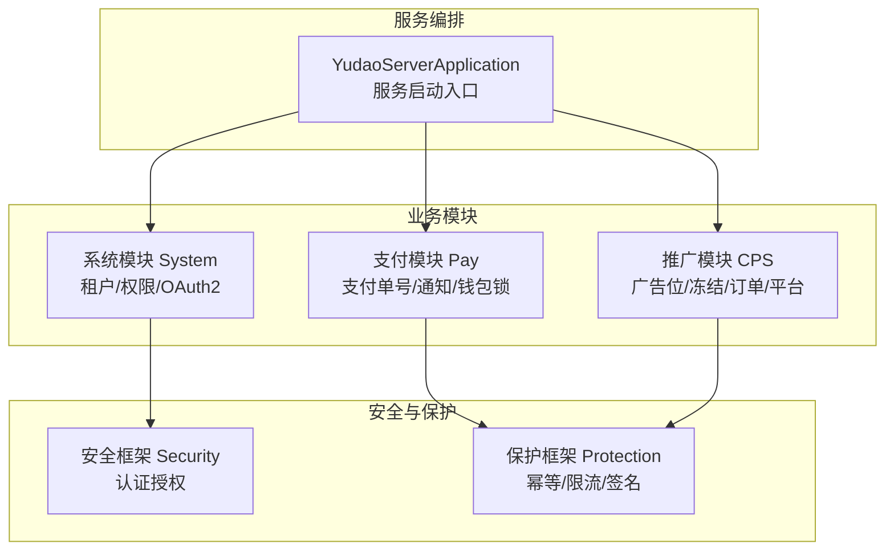
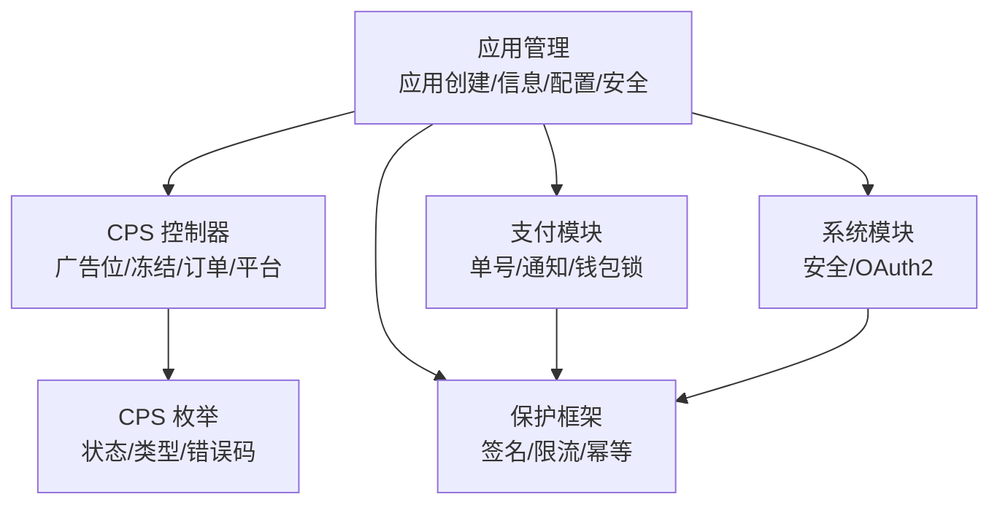
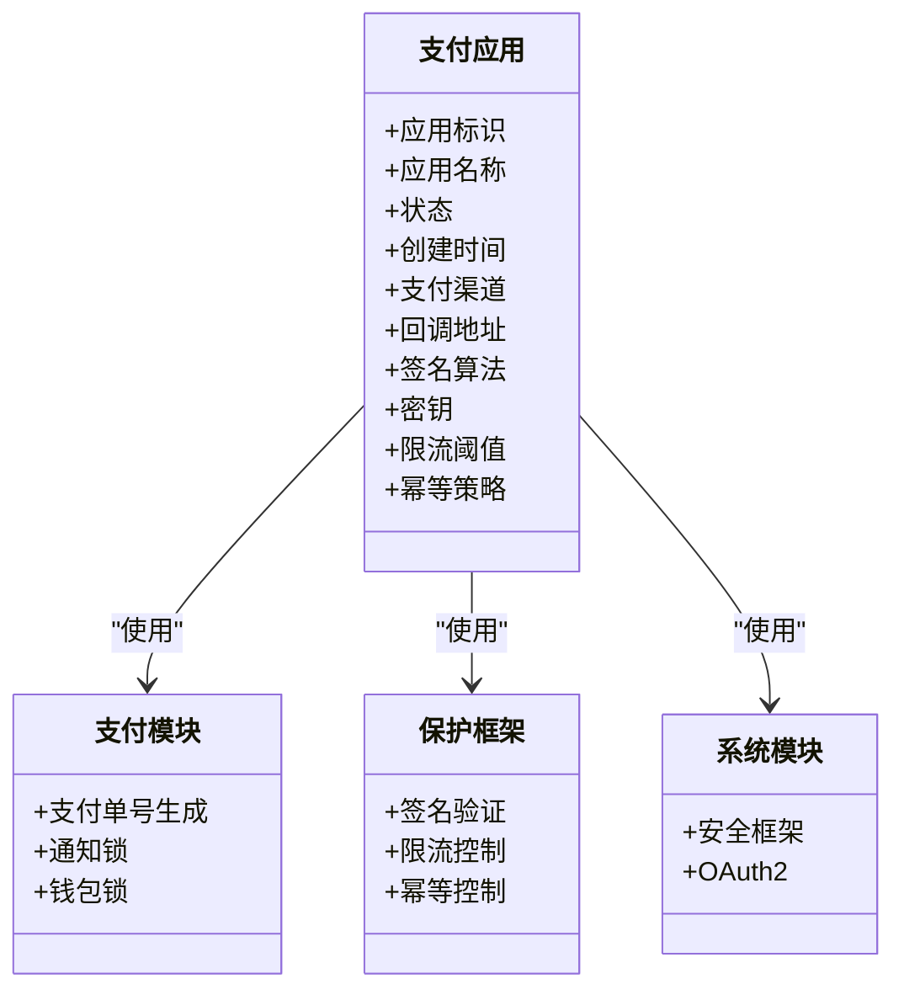
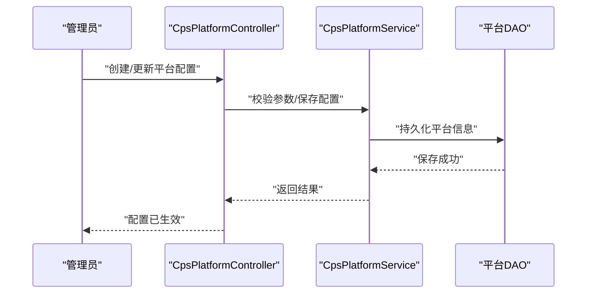
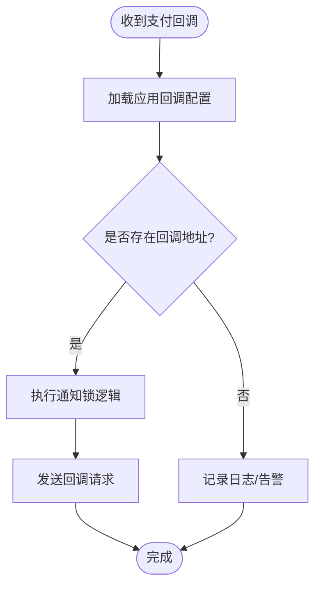
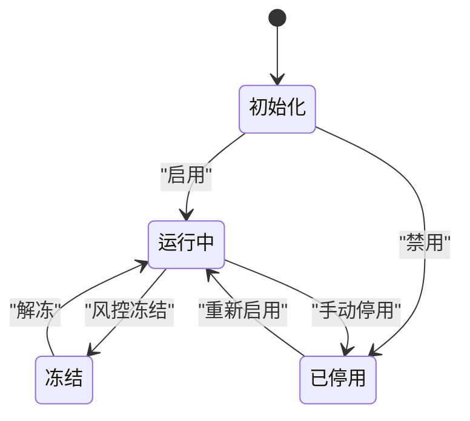
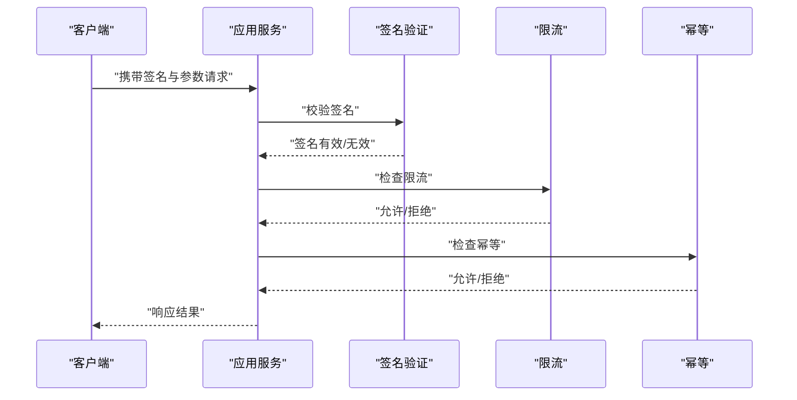
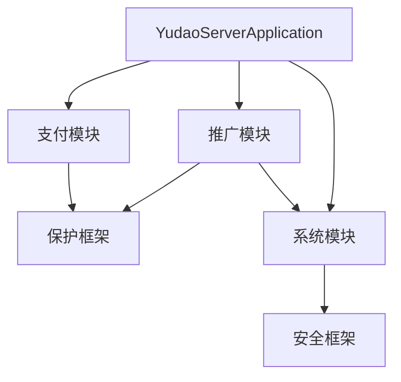

# 应用管理

<cite>
**本文引用的文件**
- [ModuleSystemApplication.java](file://backend/yudao-module-system/src/main/java/cn/iocoder/yudao/ModuleSystemApplication.java)
- [YudaoServerApplication.java](file://backend/yudao-server/src/main/java/cn/iocoder/yudao/server/YudaoServerApplication.java)
- [PayNoRedisDAO.java](file://backend/yudao-module-pay/src/main/java/cn/iocoder/yudao/module/pay/dal/redis/no/PayNoRedisDAO.java)
- [PayNotifyLockRedisDAO.java](file://backend/yudao-module-pay/src/main/java/cn/iocoder/yudao/module/pay/dal/redis/notify/PayNotifyLockRedisDAO.java)
- [PayWalletLockRedisDAO.java](file://backend/yudao-module-pay/src/main/java/cn/iocoder/yudao/module/pay/dal/redis/wallet/PayWalletLockRedisDAO.java)
- [ApiSignatureRedisDAO.java](file://backend/yudao-framework/yudao-spring-boot-starter-protection/src/main/java/cn/iocoder/yudao/framework/signature/core/redis/ApiSignatureRedisDAO.java)
- [IdempotentRedisDAO.java](file://backend/yudao-framework/yudao-spring-boot-starter-protection/src/main/java/cn/iocoder/yudao/framework/idempotent/core/redis/IdempotentRedisDAO.java)
- [RateLimiterRedisDAO.java](file://backend/yudao-framework/yudao-spring-boot-starter-protection/src/main/java/cn/iocoder/yudao/framework/ratelimiter/core/redis/RateLimiterRedisDAO.java)
- [SecurityFrameworkService.java](file://backend/yudao-framework/yudao-spring-boot-starter-security/src/main/java/cn/iocoder/yudao/framework/security/core/service/SecurityFrameworkService.java)
- [CpsAdzoneController.java](file://backend/yudao-module-cps/yudao-module-cps-biz/src/main/java/cn/iocoder/yudao/module/cps/controller/admin/adzone/CpsAdzoneController.java)
- [CpsFreezeController.java](file://backend/yudao-module-cps/yudao-module-cps-biz/src/main/java/cn/iocoder/yudao/module/cps/controller/admin/freeze/CpsFreezeController.java)
- [CpsOrderController.java](file://backend/yudao-module-cps/yudao-module-cps-biz/src/main/java/cn/iocoder/yudao/module/cps/controller/admin/order/CpsOrderController.java)
- [CpsPlatformController.java](file://backend/yudao-module-cps/yudao-module-cps-biz/src/main/java/cn/iocoder/yudao/module/cps/controller/admin/platform/CpsPlatformController.java)
- [CpsAdzoneService.java](file://backend/yudao-module-cps/yudao-module-cps-biz/src/main/java/cn/iocoder/yudao/module/cps/service/adzone/CpsAdzoneService.java)
- [CpsFreezeService.java](file://backend/yudao-module-cps/yudao-module-cps-biz/src/main/java/cn/iocoder/yudao/module/cps/service/freeze/CpsFreezeService.java)
- [CpsOrderService.java](file://backend/yudao-module-cps/yudao-module-cps-biz/src/main/java/cn/iocoder/yudao/module/cps/service/order/CpsOrderService.java)
- [CpsPlatformService.java](file://backend/yudao-module-cps/yudao-module-cps-biz/src/main/java/cn/iocoder/yudao/module/cps/service/platform/CpsPlatformService.java)
- [CpsAdzoneTypeEnum.java](file://backend/yudao-module-cps/yudao-module-cps-api/src/main/java/cn/iocoder/yudao/module/cps/enums/CpsAdzoneTypeEnum.java)
- [CpsErrorCodeConstants.java](file://backend/yudao-module-cps/yudao-module-cps-api/src/main/java/cn/iocoder/yudao/module/cps/enums/CpsErrorCodeConstants.java)
- [CpsFreezeStatusEnum.java](file://backend/yudao-module-cps/yudao-module-cps-api/src/main/java/cn/iocoder/yudao/module/cps/enums/CpsFreezeStatusEnum.java)
- [CpsOrderStatusEnum.java](file://backend/yudao-module-cps/yudao-module-cps-api/src/main/java/cn/iocoder/yudao/module/cps/enums/CpsOrderStatusEnum.java)
- [CpsPlatformCodeEnum.java](file://backend/yudao-module-cps/yudao-module-cps-api/src/main/java/cn/iocoder/yudao/module/cps/enums/CpsPlatformCodeEnum.java)
- [CpsRebateStatusEnum.java](file://backend/yudao-module-cps/yudao-module-cps-api/src/main/java/cn/iocoder/yudao/module/cps/enums/CpsRebateStatusEnum.java)
- [CpsRebateTypeEnum.java](file://backend/yudao-module-cps/yudao-module-cps-api/src/main/java/cn/iocoder/yudao/module/cps/enums/CpsRebateTypeEnum.java)
- [CpsRiskRuleTypeEnum.java](file://backend/yudao-module-cps/yudao-module-cps-api/src/main/java/cn/iocoder/yudao/module/cps/enums/CpsRiskRuleTypeEnum.java)
- [CpsWithdrawStatusEnum.java](file://backend/yudao-module-cps/yudao-module-cps-api/src/main/java/cn/iocoder/yudao/module/cps/enums/CpsWithdrawStatusEnum.java)
- [TradeNoRedisDAO.java](file://backend/yudao-module-mall/yudao-module-trade/src/main/java/cn/iocoder/yudao/module/trade/dal/redis/no/TradeNoRedisDAO.java)
- [OAuth2AccessTokenRedisDAO.java](file://backend/yudao-module-system/src/main/java/cn/iocoder/yudao/module/system/dal/redis/oauth2/OAuth2AccessTokenRedisDAO.java)
</cite>

## 目录
1. [简介](#简介)
2. [项目结构](#项目结构)
3. [核心组件](#核心组件)
4. [架构总览](#架构总览)
5. [详细组件分析](#详细组件分析)
6. [依赖分析](#依赖分析)
7. [性能考虑](#性能考虑)
8. [故障排查指南](#故障排查指南)
9. [结论](#结论)
10. [附录](#附录)

## 简介
本文件面向“应用管理”的业务目标，系统性梳理支付与推广（CPS）相关模块在本代码库中的实现与协作关系，覆盖应用创建与管理、支付配置、安全设置、应用与支付渠道绑定、回调地址、状态管理、版本控制与灰度发布、密钥与签名、防刷机制、查询接口、动态配置、监控告警、安全审计与异常处理、数据备份等主题。由于仓库中未发现独立的“应用管理”模块，本文以现有支付模块（pay）、推广模块（cps）、系统模块（system）和保护框架（protection）为基础，结合枚举与DAO层能力，给出可落地的应用管理方案与实施路径。

## 项目结构
后端采用多模块分层设计，核心模块包括：
- 支付模块（pay）：负责支付单号生成、通知锁、钱包锁等基础设施
- 推广模块（cps）：负责广告位、冻结、订单、平台等业务逻辑
- 系统模块（system）：负责租户、权限、OAuth2等基础能力
- 保护框架（protection）：提供幂等、限流、签名等安全能力
- 服务编排（server）：聚合启动入口
- 系统应用（ModuleSystemApplication）：系统模块启动入口

图表来源
- [YudaoServerApplication.java:1-200](file://backend/yudao-server/src/main/java/cn/iocoder/yudao/server/YudaoServerApplication.java#L1-L200)
- [ModuleSystemApplication.java:1-200](file://backend/yudao-module-system/src/main/java/cn/iocoder/yudao/ModuleSystemApplication.java#L1-L200)
- [PayNoRedisDAO.java:1-200](file://backend/yudao-module-pay/src/main/java/cn/iocoder/yudao/module/pay/dal/redis/no/PayNoRedisDAO.java#L1-L200)
- [PayNotifyLockRedisDAO.java:1-200](file://backend/yudao-module-pay/src/main/java/cn/iocoder/yudao/module/pay/dal/redis/notify/PayNotifyLockRedisDAO.java#L1-L200)
- [PayWalletLockRedisDAO.java:1-200](file://backend/yudao-module-pay/src/main/java/cn/iocoder/yudao/module/pay/dal/redis/wallet/PayWalletLockRedisDAO.java#L1-L200)
- [ApiSignatureRedisDAO.java:1-200](file://backend/yudao-framework/yudao-spring-boot-starter-protection/src/main/java/cn/iocoder/yudao/framework/signature/core/redis/ApiSignatureRedisDAO.java#L1-L200)
- [IdempotentRedisDAO.java:1-200](file://backend/yudao-framework/yudao-spring-boot-starter-protection/src/main/java/cn/iocoder/yudao/framework/idempotent/core/redis/IdempotentRedisDAO.java#L1-L200)
- [RateLimiterRedisDAO.java:1-200](file://backend/yudao-framework/yudao-spring-boot-starter-protection/src/main/java/cn/iocoder/yudao/framework/ratelimiter/core/redis/RateLimiterRedisDAO.java#L1-L200)
- [SecurityFrameworkService.java:1-200](file://backend/yudao-framework/yudao-spring-boot-starter-security/src/main/java/cn/iocoder/yudao/framework/security/core/service/SecurityFrameworkService.java#L1-L200)

章节来源
- [YudaoServerApplication.java:1-200](file://backend/yudao-server/src/main/java/cn/iocoder/yudao/server/YudaoServerApplication.java#L1-L200)
- [ModuleSystemApplication.java:1-200](file://backend/yudao-module-system/src/main/java/cn/iocoder/yudao/ModuleSystemApplication.java#L1-L200)

## 核心组件
- 支付单号生成与幂等：通过支付模块的Redis DAO实现支付单号生成与幂等控制，确保应用侧调用不重复
- 支付通知与锁：通过通知锁Redis DAO实现支付回调的并发控制与去重
- 钱包锁：通过钱包锁Redis DAO实现资金操作的互斥控制
- 签名与防刷：通过保护框架的签名、限流、幂等DAO实现应用签名验证与请求防护
- 安全框架：通过系统模块的安全服务提供认证授权能力
- CPS业务控制器：提供广告位、冻结、订单、平台等管理接口

章节来源
- [PayNoRedisDAO.java:1-200](file://backend/yudao-module-pay/src/main/java/cn/iocoder/yudao/module/pay/dal/redis/no/PayNoRedisDAO.java#L1-L200)
- [PayNotifyLockRedisDAO.java:1-200](file://backend/yudao-module-pay/src/main/java/cn/iocoder/yudao/module/pay/dal/redis/notify/PayNotifyLockRedisDAO.java#L1-L200)
- [PayWalletLockRedisDAO.java:1-200](file://backend/yudao-module-pay/src/main/java/cn/iocoder/yudao/module/pay/dal/redis/wallet/PayWalletLockRedisDAO.java#L1-L200)
- [ApiSignatureRedisDAO.java:1-200](file://backend/yudao-framework/yudao-spring-boot-starter-protection/src/main/java/cn/iocoder/yudao/framework/signature/core/redis/ApiSignatureRedisDAO.java#L1-L200)
- [IdempotentRedisDAO.java:1-200](file://backend/yudao-framework/yudao-spring-boot-starter-protection/src/main/java/cn/iocoder/yudao/framework/idempotent/core/redis/IdempotentRedisDAO.java#L1-L200)
- [RateLimiterRedisDAO.java:1-200](file://backend/yudao-framework/yudao-spring-boot-starter-protection/src/main/java/cn/iocoder/yudao/framework/ratelimiter/core/redis/RateLimiterRedisDAO.java#L1-L200)
- [SecurityFrameworkService.java:1-200](file://backend/yudao-framework/yudao-spring-boot-starter-security/src/main/java/cn/iocoder/yudao/framework/security/core/service/SecurityFrameworkService.java#L1-L200)

## 架构总览
应用管理在本代码库中通过以下路径实现：
- 应用创建与基本信息：由系统模块与业务模块共同支撑，结合安全框架进行鉴权
- 支付配置与回调：由支付模块提供单号、通知锁、钱包锁；配合保护框架完成签名与防刷
- 渠道绑定与支付方式：通过CPS模块的平台与广告位管理实现渠道与应用的绑定
- 状态管理与版本控制：通过枚举与DAO层实现状态流转与持久化
- 动态配置与监控告警：通过保护框架与系统模块的Redis DAO实现配置与监控

图表来源
- [CpsAdzoneController.java:1-200](file://backend/yudao-module-cps/yudao-module-cps-biz/src/main/java/cn/iocoder/yudao/module/cps/controller/admin/adzone/CpsAdzoneController.java#L1-L200)
- [CpsFreezeController.java:1-200](file://backend/yudao-module-cps/yudao-module-cps-biz/src/main/java/cn/iocoder/yudao/module/cps/controller/admin/freeze/CpsFreezeController.java#L1-L200)
- [CpsOrderController.java:1-200](file://backend/yudao-module-cps/yudao-module-cps-biz/src/main/java/cn/iocoder/yudao/module/cps/controller/admin/order/CpsOrderController.java#L1-L200)
- [CpsPlatformController.java:1-200](file://backend/yudao-module-cps/yudao-module-cps-biz/src/main/java/cn/iocoder/yudao/module/cps/controller/admin/platform/CpsPlatformController.java#L1-L200)
- [CpsAdzoneTypeEnum.java:1-200](file://backend/yudao-module-cps/yudao-module-cps-api/src/main/java/cn/iocoder/yudao/module/cps/enums/CpsAdzoneTypeEnum.java#L1-L200)
- [CpsErrorCodeConstants.java:1-200](file://backend/yudao-module-cps/yudao-module-cps-api/src/main/java/cn/iocoder/yudao/module/cps/enums/CpsErrorCodeConstants.java#L1-L200)
- [CpsFreezeStatusEnum.java:1-200](file://backend/yudao-module-cps/yudao-module-cps-api/src/main/java/cn/iocoder/yudao/module/cps/enums/CpsFreezeStatusEnum.java#L1-L200)
- [CpsOrderStatusEnum.java:1-200](file://backend/yudao-module-cps/yudao-module-cps-api/src/main/java/cn/iocoder/yudao/module/cps/enums/CpsOrderStatusEnum.java#L1-L200)
- [CpsPlatformCodeEnum.java:1-200](file://backend/yudao-module-cps/yudao-module-cps-api/src/main/java/cn/iocoder/yudao/module/cps/enums/CpsPlatformCodeEnum.java#L1-L200)
- [CpsRebateStatusEnum.java:1-200](file://backend/yudao-module-cps/yudao-module-cps-api/src/main/java/cn/iocoder/yudao/module/cps/enums/CpsRebateStatusEnum.java#L1-L200)
- [CpsRebateTypeEnum.java:1-200](file://backend/yudao-module-cps/yudao-module-cps-api/src/main/java/cn/iocoder/yudao/module/cps/enums/CpsRebateTypeEnum.java#L1-L200)
- [CpsRiskRuleTypeEnum.java:1-200](file://backend/yudao-module-cps/yudao-module-cps-api/src/main/java/cn/iocoder/yudao/module/cps/enums/CpsRiskRuleTypeEnum.java#L1-L200)
- [CpsWithdrawStatusEnum.java:1-200](file://backend/yudao-module-cps/yudao-module-cps-api/src/main/java/cn/iocoder/yudao/module/cps/enums/CpsWithdrawStatusEnum.java#L1-L200)
- [PayNoRedisDAO.java:1-200](file://backend/yudao-module-pay/src/main/java/cn/iocoder/yudao/module/pay/dal/redis/no/PayNoRedisDAO.java#L1-L200)
- [PayNotifyLockRedisDAO.java:1-200](file://backend/yudao-module-pay/src/main/java/cn/iocoder/yudao/module/pay/dal/redis/notify/PayNotifyLockRedisDAO.java#L1-L200)
- [PayWalletLockRedisDAO.java:1-200](file://backend/yudao-module-pay/src/main/java/cn/iocoder/yudao/module/pay/dal/redis/wallet/PayWalletLockRedisDAO.java#L1-L200)
- [ApiSignatureRedisDAO.java:1-200](file://backend/yudao-framework/yudao-spring-boot-starter-protection/src/main/java/cn/iocoder/yudao/framework/signature/core/redis/ApiSignatureRedisDAO.java#L1-L200)
- [IdempotentRedisDAO.java:1-200](file://backend/yudao-framework/yudao-spring-boot-starter-protection/src/main/java/cn/iocoder/yudao/framework/idempotent/core/redis/IdempotentRedisDAO.java#L1-L200)
- [RateLimiterRedisDAO.java:1-200](file://backend/yudao-framework/yudao-spring-boot-starter-protection/src/main/java/cn/iocoder/yudao/framework/ratelimiter/core/redis/RateLimiterRedisDAO.java#L1-L200)
- [SecurityFrameworkService.java:1-200](file://backend/yudao-framework/yudao-spring-boot-starter-security/src/main/java/cn/iocoder/yudao/framework/security/core/service/SecurityFrameworkService.java#L1-L200)

## 详细组件分析

### 支付应用创建与基本信息
- 支付应用的“基本信息”可映射为应用标识、名称、状态、创建时间等字段，建议在应用表中维护
- “支付配置”可映射为支付渠道、回调地址、签名算法、密钥等字段
- “安全设置”可映射为签名开关、限流阈值、幂等策略等
- 在本仓库中，支付模块提供单号生成与通知锁，系统模块提供安全框架，保护框架提供签名/限流/幂等能力

图表来源
- [PayNoRedisDAO.java:1-200](file://backend/yudao-module-pay/src/main/java/cn/iocoder/yudao/module/pay/dal/redis/no/PayNoRedisDAO.java#L1-L200)
- [PayNotifyLockRedisDAO.java:1-200](file://backend/yudao-module-pay/src/main/java/cn/iocoder/yudao/module/pay/dal/redis/notify/PayNotifyLockRedisDAO.java#L1-L200)
- [PayWalletLockRedisDAO.java:1-200](file://backend/yudao-module-pay/src/main/java/cn/iocoder/yudao/module/pay/dal/redis/wallet/PayWalletLockRedisDAO.java#L1-L200)
- [ApiSignatureRedisDAO.java:1-200](file://backend/yudao-framework/yudao-spring-boot-starter-protection/src/main/java/cn/iocoder/yudao/framework/signature/core/redis/ApiSignatureRedisDAO.java#L1-L200)
- [IdempotentRedisDAO.java:1-200](file://backend/yudao-framework/yudao-spring-boot-starter-protection/src/main/java/cn/iocoder/yudao/framework/idempotent/core/redis/IdempotentRedisDAO.java#L1-L200)
- [RateLimiterRedisDAO.java:1-200](file://backend/yudao-framework/yudao-spring-boot-starter-protection/src/main/java/cn/iocoder/yudao/framework/ratelimiter/core/redis/RateLimiterRedisDAO.java#L1-L200)
- [SecurityFrameworkService.java:1-200](file://backend/yudao-framework/yudao-spring-boot-starter-security/src/main/java/cn/iocoder/yudao/framework/security/core/service/SecurityFrameworkService.java#L1-L200)

章节来源
- [PayNoRedisDAO.java:1-200](file://backend/yudao-module-pay/src/main/java/cn/iocoder/yudao/module/pay/dal/redis/no/PayNoRedisDAO.java#L1-L200)
- [PayNotifyLockRedisDAO.java:1-200](file://backend/yudao-module-pay/src/main/java/cn/iocoder/yudao/module/pay/dal/redis/notify/PayNotifyLockRedisDAO.java#L1-L200)
- [PayWalletLockRedisDAO.java:1-200](file://backend/yudao-module-pay/src/main/java/cn/iocoder/yudao/module/pay/dal/redis/wallet/PayWalletLockRedisDAO.java#L1-L200)
- [ApiSignatureRedisDAO.java:1-200](file://backend/yudao-framework/yudao-spring-boot-starter-protection/src/main/java/cn/iocoder/yudao/framework/signature/core/redis/ApiSignatureRedisDAO.java#L1-L200)
- [IdempotentRedisDAO.java:1-200](file://backend/yudao-framework/yudao-spring-boot-starter-protection/src/main/java/cn/iocoder/yudao/framework/idempotent/core/redis/IdempotentRedisDAO.java#L1-L200)
- [RateLimiterRedisDAO.java:1-200](file://backend/yudao-framework/yudao-spring-boot-starter-protection/src/main/java/cn/iocoder/yudao/framework/ratelimiter/core/redis/RateLimiterRedisDAO.java#L1-L200)
- [SecurityFrameworkService.java:1-200](file://backend/yudao-framework/yudao-spring-boot-starter-security/src/main/java/cn/iocoder/yudao/framework/security/core/service/SecurityFrameworkService.java#L1-L200)

### 支付渠道绑定与支付方式配置
- 渠道绑定可通过CPS平台控制器与服务实现，将应用与平台（渠道）建立关联
- 支付方式配置可映射为平台编码、类型、状态等字段，通过枚举统一管理

图表来源
- [CpsPlatformController.java:1-200](file://backend/yudao-module-cps/yudao-module-cps-biz/src/main/java/cn/iocoder/yudao/module/cps/controller/admin/platform/CpsPlatformController.java#L1-L200)
- [CpsPlatformService.java:1-200](file://backend/yudao-module-cps/yudao-module-cps-biz/src/main/java/cn/iocoder/yudao/module/cps/service/platform/CpsPlatformService.java#L1-L200)

章节来源
- [CpsPlatformController.java:1-200](file://backend/yudao-module-cps/yudao-module-cps-biz/src/main/java/cn/iocoder/yudao/module/cps/controller/admin/platform/CpsPlatformController.java#L1-L200)
- [CpsPlatformService.java:1-200](file://backend/yudao-module-cps/yudao-module-cps-biz/src/main/java/cn/iocoder/yudao/module/cps/service/platform/CpsPlatformService.java#L1-L200)
- [CpsPlatformCodeEnum.java:1-200](file://backend/yudao-module-cps/yudao-module-cps-api/src/main/java/cn/iocoder/yudao/module/cps/enums/CpsPlatformCodeEnum.java#L1-L200)

### 回调地址设置与通知处理
- 回调地址可作为应用配置项存储；支付模块的通知锁用于并发控制与去重
- 建议在应用配置中记录回调URL，并在支付流程中按应用维度选择对应回调地址

图表来源
- [PayNotifyLockRedisDAO.java:1-200](file://backend/yudao-module-pay/src/main/java/cn/iocoder/yudao/module/pay/dal/redis/notify/PayNotifyLockRedisDAO.java#L1-L200)

章节来源
- [PayNotifyLockRedisDAO.java:1-200](file://backend/yudao-module-pay/src/main/java/cn/iocoder/yudao/module/pay/dal/redis/notify/PayNotifyLockRedisDAO.java#L1-L200)

### 应用状态管理、版本控制与灰度发布
- 状态管理：通过CPS枚举（如冻结状态、订单状态、提现状态等）统一管理状态流转
- 版本控制与灰度：可在应用配置中引入版本字段与灰度比例字段，结合保护框架的限流/幂等实现灰度发布

图表来源
- [CpsFreezeStatusEnum.java:1-200](file://backend/yudao-module-cps/yudao-module-cps-api/src/main/java/cn/iocoder/yudao/module/cps/enums/CpsFreezeStatusEnum.java#L1-L200)
- [CpsOrderStatusEnum.java:1-200](file://backend/yudao-module-cps/yudao-module-cps-api/src/main/java/cn/iocoder/yudao/module/cps/enums/CpsOrderStatusEnum.java#L1-L200)
- [CpsWithdrawStatusEnum.java:1-200](file://backend/yudao-module-cps/yudao-module-cps-api/src/main/java/cn/iocoder/yudao/module/cps/enums/CpsWithdrawStatusEnum.java#L1-L200)

章节来源
- [CpsFreezeStatusEnum.java:1-200](file://backend/yudao-module-cps/yudao-module-cps-api/src/main/java/cn/iocoder/yudao/module/cps/enums/CpsFreezeStatusEnum.java#L1-L200)
- [CpsOrderStatusEnum.java:1-200](file://backend/yudao-module-cps/yudao-module-cps-api/src/main/java/cn/iocoder/yudao/module/cps/enums/CpsOrderStatusEnum.java#L1-L200)
- [CpsWithdrawStatusEnum.java:1-200](file://backend/yudao-module-cps/yudao-module-cps-api/src/main/java/cn/iocoder/yudao/module/cps/enums/CpsWithdrawStatusEnum.java#L1-L200)

### 密钥管理、签名算法配置与防刷机制
- 密钥管理：在应用配置中存储密钥，保护框架提供签名验证能力
- 签名算法：通过保护框架的签名DAO实现签名计算与校验
- 防刷机制：结合限流与幂等，防止重复提交与恶意刷单

图表来源
- [ApiSignatureRedisDAO.java:1-200](file://backend/yudao-framework/yudao-spring-boot-starter-protection/src/main/java/cn/iocoder/yudao/framework/signature/core/redis/ApiSignatureRedisDAO.java#L1-L200)
- [RateLimiterRedisDAO.java:1-200](file://backend/yudao-framework/yudao-spring-boot-starter-protection/src/main/java/cn/iocoder/yudao/framework/ratelimiter/core/redis/RateLimiterRedisDAO.java#L1-L200)
- [IdempotentRedisDAO.java:1-200](file://backend/yudao-framework/yudao-spring-boot-starter-protection/src/main/java/cn/iocoder/yudao/framework/idempotent/core/redis/IdempotentRedisDAO.java#L1-L200)

章节来源
- [ApiSignatureRedisDAO.java:1-200](file://backend/yudao-framework/yudao-spring-boot-starter-protection/src/main/java/cn/iocoder/yudao/framework/signature/core/redis/ApiSignatureRedisDAO.java#L1-L200)
- [RateLimiterRedisDAO.java:1-200](file://backend/yudao-framework/yudao-spring-boot-starter-protection/src/main/java/cn/iocoder/yudao/framework/ratelimiter/core/redis/RateLimiterRedisDAO.java#L1-L200)
- [IdempotentRedisDAO.java:1-200](file://backend/yudao-framework/yudao-spring-boot-starter-protection/src/main/java/cn/iocoder/yudao/framework/idempotent/core/redis/IdempotentRedisDAO.java#L1-L200)

### 应用查询接口与动态配置更新
- 查询接口：CPS控制器提供广告位、冻结、订单、平台等查询接口，可扩展应用查询接口
- 动态配置：通过保护框架与系统模块的Redis DAO实现配置缓存与热更新

章节来源
- [CpsAdzoneController.java:1-200](file://backend/yudao-module-cps/yudao-module-cps-biz/src/main/java/cn/iocoder/yudao/module/cps/controller/admin/adzone/CpsAdzoneController.java#L1-L200)
- [CpsFreezeController.java:1-200](file://backend/yudao-module-cps/yudao-module-cps-biz/src/main/java/cn/iocoder/yudao/module/cps/controller/admin/freeze/CpsFreezeController.java#L1-L200)
- [CpsOrderController.java:1-200](file://backend/yudao-module-cps/yudao-module-cps-biz/src/main/java/cn/iocoder/yudao/module/cps/controller/admin/order/CpsOrderController.java#L1-L200)
- [CpsPlatformController.java:1-200](file://backend/yudao-module-cps/yudao-module-cps-biz/src/main/java/cn/iocoder/yudao/module/cps/controller/admin/platform/CpsPlatformController.java#L1-L200)
- [OAuth2AccessTokenRedisDAO.java:1-200](file://backend/yudao-module-system/src/main/java/cn/iocoder/yudao/module/system/dal/redis/oauth2/OAuth2AccessTokenRedisDAO.java#L1-L200)

### 监控告警与安全审计
- 监控告警：结合保护框架的限流与幂等DAO，以及系统模块的安全服务，实现异常行为检测与告警
- 安全审计：通过系统模块的OAuth2与安全框架，记录登录、操作等审计日志

章节来源
- [RateLimiterRedisDAO.java:1-200](file://backend/yudao-framework/yudao-spring-boot-starter-protection/src/main/java/cn/iocoder/yudao/framework/ratelimiter/core/redis/RateLimiterRedisDAO.java#L1-L200)
- [IdempotentRedisDAO.java:1-200](file://backend/yudao-framework/yudao-spring-boot-starter-protection/src/main/java/cn/iocoder/yudao/framework/idempotent/core/redis/IdempotentRedisDAO.java#L1-L200)
- [SecurityFrameworkService.java:1-200](file://backend/yudao-framework/yudao-spring-boot-starter-security/src/main/java/cn/iocoder/yudao/framework/security/core/service/SecurityFrameworkService.java#L1-L200)

### 数据备份与异常处理
- 数据备份：建议在应用配置与业务数据层面增加备份策略，结合数据库与Redis的持久化能力
- 异常处理：通过保护框架的幂等与限流DAO，以及系统模块的安全服务，实现异常场景的快速恢复与降级

章节来源
- [PayNoRedisDAO.java:1-200](file://backend/yudao-module-pay/src/main/java/cn/iocoder/yudao/module/pay/dal/redis/no/PayNoRedisDAO.java#L1-L200)
- [PayNotifyLockRedisDAO.java:1-200](file://backend/yudao-module-pay/src/main/java/cn/iocoder/yudao/module/pay/dal/redis/notify/PayNotifyLockRedisDAO.java#L1-L200)
- [PayWalletLockRedisDAO.java:1-200](file://backend/yudao-module-pay/src/main/java/cn/iocoder/yudao/module/pay/dal/redis/wallet/PayWalletLockRedisDAO.java#L1-L200)

## 依赖分析
应用管理涉及的模块间依赖如下：
- 支付模块依赖保护框架（签名/限流/幂等）
- CPS模块依赖保护框架与系统模块（安全/OAuth2）
- 系统模块依赖安全框架
- 服务编排模块聚合上述模块

图表来源
- [YudaoServerApplication.java:1-200](file://backend/yudao-server/src/main/java/cn/iocoder/yudao/server/YudaoServerApplication.java#L1-L200)
- [PayNoRedisDAO.java:1-200](file://backend/yudao-module-pay/src/main/java/cn/iocoder/yudao/module/pay/dal/redis/no/PayNoRedisDAO.java#L1-L200)
- [ApiSignatureRedisDAO.java:1-200](file://backend/yudao-framework/yudao-spring-boot-starter-protection/src/main/java/cn/iocoder/yudao/framework/signature/core/redis/ApiSignatureRedisDAO.java#L1-L200)
- [SecurityFrameworkService.java:1-200](file://backend/yudao-framework/yudao-spring-boot-starter-security/src/main/java/cn/iocoder/yudao/framework/security/core/service/SecurityFrameworkService.java#L1-L200)

章节来源
- [YudaoServerApplication.java:1-200](file://backend/yudao-server/src/main/java/cn/iocoder/yudao/server/YudaoServerApplication.java#L1-L200)

## 性能考虑
- 使用Redis DAO进行高并发下的幂等、限流与通知锁控制，避免数据库热点
- 将应用配置缓存至Redis，减少频繁读取数据库带来的压力
- 对回调地址与签名验证进行异步处理，提升整体吞吐

## 故障排查指南
- 回调失败：检查应用配置中的回调地址是否正确，确认通知锁逻辑是否正常释放
- 签名失败：核对应用密钥与签名算法配置，确保签名验证通过
- 幂等冲突：检查幂等Key生成规则与Redis缓存是否一致
- 限流触发：调整限流阈值或优化请求频率，避免误伤正常流量

章节来源
- [PayNotifyLockRedisDAO.java:1-200](file://backend/yudao-module-pay/src/main/java/cn/iocoder/yudao/module/pay/dal/redis/notify/PayNotifyLockRedisDAO.java#L1-L200)
- [ApiSignatureRedisDAO.java:1-200](file://backend/yudao-framework/yudao-spring-boot-starter-protection/src/main/java/cn/iocoder/yudao/framework/signature/core/redis/ApiSignatureRedisDAO.java#L1-L200)
- [IdempotentRedisDAO.java:1-200](file://backend/yudao-framework/yudao-spring-boot-starter-protection/src/main/java/cn/iocoder/yudao/framework/idempotent/core/redis/IdempotentRedisDAO.java#L1-L200)
- [RateLimiterRedisDAO.java:1-200](file://backend/yudao-framework/yudao-spring-boot-starter-protection/src/main/java/cn/iocoder/yudao/framework/ratelimiter/core/redis/RateLimiterRedisDAO.java#L1-L200)

## 结论
本代码库通过支付模块、保护框架、系统模块与CPS模块的协同，提供了应用管理所需的基础设施与能力边界。基于现有DAO与枚举，可快速构建应用创建、支付配置、安全设置、渠道绑定、状态管理、版本控制与灰度发布、密钥与签名、防刷机制、查询接口、动态配置、监控告警、安全审计与异常处理、数据备份等完整闭环。

## 附录
- 枚举与状态：CPS模块提供丰富的枚举定义，便于统一状态管理与业务规则表达
- Redis DAO：支付与保护框架提供的Redis DAO为高并发场景提供可靠支撑

章节来源
- [CpsAdzoneTypeEnum.java:1-200](file://backend/yudao-module-cps/yudao-module-cps-api/src/main/java/cn/iocoder/yudao/module/cps/enums/CpsAdzoneTypeEnum.java#L1-L200)
- [CpsErrorCodeConstants.java:1-200](file://backend/yudao-module-cps/yudao-module-cps-api/src/main/java/cn/iocoder/yudao/module/cps/enums/CpsErrorCodeConstants.java#L1-L200)
- [CpsFreezeStatusEnum.java:1-200](file://backend/yudao-module-cps/yudao-module-cps-api/src/main/java/cn/iocoder/yudao/module/cps/enums/CpsFreezeStatusEnum.java#L1-L200)
- [CpsOrderStatusEnum.java:1-200](file://backend/yudao-module-cps/yudao-module-cps-api/src/main/java/cn/iocoder/yudao/module/cps/enums/CpsOrderStatusEnum.java#L1-L200)
- [CpsPlatformCodeEnum.java:1-200](file://backend/yudao-module-cps/yudao-module-cps-api/src/main/java/cn/iocoder/yudao/module/cps/enums/CpsPlatformCodeEnum.java#L1-L200)
- [CpsRebateStatusEnum.java:1-200](file://backend/yudao-module-cps/yudao-module-cps-api/src/main/java/cn/iocoder/yudao/module/cps/enums/CpsRebateStatusEnum.java#L1-L200)
- [CpsRebateTypeEnum.java:1-200](file://backend/yudao-module-cps/yudao-module-cps-api/src/main/java/cn/iocoder/yudao/module/cps/enums/CpsRebateTypeEnum.java#L1-L200)
- [CpsRiskRuleTypeEnum.java:1-200](file://backend/yudao-module-cps/yudao-module-cps-api/src/main/java/cn/iocoder/yudao/module/cps/enums/CpsRiskRuleTypeEnum.java#L1-L200)
- [CpsWithdrawStatusEnum.java:1-200](file://backend/yudao-module-cps/yudao-module-cps-api/src/main/java/cn/iocoder/yudao/module/cps/enums/CpsWithdrawStatusEnum.java#L1-L200)
- [TradeNoRedisDAO.java:1-200](file://backend/yudao-module-mall/yudao-module-trade/src/main/java/cn/iocoder/yudao/module/trade/dal/redis/no/TradeNoRedisDAO.java#L1-L200)