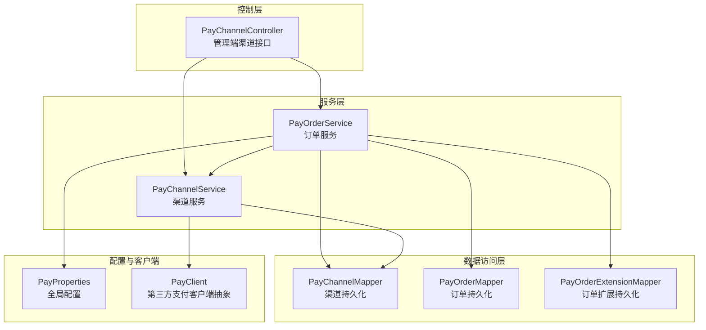
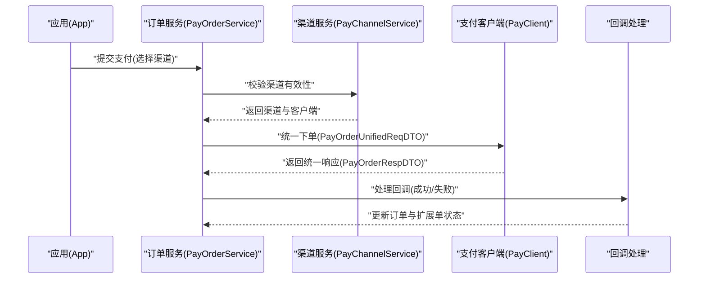
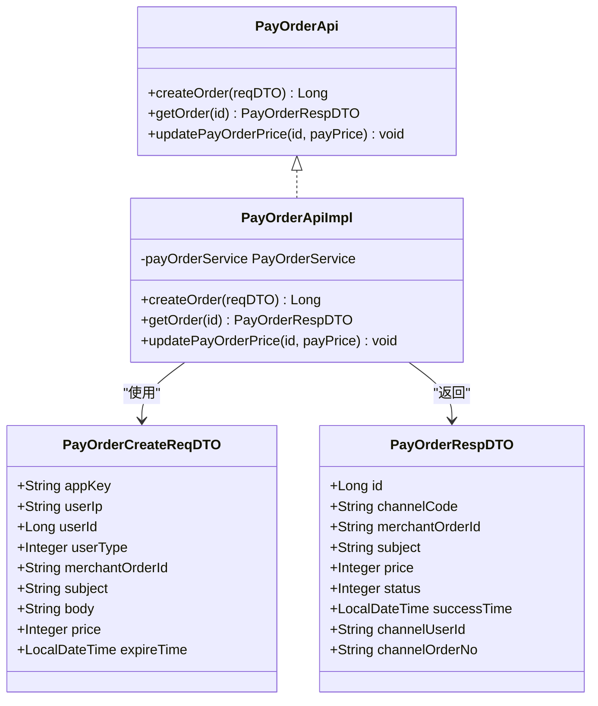
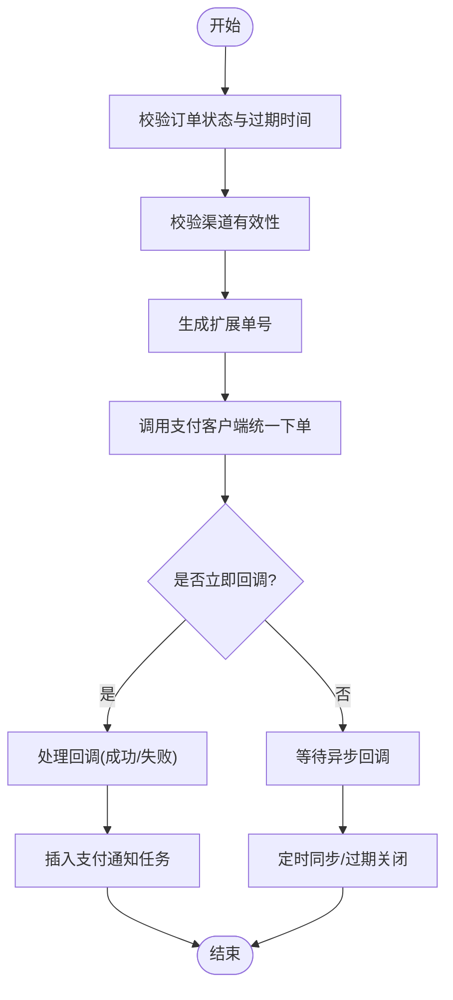
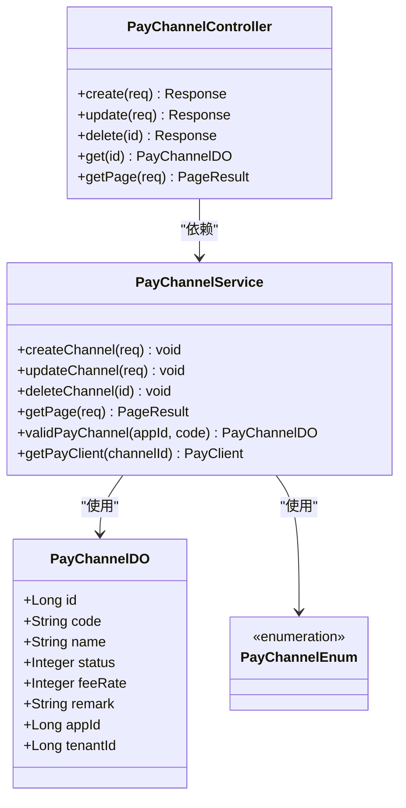
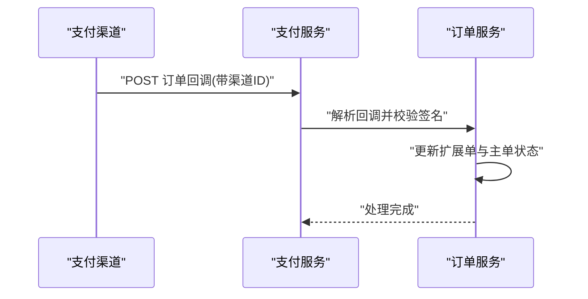
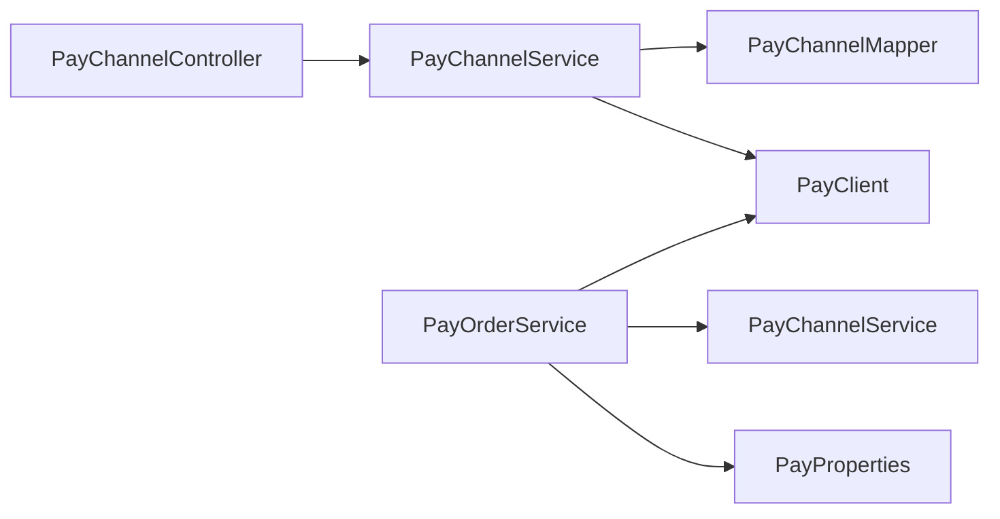

# 支付渠道管理

<cite>
**本文档引用的文件**
- [PayOrderApi.java](file://backend/yudao-module-pay/src/main/java/cn/iocoder/yudao/module/pay/api/order/PayOrderApi.java)
- [PayOrderApiImpl.java](file://backend/yudao-module-pay/src/main/java/cn/iocoder/yudao/module/pay/api/order/PayOrderApiImpl.java)
- [PayOrderCreateReqDTO.java](file://backend/yudao-module-pay/src/main/java/cn/iocoder/yudao/module/pay/api/order/dto/PayOrderCreateReqDTO.java)
- [PayOrderRespDTO.java](file://backend/yudao-module-pay/src/main/java/cn/iocoder/yudao/module/pay/api/order/dto/PayOrderRespDTO.java)
- [PayOrderService.java](file://backend/yudao-module-pay/src/main/java/cn/iocoder/yudao/module/pay/service/order/PayOrderService.java)
- [PayOrderServiceImpl.java](file://backend/yudao-module-pay/src/main/java/cn/iocoder/yudao/module/pay/service/order/PayOrderServiceImpl.java)
- [PayChannelController.java](file://backend/yudao-module-pay/src/main/java/cn/iocoder/yudao/module/pay/controller/admin/channel/PayChannelController.java)
- [PayChannelDO.java](file://backend/yudao-module-pay/src/main/java/cn/iocoder/yudao/module/pay/dal/dataobject/channel/PayChannelDO.java)
- [PayChannelMapper.java](file://backend/yudao-module-pay/src/main/java/cn/iocoder/yudao/module/pay/dal/mysql/channel/PayChannelMapper.java)
- [PayChannelService.java](file://backend/yudao-module-pay/src/main/java/cn/iocoder/yudao/module/pay/service/channel/PayChannelService.java)
- [PayChannelServiceImpl.java](file://backend/yudao-module-pay/src/main/java/cn/iocoder/yudao/module/pay/service/channel/PayChannelServiceImpl.java)
- [PayChannelEnum.java](file://backend/yudao-module-pay/src/main/java/cn/iocoder/yudao/module/pay/enums/PayChannelEnum.java)
- [PayOrderNotifyReqDTO.java](file://backend/yudao-module-pay/src/main/java/cn/iocoder/yudao/module/pay/api/notify/dto/PayOrderNotifyReqDTO.java)
- [PayRefundNotifyReqDTO.java](file://backend/yudao-module-pay/src/main/java/cn/iocoder/yudao/module/pay/api/notify/dto/PayRefundNotifyReqDTO.java)
- [PayTransferNotifyReqDTO.java](file://backend/yudao-module-pay/src/main/java/cn/iocoder/yudao/module/pay/api/notify/dto/PayTransferNotifyReqDTO.java)
- [PayProperties.java](file://backend/yudao-module-pay/src/main/java/cn/iocoder/yudao/module/pay/framework/pay/config/PayProperties.java)
- [PayClient.java](file://backend/yudao-module-pay/src/main/java/cn/iocoder/yudao/module/pay/framework/pay/core/client/PayClient.java)
- [PayOrderUnifiedReqDTO.java](file://backend/yudao-module-pay/src/main/java/cn/iocoder/yudao/module/pay/framework/pay/core/client/dto/order/PayOrderUnifiedReqDTO.java)
- [PayOrderRespDTO.java](file://backend/yudao-module-pay/src/main/java/cn/iocoder/yudao/module/pay/framework/pay/core/client/dto/order/PayOrderRespDTO.java)
</cite>

## 目录
1. [简介](#简介)
2. [项目结构](#项目结构)
3. [核心组件](#核心组件)
4. [架构总览](#架构总览)
5. [详细组件分析](#详细组件分析)
6. [依赖关系分析](#依赖关系分析)
7. [性能考虑](#性能考虑)
8. [故障排查指南](#故障排查指南)
9. [结论](#结论)

## 简介
本文件面向支付渠道管理，系统性梳理支付渠道的配置与管理能力，覆盖支付宝、微信支付、银联等第三方支付渠道的接入与维护。重点包括：
- 渠道配置参数、密钥管理、回调地址设置
- 渠道状态管理、费率配置、限额设置
- 渠道与应用的绑定关系、支付方式映射、风控策略配置
- 渠道查询接口、动态切换机制、故障转移策略
- 渠道监控、性能统计、合规检查等管理功能

## 项目结构
支付模块采用分层架构，围绕“应用-渠道-订单”三层组织：
- 控制层：Admin 管理端提供渠道 CRUD 与查询接口
- 服务层：订单服务负责下单、回调处理、状态同步与过期关闭
- 数据访问层：DAO/Mapper 负责持久化
- 配置与客户端：PayProperties 提供全局配置，PayClient 抽象第三方支付客户端

图表来源
- [PayChannelController.java:1-200](file://backend/yudao-module-pay/src/main/java/cn/iocoder/yudao/module/pay/controller/admin/channel/PayChannelController.java#L1-L200)
- [PayOrderService.java:1-168](file://backend/yudao-module-pay/src/main/java/cn/iocoder/yudao/module/pay/service/order/PayOrderService.java#L1-L168)
- [PayChannelService.java:1-200](file://backend/yudao-module-pay/src/main/java/cn/iocoder/yudao/module/pay/service/channel/PayChannelService.java#L1-L200)
- [PayChannelMapper.java:1-200](file://backend/yudao-module-pay/src/main/java/cn/iocoder/yudao/module/pay/dal/mysql/channel/PayChannelMapper.java#L1-L200)
- [PayProperties.java:1-200](file://backend/yudao-module-pay/src/main/java/cn/iocoder/yudao/module/pay/framework/pay/config/PayProperties.java#L1-L200)
- [PayClient.java:1-200](file://backend/yudao-module-pay/src/main/java/cn/iocoder/yudao/module/pay/framework/pay/core/client/PayClient.java#L1-L200)

章节来源
- [PayChannelController.java:1-200](file://backend/yudao-module-pay/src/main/java/cn/iocoder/yudao/module/pay/controller/admin/channel/PayChannelController.java#L1-L200)
- [PayOrderService.java:1-168](file://backend/yudao-module-pay/src/main/java/cn/iocoder/yudao/module/pay/service/order/PayOrderService.java#L1-L168)
- [PayChannelService.java:1-200](file://backend/yudao-module-pay/src/main/java/cn/iocoder/yudao/module/pay/service/channel/PayChannelService.java#L1-L200)

## 核心组件
- 支付单 API 与实现：提供创建支付单、获取支付单、更新价格等能力，作为上层调用入口。
- 订单服务实现：负责下单提交、回调处理、状态同步、过期关闭、退款金额更新等核心流程。
- 渠道服务与控制器：负责渠道的新增、修改、删除、查询、启用/停用等管理操作。
- 配置与客户端：通过 PayProperties 统一配置回调地址、订单号前缀等；通过 PayClient 抽象不同支付渠道。

章节来源
- [PayOrderApi.java:1-41](file://backend/yudao-module-pay/src/main/java/cn/iocoder/yudao/module/pay/api/order/PayOrderApi.java#L1-L41)
- [PayOrderApiImpl.java:1-40](file://backend/yudao-module-pay/src/main/java/cn/iocoder/yudao/module/pay/api/order/PayOrderApiImpl.java#L1-L40)
- [PayOrderService.java:1-168](file://backend/yudao-module-pay/src/main/java/cn/iocoder/yudao/module/pay/service/order/PayOrderService.java#L1-L168)
- [PayOrderServiceImpl.java:1-611](file://backend/yudao-module-pay/src/main/java/cn/iocoder/yudao/module/pay/service/order/PayOrderServiceImpl.java#L1-L611)
- [PayChannelController.java:1-200](file://backend/yudao-module-pay/src/main/java/cn/iocoder/yudao/module/pay/controller/admin/channel/PayChannelController.java#L1-L200)
- [PayChannelService.java:1-200](file://backend/yudao-module-pay/src/main/java/cn/iocoder/yudao/module/pay/service/channel/PayChannelService.java#L1-L200)

## 架构总览
支付流程从“应用-渠道-订单”三个维度展开：应用决定回调地址与可用渠道；渠道决定费率与客户端；订单承载支付状态流转与扩展信息。

图表来源
- [PayOrderServiceImpl.java:141-187](file://backend/yudao-module-pay/src/main/java/cn/iocoder/yudao/module/pay/service/order/PayOrderServiceImpl.java#L141-L187)
- [PayOrderUnifiedReqDTO.java:1-200](file://backend/yudao-module-pay/src/main/java/cn/iocoder/yudao/module/pay/framework/pay/core/client/dto/order/PayOrderUnifiedReqDTO.java#L1-L200)
- [PayOrderRespDTO.java:1-200](file://backend/yudao-module-pay/src/main/java/cn/iocoder/yudao/module/pay/framework/pay/core/client/dto/order/PayOrderRespDTO.java#L1-L200)
- [PayClient.java:1-200](file://backend/yudao-module-pay/src/main/java/cn/iocoder/yudao/module/pay/framework/pay/core/client/PayClient.java#L1-L200)

## 详细组件分析

### 支付单 API 与 DTO
- PayOrderApi：定义创建支付单、获取支付单、更新价格等接口。
- PayOrderCreateReqDTO：封装应用标识、用户信息、商户订单号、商品标题/描述、金额、过期时间等。
- PayOrderRespDTO：封装渠道编码、商户订单号、商品标题、金额、状态、成功时间、渠道用户/订单号等。

图表来源
- [PayOrderApi.java:1-41](file://backend/yudao-module-pay/src/main/java/cn/iocoder/yudao/module/pay/api/order/PayOrderApi.java#L1-L41)
- [PayOrderApiImpl.java:1-40](file://backend/yudao-module-pay/src/main/java/cn/iocoder/yudao/module/pay/api/order/PayOrderApiImpl.java#L1-L40)
- [PayOrderCreateReqDTO.java:1-79](file://backend/yudao-module-pay/src/main/java/cn/iocoder/yudao/module/pay/api/order/dto/PayOrderCreateReqDTO.java#L1-L79)
- [PayOrderRespDTO.java:1-69](file://backend/yudao-module-pay/src/main/java/cn/iocoder/yudao/module/pay/api/order/dto/PayOrderRespDTO.java#L1-L69)

章节来源
- [PayOrderApi.java:1-41](file://backend/yudao-module-pay/src/main/java/cn/iocoder/yudao/module/pay/api/order/PayOrderApi.java#L1-L41)
- [PayOrderApiImpl.java:1-40](file://backend/yudao-module-pay/src/main/java/cn/iocoder/yudao/module/pay/api/order/PayOrderApiImpl.java#L1-L40)
- [PayOrderCreateReqDTO.java:1-79](file://backend/yudao-module-pay/src/main/java/cn/iocoder/yudao/module/pay/api/order/dto/PayOrderCreateReqDTO.java#L1-L79)
- [PayOrderRespDTO.java:1-69](file://backend/yudao-module-pay/src/main/java/cn/iocoder/yudao/module/pay/api/order/dto/PayOrderRespDTO.java#L1-L69)

### 订单服务实现与流程
- 下单提交：校验订单状态与过期时间，校验渠道有效性，生成扩展单号，调用 PayClient 统一下单，必要时立即处理回调。
- 回调处理：根据回调状态更新扩展单与主单，插入支付通知任务，支持幂等处理。
- 状态同步：定时拉取待支付订单状态，避免回调延迟导致的数据不一致。
- 过期关闭：对超时未支付的订单进行关闭处理，并更新扩展单状态。

图表来源
- [PayOrderServiceImpl.java:141-187](file://backend/yudao-module-pay/src/main/java/cn/iocoder/yudao/module/pay/service/order/PayOrderServiceImpl.java#L141-L187)
- [PayOrderServiceImpl.java:276-290](file://backend/yudao-module-pay/src/main/java/cn/iocoder/yudao/module/pay/service/order/PayOrderServiceImpl.java#L276-L290)
- [PayOrderServiceImpl.java:459-519](file://backend/yudao-module-pay/src/main/java/cn/iocoder/yudao/module/pay/service/order/PayOrderServiceImpl.java#L459-L519)
- [PayOrderServiceImpl.java:521-599](file://backend/yudao-module-pay/src/main/java/cn/iocoder/yudao/module/pay/service/order/PayOrderServiceImpl.java#L521-L599)

章节来源
- [PayOrderService.java:84-167](file://backend/yudao-module-pay/src/main/java/cn/iocoder/yudao/module/pay/service/order/PayOrderService.java#L84-L167)
- [PayOrderServiceImpl.java:115-187](file://backend/yudao-module-pay/src/main/java/cn/iocoder/yudao/module/pay/service/order/PayOrderServiceImpl.java#L115-L187)
- [PayOrderServiceImpl.java:276-304](file://backend/yudao-module-pay/src/main/java/cn/iocoder/yudao/module/pay/service/order/PayOrderServiceImpl.java#L276-L304)
- [PayOrderServiceImpl.java:459-599](file://backend/yudao-module-pay/src/main/java/cn/iocoder/yudao/module/pay/service/order/PayOrderServiceImpl.java#L459-L599)

### 渠道管理与配置
- 渠道实体与映射：PayChannelDO 描述渠道基础信息；PayChannelEnum 定义渠道枚举；PayChannelMapper 提供持久化能力。
- 渠道服务：负责渠道的新增、修改、删除、查询、启用/停用、有效性校验、客户端获取等。
- 管理端控制器：提供渠道的增删改查与分页查询接口。

图表来源
- [PayChannelDO.java:1-200](file://backend/yudao-module-pay/src/main/java/cn/iocoder/yudao/module/pay/dal/dataobject/channel/PayChannelDO.java#L1-L200)
- [PayChannelEnum.java:1-200](file://backend/yudao-module-pay/src/main/java/cn/iocoder/yudao/module/pay/enums/PayChannelEnum.java#L1-L200)
- [PayChannelService.java:1-200](file://backend/yudao-module-pay/src/main/java/cn/iocoder/yudao/module/pay/service/channel/PayChannelService.java#L1-L200)
- [PayChannelController.java:1-200](file://backend/yudao-module-pay/src/main/java/cn/iocoder/yudao/module/pay/controller/admin/channel/PayChannelController.java#L1-L200)

章节来源
- [PayChannelDO.java:1-200](file://backend/yudao-module-pay/src/main/java/cn/iocoder/yudao/module/pay/dal/dataobject/channel/PayChannelDO.java#L1-L200)
- [PayChannelEnum.java:1-200](file://backend/yudao-module-pay/src/main/java/cn/iocoder/yudao/module/pay/enums/PayChannelEnum.java#L1-L200)
- [PayChannelService.java:1-200](file://backend/yudao-module-pay/src/main/java/cn/iocoder/yudao/module/pay/service/channel/PayChannelService.java#L1-L200)
- [PayChannelController.java:1-200](file://backend/yudao-module-pay/src/main/java/cn/iocoder/yudao/module/pay/controller/admin/channel/PayChannelController.java#L1-L200)

### 回调与通知
- 订单回调：PayOrderNotifyReqDTO 定义订单回调请求体。
- 退款回调：PayRefundNotifyReqDTO 定义退款回调请求体。
- 转账回调：PayTransferNotifyReqDTO 定义转账回调请求体。
- 回调地址：由 PayProperties 中的订单回调地址与渠道 ID 组合生成，确保渠道独立回调。

图表来源
- [PayOrderNotifyReqDTO.java:1-200](file://backend/yudao-module-pay/src/main/java/cn/iocoder/yudao/module/pay/api/notify/dto/PayOrderNotifyReqDTO.java#L1-L200)
- [PayRefundNotifyReqDTO.java:1-200](file://backend/yudao-module-pay/src/main/java/cn/iocoder/yudao/module/pay/api/notify/dto/PayRefundNotifyReqDTO.java#L1-L200)
- [PayTransferNotifyReqDTO.java:1-200](file://backend/yudao-module-pay/src/main/java/cn/iocoder/yudao/module/pay/api/notify/dto/PayTransferNotifyReqDTO.java#L1-L200)
- [PayOrderServiceImpl.java:252-260](file://backend/yudao-module-pay/src/main/java/cn/iocoder/yudao/module/pay/service/order/PayOrderServiceImpl.java#L252-L260)

章节来源
- [PayOrderServiceImpl.java:252-260](file://backend/yudao-module-pay/src/main/java/cn/iocoder/yudao/module/pay/service/order/PayOrderServiceImpl.java#L252-L260)

## 依赖关系分析
- 订单服务依赖渠道服务与支付客户端，实现渠道选择与统一下单。
- 渠道服务依赖 Mapper 与 PayClient，实现渠道管理与客户端获取。
- 控制器依赖服务层，提供管理端接口。
- 配置层通过 PayProperties 提供全局回调地址与订单号前缀等。

图表来源
- [PayChannelController.java:1-200](file://backend/yudao-module-pay/src/main/java/cn/iocoder/yudao/module/pay/controller/admin/channel/PayChannelController.java#L1-L200)
- [PayChannelService.java:1-200](file://backend/yudao-module-pay/src/main/java/cn/iocoder/yudao/module/pay/service/channel/PayChannelService.java#L1-L200)
- [PayOrderService.java:1-168](file://backend/yudao-module-pay/src/main/java/cn/iocoder/yudao/module/pay/service/order/PayOrderService.java#L1-L168)
- [PayProperties.java:1-200](file://backend/yudao-module-pay/src/main/java/cn/iocoder/yudao/module/pay/framework/pay/config/PayProperties.java#L1-L200)
- [PayClient.java:1-200](file://backend/yudao-module-pay/src/main/java/cn/iocoder/yudao/module/pay/framework/pay/core/client/PayClient.java#L1-L200)

章节来源
- [PayChannelController.java:1-200](file://backend/yudao-module-pay/src/main/java/cn/iocoder/yudao/module/pay/controller/admin/channel/PayChannelController.java#L1-L200)
- [PayChannelService.java:1-200](file://backend/yudao-module-pay/src/main/java/cn/iocoder/yudao/module/pay/service/channel/PayChannelService.java#L1-L200)
- [PayOrderService.java:1-168](file://backend/yudao-module-pay/src/main/java/cn/iocoder/yudao/module/pay/service/order/PayOrderService.java#L1-L168)

## 性能考虑
- 幂等与重入：回调处理具备幂等保护，避免重复更新与并发冲突。
- 定时同步：通过定时任务同步待支付订单状态，降低回调延迟风险。
- 扩展单与主单分离：通过扩展单承载渠道侧状态，减少主单更新频率。
- 客户端缓存：渠道客户端按需获取，避免频繁初始化。

## 故障排查指南
- 回调重复：若出现重复回调，系统会进行幂等判断并忽略重复处理。
- 并发冲突：统一下单后立即回调与异步回调并发时，系统通过 try-catch 兼容处理。
- 状态不一致：通过定时同步与过期关闭兜底，确保最终一致性。
- 渠道不可用：当找不到对应支付客户端时，会记录错误并抛出异常，便于定位。

章节来源
- [PayOrderServiceImpl.java:168-187](file://backend/yudao-module-pay/src/main/java/cn/iocoder/yudao/module/pay/service/order/PayOrderServiceImpl.java#L168-L187)
- [PayOrderServiceImpl.java:276-290](file://backend/yudao-module-pay/src/main/java/cn/iocoder/yudao/module/pay/service/order/PayOrderServiceImpl.java#L276-L290)
- [PayOrderServiceImpl.java:459-519](file://backend/yudao-module-pay/src/main/java/cn/iocoder/yudao/module/pay/service/order/PayOrderServiceImpl.java#L459-L519)
- [PayOrderServiceImpl.java:521-599](file://backend/yudao-module-pay/src/main/java/cn/iocoder/yudao/module/pay/service/order/PayOrderServiceImpl.java#L521-L599)

## 结论
本支付渠道管理体系以清晰的分层架构与完善的流程设计，实现了对支付宝、微信支付、银联等第三方渠道的统一接入与管理。通过渠道配置参数、费率与限额设置、回调地址与客户端抽象，结合订单状态同步与过期关闭机制，保障了系统的稳定性与一致性。建议在生产环境中配合监控与合规检查，持续优化渠道可用性与用户体验。