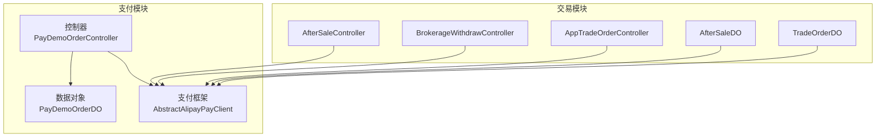
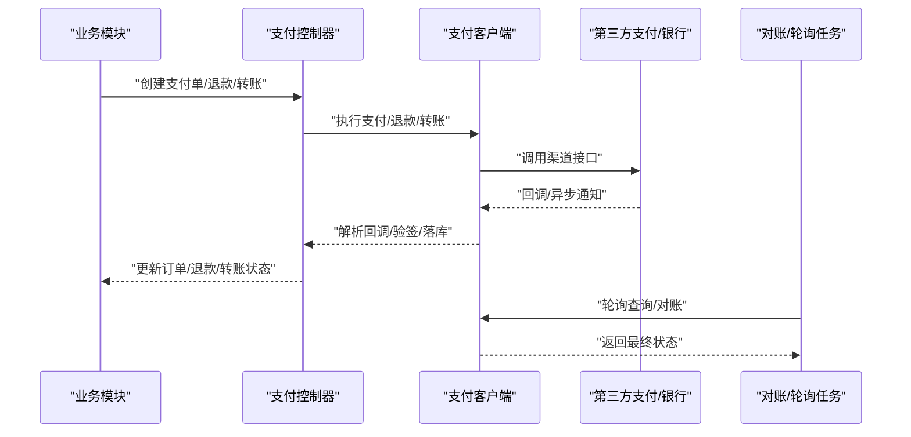
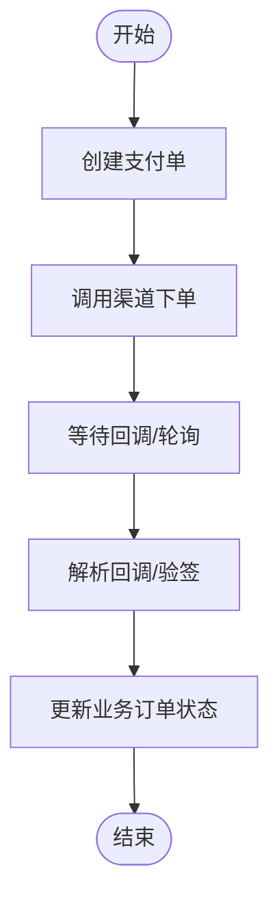
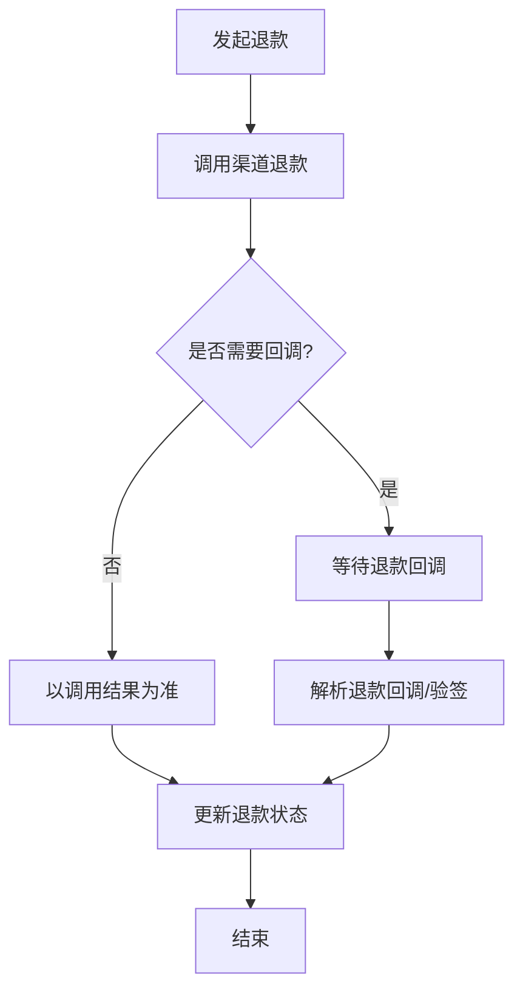
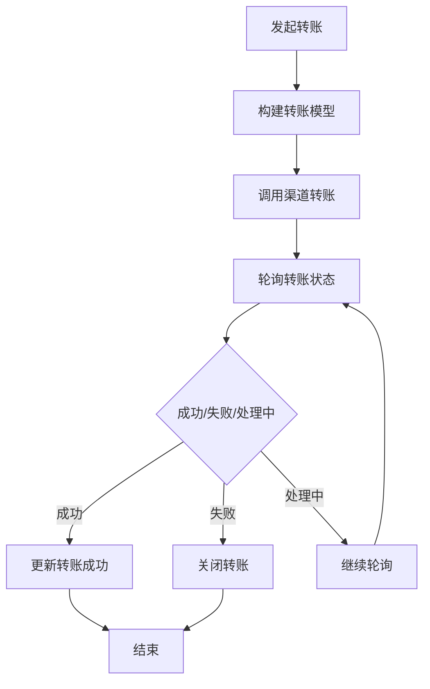
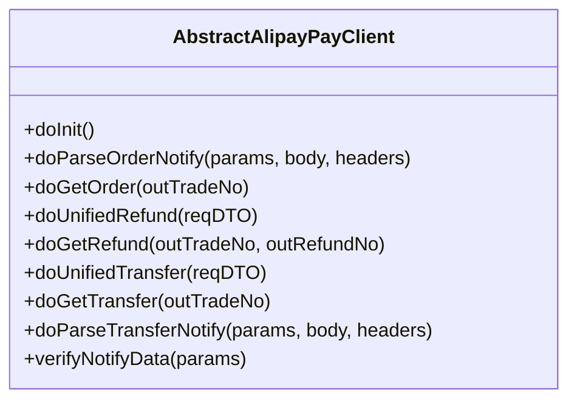
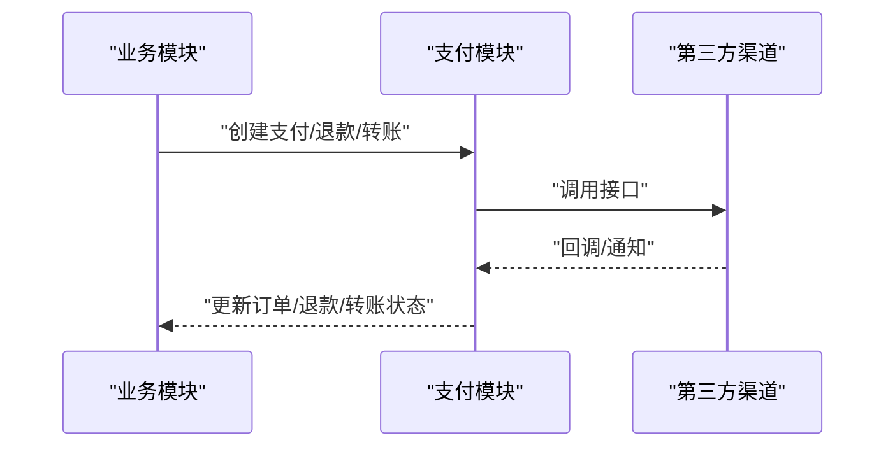
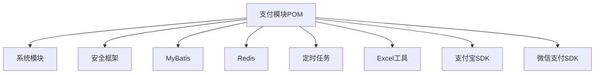

# 支付管理模块

<cite>
**本文档引用的文件**
- [package-info.java](file://backend/yudao-module-pay/src/main/java/cn/iocoder/yudao/module/pay/package-info.java)
- [pom.xml](file://backend/yudao-module-pay/pom.xml)
- [PayDemoOrderController.java](file://backend/yudao-module-pay/src/main/java/cn/iocoder/yudao/module/pay/controller/admin/demo/PayDemoOrderController.java)
- [PayDemoOrderDO.java](file://backend/yudao-module-pay/src/main/java/cn/iocoder/yudao/module/pay/dal/dataobject/demo/PayDemoOrderDO.java)
- [AbstractAlipayPayClient.java](file://backend/yudao-module-pay/src/main/java/cn/iocoder/yudao/module/pay/framework/pay/core/client/impl/alipay/AbstractAlipayPayClient.java)
- [AfterSaleController.java](file://backend/yudao-module-mall/yudao-module-trade/src/main/java/cn/iocoder/yudao/module/trade/controller/admin/aftersale/AfterSaleController.java)
- [BrokerageWithdrawController.java](file://backend/yudao-module-mall/yudao-module-trade/src/main/java/cn/iocoder/yudao/module/trade/controller/admin/brokerage/BrokerageWithdrawController.java)
- [AppTradeOrderController.java](file://backend/yudao-module-mall/yudao-module-trade/src/main/java/cn/iocoder/yudao/module/trade/controller/app/order/AppTradeOrderController.java)
- [AfterSaleDO.java](file://backend/yudao-module-mall/yudao-module-trade/src/main/java/cn/iocoder/yudao/module/trade/dal/dataobject/aftersale/AfterSaleDO.java)
- [TradeOrderDO.java](file://backend/yudao-module-mall/yudao-module-trade/src/main/java/cn/iocoder/yudao/module/trade/dal/dataobject/order/TradeOrderDO.java)
</cite>

## 目录
1. [简介](#简介)
2. [项目结构](#项目结构)
3. [核心组件](#核心组件)
4. [架构总览](#架构总览)
5. [详细组件分析](#详细组件分析)
6. [依赖分析](#依赖分析)
7. [性能考量](#性能考量)
8. [故障排查指南](#故障排查指南)
9. [结论](#结论)
10. [附录](#附录)

## 简介
本文件面向支付管理模块，系统化梳理支付订单管理、退款处理、钱包管理、转账打款、渠道管理等核心能力，阐述支付流程设计、状态机管理、风控机制、对账系统，以及与银行系统、第三方支付平台的对接方案。文档还覆盖回调处理、异常处理、幂等性保证、支付安全策略、数据加密、防刷机制、配置参数、扩展接口、监控告警与故障排查。

## 项目结构
支付模块位于后端工程 yudao-module-pay 下，采用按功能域划分的包结构，核心职责包括：
- 控制层：对外暴露支付、退款、钱包充值、转账等接口
- 数据对象：定义支付、退款、钱包等业务实体
- 支付框架：封装支付渠道客户端（如支付宝、微信），统一支付、退款、转账、查询、回调解析等能力
- 业务集成：与交易模块、会员模块等协作，完成订单支付、售后退款、佣金提现等闭环

图表来源
- [PayDemoOrderController.java:1-77](file://backend/yudao-module-pay/src/main/java/cn/iocoder/yudao/module/pay/controller/admin/demo/PayDemoOrderController.java#L1-L77)
- [PayDemoOrderDO.java:1-88](file://backend/yudao-module-pay/src/main/java/cn/iocoder/yudao/module/pay/dal/dataobject/demo/PayDemoOrderDO.java#L1-L88)
- [AbstractAlipayPayClient.java:1-384](file://backend/yudao-module-pay/src/main/java/cn/iocoder/yudao/module/pay/framework/pay/core/client/impl/alipay/AbstractAlipayPayClient.java#L1-L384)
- [AfterSaleController.java:138](file://backend/yudao-module-mall/yudao-module-trade/src/main/java/cn/iocoder/yudao/module/trade/controller/admin/aftersale/AfterSaleController.java#L138)
- [BrokerageWithdrawController.java:85](file://backend/yudao-module-mall/yudao-module-trade/src/main/java/cn/iocoder/yudao/module/trade/controller/admin/brokerage/BrokerageWithdrawController.java#L85)
- [AppTradeOrderController.java:81](file://backend/yudao-module-mall/yudao-module-trade/src/main/java/cn/iocoder/yudao/module/trade/controller/app/order/AppTradeOrderController.java#L81)
- [AfterSaleDO.java:164](file://backend/yudao-module-mall/yudao-module-trade/src/main/java/cn/iocoder/yudao/module/trade/dal/dataobject/aftersale/AfterSaleDO.java#L164)
- [TradeOrderDO.java:133](file://backend/yudao-module-mall/yudao-module-trade/src/main/java/cn/iocoder/yudao/module/trade/dal/dataobject/order/TradeOrderDO.java#L133)

章节来源
- [package-info.java:1-11](file://backend/yudao-module-pay/src/main/java/cn/iocoder/yudao/module/pay/package-info.java#L1-L11)

## 核心组件
- 支付订单管理：负责创建支付单、查询支付状态、接收支付回调、更新业务订单状态
- 退款处理：支持统一退款接口、退款查询、退款状态解析
- 转账打款：支持向用户账户转账，兼容不同场景（如佣金、提现）
- 钱包管理：支持钱包充值、余额变动、与支付回调联动
- 渠道管理：抽象支付渠道客户端，内置支付宝、微信等实现，支持证书/公钥模式
- 回调与对账：统一回调解析、验签、幂等处理；结合定时任务进行对账与异常修复
- 风控与安全：参数校验、签名验证、防重放、敏感信息脱敏、限额与白名单

章节来源
- [AbstractAlipayPayClient.java:60-127](file://backend/yudao-module-pay/src/main/java/cn/iocoder/yudao/module/pay/framework/pay/core/client/impl/alipay/AbstractAlipayPayClient.java#L60-L127)
- [AbstractAlipayPayClient.java:144-218](file://backend/yudao-module-pay/src/main/java/cn/iocoder/yudao/module/pay/framework/pay/core/client/impl/alipay/AbstractAlipayPayClient.java#L144-L218)
- [AbstractAlipayPayClient.java:221-316](file://backend/yudao-module-pay/src/main/java/cn/iocoder/yudao/module/pay/framework/pay/core/client/impl/alipay/AbstractAlipayPayClient.java#L221-L316)
- [AbstractAlipayPayClient.java:352-367](file://backend/yudao-module-pay/src/main/java/cn/iocoder/yudao/module/pay/framework/pay/core/client/impl/alipay/AbstractAlipayPayClient.java#L352-L367)

## 架构总览
支付模块通过统一的支付框架对接多家渠道，业务模块通过支付模块提供的回调与查询能力完成闭环。核心交互如下：

图表来源
- [PayDemoOrderController.java:35-74](file://backend/yudao-module-pay/src/main/java/cn/iocoder/yudao/module/pay/controller/admin/demo/PayDemoOrderController.java#L35-L74)
- [AbstractAlipayPayClient.java:82-99](file://backend/yudao-module-pay/src/main/java/cn/iocoder/yudao/module/pay/framework/pay/core/client/impl/alipay/AbstractAlipayPayClient.java#L82-L99)
- [AbstractAlipayPayClient.java:144-174](file://backend/yudao-module-pay/src/main/java/cn/iocoder/yudao/module/pay/framework/pay/core/client/impl/alipay/AbstractAlipayPayClient.java#L144-L174)
- [AbstractAlipayPayClient.java:221-277](file://backend/yudao-module-pay/src/main/java/cn/iocoder/yudao/module/pay/framework/pay/core/client/impl/alipay/AbstractAlipayPayClient.java#L221-L277)

## 详细组件分析

### 支付订单管理
- 功能要点
  - 创建支付单：生成商户订单号与支付单号，选择支付渠道
  - 查询支付状态：根据商户订单号查询第三方渠道状态
  - 回调解析与验签：解析第三方回调参数，校验签名，转换为内部状态
  - 幂等处理：依据商户订单号/支付单号去重，避免重复入账
- 关键流程

图表来源
- [PayDemoOrderController.java:35-55](file://backend/yudao-module-pay/src/main/java/cn/iocoder/yudao/module/pay/controller/admin/demo/PayDemoOrderController.java#L35-L55)
- [AbstractAlipayPayClient.java:82-99](file://backend/yudao-module-pay/src/main/java/cn/iocoder/yudao/module/pay/framework/pay/core/client/impl/alipay/AbstractAlipayPayClient.java#L82-L99)

章节来源
- [PayDemoOrderController.java:35-55](file://backend/yudao-module-pay/src/main/java/cn/iocoder/yudao/module/pay/controller/admin/demo/PayDemoOrderController.java#L35-L55)
- [AbstractAlipayPayClient.java:82-99](file://backend/yudao-module-pay/src/main/java/cn/iocoder/yudao/module/pay/framework/pay/core/client/impl/alipay/AbstractAlipayPayClient.java#L82-L99)

### 退款处理
- 功能要点
  - 统一退款接口：封装渠道退款请求，返回统一状态
  - 退款查询：轮询渠道退款状态，直至成功/失败/处理中
  - 支付宝特殊性：支付宝退款无独立回调，以调用结果为准
- 关键流程

图表来源
- [AbstractAlipayPayClient.java:144-174](file://backend/yudao-module-pay/src/main/java/cn/iocoder/yudao/module/pay/framework/pay/core/client/impl/alipay/AbstractAlipayPayClient.java#L144-L174)
- [AbstractAlipayPayClient.java:176-184](file://backend/yudao-module-pay/src/main/java/cn/iocoder/yudao/module/pay/framework/pay/core/client/impl/alipay/AbstractAlipayPayClient.java#L176-L184)
- [AbstractAlipayPayClient.java:187-218](file://backend/yudao-module-pay/src/main/java/cn/iocoder/yudao/module/pay/framework/pay/core/client/impl/alipay/AbstractAlipayPayClient.java#L187-L218)

章节来源
- [AbstractAlipayPayClient.java:144-174](file://backend/yudao-module-pay/src/main/java/cn/iocoder/yudao/module/pay/framework/pay/core/client/impl/alipay/AbstractAlipayPayClient.java#L144-L174)
- [AbstractAlipayPayClient.java:187-218](file://backend/yudao-module-pay/src/main/java/cn/iocoder/yudao/module/pay/framework/pay/core/client/impl/alipay/AbstractAlipayPayClient.java#L187-L218)

### 转账打款
- 功能要点
  - 统一转账接口：支持向用户账户转账，设置业务场景与参数
  - 转账查询：轮询转账状态，处理成功/失败/处理中
  - 支付宝转账限制：当前实现限定为转账至支付宝账户
- 关键流程

图表来源
- [AbstractAlipayPayClient.java:221-277](file://backend/yudao-module-pay/src/main/java/cn/iocoder/yudao/module/pay/framework/pay/core/client/impl/alipay/AbstractAlipayPayClient.java#L221-L277)
- [AbstractAlipayPayClient.java:280-316](file://backend/yudao-module-pay/src/main/java/cn/iocoder/yudao/module/pay/framework/pay/core/client/impl/alipay/AbstractAlipayPayClient.java#L280-L316)

章节来源
- [AbstractAlipayPayClient.java:221-277](file://backend/yudao-module-pay/src/main/java/cn/iocoder/yudao/module/pay/framework/pay/core/client/impl/alipay/AbstractAlipayPayClient.java#L221-L277)
- [AbstractAlipayPayClient.java:280-316](file://backend/yudao-module-pay/src/main/java/cn/iocoder/yudao/module/pay/framework/pay/core/client/impl/alipay/AbstractAlipayPayClient.java#L280-L316)

### 渠道管理与回调处理
- 渠道客户端抽象：统一支付、退款、转账、查询、回调解析
- 支付宝客户端：支持证书/公钥两种加签模式，回调验签，状态映射
- 回调处理：解析第三方回调参数，验签通过后转换为内部状态，幂等更新
- 对账与轮询：定时任务轮询未决状态，确保最终一致性

图表来源
- [AbstractAlipayPayClient.java:50-384](file://backend/yudao-module-pay/src/main/java/cn/iocoder/yudao/module/pay/framework/pay/core/client/impl/alipay/AbstractAlipayPayClient.java#L50-L384)

章节来源
- [AbstractAlipayPayClient.java:50-384](file://backend/yudao-module-pay/src/main/java/cn/iocoder/yudao/module/pay/framework/pay/core/client/impl/alipay/AbstractAlipayPayClient.java#L50-L384)

### 与业务模块的集成
- 售后退款：由支付模块回调驱动，更新售后单为已退款
- 佣金提现：由支付模块回调驱动，更新提现单转账结果
- 订单支付：由支付模块回调驱动，更新订单为已支付
- 数据关联：业务订单与支付订单/退款订单建立一一对应关系，便于对账与审计

图表来源
- [AfterSaleController.java:138](file://backend/yudao-module-mall/yudao-module-trade/src/main/java/cn/iocoder/yudao/module/trade/controller/admin/aftersale/AfterSaleController.java#L138)
- [BrokerageWithdrawController.java:85](file://backend/yudao-module-mall/yudao-module-trade/src/main/java/cn/iocoder/yudao/module/trade/controller/admin/brokerage/BrokerageWithdrawController.java#L85)
- [AppTradeOrderController.java:81](file://backend/yudao-module-mall/yudao-module-trade/src/main/java/cn/iocoder/yudao/module/trade/controller/app/order/AppTradeOrderController.java#L81)
- [AfterSaleDO.java:164](file://backend/yudao-module-mall/yudao-module-trade/src/main/java/cn/iocoder/yudao/module/trade/dal/dataobject/aftersale/AfterSaleDO.java#L164)
- [TradeOrderDO.java:133](file://backend/yudao-module-mall/yudao-module-trade/src/main/java/cn/iocoder/yudao/module/trade/dal/dataobject/order/TradeOrderDO.java#L133)

章节来源
- [AfterSaleController.java:138](file://backend/yudao-module-mall/yudao-module-trade/src/main/java/cn/iocoder/yudao/module/trade/controller/admin/aftersale/AfterSaleController.java#L138)
- [BrokerageWithdrawController.java:85](file://backend/yudao-module-mall/yudao-module-trade/src/main/java/cn/iocoder/yudao/module/trade/controller/admin/brokerage/BrokerageWithdrawController.java#L85)
- [AppTradeOrderController.java:81](file://backend/yudao-module-mall/yudao-module-trade/src/main/java/cn/iocoder/yudao/module/trade/controller/app/order/AppTradeOrderController.java#L81)
- [AfterSaleDO.java:164](file://backend/yudao-module-mall/yudao-module-trade/src/main/java/cn/iocoder/yudao/module/trade/dal/dataobject/aftersale/AfterSaleDO.java#L164)
- [TradeOrderDO.java:133](file://backend/yudao-module-mall/yudao-module-trade/src/main/java/cn/iocoder/yudao/module/trade/dal/dataobject/order/TradeOrderDO.java#L133)

## 依赖分析
- 模块依赖
  - 支付模块依赖系统模块、安全框架、MyBatis、Redis、定时任务、Excel、测试等基础能力
  - 支付模块引入支付宝SDK与微信支付SDK，用于对接第三方渠道
- 组件耦合
  - 控制器依赖服务层，服务层依赖支付框架与DAO
  - 支付框架与渠道SDK解耦，便于扩展新渠道
- 外部依赖
  - 支付宝SDK：4.40.607.ALL
  - 微信支付SDK：weixin-java-pay

图表来源
- [pom.xml:21-80](file://backend/yudao-module-pay/pom.xml#L21-L80)

章节来源
- [pom.xml:21-80](file://backend/yudao-module-pay/pom.xml#L21-L80)

## 性能考量
- 异步回调与轮询：回调优先，无法回调时通过定时任务轮询，降低实时性成本
- 缓存与幂等：利用Redis缓存回调指纹，避免重复处理
- 批量对账：定时任务批量拉取未决状态，减少高频查询压力
- 超时与重试：对第三方接口调用设置合理超时与指数退避重试
- 日志与链路追踪：关键路径记录请求ID，便于定位性能瓶颈

## 故障排查指南
- 回调验签失败
  - 检查公钥/证书配置是否正确
  - 确认回调参数顺序与编码格式
- 支付状态不一致
  - 使用查询接口核对第三方状态
  - 检查定时任务是否正常运行
- 退款/转账异常
  - 查看渠道返回码与描述
  - 区分系统错误与业务错误，按策略重试或关闭
- 幂等问题
  - 确认商户订单号/支付单号唯一性
  - 核对回调指纹缓存是否过期

章节来源
- [AbstractAlipayPayClient.java:352-367](file://backend/yudao-module-pay/src/main/java/cn/iocoder/yudao/module/pay/framework/pay/core/client/impl/alipay/AbstractAlipayPayClient.java#L352-L367)

## 结论
支付管理模块通过统一的支付框架实现了对多渠道的抽象与整合，配合完善的回调、验签、轮询与对账机制，保障了支付流程的可靠性与一致性。模块化设计便于扩展新渠道与新业务场景，同时提供了清晰的集成点与监控告警入口，满足生产环境的高可用要求。

## 附录
- 配置参数建议
  - 渠道公钥/私钥/证书配置
  - 回调地址与验签开关
  - 轮询周期与最大重试次数
  - 幂等指纹缓存过期时间
- 扩展接口
  - 新增渠道客户端需实现统一接口
  - 提供查询与回调解析模板方法
- 监控告警
  - 回调成功率、验签失败率、轮询失败率
  - 退款/转账成功率与耗时
  - 异常堆栈与慢查询日志
- 安全策略
  - 回调验签、参数校验、敏感信息脱敏
  - 防刷：限流、白名单、风控规则
  - 数据传输加密与存储加密