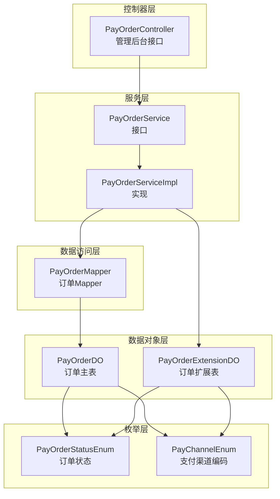
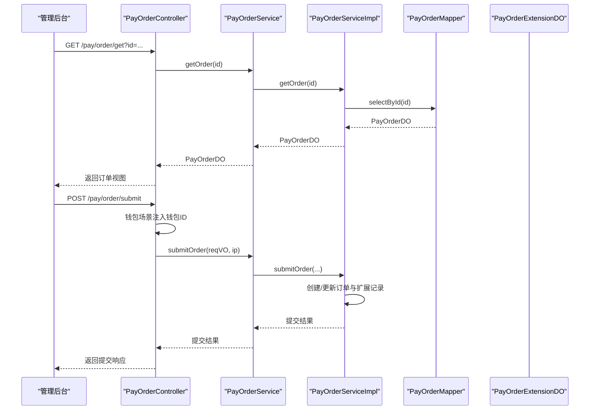
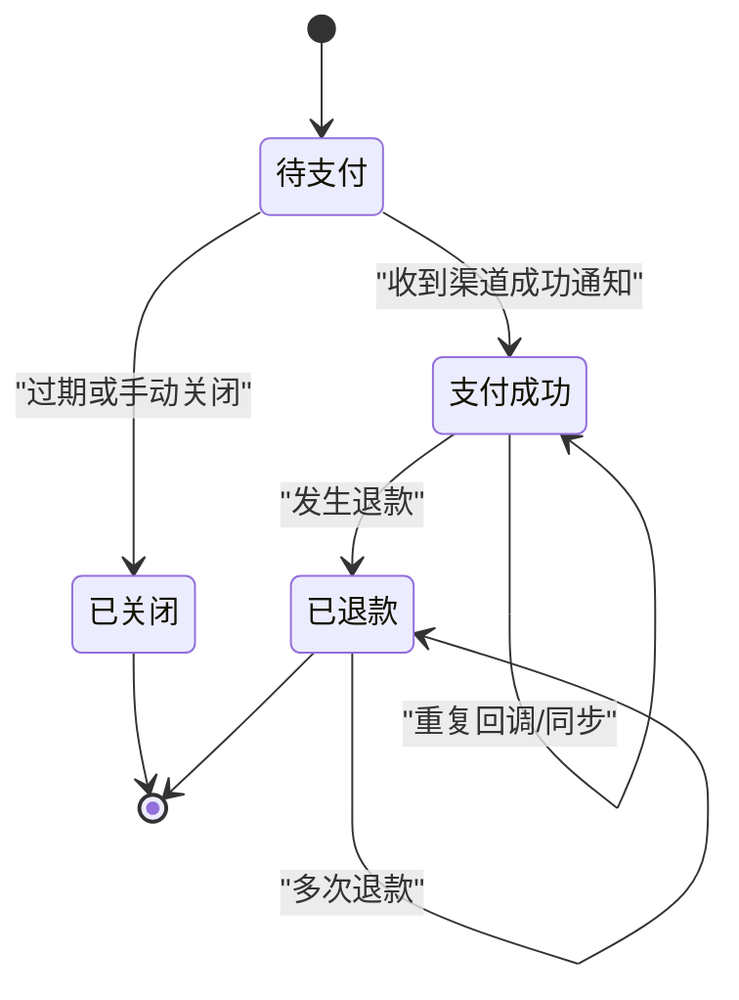
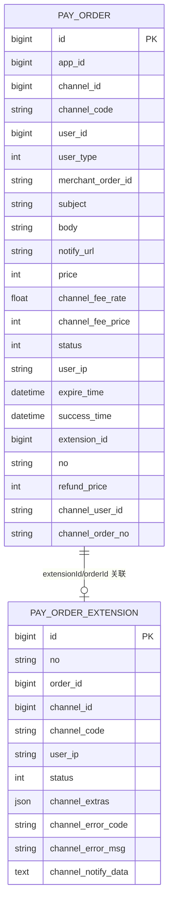
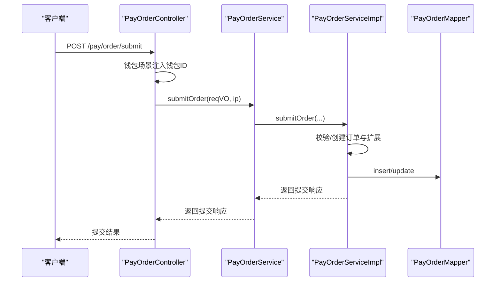
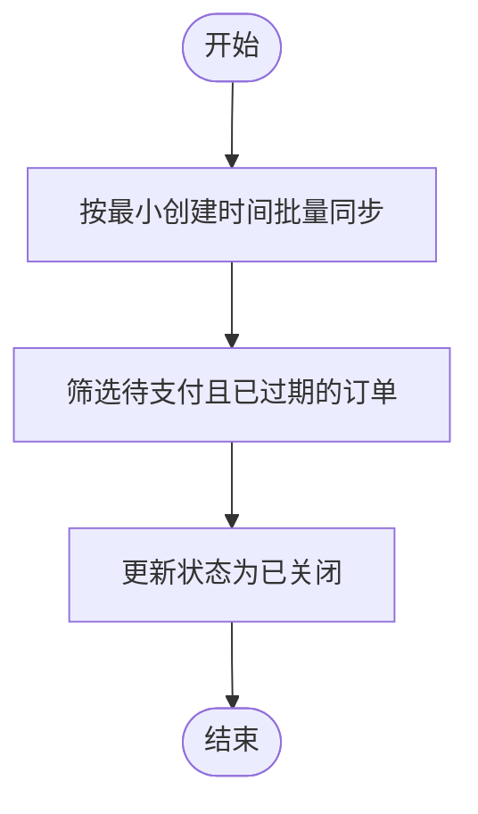
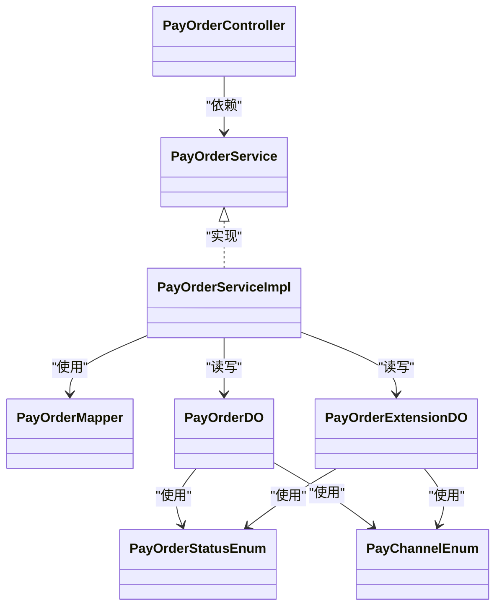

# 支付订单管理

<cite>
**本文引用的文件**
- [PayOrderController.java](file://backend/yudao-module-pay/src/main/java/cn/iocoder/yudao/module/pay/controller/admin/order/PayOrderController.java)
- [PayOrderService.java](file://backend/yudao-module-pay/src/main/java/cn/iocoder/yudao/module/pay/service/order/PayOrderService.java)
- [PayOrderServiceImpl.java](file://backend/yudao-module-pay/src/main/java/cn/iocoder/yudao/module/pay/service/order/PayOrderServiceImpl.java)
- [PayOrderStatusEnum.java](file://backend/yudao-module-pay/src/main/java/cn/iocoder/yudao/module/pay/enums/order/PayOrderStatusEnum.java)
- [PayChannelEnum.java](file://backend/yudao-module-pay/src/main/java/cn/iocoder/yudao/module/pay/enums/PayChannelEnum.java)
- [PayOrderDO.java](file://backend/yudao-module-pay/src/main/java/cn/iocoder/yudao/module/pay/dal/dataobject/order/PayOrderDO.java)
- [PayOrderExtensionDO.java](file://backend/yudao-module-pay/src/main/java/cn/iocoder/yudao/module/pay/dal/dataobject/order/PayOrderExtensionDO.java)
- [PayOrderMapper.java](file://backend/yudao-module-pay/src/main/java/cn/iocoder/yudao/module/pay/dal/mysql/order/PayOrderMapper.java)
</cite>

## 目录
1. [简介](#简介)
2. [项目结构](#项目结构)
3. [核心组件](#核心组件)
4. [架构总览](#架构总览)
5. [详细组件分析](#详细组件分析)
6. [依赖分析](#依赖分析)
7. [性能考虑](#性能考虑)
8. [故障排查指南](#故障排查指南)
9. [结论](#结论)
10. [附录](#附录)

## 简介
本文件系统化梳理支付订单管理模块的设计与实现，覆盖订单生命周期（创建、支付处理、状态更新、查询跟踪）、状态机设计（待支付、支付中、支付成功、支付失败、已关闭）、数据模型与字段约束、与业务订单的关联关系、订单号生成规则、幂等性保障机制、查询与状态变更接口、异常处理策略，以及对账、退款关联与风控检查等业务逻辑。

## 项目结构
支付订单模块位于后端 yudao-module-pay 下，采用典型的分层架构：
- 控制器层：对外暴露管理后台的支付订单查询、提交、导出等接口
- 服务层：封装订单业务流程，包括创建、提交、同步、过期关闭、退款金额更新等
- 数据访问层：MyBatis Mapper 提供分页、导出、按条件查询、按状态+过期时间批量查询等能力
- 数据对象层：PayOrderDO、PayOrderExtensionDO 描述订单与扩展记录的数据结构
- 枚举层：支付渠道编码、订单状态等

图示来源
- [PayOrderController.java:1-146](file://backend/yudao-module-pay/src/main/java/cn/iocoder/yudao/module/pay/controller/admin/order/PayOrderController.java#L1-L146)
- [PayOrderService.java:1-168](file://backend/yudao-module-pay/src/main/java/cn/iocoder/yudao/module/pay/service/order/PayOrderService.java#L1-L168)
- [PayOrderServiceImpl.java](file://backend/yudao-module-pay/src/main/java/cn/iocoder/yudao/module/pay/service/order/PayOrderServiceImpl.java)
- [PayOrderMapper.java:1-67](file://backend/yudao-module-pay/src/main/java/cn/iocoder/yudao/module/pay/dal/mysql/order/PayOrderMapper.java#L1-L67)
- [PayOrderDO.java:1-148](file://backend/yudao-module-pay/src/main/java/cn/iocoder/yudao/module/pay/dal/dataobject/order/PayOrderDO.java#L1-L148)
- [PayOrderExtensionDO.java:1-97](file://backend/yudao-module-pay/src/main/java/cn/iocoder/yudao/module/pay/dal/dataobject/order/PayOrderExtensionDO.java#L1-L97)
- [PayOrderStatusEnum.java:1-85](file://backend/yudao-module-pay/src/main/java/cn/iocoder/yudao/module/pay/enums/order/PayOrderStatusEnum.java#L1-L85)
- [PayChannelEnum.java:1-68](file://backend/yudao-module-pay/src/main/java/cn/iocoder/yudao/module/pay/enums/PayChannelEnum.java#L1-L68)

章节来源
- [PayOrderController.java:1-146](file://backend/yudao-module-pay/src/main/java/cn/iocoder/yudao/module/pay/controller/admin/order/PayOrderController.java#L1-L146)
- [PayOrderService.java:1-168](file://backend/yudao-module-pay/src/main/java/cn/iocoder/yudao/module/pay/service/order/PayOrderService.java#L1-L168)
- [PayOrderMapper.java:1-67](file://backend/yudao-module-pay/src/main/java/cn/iocoder/yudao/module/pay/dal/mysql/order/PayOrderMapper.java#L1-L67)

## 核心组件
- 控制器：提供“获取订单/详情”、“提交支付”、“分页查询”、“导出 Excel”等接口；支持钱包支付场景下自动注入钱包标识
- 服务接口：定义订单查询、创建、提交、通知回调、退款金额更新、价格更新、扩展记录查询、定时同步与过期关闭等能力
- 数据对象：订单主表与扩展表，分别承载订单基础信息、渠道交互信息、通知数据与状态
- 枚举：支付渠道编码、订单状态，支撑状态判断与业务分支

章节来源
- [PayOrderController.java:59-143](file://backend/yudao-module-pay/src/main/java/cn/iocoder/yudao/module/pay/controller/admin/order/PayOrderController.java#L59-L143)
- [PayOrderService.java:24-167](file://backend/yudao-module-pay/src/main/java/cn/iocoder/yudao/module/pay/service/order/PayOrderService.java#L24-L167)
- [PayOrderDO.java:27-147](file://backend/yudao-module-pay/src/main/java/cn/iocoder/yudao/module/pay/dal/dataobject/order/PayOrderDO.java#L27-L147)
- [PayOrderExtensionDO.java:30-96](file://backend/yudao-module-pay/src/main/java/cn/iocoder/yudao/module/pay/dal/dataobject/order/PayOrderExtensionDO.java#L30-L96)
- [PayOrderStatusEnum.java:17-84](file://backend/yudao-module-pay/src/main/java/cn/iocoder/yudao/module/pay/enums/order/PayOrderStatusEnum.java#L17-L84)
- [PayChannelEnum.java:18-67](file://backend/yudao-module-pay/src/main/java/cn/iocoder/yudao/module/pay/enums/PayChannelEnum.java#L18-L67)

## 架构总览
支付订单管理遵循“控制器-服务-数据访问-数据对象”的分层设计，通过枚举统一状态与渠道，通过扩展表承接渠道侧的异步通知与额外参数，确保主表聚焦业务语义。

图示来源
- [PayOrderController.java:66-109](file://backend/yudao-module-pay/src/main/java/cn/iocoder/yudao/module/pay/controller/admin/order/PayOrderController.java#L66-L109)
- [PayOrderService.java:99-100](file://backend/yudao-module-pay/src/main/java/cn/iocoder/yudao/module/pay/service/order/PayOrderService.java#L99-L100)
- [PayOrderMapper.java:18-28](file://backend/yudao-module-pay/src/main/java/cn/iocoder/yudao/module/pay/dal/mysql/order/PayOrderMapper.java#L18-L28)
- [PayOrderExtensionDO.java:30-96](file://backend/yudao-module-pay/src/main/java/cn/iocoder/yudao/module/pay/dal/dataobject/order/PayOrderExtensionDO.java#L30-L96)

## 详细组件分析

### 订单状态机设计
订单状态涵盖“待支付、支付成功、已退款、支付关闭”，并提供便捷判断方法以支撑业务分支。

图示来源
- [PayOrderStatusEnum.java:17-84](file://backend/yudao-module-pay/src/main/java/cn/iocoder/yudao/module/pay/enums/order/PayOrderStatusEnum.java#L17-L84)

章节来源
- [PayOrderStatusEnum.java:17-84](file://backend/yudao-module-pay/src/main/java/cn/iocoder/yudao/module/pay/enums/order/PayOrderStatusEnum.java#L17-L84)

### 订单数据模型与字段约束
- 主表 PayOrderDO
  - 标识与关联：id、appId、channelId、userId、userType、extensionId、no
  - 商户与商品：merchantOrderId（需在应用维度唯一）、subject、body、notifyUrl
  - 金额与费用：price（分）、channelFeeRate、channelFeePrice、refundPrice
  - 状态与时间：status、expireTime、successTime、userIp
  - 渠道侧：channelCode、channelUserId、channelOrderNo
- 扩展表 PayOrderExtensionDO
  - 标识与关联：id、orderId、channelId、channelCode
  - 外部订单号 no：对接渠道的 out_trade_no
  - 状态与通知：status、channelNotifyData
  - 额外参数与错误：channelExtras、channelErrorCode、channelErrorMsg
  - 用户IP：userIp

图示来源
- [PayOrderDO.java:27-147](file://backend/yudao-module-pay/src/main/java/cn/iocoder/yudao/module/pay/dal/dataobject/order/PayOrderDO.java#L27-L147)
- [PayOrderExtensionDO.java:30-96](file://backend/yudao-module-pay/src/main/java/cn/iocoder/yudao/module/pay/dal/dataobject/order/PayOrderExtensionDO.java#L30-L96)

章节来源
- [PayOrderDO.java:27-147](file://backend/yudao-module-pay/src/main/java/cn/iocoder/yudao/module/pay/dal/dataobject/order/PayOrderDO.java#L27-L147)
- [PayOrderExtensionDO.java:30-96](file://backend/yudao-module-pay/src/main/java/cn/iocoder/yudao/module/pay/dal/dataobject/order/PayOrderExtensionDO.java#L30-L96)

### 订单号生成规则与幂等性
- 外部订单号 no：由扩展表承载，用于对接支付渠道的 out_trade_no，避免与主表 id 混淆
- 幂等性保障：Mapper 提供“按 id 且按当前状态”的更新方法，防止并发状态下状态回写冲突
- 商户订单号 merchantOrderId：要求在应用维度唯一，避免重复创建

章节来源
- [PayOrderExtensionDO.java:32-45](file://backend/yudao-module-pay/src/main/java/cn/iocoder/yudao/module/pay/dal/dataobject/order/PayOrderExtensionDO.java#L32-L45)
- [PayOrderMapper.java:55-58](file://backend/yudao-module-pay/src/main/java/cn/iocoder/yudao/module/pay/dal/mysql/order/PayOrderMapper.java#L55-L58)
- [PayOrderDO.java:63-68](file://backend/yudao-module-pay/src/main/java/cn/iocoder/yudao/module/pay/dal/dataobject/order/PayOrderDO.java#L63-L68)

### 订单生命周期与关键流程

#### 1) 订单创建与提交
- 控制器接收提交请求，钱包场景自动注入钱包标识
- 服务层执行创建/提交逻辑，生成扩展记录并返回提交结果

图示来源
- [PayOrderController.java:94-109](file://backend/yudao-module-pay/src/main/java/cn/iocoder/yudao/module/pay/controller/admin/order/PayOrderController.java#L94-L109)
- [PayOrderService.java:99-100](file://backend/yudao-module-pay/src/main/java/cn/iocoder/yudao/module/pay/service/order/PayOrderService.java#L99-L100)

#### 2) 支付状态同步与过期关闭
- 定时任务触发同步：按最小创建时间批量同步已支付
- 静默同步：针对单个订单的主动同步，失败不抛异常
- 过期关闭：将已过期且处于待支付状态的订单关闭

图示来源
- [PayOrderService.java:142-167](file://backend/yudao-module-pay/src/main/java/cn/iocoder/yudao/module/pay/service/order/PayOrderService.java#L142-L167)
- [PayOrderMapper.java:60-64](file://backend/yudao-module-pay/src/main/java/cn/iocoder/yudao/module/pay/dal/mysql/order/PayOrderMapper.java#L60-L64)

#### 3) 退款金额更新
- 服务层提供按增量更新退款金额的能力，用于部分/全额退款后的对账与状态一致性

章节来源
- [PayOrderService.java:110-117](file://backend/yudao-module-pay/src/main/java/cn/iocoder/yudao/module/pay/service/order/PayOrderService.java#L110-L117)

#### 4) 查询与导出
- 分页查询：支持按应用、渠道编码、商户订单号、渠道订单号、外部订单号、状态、创建时间范围查询
- 导出 Excel：拼装应用信息后导出

章节来源
- [PayOrderController.java:111-143](file://backend/yudao-module-pay/src/main/java/cn/iocoder/yudao/module/pay/controller/admin/order/PayOrderController.java#L111-L143)
- [PayOrderMapper.java:18-40](file://backend/yudao-module-pay/src/main/java/cn/iocoder/yudao/module/pay/dal/mysql/order/PayOrderMapper.java#L18-L40)

### 接口定义与使用说明

- 获取订单
  - 方法：GET /pay/order/get
  - 参数：id（必填）、sync（可选）
  - 行为：当 sync=true 且订单处于待支付时，先静默同步再返回最新状态
- 获取订单详情
  - 方法：GET /pay/order/get-detail
  - 参数：id（必填）
  - 行为：组合返回订单、扩展记录与应用信息
- 提交支付
  - 方法：POST /pay/order/submit
  - 行为：钱包场景自动注入钱包 ID；调用服务层提交并返回结果
- 分页查询
  - 方法：GET /pay/order/page
  - 行为：返回订单分页并拼装应用信息
- 导出 Excel
  - 方法：GET /pay/order/export-excel
  - 行为：按导出条件查询并导出

章节来源
- [PayOrderController.java:59-143](file://backend/yudao-module-pay/src/main/java/cn/iocoder/yudao/module/pay/controller/admin/order/PayOrderController.java#L59-L143)

## 依赖分析
- 控制器依赖服务接口，服务接口由实现类落地
- 实现类依赖 Mapper 进行持久化操作
- 数据对象之间通过外键/关联字段建立关系
- 枚举贯穿状态判断与渠道识别

图示来源
- [PayOrderController.java:52-57](file://backend/yudao-module-pay/src/main/java/cn/iocoder/yudao/module/pay/controller/admin/order/PayOrderController.java#L52-L57)
- [PayOrderService.java:24-24](file://backend/yudao-module-pay/src/main/java/cn/iocoder/yudao/module/pay/service/order/PayOrderService.java#L24-L24)
- [PayOrderServiceImpl.java](file://backend/yudao-module-pay/src/main/java/cn/iocoder/yudao/module/pay/service/order/PayOrderServiceImpl.java)
- [PayOrderMapper.java:15-15](file://backend/yudao-module-pay/src/main/java/cn/iocoder/yudao/module/pay/dal/mysql/order/PayOrderMapper.java#L15-L15)
- [PayOrderDO.java:27-27](file://backend/yudao-module-pay/src/main/java/cn/iocoder/yudao/module/pay/dal/dataobject/order/PayOrderDO.java#L27-L27)
- [PayOrderExtensionDO.java:30-30](file://backend/yudao-module-pay/src/main/java/cn/iocoder/yudao/module/pay/dal/dataobject/order/PayOrderExtensionDO.java#L30-L30)
- [PayOrderStatusEnum.java:17-17](file://backend/yudao-module-pay/src/main/java/cn/iocoder/yudao/module/pay/enums/order/PayOrderStatusEnum.java#L17-L17)
- [PayChannelEnum.java:18-18](file://backend/yudao-module-pay/src/main/java/cn/iocoder/yudao/module/pay/enums/PayChannelEnum.java#L18-L18)

## 性能考虑
- 批量查询与导出：通过 Mapper 的条件构造器进行高效过滤，减少不必要的字段加载
- 分页与排序：默认按 id 倒序，有利于热点数据的快速定位
- 静默同步：避免因主动同步与异步回调并发导致的异常风暴
- 状态更新幂等：基于“按 id 且按当前状态”的更新策略，降低并发写入冲突

## 故障排查指南
- 同步失败不抛异常：静默同步接口用于避免主动同步与异步回调并发冲突引发的异常传播
- 状态判断辅助：使用状态枚举提供的 isWaiting/isSuccess/isRefund/isClosed 等静态方法快速定位问题
- 导出空数据：当查询结果为空时，导出会输出空表格，避免前端解析异常

章节来源
- [PayOrderService.java:150-158](file://backend/yudao-module-pay/src/main/java/cn/iocoder/yudao/module/pay/service/order/PayOrderService.java#L150-L158)
- [PayOrderStatusEnum.java:33-82](file://backend/yudao-module-pay/src/main/java/cn/iocoder/yudao/module/pay/enums/order/PayOrderStatusEnum.java#L33-L82)
- [PayOrderController.java:125-143](file://backend/yudao-module-pay/src/main/java/cn/iocoder/yudao/module/pay/controller/admin/order/PayOrderController.java#L125-L143)

## 结论
支付订单管理模块通过清晰的分层设计、严谨的状态机与数据模型、完善的幂等性与异常处理策略，实现了从创建到对账的全链路闭环。结合扩展表与渠道编码枚举，系统既满足多渠道接入，又保持了主表的简洁与稳定。

## 附录

### 订单与业务订单的关联关系
- merchantOrderId：业务侧订单号，在应用维度唯一，用于幂等创建与业务检索
- no：渠道侧外部订单号，用于对接支付渠道的 out_trade_no

章节来源
- [PayOrderDO.java:63-68](file://backend/yudao-module-pay/src/main/java/cn/iocoder/yudao/module/pay/dal/dataobject/order/PayOrderDO.java#L63-L68)
- [PayOrderExtensionDO.java:32-45](file://backend/yudao-module-pay/src/main/java/cn/iocoder/yudao/module/pay/dal/dataobject/order/PayOrderExtensionDO.java#L32-L45)

### 退款与对账
- 退款金额更新：服务层提供按增量更新退款金额的方法，便于对账与状态一致性维护
- 状态流转：支付成功后可进入已退款状态，多次退款仍保持该状态

章节来源
- [PayOrderService.java:110-117](file://backend/yudao-module-pay/src/main/java/cn/iocoder/yudao/module/pay/service/order/PayOrderService.java#L110-L117)
- [PayOrderStatusEnum.java:19-23](file://backend/yudao-module-pay/src/main/java/cn/iocoder/yudao/module/pay/enums/order/PayOrderStatusEnum.java#L19-L23)

### 风控检查
- 用户 IP：订单与扩展记录均保留 userIp，可用于风控与审计
- 渠道参数：channelExtras 与 channelNotifyData 为风控与对账提供原始数据支撑

章节来源
- [PayOrderDO.java:106-107](file://backend/yudao-module-pay/src/main/java/cn/iocoder/yudao/module/pay/dal/dataobject/order/PayOrderDO.java#L106-L107)
- [PayOrderExtensionDO.java:64-65](file://backend/yudao-module-pay/src/main/java/cn/iocoder/yudao/module/pay/dal/dataobject/order/PayOrderExtensionDO.java#L64-L65)
- [PayOrderExtensionDO.java:77-94](file://backend/yudao-module-pay/src/main/java/cn/iocoder/yudao/module/pay/dal/dataobject/order/PayOrderExtensionDO.java#L77-L94)