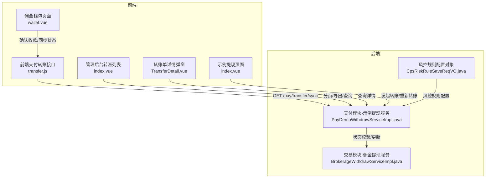
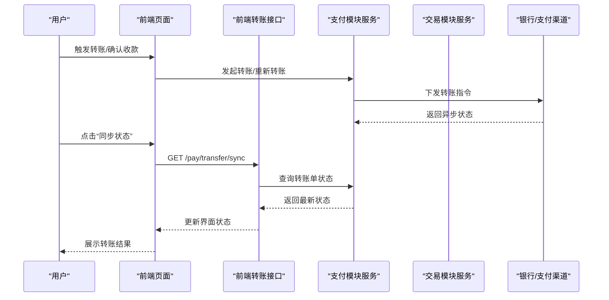
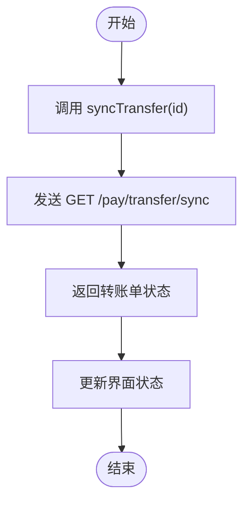
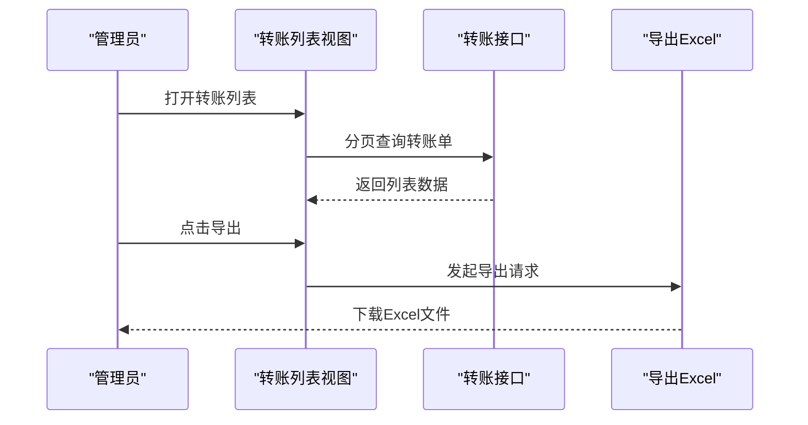
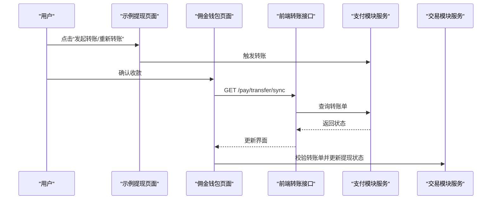
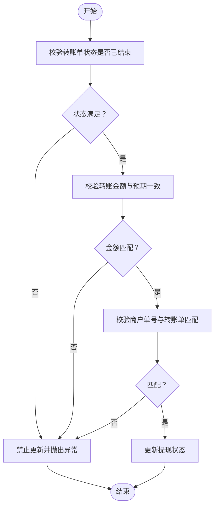
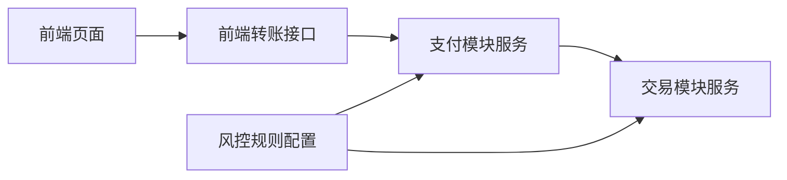

# 转账打款

<cite>
**本文引用的文件**
- [transfer.js](file://frontend/mall-uniapp/sheep/api/pay/transfer.js)
- [index.vue](file://frontend/admin-vue3/src/views/pay/transfer/index.vue)
- [TransferDetail.vue](file://frontend/admin-vue3/src/views/pay/transfer/TransferDetail.vue)
- [index.vue](file://frontend/admin-vue3/src/views/pay/demo/withdraw/index.vue)
- [wallet.vue](file://frontend/mall-uniapp/pages/commission/wallet.vue)
- [PayDemoWithdrawServiceImpl.java](file://backend/yudao-module-pay/src/main/java/cn/iocoder/yudao/module/pay/service/demo/PayDemoWithdrawServiceImpl.java)
- [BrokerageWithdrawServiceImpl.java](file://backend/yudao-module-mall/yudao-module-trade/src/main/java/cn/iocoder/yudao/module/trade/service/brokerage/BrokerageWithdrawServiceImpl.java)
- [CpsRiskRuleSaveReqVO.java](file://backend/yudao-module-cps/yudao-module-cps-biz/src/main/java/cn/iocoder/yudao/module/cps/controller/admin/risk/vo/CpsRiskRuleSaveReqVO.java)
</cite>

## 目录
1. [简介](#简介)
2. [项目结构](#项目结构)
3. [核心组件](#核心组件)
4. [架构总览](#架构总览)
5. [详细组件分析](#详细组件分析)
6. [依赖关系分析](#依赖关系分析)
7. [性能考虑](#性能考虑)
8. [故障排查指南](#故障排查指南)
9. [结论](#结论)
10. [附录](#附录)

## 简介
本文件围绕“转账打款”功能进行全面技术文档化，覆盖单笔转账、批量转账、转账记录管理、状态流转、规则配置、手续费与限额控制、与银行系统的对接方式、批量文件生成与异步状态查询、接口设计、风控校验与重复转账防护、转账对账与异常处理、通知推送等配套能力。文档以仓库现有实现为依据，结合前端界面与后端服务逻辑，形成从用户操作到系统内部处理的完整闭环。

## 项目结构
转账打款相关能力由前端页面与接口、后端支付与交易模块共同构成：
- 前端
  - 支付转账接口封装：提供同步转账单状态的请求方法
  - 管理后台转账列表与详情：分页查询、导出、查看详情
  - 示例提现与佣金提现场景：触发转账、确认收款、同步状态
- 后端
  - 支付模块：示例提现状态校验与更新
  - 商城交易模块：佣金提现状态校验与更新
  - 风控模块：风控规则配置对象（用于限额、频率等）

**图表来源**
- [transfer.js:1-14](file://frontend/mall-uniapp/sheep/api/pay/transfer.js#L1-L14)
- [index.vue:216-283](file://frontend/admin-vue3/src/views/pay/transfer/index.vue#L216-L283)
- [TransferDetail.vue:1-80](file://frontend/admin-vue3/src/views/pay/transfer/TransferDetail.vue#L1-L80)
- [index.vue:1-43](file://frontend/admin-vue3/src/views/pay/demo/withdraw/index.vue#L1-L43)
- [wallet.vue:313-351](file://frontend/mall-uniapp/pages/commission/wallet.vue#L313-L351)
- [PayDemoWithdrawServiceImpl.java:172-188](file://backend/yudao-module-pay/src/main/java/cn/iocoder/yudao/module/pay/service/demo/PayDemoWithdrawServiceImpl.java#L172-L188)
- [BrokerageWithdrawServiceImpl.java:271-306](file://backend/yudao-module-mall/yudao-module-trade/src/main/java/cn/iocoder/yudao/module/trade/service/brokerage/BrokerageWithdrawServiceImpl.java#L271-L306)
- [CpsRiskRuleSaveReqVO.java:33-46](file://backend/yudao-module-cps/yudao-module-cps-biz/src/main/java/cn/iocoder/yudao/module/cps/controller/admin/risk/vo/CpsRiskRuleSaveReqVO.java#L33-L46)

**章节来源**
- [transfer.js:1-14](file://frontend/mall-uniapp/sheep/api/pay/transfer.js#L1-L14)
- [index.vue:216-283](file://frontend/admin-vue3/src/views/pay/transfer/index.vue#L216-L283)
- [TransferDetail.vue:1-80](file://frontend/admin-vue3/src/views/pay/transfer/TransferDetail.vue#L1-L80)
- [index.vue:1-43](file://frontend/admin-vue3/src/views/pay/demo/withdraw/index.vue#L1-L43)
- [wallet.vue:313-351](file://frontend/mall-uniapp/pages/commission/wallet.vue#L313-L351)
- [PayDemoWithdrawServiceImpl.java:172-188](file://backend/yudao-module-pay/src/main/java/cn/iocoder/yudao/module/pay/service/demo/PayDemoWithdrawServiceImpl.java#L172-L188)
- [BrokerageWithdrawServiceImpl.java:271-306](file://backend/yudao-module-mall/yudao-module-trade/src/main/java/cn/iocoder/yudao/module/trade/service/brokerage/BrokerageWithdrawServiceImpl.java#L271-L306)
- [CpsRiskRuleSaveReqVO.java:33-46](file://backend/yudao-module-cps/yudao-module-cps-biz/src/main/java/cn/iocoder/yudao/module/cps/controller/admin/risk/vo/CpsRiskRuleSaveReqVO.java#L33-L46)

## 核心组件
- 前端转账接口封装：提供同步转账单状态的 GET 请求，便于在确认收款后刷新状态
- 管理后台转账单列表：支持分页查询、导出 Excel、查看详情
- 示例提现与佣金提现：支持发起转账、重新转账、确认收款、同步状态
- 后端状态校验与更新：示例提现与佣金提现均包含严格的转账单状态校验与一致性检查
- 风控规则配置：提供风控规则的保存对象，可用于频率/限额等策略

**章节来源**
- [transfer.js:1-14](file://frontend/mall-uniapp/sheep/api/pay/transfer.js#L1-L14)
- [index.vue:216-283](file://frontend/admin-vue3/src/views/pay/transfer/index.vue#L216-L283)
- [index.vue:1-43](file://frontend/admin-vue3/src/views/pay/demo/withdraw/index.vue#L1-L43)
- [wallet.vue:313-351](file://frontend/mall-uniapp/pages/commission/wallet.vue#L313-L351)
- [PayDemoWithdrawServiceImpl.java:172-188](file://backend/yudao-module-pay/src/main/java/cn/iocoder/yudao/module/pay/service/demo/PayDemoWithdrawServiceImpl.java#L172-L188)
- [BrokerageWithdrawServiceImpl.java:271-306](file://backend/yudao-module-mall/yudao-module-trade/src/main/java/cn/iocoder/yudao/module/trade/service/brokerage/BrokerageWithdrawServiceImpl.java#L271-L306)
- [CpsRiskRuleSaveReqVO.java:33-46](file://backend/yudao-module-cps/yudao-module-cps-biz/src/main/java/cn/iocoder/yudao/module/cps/controller/admin/risk/vo/CpsRiskRuleSaveReqVO.java#L33-L46)

## 架构总览
转账打款涉及“前端交互—后端服务—银行/支付渠道—对账与通知”的闭环：

**图表来源**
- [wallet.vue:313-351](file://frontend/mall-uniapp/pages/commission/wallet.vue#L313-L351)
- [transfer.js:1-14](file://frontend/mall-uniapp/sheep/api/pay/transfer.js#L1-L14)
- [PayDemoWithdrawServiceImpl.java:172-188](file://backend/yudao-module-pay/src/main/java/cn/iocoder/yudao/module/pay/service/demo/PayDemoWithdrawServiceImpl.java#L172-L188)
- [BrokerageWithdrawServiceImpl.java:271-306](file://backend/yudao-module-mall/yudao-module-trade/src/main/java/cn/iocoder/yudao/module/trade/service/brokerage/BrokerageWithdrawServiceImpl.java#L271-L306)

## 详细组件分析

### 前端转账接口封装
- 功能：提供同步转账单状态的 GET 请求，支持按 id 查询
- 使用场景：在确认收款后调用，确保前端显示最新状态
- 关键路径：[transfer.js:1-14](file://frontend/mall-uniapp/sheep/api/pay/transfer.js#L1-L14)

**图表来源**
- [transfer.js:1-14](file://frontend/mall-uniapp/sheep/api/pay/transfer.js#L1-L14)

**章节来源**
- [transfer.js:1-14](file://frontend/mall-uniapp/sheep/api/pay/transfer.js#L1-L14)

### 管理后台转账单管理
- 列表功能：分页查询、导出 Excel、查看详情
- 关键路径：
  - 列表与导出：[index.vue:216-283](file://frontend/admin-vue3/src/views/pay/transfer/index.vue#L216-L283)
  - 详情弹窗：[TransferDetail.vue:1-80](file://frontend/admin-vue3/src/views/pay/transfer/TransferDetail.vue#L1-L80)

**图表来源**
- [index.vue:216-283](file://frontend/admin-vue3/src/views/pay/transfer/index.vue#L216-L283)
- [TransferDetail.vue:1-80](file://frontend/admin-vue3/src/views/pay/transfer/TransferDetail.vue#L1-L80)

**章节来源**
- [index.vue:216-283](file://frontend/admin-vue3/src/views/pay/transfer/index.vue#L216-L283)
- [TransferDetail.vue:1-80](file://frontend/admin-vue3/src/views/pay/transfer/TransferDetail.vue#L1-L80)

### 示例提现与佣金提现流程
- 示例提现：支持发起转账、重新转账；在确认收款后同步状态
- 佣金提现：支持确认收款、同步状态，并与转账单进行严格的状态与金额校验
- 关键路径：
  - 示例提现页面：[index.vue:1-43](file://frontend/admin-vue3/src/views/pay/demo/withdraw/index.vue#L1-L43)
  - 佣金钱包页面：[wallet.vue:313-351](file://frontend/mall-uniapp/pages/commission/wallet.vue#L313-L351)

**图表来源**
- [index.vue:1-43](file://frontend/admin-vue3/src/views/pay/demo/withdraw/index.vue#L1-L43)
- [wallet.vue:313-351](file://frontend/mall-uniapp/pages/commission/wallet.vue#L313-L351)
- [transfer.js:1-14](file://frontend/mall-uniapp/sheep/api/pay/transfer.js#L1-L14)
- [PayDemoWithdrawServiceImpl.java:172-188](file://backend/yudao-module-pay/src/main/java/cn/iocoder/yudao/module/pay/service/demo/PayDemoWithdrawServiceImpl.java#L172-L188)
- [BrokerageWithdrawServiceImpl.java:271-306](file://backend/yudao-module-mall/yudao-module-trade/src/main/java/cn/iocoder/yudao/module/trade/service/brokerage/BrokerageWithdrawServiceImpl.java#L271-L306)

**章节来源**
- [index.vue:1-43](file://frontend/admin-vue3/src/views/pay/demo/withdraw/index.vue#L1-L43)
- [wallet.vue:313-351](file://frontend/mall-uniapp/pages/commission/wallet.vue#L313-L351)
- [transfer.js:1-14](file://frontend/mall-uniapp/sheep/api/pay/transfer.js#L1-L14)
- [PayDemoWithdrawServiceImpl.java:172-188](file://backend/yudao-module-pay/src/main/java/cn/iocoder/yudao/module/pay/service/demo/PayDemoWithdrawServiceImpl.java#L172-L188)
- [BrokerageWithdrawServiceImpl.java:271-306](file://backend/yudao-module-mall/yudao-module-trade/src/main/java/cn/iocoder/yudao/module/trade/service/brokerage/BrokerageWithdrawServiceImpl.java#L271-L306)

### 状态管理与流转
- 状态枚举：后端通过状态枚举判断转账单是否成功或关闭，前端通过字典标签展示
- 流程要点：
  - 示例提现：校验转账单状态必须已结束（成功或关闭），否则禁止更新
  - 佣金提现：校验转账金额=提现金额-手续费，且商户单号与转账单匹配
- 关键路径：
  - 示例提现校验：[PayDemoWithdrawServiceImpl.java:172-188](file://backend/yudao-module-pay/src/main/java/cn/iocoder/yudao/module/pay/service/demo/PayDemoWithdrawServiceImpl.java#L172-L188)
  - 佣金提现校验：[BrokerageWithdrawServiceImpl.java:271-306](file://backend/yudao-module-mall/yudao-module-trade/src/main/java/cn/iocoder/yudao/module/trade/service/brokerage/BrokerageWithdrawServiceImpl.java#L271-L306)

**图表来源**
- [PayDemoWithdrawServiceImpl.java:172-188](file://backend/yudao-module-pay/src/main/java/cn/iocoder/yudao/module/pay/service/demo/PayDemoWithdrawServiceImpl.java#L172-L188)
- [BrokerageWithdrawServiceImpl.java:271-306](file://backend/yudao-module-mall/yudao-module-trade/src/main/java/cn/iocoder/yudao/module/trade/service/brokerage/BrokerageWithdrawServiceImpl.java#L271-L306)

**章节来源**
- [PayDemoWithdrawServiceImpl.java:172-188](file://backend/yudao-module-pay/src/main/java/cn/iocoder/yudao/module/pay/service/demo/PayDemoWithdrawServiceImpl.java#L172-L188)
- [BrokerageWithdrawServiceImpl.java:271-306](file://backend/yudao-module-mall/yudao-module-trade/src/main/java/cn/iocoder/yudao/module/trade/service/brokerage/BrokerageWithdrawServiceImpl.java#L271-L306)

### 规则配置、手续费与限额控制
- 风控规则配置对象：提供限制次数、状态、备注等字段，可用于频率/限额策略
- 手续费：佣金提现场景中，转账金额=提现金额-手续费
- 关键路径：
  - 风控规则对象：[CpsRiskRuleSaveReqVO.java:33-46](file://backend/yudao-module-cps/yudao-module-cps-biz/src/main/java/cn/iocoder/yudao/module/cps/controller/admin/risk/vo/CpsRiskRuleSaveReqVO.java#L33-L46)
  - 佣金提现金额计算：[BrokerageWithdrawServiceImpl.java:284-289](file://backend/yudao-module-mall/yudao-module-trade/src/main/java/cn/iocoder/yudao/module/trade/service/brokerage/BrokerageWithdrawServiceImpl.java#L284-L289)

**章节来源**
- [CpsRiskRuleSaveReqVO.java:33-46](file://backend/yudao-module-cps/yudao-module-cps-biz/src/main/java/cn/iocoder/yudao/module/cps/controller/admin/risk/vo/CpsRiskRuleSaveReqVO.java#L33-L46)
- [BrokerageWithdrawServiceImpl.java:284-289](file://backend/yudao-module-mall/yudao-module-trade/src/main/java/cn/iocoder/yudao/module/trade/service/brokerage/BrokerageWithdrawServiceImpl.java#L284-L289)

### 与银行系统的对接与异步状态查询
- 对接方式：前端通过同步接口轮询转账单状态，后端服务负责与银行/支付渠道交互
- 异步状态：银行侧返回异步状态，前端通过“同步状态”按钮刷新
- 关键路径：
  - 同步状态接口：[transfer.js:1-14](file://frontend/mall-uniapp/sheep/api/pay/transfer.js#L1-L14)
  - 确认收款与同步：[wallet.vue:313-351](file://frontend/mall-uniapp/pages/commission/wallet.vue#L313-L351)

**章节来源**
- [transfer.js:1-14](file://frontend/mall-uniapp/sheep/api/pay/transfer.js#L1-L14)
- [wallet.vue:313-351](file://frontend/mall-uniapp/pages/commission/wallet.vue#L313-L351)

### 接口设计与风控校验
- 接口设计：统一的 GET /pay/transfer/sync，支持按 id 查询转账单状态
- 风控校验：示例与佣金场景均包含状态、金额、商户单号一致性校验，防止重复转账与错误更新
- 关键路径：
  - 示例校验：[PayDemoWithdrawServiceImpl.java:172-188](file://backend/yudao-module-pay/src/main/java/cn/iocoder/yudao/module/pay/service/demo/PayDemoWithdrawServiceImpl.java#L172-L188)
  - 佣金校验：[BrokerageWithdrawServiceImpl.java:271-306](file://backend/yudao-module-mall/yudao-module-trade/src/main/java/cn/iocoder/yudao/module/trade/service/brokerage/BrokerageWithdrawServiceImpl.java#L271-L306)

**章节来源**
- [PayDemoWithdrawServiceImpl.java:172-188](file://backend/yudao-module-pay/src/main/java/cn/iocoder/yudao/module/pay/service/demo/PayDemoWithdrawServiceImpl.java#L172-L188)
- [BrokerageWithdrawServiceImpl.java:271-306](file://backend/yudao-module-mall/yudao-module-trade/src/main/java/cn/iocoder/yudao/module/trade/service/brokerage/BrokerageWithdrawServiceImpl.java#L271-L306)

### 转账对账、异常处理与通知推送
- 对账：建议基于转账单状态与金额进行对账，确保与银行返回一致
- 异常处理：状态未结束、金额不匹配、商户单号不一致等情况抛出异常并阻断更新
- 通知推送：可在状态变更后触发消息/邮件通知，当前仓库未直接体现通知逻辑，可作为扩展

**章节来源**
- [PayDemoWithdrawServiceImpl.java:172-188](file://backend/yudao-module-pay/src/main/java/cn/iocoder/yudao/module/pay/service/demo/PayDemoWithdrawServiceImpl.java#L172-L188)
- [BrokerageWithdrawServiceImpl.java:271-306](file://backend/yudao-module-mall/yudao-module-trade/src/main/java/cn/iocoder/yudao/module/trade/service/brokerage/BrokerageWithdrawServiceImpl.java#L271-L306)

## 依赖关系分析
- 前端依赖后端接口：转账列表、详情、导出、同步状态
- 后端服务间协作：支付模块与交易模块在提现场景下协同完成状态校验与更新
- 风控配置：风控规则对象为策略层输入，影响业务侧风控策略执行

**图表来源**
- [index.vue:216-283](file://frontend/admin-vue3/src/views/pay/transfer/index.vue#L216-L283)
- [TransferDetail.vue:1-80](file://frontend/admin-vue3/src/views/pay/transfer/TransferDetail.vue#L1-L80)
- [transfer.js:1-14](file://frontend/mall-uniapp/sheep/api/pay/transfer.js#L1-L14)
- [PayDemoWithdrawServiceImpl.java:172-188](file://backend/yudao-module-pay/src/main/java/cn/iocoder/yudao/module/pay/service/demo/PayDemoWithdrawServiceImpl.java#L172-L188)
- [BrokerageWithdrawServiceImpl.java:271-306](file://backend/yudao-module-mall/yudao-module-trade/src/main/java/cn/iocoder/yudao/module/trade/service/brokerage/BrokerageWithdrawServiceImpl.java#L271-L306)
- [CpsRiskRuleSaveReqVO.java:33-46](file://backend/yudao-module-cps/yudao-module-cps-biz/src/main/java/cn/iocoder/yudao/module/cps/controller/admin/risk/vo/CpsRiskRuleSaveReqVO.java#L33-L46)

**章节来源**
- [index.vue:216-283](file://frontend/admin-vue3/src/views/pay/transfer/index.vue#L216-L283)
- [TransferDetail.vue:1-80](file://frontend/admin-vue3/src/views/pay/transfer/TransferDetail.vue#L1-L80)
- [transfer.js:1-14](file://frontend/mall-uniapp/sheep/api/pay/transfer.js#L1-L14)
- [PayDemoWithdrawServiceImpl.java:172-188](file://backend/yudao-module-pay/src/main/java/cn/iocoder/yudao/module/pay/service/demo/PayDemoWithdrawServiceImpl.java#L172-L188)
- [BrokerageWithdrawServiceImpl.java:271-306](file://backend/yudao-module-mall/yudao-module-trade/src/main/java/cn/iocoder/yudao/module/trade/service/brokerage/BrokerageWithdrawServiceImpl.java#L271-L306)
- [CpsRiskRuleSaveReqVO.java:33-46](file://backend/yudao-module-cps/yudao-module-cps-biz/src/main/java/cn/iocoder/yudao/module/cps/controller/admin/risk/vo/CpsRiskRuleSaveReqVO.java#L33-L46)

## 性能考虑
- 前端轮询：建议采用指数退避与节流策略，避免频繁请求导致压力
- 后端查询：对转账单状态查询加缓存，减少数据库压力
- 导出优化：分页导出，限制单次导出条数，避免内存溢出
- 并发控制：转账与状态更新并发场景下，使用分布式锁或幂等设计防止重复转账

## 故障排查指南
- 症状：转账单状态长时间未更新
  - 排查：确认银行/支付渠道回调是否正常，前端是否正确调用同步接口
  - 参考：[transfer.js:1-14](file://frontend/mall-uniapp/sheep/api/pay/transfer.js#L1-L14)
- 症状：提现状态无法更新
  - 排查：检查转账单状态是否已结束、金额与预期是否一致、商户单号是否匹配
  - 参考：
    - [PayDemoWithdrawServiceImpl.java:172-188](file://backend/yudao-module-pay/src/main/java/cn/iocoder/yudao/module/pay/service/demo/PayDemoWithdrawServiceImpl.java#L172-L188)
    - [BrokerageWithdrawServiceImpl.java:271-306](file://backend/yudao-module-mall/yudao-module-trade/src/main/java/cn/iocoder/yudao/module/trade/service/brokerage/BrokerageWithdrawServiceImpl.java#L271-L306)
- 症状：导出失败或超时
  - 排查：检查查询条件、分页参数、服务器资源与网络状况
  - 参考：[index.vue:251-264](file://frontend/admin-vue3/src/views/pay/transfer/index.vue#L251-L264)

**章节来源**
- [transfer.js:1-14](file://frontend/mall-uniapp/sheep/api/pay/transfer.js#L1-L14)
- [PayDemoWithdrawServiceImpl.java:172-188](file://backend/yudao-module-pay/src/main/java/cn/iocoder/yudao/module/pay/service/demo/PayDemoWithdrawServiceImpl.java#L172-L188)
- [BrokerageWithdrawServiceImpl.java:271-306](file://backend/yudao-module-mall/yudao-module-trade/src/main/java/cn/iocoder/yudao/module/trade/service/brokerage/BrokerageWithdrawServiceImpl.java#L271-L306)
- [index.vue:251-264](file://frontend/admin-vue3/src/views/pay/transfer/index.vue#L251-L264)

## 结论
本项目围绕“转账打款”形成了从前端交互到后端服务的完整闭环：前端提供转账单查询与同步能力，后端在示例与佣金场景下严格校验转账单状态与金额，配合风控规则实现限额与频率控制。通过异步状态查询与状态校验，系统有效避免了重复转账与错误更新，具备良好的可扩展性与可维护性。

## 附录
- 关键接口与文件索引
  - 前端转账接口：[transfer.js:1-14](file://frontend/mall-uniapp/sheep/api/pay/transfer.js#L1-L14)
  - 管理后台转账列表：[index.vue:216-283](file://frontend/admin-vue3/src/views/pay/transfer/index.vue#L216-L283)
  - 转账单详情弹窗：[TransferDetail.vue:1-80](file://frontend/admin-vue3/src/views/pay/transfer/TransferDetail.vue#L1-L80)
  - 示例提现页面：[index.vue:1-43](file://frontend/admin-vue3/src/views/pay/demo/withdraw/index.vue#L1-L43)
  - 佣金钱包页面：[wallet.vue:313-351](file://frontend/mall-uniapp/pages/commission/wallet.vue#L313-L351)
  - 示例提现校验：[PayDemoWithdrawServiceImpl.java:172-188](file://backend/yudao-module-pay/src/main/java/cn/iocoder/yudao/module/pay/service/demo/PayDemoWithdrawServiceImpl.java#L172-L188)
  - 佣金提现校验：[BrokerageWithdrawServiceImpl.java:271-306](file://backend/yudao-module-mall/yudao-module-trade/src/main/java/cn/iocoder/yudao/module/trade/service/brokerage/BrokerageWithdrawServiceImpl.java#L271-L306)
  - 风控规则配置：[CpsRiskRuleSaveReqVO.java:33-46](file://backend/yudao-module-cps/yudao-module-cps-biz/src/main/java/cn/iocoder/yudao/module/cps/controller/admin/risk/vo/CpsRiskRuleSaveReqVO.java#L33-L46)