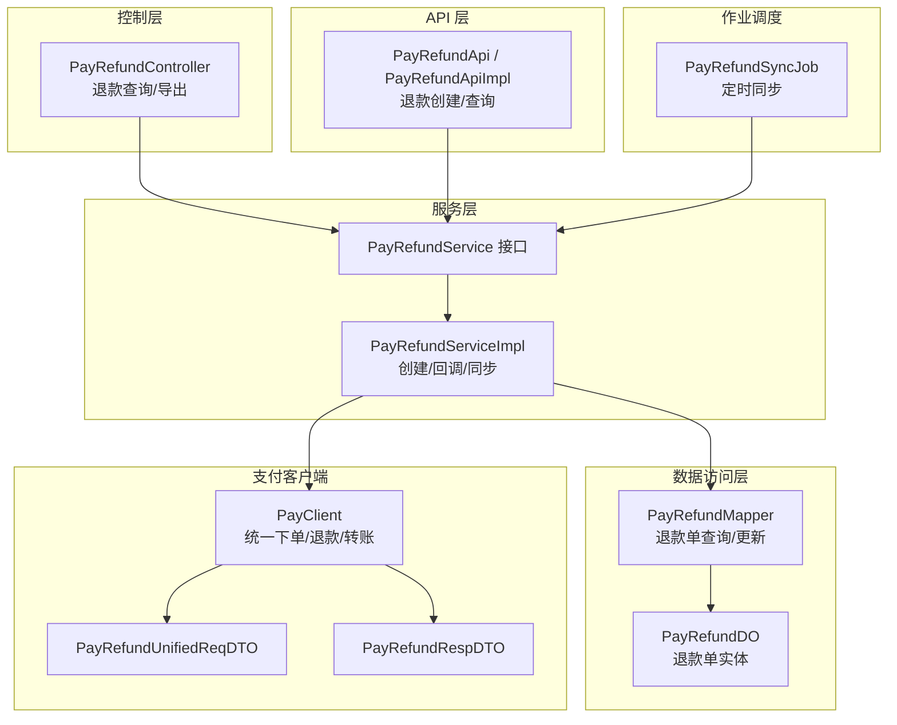
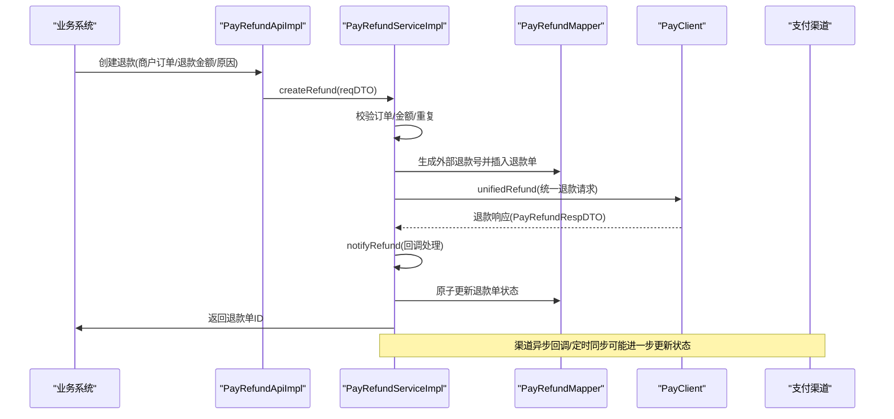
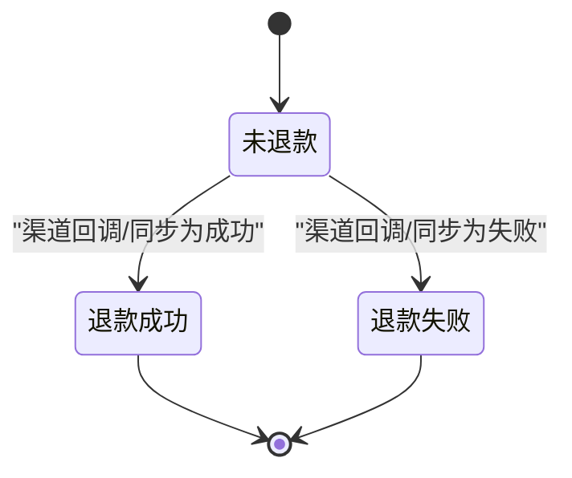
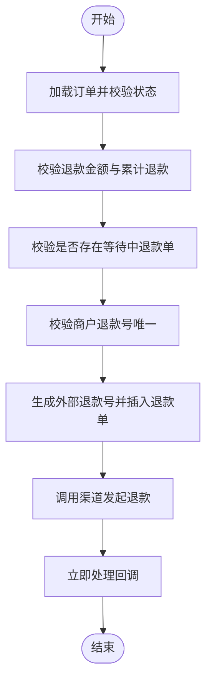
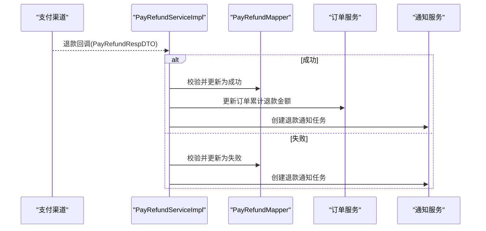
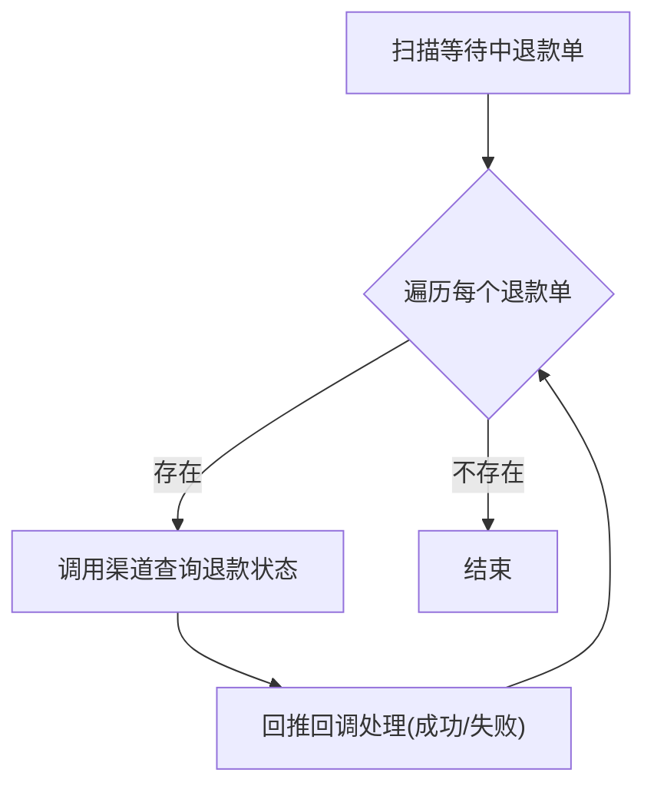
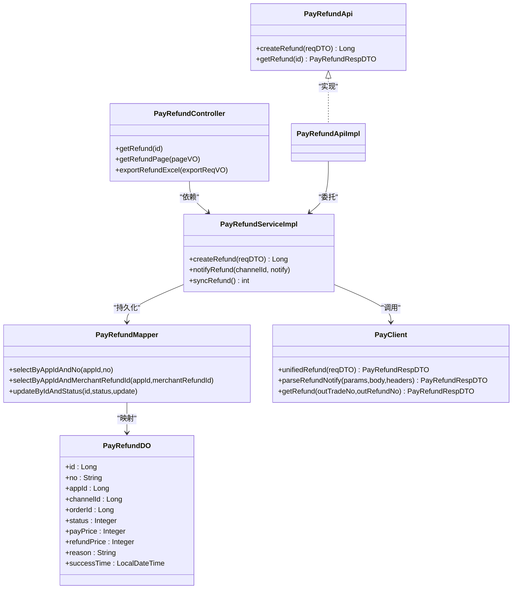
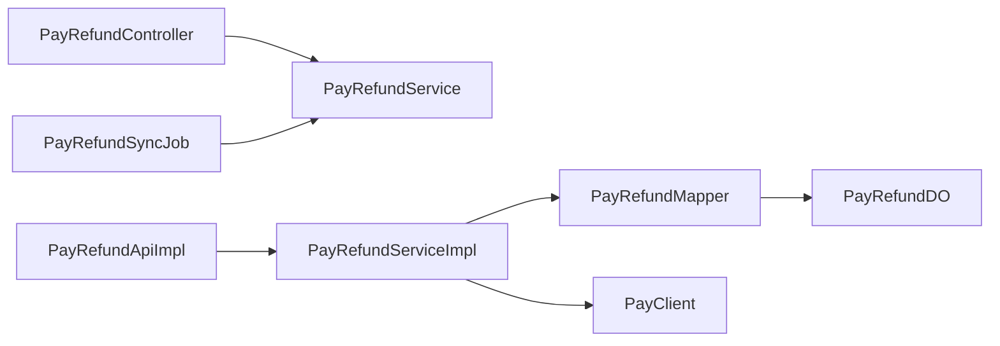

# 退款管理

<cite>
**本文引用的文件**
- [PayRefundStatusEnum.java](file://backend/yudao-module-pay/src/main/java/cn/iocoder/yudao/module/pay/enums/refund/PayRefundStatusEnum.java)
- [PayRefundDO.java](file://backend/yudao-module-pay/src/main/java/cn/iocoder/yudao/module/pay/dal/dataobject/refund/PayRefundDO.java)
- [PayRefundService.java](file://backend/yudao-module-pay/src/main/java/cn/iocoder/yudao/module/pay/service/refund/PayRefundService.java)
- [PayRefundServiceImpl.java](file://backend/yudao-module-pay/src/main/java/cn/iocoder/yudao/module/pay/service/refund/PayRefundServiceImpl.java)
- [PayRefundMapper.java](file://backend/yudao-module-pay/src/main/java/cn/iocoder/yudao/module/pay/dal/mysql/refund/PayRefundMapper.java)
- [PayRefundController.java](file://backend/yudao-module-pay/src/main/java/cn/iocoder/yudao/module/pay/controller/admin/refund/PayRefundController.java)
- [PayRefundApi.java](file://backend/yudao-module-pay/src/main/java/cn/iocoder/yudao/module/pay/api/refund/PayRefundApi.java)
- [PayRefundApiImpl.java](file://backend/yudao-module-pay/src/main/java/cn/iocoder/yudao/module/pay/api/refund/PayRefundApiImpl.java)
- [PayRefundCreateReqDTO.java](file://backend/yudao-module-pay/src/main/java/cn/iocoder/yudao/module/pay/api/refund/dto/PayRefundCreateReqDTO.java)
- [PayRefundUnifiedReqDTO.java](file://backend/yudao-module-pay/src/main/java/cn/iocoder/yudao/module/pay/framework/pay/core/client/dto/refund/PayRefundUnifiedReqDTO.java)
- [PayRefundRespDTO.java](file://backend/yudao-module-pay/src/main/java/cn/iocoder/yudao/module/pay/framework/pay/core/client/dto/refund/PayRefundRespDTO.java)
- [PayClient.java](file://backend/yudao-module-pay/src/main/java/cn/iocoder/yudao/module/pay/framework/pay/core/client/PayClient.java)
- [PayRefundSyncJob.java](file://backend/yudao-module-pay/src/main/java/cn/iocoder/yudao/module/pay/job/refund/PayRefundSyncJob.java)
- [PayRefundServiceTest.java](file://backend/yudao-module-pay/src/test/java/cn/iocoder/yudao/module/pay/service/refund/PayRefundServiceTest.java)
</cite>

## 目录
1. [简介](#简介)
2. [项目结构](#项目结构)
3. [核心组件](#核心组件)
4. [架构总览](#架构总览)
5. [详细组件分析](#详细组件分析)
6. [依赖关系分析](#依赖关系分析)
7. [性能考量](#性能考量)
8. [故障排查指南](#故障排查指南)
9. [结论](#结论)
10. [附录](#附录)

## 简介
本文件系统性梳理“退款管理”的设计与实现，覆盖退款申请、审核、执行、查询、对账与异常处理全流程。重点包括：
- 退款状态机（申请中、审核通过、退款中、退款成功、退款失败）
- 退款规则与金额控制（部分退款、重复退款防护）
- 与支付渠道的对接、异步回调处理与资金回退机制
- 退款接口设计、风控检查与重复退款防护
- 退款对账与补偿机制（定时同步）

## 项目结构
退款能力主要位于支付模块（yudao-module-pay），采用分层架构：
- 控制层：对外暴露退款查询与导出接口
- API 层：面向业务系统的退款创建与查询
- 服务层：核心业务逻辑（创建、回调处理、同步）
- 数据访问层：退款单持久化与查询
- 支付客户端：抽象支付渠道能力（下单、退款、转账）
- 作业调度：定时同步退款状态

图表来源
- [PayRefundController.java:1-91](file://backend/yudao-module-pay/src/main/java/cn/iocoder/yudao/module/pay/controller/admin/refund/PayRefundController.java#L1-L91)
- [PayRefundApiImpl.java:1-35](file://backend/yudao-module-pay/src/main/java/cn/iocoder/yudao/module/pay/api/refund/PayRefundApiImpl.java#L1-L35)
- [PayRefundServiceImpl.java:1-332](file://backend/yudao-module-pay/src/main/java/cn/iocoder/yudao/module/pay/service/refund/PayRefundServiceImpl.java#L1-L332)
- [PayRefundMapper.java:1-79](file://backend/yudao-module-pay/src/main/java/cn/iocoder/yudao/module/pay/dal/mysql/refund/PayRefundMapper.java#L1-L79)
- [PayRefundDO.java:1-170](file://backend/yudao-module-pay/src/main/java/cn/iocoder/yudao/module/pay/dal/dataobject/refund/PayRefundDO.java#L1-L170)
- [PayClient.java:1-119](file://backend/yudao-module-pay/src/main/java/cn/iocoder/yudao/module/pay/framework/pay/core/client/PayClient.java#L1-L119)
- [PayRefundSyncJob.java:1-32](file://backend/yudao-module-pay/src/main/java/cn/iocoder/yudao/module/pay/job/refund/PayRefundSyncJob.java#L1-L32)

章节来源
- [PayRefundController.java:1-91](file://backend/yudao-module-pay/src/main/java/cn/iocoder/yudao/module/pay/controller/admin/refund/PayRefundController.java#L1-L91)
- [PayRefundApiImpl.java:1-35](file://backend/yudao-module-pay/src/main/java/cn/iocoder/yudao/module/pay/api/refund/PayRefundApiImpl.java#L1-L35)
- [PayRefundServiceImpl.java:1-332](file://backend/yudao-module-pay/src/main/java/cn/iocoder/yudao/module/pay/service/refund/PayRefundServiceImpl.java#L1-L332)
- [PayRefundMapper.java:1-79](file://backend/yudao-module-pay/src/main/java/cn/iocoder/yudao/module/pay/dal/mysql/refund/PayRefundMapper.java#L1-L79)
- [PayRefundDO.java:1-170](file://backend/yudao-module-pay/src/main/java/cn/iocoder/yudao/module/pay/dal/dataobject/refund/PayRefundDO.java#L1-L170)
- [PayClient.java:1-119](file://backend/yudao-module-pay/src/main/java/cn/iocoder/yudao/module/pay/framework/pay/core/client/PayClient.java#L1-L119)
- [PayRefundSyncJob.java:1-32](file://backend/yudao-module-pay/src/main/java/cn/iocoder/yudao/module/pay/job/refund/PayRefundSyncJob.java#L1-L32)

## 核心组件
- 退款状态枚举：定义“未退款/退款成功/退款失败”三种状态，提供状态判断工具方法
- 退款单实体：承载退款单的完整信息，包括应用/渠道/订单关联、金额、状态、渠道返回等
- 退款服务接口与实现：负责创建退款、处理渠道回调、定时同步状态
- 退款映射器：提供按应用、商户号、状态等维度的查询与更新
- 控制器与 API：对外提供退款查询、分页、导出以及创建退款的能力
- 支付客户端：抽象各支付渠道的统一退款能力（下单、回调解析、查询）

章节来源
- [PayRefundStatusEnum.java:1-33](file://backend/yudao-module-pay/src/main/java/cn/iocoder/yudao/module/pay/enums/refund/PayRefundStatusEnum.java#L1-L33)
- [PayRefundDO.java:1-170](file://backend/yudao-module-pay/src/main/java/cn/iocoder/yudao/module/pay/dal/dataobject/refund/PayRefundDO.java#L1-L170)
- [PayRefundService.java:1-83](file://backend/yudao-module-pay/src/main/java/cn/iocoder/yudao/module/pay/service/refund/PayRefundService.java#L1-L83)
- [PayRefundServiceImpl.java:1-332](file://backend/yudao-module-pay/src/main/java/cn/iocoder/yudao/module/pay/service/refund/PayRefundServiceImpl.java#L1-L332)
- [PayRefundMapper.java:1-79](file://backend/yudao-module-pay/src/main/java/cn/iocoder/yudao/module/pay/dal/mysql/refund/PayRefundMapper.java#L1-L79)
- [PayRefundController.java:1-91](file://backend/yudao-module-pay/src/main/java/cn/iocoder/yudao/module/pay/controller/admin/refund/PayRefundController.java#L1-L91)
- [PayRefundApi.java:1-32](file://backend/yudao-module-pay/src/main/java/cn/iocoder/yudao/module/pay/api/refund/PayRefundApi.java#L1-L32)
- [PayRefundApiImpl.java:1-35](file://backend/yudao-module-pay/src/main/java/cn/iocoder/yudao/module/pay/api/refund/PayRefundApiImpl.java#L1-L35)
- [PayClient.java:1-119](file://backend/yudao-module-pay/src/main/java/cn/iocoder/yudao/module/pay/framework/pay/core/client/PayClient.java#L1-L119)

## 架构总览
退款流程围绕“创建—回调—同步—对账”的闭环展开：
- 创建阶段：校验订单状态与金额、生成外部退款号、调用支付渠道发起退款，并立即尝试处理回调
- 回调阶段：接收渠道异步通知，原子性更新退款单状态，触发订单退款金额更新与通知任务
- 同步阶段：定时任务扫描“等待中”退款单，主动向渠道查询并回推状态
- 对账阶段：基于回调与同步结果，结合订单退款金额进行核对

图表来源
- [PayRefundApiImpl.java:1-35](file://backend/yudao-module-pay/src/main/java/cn/iocoder/yudao/module/pay/api/refund/PayRefundApiImpl.java#L1-L35)
- [PayRefundServiceImpl.java:92-147](file://backend/yudao-module-pay/src/main/java/cn/iocoder/yudao/module/pay/service/refund/PayRefundServiceImpl.java#L92-L147)
- [PayRefundMapper.java:1-79](file://backend/yudao-module-pay/src/main/java/cn/iocoder/yudao/module/pay/dal/mysql/refund/PayRefundMapper.java#L1-L79)
- [PayClient.java:69-88](file://backend/yudao-module-pay/src/main/java/cn/iocoder/yudao/module/pay/framework/pay/core/client/PayClient.java#L69-L88)

## 详细组件分析

### 退款状态机与流转
- 状态定义：未退款、退款成功、退款失败
- 流转规则：
  - 未退款 → 退款成功 或 未退款 → 退款失败
  - 已成功/失败不可逆；回调处理中严格校验“等待中”状态，避免并发更新导致的重复处理

图表来源
- [PayRefundStatusEnum.java:1-33](file://backend/yudao-module-pay/src/main/java/cn/iocoder/yudao/module/pay/enums/refund/PayRefundStatusEnum.java#L1-L33)
- [PayRefundServiceImpl.java:202-213](file://backend/yudao-module-pay/src/main/java/cn/iocoder/yudao/module/pay/service/refund/PayRefundServiceImpl.java#L202-L213)

章节来源
- [PayRefundStatusEnum.java:1-33](file://backend/yudao-module-pay/src/main/java/cn/iocoder/yudao/module/pay/enums/refund/PayRefundStatusEnum.java#L1-L33)
- [PayRefundServiceImpl.java:202-213](file://backend/yudao-module-pay/src/main/java/cn/iocoder/yudao/module/pay/service/refund/PayRefundServiceImpl.java#L202-L213)

### 退款申请与规则校验
- 校验要点：
  - 订单存在且状态允许退款（已支付或已退款）
  - 退款金额不超过支付金额，且加上历史退款金额不超过订单金额
  - 同一订单同一应用下不存在“等待中”状态的退款单
  - 商户退款号唯一性校验
- 金额与状态：
  - 保存支付金额与退款金额
  - 初始状态为“未退款”

图表来源
- [PayRefundServiceImpl.java:92-147](file://backend/yudao-module-pay/src/main/java/cn/iocoder/yudao/module/pay/service/refund/PayRefundServiceImpl.java#L92-L147)
- [PayRefundServiceImpl.java:155-175](file://backend/yudao-module-pay/src/main/java/cn/iocoder/yudao/module/pay/service/refund/PayRefundServiceImpl.java#L155-L175)
- [PayRefundMapper.java:21-32](file://backend/yudao-module-pay/src/main/java/cn/iocoder/yudao/module/pay/dal/mysql/refund/PayRefundMapper.java#L21-L32)

章节来源
- [PayRefundServiceImpl.java:92-147](file://backend/yudao-module-pay/src/main/java/cn/iocoder/yudao/module/pay/service/refund/PayRefundServiceImpl.java#L92-L147)
- [PayRefundServiceImpl.java:155-175](file://backend/yudao-module-pay/src/main/java/cn/iocoder/yudao/module/pay/service/refund/PayRefundServiceImpl.java#L155-L175)
- [PayRefundMapper.java:21-32](file://backend/yudao-module-pay/src/main/java/cn/iocoder/yudao/module/pay/dal/mysql/refund/PayRefundMapper.java#L21-L32)

### 回调处理与资金回退
- 成功回调：
  - 校验退款单存在且状态为“等待中”
  - 原子更新：成功时间、渠道退款号、状态、渠道通知原始数据
  - 更新订单累计退款金额
  - 触发退款通知任务
- 失败回调：
  - 校验退款单存在且状态为“等待中”
  - 原子更新：渠道退款号、状态、错误码/错误信息、渠道通知原始数据
  - 触发退款通知任务

图表来源
- [PayRefundServiceImpl.java:202-278](file://backend/yudao-module-pay/src/main/java/cn/iocoder/yudao/module/pay/service/refund/PayRefundServiceImpl.java#L202-L278)
- [PayRefundServiceImpl.java:215-247](file://backend/yudao-module-pay/src/main/java/cn/iocoder/yudao/module/pay/service/refund/PayRefundServiceImpl.java#L215-L247)
- [PayRefundServiceImpl.java:249-278](file://backend/yudao-module-pay/src/main/java/cn/iocoder/yudao/module/pay/service/refund/PayRefundServiceImpl.java#L249-L278)

章节来源
- [PayRefundServiceImpl.java:202-278](file://backend/yudao-module-pay/src/main/java/cn/iocoder/yudao/module/pay/service/refund/PayRefundServiceImpl.java#L202-L278)

### 定时同步与对账补偿
- 同步策略：
  - 扫描“等待中”退款单
  - 逐个调用渠道查询退款状态
  - 将查询结果回推至回调处理逻辑，确保最终一致性
- 作业调度：
  - 定时任务执行同步，统计同步到成功/失败的退款单数量

图表来源
- [PayRefundServiceImpl.java:280-320](file://backend/yudao-module-pay/src/main/java/cn/iocoder/yudao/module/pay/service/refund/PayRefundServiceImpl.java#L280-L320)
- [PayRefundSyncJob.java:1-32](file://backend/yudao-module-pay/src/main/java/cn/iocoder/yudao/module/pay/job/refund/PayRefundSyncJob.java#L1-L32)

章节来源
- [PayRefundServiceImpl.java:280-320](file://backend/yudao-module-pay/src/main/java/cn/iocoder/yudao/module/pay/service/refund/PayRefundServiceImpl.java#L280-L320)
- [PayRefundSyncJob.java:1-32](file://backend/yudao-module-pay/src/main/java/cn/iocoder/yudao/module/pay/job/refund/PayRefundSyncJob.java#L1-L32)

### 接口设计与数据模型
- 控制层接口：
  - 获取退款详情
  - 分页查询退款单
  - 导出退款单 Excel
- API 接口：
  - 创建退款单
  - 查询退款单
- 数据模型：
  - 退款单实体包含应用/渠道/订单关联、金额、状态、渠道返回等字段

图表来源
- [PayRefundController.java:1-91](file://backend/yudao-module-pay/src/main/java/cn/iocoder/yudao/module/pay/controller/admin/refund/PayRefundController.java#L1-L91)
- [PayRefundApi.java:1-32](file://backend/yudao-module-pay/src/main/java/cn/iocoder/yudao/module/pay/api/refund/PayRefundApi.java#L1-L32)
- [PayRefundApiImpl.java:1-35](file://backend/yudao-module-pay/src/main/java/cn/iocoder/yudao/module/pay/api/refund/PayRefundApiImpl.java#L1-L35)
- [PayRefundServiceImpl.java:1-332](file://backend/yudao-module-pay/src/main/java/cn/iocoder/yudao/module/pay/service/refund/PayRefundServiceImpl.java#L1-L332)
- [PayRefundDO.java:1-170](file://backend/yudao-module-pay/src/main/java/cn/iocoder/yudao/module/pay/dal/dataobject/refund/PayRefundDO.java#L1-L170)
- [PayRefundMapper.java:1-79](file://backend/yudao-module-pay/src/main/java/cn/iocoder/yudao/module/pay/dal/mysql/refund/PayRefundMapper.java#L1-L79)
- [PayClient.java:1-119](file://backend/yudao-module-pay/src/main/java/cn/iocoder/yudao/module/pay/framework/pay/core/client/PayClient.java#L1-L119)

章节来源
- [PayRefundController.java:1-91](file://backend/yudao-module-pay/src/main/java/cn/iocoder/yudao/module/pay/controller/admin/refund/PayRefundController.java#L1-L91)
- [PayRefundApi.java:1-32](file://backend/yudao-module-pay/src/main/java/cn/iocoder/yudao/module/pay/api/refund/PayRefundApi.java#L1-L32)
- [PayRefundApiImpl.java:1-35](file://backend/yudao-module-pay/src/main/java/cn/iocoder/yudao/module/pay/api/refund/PayRefundApiImpl.java#L1-L35)
- [PayRefundServiceImpl.java:1-332](file://backend/yudao-module-pay/src/main/java/cn/iocoder/yudao/module/pay/service/refund/PayRefundServiceImpl.java#L1-L332)
- [PayRefundDO.java:1-170](file://backend/yudao-module-pay/src/main/java/cn/iocoder/yudao/module/pay/dal/dataobject/refund/PayRefundDO.java#L1-L170)
- [PayRefundMapper.java:1-79](file://backend/yudao-module-pay/src/main/java/cn/iocoder/yudao/module/pay/dal/mysql/refund/PayRefundMapper.java#L1-L79)
- [PayClient.java:1-119](file://backend/yudao-module-pay/src/main/java/cn/iocoder/yudao/module/pay/framework/pay/core/client/PayClient.java#L1-L119)

### 退款规则配置与部分退款
- 退款比例与上限：
  - 当前退款实现以“固定金额”为准，不涉及按比例计算
  - 金额校验：退款金额 + 历史退款金额 ≤ 订单支付金额
- 部分退款：
  - 通过传入 price 控制退款金额，支持多次部分退款
- 重复退款防护：
  - 同一订单同一应用下存在“等待中”退款单时禁止重复申请
  - 商户退款号唯一性约束

章节来源
- [PayRefundServiceImpl.java:155-175](file://backend/yudao-module-pay/src/main/java/cn/iocoder/yudao/module/pay/service/refund/PayRefundServiceImpl.java#L155-L175)
- [PayRefundMapper.java:27-32](file://backend/yudao-module-pay/src/main/java/cn/iocoder/yudao/module/pay/dal/mysql/refund/PayRefundMapper.java#L27-L32)
- [PayRefundCreateReqDTO.java:1-71](file://backend/yudao-module-pay/src/main/java/cn/iocoder/yudao/module/pay/api/refund/dto/PayRefundCreateReqDTO.java#L1-L71)

### 与支付渠道的对接
- 统一退款请求：
  - 包含外部订单号、外部退款号、退款原因、支付金额、退款金额、回调地址
- 渠道回调解析：
  - 提供统一的回调解析方法，输出退款状态、渠道退款号、成功时间、原始数据、错误码/错误信息
- 查询退款：
  - 支持按外部订单号与外部退款号查询渠道侧退款状态

章节来源
- [PayRefundUnifiedReqDTO.java:1-69](file://backend/yudao-module-pay/src/main/java/cn/iocoder/yudao/module/pay/framework/pay/core/client/dto/refund/PayRefundUnifiedReqDTO.java#L1-L69)
- [PayRefundRespDTO.java:1-60](file://backend/yudao-module-pay/src/main/java/cn/iocoder/yudao/module/pay/framework/pay/core/client/dto/refund/PayRefundRespDTO.java#L1-L60)
- [PayClient.java:69-88](file://backend/yudao-module-pay/src/main/java/cn/iocoder/yudao/module/pay/framework/pay/core/client/PayClient.java#L69-L88)

### 风控检查与重复退款防护
- 重复退款防护：
  - 同一订单同一应用下存在“等待中”退款单时拒绝新申请
  - 商户退款号唯一性校验
- 风控检查：
  - 本模块未内置风控检查；可在业务层扩展风控策略（如黑名单、频率限制等）

章节来源
- [PayRefundServiceImpl.java:92-110](file://backend/yudao-module-pay/src/main/java/cn/iocoder/yudao/module/pay/service/refund/PayRefundServiceImpl.java#L92-L110)
- [PayRefundServiceImpl.java:169-174](file://backend/yudao-module-pay/src/main/java/cn/iocoder/yudao/module/pay/service/refund/PayRefundServiceImpl.java#L169-L174)
- [PayRefundMapper.java:21-32](file://backend/yudao-module-pay/src/main/java/cn/iocoder/yudao/module/pay/dal/mysql/refund/PayRefundMapper.java#L21-L32)

### 退款通知与对账
- 通知机制：
  - 成功/失败回调后均创建退款通知任务，便于后续通知业务系统
- 对账建议：
  - 结合回调与定时同步结果，核对退款单状态与订单累计退款金额
  - 对于异常状态（如长时间未回调），依赖定时同步兜底

章节来源
- [PayRefundServiceImpl.java:244-246](file://backend/yudao-module-pay/src/main/java/cn/iocoder/yudao/module/pay/service/refund/PayRefundServiceImpl.java#L244-L246)
- [PayRefundServiceImpl.java:275-277](file://backend/yudao-module-pay/src/main/java/cn/iocoder/yudao/module/pay/service/refund/PayRefundServiceImpl.java#L275-L277)

## 依赖关系分析
- 控制层依赖服务接口
- API 层委托服务实现
- 服务实现依赖映射器与支付客户端
- 映射器操作退款单实体
- 作业调度依赖服务接口进行定时同步

图表来源
- [PayRefundController.java:1-91](file://backend/yudao-module-pay/src/main/java/cn/iocoder/yudao/module/pay/controller/admin/refund/PayRefundController.java#L1-L91)
- [PayRefundApiImpl.java:1-35](file://backend/yudao-module-pay/src/main/java/cn/iocoder/yudao/module/pay/api/refund/PayRefundApiImpl.java#L1-L35)
- [PayRefundServiceImpl.java:1-332](file://backend/yudao-module-pay/src/main/java/cn/iocoder/yudao/module/pay/service/refund/PayRefundServiceImpl.java#L1-L332)
- [PayRefundMapper.java:1-79](file://backend/yudao-module-pay/src/main/java/cn/iocoder/yudao/module/pay/dal/mysql/refund/PayRefundMapper.java#L1-L79)
- [PayRefundDO.java:1-170](file://backend/yudao-module-pay/src/main/java/cn/iocoder/yudao/module/pay/dal/dataobject/refund/PayRefundDO.java#L1-L170)
- [PayRefundSyncJob.java:1-32](file://backend/yudao-module-pay/src/main/java/cn/iocoder/yudao/module/pay/job/refund/PayRefundSyncJob.java#L1-L32)

章节来源
- [PayRefundController.java:1-91](file://backend/yudao-module-pay/src/main/java/cn/iocoder/yudao/module/pay/controller/admin/refund/PayRefundController.java#L1-L91)
- [PayRefundApiImpl.java:1-35](file://backend/yudao-module-pay/src/main/java/cn/iocoder/yudao/module/pay/api/refund/PayRefundApiImpl.java#L1-L35)
- [PayRefundServiceImpl.java:1-332](file://backend/yudao-module-pay/src/main/java/cn/iocoder/yudao/module/pay/service/refund/PayRefundServiceImpl.java#L1-L332)
- [PayRefundMapper.java:1-79](file://backend/yudao-module-pay/src/main/java/cn/iocoder/yudao/module/pay/dal/mysql/refund/PayRefundMapper.java#L1-L79)
- [PayRefundDO.java:1-170](file://backend/yudao-module-pay/src/main/java/cn/iocoder/yudao/module/pay/dal/dataobject/refund/PayRefundDO.java#L1-L170)
- [PayRefundSyncJob.java:1-32](file://backend/yudao-module-pay/src/main/java/cn/iocoder/yudao/module/pay/job/refund/PayRefundSyncJob.java#L1-L32)

## 性能考量
- 原子更新：回调处理采用“按 ID + 状态”条件更新，避免并发覆盖
- 异常容错：创建退款时若渠道调用异常，不阻塞流程，依赖回调或定时同步兜底
- 定时同步：对“等待中”退款单进行批量扫描与查询，降低漏单风险
- 查询优化：提供按应用、渠道编码、商户号、状态、时间范围的分页与导出查询

章节来源
- [PayRefundServiceImpl.java:235-238](file://backend/yudao-module-pay/src/main/java/cn/iocoder/yudao/module/pay/service/refund/PayRefundServiceImpl.java#L235-L238)
- [PayRefundServiceImpl.java:137-143](file://backend/yudao-module-pay/src/main/java/cn/iocoder/yudao/module/pay/service/refund/PayRefundServiceImpl.java#L137-L143)
- [PayRefundServiceImpl.java:280-320](file://backend/yudao-module-pay/src/main/java/cn/iocoder/yudao/module/pay/service/refund/PayRefundServiceImpl.java#L280-L320)
- [PayRefundMapper.java:49-72](file://backend/yudao-module-pay/src/main/java/cn/iocoder/yudao/module/pay/dal/mysql/refund/PayRefundMapper.java#L49-L72)

## 故障排查指南
- 退款单不存在：
  - 回调处理时若找不到退款单，抛出“退款单不存在”异常
- 状态非等待中：
  - 若退款单状态已非“等待中”，回调处理抛出“状态不为等待中”异常
- 重复退款：
  - 同一订单同一应用存在“等待中”退款单时，拒绝新申请
  - 商户退款号重复时，抛出“退款已存在”异常
- 定时同步无效：
  - 若渠道客户端缺失或查询异常，日志记录错误并跳过该退款单

章节来源
- [PayRefundServiceImpl.java:217-228](file://backend/yudao-module-pay/src/main/java/cn/iocoder/yudao/module/pay/service/refund/PayRefundServiceImpl.java#L217-L228)
- [PayRefundServiceImpl.java:251-262](file://backend/yudao-module-pay/src/main/java/cn/iocoder/yudao/module/pay/service/refund/PayRefundServiceImpl.java#L251-L262)
- [PayRefundServiceImpl.java:105-110](file://backend/yudao-module-pay/src/main/java/cn/iocoder/yudao/module/pay/service/refund/PayRefundServiceImpl.java#L105-L110)
- [PayRefundServiceImpl.java:304-319](file://backend/yudao-module-pay/src/main/java/cn/iocoder/yudao/module/pay/service/refund/PayRefundServiceImpl.java#L304-L319)
- [PayRefundServiceTest.java:462-471](file://backend/yudao-module-pay/src/test/java/cn/iocoder/yudao/module/pay/service/refund/PayRefundServiceTest.java#L462-L471)
- [PayRefundServiceTest.java:584-597](file://backend/yudao-module-pay/src/test/java/cn/iocoder/yudao/module/pay/service/refund/PayRefundServiceTest.java#L584-L597)

## 结论
退款管理模块通过“创建—回调—同步—对账”的闭环设计，实现了与支付渠道的稳定对接与高可用保障。其核心特性包括：
- 明确的状态机与严格的并发控制
- 金额与重复退款的双重校验
- 回调与定时同步的双通道兜底
- 清晰的接口与数据模型，便于扩展与集成

## 附录
- 退款接口清单（控制层）
  - GET /pay/refund/get：获取退款详情
  - GET /pay/refund/page：分页查询退款单
  - GET /pay/refund/export-excel：导出退款单 Excel
- 退款接口清单（API 层）
  - POST 创建退款单
  - GET 查询退款单

章节来源
- [PayRefundController.java:46-88](file://backend/yudao-module-pay/src/main/java/cn/iocoder/yudao/module/pay/controller/admin/refund/PayRefundController.java#L46-L88)
- [PayRefundApi.java:15-29](file://backend/yudao-module-pay/src/main/java/cn/iocoder/yudao/module/pay/api/refund/PayRefundApi.java#L15-L29)