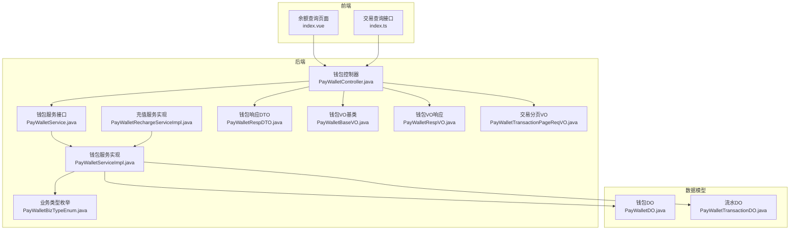
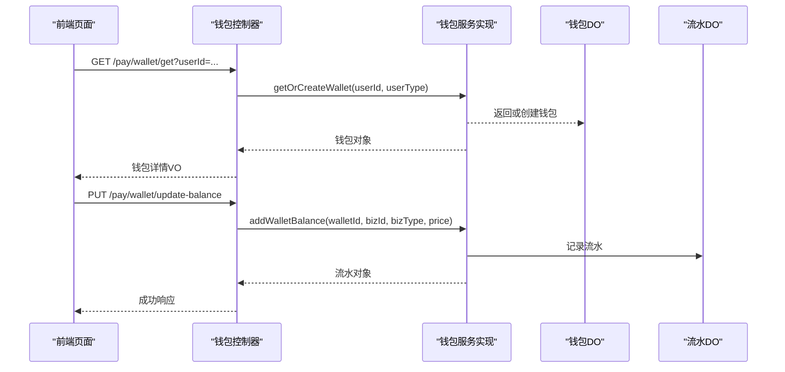
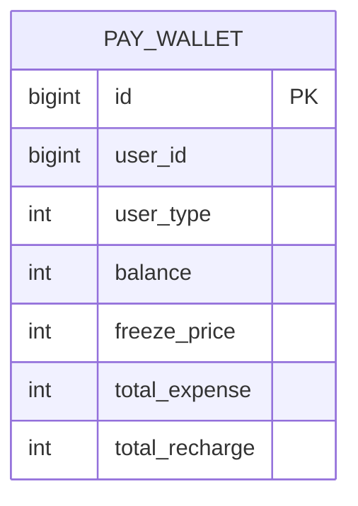
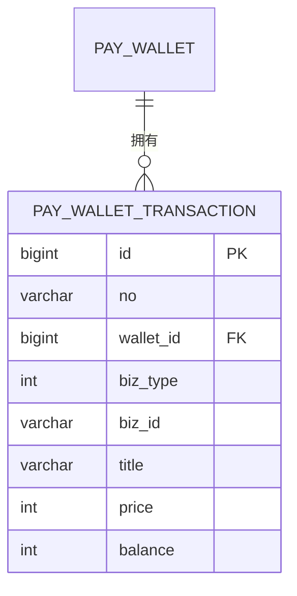
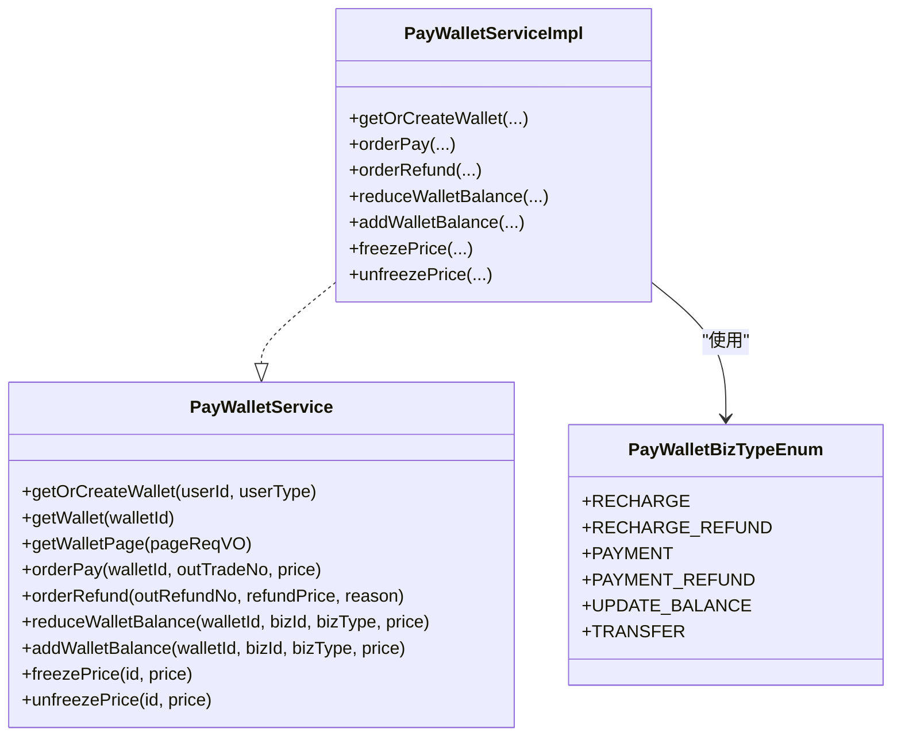
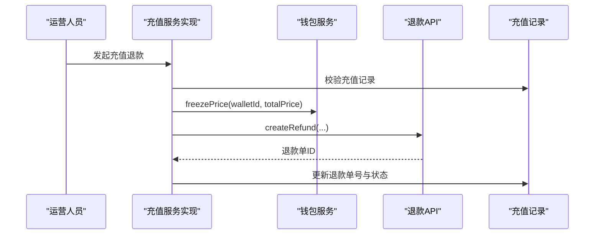
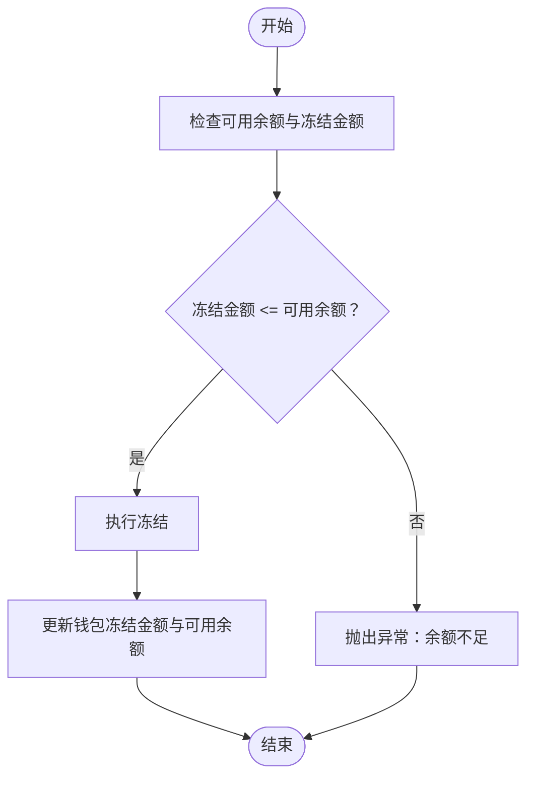
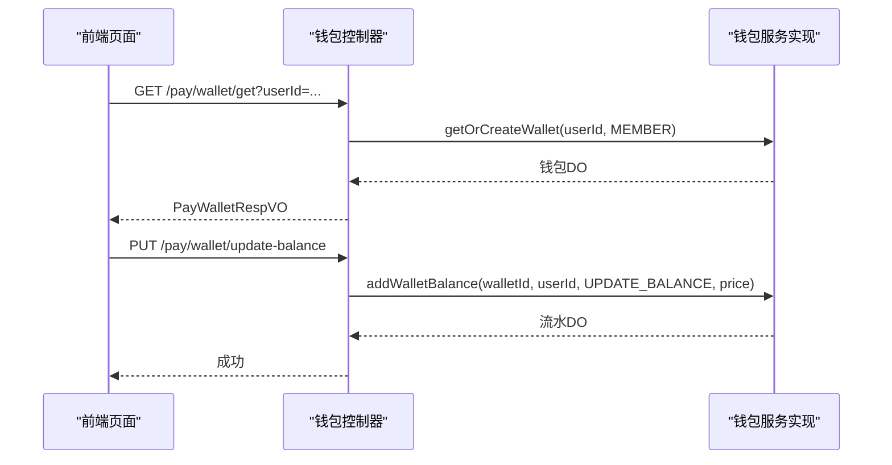
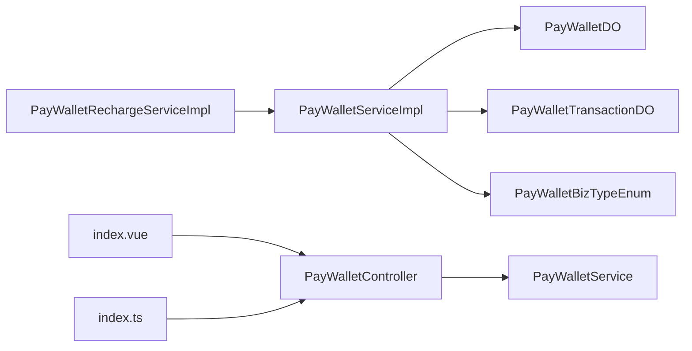

# 钱包管理

<cite>
**本文引用的文件**
- [PayWalletDO.java](file://backend/yudao-module-pay/src/main/java/cn/iocoder/yudao/module/pay/dal/dataobject/wallet/PayWalletDO.java)
- [PayWalletTransactionDO.java](file://backend/yudao-module-pay/src/main/java/cn/iocoder/yudao/module/pay/dal/dataobject/wallet/PayWalletTransactionDO.java)
- [PayWalletService.java](file://backend/yudao-module-pay/src/main/java/cn/iocoder/yudao/module/pay/service/wallet/PayWalletService.java)
- [PayWalletServiceImpl.java](file://backend/yudao-module-pay/src/main/java/cn/iocoder/yudao/module/pay/service/wallet/PayWalletServiceImpl.java)
- [PayWalletBizTypeEnum.java](file://backend/yudao-module-pay/src/main/java/cn/iocoder/yudao/module/pay/enums/wallet/PayWalletBizTypeEnum.java)
- [PayWalletController.java](file://backend/yudao-module-pay/src/main/java/cn/iocoder/yudao/module/pay/controller/admin/wallet/PayWalletController.java)
- [PayWalletRechargeServiceImpl.java](file://backend/yudao-module-pay/src/main/java/cn/iocoder/yudao/module/pay/service/wallet/PayWalletRechargeServiceImpl.java)
- [PayWalletRespDTO.java](file://backend/yudao-module-pay/src/main/java/cn/iocoder/yudao/module/pay/api/wallet/dto/PayWalletRespDTO.java)
- [PayWalletBaseVO.java](file://backend/yudao-module-pay/src/main/java/cn/iocoder/yudao/module/pay/controller/admin/wallet/vo/wallet/PayWalletBaseVO.java)
- [PayWalletRespVO.java](file://backend/yudao-module-pay/src/main/java/cn/iocoder/yudao/module/pay/controller/admin/wallet/vo/wallet/PayWalletRespVO.java)
- [PayWalletTransactionPageReqVO.java](file://backend/yudao-module-pay/src/main/java/cn/iocoder/yudao/module/pay/controller/admin/wallet/vo/transaction/PayWalletTransactionPageReqVO.java)
- [index.vue](file://frontend/admin-vue3/src/views/pay/wallet/balance/index.vue)
- [index.ts](file://frontend/admin-vue3/src/api/pay/wallet/transaction/index.ts)
</cite>

## 目录
1. [简介](#简介)
2. [项目结构](#项目结构)
3. [核心组件](#核心组件)
4. [架构总览](#架构总览)
5. [详细组件分析](#详细组件分析)
6. [依赖关系分析](#依赖关系分析)
7. [性能考虑](#性能考虑)
8. [故障排查指南](#故障排查指南)
9. [结论](#结论)
10. [附录](#附录)

## 简介
本文件系统性梳理并文档化“钱包管理”模块，覆盖会员钱包的余额管理、交易明细、充值与提现流程、冻结与解冻机制；明确钱包账户模型、余额变动记录与流水账单设计；阐述钱包与支付订单的关联关系、资金冻结策略与风险控制要点；提供钱包查询接口、交易记录查询与对账能力，并总结安全机制、异常处理与数据备份等保障措施。

## 项目结构
钱包管理位于后端模块 yudao-module-pay 中，采用典型的分层架构：数据对象层（DO）、服务层（Service）、控制器层（Controller）、前端页面与接口定义。前端使用 admin-vue3 提供管理后台的查询与操作界面。

图表来源
- [PayWalletController.java:1-71](file://backend/yudao-module-pay/src/main/java/cn/iocoder/yudao/module/pay/controller/admin/wallet/PayWalletController.java#L1-L71)
- [PayWalletService.java:1-100](file://backend/yudao-module-pay/src/main/java/cn/iocoder/yudao/module/pay/service/wallet/PayWalletService.java#L1-L100)
- [PayWalletServiceImpl.java](file://backend/yudao-module-pay/src/main/java/cn/iocoder/yudao/module/pay/service/wallet/PayWalletServiceImpl.java)
- [PayWalletBizTypeEnum.java:1-46](file://backend/yudao-module-pay/src/main/java/cn/iocoder/yudao/module/pay/enums/wallet/PayWalletBizTypeEnum.java#L1-L46)
- [PayWalletRechargeServiceImpl.java:197-222](file://backend/yudao-module-pay/src/main/java/cn/iocoder/yudao/module/pay/service/wallet/PayWalletRechargeServiceImpl.java#L197-L222)
- [PayWalletRespDTO.java:1-52](file://backend/yudao-module-pay/src/main/java/cn/iocoder/yudao/module/pay/api/wallet/dto/PayWalletRespDTO.java#L1-L52)
- [PayWalletBaseVO.java:1-39](file://backend/yudao-module-pay/src/main/java/cn/iocoder/yudao/module/pay/controller/admin/wallet/vo/wallet/PayWalletBaseVO.java#L1-L39)
- [PayWalletRespVO.java:1-22](file://backend/yudao-module-pay/src/main/java/cn/iocoder/yudao/module/pay/controller/admin/wallet/vo/wallet/PayWalletRespVO.java#L1-L22)
- [PayWalletTransactionPageReqVO.java:1-23](file://backend/yudao-module-pay/src/main/java/cn/iocoder/yudao/module/pay/controller/admin/wallet/vo/transaction/PayWalletTransactionPageReqVO.java#L1-L23)
- [PayWalletDO.java:1-60](file://backend/yudao-module-pay/src/main/java/cn/iocoder/yudao/module/pay/dal/dataobject/wallet/PayWalletDO.java#L1-L60)
- [PayWalletTransactionDO.java:1-67](file://backend/yudao-module-pay/src/main/java/cn/iocoder/yudao/module/pay/dal/dataobject/wallet/PayWalletTransactionDO.java#L1-L67)
- [index.vue:70-111](file://frontend/admin-vue3/src/views/pay/wallet/balance/index.vue#L70-L111)
- [index.ts:1-14](file://frontend/admin-vue3/src/api/pay/wallet/transaction/index.ts#L1-L14)

章节来源
- [PayWalletController.java:1-71](file://backend/yudao-module-pay/src/main/java/cn/iocoder/yudao/module/pay/controller/admin/wallet/PayWalletController.java#L1-L71)
- [index.vue:70-111](file://frontend/admin-vue3/src/views/pay/wallet/balance/index.vue#L70-L111)
- [index.ts:1-14](file://frontend/admin-vue3/src/api/pay/wallet/transaction/index.ts#L1-L14)

## 核心组件
- 钱包数据对象（PayWalletDO）：承载用户钱包余额、冻结金额、累计充值与支出等核心字段。
- 交易流水数据对象（PayWalletTransactionDO）：记录每次余额变动的流水号、业务类型、业务编号、变动金额与变动后余额。
- 钱包服务接口（PayWalletService）：定义钱包查询、分页、余额变动、冻结/解冻、订单支付与退款等能力。
- 钱包业务类型枚举（PayWalletBizTypeEnum）：统一定义充值、充值退款、支付、支付退款、余额调整、转账等业务类型。
- 钱包控制器（PayWalletController）：对外暴露钱包查询、分页、余额调整等接口。
- 充值服务实现（PayWalletRechargeServiceImpl）：负责充值退款流程中的余额冻结与退款单创建。
- 前端页面与接口：提供钱包余额查询、交易流水查询与分页展示。

章节来源
- [PayWalletDO.java:1-60](file://backend/yudao-module-pay/src/main/java/cn/iocoder/yudao/module/pay/dal/dataobject/wallet/PayWalletDO.java#L1-L60)
- [PayWalletTransactionDO.java:1-67](file://backend/yudao-module-pay/src/main/java/cn/iocoder/yudao/module/pay/dal/dataobject/wallet/PayWalletTransactionDO.java#L1-L67)
- [PayWalletService.java:1-100](file://backend/yudao-module-pay/src/main/java/cn/iocoder/yudao/module/pay/service/wallet/PayWalletService.java#L1-L100)
- [PayWalletBizTypeEnum.java:1-46](file://backend/yudao-module-pay/src/main/java/cn/iocoder/yudao/module/pay/enums/wallet/PayWalletBizTypeEnum.java#L1-L46)
- [PayWalletController.java:1-71](file://backend/yudao-module-pay/src/main/java/cn/iocoder/yudao/module/pay/controller/admin/wallet/PayWalletController.java#L1-L71)
- [PayWalletRechargeServiceImpl.java:197-222](file://backend/yudao-module-pay/src/main/java/cn/iocoder/yudao/module/pay/service/wallet/PayWalletRechargeServiceImpl.java#L197-L222)

## 架构总览
钱包管理遵循“控制器-服务-数据访问”的分层设计，前端通过HTTP接口调用后端控制器，控制器委托服务层执行业务逻辑，服务层与数据对象交互完成余额与流水的持久化。

图表来源
- [PayWalletController.java:37-71](file://backend/yudao-module-pay/src/main/java/cn/iocoder/yudao/module/pay/controller/admin/wallet/PayWalletController.java#L37-L71)
- [PayWalletService.java:68-81](file://backend/yudao-module-pay/src/main/java/cn/iocoder/yudao/module/pay/service/wallet/PayWalletService.java#L68-L81)
- [PayWalletDO.java:1-60](file://backend/yudao-module-pay/src/main/java/cn/iocoder/yudao/module/pay/dal/dataobject/wallet/PayWalletDO.java#L1-L60)
- [PayWalletTransactionDO.java:1-67](file://backend/yudao-module-pay/src/main/java/cn/iocoder/yudao/module/pay/dal/dataobject/wallet/PayWalletTransactionDO.java#L1-L67)

## 详细组件分析

### 钱包账户模型
- 字段说明
  - id：钱包唯一标识
  - userId：用户编号（支持会员与管理员）
  - userType：用户类型（预留多商户场景）
  - balance：可用余额（单位分）
  - freezePrice：冻结金额（单位分）
  - totalExpense：累计支出（单位分）
  - totalRecharge：累计充值（单位分）

图表来源
- [PayWalletDO.java:15-59](file://backend/yudao-module-pay/src/main/java/cn/iocoder/yudao/module/pay/dal/dataobject/wallet/PayWalletDO.java#L15-L59)

章节来源
- [PayWalletDO.java:1-60](file://backend/yudao-module-pay/src/main/java/cn/iocoder/yudao/module/pay/dal/dataobject/wallet/PayWalletDO.java#L1-L60)

### 余额变动记录与流水账单设计
- 流水字段
  - id：流水唯一标识
  - no：流水号
  - walletId：所属钱包
  - bizType：业务类型（来自枚举）
  - bizId：业务编号（如订单号、退款号）
  - title：流水说明
  - price：变动金额（正为增加，负为减少）
  - balance：变动后余额

图表来源
- [PayWalletTransactionDO.java:15-66](file://backend/yudao-module-pay/src/main/java/cn/iocoder/yudao/module/pay/dal/dataobject/wallet/PayWalletTransactionDO.java#L15-L66)

章节来源
- [PayWalletTransactionDO.java:1-67](file://backend/yudao-module-pay/src/main/java/cn/iocoder/yudao/module/pay/dal/dataobject/wallet/PayWalletTransactionDO.java#L1-L67)

### 钱包服务接口与实现
- 关键方法
  - getOrCreateWallet：按用户获取或创建钱包
  - getWalletPage：钱包分页查询
  - orderPay/orderRefund：订单支付与退款（内部触发余额变动与流水）
  - reduceWalletBalance/addWalletBalance：通用扣减/增加余额
  - freezePrice/unfreezePrice：冻结/解冻余额
- 实现要点
  - 余额变动均伴随流水记录
  - 冻结/解冻仅调整冻结金额与可用余额，不产生业务流水
  - 订单退款通过外部退款单集成，确保与支付通道一致

图表来源
- [PayWalletService.java:14-99](file://backend/yudao-module-pay/src/main/java/cn/iocoder/yudao/module/pay/service/wallet/PayWalletService.java#L14-L99)
- [PayWalletServiceImpl.java](file://backend/yudao-module-pay/src/main/java/cn/iocoder/yudao/module/pay/service/wallet/PayWalletServiceImpl.java)
- [PayWalletBizTypeEnum.java:16-23](file://backend/yudao-module-pay/src/main/java/cn/iocoder/yudao/module/pay/enums/wallet/PayWalletBizTypeEnum.java#L16-L23)

章节来源
- [PayWalletService.java:1-100](file://backend/yudao-module-pay/src/main/java/cn/iocoder/yudao/module/pay/service/wallet/PayWalletService.java#L1-L100)

### 充值与提现流程
- 充值退款流程
  - 校验充值记录状态与可退款条件
  - 冻结对应金额（含赠送部分）
  - 创建退款单（对接支付退款通道）
  - 更新充值记录的退款单号与状态
- 提现流程
  - 当前仓库未发现独立“提现申请/审核”接口与实体，建议在业务扩展中新增提现申请单据与审核流程，结合冻结/解冻与外部打款通道实现。

图表来源
- [PayWalletRechargeServiceImpl.java:197-222](file://backend/yudao-module-pay/src/main/java/cn/iocoder/yudao/module/pay/service/wallet/PayWalletRechargeServiceImpl.java#L197-L222)

章节来源
- [PayWalletRechargeServiceImpl.java:197-222](file://backend/yudao-module-pay/src/main/java/cn/iocoder/yudao/module/pay/service/wallet/PayWalletRechargeServiceImpl.java#L197-L222)

### 冻结与解冻机制
- 冻结策略
  - 仅调整钱包冻结金额与可用余额，不产生业务流水
  - 适用于订单占用、风控冻结、提现冻结等场景
- 解冻策略
  - 支持全额/部分解冻
  - 解冻后恢复可用余额
- 风险控制
  - 冻结金额不得超可用余额
  - 冻结与解冻需幂等，避免重复操作

图表来源
- [PayWalletService.java:84-97](file://backend/yudao-module-pay/src/main/java/cn/iocoder/yudao/module/pay/service/wallet/PayWalletService.java#L84-L97)

章节来源
- [PayWalletService.java:84-97](file://backend/yudao-module-pay/src/main/java/cn/iocoder/yudao/module/pay/service/wallet/PayWalletService.java#L84-L97)

### 钱包与支付订单的关联
- 业务类型
  - 支付（PAYMENT）与支付退款（PAYMENT_REFUND）用于订单支付与退款场景
- 关联方式
  - 流水bizId记录订单号或退款号
  - 通过bizType区分业务类型
- 对账
  - 以流水no与bizId作为对账依据，结合业务类型核对变动方向与金额

章节来源
- [PayWalletBizTypeEnum.java:18-23](file://backend/yudao-module-pay/src/main/java/cn/iocoder/yudao/module/pay/enums/wallet/PayWalletBizTypeEnum.java#L18-L23)
- [PayWalletTransactionDO.java:42-48](file://backend/yudao-module-pay/src/main/java/cn/iocoder/yudao/module/pay/dal/dataobject/wallet/PayWalletTransactionDO.java#L42-L48)

### 钱包查询与交易查询接口
- 钱包查询
  - GET /pay/wallet/get：按用户查询钱包详情
  - GET /pay/wallet/page：钱包分页查询
- 余额调整
  - PUT /pay/wallet/update-balance：管理员手动调整余额（业务类型为UPDATE_BALANCE）
- 交易查询
  - 前端提供交易分页查询接口，支持按钱包/用户/用户类型筛选

图表来源
- [PayWalletController.java:37-71](file://backend/yudao-module-pay/src/main/java/cn/iocoder/yudao/module/pay/controller/admin/wallet/PayWalletController.java#L37-L71)
- [PayWalletRespDTO.java:1-52](file://backend/yudao-module-pay/src/main/java/cn/iocoder/yudao/module/pay/api/wallet/dto/PayWalletRespDTO.java#L1-L52)
- [PayWalletBaseVO.java:15-39](file://backend/yudao-module-pay/src/main/java/cn/iocoder/yudao/module/pay/controller/admin/wallet/vo/wallet/PayWalletBaseVO.java#L15-L39)
- [PayWalletRespVO.java:14-22](file://backend/yudao-module-pay/src/main/java/cn/iocoder/yudao/module/pay/controller/admin/wallet/vo/wallet/PayWalletRespVO.java#L14-L22)

章节来源
- [PayWalletController.java:1-71](file://backend/yudao-module-pay/src/main/java/cn/iocoder/yudao/module/pay/controller/admin/wallet/PayWalletController.java#L1-L71)
- [PayWalletRespDTO.java:1-52](file://backend/yudao-module-pay/src/main/java/cn/iocoder/yudao/module/pay/api/wallet/dto/PayWalletRespDTO.java#L1-L52)
- [PayWalletBaseVO.java:1-39](file://backend/yudao-module-pay/src/main/java/cn/iocoder/yudao/module/pay/controller/admin/wallet/vo/wallet/PayWalletBaseVO.java#L1-L39)
- [PayWalletRespVO.java:1-22](file://backend/yudao-module-pay/src/main/java/cn/iocoder/yudao/module/pay/controller/admin/wallet/vo/wallet/PayWalletRespVO.java#L1-L22)
- [index.vue:70-111](file://frontend/admin-vue3/src/views/pay/wallet/balance/index.vue#L70-L111)
- [index.ts:11-14](file://frontend/admin-vue3/src/api/pay/wallet/transaction/index.ts#L11-L14)

## 依赖关系分析
- 控制器依赖服务接口，服务实现依赖数据对象与业务类型枚举
- 充值服务实现依赖钱包服务进行余额冻结与流水记录
- 前端页面与接口依赖控制器提供的REST端点

图表来源
- [PayWalletController.java:1-71](file://backend/yudao-module-pay/src/main/java/cn/iocoder/yudao/module/pay/controller/admin/wallet/PayWalletController.java#L1-L71)
- [PayWalletService.java:1-100](file://backend/yudao-module-pay/src/main/java/cn/iocoder/yudao/module/pay/service/wallet/PayWalletService.java#L1-L100)
- [PayWalletServiceImpl.java](file://backend/yudao-module-pay/src/main/java/cn/iocoder/yudao/module/pay/service/wallet/PayWalletServiceImpl.java)
- [PayWalletBizTypeEnum.java:1-46](file://backend/yudao-module-pay/src/main/java/cn/iocoder/yudao/module/pay/enums/wallet/PayWalletBizTypeEnum.java#L1-L46)
- [PayWalletRechargeServiceImpl.java:197-222](file://backend/yudao-module-pay/src/main/java/cn/iocoder/yudao/module/pay/service/wallet/PayWalletRechargeServiceImpl.java#L197-L222)
- [PayWalletDO.java:1-60](file://backend/yudao-module-pay/src/main/java/cn/iocoder/yudao/module/pay/dal/dataobject/wallet/PayWalletDO.java#L1-L60)
- [PayWalletTransactionDO.java:1-67](file://backend/yudao-module-pay/src/main/java/cn/iocoder/yudao/module/pay/dal/dataobject/wallet/PayWalletTransactionDO.java#L1-L67)
- [index.vue:70-111](file://frontend/admin-vue3/src/views/pay/wallet/balance/index.vue#L70-L111)
- [index.ts:1-14](file://frontend/admin-vue3/src/api/pay/wallet/transaction/index.ts#L1-L14)

章节来源
- [PayWalletController.java:1-71](file://backend/yudao-module-pay/src/main/java/cn/iocoder/yudao/module/pay/controller/admin/wallet/PayWalletController.java#L1-L71)
- [PayWalletService.java:1-100](file://backend/yudao-module-pay/src/main/java/cn/iocoder/yudao/module/pay/service/wallet/PayWalletService.java#L1-L100)

## 性能考虑
- 余额与流水的读写分离：高频查询可走索引（userId、walletId），写入批量提交
- 冻结/解冻为内存态变更，避免频繁IO；但需保证事务一致性
- 分页查询：钱包与流水均支持分页，前端按需加载
- 缓存策略：对热点钱包信息可引入Redis缓存，注意与数据库的一致性

## 故障排查指南
- 钱包不存在
  - 现象：查询返回空或抛出异常
  - 处理：调用 getOrCreateWallet 自动创建；若仍失败，检查用户ID与用户类型
- 余额不足
  - 现象：冻结/扣减失败
  - 处理：检查可用余额与冻结金额；确认是否存在并发占用
- 退款异常
  - 现象：充值退款后状态未更新
  - 处理：核对退款单创建结果与充值记录状态更新；检查冻结金额是否正确
- 对账不平
  - 现象：流水与订单不一致
  - 处理：以流水no与bizId为准，核对bizType与price方向

章节来源
- [PayWalletController.java:56-68](file://backend/yudao-module-pay/src/main/java/cn/iocoder/yudao/module/pay/controller/admin/wallet/PayWalletController.java#L56-L68)
- [PayWalletRechargeServiceImpl.java:197-222](file://backend/yudao-module-pay/src/main/java/cn/iocoder/yudao/module/pay/service/wallet/PayWalletRechargeServiceImpl.java#L197-L222)

## 结论
钱包管理模块以清晰的数据模型与严格的业务流程实现了余额管理、流水记录、冻结解冻与充值退款等核心能力。通过统一的业务类型枚举与标准化的流水设计，系统具备良好的可扩展性与可维护性。建议后续完善提现申请与审核流程，并强化对账与风控策略，持续提升安全性与稳定性。

## 附录
- 前端页面与接口
  - 余额查询页面：index.vue
  - 交易查询接口：index.ts
- 关键VO与DTO
  - 钱包VO基类：PayWalletBaseVO
  - 钱包VO响应：PayWalletRespVO
  - 交易分页请求：PayWalletTransactionPageReqVO
  - 钱包响应DTO：PayWalletRespDTO

章节来源
- [index.vue:70-111](file://frontend/admin-vue3/src/views/pay/wallet/balance/index.vue#L70-L111)
- [index.ts:1-14](file://frontend/admin-vue3/src/api/pay/wallet/transaction/index.ts#L1-L14)
- [PayWalletBaseVO.java:1-39](file://backend/yudao-module-pay/src/main/java/cn/iocoder/yudao/module/pay/controller/admin/wallet/vo/wallet/PayWalletBaseVO.java#L1-L39)
- [PayWalletRespVO.java:1-22](file://backend/yudao-module-pay/src/main/java/cn/iocoder/yudao/module/pay/controller/admin/wallet/vo/wallet/PayWalletRespVO.java#L1-L22)
- [PayWalletTransactionPageReqVO.java:1-23](file://backend/yudao-module-pay/src/main/java/cn/iocoder/yudao/module/pay/controller/admin/wallet/vo/transaction/PayWalletTransactionPageReqVO.java#L1-L23)
- [PayWalletRespDTO.java:1-52](file://backend/yudao-module-pay/src/main/java/cn/iocoder/yudao/module/pay/api/wallet/dto/PayWalletRespDTO.java#L1-L52)