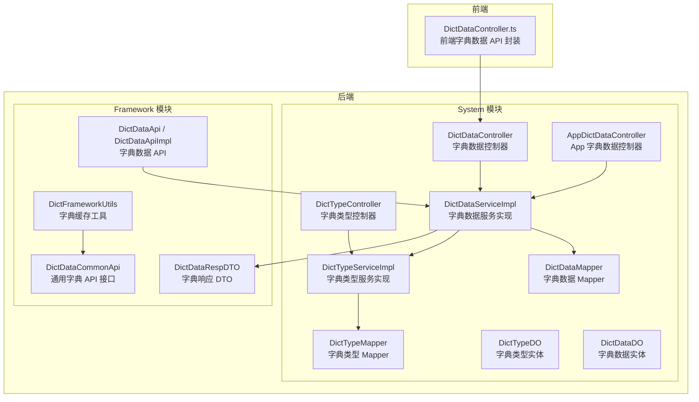
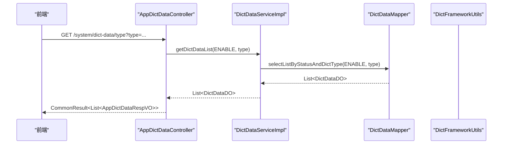
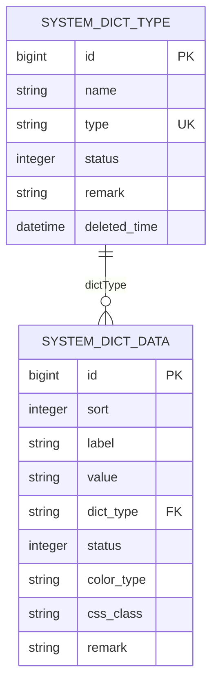
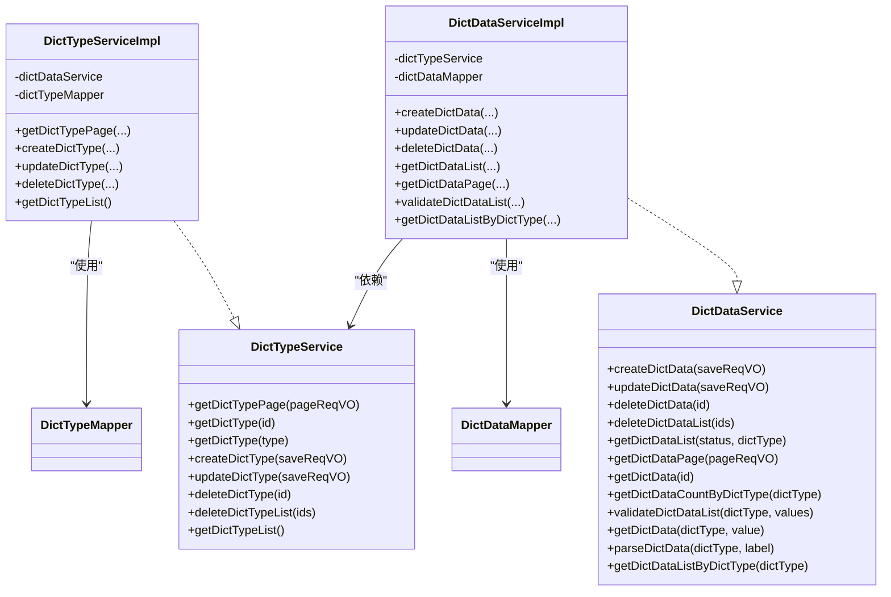
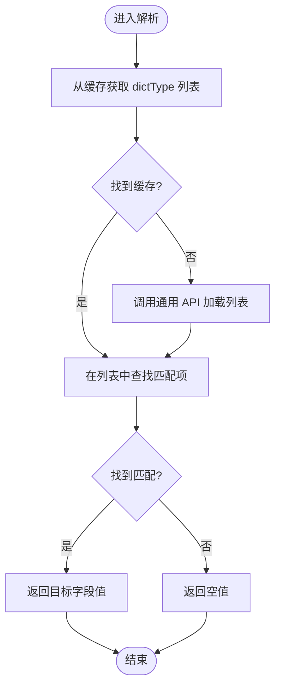
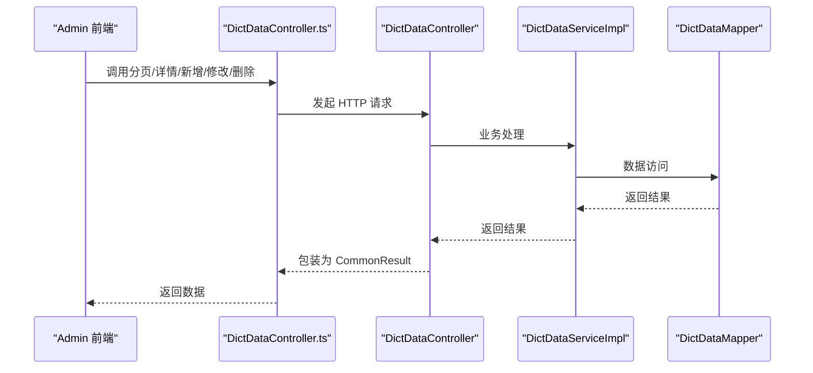
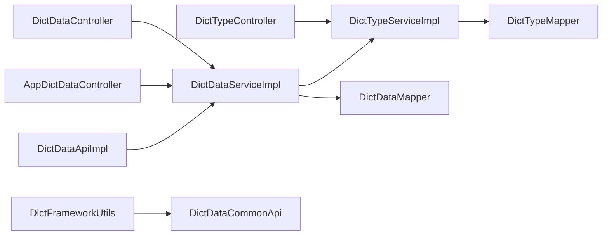

# 数据字典管理

<cite>
**本文引用的文件**
- [DictTypeDO.java](file://backend/yudao-module-system/src/main/java/cn/iocoder/yudao/module/system/dal/dataobject/dict/DictTypeDO.java)
- [DictDataDO.java](file://backend/yudao-module-system/src/main/java/cn/iocoder/yudao/module/system/dal/dataobject/dict/DictDataDO.java)
- [DictTypeMapper.java](file://backend/yudao-module-system/src/main/java/cn/iocoder/yudao/module/system/dal/mysql/dict/DictTypeMapper.java)
- [DictDataMapper.java](file://backend/yudao-module-system/src/main/java/cn/iocoder/yudao/module/system/dal/mysql/dict/DictDataMapper.java)
- [DictTypeService.java](file://backend/yudao-module-system/src/main/java/cn/iocoder/yudao/module/system/service/dict/DictTypeService.java)
- [DictDataService.java](file://backend/yudao-module-system/src/main/java/cn/iocoder/yudao/module/system/service/dict/DictDataService.java)
- [DictTypeServiceImpl.java](file://backend/yudao-module-system/src/main/java/cn/iocoder/yudao/module/system/service/dict/DictTypeServiceImpl.java)
- [DictDataServiceImpl.java](file://backend/yudao-module-system/src/main/java/cn/iocoder/yudao/module/system/service/dict/DictDataServiceImpl.java)
- [DictTypeController.java](file://backend/yudao-module-system/src/main/java/cn/iocoder/yudao/module/system/controller/admin/dict/DictTypeController.java)
- [DictDataController.java](file://backend/yudao-module-system/src/main/java/cn/iocoder/yudao/module/system/controller/admin/dict/DictDataController.java)
- [AppDictDataController.java](file://backend/yudao-module-system/src/main/java/cn/iocoder/yudao/module/system/controller/app/dict/AppDictDataController.java)
- [DictDataApi.java](file://backend/yudao-module-system/src/main/java/cn/iocoder/yudao/module/system/api/dict/DictDataApi.java)
- [DictDataApiImpl.java](file://backend/yudao-module-system/src/main/java/cn/iocoder/yudao/module/system/api/dict/DictDataApiImpl.java)
- [DictFrameworkUtils.java](file://backend/yudao-framework/yudao-spring-boot-starter-excel/src/main/java/cn/iocoder/yudao/framework/dict/core/DictFrameworkUtils.java)
- [DictDataCommonApi.java](file://backend/yudao-framework/yudao-common/src/main/java/cn/iocoder/yudao/framework/common/biz/system/dict/DictDataCommonApi.java)
- [DictDataRespDTO.java](file://backend/yudao-framework/yudao-common/src/main/java/cn/iocoder/yudao/framework/common/biz/system/dict/dto/DictDataRespDTO.java)
- [DictDataController.ts](file://frontend/admin-uniapp/src/api/system/dict/data/index.ts)
</cite>

## 目录
1. [简介](#简介)
2. [项目结构](#项目结构)
3. [核心组件](#核心组件)
4. [架构总览](#架构总览)
5. [详细组件分析](#详细组件分析)
6. [依赖分析](#依赖分析)
7. [性能考虑](#性能考虑)
8. [故障排查指南](#故障排查指南)
9. [结论](#结论)
10. [附录](#附录)

## 简介
本文件系统化梳理“数据字典管理”功能，覆盖以下方面：
- 字典类型管理：类型新增、编辑、分页查询、删除及唯一性校验
- 字典数据维护：数据新增、更新、删除、批量删除、分页与列表查询
- 字典缓存机制：基于内存缓存的字典数据查询与解析
- 字典数据查询：按类型查询、按值/标签解析、启用状态过滤
- 实体模型设计：字典类型与字典数据的表结构与字段语义
- 服务层实现：类型与数据服务接口与实现逻辑
- 前端展示：Admin 前端对字典数据的调用与使用
- 国际化支持：当前仓库未直接提供国际化实现，但可通过字典标签与值扩展
- API 接口文档：Admin 后端与 App 后端的完整接口清单与行为说明

## 项目结构
数据字典功能主要分布在后端模块 system 与 framework 中，前端在 admin-uniapp 中提供调用示例。

**图表来源**
- [DictTypeController.java:1-27](file://backend/yudao-module-system/src/main/java/cn/iocoder/yudao/module/system/controller/admin/dict/DictTypeController.java#L1-L27)
- [DictDataController.java:1-25](file://backend/yudao-module-system/src/main/java/cn/iocoder/yudao/module/system/controller/admin/dict/DictDataController.java#L1-L25)
- [AppDictDataController.java:1-43](file://backend/yudao-module-system/src/main/java/cn/iocoder/yudao/module/system/controller/app/dict/AppDictDataController.java#L1-L43)
- [DictTypeServiceImpl.java:1-156](file://backend/yudao-module-system/src/main/java/cn/iocoder/yudao/module/system/service/dict/DictTypeServiceImpl.java#L1-L156)
- [DictDataServiceImpl.java:1-185](file://backend/yudao-module-system/src/main/java/cn/iocoder/yudao/module/system/service/dict/DictDataServiceImpl.java#L1-L185)
- [DictTypeMapper.java:1-37](file://backend/yudao-module-system/src/main/java/cn/iocoder/yudao/module/system/dal/mysql/dict/DictTypeMapper.java#L1-L37)
- [DictDataMapper.java](file://backend/yudao-module-system/src/main/java/cn/iocoder/yudao/module/system/dal/mysql/dict/DictDataMapper.java)
- [DictTypeDO.java:1-59](file://backend/yudao-module-system/src/main/java/cn/iocoder/yudao/module/system/dal/dataobject/dict/DictTypeDO.java#L1-L59)
- [DictDataDO.java:1-68](file://backend/yudao-module-system/src/main/java/cn/iocoder/yudao/module/system/dal/dataobject/dict/DictDataDO.java#L1-L68)
- [DictFrameworkUtils.java:1-85](file://backend/yudao-framework/yudao-spring-boot-starter-excel/src/main/java/cn/iocoder/yudao/framework/dict/core/DictFrameworkUtils.java#L1-L85)
- [DictDataApi.java:1-25](file://backend/yudao-module-system/src/main/java/cn/iocoder/yudao/module/system/api/dict/DictDataApi.java#L1-L25)
- [DictDataApiImpl.java:1-35](file://backend/yudao-module-system/src/main/java/cn/iocoder/yudao/module/system/api/dict/DictDataApiImpl.java#L1-L35)
- [DictDataCommonApi.java](file://backend/yudao-framework/yudao-common/src/main/java/cn/iocoder/yudao/framework/common/biz/system/dict/DictDataCommonApi.java)
- [DictDataRespDTO.java](file://backend/yudao-framework/yudao-common/src/main/java/cn/iocoder/yudao/framework/common/biz/system/dict/dto/DictDataRespDTO.java)
- [DictDataController.ts:1-46](file://frontend/admin-uniapp/src/api/system/dict/data/index.ts#L1-L46)

**章节来源**
- [DictTypeController.java:1-27](file://backend/yudao-module-system/src/main/java/cn/iocoder/yudao/module/system/controller/admin/dict/DictTypeController.java#L1-L27)
- [DictDataController.java:1-25](file://backend/yudao-module-system/src/main/java/cn/iocoder/yudao/module/system/controller/admin/dict/DictDataController.java#L1-L25)
- [AppDictDataController.java:1-43](file://backend/yudao-module-system/src/main/java/cn/iocoder/yudao/module/system/controller/app/dict/AppDictDataController.java#L1-L43)
- [DictTypeServiceImpl.java:1-156](file://backend/yudao-module-system/src/main/java/cn/iocoder/yudao/module/system/service/dict/DictTypeServiceImpl.java#L1-L156)
- [DictDataServiceImpl.java:1-185](file://backend/yudao-module-system/src/main/java/cn/iocoder/yudao/module/system/service/dict/DictDataServiceImpl.java#L1-L185)
- [DictTypeMapper.java:1-37](file://backend/yudao-module-system/src/main/java/cn/iocoder/yudao/module/system/dal/mysql/dict/DictTypeMapper.java#L1-L37)
- [DictDataMapper.java](file://backend/yudao-module-system/src/main/java/cn/iocoder/yudao/module/system/dal/mysql/dict/DictDataMapper.java)
- [DictTypeDO.java:1-59](file://backend/yudao-module-system/src/main/java/cn/iocoder/yudao/module/system/dal/dataobject/dict/DictTypeDO.java#L1-L59)
- [DictDataDO.java:1-68](file://backend/yudao-module-system/src/main/java/cn/iocoder/yudao/module/system/dal/dataobject/dict/DictDataDO.java#L1-L68)
- [DictFrameworkUtils.java:1-85](file://backend/yudao-framework/yudao-spring-boot-starter-excel/src/main/java/cn/iocoder/yudao/framework/dict/core/DictFrameworkUtils.java#L1-L85)
- [DictDataApi.java:1-25](file://backend/yudao-module-system/src/main/java/cn/iocoder/yudao/module/system/api/dict/DictDataApi.java#L1-L25)
- [DictDataApiImpl.java:1-35](file://backend/yudao-module-system/src/main/java/cn/iocoder/yudao/module/system/api/dict/DictDataApiImpl.java#L1-L35)
- [DictDataCommonApi.java](file://backend/yudao-framework/yudao-common/src/main/java/cn/iocoder/yudao/framework/common/biz/system/dict/DictDataCommonApi.java)
- [DictDataRespDTO.java](file://backend/yudao-framework/yudao-common/src/main/java/cn/iocoder/yudao/framework/common/biz/system/dict/dto/DictDataRespDTO.java)
- [DictDataController.ts:1-46](file://frontend/admin-uniapp/src/api/system/dict/data/index.ts#L1-L46)

## 核心组件
- 实体模型
  - 字典类型：包含名称、类型标识、状态、备注等字段
  - 字典数据：包含标签、值、类型标识、排序、状态、颜色类型、CSS 类等字段
- 数据访问层
  - DictTypeMapper：类型分页、唯一性查询、软删除更新
  - DictDataMapper：按状态与类型查询、分页、唯一性校验、批量删除
- 服务层
  - DictTypeService/Impl：类型分页、新增/修改/删除、唯一性校验、删除前检查
  - DictDataService/Impl：数据 CRUD、分页、按类型查询、值/标签解析、启用校验
- 控制器层
  - DictTypeController：类型管理接口
  - DictDataController：数据管理接口（Admin）
  - AppDictDataController：App 端按类型查询接口
- 缓存与 API
  - DictFrameworkUtils：基于 LoadingCache 的字典数据缓存与解析
  - DictDataApi/Impl：对外暴露字典数据查询能力
  - DictDataCommonApi/DictDataRespDTO：通用接口与响应模型

**章节来源**
- [DictTypeDO.java:1-59](file://backend/yudao-module-system/src/main/java/cn/iocoder/yudao/module/system/dal/dataobject/dict/DictTypeDO.java#L1-L59)
- [DictDataDO.java:1-68](file://backend/yudao-module-system/src/main/java/cn/iocoder/yudao/module/system/dal/dataobject/dict/DictDataDO.java#L1-L68)
- [DictTypeMapper.java:1-37](file://backend/yudao-module-system/src/main/java/cn/iocoder/yudao/module/system/dal/mysql/dict/DictTypeMapper.java#L1-L37)
- [DictDataMapper.java](file://backend/yudao-module-system/src/main/java/cn/iocoder/yudao/module/system/dal/mysql/dict/DictDataMapper.java)
- [DictTypeService.java](file://backend/yudao-module-system/src/main/java/cn/iocoder/yudao/module/system/service/dict/DictTypeService.java)
- [DictDataService.java:1-118](file://backend/yudao-module-system/src/main/java/cn/iocoder/yudao/module/system/service/dict/DictDataService.java#L1-L118)
- [DictTypeServiceImpl.java:1-156](file://backend/yudao-module-system/src/main/java/cn/iocoder/yudao/module/system/service/dict/DictTypeServiceImpl.java#L1-L156)
- [DictDataServiceImpl.java:1-185](file://backend/yudao-module-system/src/main/java/cn/iocoder/yudao/module/system/service/dict/DictDataServiceImpl.java#L1-L185)
- [DictTypeController.java:1-27](file://backend/yudao-module-system/src/main/java/cn/iocoder/yudao/module/system/controller/admin/dict/DictTypeController.java#L1-L27)
- [DictDataController.java:1-25](file://backend/yudao-module-system/src/main/java/cn/iocoder/yudao/module/system/controller/admin/dict/DictDataController.java#L1-L25)
- [AppDictDataController.java:1-43](file://backend/yudao-module-system/src/main/java/cn/iocoder/yudao/module/system/controller/app/dict/AppDictDataController.java#L1-L43)
- [DictFrameworkUtils.java:1-85](file://backend/yudao-framework/yudao-spring-boot-starter-excel/src/main/java/cn/iocoder/yudao/framework/dict/core/DictFrameworkUtils.java#L1-L85)
- [DictDataApi.java:1-25](file://backend/yudao-module-system/src/main/java/cn/iocoder/yudao/module/system/api/dict/DictDataApi.java#L1-L25)
- [DictDataApiImpl.java:1-35](file://backend/yudao-module-system/src/main/java/cn/iocoder/yudao/module/system/api/dict/DictDataApiImpl.java#L1-L35)
- [DictDataCommonApi.java](file://backend/yudao-framework/yudao-common/src/main/java/cn/iocoder/yudao/framework/common/biz/system/dict/DictDataCommonApi.java)
- [DictDataRespDTO.java](file://backend/yudao-framework/yudao-common/src/main/java/cn/iocoder/yudao/framework/common/biz/system/dict/dto/DictDataRespDTO.java)

## 架构总览
数据字典采用典型的分层架构：控制器负责接口定义与鉴权，服务层处理业务规则与校验，数据访问层封装数据库操作，缓存工具提供高性能查询与解析。

**图表来源**
- [AppDictDataController.java:33-41](file://backend/yudao-module-system/src/main/java/cn/iocoder/yudao/module/system/controller/app/dict/AppDictDataController.java#L33-L41)
- [DictDataServiceImpl.java:48-58](file://backend/yudao-module-system/src/main/java/cn/iocoder/yudao/module/system/service/dict/DictDataServiceImpl.java#L48-L58)
- [DictDataMapper.java](file://backend/yudao-module-system/src/main/java/cn/iocoder/yudao/module/system/dal/mysql/dict/DictDataMapper.java)
- [DictFrameworkUtils.java:60-64](file://backend/yudao-framework/yudao-spring-boot-starter-excel/src/main/java/cn/iocoder/yudao/framework/dict/core/DictFrameworkUtils.java#L60-L64)

## 详细组件分析

### 实体模型与关系
- 字典类型表（system_dict_type）
  - 主键：id
  - 名称：name
  - 类型标识：type（唯一）
  - 状态：status
  - 备注：remark
  - 删除时间：deletedTime（软删除）
- 字典数据表（system_dict_data）
  - 主键：id
  - 标签：label
  - 值：value（同一类型内唯一）
  - 类型标识：dictType（冗余字段，便于查询）
  - 排序：sort
  - 状态：status
  - 颜色类型：colorType
  - CSS 类：cssClass
  - 备注：remark

**图表来源**
- [DictTypeDO.java:18-58](file://backend/yudao-module-system/src/main/java/cn/iocoder/yudao/module/system/dal/dataobject/dict/DictTypeDO.java#L18-L58)
- [DictDataDO.java:15-67](file://backend/yudao-module-system/src/main/java/cn/iocoder/yudao/module/system/dal/dataobject/dict/DictDataDO.java#L15-L67)

**章节来源**
- [DictTypeDO.java:1-59](file://backend/yudao-module-system/src/main/java/cn/iocoder/yudao/module/system/dal/dataobject/dict/DictTypeDO.java#L1-L59)
- [DictDataDO.java:1-68](file://backend/yudao-module-system/src/main/java/cn/iocoder/yudao/module/system/dal/dataobject/dict/DictDataDO.java#L1-L68)

### 服务层实现
- 字典类型服务
  - 唯一性校验：名称与类型均需唯一
  - 删除校验：若存在关联字典数据则禁止删除
  - 分页与列表：提供分页查询与全量列表
- 字典数据服务
  - 值唯一性校验：同一类型下 value 唯一
  - 启用校验：仅允许启用状态的类型与数据
  - 批量校验：按类型与值集合进行存在性与启用状态校验
  - 解析能力：按值或标签解析对应记录
  - 排序与分页：按类型与排序字段排序

**图表来源**
- [DictTypeService.java](file://backend/yudao-module-system/src/main/java/cn/iocoder/yudao/module/system/service/dict/DictTypeService.java)
- [DictTypeServiceImpl.java:1-156](file://backend/yudao-module-system/src/main/java/cn/iocoder/yudao/module/system/service/dict/DictTypeServiceImpl.java#L1-L156)
- [DictDataService.java:1-118](file://backend/yudao-module-system/src/main/java/cn/iocoder/yudao/module/system/service/dict/DictDataService.java#L1-L118)
- [DictDataServiceImpl.java:1-185](file://backend/yudao-module-system/src/main/java/cn/iocoder/yudao/module/system/service/dict/DictDataServiceImpl.java#L1-L185)

**章节来源**
- [DictTypeServiceImpl.java:1-156](file://backend/yudao-module-system/src/main/java/cn/iocoder/yudao/module/system/service/dict/DictTypeServiceImpl.java#L1-L156)
- [DictDataServiceImpl.java:1-185](file://backend/yudao-module-system/src/main/java/cn/iocoder/yudao/module/system/service/dict/DictDataServiceImpl.java#L1-L185)

### 缓存机制与解析
- 缓存策略
  - 使用异步重载缓存，按字典类型维度缓存字典数据列表
  - 默认过期时间为 1 分钟，避免脏读
- 解析能力
  - 支持按值解析标签、按标签解析值
  - 提供标签与值的列表提取方法
- 初始化与清理
  - 通过静态初始化注入通用字典 API
  - 提供缓存清空接口以触发重新加载

**图表来源**
- [DictFrameworkUtils.java:31-83](file://backend/yudao-framework/yudao-spring-boot-starter-excel/src/main/java/cn/iocoder/yudao/framework/dict/core/DictFrameworkUtils.java#L31-L83)

**章节来源**
- [DictFrameworkUtils.java:1-85](file://backend/yudao-framework/yudao-spring-boot-starter-excel/src/main/java/cn/iocoder/yudao/framework/dict/core/DictFrameworkUtils.java#L1-L85)
- [DictDataCommonApi.java](file://backend/yudao-framework/yudao-common/src/main/java/cn/iocoder/yudao/framework/common/biz/system/dict/DictDataCommonApi.java)
- [DictDataRespDTO.java](file://backend/yudao-framework/yudao-common/src/main/java/cn/iocoder/yudao/framework/common/biz/system/dict/dto/DictDataRespDTO.java)

### 前端展示与调用
- Admin 前端封装了字典数据的分页、详情、新增、修改、删除等接口
- 通过统一的 http 封装进行调用，返回分页结果或布尔状态

**图表来源**
- [DictDataController.ts:1-46](file://frontend/admin-uniapp/src/api/system/dict/data/index.ts#L1-L46)
- [DictDataController.java:1-25](file://backend/yudao-module-system/src/main/java/cn/iocoder/yudao/module/system/controller/admin/dict/DictDataController.java#L1-L25)
- [DictDataServiceImpl.java:55-58](file://backend/yudao-module-system/src/main/java/cn/iocoder/yudao/module/system/service/dict/DictDataServiceImpl.java#L55-L58)
- [DictDataMapper.java](file://backend/yudao-module-system/src/main/java/cn/iocoder/yudao/module/system/dal/mysql/dict/DictDataMapper.java)

**章节来源**
- [DictDataController.ts:1-46](file://frontend/admin-uniapp/src/api/system/dict/data/index.ts#L1-L46)

## 依赖分析
- 组件耦合
  - 服务层之间存在依赖：数据服务依赖类型服务进行有效性校验
  - 控制器依赖服务层；服务层依赖 Mapper；缓存工具依赖通用 API
- 外部依赖
  - 使用 Guava Cache 实现异步重载缓存
  - 使用 BeanUtils 进行对象转换
  - 使用 MyBatis-Plus 进行数据访问

**图表来源**
- [DictTypeController.java:1-27](file://backend/yudao-module-system/src/main/java/cn/iocoder/yudao/module/system/controller/admin/dict/DictTypeController.java#L1-L27)
- [DictDataController.java:1-25](file://backend/yudao-module-system/src/main/java/cn/iocoder/yudao/module/system/controller/admin/dict/DictDataController.java#L1-L25)
- [AppDictDataController.java:1-43](file://backend/yudao-module-system/src/main/java/cn/iocoder/yudao/module/system/controller/app/dict/AppDictDataController.java#L1-L43)
- [DictTypeServiceImpl.java:1-156](file://backend/yudao-module-system/src/main/java/cn/iocoder/yudao/module/system/service/dict/DictTypeServiceImpl.java#L1-L156)
- [DictDataServiceImpl.java:1-185](file://backend/yudao-module-system/src/main/java/cn/iocoder/yudao/module/system/service/dict/DictDataServiceImpl.java#L1-L185)
- [DictTypeMapper.java:1-37](file://backend/yudao-module-system/src/main/java/cn/iocoder/yudao/module/system/dal/mysql/dict/DictTypeMapper.java#L1-L37)
- [DictDataMapper.java](file://backend/yudao-module-system/src/main/java/cn/iocoder/yudao/module/system/dal/mysql/dict/DictDataMapper.java)
- [DictFrameworkUtils.java:1-85](file://backend/yudao-framework/yudao-spring-boot-starter-excel/src/main/java/cn/iocoder/yudao/framework/dict/core/DictFrameworkUtils.java#L1-L85)
- [DictDataApiImpl.java:1-35](file://backend/yudao-module-system/src/main/java/cn/iocoder/yudao/module/system/api/dict/DictDataApiImpl.java#L1-L35)

**章节来源**
- [DictTypeServiceImpl.java:1-156](file://backend/yudao-module-system/src/main/java/cn/iocoder/yudao/module/system/service/dict/DictTypeServiceImpl.java#L1-L156)
- [DictDataServiceImpl.java:1-185](file://backend/yudao-module-system/src/main/java/cn/iocoder/yudao/module/system/service/dict/DictDataServiceImpl.java#L1-L185)

## 性能考虑
- 缓存命中率
  - 通过按类型维度缓存字典数据，减少数据库频繁查询
  - 建议在高并发场景下适当调整缓存过期时间与容量
- 查询优化
  - 字典数据按类型与排序字段排序，确保前端渲染一致性
  - 启用状态过滤减少无效数据传输
- 批量校验
  - 服务层提供批量校验接口，避免逐条校验带来的网络与数据库压力
- 前端分页
  - Admin 端提供分页接口，避免一次性加载大量数据

[本节为通用性能建议，无需特定文件来源]

## 故障排查指南
- 常见错误与定位
  - 类型不存在或未启用：检查类型是否存在且状态为启用
  - 数据值重复：同一类型下 value 必须唯一
  - 删除失败（存在子数据）：先清理该类型的字典数据再删除类型
  - 批量校验失败：确认传入的值集合在该类型下均存在且启用
- 日志与监控
  - 服务层使用日志输出关键流程，便于问题定位
  - 缓存工具提供初始化成功日志与异常抛出

**章节来源**
- [DictDataServiceImpl.java:138-146](file://backend/yudao-module-system/src/main/java/cn/iocoder/yudao/module/system/service/dict/DictDataServiceImpl.java#L138-L146)
- [DictDataServiceImpl.java:112-124](file://backend/yudao-module-system/src/main/java/cn/iocoder/yudao/module/system/service/dict/DictDataServiceImpl.java#L112-L124)
- [DictTypeServiceImpl.java:82-88](file://backend/yudao-module-system/src/main/java/cn/iocoder/yudao/module/system/service/dict/DictTypeServiceImpl.java#L82-L88)
- [DictDataServiceImpl.java:148-165](file://backend/yudao-module-system/src/main/java/cn/iocoder/yudao/module/system/service/dict/DictDataServiceImpl.java#L148-L165)

## 结论
数据字典模块通过清晰的分层设计与完善的校验机制，提供了稳定高效的字典类型与数据管理能力。结合内存缓存与批量校验，满足高并发场景下的性能需求。前端通过统一 API 封装，简化了调用复杂度。后续可在国际化与更细粒度的缓存策略上进一步优化。

[本节为总结性内容，无需特定文件来源]

## 附录

### API 接口文档

- 字典类型（Admin）
  - 分页查询
    - 方法：GET
    - 路径：/system/dict-type/page
    - 权限：@PreAuthorize("@ss.hasPermission('system:dict:query')")（控制器注解）
  - 新增
    - 方法：POST
    - 路径：/system/dict-type/create
    - 权限：@PreAuthorize("@ss.hasPermission('system:dict:create')")（控制器注解）
  - 修改
    - 方法：PUT
    - 路径：/system/dict-type/update
    - 权限：@PreAuthorize("@ss.hasPermission('system:dict:update')")（控制器注解）
  - 删除
    - 方法：DELETE
    - 路径：/system/dict-type/delete
    - 权限：@PreAuthorize("@ss.hasPermission('system:dict:delete')")（控制器注解）
  - 列表
    - 方法：GET
    - 路径：/system/dict-type/list
    - 权限：@PreAuthorize("@ss.hasPermission('system:dict:query')")（控制器注解）

- 字典数据（Admin）
  - 分页查询
    - 方法：GET
    - 路径：/system/dict-data/page
    - 权限：@PreAuthorize("@ss.hasPermission('system:dict:query')")（控制器注解）
  - 新增
    - 方法：POST
    - 路径：/system/dict-data/create
    - 权限：@PreAuthorize("@ss.hasPermission('system:dict:create')")（控制器注解）
  - 修改
    - 方法：PUT
    - 路径：/system/dict-data/update
    - 权限：@PreAuthorize("@ss.hasPermission('system:dict:update')")（控制器注解）
  - 删除
    - 方法：DELETE
    - 路径：/system/dict-data/delete
    - 权限：@PreAuthorize("@ss.hasPermission('system:dict:delete')")（控制器注解）
  - 详情
    - 方法：GET
    - 路径：/system/dict-data/get
    - 权限：@PreAuthorize("@ss.hasPermission('system:dict:query')")（控制器注解）
  - 精简列表
    - 方法：GET
    - 路径：/system/dict-data/simple-list
    - 权限：@PreAuthorize("@ss.hasPermission('system:dict:query')")（控制器注解）

- App 端字典数据
  - 按类型查询（仅启用）
    - 方法：GET
    - 路径：/system/dict-data/type
    - 参数：type（字典类型）
    - 权限：@PermitAll（控制器注解）

- 字典数据 API（通用）
  - 校验字典数据列表
    - 方法：调用 DictDataApi.validateDictDataList(dictType, values)
    - 用途：批量校验值的存在性与启用状态
  - 获取字典数据列表
    - 方法：调用 DictDataApi.getDictDataList(dictType)
    - 用途：按类型获取字典数据列表（DTO）

**章节来源**
- [DictTypeController.java:1-27](file://backend/yudao-module-system/src/main/java/cn/iocoder/yudao/module/system/controller/admin/dict/DictTypeController.java#L1-L27)
- [DictDataController.java:1-25](file://backend/yudao-module-system/src/main/java/cn/iocoder/yudao/module/system/controller/admin/dict/DictDataController.java#L1-L25)
- [AppDictDataController.java:33-41](file://backend/yudao-module-system/src/main/java/cn/iocoder/yudao/module/system/controller/app/dict/AppDictDataController.java#L33-L41)
- [DictDataApi.java:14-22](file://backend/yudao-module-system/src/main/java/cn/iocoder/yudao/module/system/api/dict/DictDataApi.java#L14-L22)
- [DictDataApiImpl.java:24-33](file://backend/yudao-module-system/src/main/java/cn/iocoder/yudao/module/system/api/dict/DictDataApiImpl.java#L24-L33)

### 最佳实践与性能优化建议
- 最佳实践
  - 类型与值的唯一性约束：确保 type 与 value 在业务层面具备唯一性
  - 启用状态管理：统一通过状态枚举控制显示与使用
  - 排序字段：合理设置 sort，保证前端展示顺序一致
  - 软删除：类型删除采用软删除，保留历史审计线索
- 性能优化
  - 缓存策略：按类型维度缓存字典数据，合理设置过期时间
  - 批量接口：优先使用批量校验与批量删除接口
  - 分页查询：前端与后端均采用分页，避免全量加载
  - 前端渲染：结合颜色类型与 CSS 类，提升可视化效果

[本节为通用建议，无需特定文件来源]