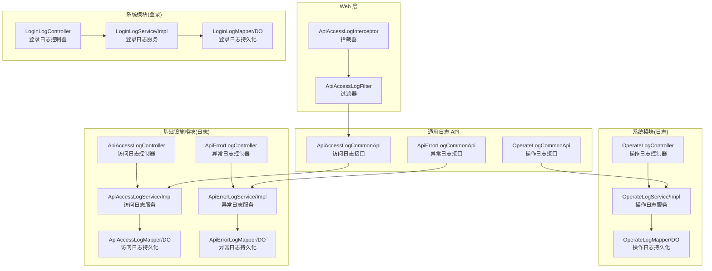
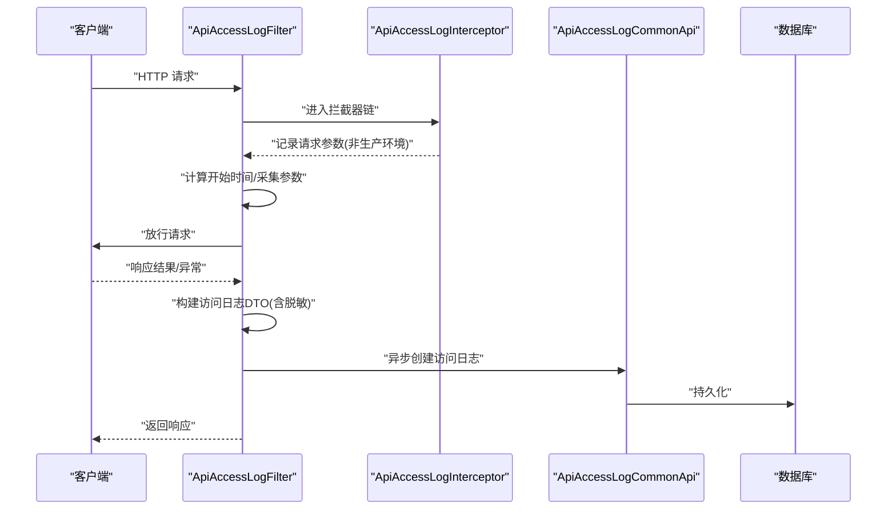
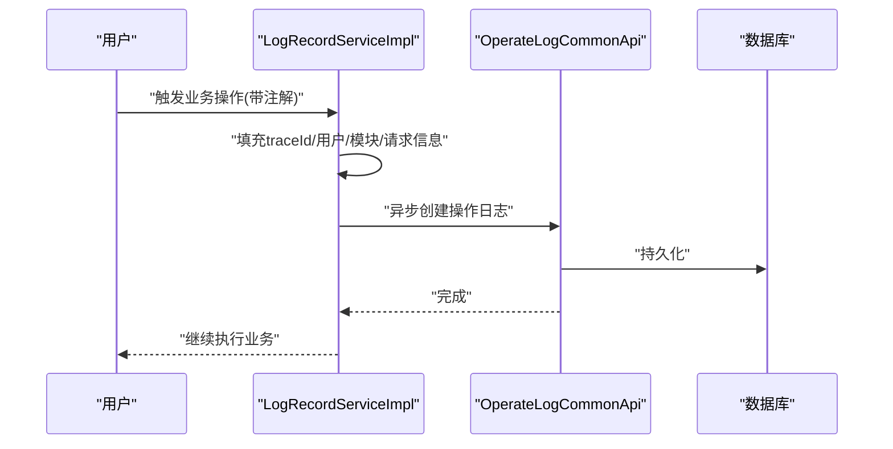
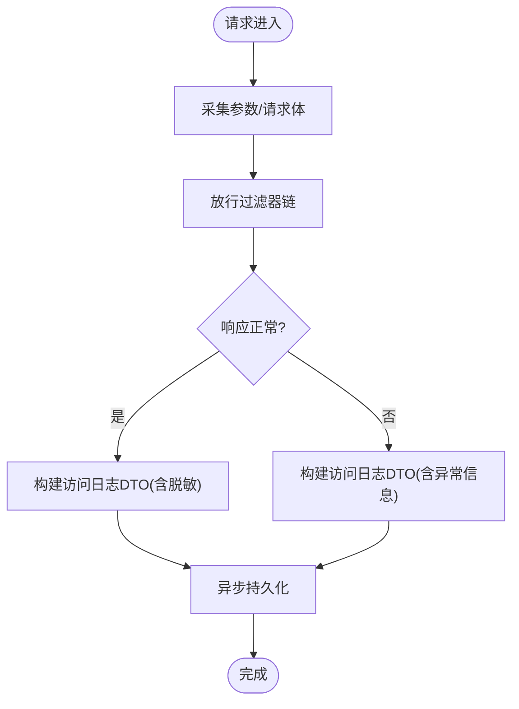
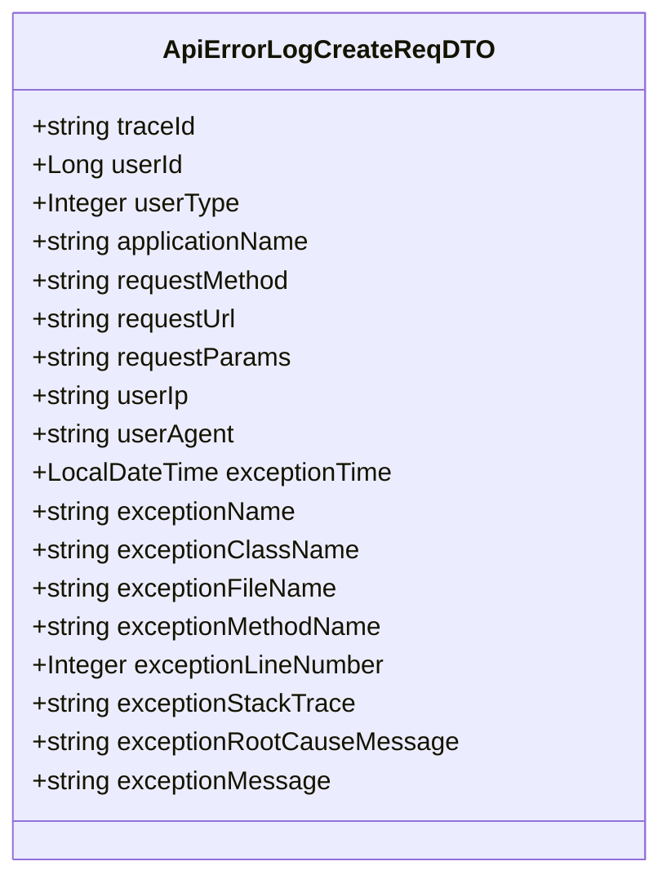
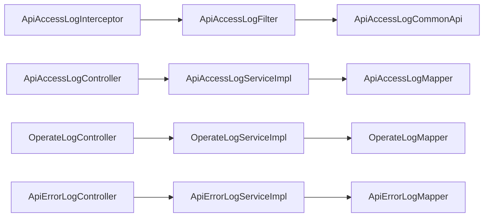

# 日志管理

<cite>
**本文引用的文件**
- [YudaoOperateLogConfiguration.java](file://backend/yudao-framework/yudao-spring-boot-starter-security/src/main/java/cn/iocoder/yudao/framework/operatelog/config/YudaoOperateLogConfiguration.java)
- [LogRecordServiceImpl.java](file://backend/yudao-framework/yudao-spring-boot-starter-security/src/main/java/cn/iocoder/yudao/framework/operatelog/core/service/LogRecordServiceImpl.java)
- [OperateLogCommonApi.java](file://backend/yudao-framework/yudao-common/src/main/java/cn/iocoder/yudao/framework/common/biz/system/logger/OperateLogCommonApi.java)
- [OperateLogCreateReqDTO.java](file://backend/yudao-framework/yudao-common/src/main/java/cn/iocoder/yudao/framework/common/biz/system/logger/dto/OperateLogCreateReqDTO.java)
- [ApiAccessLogCommonApi.java](file://backend/yudao-framework/yudao-common/src/main/java/cn/iocoder/yudao/framework/common/biz/infra/logger/ApiAccessLogCommonApi.java)
- [ApiAccessLogCreateReqDTO.java](file://backend/yudao-framework/yudao-common/src/main/java/cn/iocoder/yudao/framework/common/biz/infra/logger/dto/ApiAccessLogCreateReqDTO.java)
- [ApiErrorLogCommonApi.java](file://backend/yudao-framework/yudao-common/src/main/java/cn/iocoder/yudao/framework/common/biz/infra/logger/ApiErrorLogCommonApi.java)
- [ApiErrorLogCreateReqDTO.java](file://backend/yudao-framework/yudao-common/src/main/java/cn/iocoder/yudao/framework/common/biz/infra/logger/dto/ApiErrorLogCreateReqDTO.java)
- [ApiAccessLogFilter.java](file://backend/yudao-framework/yudao-spring-boot-starter-web/src/main/java/cn/iocoder/yudao/framework/apilog/core/filter/ApiAccessLogFilter.java)
- [ApiAccessLogInterceptor.java](file://backend/yudao-framework/yudao-spring-boot-starter-web/src/main/java/cn/iocoder/yudao/framework/apilog/core/interceptor/ApiAccessLogInterceptor.java)
- [OperateLogController.java](file://backend/yudao-module-system/src/main/java/cn/iocoder/yudao/module/system/controller/admin/logger/OperateLogController.java)
- [OperateLogService.java](file://backend/yudao-module-system/src/main/java/cn/iocoder/yudao/module/system/service/logger/OperateLogService.java)
- [OperateLogServiceImpl.java](file://backend/yudao-module-system/src/main/java/cn/iocoder/yudao/module/system/service/logger/OperateLogServiceImpl.java)
- [OperateLogMapper.java](file://backend/yudao-module-system/src/main/java/cn/iocoder/yudao/module/system/dal/mysql/logger/OperateLogMapper.java)
- [OperateLogDO.java](file://backend/yudao-module-system/src/main/java/cn/iocoder/yudao/module/system/dal/dataobject/logger/OperateLogDO.java)
- [LoginLogController.java](file://backend/yudao-module-system/src/main/java/cn/iocoder/yudao/module/system/controller/admin/logger/LoginLogController.java)
- [LoginLogService.java](file://backend/yudao-module-system/src/main/java/cn/iocoder/yudao/module/system/service/logger/LoginLogService.java)
- [LoginLogServiceImpl.java](file://backend/yudao-module-system/src/main/java/cn/iocoder/yudao/module/system/service/logger/LoginLogServiceImpl.java)
- [LoginLogMapper.java](file://backend/yudao-module-system/src/main/java/cn/iocoder/yudao/module/system/dal/mysql/logger/LoginLogMapper.java)
- [LoginLogDO.java](file://backend/yudao-module-system/src/main/java/cn/iocoder/yudao/module/system/dal/dataobject/logger/LoginLogDO.java)
- [ApiAccessLogController.java](file://backend/yudao-module-infra/src/main/java/cn/iocoder/yudao/module/infra/controller/admin/logger/ApiAccessLogController.java)
- [ApiAccessLogService.java](file://backend/yudao-module-infra/src/main/java/cn/iocoder/yudao/module/infra/service/logger/ApiAccessLogService.java)
- [ApiAccessLogServiceImpl.java](file://backend/yudao-module-infra/src/main/java/cn/iocoder/yudao/module/infra/service/logger/ApiAccessLogServiceImpl.java)
- [ApiAccessLogMapper.java](file://backend/yudao-module-infra/src/main/java/cn/iocoder/yudao/module/infra/dal/mysql/logger/ApiAccessLogMapper.java)
- [ApiAccessLogDO.java](file://backend/yudao-module-infra/src/main/java/cn/iocoder/yudao/module/infra/dal/dataobject/logger/ApiAccessLogDO.java)
- [ApiErrorLogController.java](file://backend/yudao-module-infra/src/main/java/cn/iocoder/yudao/module/infra/controller/admin/logger/ApiErrorLogController.java)
- [ApiErrorLogService.java](file://backend/yudao-module-infra/src/main/java/cn/iocoder/yudao/module/infra/service/logger/ApiErrorLogService.java)
- [ApiErrorLogServiceImpl.java](file://backend/yudao-module-infra/src/main/java/cn/iocoder/yudao/module/infra/service/logger/ApiErrorLogServiceImpl.java)
- [ApiErrorLogMapper.java](file://backend/yudao-module-infra/src/main/java/cn/iocoder/yudao/module/infra/dal/mysql/logger/ApiErrorLogMapper.java)
- [ApiErrorLogDO.java](file://backend/yudao-module-infra/src/main/java/cn/iocoder/yudao/module/infra/dal/dataobject/logger/ApiErrorLogDO.java)
- [ruoyi-vue-pro.sql](file://backend/sql/sqlserver/ruoyi-vue-pro.sql)
</cite>

## 目录
1. [简介](#简介)
2. [项目结构](#项目结构)
3. [核心组件](#核心组件)
4. [架构总览](#架构总览)
5. [详细组件分析](#详细组件分析)
6. [依赖分析](#依赖分析)
7. [性能考量](#性能考量)
8. [故障排查指南](#故障排查指南)
9. [结论](#结论)
10. [附录](#附录)

## 简介
本文件系统性梳理并文档化日志管理功能，覆盖以下能力：
- 操作日志记录与查询：基于注解驱动的自动记录、字段提取、异步持久化
- 登录日志跟踪：登录行为的记录与查询
- 异常日志处理：API 异常栈与上下文的采集与存储
- 日志查询与统计：按条件筛选、分页展示、导出能力
- 日志服务层实现：接口定义、实现与数据访问对象
- 设计模式与性能优化：异步落库、脱敏策略、拦截器链路

## 项目结构
日志管理由“通用日志 API + Web 层拦截/过滤 + 系统/基础设施模块服务 + Mapper/DO”构成，采用分层与模块化组织。

图表来源
- [OperateLogCommonApi.java:1-32](file://backend/yudao-framework/yudao-common/src/main/java/cn/iocoder/yudao/framework/common/biz/system/logger/OperateLogCommonApi.java#L1-L32)
- [ApiAccessLogCommonApi.java:1-32](file://backend/yudao-framework/yudao-common/src/main/java/cn/iocoder/yudao/framework/common/biz/infra/logger/ApiAccessLogCommonApi.java#L1-L32)
- [ApiErrorLogCommonApi.java:1-33](file://backend/yudao-framework/yudao-common/src/main/java/cn/iocoder/yudao/framework/common/biz/infra/logger/ApiErrorLogCommonApi.java#L1-L33)
- [ApiAccessLogFilter.java:1-253](file://backend/yudao-framework/yudao-spring-boot-starter-web/src/main/java/cn/iocoder/yudao/framework/apilog/core/filter/ApiAccessLogFilter.java#L1-L253)
- [ApiAccessLogInterceptor.java:1-104](file://backend/yudao-framework/yudao-spring-boot-starter-web/src/main/java/cn/iocoder/yudao/framework/apilog/core/interceptor/ApiAccessLogInterceptor.java#L1-L104)
- [OperateLogController.java](file://backend/yudao-module-system/src/main/java/cn/iocoder/yudao/module/system/controller/admin/logger/OperateLogController.java)
- [OperateLogService.java](file://backend/yudao-module-system/src/main/java/cn/iocoder/yudao/module/system/service/logger/OperateLogService.java)
- [OperateLogServiceImpl.java](file://backend/yudao-module-system/src/main/java/cn/iocoder/yudao/module/system/service/logger/OperateLogServiceImpl.java)
- [OperateLogMapper.java](file://backend/yudao-module-system/src/main/java/cn/iocoder/yudao/module/system/dal/mysql/logger/OperateLogMapper.java)
- [OperateLogDO.java](file://backend/yudao-module-system/src/main/java/cn/iocoder/yudao/module/system/dal/dataobject/logger/OperateLogDO.java)
- [LoginLogController.java](file://backend/yudao-module-system/src/main/java/cn/iocoder/yudao/module/system/controller/admin/logger/LoginLogController.java)
- [LoginLogService.java](file://backend/yudao-module-system/src/main/java/cn/iocoder/yudao/module/system/service/logger/LoginLogService.java)
- [LoginLogServiceImpl.java](file://backend/yudao-module-system/src/main/java/cn/iocoder/yudao/module/system/service/logger/LoginLogServiceImpl.java)
- [LoginLogMapper.java](file://backend/yudao-module-system/src/main/java/cn/iocoder/yudao/module/system/dal/mysql/logger/LoginLogMapper.java)
- [LoginLogDO.java](file://backend/yudao-module-system/src/main/java/cn/iocoder/yudao/module/system/dal/dataobject/logger/LoginLogDO.java)
- [ApiAccessLogController.java](file://backend/yudao-module-infra/src/main/java/cn/iocoder/yudao/module/infra/controller/admin/logger/ApiAccessLogController.java)
- [ApiAccessLogService.java](file://backend/yudao-module-infra/src/main/java/cn/iocoder/yudao/module/infra/service/logger/ApiAccessLogService.java)
- [ApiAccessLogServiceImpl.java](file://backend/yudao-module-infra/src/main/java/cn/iocoder/yudao/module/infra/service/logger/ApiAccessLogServiceImpl.java)
- [ApiAccessLogMapper.java](file://backend/yudao-module-infra/src/main/java/cn/iocoder/yudao/module/infra/dal/mysql/logger/ApiAccessLogMapper.java)
- [ApiAccessLogDO.java](file://backend/yudao-module-infra/src/main/java/cn/iocoder/yudao/module/infra/dal/dataobject/logger/ApiAccessLogDO.java)
- [ApiErrorLogController.java](file://backend/yudao-module-infra/src/main/java/cn/iocoder/yudao/module/infra/controller/admin/logger/ApiErrorLogController.java)
- [ApiErrorLogService.java](file://backend/yudao-module-infra/src/main/java/cn/iocoder/yudao/module/infra/service/logger/ApiErrorLogService.java)
- [ApiErrorLogServiceImpl.java](file://backend/yudao-module-infra/src/main/java/cn/iocoder/yudao/module/infra/service/logger/ApiErrorLogServiceImpl.java)
- [ApiErrorLogMapper.java](file://backend/yudao-module-infra/src/main/java/cn/iocoder/yudao/module/infra/dal/mysql/logger/ApiErrorLogMapper.java)
- [ApiErrorLogDO.java](file://backend/yudao-module-infra/src/main/java/cn/iocoder/yudao/module/infra/dal/dataobject/logger/ApiErrorLogDO.java)

章节来源
- [YudaoOperateLogConfiguration.java:1-28](file://backend/yudao-framework/yudao-spring-boot-starter-security/src/main/java/cn/iocoder/yudao/framework/operatelog/config/YudaoOperateLogConfiguration.java#L1-L28)
- [LogRecordServiceImpl.java:1-91](file://backend/yudao-framework/yudao-spring-boot-starter-security/src/main/java/cn/iocoder/yudao/framework/operatelog/core/service/LogRecordServiceImpl.java#L1-L91)

## 核心组件
- 操作日志
  - 接口与 DTO：定义创建操作日志的接口与请求体，包含链路 ID、用户信息、模块类型、业务编号、动作描述、扩展字段以及请求上下文
  - 自动记录：通过注解驱动，结合 Web 过滤器/拦截器自动采集请求上下文并异步落库
- 访问日志
  - 接口与 DTO：记录 API 访问的请求/响应、耗时、结果码、操作模块/名称/类型等
  - 过滤器链：在请求前后统一采集并脱敏敏感字段，支持选择性记录响应体
- 异常日志
  - 接口与 DTO：记录异常时间、异常栈、根因信息、发生位置等
  - 统一异常结果映射：从响应或异常中提取结果码与消息
- 登录日志
  - 控制器/服务/持久化：提供登录行为的增删改查与分页导出
- 查询与统计
  - 控制器层提供分页查询、导出 Excel 等能力
  - 服务层封装查询条件与分页逻辑
  - Mapper/DO 映射数据库表结构

章节来源
- [OperateLogCommonApi.java:1-32](file://backend/yudao-framework/yudao-common/src/main/java/cn/iocoder/yudao/framework/common/biz/system/logger/OperateLogCommonApi.java#L1-L32)
- [OperateLogCreateReqDTO.java:1-85](file://backend/yudao-framework/yudao-common/src/main/java/cn/iocoder/yudao/framework/common/biz/system/logger/dto/OperateLogCreateReqDTO.java#L1-L85)
- [ApiAccessLogCommonApi.java:1-32](file://backend/yudao-framework/yudao-common/src/main/java/cn/iocoder/yudao/framework/common/biz/infra/logger/ApiAccessLogCommonApi.java#L1-L32)
- [ApiAccessLogCreateReqDTO.java:1-104](file://backend/yudao-framework/yudao-common/src/main/java/cn/iocoder/yudao/framework/common/biz/infra/logger/dto/ApiAccessLogCreateReqDTO.java#L1-L104)
- [ApiErrorLogCommonApi.java:1-33](file://backend/yudao-framework/yudao-common/src/main/java/cn/iocoder/yudao/framework/common/biz/infra/logger/ApiErrorLogCommonApi.java#L1-L33)
- [ApiErrorLogCreateReqDTO.java:1-108](file://backend/yudao-framework/yudao-common/src/main/java/cn/iocoder/yudao/framework/common/biz/infra/logger/dto/ApiErrorLogCreateReqDTO.java#L1-L108)

## 架构总览
日志管理采用“注解 + 过滤器/拦截器 + 异步落库”的架构，确保对业务零侵入且具备高可用。

图表来源
- [ApiAccessLogFilter.java:64-98](file://backend/yudao-framework/yudao-spring-boot-starter-web/src/main/java/cn/iocoder/yudao/framework/apilog/core/filter/ApiAccessLogFilter.java#L64-L98)
- [ApiAccessLogInterceptor.java:36-73](file://backend/yudao-framework/yudao-spring-boot-starter-web/src/main/java/cn/iocoder/yudao/framework/apilog/core/interceptor/ApiAccessLogInterceptor.java#L36-L73)
- [ApiAccessLogCommonApi.java:1-32](file://backend/yudao-framework/yudao-common/src/main/java/cn/iocoder/yudao/framework/common/biz/infra/logger/ApiAccessLogCommonApi.java#L1-L32)

## 详细组件分析

### 操作日志模块
- 自动记录流程
  - 通过注解启用后，拦截器/过滤器自动采集用户、请求方法、URL、IP、UA 等上下文
  - 将日志 DTO 通过异步方式提交至通用 API，最终持久化
- 字段提取与填充
  - 用户信息：从安全框架获取当前登录用户
  - 请求信息：从 Servlet 工具类获取方法、URI、IP、UA
  - 模块信息：从注解或业务上下文中解析模块类型、子类型、业务编号、动作描述与扩展字段
- 异步持久化
  - 使用异步注解避免阻塞请求线程，提升吞吐

图表来源
- [LogRecordServiceImpl.java:30-79](file://backend/yudao-framework/yudao-spring-boot-starter-security/src/main/java/cn/iocoder/yudao/framework/operatelog/core/service/LogRecordServiceImpl.java#L30-L79)
- [OperateLogCommonApi.java:19-29](file://backend/yudao-framework/yudao-common/src/main/java/cn/iocoder/yudao/framework/common/biz/system/logger/OperateLogCommonApi.java#L19-L29)

章节来源
- [YudaoOperateLogConfiguration.java:16-25](file://backend/yudao-framework/yudao-spring-boot-starter-security/src/main/java/cn/iocoder/yudao/framework/operatelog/config/YudaoOperateLogConfiguration.java#L16-L25)
- [LogRecordServiceImpl.java:30-91](file://backend/yudao-framework/yudao-spring-boot-starter-security/src/main/java/cn/iocoder/yudao/framework/operatelog/core/service/LogRecordServiceImpl.java#L30-L91)
- [OperateLogCommonApi.java:19-29](file://backend/yudao-framework/yudao-common/src/main/java/cn/iocoder/yudao/framework/common/biz/system/logger/OperateLogCommonApi.java#L19-L29)
- [OperateLogCreateReqDTO.java:14-84](file://backend/yudao-framework/yudao-common/src/main/java/cn/iocoder/yudao/framework/common/biz/system/logger/dto/OperateLogCreateReqDTO.java#L14-L84)

### 访问日志模块
- 过滤器职责
  - 记录请求开始时间，提前采集查询参数与请求体
  - 放行后根据响应或异常构建访问日志 DTO
  - 支持注解控制是否记录、记录响应体、敏感字段脱敏
- 拦截器职责
  - 在非生产环境打印请求/响应日志与耗时，便于开发调试
- 敏感字段脱敏
  - 内置常见敏感键，支持自定义扩展键
  - 对 JSON 结构进行递归处理，仅处理 data 字段以保留结构完整性

图表来源
- [ApiAccessLogFilter.java:64-160](file://backend/yudao-framework/yudao-spring-boot-starter-web/src/main/java/cn/iocoder/yudao/framework/apilog/core/filter/ApiAccessLogFilter.java#L64-L160)
- [ApiAccessLogInterceptor.java:36-73](file://backend/yudao-framework/yudao-spring-boot-starter-web/src/main/java/cn/iocoder/yudao/framework/apilog/core/interceptor/ApiAccessLogInterceptor.java#L36-L73)

章节来源
- [ApiAccessLogFilter.java:86-160](file://backend/yudao-framework/yudao-spring-boot-starter-web/src/main/java/cn/iocoder/yudao/framework/apilog/core/filter/ApiAccessLogFilter.java#L86-L160)
- [ApiAccessLogInterceptor.java:36-101](file://backend/yudao-framework/yudao-spring-boot-starter-web/src/main/java/cn/iocoder/yudao/framework/apilog/core/interceptor/ApiAccessLogInterceptor.java#L36-L101)
- [ApiAccessLogCommonApi.java:19-29](file://backend/yudao-framework/yudao-common/src/main/java/cn/iocoder/yudao/framework/common/biz/infra/logger/ApiAccessLogCommonApi.java#L19-L29)
- [ApiAccessLogCreateReqDTO.java:14-103](file://backend/yudao-framework/yudao-common/src/main/java/cn/iocoder/yudao/framework/common/biz/infra/logger/dto/ApiAccessLogCreateReqDTO.java#L14-L103)

### 异常日志模块
- 异常采集
  - 从异常堆栈中提取异常名、类名、文件、方法、行号、根因与完整栈
  - 结合链路 ID 与请求上下文，形成可追溯的异常记录
- 统一映射
  - 若响应中包含错误码/消息，则优先使用；否则从异常根因提取

图表来源
- [ApiErrorLogCreateReqDTO.java:14-107](file://backend/yudao-framework/yudao-common/src/main/java/cn/iocoder/yudao/framework/common/biz/infra/logger/dto/ApiErrorLogCreateReqDTO.java#L14-L107)

章节来源
- [ApiErrorLogCommonApi.java:19-30](file://backend/yudao-framework/yudao-common/src/main/java/cn/iocoder/yudao/framework/common/biz/infra/logger/ApiErrorLogCommonApi.java#L19-L30)
- [ApiErrorLogCreateReqDTO.java:14-107](file://backend/yudao-framework/yudao-common/src/main/java/cn/iocoder/yudao/framework/common/biz/infra/logger/dto/ApiErrorLogCreateReqDTO.java#L14-L107)

### 登录日志模块
- 功能范围
  - 登录行为记录（用户名、IP、UA、登录时间、状态等）
  - 分页查询、导出 Excel
- 服务层
  - 封装查询条件、分页参数与导出逻辑

章节来源
- [LoginLogController.java](file://backend/yudao-module-system/src/main/java/cn/iocoder/yudao/module/system/controller/admin/logger/LoginLogController.java)
- [LoginLogService.java](file://backend/yudao-module-system/src/main/java/cn/iocoder/yudao/module/system/service/logger/LoginLogService.java)
- [LoginLogServiceImpl.java](file://backend/yudao-module-system/src/main/java/cn/iocoder/yudao/module/system/service/logger/LoginLogServiceImpl.java)
- [LoginLogMapper.java](file://backend/yudao-module-system/src/main/java/cn/iocoder/yudao/module/system/dal/mysql/logger/LoginLogMapper.java)
- [LoginLogDO.java](file://backend/yudao-module-system/src/main/java/cn/iocoder/yudao/module/system/dal/dataobject/logger/LoginLogDO.java)

### 日志查询与统计
- 操作日志
  - 控制器提供分页查询、导出 Excel
  - 服务层封装查询条件与分页逻辑
  - Mapper/DO 映射数据库表结构
- 访问/异常日志
  - 控制器提供分页查询、导出 Excel
  - 服务层封装查询条件与分页逻辑
  - Mapper/DO 映射数据库表结构

章节来源
- [OperateLogController.java](file://backend/yudao-module-system/src/main/java/cn/iocoder/yudao/module/system/controller/admin/logger/OperateLogController.java)
- [OperateLogService.java](file://backend/yudao-module-system/src/main/java/cn/iocoder/yudao/module/system/service/logger/OperateLogService.java)
- [OperateLogServiceImpl.java](file://backend/yudao-module-system/src/main/java/cn/iocoder/yudao/module/system/service/logger/OperateLogServiceImpl.java)
- [OperateLogMapper.java](file://backend/yudao-module-system/src/main/java/cn/iocoder/yudao/module/system/dal/mysql/logger/OperateLogMapper.java)
- [OperateLogDO.java](file://backend/yudao-module-system/src/main/java/cn/iocoder/yudao/module/system/dal/dataobject/logger/OperateLogDO.java)
- [ApiAccessLogController.java](file://backend/yudao-module-infra/src/main/java/cn/iocoder/yudao/module/infra/controller/admin/logger/ApiAccessLogController.java)
- [ApiAccessLogService.java](file://backend/yudao-module-infra/src/main/java/cn/iocoder/yudao/module/infra/service/logger/ApiAccessLogService.java)
- [ApiAccessLogServiceImpl.java](file://backend/yudao-module-infra/src/main/java/cn/iocoder/yudao/module/infra/service/logger/ApiAccessLogServiceImpl.java)
- [ApiAccessLogMapper.java](file://backend/yudao-module-infra/src/main/java/cn/iocoder/yudao/module/infra/dal/mysql/logger/ApiAccessLogMapper.java)
- [ApiAccessLogDO.java](file://backend/yudao-module-infra/src/main/java/cn/iocoder/yudao/module/infra/dal/dataobject/logger/ApiAccessLogDO.java)
- [ApiErrorLogController.java](file://backend/yudao-module-infra/src/main/java/cn/iocoder/yudao/module/infra/controller/admin/logger/ApiErrorLogController.java)
- [ApiErrorLogService.java](file://backend/yudao-module-infra/src/main/java/cn/iocoder/yudao/module/infra/service/logger/ApiErrorLogService.java)
- [ApiErrorLogServiceImpl.java](file://backend/yudao-module-infra/src/main/java/cn/iocoder/yudao/module/infra/service/logger/ApiErrorLogServiceImpl.java)
- [ApiErrorLogMapper.java](file://backend/yudao-module-infra/src/main/java/cn/iocoder/yudao/module/infra/dal/mysql/logger/ApiErrorLogMapper.java)
- [ApiErrorLogDO.java](file://backend/yudao-module-infra/src/main/java/cn/iocoder/yudao/module/infra/dal/dataobject/logger/ApiErrorLogDO.java)

## 依赖分析
- 组件耦合
  - Web 层依赖通用日志 API 接口，实现对具体存储的解耦
  - 服务层依赖 Mapper/DO，控制器依赖服务层
- 外部依赖
  - 操作日志自动记录依赖注解与安全框架
  - 访问日志依赖过滤器链与响应结果映射
- 循环依赖
  - 当前结构清晰，未发现循环依赖

图表来源
- [ApiAccessLogFilter.java:56-62](file://backend/yudao-framework/yudao-spring-boot-starter-web/src/main/java/cn/iocoder/yudao/framework/apilog/core/filter/ApiAccessLogFilter.java#L56-L62)
- [ApiAccessLogCommonApi.java:1-32](file://backend/yudao-framework/yudao-common/src/main/java/cn/iocoder/yudao/framework/common/biz/infra/logger/ApiAccessLogCommonApi.java#L1-L32)
- [ApiAccessLogServiceImpl.java](file://backend/yudao-module-infra/src/main/java/cn/iocoder/yudao/module/infra/service/logger/ApiAccessLogServiceImpl.java)
- [ApiAccessLogMapper.java](file://backend/yudao-module-infra/src/main/java/cn/iocoder/yudao/module/infra/dal/mysql/logger/ApiAccessLogMapper.java)
- [OperateLogServiceImpl.java](file://backend/yudao-module-system/src/main/java/cn/iocoder/yudao/module/system/service/logger/OperateLogServiceImpl.java)
- [OperateLogMapper.java](file://backend/yudao-module-system/src/main/java/cn/iocoder/yudao/module/system/dal/mysql/logger/OperateLogMapper.java)
- [ApiErrorLogServiceImpl.java](file://backend/yudao-module-infra/src/main/java/cn/iocoder/yudao/module/infra/service/logger/ApiErrorLogServiceImpl.java)
- [ApiErrorLogMapper.java](file://backend/yudao-module-infra/src/main/java/cn/iocoder/yudao/module/infra/dal/mysql/logger/ApiErrorLogMapper.java)

## 性能考量
- 异步落库
  - 操作日志与访问日志均采用异步创建，降低请求延迟
- 脱敏与体积控制
  - 请求/响应参数与敏感字段脱敏，避免冗余与泄露
  - 可选记录响应体，按需开启以平衡可观测性与性能
- 过滤器链路
  - 非生产环境仅打印日志，生产环境避免额外 IO
- 分页与导出
  - 控制器层提供分页查询与导出，建议前端分批拉取与服务端批量导出

## 故障排查指南
- 操作日志未记录
  - 检查注解是否启用、Web 配置是否生效、异步线程池是否正常
  - 查看记录实现中的异常日志输出
- 访问日志缺失
  - 确认过滤器链是否正确装配、注解开关是否开启
  - 检查响应结果映射与异常捕获逻辑
- 异常日志不完整
  - 确认异常栈是否被捕获、脱敏是否影响了必要字段
- 查询性能问题
  - 检查索引与查询条件，合理使用分页与导出策略

章节来源
- [LogRecordServiceImpl.java:44-47](file://backend/yudao-framework/yudao-spring-boot-starter-security/src/main/java/cn/iocoder/yudao/framework/operatelog/core/service/LogRecordServiceImpl.java#L44-L47)
- [ApiAccessLogFilter.java:95-97](file://backend/yudao-framework/yudao-spring-boot-starter-web/src/main/java/cn/iocoder/yudao/framework/apilog/core/filter/ApiAccessLogFilter.java#L95-L97)

## 结论
日志管理模块通过注解与过滤器链实现了对操作日志、访问日志、异常日志与登录日志的自动化采集与异步持久化，配合查询与导出能力，满足生产运维与审计需求。整体设计遵循低耦合、高扩展原则，便于后续接入更多日志类型与存储介质。

## 附录

### 数据模型与表结构
- 操作日志表
  - 字段包括：主键、链路 ID、用户信息、模块类型、子类型、业务编号、动作描述、扩展字段、请求方法、URL、IP、UA、创建时间等
- 登录日志表
  - 字段包括：主键、用户信息、登录 IP、UA、登录时间、状态等
- 访问日志表
  - 字段包括：应用名、请求方法、URL、请求参数、响应结果、IP、UA、模块/名称/类型、开始/结束时间、耗时、结果码/消息等
- 异常日志表
  - 字段包括：异常时间、异常名、类名、文件、方法、行号、栈轨迹、根因与消息等

章节来源
- [ruoyi-vue-pro.sql:7435-7467](file://backend/sql/sqlserver/ruoyi-vue-pro.sql#L7435-L7467)
- [OperateLogDO.java](file://backend/yudao-module-system/src/main/java/cn/iocoder/yudao/module/system/dal/dataobject/logger/OperateLogDO.java)
- [LoginLogDO.java](file://backend/yudao-module-system/src/main/java/cn/iocoder/yudao/module/system/dal/dataobject/logger/LoginLogDO.java)
- [ApiAccessLogDO.java](file://backend/yudao-module-infra/src/main/java/cn/iocoder/yudao/module/infra/dal/dataobject/logger/ApiAccessLogDO.java)
- [ApiErrorLogDO.java](file://backend/yudao-module-infra/src/main/java/cn/iocoder/yudao/module/infra/dal/dataobject/logger/ApiErrorLogDO.java)