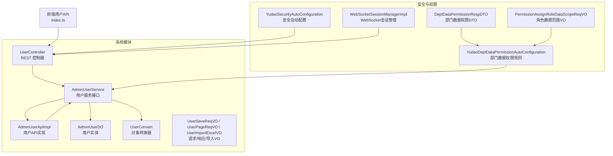
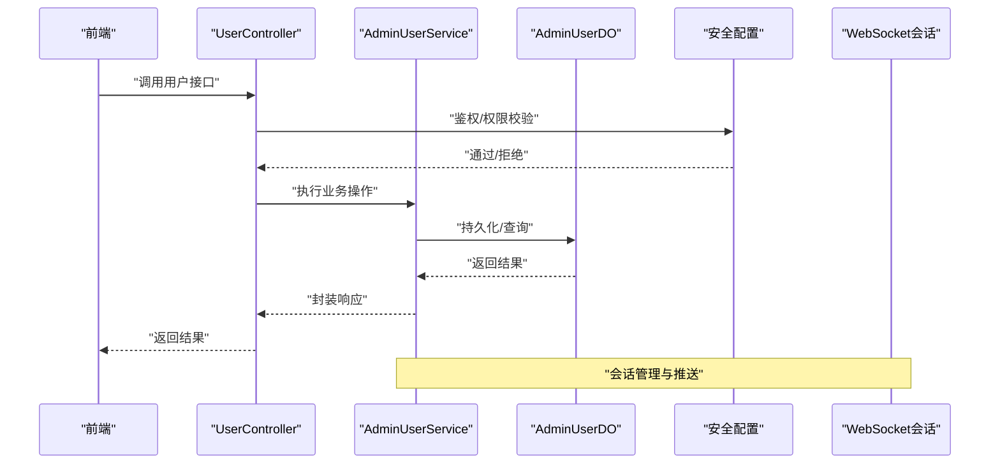
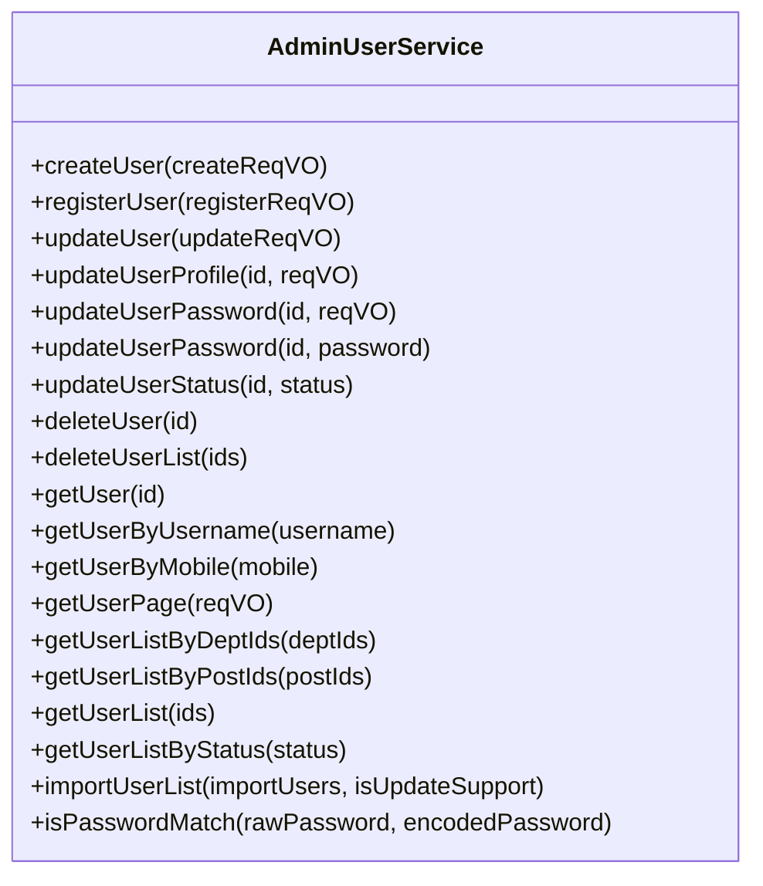
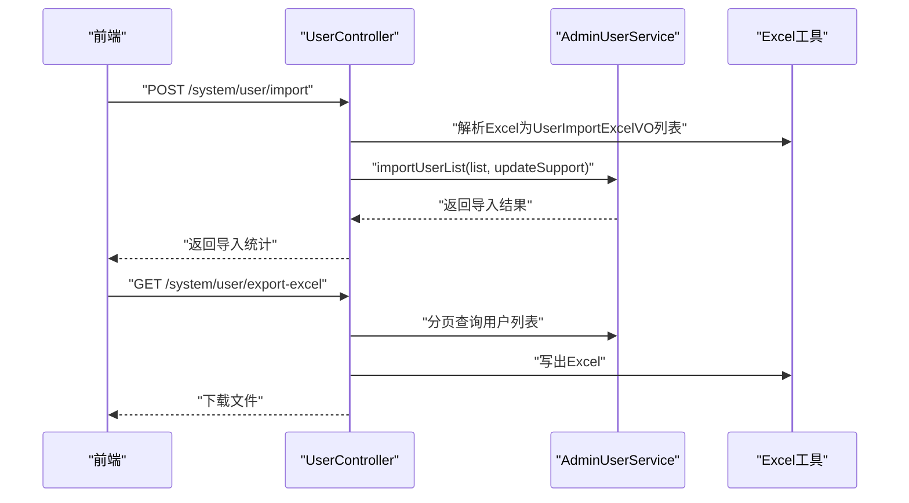
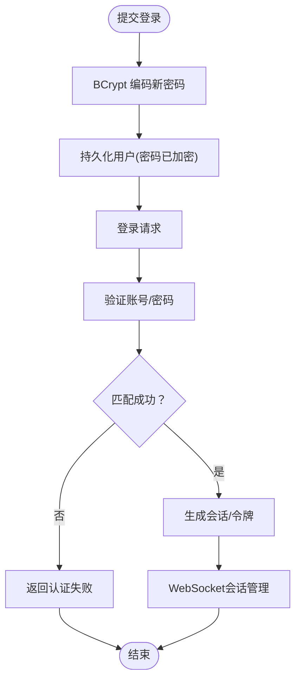
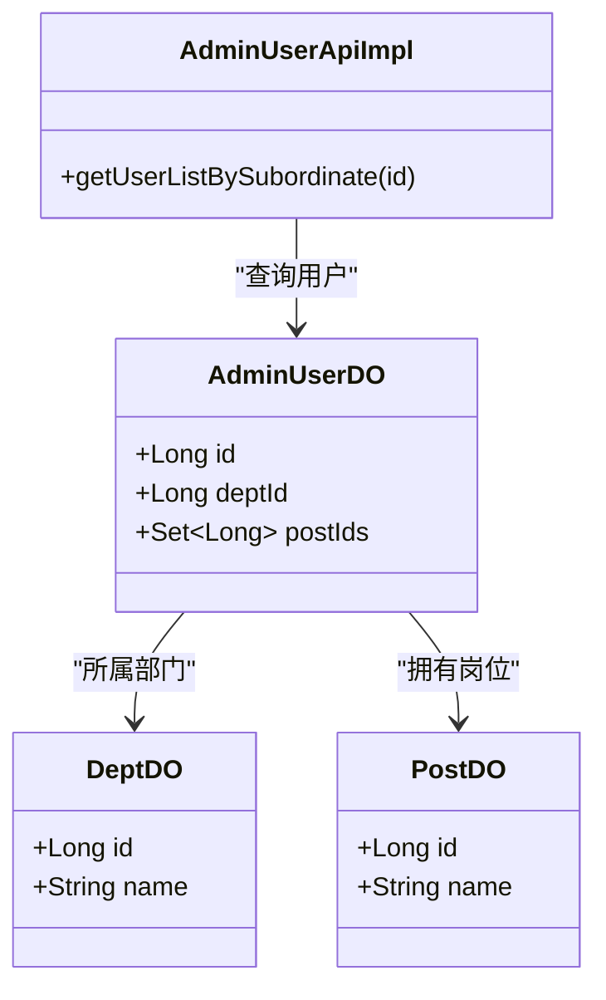
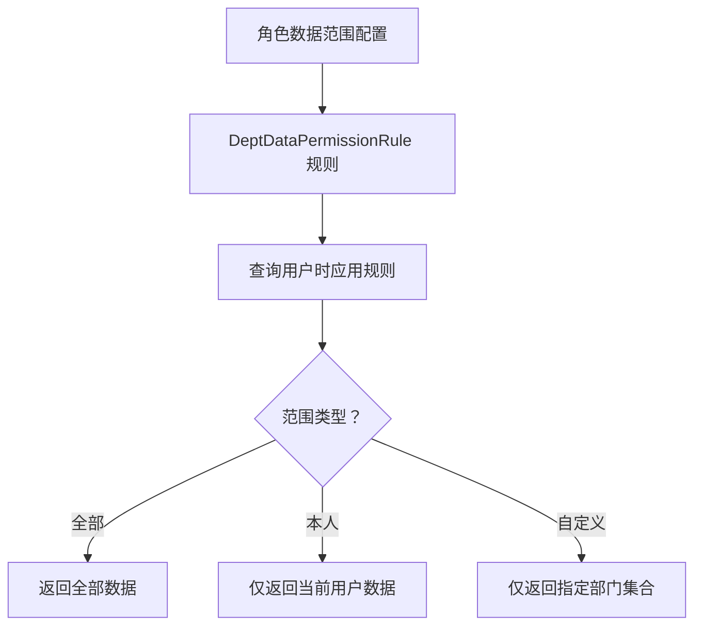
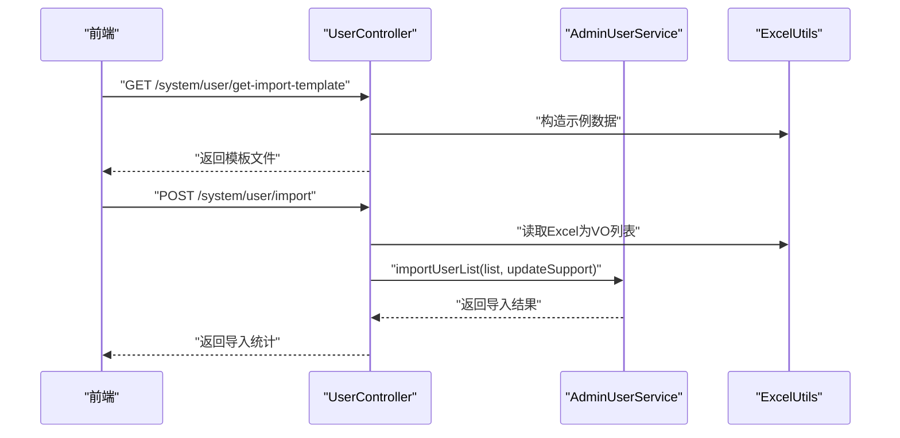
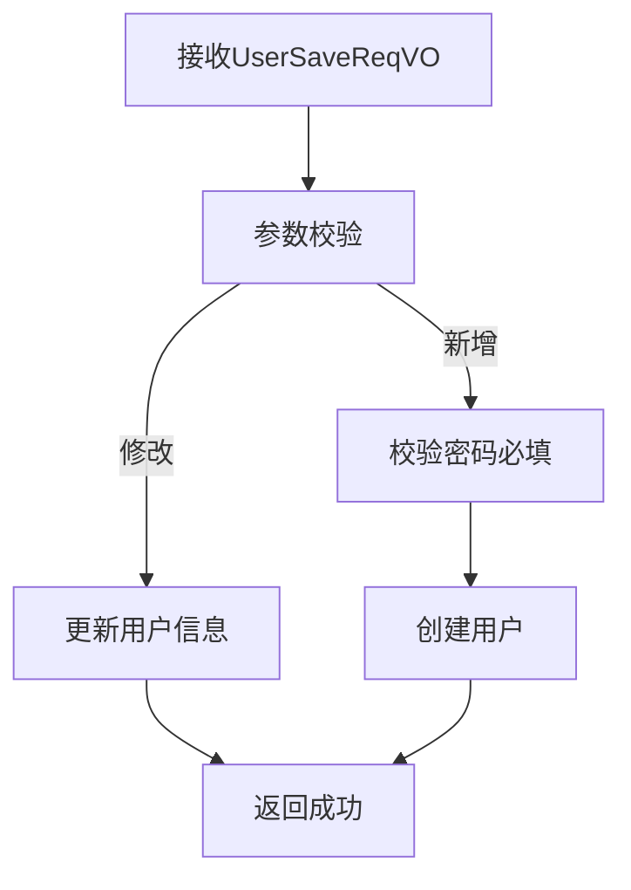
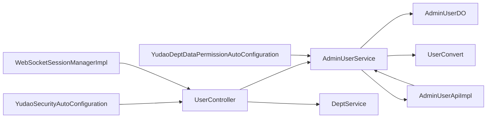

# 用户管理

<cite>
**本文引用的文件**
- [UserController.java](file://backend/yudao-module-system/src/main/java/cn/iocoder/yudao/module/system/controller/admin/user/UserController.java)
- [AdminUserService.java](file://backend/yudao-module-system/src/main/java/cn/iocoder/yudao/module/system/service/user/AdminUserService.java)
- [AdminUserDO.java](file://backend/yudao-module-system/src/main/java/cn/iocoder/yudao/module/system/dal/dataobject/user/AdminUserDO.java)
- [AdminUserApiImpl.java](file://backend/yudao-module-system/src/main/java/cn/iocoder/yudao/module/system/api/user/AdminUserApiImpl.java)
- [UserConvert.java](file://backend/yudao-module-system/src/main/java/cn/iocoder/yudao/module/system/convert/user/UserConvert.java)
- [UserSaveReqVO.java](file://backend/yudao-module-system/src/main/java/cn/iocoder/yudao/module/system/controller/admin/user/vo/user/UserSaveReqVO.java)
- [UserImportExcelVO.java](file://backend/yudao-module-system/src/main/java/cn/iocoder/yudao/module/system/controller/admin/user/vo/user/UserImportExcelVO.java)
- [UserPageReqVO.java](file://backend/yudao-module-system/src/main/java/cn/iocoder/yudao/module/system/controller/admin/user/vo/user/UserPageReqVO.java)
- [YudaoSecurityAutoConfiguration.java](file://backend/yudao-framework/yudao-spring-boot-starter-security/src/main/java/cn/iocoder/yudao/framework/security/config/YudaoSecurityAutoConfiguration.java)
- [WebSocketSessionManagerImpl.java](file://backend/yudao-framework/yudao-spring-boot-starter-websocket/src/main/java/cn/iocoder/yudao/framework/websocket/core/session/WebSocketSessionManagerImpl.java)
- [YudaoDeptDataPermissionAutoConfiguration.java](file://backend/yudao-framework/yudao-spring-boot-starter-biz-data-permission/src/main/java/cn/iocoder/yudao/framework/datapermission/config/YudaoDeptDataPermissionAutoConfiguration.java)
- [DeptDataPermissionRespDTO.java](file://backend/yudao-framework/yudao-spring-boot-starter-biz-data-permission/src/main/java/cn/iocoder/yudao/framework/common/biz/system/permission/dto/DeptDataPermissionRespDTO.java)
- [PermissionAssignRoleDataScopeReqVO.java](file://backend/yudao-module-system/src/main/java/cn/iocoder/yudao/module/system/controller/admin/permission/vo/permission/PermissionAssignRoleDataScopeReqVO.java)
- [ruoyi-vue-pro.sql（MySQL）](file://backend/sql/mysql/ruoyi-vue-pro.sql)
- [index.ts（前端用户API）](file://frontend/admin-vue3/src/api/system/user/index.ts)
</cite>

## 目录
1. [简介](#简介)
2. [项目结构](#项目结构)
3. [核心组件](#核心组件)
4. [架构总览](#架构总览)
5. [详细组件分析](#详细组件分析)
6. [依赖分析](#依赖分析)
7. [性能考虑](#性能考虑)
8. [故障排查指南](#故障排查指南)
9. [结论](#结论)
10. [附录](#附录)

## 简介
本文件系统性梳理用户管理模块的设计与实现，覆盖用户信息维护、状态管理、密码管理、用户导入导出、认证与会话、用户与部门/岗位关联、角色与数据权限控制等能力。文档面向技术与非技术读者，既提供高层架构视图，也给出代码级细节与最佳实践。

## 项目结构
用户管理位于后端 yudao-module-system 模块中，采用“控制器-服务-数据对象-转换器-VO/DTO”的分层组织方式；前端通过统一的用户API进行调用。



**图表来源**
- [UserController.java:38-182](file://backend/yudao-module-system/src/main/java/cn/iocoder/yudao/module/system/controller/admin/user/UserController.java#L38-L182)
- [AdminUserService.java:26-218](file://backend/yudao-module-system/src/main/java/cn/iocoder/yudao/module/system/service/user/AdminUserService.java#L26-L218)
- [AdminUserApiImpl.java:28-89](file://backend/yudao-module-system/src/main/java/cn/iocoder/yudao/module/system/api/user/AdminUserApiImpl.java#L28-L89)
- [AdminUserDO.java:22-97](file://backend/yudao-module-system/src/main/java/cn/iocoder/yudao/module/system/dal/dataobject/user/AdminUserDO.java#L22-L97)
- [UserConvert.java:22-57](file://backend/yudao-module-system/src/main/java/cn/iocoder/yudao/module/system/convert/user/UserConvert.java#L22-L57)
- [UserSaveReqVO.java:17-81](file://backend/yudao-module-system/src/main/java/cn/iocoder/yudao/module/system/controller/admin/user/vo/user/UserSaveReqVO.java#L17-L81)
- [UserImportExcelVO.java:12-45](file://backend/yudao-module-system/src/main/java/cn/iocoder/yudao/module/system/controller/admin/user/vo/user/UserImportExcelVO.java#L12-L45)
- [UserPageReqVO.java:15-42](file://backend/yudao-module-system/src/main/java/cn/iocoder/yudao/module/system/controller/admin/user/vo/user/UserPageReqVO.java#L15-L42)
- [YudaoSecurityAutoConfiguration.java:32-57](file://backend/yudao-framework/yudao-spring-boot-starter-security/src/main/java/cn/iocoder/yudao/framework/security/config/YudaoSecurityAutoConfiguration.java#L32-L57)
- [WebSocketSessionManagerImpl.java:22-53](file://backend/yudao-framework/yudao-spring-boot-starter-websocket/src/main/java/cn/iocoder/yudao/framework/websocket/core/session/WebSocketSessionManagerImpl.java#L22-L53)
- [YudaoDeptDataPermissionAutoConfiguration.java:19-34](file://backend/yudao-framework/yudao-spring-boot-starter-biz-data-permission/src/main/java/cn/iocoder/yudao/framework/datapermission/config/YudaoDeptDataPermissionAutoConfiguration.java#L19-L34)
- [DeptDataPermissionRespDTO.java:13-35](file://backend/yudao-framework/yudao-spring-boot-starter-biz-data-permission/src/main/java/cn/iocoder/yudao/framework/common/biz/system/permission/dto/DeptDataPermissionRespDTO.java#L13-L35)
- [PermissionAssignRoleDataScopeReqVO.java:12-28](file://backend/yudao-module-system/src/main/java/cn/iocoder/yudao/module/system/controller/admin/permission/vo/permission/PermissionAssignRoleDataScopeReqVO.java#L12-L28)
- [index.ts:52-81](file://frontend/admin-vue3/src/api/system/user/index.ts#L52-L81)

**章节来源**
- [UserController.java:38-182](file://backend/yudao-module-system/src/main/java/cn/iocoder/yudao/module/system/controller/admin/user/UserController.java#L38-L182)
- [UserConvert.java:22-57](file://backend/yudao-module-system/src/main/java/cn/iocoder/yudao/module/system/convert/user/UserConvert.java#L22-L57)

## 核心组件
- 用户控制器：提供用户 CRUD、分页查询、状态变更、密码重置、导入导出等接口。
- 用户服务：定义用户域业务契约，包括创建/更新/删除、分页、导入、密码校验等。
- 用户实体：持久化用户信息，含账号、密码、昵称、部门、岗位、状态、登录信息等。
- 用户API实现：对外暴露用户查询能力，处理数据权限与上下文隔离。
- 转换器：将DO映射为VO，拼装部门名称等扩展信息。
- VO/DTO：输入校验与导出模板定义，支撑导入导出与分页查询。
- 安全与会话：BCrypt密码编码器、认证入口、权限不足处理器、WebSocket会话管理。
- 数据权限：基于部门的数据权限规则与角色数据范围配置。

**章节来源**
- [AdminUserService.java:26-218](file://backend/yudao-module-system/src/main/java/cn/iocoder/yudao/module/system/service/user/AdminUserService.java#L26-L218)
- [AdminUserDO.java:22-97](file://backend/yudao-module-system/src/main/java/cn/iocoder/yudao/module/system/dal/dataobject/user/AdminUserDO.java#L22-L97)
- [AdminUserApiImpl.java:28-89](file://backend/yudao-module-system/src/main/java/cn/iocoder/yudao/module/system/api/user/AdminUserApiImpl.java#L28-L89)

## 架构总览
用户管理遵循“控制器-服务-数据访问-转换器”的分层架构，配合安全框架与数据权限框架，形成从接口到持久化的完整闭环。



**图表来源**
- [UserController.java:49-182](file://backend/yudao-module-system/src/main/java/cn/iocoder/yudao/module/system/controller/admin/user/UserController.java#L49-L182)
- [AdminUserService.java:26-218](file://backend/yudao-module-system/src/main/java/cn/iocoder/yudao/module/system/service/user/AdminUserService.java#L26-L218)
- [YudaoSecurityAutoConfiguration.java:32-57](file://backend/yudao-framework/yudao-spring-boot-starter-security/src/main/java/cn/iocoder/yudao/framework/security/config/YudaoSecurityAutoConfiguration.java#L32-L57)
- [WebSocketSessionManagerImpl.java:22-53](file://backend/yudao-framework/yudao-spring-boot-starter-websocket/src/main/java/cn/iocoder/yudao/framework/websocket/core/session/WebSocketSessionManagerImpl.java#L22-L53)

## 详细组件分析

### 用户实体模型设计
- 字段覆盖：账号、密码（加密存储）、昵称、备注、部门ID、岗位集合、邮箱、手机、性别、头像、状态、最后登录IP与时间等。
- 关系：用户与部门为多对一；岗位以集合形式与用户关联；继承租户基类以支持多租户。
- 加密：密码字段存储经BCrypt编码后的值，无需显式盐值。

```mermaid
erDiagram
ADMIN_USER_DO {
long id PK
string username
string password
string nickname
string remark
long dept_id
set<long> post_ids
string email
string mobile
int sex
string avatar
int status
string login_ip
datetime login_date
}
DEPT_DO {
long id PK
string name
}
ADMIN_USER_DO }o--|| DEPT_DO : "属于"
```

**图表来源**
- [AdminUserDO.java:22-97](file://backend/yudao-module-system/src/main/java/cn/iocoder/yudao/module/system/dal/dataobject/user/AdminUserDO.java#L22-L97)

**章节来源**
- [AdminUserDO.java:22-97](file://backend/yudao-module-system/src/main/java/cn/iocoder/yudao/module/system/dal/dataobject/user/AdminUserDO.java#L22-L97)

### 用户服务层实现
- 用户生命周期：创建、注册、更新、删除、批量删除、按条件查询、分页查询、导入、密码校验等。
- 个人信息与密码：支持个人资料更新与个人密码更新。
- 登录信息：记录最后登录IP与时间。
- 导入导出：批量导入用户，支持是否允许更新；导出用户为Excel。
- 校验：校验用户有效性（存在且启用）。



**图表来源**
- [AdminUserService.java:26-218](file://backend/yudao-module-system/src/main/java/cn/iocoder/yudao/module/system/service/user/AdminUserService.java#L26-L218)

**章节来源**
- [AdminUserService.java:26-218](file://backend/yudao-module-system/src/main/java/cn/iocoder/yudao/module/system/service/user/AdminUserService.java#L26-L218)

### 用户控制器接口
- 用户CRUD：POST /system/user/create、PUT /system/user/update、DELETE /system/user/delete、DELETE /system/user/delete-list、GET /system/user/get。
- 用户分页与列表：GET /system/user/page、GET /system/user/simple-list。
- 状态与密码：PUT /system/user/update-status、PUT /system/user/update-password。
- 导入导出：GET /system/user/export-excel、GET /system/user/get-import-template、POST /system/user/import。
- 权限注解：基于权限表达式的访问控制，如 system:user:*。



**图表来源**
- [UserController.java:49-182](file://backend/yudao-module-system/src/main/java/cn/iocoder/yudao/module/system/controller/admin/user/UserController.java#L49-L182)
- [UserImportExcelVO.java:12-45](file://backend/yudao-module-system/src/main/java/cn/iocoder/yudao/module/system/controller/admin/user/vo/user/UserImportExcelVO.java#L12-L45)

**章节来源**
- [UserController.java:38-182](file://backend/yudao-module-system/src/main/java/cn/iocoder/yudao/module/system/controller/admin/user/UserController.java#L38-L182)

### 用户认证流程与密码加密策略
- 密码加密：使用BCryptPasswordEncoder进行编码，实体中直接存储加密后的密码，无需显式盐值。
- 安全配置：自动装配认证入口与权限不足处理器，统一异常处理。
- 会话管理：WebSocket会话管理器按用户类型与用户ID维护会话集合，便于消息推送与在线状态管理。



**图表来源**
- [AdminUserDO.java:41-45](file://backend/yudao-module-system/src/main/java/cn/iocoder/yudao/module/system/dal/dataobject/user/AdminUserDO.java#L41-L45)
- [YudaoSecurityAutoConfiguration.java:32-57](file://backend/yudao-framework/yudao-spring-boot-starter-security/src/main/java/cn/iocoder/yudao/framework/security/config/YudaoSecurityAutoConfiguration.java#L32-L57)
- [WebSocketSessionManagerImpl.java:22-53](file://backend/yudao-framework/yudao-spring-boot-starter-websocket/src/main/java/cn/iocoder/yudao/framework/websocket/core/session/WebSocketSessionManagerImpl.java#L22-L53)

**章节来源**
- [AdminUserDO.java:41-45](file://backend/yudao-module-system/src/main/java/cn/iocoder/yudao/module/system/dal/dataobject/user/AdminUserDO.java#L41-L45)
- [YudaoSecurityAutoConfiguration.java:32-57](file://backend/yudao-framework/yudao-spring-boot-starter-security/src/main/java/cn/iocoder/yudao/framework/security/config/YudaoSecurityAutoConfiguration.java#L32-L57)
- [WebSocketSessionManagerImpl.java:22-53](file://backend/yudao-framework/yudao-spring-boot-starter-websocket/src/main/java/cn/iocoder/yudao/framework/websocket/core/session/WebSocketSessionManagerImpl.java#L22-L53)

### 用户与部门、岗位的关联关系
- 用户与部门：一对多关联，查询时通过转换器拼装部门名称。
- 用户与岗位：用户持有岗位ID集合，支持按岗位查询用户列表。
- API实现：在查询下属用户时，先获取负责部门及其子部门，再查询对应用户并排除自身。



**图表来源**
- [AdminUserDO.java:55-62](file://backend/yudao-module-system/src/main/java/cn/iocoder/yudao/module/system/dal/dataobject/user/AdminUserDO.java#L55-L62)
- [AdminUserApiImpl.java:44-61](file://backend/yudao-module-system/src/main/java/cn/iocoder/yudao/module/system/api/user/AdminUserApiImpl.java#L44-L61)

**章节来源**
- [AdminUserDO.java:55-62](file://backend/yudao-module-system/src/main/java/cn/iocoder/yudao/module/system/dal/dataobject/user/AdminUserDO.java#L55-L62)
- [AdminUserApiImpl.java:44-61](file://backend/yudao-module-system/src/main/java/cn/iocoder/yudao/module/system/api/user/AdminUserApiImpl.java#L44-L61)

### 角色分配与数据权限控制
- 角色数据范围：通过PermissionAssignRoleDataScopeReqVO配置角色的数据范围（全部、本人、自定义部门集合）。
- 部门数据权限：YudaoDeptDataPermissionAutoConfiguration注入DeptDataPermissionRule，结合DeptDataPermissionRespDTO返回可查看的部门集合或全部/本人标记。
- API实现：AdminUserApiImpl在查询下属用户时忽略数据权限，避免因过滤导致无法查询。



**图表来源**
- [PermissionAssignRoleDataScopeReqVO.java:12-28](file://backend/yudao-module-system/src/main/java/cn/iocoder/yudao/module/system/controller/admin/permission/vo/permission/PermissionAssignRoleDataScopeReqVO.java#L12-L28)
- [YudaoDeptDataPermissionAutoConfiguration.java:19-34](file://backend/yudao-framework/yudao-spring-boot-starter-biz-data-permission/src/main/java/cn/iocoder/yudao/framework/datapermission/config/YudaoDeptDataPermissionAutoConfiguration.java#L19-L34)
- [DeptDataPermissionRespDTO.java:13-35](file://backend/yudao-framework/yudao-spring-boot-starter-biz-data-permission/src/main/java/cn/iocoder/yudao/framework/common/biz/system/permission/dto/DeptDataPermissionRespDTO.java#L13-L35)
- [AdminUserApiImpl.java:37-41](file://backend/yudao-module-system/src/main/java/cn/iocoder/yudao/module/system/api/user/AdminUserApiImpl.java#L37-L41)

**章节来源**
- [PermissionAssignRoleDataScopeReqVO.java:12-28](file://backend/yudao-module-system/src/main/java/cn/iocoder/yudao/module/system/controller/admin/permission/vo/permission/PermissionAssignRoleDataScopeReqVO.java#L12-L28)
- [YudaoDeptDataPermissionAutoConfiguration.java:19-34](file://backend/yudao-framework/yudao-spring-boot-starter-biz-data-permission/src/main/java/cn/iocoder/yudao/framework/datapermission/config/YudaoDeptDataPermissionAutoConfiguration.java#L19-L34)
- [DeptDataPermissionRespDTO.java:13-35](file://backend/yudao-framework/yudao-spring-boot-starter-biz-data-permission/src/main/java/cn/iocoder/yudao/framework/common/biz/system/permission/dto/DeptDataPermissionRespDTO.java#L13-L35)
- [AdminUserApiImpl.java:37-41](file://backend/yudao-module-system/src/main/java/cn/iocoder/yudao/module/system/api/user/AdminUserApiImpl.java#L37-L41)

### 用户导入导出流程
- 导入：前端上传Excel，后端解析为UserImportExcelVO列表，调用服务层批量导入，支持是否允许更新。
- 导出：后端根据分页查询结果拼装VO并写出Excel文件。
- 模板：后端提供导入模板下载，包含示例数据字段。



**图表来源**
- [UserController.java:154-182](file://backend/yudao-module-system/src/main/java/cn/iocoder/yudao/module/system/controller/admin/user/UserController.java#L154-L182)
- [UserImportExcelVO.java:12-45](file://backend/yudao-module-system/src/main/java/cn/iocoder/yudao/module/system/controller/admin/user/vo/user/UserImportExcelVO.java#L12-L45)

**章节来源**
- [UserController.java:154-182](file://backend/yudao-module-system/src/main/java/cn/iocoder/yudao/module/system/controller/admin/user/UserController.java#L154-L182)
- [UserImportExcelVO.java:12-45](file://backend/yudao-module-system/src/main/java/cn/iocoder/yudao/module/system/controller/admin/user/vo/user/UserImportExcelVO.java#L12-L45)

### 用户信息维护与状态管理
- 维护：UserSaveReqVO约束创建/修改字段，支持密码仅在新增时必填。
- 状态：支持按状态查询与批量状态变更；分页查询支持按状态筛选。
- 转换：UserConvert将AdminUserDO与DeptDO映射为UserRespVO，拼装部门名称。



**图表来源**
- [UserSaveReqVO.java:67-81](file://backend/yudao-module-system/src/main/java/cn/iocoder/yudao/module/system/controller/admin/user/vo/user/UserSaveReqVO.java#L67-L81)
- [UserConvert.java:27-45](file://backend/yudao-module-system/src/main/java/cn/iocoder/yudao/module/system/convert/user/UserConvert.java#L27-L45)

**章节来源**
- [UserSaveReqVO.java:17-81](file://backend/yudao-module-system/src/main/java/cn/iocoder/yudao/module/system/controller/admin/user/vo/user/UserSaveReqVO.java#L17-L81)
- [UserConvert.java:27-45](file://backend/yudao-module-system/src/main/java/cn/iocoder/yudao/module/system/convert/user/UserConvert.java#L27-L45)

## 依赖分析
- 控制器依赖服务与部门服务，服务依赖实体与转换器。
- 安全配置提供认证与权限处理器，WebSocket会话管理器提供会话聚合。
- 数据权限配置注入部门规则，API实现忽略数据权限以保证查询一致性。



**图表来源**
- [UserController.java:44-47](file://backend/yudao-module-system/src/main/java/cn/iocoder/yudao/module/system/controller/admin/user/UserController.java#L44-L47)
- [AdminUserService.java:26-218](file://backend/yudao-module-system/src/main/java/cn/iocoder/yudao/module/system/service/user/AdminUserService.java#L26-L218)
- [AdminUserApiImpl.java:31-34](file://backend/yudao-module-system/src/main/java/cn/iocoder/yudao/module/system/api/user/AdminUserApiImpl.java#L31-L34)
- [YudaoSecurityAutoConfiguration.java:32-57](file://backend/yudao-framework/yudao-spring-boot-starter-security/src/main/java/cn/iocoder/yudao/framework/security/config/YudaoSecurityAutoConfiguration.java#L32-L57)
- [YudaoDeptDataPermissionAutoConfiguration.java:19-34](file://backend/yudao-framework/yudao-spring-boot-starter-biz-data-permission/src/main/java/cn/iocoder/yudao/framework/datapermission/config/YudaoDeptDataPermissionAutoConfiguration.java#L19-L34)
- [WebSocketSessionManagerImpl.java:22-53](file://backend/yudao-framework/yudao-spring-boot-starter-websocket/src/main/java/cn/iocoder/yudao/framework/websocket/core/session/WebSocketSessionManagerImpl.java#L22-L53)

**章节来源**
- [UserController.java:44-47](file://backend/yudao-module-system/src/main/java/cn/iocoder/yudao/module/system/controller/admin/user/UserController.java#L44-L47)
- [AdminUserService.java:26-218](file://backend/yudao-module-system/src/main/java/cn/iocoder/yudao/module/system/service/user/AdminUserService.java#L26-L218)
- [AdminUserApiImpl.java:31-34](file://backend/yudao-module-system/src/main/java/cn/iocoder/yudao/module/system/api/user/AdminUserApiImpl.java#L31-L34)

## 性能考虑
- 分页导出：导出接口设置不分页大小限制，建议在大数据量场景下使用异步任务或分批导出，避免阻塞线程。
- 部门映射：分页与列表查询均通过一次批量查询部门映射，减少N+1查询。
- 密码校验：使用BCrypt，复杂度较高但安全性高；建议在批量导入时避免重复计算。
- 数据权限：在需要跨部门查询时，合理使用API层忽略数据权限的策略，避免不必要的过滤开销。

[本节为通用指导，无需列出具体文件来源]

## 故障排查指南
- 导入失败：检查Excel字段与UserImportExcelVO定义是否一致；确认updateSupport参数是否符合预期。
- 密码错误：确认密码是否经过BCrypt编码；核对登录流程中的密码匹配逻辑。
- 权限不足：核对菜单权限system:user:*是否授予；检查角色数据范围配置。
- 导出为空：确认分页查询条件与数据是否存在；检查是否设置了不分页大小限制导致内存压力过大。
- 会话异常：检查WebSocket会话管理器的添加/移除逻辑，确保用户登出时清理会话。

**章节来源**
- [UserController.java:154-182](file://backend/yudao-module-system/src/main/java/cn/iocoder/yudao/module/system/controller/admin/user/UserController.java#L154-L182)
- [AdminUserDO.java:41-45](file://backend/yudao-module-system/src/main/java/cn/iocoder/yudao/module/system/dal/dataobject/user/AdminUserDO.java#L41-L45)
- [YudaoSecurityAutoConfiguration.java:32-57](file://backend/yudao-framework/yudao-spring-boot-starter-security/src/main/java/cn/iocoder/yudao/framework/security/config/YudaoSecurityAutoConfiguration.java#L32-L57)
- [WebSocketSessionManagerImpl.java:22-53](file://backend/yudao-framework/yudao-spring-boot-starter-websocket/src/main/java/cn/iocoder/yudao/framework/websocket/core/session/WebSocketSessionManagerImpl.java#L22-L53)

## 结论
用户管理模块以清晰的分层架构、完善的权限与数据控制、以及可扩展的导入导出能力，满足企业级后台用户管理需求。通过BCrypt加密、会话管理与数据权限规则，保障了系统的安全性与灵活性。

[本节为总结性内容，无需列出具体文件来源]

## 附录

### 用户管理 API 接口清单
- 新增用户
  - 方法：POST
  - 路径：/system/user/create
  - 权限：system:user:create
  - 请求体：UserSaveReqVO
- 修改用户
  - 方法：PUT
  - 路径：/system/user/update
  - 权限：system:user:update
  - 请求体：UserSaveReqVO
- 删除用户
  - 方法：DELETE
  - 路径：/system/user/delete
  - 权限：system:user:delete
  - 参数：id
- 批量删除用户
  - 方法：DELETE
  - 路径：/system/user/delete-list
  - 权限：system:user:delete
  - 参数：ids
- 重置用户密码
  - 方法：PUT
  - 路径：/system/user/update-password
  - 权限：system:user:update-password
  - 请求体：UserUpdatePasswordReqVO
- 修改用户状态
  - 方法：PUT
  - 路径：/system/user/update-status
  - 权限：system:user:update
  - 请求体：UserUpdateStatusReqVO
- 获得用户分页列表
  - 方法：GET
  - 路径：/system/user/page
  - 权限：system:user:query
  - 查询参数：UserPageReqVO
- 获取用户精简列表
  - 方法：GET
  - 路径：/system/user/simple-list
  - 权限：system:user:query
- 获得用户详情
  - 方法：GET
  - 路径：/system/user/get
  - 权限：system:user:query
  - 参数：id
- 导出用户Excel
  - 方法：GET
  - 路径：/system/user/export-excel
  - 权限：system:user:export
  - 查询参数：UserPageReqVO
- 获取导入模板
  - 方法：GET
  - 路径：/system/user/get-import-template
  - 权限：system:user:import
- 导入用户
  - 方法：POST
  - 路径：/system/user/import
  - 权限：system:user:import
  - 参数：file、updateSupport

**章节来源**
- [UserController.java:49-182](file://backend/yudao-module-system/src/main/java/cn/iocoder/yudao/module/system/controller/admin/user/UserController.java#L49-L182)
- [UserPageReqVO.java:15-42](file://backend/yudao-module-system/src/main/java/cn/iocoder/yudao/module/system/controller/admin/user/vo/user/UserPageReqVO.java#L15-L42)
- [index.ts:52-81](file://frontend/admin-vue3/src/api/system/user/index.ts#L52-L81)

### 权限与菜单参考
- 用户新增：system:user:create
- 用户修改：system:user:update
- 用户删除：system:user:delete
- 用户导出：system:user:export
- 用户导入：system:user:import
- 重置密码：system:user:update-password

**章节来源**
- [ruoyi-vue-pro.sql（MySQL）:1433-1435](file://backend/sql/mysql/ruoyi-vue-pro.sql#L1433-L1435)