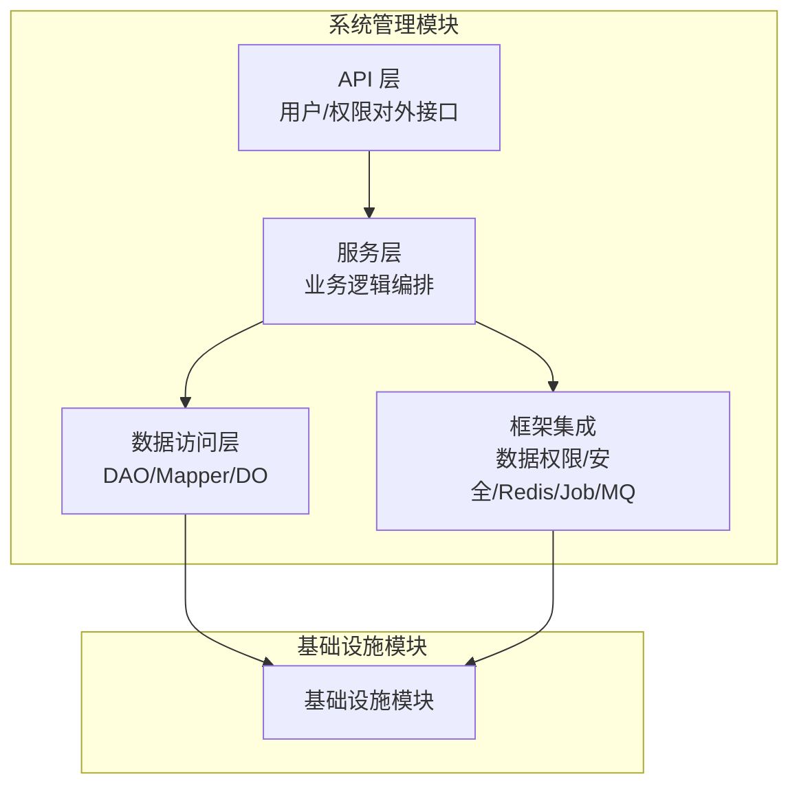
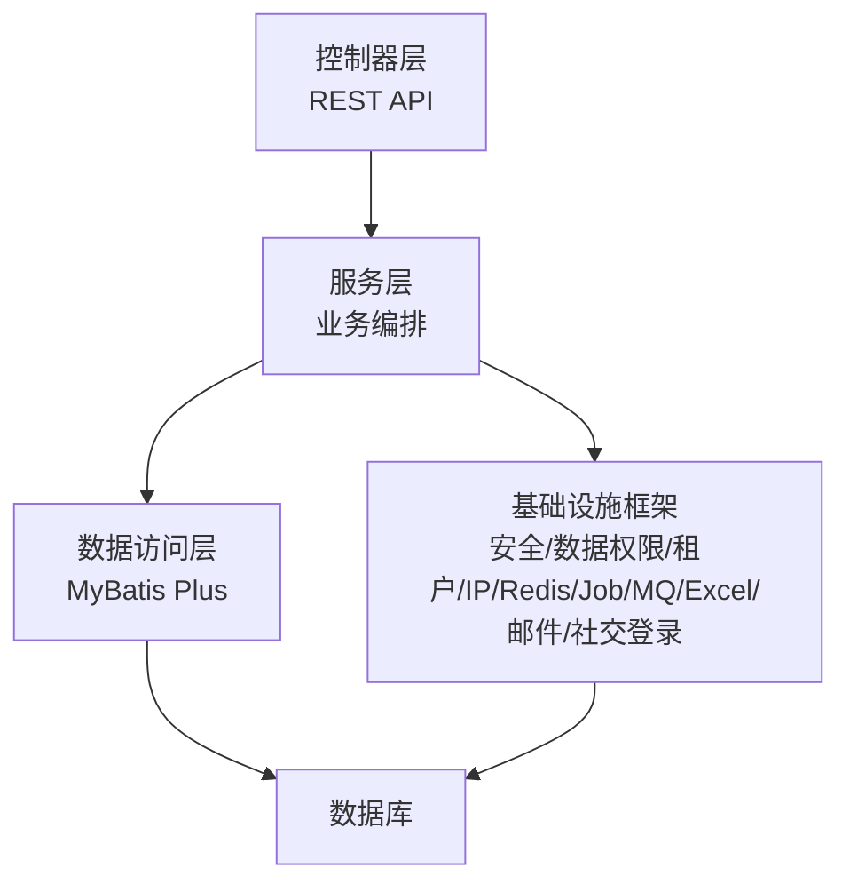
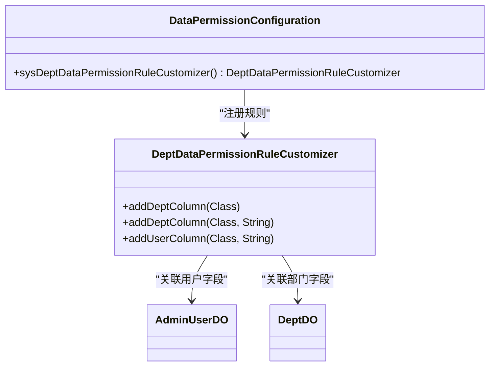
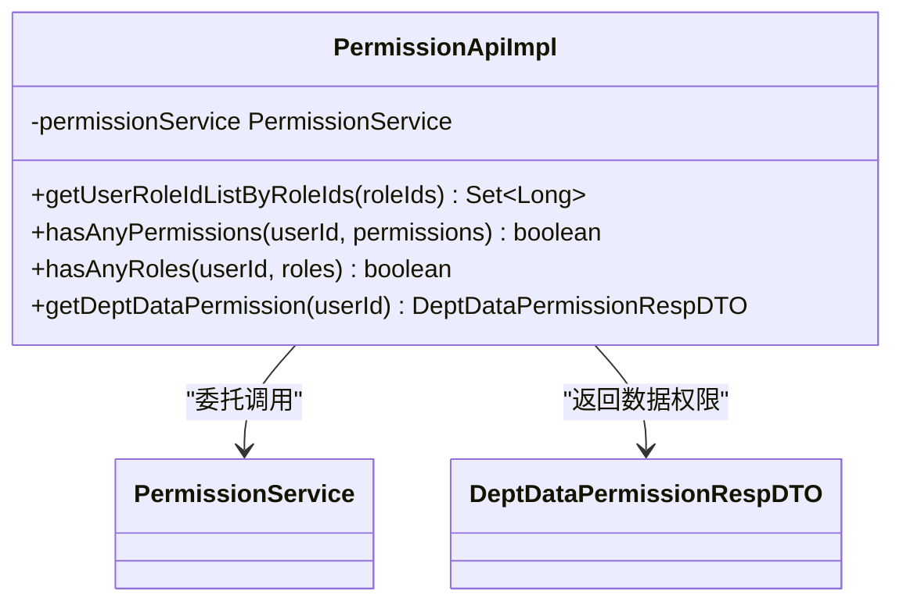
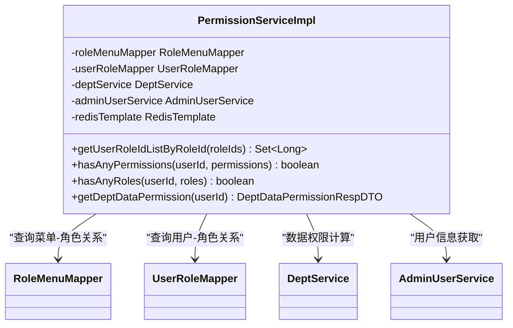
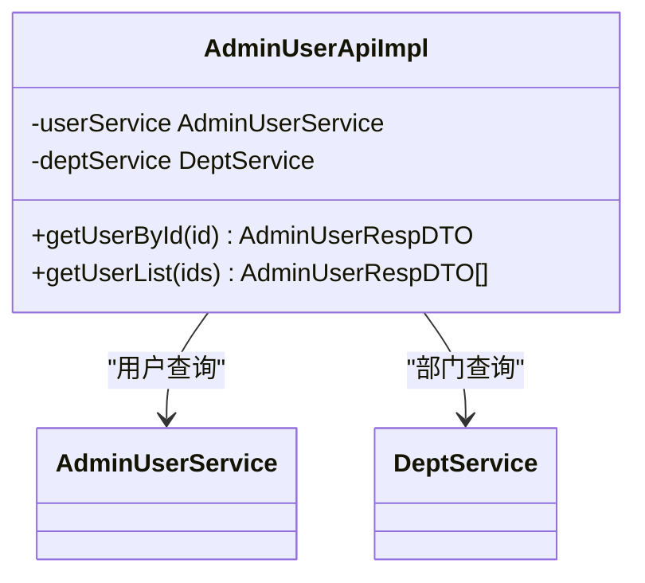
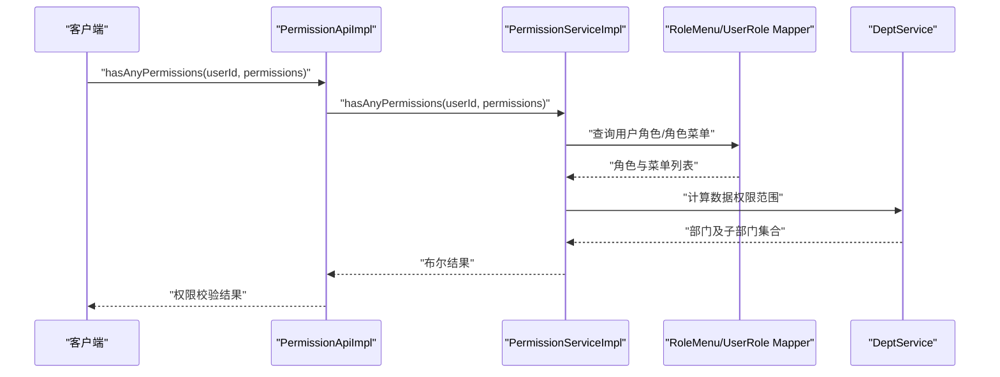
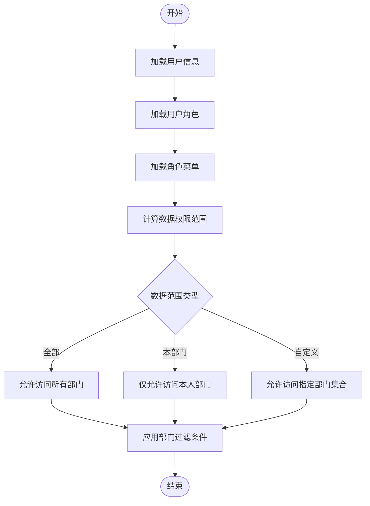
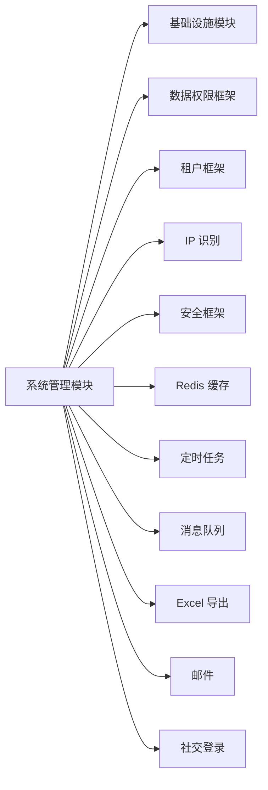

# 系统管理模块

<cite>
**本文档引用的文件**
- [yudao-module-system/pom.xml](file://backend/yudao-module-system/pom.xml)
- [DataPermissionConfiguration.java](file://backend/yudao-module-system/src/main/java/cn/iocoder/yudao/module/system/framework/datapermission/config/DataPermissionConfiguration.java)
- [AdminUserApiImpl.java](file://backend/yudao-module-system/src/main/java/cn/iocoder/yudao/module/system/api/user/AdminUserApiImpl.java)
- [PermissionApiImpl.java](file://backend/yudao-module-system/src/main/java/cn/icolor/yudao/module/system/api/permission/PermissionApiImpl.java)
- [PermissionServiceImpl.java](file://backend/yudao-module-system/src/main/java/cn/icolor/yudao/module/system/service/permission/PermissionServiceImpl.java)
- [PermissionServiceTest.java](file://backend/yudao-module-system/src/test/java/cn/icolor/yudao/module/system/service/permission/PermissionServiceTest.java)
</cite>

## 目录
1. [简介](#简介)
2. [项目结构](#项目结构)
3. [核心组件](#核心组件)
4. [架构总览](#架构总览)
5. [详细组件分析](#详细组件分析)
6. [依赖分析](#依赖分析)
7. [性能考虑](#性能考虑)
8. [故障排除指南](#故障排除指南)
9. [结论](#结论)
10. [附录](#附录)

## 简介
系统管理模块是平台的基础设施核心模块，负责统一支撑上层业务所需的通用能力，包括但不限于：
- 用户管理：用户信息维护、状态管理、密码与安全策略
- 部门管理：组织架构、层级关系、数据权限关联
- 角色权限：角色定义、菜单授权、数据范围控制
- 菜单管理：前端路由、后端接口权限映射
- 数据字典：系统级枚举与配置项的统一维护
- 操作日志：审计与合规追踪

该模块通过清晰的分层架构（控制器层、服务层、数据访问层）实现功能解耦，并深度集成基础设施框架，提供认证授权、数据权限过滤、租户隔离、IP 地址识别、定时任务、消息队列等能力。

## 项目结构
系统管理模块采用多模块聚合工程结构，核心依赖基础设施模块与其他启动器组件，形成“业务模块 + 基础设施 + 安全框架”的完整体系。

图示来源
- [yudao-module-system/pom.xml:20-122](file://backend/yudao-module-system/pom.xml#L20-L122)

章节来源
- [yudao-module-system/pom.xml:14-18](file://backend/yudao-module-system/pom.xml#L14-L18)
- [yudao-module-system/pom.xml:20-122](file://backend/yudao-module-system/pom.xml#L20-L122)

## 核心组件
系统管理模块围绕“用户、部门、角色、菜单、字典、日志”六大领域构建，配合权限与数据权限两大支撑能力，形成完整的权限治理闭环。

- 用户与部门
  - 用户：用户基本信息、状态、所属部门、角色集合
  - 部门：组织架构树、负责人、数据权限绑定
- 角色与菜单
  - 角色：角色标识、状态、数据范围（全部/本部门/自定义）
  - 菜单：前端路由与后端接口权限映射
- 数据字典与操作日志
  - 字典：系统枚举与配置项
  - 日志：登录、操作、异常等审计记录

章节来源
- [yudao-module-system/pom.xml:14-18](file://backend/yudao-module-system/pom.xml#L14-L18)

## 架构总览
系统管理模块遵循典型的三层架构与分层解耦原则：
- 控制器层：对外暴露 REST API，进行参数校验与结果封装
- 服务层：编排业务流程，处理权限判断、数据权限过滤、事务控制
- 数据访问层：基于 MyBatis Plus 进行数据持久化，支持动态数据源与分页
- 框架集成：安全框架、数据权限、租户、IP、Redis、定时任务、消息队列、Excel 导出、邮件、社交登录等

图示来源
- [yudao-module-system/pom.xml:42-121](file://backend/yudao-module-system/pom.xml#L42-L121)

章节来源
- [yudao-module-system/pom.xml:42-121](file://backend/yudao-module-system/pom.xml#L42-L121)

## 详细组件分析

### 数据权限配置组件
系统通过自定义数据权限规则，将部门与用户字段纳入数据范围过滤，确保用户只能访问其授权范围内的数据。

图示来源
- [DataPermissionConfiguration.java:14-26](file://backend/yudao-module-system/src/main/java/cn/iocoder/yudao/module/system/framework/datapermission/config/DataPermissionConfiguration.java#L14-L26)

章节来源
- [DataPermissionConfiguration.java:14-26](file://backend/yudao-module-system/src/main/java/cn/iocoder/yudao/module/system/framework/datapermission/config/DataPermissionConfiguration.java#L14-L26)

### 权限 API 组件
权限 API 提供对外查询接口，包括角色关联、权限校验、角色校验以及数据权限查询。

图示来源
- [PermissionApiImpl.java:16-42](file://backend/yudao-module-system/src/main/java/cn/icolor/yudao/module/system/api/permission/PermissionApiImpl.java#L16-L42)

章节来源
- [PermissionApiImpl.java:16-42](file://backend/yudao-module-system/src/main/java/cn/icolor/yudao/module/system/api/permission/PermissionApiImpl.java#L16-L42)

### 权限服务组件
权限服务实现角色与权限的查询、校验，以及数据权限的计算与缓存。

图示来源
- [PermissionServiceImpl.java:1-23](file://backend/yudao-module-system/src/main/java/cn/icolor/yudao/module/system/service/permission/PermissionServiceImpl.java#L1-L23)

章节来源
- [PermissionServiceImpl.java:1-23](file://backend/yudao-module-system/src/main/java/cn/icolor/yudao/module/system/service/permission/PermissionServiceImpl.java#L1-L23)

### 用户 API 组件
用户 API 提供用户信息查询与部门关联，结合数据权限注解实现自动过滤。

图示来源
- [AdminUserApiImpl.java:28-36](file://backend/yudao-module-system/src/main/java/cn/icolor/yudao/module/system/api/user/AdminUserApiImpl.java#L28-L36)

章节来源
- [AdminUserApiImpl.java:28-36](file://backend/yudao-module-system/src/main/java/cn/icolor/yudao/module/system/api/user/AdminUserApiImpl.java#L28-L36)

### 权限服务流程（序列图）
以下序列图展示权限校验的典型调用链路。

图示来源
- [PermissionApiImpl.java:22-40](file://backend/yudao-module-system/src/main/java/cn/icolor/yudao/module/system/api/permission/PermissionApiImpl.java#L22-L40)
- [PermissionServiceImpl.java:1-23](file://backend/yudao-module-system/src/main/java/cn/icolor/yudao/module/system/service/permission/PermissionServiceImpl.java#L1-L23)

章节来源
- [PermissionApiImpl.java:22-40](file://backend/yudao-module-system/src/main/java/cn/icolor/yudao/module/system/api/permission/PermissionApiImpl.java#L22-L40)
- [PermissionServiceImpl.java:1-23](file://backend/yudao-module-system/src/main/java/cn/icolor/yudao/module/system/service/permission/PermissionServiceImpl.java#L1-L23)

### 权限服务算法（流程图）
权限服务在计算数据权限时，会根据用户的角色与数据范围策略，生成可访问的部门集合，从而限制后续查询范围。

图示来源
- [PermissionServiceImpl.java:1-23](file://backend/yudao-module-system/src/main/java/cn/icolor/yudao/module/system/service/permission/PermissionServiceImpl.java#L1-L23)

章节来源
- [PermissionServiceImpl.java:1-23](file://backend/yudao-module-system/src/main/java/cn/icolor/yudao/module/system/service/permission/PermissionServiceImpl.java#L1-L23)

## 依赖分析
系统管理模块对基础设施与启动器组件存在强依赖关系，主要体现在以下方面：

- 基础设施模块：提供通用数据访问、字典、日志等基础能力
- 数据权限：提供部门维度的数据范围过滤规则
- 租户：支持多租户隔离
- IP：提供地理位置与网络信息识别
- 安全：Spring Security 集成，提供认证与授权
- Redis：缓存权限与用户会话
- Job：定时任务调度
- MQ：异步消息处理
- Excel：导出能力
- 邮件：通知与提醒
- 社交登录：第三方登录集成

图示来源
- [yudao-module-system/pom.xml:20-122](file://backend/yudao-module-system/pom.xml#L20-L122)

章节来源
- [yudao-module-system/pom.xml:20-122](file://backend/yudao-module-system/pom.xml#L20-L122)

## 性能考虑
- 数据权限过滤：通过在查询前注入部门过滤条件，避免全表扫描；建议为部门与用户主键建立索引
- 缓存策略：权限与菜单数据可缓存于 Redis，降低频繁查询成本；注意缓存失效与一致性
- 分页查询：大数据量场景下优先使用分页，避免一次性加载过多数据
- 并发控制：权限变更涉及多表更新，建议使用分布式锁或幂等设计
- 批量操作：批量删除/导入等操作应分批执行并记录进度，防止阻塞线程

## 故障排除指南
- 权限校验失败
  - 检查用户是否已分配角色与菜单
  - 核对数据范围策略是否正确
  - 查看缓存是否过期或污染
- 数据越权
  - 确认数据权限注解是否正确使用
  - 核查规则中部门与用户字段映射
- 接口报错
  - 关注服务层异常栈，定位具体 Mapper 或缓存问题
  - 结合测试用例验证边界条件与空值处理

章节来源
- [PermissionServiceTest.java:1-25](file://backend/yudao-module-system/src/test/java/cn/icolor/yudao/module/system/service/permission/PermissionServiceTest.java#L1-L25)

## 结论
系统管理模块以“用户、部门、角色、菜单、字典、日志”为核心，结合数据权限与安全框架，构建了高内聚、低耦合的权限治理体系。通过清晰的分层设计与完善的基础设施集成，模块能够稳定支撑上层复杂业务场景，并具备良好的扩展性与可维护性。

## 附录

### API 接口概览（示意）
- 权限相关
  - 查询用户拥有的角色列表
  - 校验用户是否拥有任意给定权限
  - 校验用户是否属于任意给定角色
  - 获取用户的部门数据权限范围
- 用户相关
  - 根据 ID 查询用户信息
  - 批量查询用户信息并关联部门

章节来源
- [PermissionApiImpl.java:22-40](file://backend/yudao-module-system/src/main/java/cn/icolor/yudao/module/system/api/permission/PermissionApiImpl.java#L22-L40)
- [AdminUserApiImpl.java:28-36](file://backend/yudao-module-system/src/main/java/cn/icolor/yudao/module/system/api/user/AdminUserApiImpl.java#L28-L36)

### 数据模型要点（示意）
- 用户表：用户标识、状态、所属部门、创建时间等
- 部门表：部门标识、上级部门、名称、排序、状态等
- 角色表：角色标识、数据范围（全部/本部门/自定义）、状态等
- 菜单表：菜单名称、类型、路径、权限字符串、接口方法等
- 用户-角色关联表：用户与角色的多对多关系
- 角色-菜单关联表：角色与菜单的多对多关系

### 配置与扩展点
- 数据权限规则：通过自定义规则类扩展部门与用户字段映射
- 安全策略：结合 Spring Security 自定义认证与授权策略
- 缓存策略：针对高频查询配置合适的缓存键与过期策略
- 多租户：按租户隔离数据与权限
- 社交登录：接入第三方登录，扩展用户来源