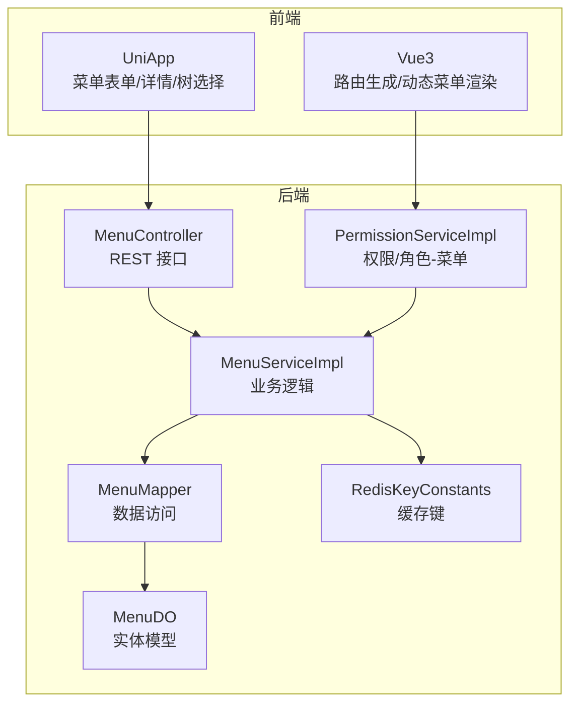
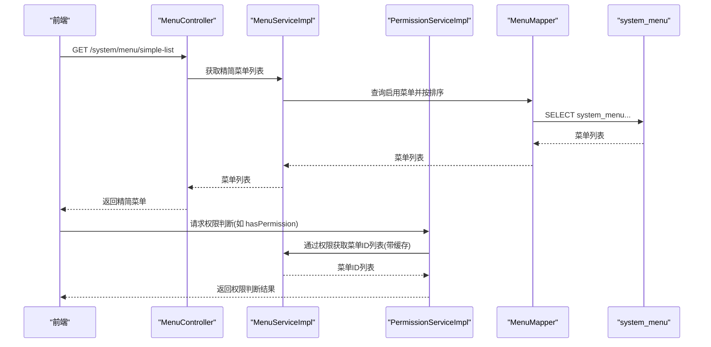
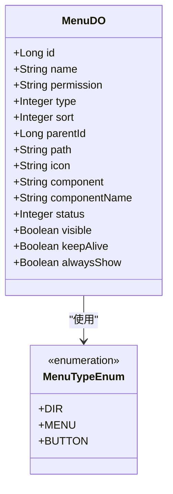
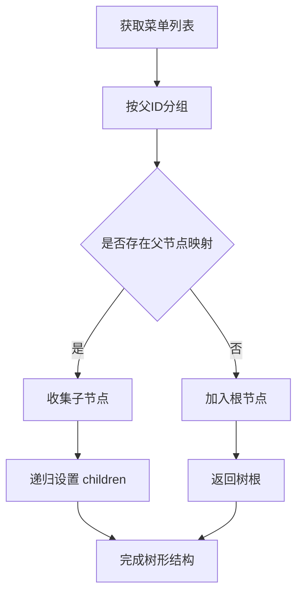
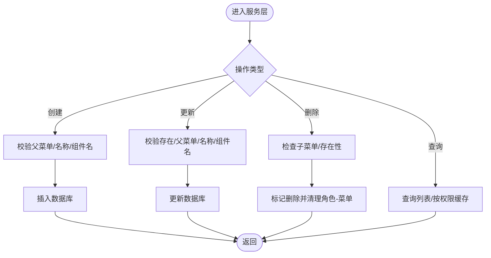
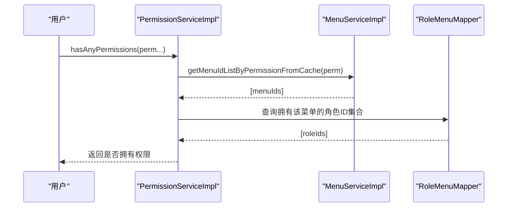
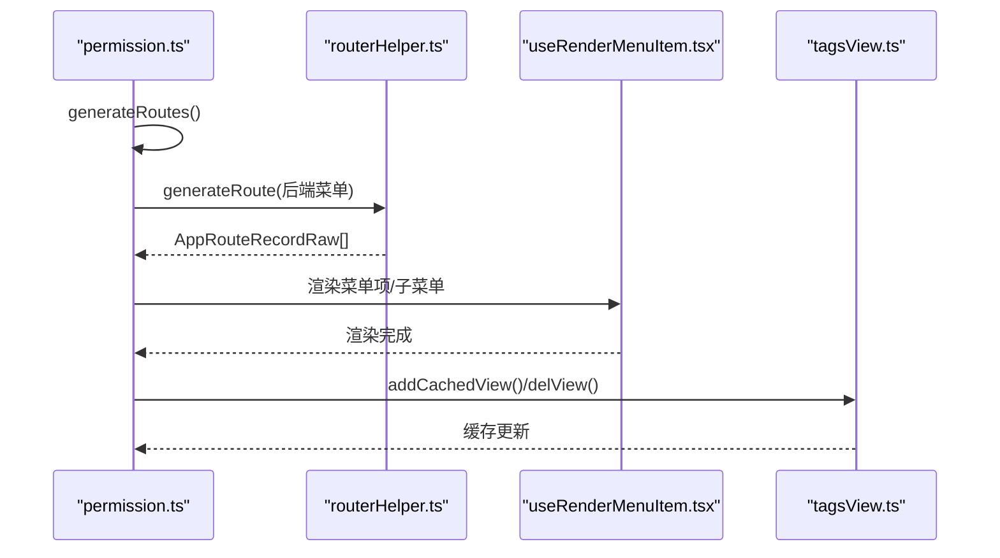
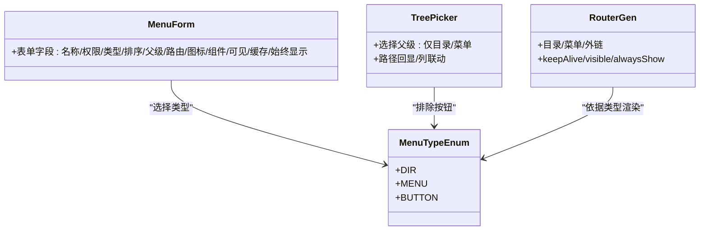
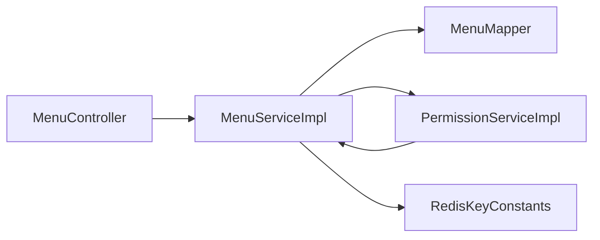

# 菜单管理

<cite>
**本文引用的文件**
- [MenuDO.java](file://backend/yudao-module-system/src/main/java/cn/iocoder/yudao/module/system/dal/dataobject/permission/MenuDO.java)
- [MenuTypeEnum.java](file://backend/yudao-module-system/src/main/java/cn/iocoder/yudao/module/system/enums/permission/MenuTypeEnum.java)
- [MenuMapper.java](file://backend/yudao-module-system/src/main/java/cn/iocoder/yudao/module/system/dal/mysql/permission/MenuMapper.java)
- [MenuServiceImpl.java](file://backend/yudao-module-system/src/main/java/cn/iocoder/yudao/module/system/service/permission/MenuServiceImpl.java)
- [MenuController.java](file://backend/yudao-module-system/src/main/java/cn/iocoder/yudao/module/system/controller/admin/permission/MenuController.java)
- [MenuRespVO.java](file://backend/yudao-module-system/src/main/java/cn/iocoder/yudao/module/system/controller/admin/permission/vo/menu/MenuRespVO.java)
- [MenuSaveVO.java](file://backend/yudao-module-system/src/main/java/cn/iocoder/yudao/module/system/controller/admin/permission/vo/menu/MenuSaveVO.java)
- [PermissionServiceImpl.java](file://backend/yudao-module-system/src/main/java/cn/iocoder/yudao/module/system/service/permission/PermissionServiceImpl.java)
- [RedisKeyConstants.java](file://backend/yudao-module-system/src/main/java/cn/iocoder/yudao/module/system/dal/redis/RedisKeyConstants.java)
- [system_menu 表结构(MySQL)](file://backend/sql/mysql/ruoyi-vue-pro.sql)
- [system_menu 表结构(PostgreSQL)](file://backend/sql/postgresql/ruoyi-vue-pro.sql)
- [system_menu 表结构(SQLServer)](file://backend/sql/sqlserver/ruoyi-vue-pro.sql)
- [menu-picker.vue](file://frontend/admin-uniapp/src/pages-system/menu/form/components/menu-picker.vue)
- [index.vue](file://frontend/admin-uniapp/src/pages-system/menu/detail/index.vue)
- [tree.ts](file://frontend/admin-uniapp/src/utils/tree.ts)
- [routerHelper.ts](file://frontend/admin-vue3/src/utils/routerHelper.ts)
- [useRenderMenuItem.tsx](file://frontend/admin-vue3/src/layout/components/Menu/src/components/useRenderMenuItem.tsx)
- [permission.ts](file://frontend/admin-vue3/src/store/modules/permission.ts)
- [tagsView.ts](file://frontend/admin-vue3/src/store/modules/tagsView.ts)
</cite>

## 目录
1. [简介](#简介)
2. [项目结构](#项目结构)
3. [核心组件](#核心组件)
4. [架构总览](#架构总览)
5. [详细组件分析](#详细组件分析)
6. [依赖分析](#依赖分析)
7. [性能考虑](#性能考虑)
8. [故障排查指南](#故障排查指南)
9. [结论](#结论)
10. [附录](#附录)

## 简介
本文件系统化梳理“菜单管理”功能，覆盖菜单实体模型、树形结构实现、服务层逻辑、权限控制、前端路由生成与动态加载、缓存策略与最佳实践。目标读者包括后端开发、前端开发与产品/测试人员。

## 项目结构
菜单管理涉及后端系统模块与前端工程两部分：
- 后端：系统模块提供菜单的增删改查、树形查询、权限映射、缓存与多租户过滤；数据库持久化使用 system_menu 表。
- 前端：UniApp 与 Vue3 两套前端分别提供菜单表单、详情、树形选择器、路由生成与动态渲染。

**图表来源**
- [MenuController.java:30-97](file://backend/yudao-module-system/src/main/java/cn/iocoder/yudao/module/system/controller/admin/permission/MenuController.java#L30-L97)
- [MenuServiceImpl.java:40-307](file://backend/yudao-module-system/src/main/java/cn/iocoder/yudao/module/system/service/permission/MenuServiceImpl.java#L40-L307)
- [MenuMapper.java:12-36](file://backend/yudao-module-system/src/main/java/cn/iocoder/yudao/module/system/dal/mysql/permission/MenuMapper.java#L12-L36)
- [MenuDO.java:23-109](file://backend/yudao-module-system/src/main/java/cn/iocoder/yudao/module/system/dal/dataobject/permission/MenuDO.java#L23-L109)
- [PermissionServiceImpl.java:44-341](file://backend/yudao-module-system/src/main/java/cn/iocoder/yudao/module/system/service/permission/PermissionServiceImpl.java#L44-L341)
- [RedisKeyConstants.java:10-50](file://backend/yudao-module-system/src/main/java/cn/iocoder/yudao/module/system/dal/redis/RedisKeyConstants.java#L10-L50)

**章节来源**
- [MenuController.java:30-97](file://backend/yudao-module-system/src/main/java/cn/iocoder/yudao/module/system/controller/admin/permission/MenuController.java#L30-L97)
- [MenuServiceImpl.java:40-307](file://backend/yudao-module-system/src/main/java/cn/iocoder/yudao/module/system/service/permission/MenuServiceImpl.java#L40-L307)
- [MenuMapper.java:12-36](file://backend/yudao-module-system/src/main/java/cn/iocoder/yudao/module/system/dal/mysql/permission/MenuMapper.java#L12-L36)
- [MenuDO.java:23-109](file://backend/yudao-module-system/src/main/java/cn/iocoder/yudao/module/system/dal/dataobject/permission/MenuDO.java#L23-L109)
- [PermissionServiceImpl.java:44-341](file://backend/yudao-module-system/src/main/java/cn/iocoder/yudao/module/system/service/permission/PermissionServiceImpl.java#L44-L341)
- [RedisKeyConstants.java:10-50](file://backend/yudao-module-system/src/main/java/cn/iocoder/yudao/module/system/dal/redis/RedisKeyConstants.java#L10-L50)

## 核心组件
- 实体模型：MenuDO 描述菜单字段，包含名称、权限标识、类型、排序、父级、路由、图标、组件、可见性、缓存、始终显示等。
- 类型枚举：MenuTypeEnum 定义目录、菜单、按钮三类。
- 数据访问：MenuMapper 提供按条件查询、去重校验、组件名唯一性等。
- 服务实现：MenuServiceImpl 实现菜单 CRUD、父子校验、组件名校验、禁用菜单过滤、基于权限的菜单ID缓存、多租户过滤。
- 控制器：MenuController 提供创建、更新、删除、列表、精简列表、详情等接口。
- 权限服务：PermissionServiceImpl 将菜单与角色关联，提供权限判断、角色-菜单缓存维护。
- 前端：UniApp 提供菜单表单与详情页；Vue3 提供路由生成、动态菜单渲染与标签页缓存。

**章节来源**
- [MenuDO.java:23-109](file://backend/yudao-module-system/src/main/java/cn/iocoder/yudao/module/system/dal/dataobject/permission/MenuDO.java#L23-L109)
- [MenuTypeEnum.java:13-25](file://backend/yudao-module-system/src/main/java/cn/iocoder/yudao/module/system/enums/permission/MenuTypeEnum.java#L13-L25)
- [MenuMapper.java:12-36](file://backend/yudao-module-system/src/main/java/cn/iocoder/yudao/module/system/dal/mysql/permission/MenuMapper.java#L12-L36)
- [MenuServiceImpl.java:40-307](file://backend/yudao-module-system/src/main/java/cn/iocoder/yudao/module/system/service/permission/MenuServiceImpl.java#L40-L307)
- [MenuController.java:30-97](file://backend/yudao-module-system/src/main/java/cn/iocoder/yudao/module/system/controller/admin/permission/MenuController.java#L30-L97)
- [PermissionServiceImpl.java:44-341](file://backend/yudao-module-system/src/main/java/cn/iocoder/yudao/module/system/service/permission/PermissionServiceImpl.java#L44-L341)

## 架构总览
后端通过控制器暴露菜单管理 API，服务层负责业务规则与缓存，数据层访问数据库；前端通过接口获取菜单树与权限菜单，动态生成路由并渲染菜单。

**图表来源**
- [MenuController.java:78-87](file://backend/yudao-module-system/src/main/java/cn/iocoder/yudao/module/system/controller/admin/permission/MenuController.java#L78-L87)
- [MenuServiceImpl.java:185-209](file://backend/yudao-module-system/src/main/java/cn/iocoder/yudao/module/system/service/permission/MenuServiceImpl.java#L185-L209)
- [PermissionServiceImpl.java:93-111](file://backend/yudao-module-system/src/main/java/cn/iocoder/yudao/module/system/service/permission/PermissionServiceImpl.java#L93-L111)

## 详细组件分析

### 菜单实体模型设计
- 字段覆盖：名称、权限标识、类型、排序、父级、路由地址、图标、组件路径、组件名、状态、可见性、缓存、始终显示等。
- 关键约束：按钮类型自动清空非适用字段；组件名唯一性校验；父级必须为目录或菜单类型。
- 多租户：实体标注忽略租户隔离，菜单列表在服务层按套餐过滤。

**图表来源**
- [MenuDO.java:23-109](file://backend/yudao-module-system/src/main/java/cn/iocoder/yudao/module/system/dal/dataobject/permission/MenuDO.java#L23-L109)
- [MenuTypeEnum.java:13-25](file://backend/yudao-module-system/src/main/java/cn/iocoder/yudao/module/system/enums/permission/MenuTypeEnum.java#L13-L25)

**章节来源**
- [MenuDO.java:23-109](file://backend/yudao-module-system/src/main/java/cn/iocoder/yudao/module/system/dal/dataobject/permission/MenuDO.java#L23-L109)
- [MenuTypeEnum.java:13-25](file://backend/yudao-module-system/src/main/java/cn/iocoder/yudao/module/system/enums/permission/MenuTypeEnum.java#L13-L25)

### 菜单树形结构实现
- 后端：通过父ID与排序字段组织树形；提供“精简列表”接口，仅返回启用菜单，便于前端选择与渲染。
- 前端：提供树形选择器与通用树工具，支持构造树、查找子节点、路径拼接等。

**图表来源**
- [MenuServiceImpl.java:185-188](file://backend/yudao-module-system/src/main/java/cn/iocoder/yudao/module/system/service/permission/MenuServiceImpl.java#L185-L188)
- [tree.ts:19-73](file://frontend/admin-uniapp/src/utils/tree.ts#L19-L73)

**章节来源**
- [MenuServiceImpl.java:185-188](file://backend/yudao-module-system/src/main/java/cn/iocoder/yudao/module/system/service/permission/MenuServiceImpl.java#L185-L188)
- [tree.ts:19-73](file://frontend/admin-uniapp/src/utils/tree.ts#L19-L73)

### 菜单服务层逻辑
- 创建/更新/删除：执行父子关系校验、名称与组件名唯一性校验、删除前检查是否存在子菜单。
- 缓存策略：基于权限的菜单ID列表缓存，变更时清空；角色-菜单缓存同步失效。
- 多租户：在查询时根据套餐过滤可用菜单。
- 禁用菜单过滤：递归判断父级禁用以决定是否显示。

**图表来源**
- [MenuServiceImpl.java:50-123](file://backend/yudao-module-system/src/main/java/cn/iocoder/yudao/module/system/service/permission/MenuServiceImpl.java#L50-L123)
- [MenuServiceImpl.java:185-209](file://backend/yudao-module-system/src/main/java/cn/iocoder/yudao/module/system/service/permission/MenuServiceImpl.java#L185-L209)

**章节来源**
- [MenuServiceImpl.java:50-123](file://backend/yudao-module-system/src/main/java/cn/iocoder/yudao/module/system/service/permission/MenuServiceImpl.java#L50-L123)
- [MenuServiceImpl.java:185-209](file://backend/yudao-module-system/src/main/java/cn/iocoder/yudao/module/system/service/permission/MenuServiceImpl.java#L185-L209)

### 菜单权限控制
- 权限标识：按钮类型使用 permission 字段，配合后端注解与前端标签控制按钮可见性。
- 角色-菜单：通过角色-菜单关联表建立映射，提供批量授权与删除。
- 权限判断：根据用户角色集合与菜单ID集合求交集判断是否拥有权限。

**图表来源**
- [PermissionServiceImpl.java:93-111](file://backend/yudao-module-system/src/main/java/cn/iocoder/yudao/module/system/service/permission/PermissionServiceImpl.java#L93-L111)
- [MenuServiceImpl.java:190-195](file://backend/yudao-module-system/src/main/java/cn/iocoder/yudao/module/system/service/permission/MenuServiceImpl.java#L190-L195)

**章节来源**
- [PermissionServiceImpl.java:93-111](file://backend/yudao-module-system/src/main/java/cn/iocoder/yudao/module/system/service/permission/PermissionServiceImpl.java#L93-L111)
- [MenuServiceImpl.java:190-195](file://backend/yudao-module-system/src/main/java/cn/iocoder/yudao/module/system/service/permission/MenuServiceImpl.java#L190-L195)

### 前端路由配置与动态加载
- 路由生成：根据后端返回的菜单元数据生成路由，目录/菜单/外链分别处理；支持 keepAlive、visible、alwaysShow 等配置。
- 动态渲染：根据用户权限动态生成可访问路由，支持扁平化多级路由。
- 标签页缓存：根据 noCache 决定是否缓存组件名。

**图表来源**
- [permission.ts:34-80](file://frontend/admin-vue3/src/store/modules/permission.ts#L34-L80)
- [routerHelper.ts:64-142](file://frontend/admin-vue3/src/utils/routerHelper.ts#L64-L142)
- [useRenderMenuItem.tsx:32-50](file://frontend/admin-vue3/src/layout/components/Menu/src/components/useRenderMenuItem.tsx#L32-L50)
- [tagsView.ts:63-77](file://frontend/admin-vue3/src/store/modules/tagsView.ts#L63-L77)

**章节来源**
- [permission.ts:34-80](file://frontend/admin-vue3/src/store/modules/permission.ts#L34-L80)
- [routerHelper.ts:64-142](file://frontend/admin-vue3/src/utils/routerHelper.ts#L64-L142)
- [useRenderMenuItem.tsx:32-50](file://frontend/admin-vue3/src/layout/components/Menu/src/components/useRenderMenuItem.tsx#L32-L50)
- [tagsView.ts:63-77](file://frontend/admin-vue3/src/store/modules/tagsView.ts#L63-L77)

### 菜单类型分类与前端集成
- 类型定义：目录、菜单、按钮；按钮类型不参与路由渲染，仅用于权限标识。
- 前端集成：菜单表单/详情页、树形选择器、路由生成与渲染、标签页缓存策略。

**图表来源**
- [MenuTypeEnum.java:13-25](file://backend/yudao-module-system/src/main/java/cn/iocoder/yudao/module/system/enums/permission/MenuTypeEnum.java#L13-L25)
- [MenuSaveVO.java:12-65](file://backend/yudao-module-system/src/main/java/cn/iocoder/yudao/module/system/controller/admin/permission/vo/menu/MenuSaveVO.java#L12-L65)
- [menu-picker.vue:50-138](file://frontend/admin-uniapp/src/pages-system/menu/form/components/menu-picker.vue#L50-L138)
- [routerHelper.ts:64-142](file://frontend/admin-vue3/src/utils/routerHelper.ts#L64-L142)

**章节来源**
- [MenuTypeEnum.java:13-25](file://backend/yudao-module-system/src/main/java/cn/iocoder/yudao/module/system/enums/permission/MenuTypeEnum.java#L13-L25)
- [MenuSaveVO.java:12-65](file://backend/yudao-module-system/src/main/java/cn/iocoder/yudao/module/system/controller/admin/permission/vo/menu/MenuSaveVO.java#L12-L65)
- [menu-picker.vue:50-138](file://frontend/admin-uniapp/src/pages-system/menu/form/components/menu-picker.vue#L50-L138)
- [routerHelper.ts:64-142](file://frontend/admin-vue3/src/utils/routerHelper.ts#L64-L142)

## 依赖分析
- 组件耦合：控制器依赖服务；服务依赖数据访问与权限服务；前端依赖后端接口与缓存键常量。
- 外部依赖：Redis 缓存键用于权限与角色-菜单缓存；数据库 system_menu 表存储菜单元数据。

**图表来源**
- [MenuController.java:30-97](file://backend/yudao-module-system/src/main/java/cn/iocoder/yudao/module/system/controller/admin/permission/MenuController.java#L30-L97)
- [MenuServiceImpl.java:40-307](file://backend/yudao-module-system/src/main/java/cn/iocoder/yudao/module/system/service/permission/MenuServiceImpl.java#L40-L307)
- [MenuMapper.java:12-36](file://backend/yudao-module-system/src/main/java/cn/iocoder/yudao/module/system/dal/mysql/permission/MenuMapper.java#L12-L36)
- [PermissionServiceImpl.java:44-341](file://backend/yudao-module-system/src/main/java/cn/iocoder/yudao/module/system/service/permission/PermissionServiceImpl.java#L44-L341)
- [RedisKeyConstants.java:10-50](file://backend/yudao-module-system/src/main/java/cn/iocoder/yudao/module/system/dal/redis/RedisKeyConstants.java#L10-L50)

**章节来源**
- [MenuController.java:30-97](file://backend/yudao-module-system/src/main/java/cn/iocoder/yudao/module/system/controller/admin/permission/MenuController.java#L30-L97)
- [MenuServiceImpl.java:40-307](file://backend/yudao-module-system/src/main/java/cn/iocoder/yudao/module/system/service/permission/MenuServiceImpl.java#L40-L307)
- [MenuMapper.java:12-36](file://backend/yudao-module-system/src/main/java/cn/iocoder/yudao/module/system/dal/mysql/permission/MenuMapper.java#L12-L36)
- [PermissionServiceImpl.java:44-341](file://backend/yudao-module-system/src/main/java/cn/iocoder/yudao/module/system/service/permission/PermissionServiceImpl.java#L44-L341)
- [RedisKeyConstants.java:10-50](file://backend/yudao-module-system/src/main/java/cn/iocoder/yudao/module/system/dal/redis/RedisKeyConstants.java#L10-L50)

## 性能考虑
- 缓存策略：基于权限的菜单ID列表缓存，减少频繁查询；角色-菜单与用户-角色缓存同步失效。
- 查询优化：按父ID与状态过滤，排序稳定；树形构造使用一次遍历+映射，复杂度 O(n)。
- 前端渲染：路由扁平化、按需缓存组件名，避免不必要的 keep-alive。

[本节为通用建议，无需特定文件引用]

## 故障排查指南
- 创建失败：检查父菜单是否存在、名称在同一父级下是否重复、组件名是否重复。
- 删除失败：若存在子菜单将抛出“存在子菜单”的错误。
- 权限无效：确认权限标识与角色-菜单映射是否正确，缓存是否已刷新。
- 前端不显示：检查菜单状态、可见性、alwaysShow 配置与路由生成逻辑。

**章节来源**
- [MenuServiceImpl.java:221-288](file://backend/yudao-module-system/src/main/java/cn/iocoder/yudao/module/system/service/permission/MenuServiceImpl.java#L221-L288)
- [MenuServiceImpl.java:88-123](file://backend/yudao-module-system/src/main/java/cn/iocoder/yudao/module/system/service/permission/MenuServiceImpl.java#L88-L123)
- [PermissionServiceImpl.java:133-181](file://backend/yudao-module-system/src/main/java/cn/iocoder/yudao/module/system/service/permission/PermissionServiceImpl.java#L133-L181)

## 结论
菜单管理通过清晰的实体模型、严格的校验规则、完善的缓存与权限体系，结合前后端协同的动态路由生成，实现了灵活、安全、高性能的菜单管理能力。建议在实际落地中遵循类型规范、权限最小化原则与缓存一致性策略。

[本节为总结，无需特定文件引用]

## 附录

### 菜单管理 API 接口清单
- 创建菜单
  - 方法：POST
  - 路径：/system/menu/create
  - 权限：system:menu:create
  - 请求体：MenuSaveVO
  - 返回：菜单ID
- 修改菜单
  - 方法：PUT
  - 路径：/system/menu/update
  - 权限：system:menu:update
  - 请求体：MenuSaveVO
  - 返回：true
- 删除菜单
  - 方法：DELETE
  - 路径：/system/menu/delete
  - 权限：system:menu:delete
  - 查询参数：id
  - 返回：true
- 批量删除菜单
  - 方法：DELETE
  - 路径：/system/menu/delete-list
  - 权限：system:menu:delete
  - 查询参数：ids
  - 返回：true
- 获取菜单列表
  - 方法：GET
  - 路径：/system/menu/list
  - 权限：system:menu:query
  - 查询参数：name、status
  - 返回：MenuRespVO 列表（按 sort 排序）
- 获取菜单精简列表
  - 方法：GET
  - 路径：/system/menu/list-all-simple 或 /system/menu/simple-list
  - 返回：MenuSimpleRespVO 列表（仅启用，按 sort 排序）
- 获取菜单详情
  - 方法：GET
  - 路径：/system/menu/get
  - 权限：system:menu:query
  - 查询参数：id
  - 返回：MenuRespVO

**章节来源**
- [MenuController.java:35-95](file://backend/yudao-module-system/src/main/java/cn/iocoder/yudao/module/system/controller/admin/permission/MenuController.java#L35-L95)
- [MenuRespVO.java:13-69](file://backend/yudao-module-system/src/main/java/cn/iocoder/yudao/module/system/controller/admin/permission/vo/menu/MenuRespVO.java#L13-L69)
- [MenuSaveVO.java:12-65](file://backend/yudao-module-system/src/main/java/cn/iocoder/yudao/module/system/controller/admin/permission/vo/menu/MenuSaveVO.java#L12-L65)

### 菜单实体字段说明（摘自数据库与实体）
- 字段：id、name、permission、type、sort、parentId、path、icon、component、componentName、status、visible、keepAlive、alwaysShow、creator、create_time、updater、update_time、deleted
- 说明：type 对应目录/菜单/按钮；path 支持外链；component 与 componentName 用于前端路由组件映射；visible/keepAlive/alwaysShow 控制前端展示与缓存行为。

**章节来源**
- [system_menu 表结构(MySQL):1487-1489](file://backend/sql/mysql/ruoyi-vue-pro.sql#L1487-L1489)
- [system_menu 表结构(PostgreSQL):1758-1787](file://backend/sql/postgresql/ruoyi-vue-pro.sql#L1758-L1787)
- [system_menu 表结构(SQLServer):4271-4304](file://backend/sql/sqlserver/ruoyi-vue-pro.sql#L4271-L4304)
- [MenuDO.java:33-109](file://backend/yudao-module-system/src/main/java/cn/iocoder/yudao/module/system/dal/dataobject/permission/MenuDO.java#L33-L109)

### 前端菜单表单与详情关键点
- 表单字段：名称、权限标识（按钮）、类型、排序、父级（树形选择器，排除按钮）、路由、图标、组件、状态、可见、缓存、始终显示。
- 详情页：支持查看父级名称、编辑与删除操作。

**章节来源**
- [MenuSaveVO.java:12-65](file://backend/yudao-module-system/src/main/java/cn/iocoder/yudao/module/system/controller/admin/permission/vo/menu/MenuSaveVO.java#L12-L65)
- [index.vue:90-110](file://frontend/admin-uniapp/src/pages-system/menu/detail/index.vue#L90-L110)
- [menu-picker.vue:50-138](file://frontend/admin-uniapp/src/pages-system/menu/form/components/menu-picker.vue#L50-L138)