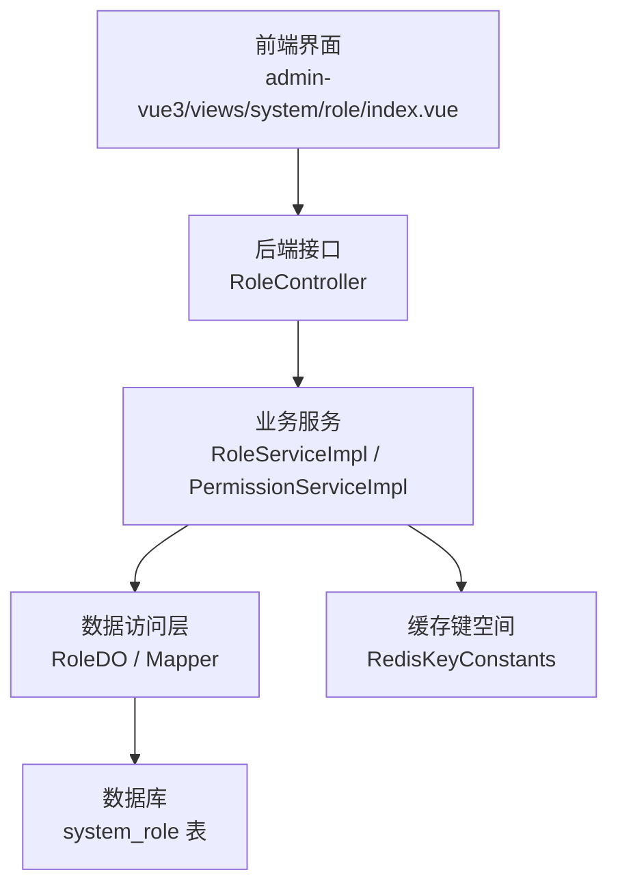
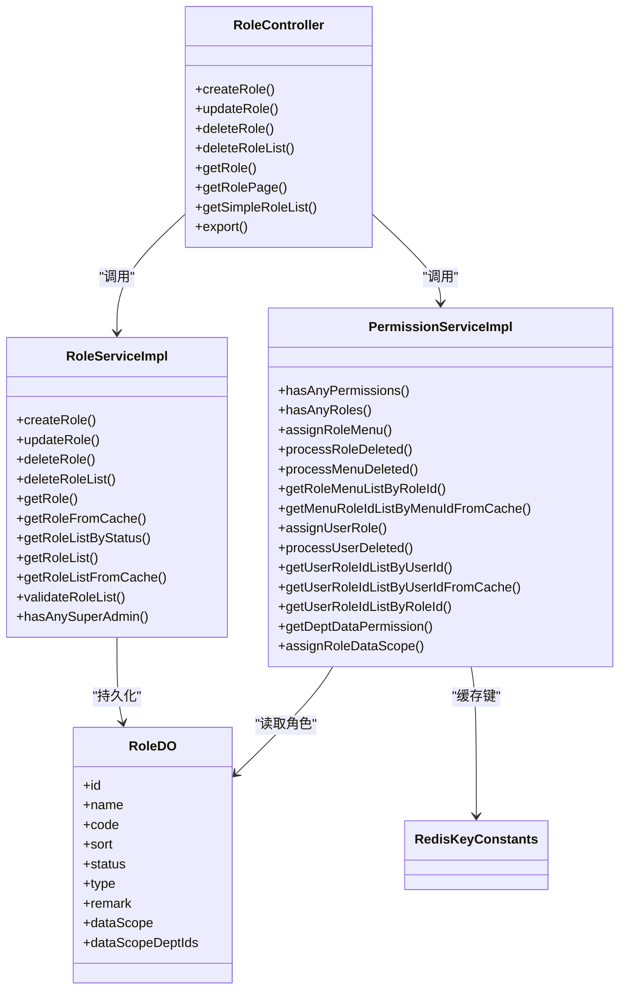
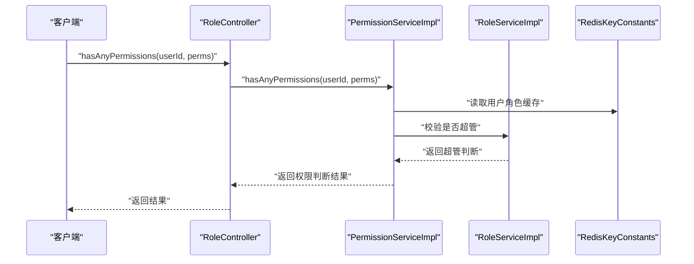
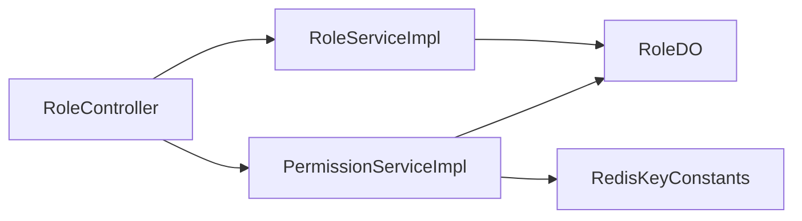

# 角色权限管理

<cite>
**本文引用的文件**
- [RoleController.java](file://backend/yudao-module-system/src/main/java/cn/iocoder/yudao/module/system/controller/admin/permission/RoleController.java)
- [RoleServiceImpl.java](file://backend/yudao-module-system/src/main/java/cn/iocoder/yudao/module/system/service/permission/RoleServiceImpl.java)
- [PermissionServiceImpl.java](file://backend/yudao-module-system/src/main/java/cn/iocoder/yudao/module/system/service/permission/PermissionServiceImpl.java)
- [RoleDO.java](file://backend/yudao-module-system/src/main/java/cn/iocoder/yudao/module/system/dal/dataobject/permission/RoleDO.java)
- [RedisKeyConstants.java](file://backend/yudao-module-system/src/main/java/cn/iocoder/yudao/module/system/dal/redis/RedisKeyConstants.java)
- [RoleCodeEnum.java](file://backend/yudao-module-system/src/main/java/cn/iocoder/yudao/module/system/enums/permission/RoleCodeEnum.java)
- [DataScopeEnum.java](file://backend/yudao-module-system/src/main/java/cn/iocoder/yudao/module/system/enums/permission/DataScopeEnum.java)
- [index.vue](file://frontend/admin-vue3/src/views/system/role/index.vue)
- [ruoyi-vue-pro.sql](file://backend/sql/postgresql/ruoyi-vue-pro.sql)
</cite>

## 目录
1. [简介](#简介)
2. [项目结构](#项目结构)
3. [核心组件](#核心组件)
4. [架构总览](#架构总览)
5. [详细组件分析](#详细组件分析)
6. [依赖分析](#依赖分析)
7. [性能考量](#性能考量)
8. [故障排查指南](#故障排查指南)
9. [结论](#结论)
10. [附录](#附录)

## 简介
本文件系统化梳理角色权限管理模块的设计与实现，覆盖角色定义、权限分配、角色用户管理、权限验证机制、菜单与数据权限关联、角色继承与超管策略、权限表达式解析与动态判断、权限缓存策略，以及完整的角色权限 API 接口规范。文档同时提供最佳实践与安全建议，帮助开发者与运维人员高效理解并维护该模块。

## 项目结构
角色权限管理位于后端 yudao-module-system 模块，前端 admin-vue3 提供可视化界面。数据库脚本定义了角色表结构，Redis 键空间用于缓存优化。

图表来源
- [index.vue:1-300](file://frontend/admin-vue3/src/views/system/role/index.vue#L1-L300)
- [RoleController.java:33-112](file://backend/yudao-module-system/src/main/java/cn/iocoder/yudao/module/system/controller/admin/permission/RoleController.java#L33-L112)
- [RoleServiceImpl.java:44-275](file://backend/yudao-module-system/src/main/java/cn/iocoder/yudao/module/system/service/permission/RoleServiceImpl.java#L44-L275)
- [PermissionServiceImpl.java:44-342](file://backend/yudao-module-system/src/main/java/cn/iocoder/yudao/module/system/service/permission/PermissionServiceImpl.java#L44-L342)
- [RedisKeyConstants.java:10-111](file://backend/yudao-module-system/src/main/java/cn/iocoder/yudao/module/system/dal/redis/RedisKeyConstants.java#L10-L111)
- [ruoyi-vue-pro.sql:3252-3281](file://backend/sql/postgresql/ruoyi-vue-pro.sql#L3252-L3281)

章节来源
- [index.vue:1-300](file://frontend/admin-vue3/src/views/system/role/index.vue#L1-L300)
- [RoleController.java:33-112](file://backend/yudao-module-system/src/main/java/cn/iocoder/yudao/module/system/controller/admin/permission/RoleController.java#L33-L112)
- [RoleServiceImpl.java:44-275](file://backend/yudao-module-system/src/main/java/cn/iocoder/yudao/module/system/service/permission/RoleServiceImpl.java#L44-L275)
- [PermissionServiceImpl.java:44-342](file://backend/yudao-module-system/src/main/java/cn/iocoder/yudao/module/system/service/permission/PermissionServiceImpl.java#L44-L342)
- [RedisKeyConstants.java:10-111](file://backend/yudao-module-system/src/main/java/cn/iocoder/yudao/module/system/dal/redis/RedisKeyConstants.java#L10-L111)
- [ruoyi-vue-pro.sql:3252-3281](file://backend/sql/postgresql/ruoyi-vue-pro.sql#L3252-L3281)

## 核心组件
- 角色实体模型：RoleDO，承载角色基础属性、状态、类型、数据范围与指定部门集合。
- 角色服务：RoleServiceImpl，负责角色 CRUD、缓存、角色校验与批量校验。
- 权限服务：PermissionServiceImpl，负责权限判断、角色-菜单授权、用户-角色授权、数据权限计算。
- 控制器：RoleController，暴露角色管理 API，结合 Spring Security 注解进行权限拦截。
- 前端界面：index.vue，提供角色列表、搜索、导出、菜单权限与数据权限分配入口。
- 缓存键空间：RedisKeyConstants，统一管理角色、用户角色、菜单角色、权限菜单等缓存键。
- 枚举：RoleCodeEnum（角色标识）、DataScopeEnum（数据范围）。

章节来源
- [RoleDO.java:17-79](file://backend/yudao-module-system/src/main/java/cn/iocoder/yudao/module/system/dal/dataobject/permission/RoleDO.java#L17-L79)
- [RoleServiceImpl.java:44-275](file://backend/yudao-module-system/src/main/java/cn/iocoder/yudao/module/system/service/permission/RoleServiceImpl.java#L44-L275)
- [PermissionServiceImpl.java:44-342](file://backend/yudao-module-system/src/main/java/cn/iocoder/yudao/module/system/service/permission/PermissionServiceImpl.java#L44-L342)
- [RoleController.java:33-112](file://backend/yudao-module-system/src/main/java/cn/iocoder/yudao/module/system/controller/admin/permission/RoleController.java#L33-L112)
- [index.vue:1-300](file://frontend/admin-vue3/src/views/system/role/index.vue#L1-L300)
- [RedisKeyConstants.java:10-111](file://backend/yudao-module-system/src/main/java/cn/iocoder/yudao/module/system/dal/redis/RedisKeyConstants.java#L10-L111)
- [RoleCodeEnum.java:10-33](file://backend/yudao-module-system/src/main/java/cn/iocoder/yudao/module/system/enums/permission/RoleCodeEnum.java#L10-L33)
- [DataScopeEnum.java:16-41](file://backend/yudao-module-system/src/main/java/cn/iocoder/yudao/module/system/enums/permission/DataScopeEnum.java#L16-L41)

## 架构总览
角色权限管理采用“控制器-服务-数据访问-缓存-数据库”的分层架构。权限判断以“用户-角色-菜单-权限”为主线，结合 Redis 缓存提升性能；数据权限通过角色的数据范围与部门树计算得出。

图表来源
- [RoleController.java:33-112](file://backend/yudao-module-system/src/main/java/cn/iocoder/yudao/module/system/controller/admin/permission/RoleController.java#L33-L112)
- [RoleServiceImpl.java:44-275](file://backend/yudao-module-system/src/main/java/cn/iocoder/yudao/module/system/service/permission/RoleServiceImpl.java#L44-L275)
- [PermissionServiceImpl.java:44-342](file://backend/yudao-module-system/src/main/java/cn/iocoder/yudao/module/system/service/permission/PermissionServiceImpl.java#L44-L342)
- [RoleDO.java:17-79](file://backend/yudao-module-system/src/main/java/cn/iocoder/yudao/module/system/dal/dataobject/permission/RoleDO.java#L17-L79)
- [RedisKeyConstants.java:10-111](file://backend/yudao-module-system/src/main/java/cn/iocoder/yudao/module/system/dal/redis/RedisKeyConstants.java#L10-L111)

## 详细组件分析

### 角色实体模型设计
- 字段设计：角色 ID、名称、标识、排序、状态、类型、备注、数据范围、指定部门集合（JSON 序列化）。
- 关键约束：角色标识不可重复；超级管理员标识不可作为普通角色创建；内置角色不可删除。
- 数据范围：支持全部、自定义部门、本部门、本部门及以下、仅本人五种策略。

章节来源
- [RoleDO.java:17-79](file://backend/yudao-module-system/src/main/java/cn/iocoder/yudao/module/system/dal/dataobject/permission/RoleDO.java#L17-L79)
- [RoleCodeEnum.java:10-33](file://backend/yudao-module-system/src/main/java/cn/iocoder/yudao/module/system/enums/permission/RoleCodeEnum.java#L10-L33)
- [DataScopeEnum.java:16-41](file://backend/yudao-module-system/src/main/java/cn/iocoder/yudao/module/system/enums/permission/DataScopeEnum.java#L16-L41)

### 角色服务层实现
- 角色 CRUD：创建时校验重复、默认数据范围、记录日志；更新/删除时校验角色有效性与类型限制；批量删除逐个校验。
- 缓存策略：角色查询与批量查询走缓存；更新/删除触发对应缓存失效。
- 角色校验：支持按 ID 列表批量校验，确保存在且启用。

章节来源
- [RoleServiceImpl.java:54-135](file://backend/yudao-module-system/src/main/java/cn/iocoder/yudao/module/system/service/permission/RoleServiceImpl.java#L54-L135)
- [RoleServiceImpl.java:192-263](file://backend/yudao-module-system/src/main/java/cn/iocoder/yudao/module/system/service/permission/RoleServiceImpl.java#L192-L263)

### 权限控制策略与验证机制
- 权限判断流程：
  1) 获取用户启用的角色集合；
  2) 将权限映射到菜单 ID 集合；
  3) 取出拥有该菜单的角色集合；
  4) 若两者存在交集或用户拥有超管角色，则判定为有权限。
- 角色-菜单授权：计算新增/删除差异，批量插入或删除，清空相关缓存。
- 用户-角色授权：同上，支持批量差异同步。
- 数据权限计算：根据角色数据范围与用户所在部门，合并多种角色的数据范围结果，支持“全部、自定义部门、本部门、本部门及以下、仅本人”。

图表来源
- [RoleController.java:42-89](file://backend/yudao-module-system/src/main/java/cn/iocoder/yudao/module/system/controller/admin/permission/RoleController.java#L42-L89)
- [PermissionServiceImpl.java:63-130](file://backend/yudao-module-system/src/main/java/cn/iocoder/yudao/module/system/service/permission/PermissionServiceImpl.java#L63-L130)
- [RoleServiceImpl.java:234-243](file://backend/yudao-module-system/src/main/java/cn/iocoder/yudao/module/system/service/permission/RoleServiceImpl.java#L234-L243)
- [RedisKeyConstants.java:10-111](file://backend/yudao-module-system/src/main/java/cn/iocoder/yudao/module/system/dal/redis/RedisKeyConstants.java#L10-L111)

章节来源
- [PermissionServiceImpl.java:63-130](file://backend/yudao-module-system/src/main/java/cn/iocoder/yudao/module/system/service/permission/PermissionServiceImpl.java#L63-L130)
- [PermissionServiceImpl.java:133-195](file://backend/yudao-module-system/src/main/java/cn/iocoder/yudao/module/system/service/permission/PermissionServiceImpl.java#L133-L195)
- [PermissionServiceImpl.java:205-250](file://backend/yudao-module-system/src/main/java/cn/iocoder/yudao/module/system/service/permission/PermissionServiceImpl.java#L205-L250)
- [PermissionServiceImpl.java:275-330](file://backend/yudao-module-system/src/main/java/cn/iocoder/yudao/module/system/service/permission/PermissionServiceImpl.java#L275-L330)

### 角色与菜单权限、数据权限的关联关系
- 角色-菜单：通过中间表 RoleMenuDO 维护，提供“按角色查询菜单列表”“按菜单查询角色列表”能力。
- 用户-角色：通过中间表 UserRoleDO 维护，提供“按用户查询角色列表”“按角色查询用户列表”能力。
- 数据权限：由角色的数据范围与部门树共同决定，支持“全部可见、自定义部门、仅本人”等策略。

章节来源
- [PermissionServiceImpl.java:184-201](file://backend/yudao-module-system/src/main/java/cn/iocoder/yudao/module/system/service/permission/PermissionServiceImpl.java#L184-L201)
- [PermissionServiceImpl.java:237-245](file://backend/yudao-module-system/src/main/java/cn/iocoder/yudao/module/system/service/permission/PermissionServiceImpl.java#L237-L245)
- [PermissionServiceImpl.java:275-330](file://backend/yudao-module-system/src/main/java/cn/iocoder/yudao/module/system/service/permission/PermissionServiceImpl.java#L275-L330)

### 角色继承机制与超管策略
- 超级管理员：通过角色标识识别，拥有全部菜单权限，绕过常规权限判断。
- 内置角色：不可删除，防止关键权限被误删。
- 角色校验：批量校验角色存在且启用，避免无效角色参与权限判断。

章节来源
- [RoleCodeEnum.java:10-33](file://backend/yudao-module-system/src/main/java/cn/iocoder/yudao/module/system/enums/permission/RoleCodeEnum.java#L10-L33)
- [RoleServiceImpl.java:174-185](file://backend/yudao-module-system/src/main/java/cn/iocoder/yudao/module/system/service/permission/RoleServiceImpl.java#L174-L185)
- [RoleServiceImpl.java:246-263](file://backend/yudao-module-system/src/main/java/cn/iocoder/yudao/module/system/service/permission/RoleServiceImpl.java#L246-L263)

### 权限表达式解析与动态权限判断
- 表达式解析：将权限字符串映射到菜单 ID 集合，再通过“菜单-角色”反查判断是否存在交集。
- 动态判断：支持多权限“任一满足即通过”，并优先检查超管身份。
- 缓存命中：用户角色列表、菜单-角色映射、权限-菜单映射均使用 Redis 缓存，降低数据库压力。

章节来源
- [PermissionServiceImpl.java:93-111](file://backend/yudao-module-system/src/main/java/cn/iocoder/yudao/module/system/service/permission/PermissionServiceImpl.java#L93-L111)
- [PermissionServiceImpl.java:197-201](file://backend/yudao-module-system/src/main/java/cn/iocoder/yudao/module/system/service/permission/PermissionServiceImpl.java#L197-L201)
- [RedisKeyConstants.java:10-111](file://backend/yudao-module-system/src/main/java/cn/iocoder/yudao/module/system/dal/redis/RedisKeyConstants.java#L10-L111)

### 权限缓存策略
- 角色缓存：按角色 ID 缓存角色对象，减少重复查询。
- 用户角色缓存：按用户 ID 缓存其角色 ID 集合，权限判断首查命中率高。
- 菜单-角色缓存：按菜单 ID 缓存拥有该菜单的角色 ID 集合，加速权限判断。
- 权限-菜单缓存：按权限字符串缓存菜单 ID 集合，避免重复解析。
- 失效策略：角色/菜单/用户变更时，清理相关缓存键，保证一致性。

章节来源
- [RoleServiceImpl.java:192-197](file://backend/yudao-module-system/src/main/java/cn/iocoder/yudao/module/system/service/permission/RoleServiceImpl.java#L192-L197)
- [PermissionServiceImpl.java:133-175](file://backend/yudao-module-system/src/main/java/cn/iocoder/yudao/module/system/service/permission/PermissionServiceImpl.java#L133-L175)
- [PermissionServiceImpl.java:197-201](file://backend/yudao-module-system/src/main/java/cn/iocoder/yudao/module/system/service/permission/PermissionServiceImpl.java#L197-L201)
- [RedisKeyConstants.java:10-111](file://backend/yudao-module-system/src/main/java/cn/iocoder/yudao/module/system/dal/redis/RedisKeyConstants.java#L10-L111)

### 角色权限 API 接口文档
- 创建角色
  - 方法：POST
  - 路径：/system/role/create
  - 权限：system:role:create
  - 请求体：RoleSaveReqVO
  - 返回：角色编号
- 修改角色
  - 方法：PUT
  - 路径：/system/role/update
  - 权限：system:role:update
  - 请求体：RoleSaveReqVO
  - 返回：布尔成功
- 删除角色
  - 方法：DELETE
  - 路径：/system/role/delete?id={id}
  - 权限：system:role:delete
  - 返回：布尔成功
- 批量删除角色
  - 方法：DELETE
  - 路径：/system/role/delete-list?ids=...
  - 权限：system:role:delete
  - 返回：布尔成功
- 获取角色详情
  - 方法：GET
  - 路径：/system/role/get?id={id}
  - 权限：system:role:query
  - 返回：RoleRespVO
- 获取角色分页
  - 方法：GET
  - 路径：/system/role/page
  - 权限：system:role:query
  - 返回：PageResult<RoleRespVO>
- 获取角色精简列表
  - 方法：GET
  - 路径：/system/role/list-all-simple 或 /system/role/simple-list
  - 权限：无
  - 返回：List<RoleRespVO>
- 导出角色 Excel
  - 方法：GET
  - 路径：/system/role/export-excel
  - 权限：system:role:export
  - 返回：Excel 文件流

章节来源
- [RoleController.java:42-109](file://backend/yudao-module-system/src/main/java/cn/iocoder/yudao/module/system/controller/admin/permission/RoleController.java#L42-L109)

### 前端角色管理交互
- 支持角色列表展示、搜索、导出、批量删除。
- 提供“菜单权限”“数据权限”分配入口，分别打开对应弹窗组件。
- 使用 v-hasPermi 指令控制按钮权限，避免越权操作。

章节来源
- [index.vue:1-300](file://frontend/admin-vue3/src/views/system/role/index.vue#L1-L300)

## 依赖分析
- 控制器依赖服务层；服务层依赖数据访问层与 Redis 键空间；权限服务依赖角色服务与菜单服务、部门服务、用户服务。
- 缓存键命名清晰，涵盖角色、用户角色、菜单角色、权限菜单，便于定位与清理。

图表来源
- [RoleController.java:33-112](file://backend/yudao-module-system/src/main/java/cn/iocoder/yudao/module/system/controller/admin/permission/RoleController.java#L33-L112)
- [RoleServiceImpl.java:44-275](file://backend/yudao-module-system/src/main/java/cn/iocoder/yudao/module/system/service/permission/RoleServiceImpl.java#L44-L275)
- [PermissionServiceImpl.java:44-342](file://backend/yudao-module-system/src/main/java/cn/iocoder/yudao/module/system/service/permission/PermissionServiceImpl.java#L44-L342)
- [RedisKeyConstants.java:10-111](file://backend/yudao-module-system/src/main/java/cn/iocoder/yudao/module/system/dal/redis/RedisKeyConstants.java#L10-L111)

章节来源
- [RoleController.java:33-112](file://backend/yudao-module-system/src/main/java/cn/iocoder/yudao/module/system/controller/admin/permission/RoleController.java#L33-L112)
- [RoleServiceImpl.java:44-275](file://backend/yudao-module-system/src/main/java/cn/iocoder/yudao/module/system/service/permission/RoleServiceImpl.java#L44-L275)
- [PermissionServiceImpl.java:44-342](file://backend/yudao-module-system/src/main/java/cn/iocoder/yudao/module/system/service/permission/PermissionServiceImpl.java#L44-L342)
- [RedisKeyConstants.java:10-111](file://backend/yudao-module-system/src/main/java/cn/iocoder/yudao/module/system/dal/redis/RedisKeyConstants.java#L10-L111)

## 性能考量
- 缓存优先：权限判断链路尽量命中缓存，减少数据库往返。
- 批量查询：角色列表与角色详情采用批量缓存读取，避免 N+1 查询。
- 差异更新：角色-菜单、用户-角色授权采用差异计算，批量插入/删除，降低写放大。
- 超管短路：超管直接放行，避免多余判断。
- 数据权限惰性求值：用户部门 ID 使用 Guava Suppliers.memoize，仅首次查询 DB。

章节来源
- [RoleServiceImpl.java:219-226](file://backend/yudao-module-system/src/main/java/cn/iocoder/yudao/module/system/service/permission/RoleServiceImpl.java#L219-L226)
- [PermissionServiceImpl.java:141-160](file://backend/yudao-module-system/src/main/java/cn/iocoder/yudao/module/system/service/permission/PermissionServiceImpl.java#L141-L160)
- [PermissionServiceImpl.java:205-228](file://backend/yudao-module-system/src/main/java/cn/iocoder/yudao/module/system/service/permission/PermissionServiceImpl.java#L205-L228)
- [PermissionServiceImpl.java:288-290](file://backend/yudao-module-system/src/main/java/cn/iocoder/yudao/module/system/service/permission/PermissionServiceImpl.java#L288-L290)

## 故障排查指南
- 角色创建失败：检查角色名称/标识是否重复，是否尝试创建超级管理员角色。
- 角色删除失败：确认角色是否存在、是否为内置角色、是否已被用户绑定。
- 权限判断异常：检查用户角色缓存是否正确、菜单-角色映射缓存是否清理、权限字符串是否正确。
- 数据权限异常：核对角色数据范围配置与用户所在部门，确认部门树缓存是否生效。
- 缓存不一致：执行相关缓存清理操作，确保下次读取命中最新数据。

章节来源
- [RoleServiceImpl.java:147-167](file://backend/yudao-module-system/src/main/java/cn/iocoder/yudao/module/system/service/permission/RoleServiceImpl.java#L147-L167)
- [RoleServiceImpl.java:174-185](file://backend/yudao-module-system/src/main/java/cn/iocoder/yudao/module/system/service/permission/RoleServiceImpl.java#L174-L185)
- [PermissionServiceImpl.java:133-175](file://backend/yudao-module-system/src/main/java/cn/iocoder/yudao/module/system/service/permission/PermissionServiceImpl.java#L133-L175)

## 结论
该角色权限管理模块以清晰的分层架构、完善的缓存策略与严格的权限判断逻辑，实现了角色定义、权限分配、角色用户管理与数据权限控制的闭环。通过超管短路、差异更新与批量缓存，兼顾了易用性与高性能。建议在生产环境中持续监控缓存命中率与权限判断耗时，并定期审计角色与权限配置，确保安全与稳定。

## 附录
- 数据库表结构参考：system_role 表字段与注释。
- Redis 键空间参考：角色、用户角色、菜单角色、权限菜单等键名与用途。

章节来源
- [ruoyi-vue-pro.sql:3252-3281](file://backend/sql/postgresql/ruoyi-vue-pro.sql#L3252-L3281)
- [RedisKeyConstants.java:10-111](file://backend/yudao-module-system/src/main/java/cn/iocoder/yudao/module/system/dal/redis/RedisKeyConstants.java#L10-L111)