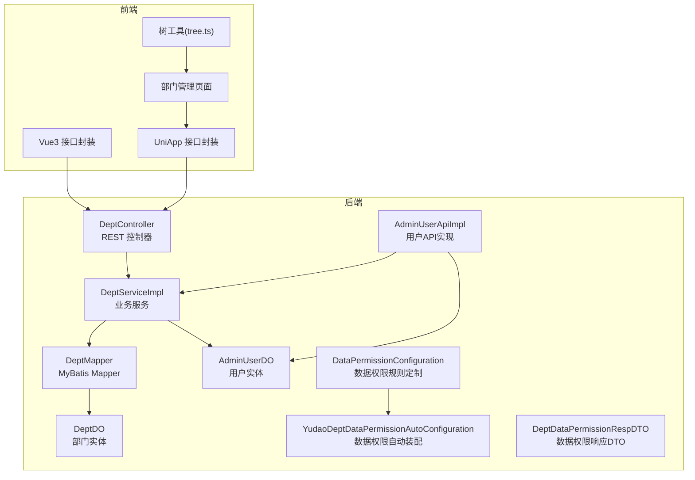
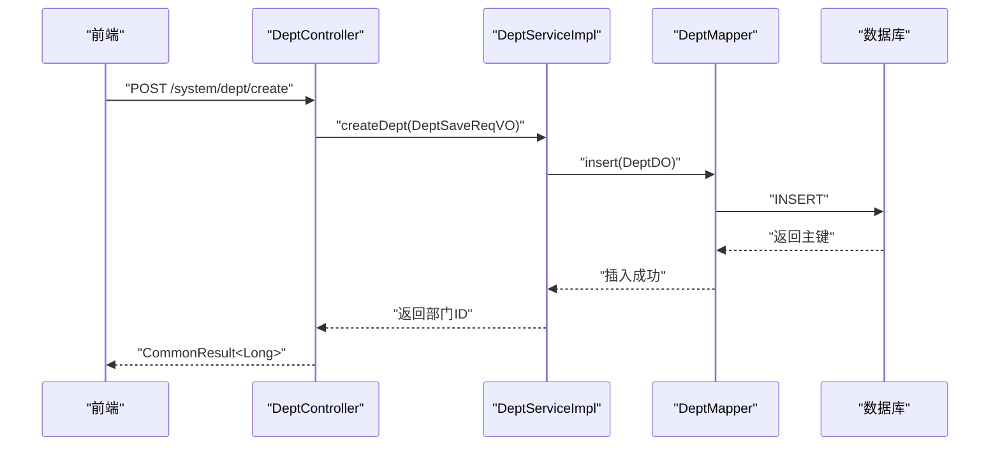
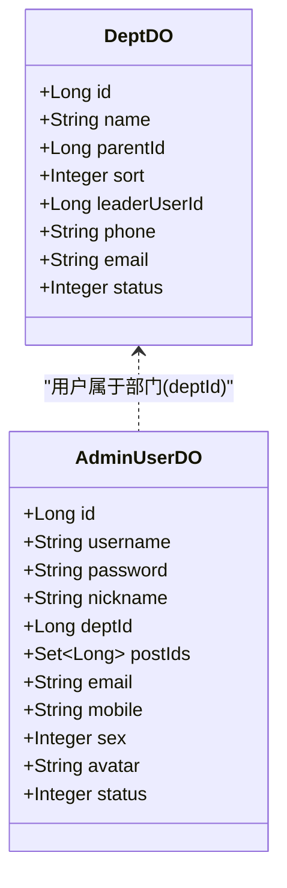
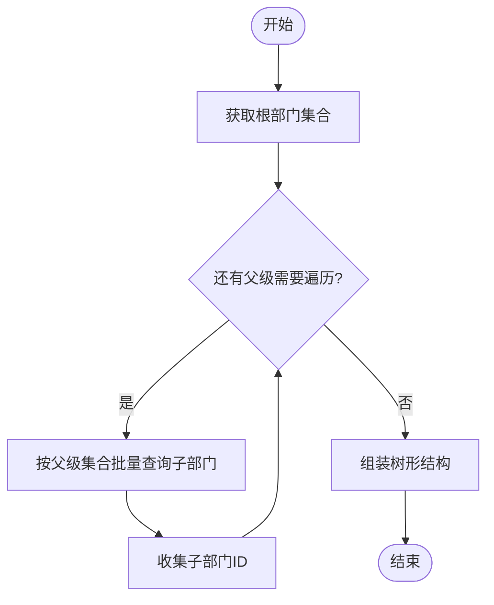
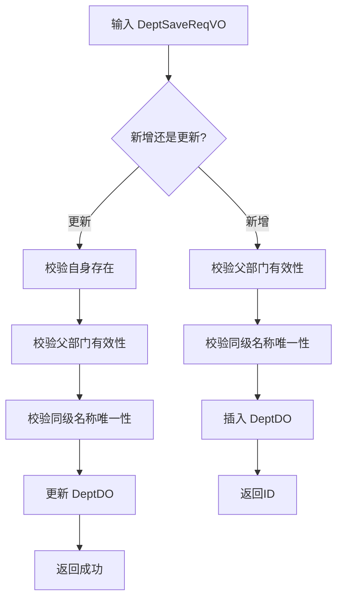
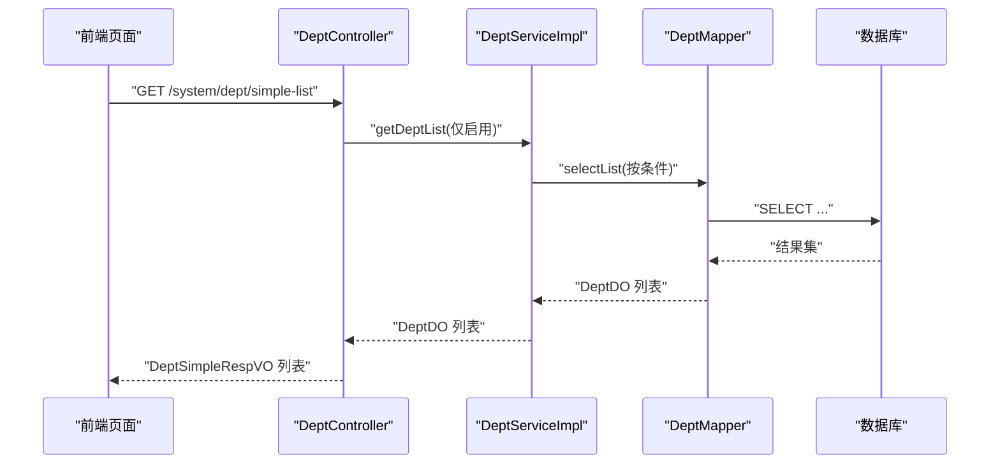
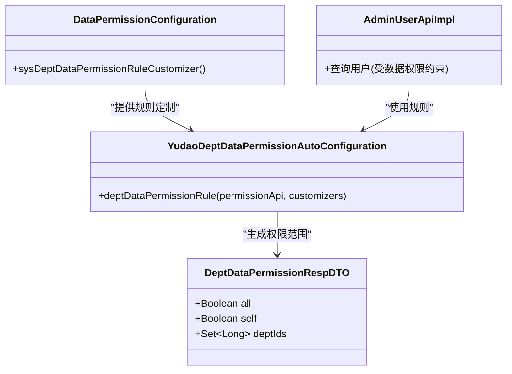
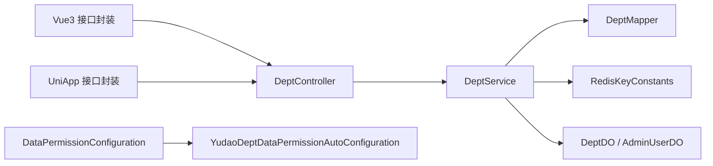

# 部门管理

<cite>
**本文引用的文件**
- [DeptController.java](file://backend/yudao-module-system/src/main/java/cn/iocoder/yudao/module/system/controller/admin/dept/DeptController.java)
- [DeptServiceImpl.java](file://backend/yudao-module-system/src/main/java/cn/iocoder/yudao/module/system/service/dept/DeptServiceImpl.java)
- [DeptService.java](file://backend/yudao-module-system/src/main/java/cn/iocoder/yudao/module/system/service/dept/DeptService.java)
- [DeptMapper.java](file://backend/yudao-module-system/src/main/java/cn/iocoder/yudao/module/system/dal/mysql/dept/DeptMapper.java)
- [DeptDO.java](file://backend/yudao-module-system/src/main/java/cn/iocoder/yudao/module/system/dal/dataobject/dept/DeptDO.java)
- [AdminUserDO.java](file://backend/yudao-module-system/src/main/java/cn/iocoder/yudao/module/system/dal/dataobject/user/AdminUserDO.java)
- [DeptSaveReqVO.java](file://backend/yudao-module-system/src/main/java/cn/iocoder/yudao/module/system/controller/admin/dept/vo/dept/DeptSaveReqVO.java)
- [DeptSimpleRespVO.java](file://backend/yudao-module-system/src/main/java/cn/iocoder/yudao/module/system/controller/admin/dept/vo/dept/DeptSimpleRespVO.java)
- [DataPermissionConfiguration.java](file://backend/yudao-module-system/src/main/java/cn/iocoder/yudao/module/system/framework/datapermission/config/DataPermissionConfiguration.java)
- [YudaoDeptDataPermissionAutoConfiguration.java](file://backend/yudao-framework/yudao-spring-boot-starter-biz-data-permission/src/main/java/cn/iocoder/yudao/framework/datapermission/config/YudaoDeptDataPermissionAutoConfiguration.java)
- [DeptDataPermissionRespDTO.java](file://backend/yudao-framework/yudao-common/src/main/java/cn/iocoder/yudao/framework/common/biz/system/permission/dto/DeptDataPermissionRespDTO.java)
- [AdminUserApiImpl.java](file://backend/yudao-module-system/src/main/java/cn/iocoder/yudao/module/system/api/user/AdminUserApiImpl.java)
- [index.ts（Vue3 后端接口封装）](file://frontend/admin-vue3/src/api/system/dept/index.ts)
- [index.ts（UniApp 后端接口封装）](file://frontend/admin-uniapp/src/api/system/dept/index.ts)
- [部门管理页面（UniApp）](file://frontend/admin-uniapp/src/pages-system/dept/index.vue)
- [tree.ts（树工具）](file://frontend/admin-vue3/src/utils/tree.ts)
- [ruoyi-vue-pro.sql（MySQL 示例数据）](file://backend/sql/mysql/ruoyi-vue-pro.sql)
</cite>

## 目录
1. [简介](#简介)
2. [项目结构](#项目结构)
3. [核心组件](#核心组件)
4. [架构总览](#架构总览)
5. [详细组件分析](#详细组件分析)
6. [依赖分析](#依赖分析)
7. [性能考量](#性能考量)
8. [故障排查指南](#故障排查指南)
9. [结论](#结论)
10. [附录](#附录)

## 简介
本文件系统化梳理“部门管理”功能，覆盖组织架构管理、部门层级关系、部门人员配置、部门权限控制等关键能力。重点说明部门实体模型设计、树形结构实现、服务层逻辑与数据权限继承机制，并提供完整的部门管理 API 文档与最佳实践建议。

## 项目结构
部门管理相关代码主要分布在后端 system 模块与前端 admin-vue3、admin-uniapp 两个前端工程中：
- 后端
  - 控制器：/backend/yudao-module-system/src/main/java/.../controller/admin/dept
  - 服务层：/backend/yudao-module-system/src/main/java/.../service/dept
  - 数据访问：/backend/yudao-module-system/src/main/java/.../dal/mysql/dept 与 /.../dal/dataobject/dept
  - 数据权限配置：/backend/yudao-module-system/.../framework/datapermission/config
  - 前端接口封装：/frontend/admin-vue3/src/api/system/dept 与 /frontend/admin-uniapp/src/api/system/dept
  - 前端页面：/frontend/admin-uniapp/src/pages-system/dept/index.vue
- 示例数据
  - /backend/sql/mysql/ruoyi-vue-pro.sql

图表来源
- [DeptController.java:25-94](file://backend/yudao-module-system/src/main/java/cn/iocoder/yudao/module/system/controller/admin/dept/DeptController.java#L25-L94)
- [DeptServiceImpl.java:32-239](file://backend/yudao-module-system/src/main/java/cn/iocoder/yudao/module/system/service/dept/DeptServiceImpl.java#L32-L239)
- [DeptMapper.java:12-38](file://backend/yudao-module-system/src/main/java/cn/iocoder/yudao/module/system/dal/mysql/dept/DeptMapper.java#L12-L38)
- [DeptDO.java:18-66](file://backend/yudao-module-system/src/main/java/cn/iocoder/yudao/module/system/dal/dataobject/dept/DeptDO.java#L18-L66)
- [AdminUserDO.java:22-97](file://backend/yudao-module-system/src/main/java/cn/iocoder/yudao/module/system/dal/dataobject/user/AdminUserDO.java#L22-L97)
- [DataPermissionConfiguration.java:14-28](file://backend/yudao-module-system/src/main/java/cn/iocoder/yudao/module/system/framework/datapermission/config/DataPermissionConfiguration.java#L14-L28)
- [YudaoDeptDataPermissionAutoConfiguration.java:19-34](file://backend/yudao-framework/yudao-spring-boot-starter-biz-data-permission/src/main/java/cn/iocoder/yudao/framework/datapermission/config/YudaoDeptDataPermissionAutoConfiguration.java#L19-L34)
- [DeptDataPermissionRespDTO.java:13-35](file://backend/yudao-framework/yudao-common/src/main/java/cn/iocoder/yudao/framework/common/biz/system/permission/dto/DeptDataPermissionRespDTO.java#L13-L35)
- [AdminUserApiImpl.java:28-36](file://backend/yudao-module-system/src/main/java/cn/iocoder/yudao/module/system/api/user/AdminUserApiImpl.java#L28-L36)
- [index.ts（Vue3 后端接口封装）:1-53](file://frontend/admin-vue3/src/api/system/dept/index.ts#L1-L53)
- [index.ts（UniApp 后端接口封装）:1-45](file://frontend/admin-uniapp/src/api/system/dept/index.ts#L1-L45)
- [部门管理页面（UniApp）:1-75](file://frontend/admin-uniapp/src/pages-system/dept/index.vue#L1-L75)
- [tree.ts（树工具）:380-403](file://frontend/admin-vue3/src/utils/tree.ts#L380-L403)

章节来源
- [DeptController.java:25-94](file://backend/yudao-module-system/src/main/java/cn/iocoder/yudao/module/system/controller/admin/dept/DeptController.java#L25-L94)
- [DeptServiceImpl.java:32-239](file://backend/yudao-module-system/src/main/java/cn/iocoder/yudao/module/system/service/dept/DeptServiceImpl.java#L32-L239)
- [DeptMapper.java:12-38](file://backend/yudao-module-system/src/main/java/cn/iocoder/yudao/module/system/dal/mysql/dept/DeptMapper.java#L12-L38)
- [DeptDO.java:18-66](file://backend/yudao-module-system/src/main/java/cn/iocoder/yudao/module/system/dal/dataobject/dept/DeptDO.java#L18-L66)
- [AdminUserDO.java:22-97](file://backend/yudao-module-system/src/main/java/cn/iocoder/yudao/module/system/dal/dataobject/user/AdminUserDO.java#L22-L97)
- [DataPermissionConfiguration.java:14-28](file://backend/yudao-module-system/src/main/java/cn/iocoder/yudao/module/system/framework/datapermission/config/DataPermissionConfiguration.java#L14-L28)
- [YudaoDeptDataPermissionAutoConfiguration.java:19-34](file://backend/yudao-framework/yudao-spring-boot-starter-biz-data-permission/src/main/java/cn/iocoder/yudao/framework/datapermission/config/YudaoDeptDataPermissionAutoConfiguration.java#L19-L34)
- [DeptDataPermissionRespDTO.java:13-35](file://backend/yudao-framework/yudao-common/src/main/java/cn/iocoder/yudao/framework/common/biz/system/permission/dto/DeptDataPermissionRespDTO.java#L13-L35)
- [AdminUserApiImpl.java:28-36](file://backend/yudao-module-system/src/main/java/cn/iocoder/yudao/module/system/api/user/AdminUserApiImpl.java#L28-L36)
- [index.ts（Vue3 后端接口封装）:1-53](file://frontend/admin-vue3/src/api/system/dept/index.ts#L1-L53)
- [index.ts（UniApp 后端接口封装）:1-45](file://frontend/admin-uniapp/src/api/system/dept/index.ts#L1-L45)
- [部门管理页面（UniApp）:1-75](file://frontend/admin-uniapp/src/pages-system/dept/index.vue#L1-L75)
- [tree.ts（树工具）:380-403](file://frontend/admin-vue3/src/utils/tree.ts#L380-L403)

## 核心组件
- 控制器层：提供部门的增删改查、列表查询、精简列表、详情查询等接口，统一鉴权与参数校验。
- 服务层：实现业务规则（父子关系校验、名称唯一性、子部门遍历、缓存失效）、调用数据访问层。
- 数据访问层：基于 MyBatis 提供部门列表、按父级查询、按负责人查询、计数等基础操作。
- 实体模型：部门与用户实体，明确部门层级与用户归属关系。
- 数据权限：通过 DeptDataPermissionRule 自定义规则，将用户与部门关联，实现数据权限继承。

章节来源
- [DeptController.java:34-91](file://backend/yudao-module-system/src/main/java/cn/iocoder/yudao/module/system/controller/admin/dept/DeptController.java#L34-L91)
- [DeptServiceImpl.java:40-104](file://backend/yudao-module-system/src/main/java/cn/iocoder/yudao/module/system/service/dept/DeptServiceImpl.java#L40-L104)
- [DeptMapper.java:15-35](file://backend/yudao-module-system/src/main/java/cn/iocoder/yudao/module/system/dal/mysql/dept/DeptMapper.java#L15-L35)
- [DeptDO.java:22-66](file://backend/yudao-module-system/src/main/java/cn/iocoder/yudao/module/system/dal/dataobject/dept/DeptDO.java#L22-L66)
- [AdminUserDO.java:55-57](file://backend/yudao-module-system/src/main/java/cn/iocoder/yudao/module/system/dal/dataobject/user/AdminUserDO.java#L55-L57)
- [DataPermissionConfiguration.java:17-26](file://backend/yudao-module-system/src/main/java/cn/iocoder/yudao/module/system/framework/datapermission/config/DataPermissionConfiguration.java#L17-L26)

## 架构总览
部门管理采用经典的分层架构：前端通过 HTTP 接口调用后端控制器；控制器委托服务层完成业务处理；服务层持久化到数据库；同时结合数据权限规则对查询进行自动过滤。

图表来源
- [DeptController.java:34-40](file://backend/yudao-module-system/src/main/java/cn/iocoder/yudao/module/system/controller/admin/dept/DeptController.java#L34-L40)
- [DeptServiceImpl.java:40-56](file://backend/yudao-module-system/src/main/java/cn/iocoder/yudao/module/system/service/dept/DeptServiceImpl.java#L40-L56)
- [DeptMapper.java:15-19](file://backend/yudao-module-system/src/main/java/cn/iocoder/yudao/module/system/dal/mysql/dept/DeptMapper.java#L15-L19)

## 详细组件分析

### 部门实体模型设计
- 部门实体 DeptDO
  - 字段：id、name、parentId、sort、leaderUserId、phone、email、status 等
  - 特性：支持租户隔离（TenantBaseDO），父节点为 0 表示根节点
- 用户实体 AdminUserDO
  - 字段：deptId 关联部门，用于部门人员配置
- 关系映射
  - 部门与用户：一对多（一个部门包含多个用户）
  - 部门与部门：父子层级（通过 parentId）

图表来源
- [DeptDO.java:22-66](file://backend/yudao-module-system/src/main/java/cn/iocoder/yudao/module/system/dal/dataobject/dept/DeptDO.java#L22-L66)
- [AdminUserDO.java:34-62](file://backend/yudao-module-system/src/main/java/cn/iocoder/yudao/module/system/dal/dataobject/user/AdminUserDO.java#L34-L62)

章节来源
- [DeptDO.java:22-66](file://backend/yudao-module-system/src/main/java/cn/iocoder/yudao/module/system/dal/dataobject/dept/DeptDO.java#L22-L66)
- [AdminUserDO.java:55-57](file://backend/yudao-module-system/src/main/java/cn/iocoder/yudao/module/system/dal/dataobject/user/AdminUserDO.java#L55-L57)

### 部门树形结构实现
- 层级查询
  - 通过 parentId 进行层级查询，支持按父节点集合批量查询子节点
  - 服务层提供递归遍历子部门的方法，用于构建或查询整棵子树
- 缓存策略
  - 子部门 ID 列表使用 Redis 缓存，写操作时清空所有缓存，保证一致性
- 前端展示
  - UniApp 页面以卡片形式展示部门列表，支持点击进入子部门
  - Vue3 工具函数提供树路径拼接等辅助能力

图表来源
- [DeptServiceImpl.java:187-204](file://backend/yudao-module-system/src/main/java/cn/iocoder/yudao/module/system/service/dept/DeptServiceImpl.java#L187-L204)
- [DeptMapper.java:29-31](file://backend/yudao-module-system/src/main/java/cn/iocoder/yudao/module/system/dal/mysql/dept/DeptMapper.java#L29-L31)
- [index.ts（UniApp 后端接口封装）:17-25](file://frontend/admin-uniapp/src/api/system/dept/index.ts#L17-L25)
- [部门管理页面（UniApp）:16-58](file://frontend/admin-uniapp/src/pages-system/dept/index.vue#L16-L58)
- [tree.ts（树工具）:380-403](file://frontend/admin-vue3/src/utils/tree.ts#L380-L403)

章节来源
- [DeptServiceImpl.java:187-217](file://backend/yudao-module-system/src/main/java/cn/iocoder/yudao/module/system/service/dept/DeptServiceImpl.java#L187-L217)
- [DeptMapper.java:29-35](file://backend/yudao-module-system/src/main/java/cn/iocoder/yudao/module/system/dal/mysql/dept/DeptMapper.java#L29-L35)
- [index.ts（UniApp 后端接口封装）:17-25](file://frontend/admin-uniapp/src/api/system/dept/index.ts#L17-L25)
- [部门管理页面（UniApp）:16-58](file://frontend/admin-uniapp/src/pages-system/dept/index.vue#L16-L58)
- [tree.ts（树工具）:380-403](file://frontend/admin-vue3/src/utils/tree.ts#L380-L403)

### 部门服务层逻辑
- 创建/更新/删除/批量删除
  - 创建：校验父部门有效性与部门名称唯一性，插入后返回主键
  - 更新：先校验自身存在、再校验父部门与名称唯一性，最后更新
  - 删除：禁止删除仍有子部门的节点，否则抛出异常
  - 批量删除：逐项校验并批量执行
- 校验规则
  - 父子关系校验：禁止将自己设为父部门；递归校验避免环路
  - 名称唯一性：同级下部门名称不可重复
- 数据权限
  - 在缓存读取前禁用数据权限，避免错误缓存；随后由数据权限规则自动生效

图表来源
- [DeptServiceImpl.java:40-75](file://backend/yudao-module-system/src/main/java/cn/iocoder/yudao/module/system/service/dept/DeptServiceImpl.java#L40-L75)
- [DeptSaveReqVO.java:15-49](file://backend/yudao-module-system/src/main/java/cn/iocoder/yudao/module/system/controller/admin/dept/vo/dept/DeptSaveReqVO.java#L15-L49)

章节来源
- [DeptServiceImpl.java:40-104](file://backend/yudao-module-system/src/main/java/cn/iocoder/yudao/module/system/service/dept/DeptServiceImpl.java#L40-L104)
- [DeptSaveReqVO.java:15-49](file://backend/yudao-module-system/src/main/java/cn/iocoder/yudao/module/system/controller/admin/dept/vo/dept/DeptSaveReqVO.java#L15-L49)

### 部门与用户的关联关系
- 用户实体包含 deptId 字段，直接指向所属部门
- 服务层提供按负责人查询部门列表的能力
- 前端页面展示部门负责人字段，便于直观管理

图表来源
- [DeptController.java:76-82](file://backend/yudao-module-system/src/main/java/cn/iocoder/yudao/module/system/controller/admin/dept/DeptController.java#L76-L82)
- [DeptServiceImpl.java:180-185](file://backend/yudao-module-system/src/main/java/cn/iocoder/yudao/module/system/service/dept/DeptServiceImpl.java#L180-L185)
- [DeptMapper.java:15-19](file://backend/yudao-module-system/src/main/java/cn/iocoder/yudao/module/system/dal/mysql/dept/DeptMapper.java#L15-L19)
- [DeptSimpleRespVO.java:12-23](file://backend/yudao-module-system/src/main/java/cn/iocoder/yudao/module/system/controller/admin/dept/vo/dept/DeptSimpleRespVO.java#L12-L23)

章节来源
- [AdminUserDO.java:55-57](file://backend/yudao-module-system/src/main/java/cn/iocoder/yudao/module/system/dal/dataobject/user/AdminUserDO.java#L55-L57)
- [DeptServiceImpl.java:206-209](file://backend/yudao-module-system/src/main/java/cn/iocoder/yudao/module/system/service/dept/DeptServiceImpl.java#L206-L209)
- [DeptController.java:76-82](file://backend/yudao-module-system/src/main/java/cn/iocoder/yudao/module/system/controller/admin/dept/DeptController.java#L76-L82)

### 部门权限控制与数据权限继承机制
- 数据权限规则
  - 将 AdminUserDO 的 deptId 与 DeptDO 的 id 关联，实现“按部门查看”的数据权限
  - 自动装配 DeptDataPermissionRule，结合 PermissionCommonApi 注入权限上下文
- 权限响应 DTO
  - 提供 all、self、deptIds 等字段，描述当前用户可查看的数据范围
- 用户 API 集成
  - AdminUserApiImpl 在查询用户时可利用数据权限规则，确保返回符合权限的数据

图表来源
- [DataPermissionConfiguration.java:17-26](file://backend/yudao-module-system/src/main/java/cn/iocoder/yudao/module/system/framework/datapermission/config/DataPermissionConfiguration.java#L17-L26)
- [YudaoDeptDataPermissionAutoConfiguration.java:24-32](file://backend/yudao-framework/yudao-spring-boot-starter-biz-data-permission/src/main/java/cn/iocoder/yudao/framework/datapermission/config/YudaoDeptDataPermissionAutoConfiguration.java#L24-L32)
- [DeptDataPermissionRespDTO.java:13-35](file://backend/yudao-framework/yudao-common/src/main/java/cn/iocoder/yudao/framework/common/biz/system/permission/dto/DeptDataPermissionRespDTO.java#L13-L35)
- [AdminUserApiImpl.java:28-36](file://backend/yudao-module-system/src/main/java/cn/iocoder/yudao/module/system/api/user/AdminUserApiImpl.java#L28-L36)

章节来源
- [DataPermissionConfiguration.java:17-26](file://backend/yudao-module-system/src/main/java/cn/iocoder/yudao/module/system/framework/datapermission/config/DataPermissionConfiguration.java#L17-L26)
- [YudaoDeptDataPermissionAutoConfiguration.java:24-32](file://backend/yudao-framework/yudao-spring-boot-starter-biz-data-permission/src/main/java/cn/iocoder/yudao/framework/datapermission/config/YudaoDeptDataPermissionAutoConfiguration.java#L24-L32)
- [DeptDataPermissionRespDTO.java:13-35](file://backend/yudao-framework/yudao-common/src/main/java/cn/iocoder/yudao/framework/common/biz/system/permission/dto/DeptDataPermissionRespDTO.java#L13-L35)
- [AdminUserApiImpl.java:28-36](file://backend/yudao-module-system/src/main/java/cn/iocoder/yudao/module/system/api/user/AdminUserApiImpl.java#L28-L36)

## 依赖分析
- 控制器依赖服务接口，服务实现依赖 Mapper 与 Redis 缓存常量
- 数据权限通过自动装配注入规则，规则定制在 system 模块内完成
- 前端通过统一接口封装调用后端控制器

图表来源
- [DeptController.java:31-32](file://backend/yudao-module-system/src/main/java/cn/iocoder/yudao/module/system/controller/admin/dept/DeptController.java#L31-L32)
- [DeptServiceImpl.java:37-38](file://backend/yudao-module-system/src/main/java/cn/iocoder/yudao/module/system/service/dept/DeptServiceImpl.java#L37-L38)
- [DeptMapper.java:12-13](file://backend/yudao-module-system/src/main/java/cn/iocoder/yudao/module/system/dal/mysql/dept/DeptMapper.java#L12-L13)
- [DataPermissionConfiguration.java:17-26](file://backend/yudao-module-system/src/main/java/cn/iocoder/yudao/module/system/framework/datapermission/config/DataPermissionConfiguration.java#L17-L26)
- [YudaoDeptDataPermissionAutoConfiguration.java:24-32](file://backend/yudao-framework/yudao-spring-boot-starter-biz-data-permission/src/main/java/cn/iocoder/yudao/framework/datapermission/config/YudaoDeptDataPermissionAutoConfiguration.java#L24-L32)
- [index.ts（Vue3 后端接口封装）:1-53](file://frontend/admin-vue3/src/api/system/dept/index.ts#L1-L53)
- [index.ts（UniApp 后端接口封装）:1-45](file://frontend/admin-uniapp/src/api/system/dept/index.ts#L1-L45)

章节来源
- [DeptController.java:31-32](file://backend/yudao-module-system/src/main/java/cn/iocoder/yudao/module/system/controller/admin/dept/DeptController.java#L31-L32)
- [DeptServiceImpl.java:37-38](file://backend/yudao-module-system/src/main/java/cn/iocoder/yudao/module/system/service/dept/DeptServiceImpl.java#L37-L38)
- [DeptMapper.java:12-13](file://backend/yudao-module-system/src/main/java/cn/iocoder/yudao/module/system/dal/mysql/dept/DeptMapper.java#L12-L13)
- [DataPermissionConfiguration.java:17-26](file://backend/yudao-module-system/src/main/java/cn/iocoder/yudao/module/system/framework/datapermission/config/DataPermissionConfiguration.java#L17-L26)
- [YudaoDeptDataPermissionAutoConfiguration.java:24-32](file://backend/yudao-framework/yudao-spring-boot-starter-biz-data-permission/src/main/java/cn/iocoder/yudao/framework/datapermission/config/YudaoDeptDataPermissionAutoConfiguration.java#L24-L32)
- [index.ts（Vue3 后端接口封装）:1-53](file://frontend/admin-vue3/src/api/system/dept/index.ts#L1-L53)
- [index.ts（UniApp 后端接口封装）:1-45](file://frontend/admin-uniapp/src/api/system/dept/index.ts#L1-L45)

## 性能考量
- 缓存策略
  - 子部门 ID 列表使用 Redis 缓存，写操作时清空所有缓存，避免脏读
- 查询优化
  - 列表查询按 sort 排序，减少前端排序成本
  - 批量查询子部门时使用集合查询，降低多次往返
- 数据权限
  - 在缓存读取前禁用数据权限，避免错误缓存；随后由规则自动生效

章节来源
- [DeptServiceImpl.java:40-46](file://backend/yudao-module-system/src/main/java/cn/iocoder/yudao/module/system/service/dept/DeptServiceImpl.java#L40-L46)
- [DeptServiceImpl.java:211-217](file://backend/yudao-module-system/src/main/java/cn/iocoder/yudao/module/system/service/dept/DeptServiceImpl.java#L211-L217)
- [DeptServiceImpl.java:180-185](file://backend/yudao-module-system/src/main/java/cn/iocoder/yudao/module/system/service/dept/DeptServiceImpl.java#L180-L185)

## 故障排查指南
- 常见错误与定位
  - 部门不存在：检查 ID 是否正确，或是否已被删除
  - 父部门无效：确认 parentId 是否为根或存在的父节点
  - 环路问题：避免将子部门设为父部门，递归校验会阻止环路
  - 名称冲突：同级下部门名称需唯一
  - 仍有子部门：禁止删除非叶子节点
- 建议排查步骤
  - 核对请求参数（parentId、name、sort、status）
  - 检查数据库中 DeptDO 记录与层级关系
  - 查看服务层异常抛出位置与错误码

章节来源
- [DeptServiceImpl.java:106-165](file://backend/yudao-module-system/src/main/java/cn/iocoder/yudao/module/system/service/dept/DeptServiceImpl.java#L106-L165)
- [DeptServiceImpl.java:80-104](file://backend/yudao-module-system/src/main/java/cn/iocoder/yudao/module/system/service/dept/DeptServiceImpl.java#L80-L104)

## 结论
部门管理模块以清晰的分层架构实现了组织架构管理、树形结构查询、部门人员配置与数据权限控制。通过严格的业务校验与缓存策略，兼顾了易用性与性能。建议在实际部署中结合业务场景完善权限策略与审计日志。

## 附录

### 部门管理 API 接口文档
- 获取部门列表
  - 方法：GET
  - 路径：/system/dept/list
  - 权限：system:dept:query
  - 请求参数：name（模糊匹配）、status（筛选状态）
  - 返回：DeptRespVO 列表
- 获取部门精简列表
  - 方法：GET
  - 路径：/system/dept/simple-list 或 /system/dept/list-all-simple
  - 返回：DeptSimpleRespVO 列表（仅启用）
- 获得部门详情
  - 方法：GET
  - 路径：/system/dept/get
  - 参数：id（部门编号）
  - 权限：system:dept:query
- 创建部门
  - 方法：POST
  - 路径：/system/dept/create
  - 权限：system:dept:create
  - 请求体：DeptSaveReqVO
  - 返回：部门编号
- 更新部门
  - 方法：PUT
  - 路径：/system/dept/update
  - 权限：system:dept:update
  - 请求体：DeptSaveReqVO
  - 返回：true/false
- 删除部门
  - 方法：DELETE
  - 路径：/system/dept/delete
  - 参数：id（部门编号）
  - 权限：system:dept:delete
  - 返回：true/false
- 批量删除部门
  - 方法：DELETE
  - 路径：/system/dept/delete-list
  - 参数：ids（逗号分隔的编号列表）
  - 权限：system:dept:delete
  - 返回：true/false

章节来源
- [DeptController.java:34-91](file://backend/yudao-module-system/src/main/java/cn/iocoder/yudao/module/system/controller/admin/dept/DeptController.java#L34-L91)
- [index.ts（Vue3 后端接口封装）:15-53](file://frontend/admin-vue3/src/api/system/dept/index.ts#L15-L53)
- [index.ts（UniApp 后端接口封装）:17-45](file://frontend/admin-uniapp/src/api/system/dept/index.ts#L17-L45)

### 组织架构设计最佳实践与权限控制策略
- 组织架构设计
  - 明确根节点与层级边界，避免跨租户/跨域混用
  - 使用 sort 字段控制展示顺序，保持稳定一致
  - 通过负责人字段与用户实体关联，便于权限与统计
- 权限控制策略
  - 基于部门的数据权限：将用户与部门关联，实现“按部门查看”
  - 权限范围：all（全部）、self（仅自己）、deptIds（指定部门集合）
  - 在缓存读取前禁用数据权限，写操作后统一由规则生效

章节来源
- [DataPermissionConfiguration.java:17-26](file://backend/yudao-module-system/src/main/java/cn/iocoder/yudao/module/system/framework/datapermission/config/DataPermissionConfiguration.java#L17-L26)
- [YudaoDeptDataPermissionAutoConfiguration.java:24-32](file://backend/yudao-framework/yudao-spring-boot-starter-biz-data-permission/src/main/java/cn/iocoder/yudao/framework/datapermission/config/YudaoDeptDataPermissionAutoConfiguration.java#L24-L32)
- [DeptDataPermissionRespDTO.java:13-35](file://backend/yudao-framework/yudao-common/src/main/java/cn/iocoder/yudao/framework/common/biz/system/permission/dto/DeptDataPermissionRespDTO.java#L13-L35)

### 示例数据参考
- MySQL 示例数据包含部门初始化记录，可作为本地开发与测试参考

章节来源
- [ruoyi-vue-pro.sql（MySQL 示例数据）:432-435](file://backend/sql/mysql/ruoyi-vue-pro.sql#L432-L435)