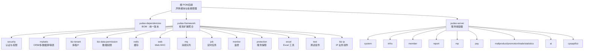
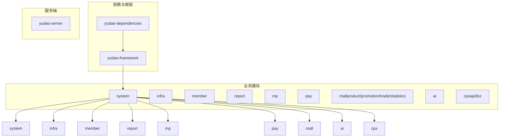
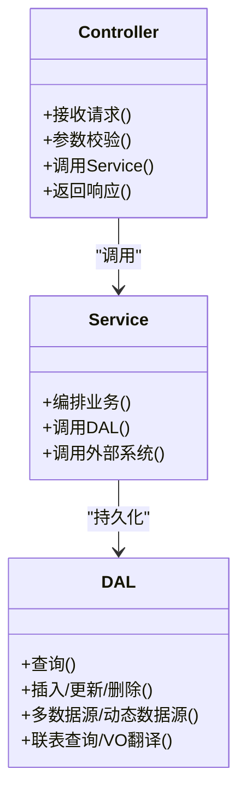
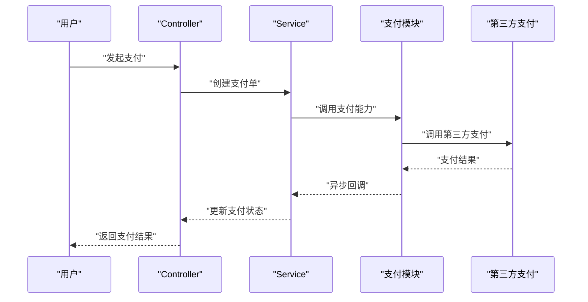
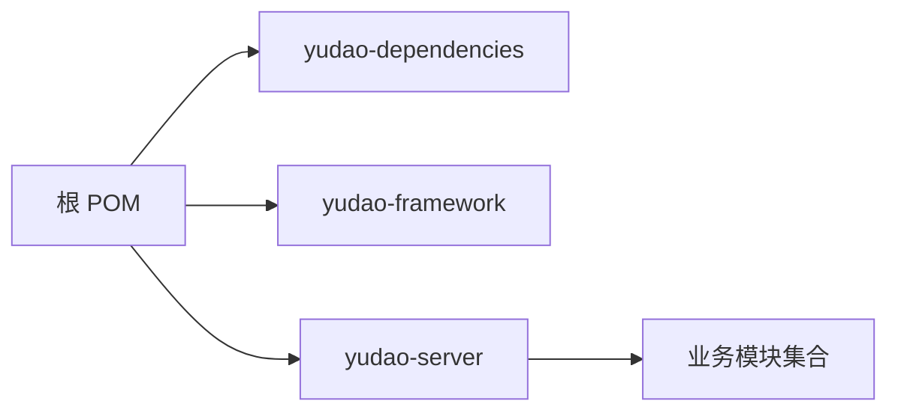

# 后端服务架构

<cite>
**本文引用的文件**
- [根 POM（后端）](file://backend/pom.xml)
- [依赖版本管理（yudao-dependencies）](file://backend/yudao-dependencies/pom.xml)
- [框架聚合（yudao-framework）](file://backend/yudao-framework/pom.xml)
- [框架安全组件（yudao-spring-boot-starter-security）](file://backend/yudao-framework/yudao-spring-boot-starter-security/pom.xml)
- [框架 MyBatis 组件（yudao-spring-boot-starter-mybatis）](file://backend/yudao-framework/yudao-spring-boot-starter-mybatis/pom.xml)
- [框架多租户组件（yudao-spring-boot-starter-biz-tenant）](file://backend/yudao-framework/yudao-spring-boot-starter-biz-tenant/pom.xml)
- [框架数据权限组件（yudao-spring-boot-starter-biz-data-permission）](file://backend/yudao-framework/yudao-spring-boot-starter-biz-data-permission/pom.xml)
- [公共基础模块（yudao-common）](file://backend/yudao-framework/yudao-common/pom.xml)
- [服务端容器（yudao-server）](file://backend/yudao-server/pom.xml)
- [CPS 模块聚合（yudao-module-cps）](file://backend/yudao-module-cps/pom.xml)
- [AI 模块（yudao-module-ai）](file://backend/yudao-module-ai/pom.xml)
- [会员模块（yudao-module-member）](file://backend/yudao-module-member/pom.xml)
- [支付模块（yudao-module-pay）](file://backend/yudao-module-pay/pom.xml)
- [系统模块（yudao-module-system）](file://backend/yudao-module-system/pom.xml)
- [项目总览与模块说明（README）](file://backend/README.md)
</cite>

## 目录
1. [简介](#简介)
2. [项目结构](#项目结构)
3. [核心组件](#核心组件)
4. [架构总览](#架构总览)
5. [详细组件分析](#详细组件分析)
6. [依赖分析](#依赖分析)
7. [性能考虑](#性能考虑)
8. [故障排查指南](#故障排查指南)
9. [结论](#结论)
10. [附录](#附录)

## 简介
本项目是一个基于 Maven 的多模块后端服务架构，围绕“CPS 联盟返利”业务为核心，同时提供系统管理、基础设施、会员中心、支付、商城、AI 大模型、微信公众号、报表与大屏等模块。整体采用“依赖版本统一管理 + 框架扩展 + 业务模块”的三层结构：
- 依赖版本统一管理：yudao-dependencies
- 框架扩展：yudao-framework（安全、缓存、权限、多租户、MyBatis、Web、监控、保护、定时任务、消息队列、Excel、测试等）
- 业务模块：yudao-server 作为容器，聚合系统管理、基础设施、会员、报表、微信公众号、支付、商城、AI、CPS 等模块

该架构强调模块化、可插拔与可扩展性，便于在不同业务场景下灵活启用/禁用模块，满足“一人公司”快速落地与持续演进的需求。

## 项目结构
后端采用父子 POM 的多模块组织方式，顶层 POM 声明模块清单与依赖版本管理策略；yudao-dependencies 作为 BOM 统一版本；yudao-framework 聚合各类框架扩展组件；yudao-server 作为最终打包容器，按需引入业务模块。

**图表来源**
- [根 POM（后端）:10-25](file://backend/pom.xml#L10-L25)
- [依赖版本管理（yudao-dependencies）:84-686](file://backend/yudao-dependencies/pom.xml#L84-L686)
- [框架聚合（yudao-framework）:12-31](file://backend/yudao-framework/pom.xml#L12-L31)
- [服务端容器（yudao-server）:23-114](file://backend/yudao-server/pom.xml#L23-L114)

**章节来源**
- [根 POM（后端）:10-25](file://backend/pom.xml#L10-L25)
- [依赖版本管理（yudao-dependencies）:84-686](file://backend/yudao-dependencies/pom.xml#L84-L686)
- [框架聚合（yudao-framework）:12-31](file://backend/yudao-framework/pom.xml#L12-L31)
- [服务端容器（yudao-server）:23-114](file://backend/yudao-server/pom.xml#L23-L114)
- [项目总览与模块说明（README）:261-279](file://backend/README.md#L261-L279)

## 核心组件
- 依赖版本统一管理（yudao-dependencies）
  - 作用：集中管理 Spring Boot、MyBatis、Redis、RocketMQ、SkyWalking、JustAuth、微信 SDK、OkHttp 等大量第三方组件版本，确保子模块一致性与升级便捷性。
  - 关键特性：通过 dependencyManagement 导入 Spring Boot BOM，再叠加自研组件与生态组件版本，避免版本漂移。
- 框架扩展（yudao-framework）
  - 作用：将通用能力以“starter”形式封装，形成可复用的技术组件，降低业务模块重复造轮子的成本。
  - 组件类型：框架组件（如 MyBatis、Redis、Web、定时任务、消息队列、监控、保护）与业务组件（多租户、数据权限、IP 等）。
- 服务端容器（yudao-server）
  - 作用：作为最终打包产物，按需引入业务模块，提供统一的运行时入口与依赖装配。
  - 特性：默认注释掉部分模块依赖，仅在需要时启用，兼顾编译速度与灵活性。

**章节来源**
- [依赖版本管理（yudao-dependencies）:84-686](file://backend/yudao-dependencies/pom.xml#L84-L686)
- [框架聚合（yudao-framework）:33-43](file://backend/yudao-framework/pom.xml#L33-L43)
- [服务端容器（yudao-server）:16-21](file://backend/yudao-server/pom.xml#L16-L21)

## 架构总览
整体架构以“模块化 + 组件化”为核心，通过 BOM 统一版本、starter 封装通用能力、容器化装配业务模块，形成高内聚、低耦合的服务体系。下图展示了模块间依赖关系与职责边界：

**图表来源**
- [根 POM（后端）:10-25](file://backend/pom.xml#L10-L25)
- [服务端容器（yudao-server）:23-114](file://backend/yudao-server/pom.xml#L23-L114)
- [系统模块（yudao-module-system）:20-122](file://backend/yudao-module-system/pom.xml#L20-L122)
- [会员模块（yudao-module-member）:20-84](file://backend/yudao-module-member/pom.xml#L20-L84)
- [支付模块（yudao-module-pay）:21-81](file://backend/yudao-module-pay/pom.xml#L21-L81)
- [AI 模块（yudao-module-ai）:28-262](file://backend/yudao-module-ai/pom.xml#L28-L262)
- [CPS 模块聚合（yudao-module-cps）:21-24](file://backend/yudao-module-cps/pom.xml#L21-L24)

## 详细组件分析

### 模块划分与职责边界
- yudao-dependencies
  - 职责：统一版本、统一依赖管理，避免版本冲突与漂移。
  - 关键点：导入 Spring Boot BOM，再叠加自研组件与生态组件版本。
- yudao-framework
  - 职责：封装通用技术能力为 starter，供业务模块按需引入。
  - 关键点：框架组件与业务组件并存，命名区分清晰。
- yudao-server
  - 职责：作为最终打包容器，装配所需业务模块。
  - 关键点：默认注释部分模块依赖，按需启用，兼顾编译速度。
- 业务模块
  - system：系统管理（用户、角色、菜单、部门、字典、日志等），作为通用底座。
  - infra：基础设施（定时任务、文件服务、消息队列、监控等）。
  - member：会员中心（会员、等级、积分、标签、消息队列等）。
  - report：报表与大屏（拖拽式设计器、导出、打印等）。
  - mp：微信公众号（粉丝、消息、菜单、素材、标签、统计等）。
  - pay：支付系统（支付宝/微信支付、退款、钱包、转账等）。
  - mall：商城系统（商品、促销、订单、统计等）。
  - ai：AI 大模型（聊天、绘图、音乐、写作、思维导图、向量存储、MCP 等）。
  - cps：CPS 联盟返利（平台接入、推广位、订单同步、返利计算、提现、MCP 工具等）。

**章节来源**
- [依赖版本管理（yudao-dependencies）:84-686](file://backend/yudao-dependencies/pom.xml#L84-L686)
- [框架聚合（yudao-framework）:12-31](file://backend/yudao-framework/pom.xml#L12-L31)
- [服务端容器（yudao-server）:23-114](file://backend/yudao-server/pom.xml#L23-L114)
- [系统模块（yudao-module-system）:20-122](file://backend/yudao-module-system/pom.xml#L20-L122)
- [会员模块（yudao-module-member）:20-84](file://backend/yudao-module-member/pom.xml#L20-L84)
- [支付模块（yudao-module-pay）:21-81](file://backend/yudao-module-pay/pom.xml#L21-L81)
- [AI 模块（yudao-module-ai）:28-262](file://backend/yudao-module-ai/pom.xml#L28-L262)
- [CPS 模块聚合（yudao-module-cps）:21-24](file://backend/yudao-module-cps/pom.xml#L21-L24)

### 服务层设计模式（Controller-Service-DAL）
- 分层职责
  - Controller：接收 HTTP 请求，参数校验，调用 Service，返回结果。
  - Service：编排业务流程，协调 DAL 与外部系统，处理领域逻辑。
  - DAL：数据访问层，封装 MyBatis/Plus、多数据源、动态数据源、联表查询、VO 翻译等。
- 设计要点
  - 通过 yudao-framework 的 starter 封装通用能力，业务模块按需引入。
  - 使用 MapStruct 进行对象转换，Lombok 简化样板代码。
  - 通过 yudao-dependencies 统一版本，避免依赖冲突。

**图表来源**
- [框架 MyBatis 组件（yudao-spring-boot-starter-mybatis）:18-108](file://backend/yudao-framework/yudao-spring-boot-starter-mybatis/pom.xml#L18-L108)
- [公共基础模块（yudao-common）:74-139](file://backend/yudao-framework/yudao-common/pom.xml#L74-L139)

**章节来源**
- [框架 MyBatis 组件（yudao-spring-boot-starter-mybatis）:18-108](file://backend/yudao-framework/yudao-spring-boot-starter-mybatis/pom.xml#L18-L108)
- [公共基础模块（yudao-common）:74-139](file://backend/yudao-framework/yudao-common/pom.xml#L74-L139)

### 数据访问层实现
- 组件能力
  - 多数据源与读写分离：dynamic-datasource
  - ORM 增强：MyBatis-Plus
  - 联表查询：mybatis-plus-join
  - VO 数据翻译：easy-trans
  - 连接池：Druid
- 集成方式
  - 通过 yudao-spring-boot-starter-mybatis 引入，业务模块直接依赖该 starter 即可获得上述能力。
  - 与 yudao-dependencies 的版本管理配合，确保组件版本一致。

**章节来源**
- [依赖版本管理（yudao-dependencies）:174-242](file://backend/yudao-dependencies/pom.xml#L174-L242)
- [框架 MyBatis 组件（yudao-spring-boot-starter-mybatis）:32-98](file://backend/yudao-framework/yudao-spring-boot-starter-mybatis/pom.xml#L32-L98)

### 业务流程（以支付为例）
- 典型流程
  - 用户下单 → 调用支付模块 → 生成支付单 → 调用第三方支付（支付宝/微信） → 回调通知 → 更新支付状态 → 业务回调（订单状态变更）。
- 组件协同
  - 支付模块依赖 system/infra 的安全、缓存、定时任务、消息队列等能力。
  - 通过 yudao-dependencies 统一引入第三方 SDK（如 Alipay、Weixin Java）。

**图表来源**
- [支付模块（yudao-module-pay）:21-81](file://backend/yudao-module-pay/pom.xml#L21-L81)
- [系统模块（yudao-module-system）:20-122](file://backend/yudao-module-system/pom.xml#L20-L122)

**章节来源**
- [支付模块（yudao-module-pay）:21-81](file://backend/yudao-module-pay/pom.xml#L21-L81)
- [系统模块（yudao-module-system）:20-122](file://backend/yudao-module-system/pom.xml#L20-L122)

### 框架扩展（安全、缓存、权限、多租户）
- 安全（yudao-spring-boot-starter-security）
  - 职责：认证、权限校验、操作日志。
  - 依赖：Spring Security、Web、BizLog SDK。
- 缓存（yudao-spring-boot-starter-redis）
  - 职责：Redis 缓存与分布式锁。
- 权限（yudao-spring-boot-starter-biz-data-permission）
  - 职责：数据权限控制（如部门数据隔离）。
- 多租户（yudao-spring-boot-starter-biz-tenant）
  - 职责：多租户隔离与资源管理。
- 集成方式
  - 业务模块按需引入对应 starter，即可获得相应能力。
  - 通过 yudao-dependencies 统一版本，避免冲突。

**章节来源**
- [框架安全组件（yudao-spring-boot-starter-security）:21-62](file://backend/yudao-framework/yudao-spring-boot-starter-security/pom.xml#L21-L62)
- [框架数据权限组件（yudao-spring-boot-starter-biz-data-permission）:18-36](file://backend/yudao-framework/yudao-spring-boot-starter-biz-data-permission/pom.xml#L18-L36)
- [框架多租户组件（yudao-spring-boot-starter-biz-tenant）:18-52](file://backend/yudao-framework/yudao-spring-boot-starter-biz-tenant/pom.xml#L18-L52)
- [依赖版本管理（yudao-dependencies）:102-130](file://backend/yudao-dependencies/pom.xml#L102-L130)

### 接口定义与集成方式
- 接口定义
  - system：用户、角色、菜单、部门、字典、日志等通用接口。
  - member：会员、等级、积分、标签等会员相关接口。
  - pay：支付、退款、钱包、转账等支付相关接口。
  - mp：公众号粉丝、消息、菜单、素材、标签、统计等接口。
  - report：报表设计器、图形报表、大屏、打印等接口。
  - mall：商品、促销、订单、统计等商城相关接口。
  - ai：聊天、绘图、音乐、写作、思维导图、MCP 工具等接口。
  - cps：平台接入、推广位、订单同步、返利计算、提现、MCP 工具等接口。
- 集成方式
  - 通过 yudao-server 装配所需模块，对外提供统一 REST API。
  - 通过 yudao-dependencies 统一引入第三方 SDK（如 Alipay、Weixin Java、JustAuth、OkHttp 等）。

**章节来源**
- [系统模块（yudao-module-system）:20-122](file://backend/yudao-module-system/pom.xml#L20-L122)
- [会员模块（yudao-module-member）:20-84](file://backend/yudao-module-member/pom.xml#L20-L84)
- [支付模块（yudao-module-pay）:21-81](file://backend/yudao-module-pay/pom.xml#L21-L81)
- [微信公众号模块（yudao-module-mp）:1-200](file://backend/yudao-module-mp/pom.xml#L1-L200)
- [报表模块（yudao-module-report）:1-200](file://backend/yudao-module-report/pom.xml#L1-L200)
- [商城模块（yudao-module-mall）:1-200](file://backend/yudao-module-mall/pom.xml#L1-L200)
- [AI 模块（yudao-module-ai）:28-262](file://backend/yudao-module-ai/pom.xml#L28-L262)
- [CPS 模块聚合（yudao-module-cps）:21-24](file://backend/yudao-module-cps/pom.xml#L21-L24)

## 依赖分析
- 顶层 POM
  - 声明模块清单与依赖版本管理策略，导入 yudao-dependencies。
- yudao-dependencies
  - 通过 dependencyManagement 导入 Spring Boot BOM，再叠加自研与生态组件版本。
- yudao-framework
  - 聚合各类 starter，形成可复用组件库。
- yudao-server
  - 作为容器，按需引入业务模块，最终打包为可执行 jar。

**图表来源**
- [根 POM（后端）:10-25](file://backend/pom.xml#L10-L25)
- [依赖版本管理（yudao-dependencies）:84-100](file://backend/yudao-dependencies/pom.xml#L84-L100)
- [框架聚合（yudao-framework）:12-31](file://backend/yudao-framework/pom.xml#L12-L31)
- [服务端容器（yudao-server）:23-114](file://backend/yudao-server/pom.xml#L23-L114)

**章节来源**
- [根 POM（后端）:10-25](file://backend/pom.xml#L10-L25)
- [依赖版本管理（yudao-dependencies）:84-100](file://backend/yudao-dependencies/pom.xml#L84-L100)
- [框架聚合（yudao-framework）:12-31](file://backend/yudao-framework/pom.xml#L12-L31)
- [服务端容器（yudao-server）:23-114](file://backend/yudao-server/pom.xml#L23-L114)

## 性能考虑
- 搜索与比价：单平台搜索 < 2 秒（P99），多平台比价 < 5 秒（P99）。
- 转链生成：< 1 秒。
- 订单同步延迟：< 30 分钟。
- 返利入账：平台结算后 24 小时内。
- MCP 工具调用：搜索类 < 3 秒，查询类 < 1 秒。

这些指标体现了系统在高并发与多平台对接场景下的性能目标，建议在实际部署中结合压测与监控（SkyWalking、Actuator、Admin）持续优化。

**章节来源**
- [项目总览与模块说明（README）:326-335](file://backend/README.md#L326-L335)

## 故障排查指南
- 依赖冲突
  - 使用 yudao-dependencies 的 dependencyManagement 统一版本，避免组件版本不一致导致的冲突。
- 启动失败
  - 检查 yudao-server 的模块依赖是否按需启用；必要时临时注释未启用模块以定位问题。
- 数据库连接
  - 确认 yudao-spring-boot-starter-mybatis 的多数据源与连接池配置正确。
- 安全与权限
  - 确认 yudao-spring-boot-starter-security 的安全配置与数据权限规则生效。
- 监控与链路追踪
  - 启用 yudao-spring-boot-starter-monitor，结合 SkyWalking 与 Spring Boot Admin 定位问题。

**章节来源**
- [依赖版本管理（yudao-dependencies）:84-100](file://backend/yudao-dependencies/pom.xml#L84-L100)
- [服务端容器（yudao-server）:23-114](file://backend/yudao-server/pom.xml#L23-L114)
- [框架 MyBatis 组件（yudao-spring-boot-starter-mybatis）:32-98](file://backend/yudao-framework/yudao-spring-boot-starter-mybatis/pom.xml#L32-L98)
- [框架安全组件（yudao-spring-boot-starter-security）:21-62](file://backend/yudao-framework/yudao-spring-boot-starter-security/pom.xml#L21-L62)
- [框架监控组件（yudao-spring-boot-starter-monitor）:1-200](file://backend/yudao-framework/yudao-spring-boot-starter-monitor/pom.xml#L1-L200)

## 结论
该后端服务架构通过“依赖版本统一管理 + 框架扩展 + 业务模块”的设计，实现了高内聚、低耦合与可扩展的多模块体系。yudao-dependencies 提供稳定的版本基线，yudao-framework 将通用能力封装为可复用的 starter，yudao-server 作为容器按需装配业务模块。结合明确的分层设计（Controller-Service-DAL）与完善的框架扩展（安全、缓存、权限、多租户），能够有效支撑 CPS 联盟返利及周边业务的快速落地与持续演进。

## 附录
- 快速开始
  - 克隆项目 → 初始化数据库（导入 SQL 脚本）→ Maven 编译 → 运行 yudao-server 主类。
- 技术栈概览
  - Spring Boot、Spring Security、MyBatis Plus、Redis/Redisson、Flowable、Vue 3 + UniApp、MySQL、MapStruct、Quartz、SkyWalking 等。

**章节来源**
- [项目总览与模块说明（README）:299-324](file://backend/README.md#L299-L324)
- [项目总览与模块说明（README）:280-296](file://backend/README.md#L280-L296)