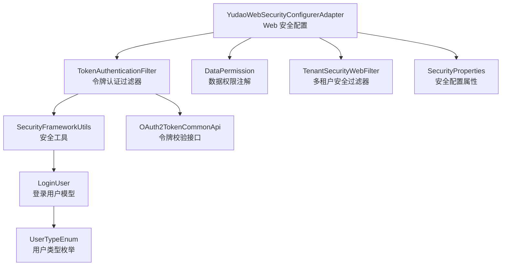
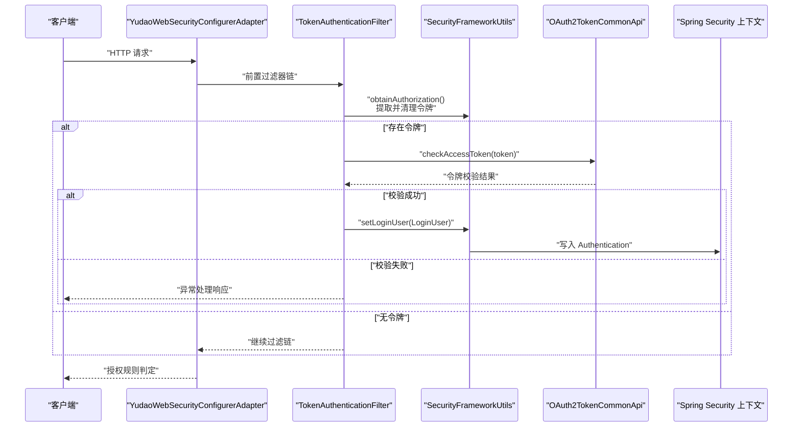
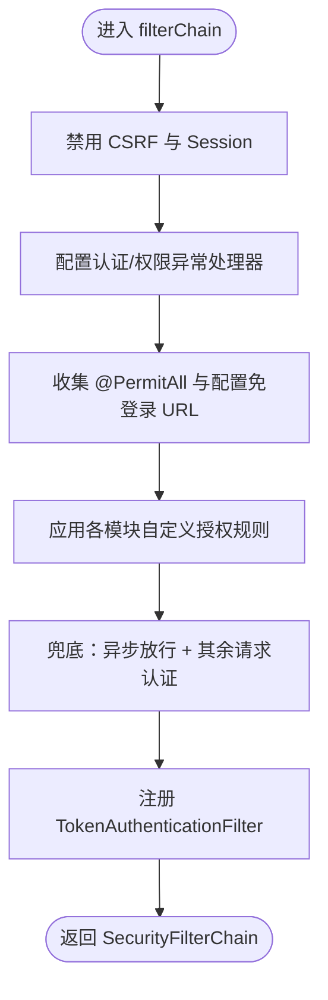
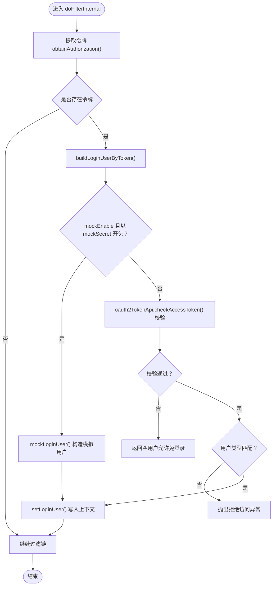
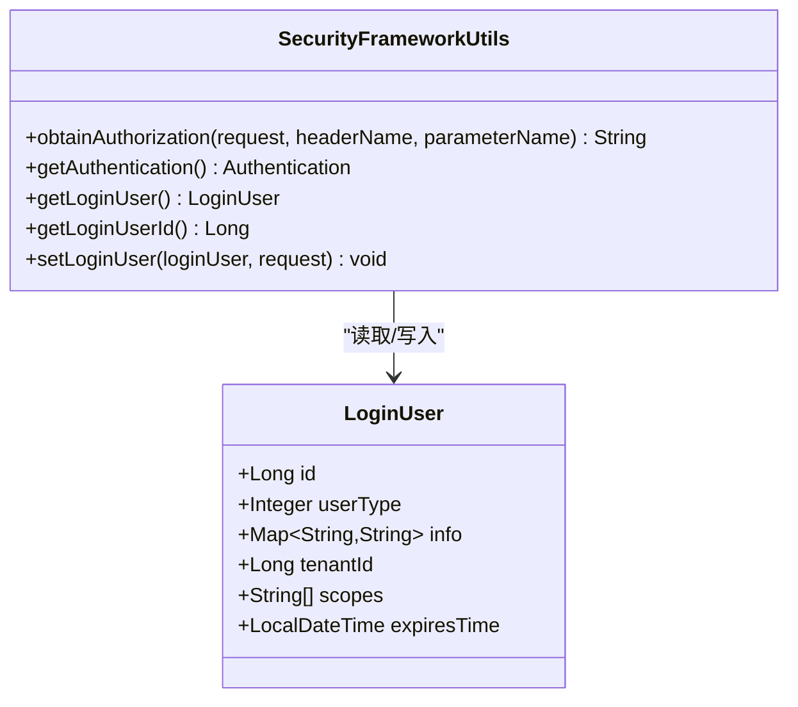
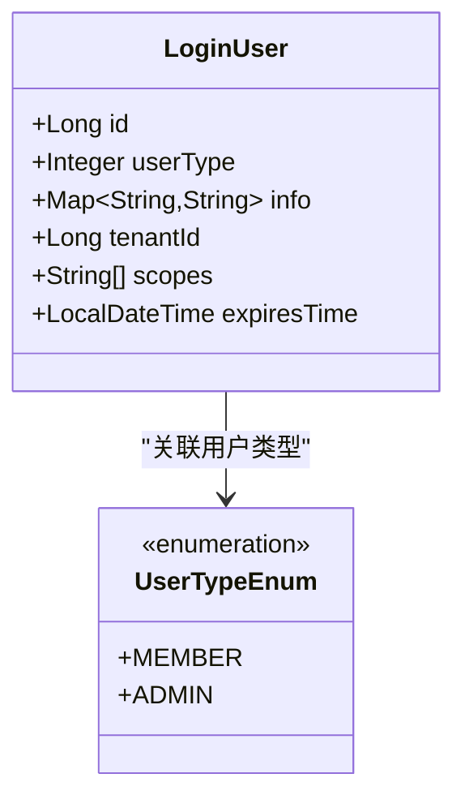
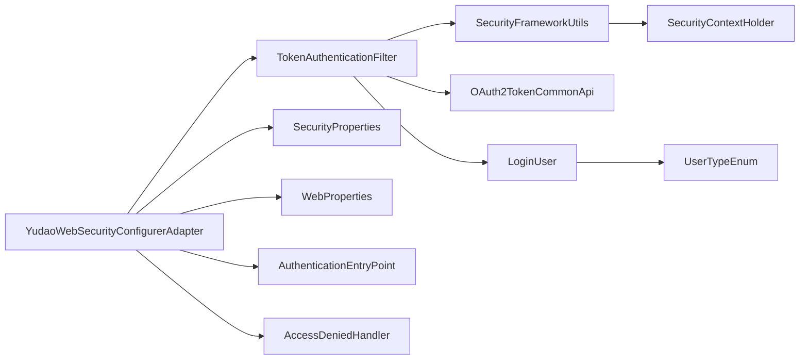

# 安全认证机制

<cite>
**本文引用的文件**
- [YudaoWebSecurityConfigurerAdapter.java](file://backend/yudao-framework/yudao-spring-boot-starter-security/src/main/java/cn/iocoder/yudao/framework/security/config/YudaoWebSecurityConfigurerAdapter.java)
- [TokenAuthenticationFilter.java](file://backend/yudao-framework/yudao-spring-boot-starter-security/src/main/java/cn/iocoder/yudao/framework/security/core/filter/TokenAuthenticationFilter.java)
- [SecurityProperties.java](file://backend/yudao-framework/yudao-spring-boot-starter-security/src/main/java/cn/iocoder/yudao/framework/security/config/SecurityProperties.java)
- [LoginUser.java](file://backend/yudao-framework/yudao-spring-boot-starter-security/src/main/java/cn/iocoder/yudao/framework/security/core/LoginUser.java)
- [SecurityFrameworkUtils.java](file://backend/yudao-framework/yudao-spring-boot-starter-security/src/main/java/cn/iocoder/yudao/framework/security/core/util/SecurityFrameworkUtils.java)
- [UserTypeEnum.java](file://backend/yudao-framework/yudao-common/src/main/java/cn/iocoder/yudao/framework/common/enums/UserTypeEnum.java)
- [DataPermission.java](file://backend/yudao-framework/yudao-spring-boot-starter-biz-data-permission/src/main/java/cn/iocoder/yudao/framework/datapermission/core/annotation/DataPermission.java)
- [TenantSecurityWebFilter.java](file://backend/yudao-framework/yudao-spring-boot-starter-biz-tenant/src/main/java/cn/iocoder/yudao/framework/tenant/core/security/TenantSecurityWebFilter.java)
</cite>

## 目录
1. [简介](#简介)
2. [项目结构](#项目结构)
3. [核心组件](#核心组件)
4. [架构总览](#架构总览)
5. [详细组件分析](#详细组件分析)
6. [依赖关系分析](#依赖关系分析)
7. [性能考量](#性能考量)
8. [故障排查指南](#故障排查指南)
9. [结论](#结论)
10. [附录](#附录)

## 简介
本文件系统化阐述本项目中基于 Spring Security 的安全认证机制，覆盖 Web 安全配置、认证过滤器、授权规则、用户类型与权限控制、菜单权限过滤、会话管理策略、操作日志与安全审计、防暴力破解建议，以及最佳实践与合规性考虑。项目采用“无状态令牌”模式，通过 TokenAuthenticationFilter 校验访问令牌并注入 Spring Security 上下文，结合方法级与请求级授权规则实现细粒度权限控制。

## 项目结构
围绕安全认证的关键模块分布如下：
- 安全配置与适配器：YudaoWebSecurityConfigurerAdapter 提供统一的 Web 安全配置，禁用 CSRF 与 Session，启用方法级安全注解，注册 Token 认证过滤器。
- 认证过滤器：TokenAuthenticationFilter 从请求中提取令牌，调用通用 OAuth2 接口校验令牌有效性，构建 LoginUser 并写入安全上下文。
- 安全工具：SecurityFrameworkUtils 提供令牌解析、当前用户获取、上下文设置等能力。
- 用户模型：LoginUser 描述已认证用户的身份、类型、租户、作用域与过期时间等。
- 用户类型：UserTypeEnum 定义管理员与会员两类用户类型。
- 权限注解：DataPermission 支持方法/类级别数据权限规则的声明式控制。
- 多租户：TenantSecurityWebFilter 提供租户维度的安全拦截与访问控制。
- 配置属性：SecurityProperties 定义令牌头、参数、mock 开关、免登录 URL 列表等。

图表来源
- [YudaoWebSecurityConfigurerAdapter.java:110-153](file://backend/yudao-framework/yudao-spring-boot-starter-security/src/main/java/cn/iocoder/yudao/framework/security/config/YudaoWebSecurityConfigurerAdapter.java#L110-L153)
- [TokenAuthenticationFilter.java:42-69](file://backend/yudao-framework/yudao-spring-boot-starter-security/src/main/java/cn/iocoder/yudao/framework/security/core/filter/TokenAuthenticationFilter.java#L42-L69)
- [SecurityFrameworkUtils.java:41-54](file://backend/yudao-framework/yudao-spring-boot-starter-security/src/main/java/cn/iocoder/yudao/framework/security/core/util/SecurityFrameworkUtils.java#L41-L54)
- [LoginUser.java:27-49](file://backend/yudao-framework/yudao-spring-boot-starter-security/src/main/java/cn/iocoder/yudao/framework/security/core/LoginUser.java#L27-L49)
- [UserTypeEnum.java:17-18](file://backend/yudao-framework/yudao-common/src/main/java/cn/iocoder/yudao/framework/common/enums/UserTypeEnum.java#L17-L18)
- [DataPermission.java:16-35](file://backend/yudao-framework/yudao-spring-boot-starter-biz-data-permission/src/main/java/cn/iocoder/yudao/framework/datapermission/core/annotation/DataPermission.java#L16-L35)
- [TenantSecurityWebFilter.java](file://backend/yudao-framework/yudao-spring-boot-starter-biz-tenant/src/main/java/cn/iocoder/yudao/framework/tenant/core/security/TenantSecurityWebFilter.java)
- [SecurityProperties.java:21-45](file://backend/yudao-framework/yudao-spring-boot-starter-security/src/main/java/cn/iocoder/yudao/framework/security/config/SecurityProperties.java#L21-L45)

章节来源
- [YudaoWebSecurityConfigurerAdapter.java:46-153](file://backend/yudao-framework/yudao-spring-boot-starter-security/src/main/java/cn/iocoder/yudao/framework/security/config/YudaoWebSecurityConfigurerAdapter.java#L46-L153)
- [TokenAuthenticationFilter.java:32-119](file://backend/yudao-framework/yudao-spring-boot-starter-security/src/main/java/cn/iocoder/yudao/framework/security/core/filter/TokenAuthenticationFilter.java#L32-L119)
- [SecurityProperties.java:15-51](file://backend/yudao-framework/yudao-spring-boot-starter-security/src/main/java/cn/iocoder/yudao/framework/security/config/SecurityProperties.java#L15-L51)
- [LoginUser.java:19-75](file://backend/yudao-framework/yudao-spring-boot-starter-security/src/main/java/cn/iocoder/yudao/framework/security/core/LoginUser.java#L19-L75)
- [SecurityFrameworkUtils.java:24-160](file://backend/yudao-framework/yudao-spring-boot-starter-security/src/main/java/cn/iocoder/yudao/framework/security/core/util/SecurityFrameworkUtils.java#L24-L160)
- [UserTypeEnum.java:15-39](file://backend/yudao-framework/yudao-common/src/main/java/cn/iocoder/yudao/framework/common/enums/UserTypeEnum.java#L15-L39)
- [DataPermission.java:13-35](file://backend/yudao-framework/yudao-spring-boot-starter-biz-data-permission/src/main/java/cn/iocoder/yudao/framework/datapermission/core/annotation/DataPermission.java#L13-L35)
- [TenantSecurityWebFilter.java](file://backend/yudao-framework/yudao-spring-boot-starter-biz-tenant/src/main/java/cn/iocoder/yudao/framework/tenant/core/security/TenantSecurityWebFilter.java)

## 核心组件
- Web 安全配置适配器：统一禁用 CSRF 与 Session，启用方法级安全注解，注册 Token 认证过滤器，按注解与配置动态生成免登录 URL 列表，最后统一要求认证。
- 认证过滤器：从请求头或查询参数提取令牌，去除前缀，调用通用令牌校验接口，构建 LoginUser 并写入安全上下文；支持开发环境的 mock 模式。
- 安全工具：提供令牌提取、当前用户获取、上下文设置、跨租户权限跳过判断等。
- 用户模型与类型：LoginUser 承载用户身份、类型、租户、作用域与过期时间；UserTypeEnum 定义管理员与会员两类用户类型。
- 权限注解：DataPermission 支持方法/类级别数据权限规则的声明式控制。
- 多租户安全：TenantSecurityWebFilter 提供租户维度的访问控制与拦截。
- 配置属性：SecurityProperties 提供令牌头/参数、mock 开关、免登录 URL 列表、密码编码复杂度等配置。

章节来源
- [YudaoWebSecurityConfigurerAdapter.java:109-153](file://backend/yudao-framework/yudao-spring-boot-starter-security/src/main/java/cn/iocoder/yudao/framework/security/config/YudaoWebSecurityConfigurerAdapter.java#L109-L153)
- [TokenAuthenticationFilter.java:42-93](file://backend/yudao-framework/yudao-spring-boot-starter-security/src/main/java/cn/iocoder/yudao/framework/security/core/filter/TokenAuthenticationFilter.java#L42-L93)
- [SecurityFrameworkUtils.java:41-133](file://backend/yudao-framework/yudao-spring-boot-starter-security/src/main/java/cn/iocoder/yudao/framework/security/core/util/SecurityFrameworkUtils.java#L41-L133)
- [LoginUser.java:27-49](file://backend/yudao-framework/yudao-spring-boot-starter-security/src/main/java/cn/iocoder/yudao/framework/security/core/LoginUser.java#L27-L49)
- [UserTypeEnum.java:17-18](file://backend/yudao-framework/yudao-common/src/main/java/cn/iocoder/yudao/framework/common/enums/UserTypeEnum.java#L17-L18)
- [DataPermission.java:16-35](file://backend/yudao-framework/yudao-spring-boot-starter-biz-data-permission/src/main/java/cn/iocoder/yudao/framework/datapermission/core/annotation/DataPermission.java#L16-L35)
- [TenantSecurityWebFilter.java](file://backend/yudao-framework/yudao-spring-boot-starter-biz-tenant/src/main/java/cn/iocoder/yudao/framework/tenant/core/security/TenantSecurityWebFilter.java)
- [SecurityProperties.java:21-45](file://backend/yudao-framework/yudao-spring-boot-starter-security/src/main/java/cn/iocoder/yudao/framework/security/config/SecurityProperties.java#L21-L45)

## 架构总览
下图展示从请求进入至权限决策与上下文注入的整体流程：

图表来源
- [YudaoWebSecurityConfigurerAdapter.java:110-153](file://backend/yudao-framework/yudao-spring-boot-starter-security/src/main/java/cn/iocoder/yudao/framework/security/config/YudaoWebSecurityConfigurerAdapter.java#L110-L153)
- [TokenAuthenticationFilter.java:42-93](file://backend/yudao-framework/yudao-spring-boot-starter-security/src/main/java/cn/iocoder/yudao/framework/security/core/filter/TokenAuthenticationFilter.java#L42-L93)
- [SecurityFrameworkUtils.java:41-133](file://backend/yudao-framework/yudao-spring-boot-starter-security/src/main/java/cn/iocoder/yudao/framework/security/core/util/SecurityFrameworkUtils.java#L41-L133)

## 详细组件分析

### Web 安全配置（YudaoWebSecurityConfigurerAdapter）
- 禁用 CSRF 与 Session，采用无状态令牌机制。
- 启用方法级安全注解，支持 @Secured 等注解。
- 动态收集 @PermitAll 注解的 URL，结合配置项 yudao.security.permit-all-urls，形成免登录白名单。
- 默认兜底规则：异步请求放行，其余请求均需认证。
- 注册 TokenAuthenticationFilter 于 UsernamePasswordAuthenticationFilter 之前。

图表来源
- [YudaoWebSecurityConfigurerAdapter.java:110-153](file://backend/yudao-framework/yudao-spring-boot-starter-security/src/main/java/cn/iocoder/yudao/framework/security/config/YudaoWebSecurityConfigurerAdapter.java#L110-L153)

章节来源
- [YudaoWebSecurityConfigurerAdapter.java:109-153](file://backend/yudao-framework/yudao-spring-boot-starter-security/src/main/java/cn/iocoder/yudao/framework/security/config/YudaoWebSecurityConfigurerAdapter.java#L109-L153)

### 认证过滤器（TokenAuthenticationFilter）
- 从请求头 Authorization 或查询参数 token 提取令牌，去除 Bearer 前缀。
- 调用 OAuth2TokenCommonApi.checkAccessToken 校验令牌有效性。
- 若校验成功，构建 LoginUser 并通过 SecurityFrameworkUtils.setLoginUser 写入上下文；若用户类型与请求期望不一致则拒绝访问。
- 支持开发环境 mock 模式：当开启且令牌以 mockSecret 开头时，解析用户编号构造模拟用户。
- 发生异常时交由全局异常处理器统一输出 JSON 响应。

图表来源
- [TokenAuthenticationFilter.java:42-93](file://backend/yudao-framework/yudao-spring-boot-starter-security/src/main/java/cn/iocoder/yudao/framework/security/core/filter/TokenAuthenticationFilter.java#L42-L93)
- [SecurityFrameworkUtils.java:41-133](file://backend/yudao-framework/yudao-spring-boot-starter-security/src/main/java/cn/iocoder/yudao/framework/security/core/util/SecurityFrameworkUtils.java#L41-L133)

章节来源
- [TokenAuthenticationFilter.java:32-119](file://backend/yudao-framework/yudao-spring-boot-starter-security/src/main/java/cn/iocoder/yudao/framework/security/core/filter/TokenAuthenticationFilter.java#L32-L119)

### 安全工具（SecurityFrameworkUtils）
- 提供 obtainAuthorization：优先从 Header 获取，其次从 Parameter 获取，并去除 Bearer 前缀。
- 提供 getAuthentication/getLoginUser/getLoginUserId 等便捷方法。
- setLoginUser：创建 Authentication 并写入 SecurityContextHolder，同时写入 WebFrameworkUtils 的请求上下文以便后续日志与审计使用。

图表来源
- [SecurityFrameworkUtils.java:41-133](file://backend/yudao-framework/yudao-spring-boot-starter-security/src/main/java/cn/iocoder/yudao/framework/security/core/util/SecurityFrameworkUtils.java#L41-L133)
- [LoginUser.java:27-49](file://backend/yudao-framework/yudao-spring-boot-starter-security/src/main/java/cn/iocoder/yudao/framework/security/core/LoginUser.java#L27-L49)

章节来源
- [SecurityFrameworkUtils.java:24-160](file://backend/yudao-framework/yudao-spring-boot-starter-security/src/main/java/cn/iocoder/yudao/framework/security/core/util/SecurityFrameworkUtils.java#L24-L160)

### 用户模型与类型（LoginUser 与 UserTypeEnum）
- LoginUser 字段包含用户编号、用户类型、额外信息、租户编号、授权范围、过期时间等。
- UserTypeEnum 定义 MEMBER（会员）与 ADMIN（管理员）两类用户类型，用于区分前端与后台访问场景。

图表来源
- [LoginUser.java:27-49](file://backend/yudao-framework/yudao-spring-boot-starter-security/src/main/java/cn/iocoder/yudao/framework/security/core/LoginUser.java#L27-L49)
- [UserTypeEnum.java:17-18](file://backend/yudao-framework/yudao-common/src/main/java/cn/iocoder/yudao/framework/common/enums/UserTypeEnum.java#L17-L18)

章节来源
- [LoginUser.java:19-75](file://backend/yudao-framework/yudao-spring-boot-starter-security/src/main/java/cn/iocoder/yudao/framework/security/core/LoginUser.java#L19-L75)
- [UserTypeEnum.java:15-39](file://backend/yudao-framework/yudao-common/src/main/java/cn/iocoder/yudao/framework/common/enums/UserTypeEnum.java#L15-L39)

### 权限控制与数据权限（DataPermission）
- DataPermission 注解支持在类或方法上声明数据权限规则，可指定 includeRules/excludeRules，实现细粒度的数据访问控制。
- 与方法级安全注解配合，可在业务层精确控制数据可见性。

章节来源
- [DataPermission.java:13-35](file://backend/yudao-framework/yudao-spring-boot-starter-biz-data-permission/src/main/java/cn/iocoder/yudao/framework/datapermission/core/annotation/DataPermission.java#L13-L35)

### 多租户安全（TenantSecurityWebFilter）
- TenantSecurityWebFilter 提供跨租户访问的拦截与控制逻辑，结合 LoginUser.visitTenantId 与 tenantId 的比较，决定是否跳过权限校验或拒绝访问。

章节来源
- [TenantSecurityWebFilter.java](file://backend/yudao-framework/yudao-spring-boot-starter-biz-tenant/src/main/java/cn/iocoder/yudao/framework/tenant/core/security/TenantSecurityWebFilter.java)

### 会话管理策略
- 采用 STATELESS 会话策略，不使用 Session，所有状态通过令牌携带与服务端校验实现。
- 通过 OAuth2TokenCommonApi 校验令牌有效性，结合 LoginUser.expiryTime 实现过期控制。

章节来源
- [YudaoWebSecurityConfigurerAdapter.java:118](file://backend/yudao-framework/yudao-spring-boot-starter-security/src/main/java/cn/iocoder/yudao/framework/security/config/YudaoWebSecurityConfigurerAdapter.java#L118)
- [LoginUser.java:49](file://backend/yudao-framework/yudao-spring-boot-starter-security/src/main/java/cn/iocoder/yudao/framework/security/core/LoginUser.java#L49)

### JWT 令牌生成、验证与刷新机制
- 令牌提取与清理：SecurityFrameworkUtils.obtainAuthorization 优先从 Header 获取，其次从 Parameter 获取，并去除 Bearer 前缀。
- 令牌验证：TokenAuthenticationFilter 调用 OAuth2TokenCommonApi.checkAccessToken 校验令牌有效性。
- 令牌刷新：项目未提供专用刷新接口实现，建议通过 OAuth2 平台提供的刷新流程完成；当前实现以校验为主，不包含刷新逻辑。

章节来源
- [SecurityFrameworkUtils.java:41-54](file://backend/yudao-framework/yudao-spring-boot-starter-security/src/main/java/cn/iocoder/yudao/framework/security/core/util/SecurityFrameworkUtils.java#L41-L54)
- [TokenAuthenticationFilter.java:73-93](file://backend/yudao-framework/yudao-spring-boot-starter-security/src/main/java/cn/iocoder/yudao/framework/security/core/filter/TokenAuthenticationFilter.java#L73-L93)

### 用户类型区分与权限控制粒度
- 用户类型：MEMBER（会员）与 ADMIN（管理员），通过 UserTypeEnum 定义。
- 类型匹配：TokenAuthenticationFilter 在存在 userType 时对比令牌中的用户类型，不一致则拒绝访问。
- 权限注解：DataPermission 支持方法/类级别数据权限规则声明，结合业务规则实现细粒度控制。

章节来源
- [UserTypeEnum.java:17-18](file://backend/yudao-framework/yudao-common/src/main/java/cn/iocoder/yudao/framework/common/enums/UserTypeEnum.java#L17-L18)
- [TokenAuthenticationFilter.java:80-83](file://backend/yudao-framework/yudao-spring-boot-starter-security/src/main/java/cn/iocoder/yudao/framework/security/core/filter/TokenAuthenticationFilter.java#L80-L83)
- [DataPermission.java:16-35](file://backend/yudao-framework/yudao-spring-boot-starter-biz-data-permission/src/main/java/cn/iocoder/yudao/framework/datapermission/core/annotation/DataPermission.java#L16-L35)

### 菜单权限过滤
- 项目未提供专门的菜单权限过滤器实现；可通过以下方式扩展：
  - 在控制器层结合 @PreAuthorize/@PostAuthorize 或方法级注解进行权限控制。
  - 在业务层通过 DataPermission 与数据权限规则实现菜单项可见性控制。
  - 在前端路由层根据用户类型与角色动态渲染菜单。

章节来源
- [YudaoWebSecurityConfigurerAdapter.java:146-148](file://backend/yudao-framework/yudao-spring-boot-starter-security/src/main/java/cn/iocoder/yudao/framework/security/config/YudaoWebSecurityConfigurerAdapter.java#L146-L148)
- [DataPermission.java:16-35](file://backend/yudao-framework/yudao-spring-boot-starter-biz-data-permission/src/main/java/cn/iocoder/yudao/framework/datapermission/core/annotation/DataPermission.java#L16-L35)

### 操作日志记录、安全审计与防暴力破解
- 操作日志：SecurityFrameworkUtils 将用户编号与类型写入 WebFrameworkUtils 的请求上下文，便于后续日志过滤器记录。
- 安全审计：结合日志系统与审计平台，记录关键操作与异常事件。
- 防暴力破解：建议在网关或业务层引入限流与频率限制策略（如基于 IP/用户维度的速率限制），并结合验证码与二次校验机制。

章节来源
- [SecurityFrameworkUtils.java:122-133](file://backend/yudao-framework/yudao-spring-boot-starter-security/src/main/java/cn/iocoder/yudao/framework/security/core/util/SecurityFrameworkUtils.java#L122-L133)

## 依赖关系分析
- 组件耦合：
  - YudaoWebSecurityConfigurerAdapter 依赖 TokenAuthenticationFilter、SecurityProperties、WebProperties、AuthenticationEntryPoint、AccessDeniedHandler。
  - TokenAuthenticationFilter 依赖 SecurityProperties、GlobalExceptionHandler、OAuth2TokenCommonApi、SecurityFrameworkUtils。
  - SecurityFrameworkUtils 依赖 SecurityContextHolder 与 WebFrameworkUtils。
  - LoginUser 与 UserTypeEnum 解耦，便于扩展其他用户类型。
- 外部依赖：
  - OAuth2TokenCommonApi：用于令牌校验。
  - Spring Security：提供认证与授权基础设施。
  - WebFrameworkUtils：提供请求上下文与租户信息。

图表来源
- [YudaoWebSecurityConfigurerAdapter.java:51-81](file://backend/yudao-framework/yudao-spring-boot-starter-security/src/main/java/cn/iocoder/yudao/framework/security/config/YudaoWebSecurityConfigurerAdapter.java#L51-L81)
- [TokenAuthenticationFilter.java:34-38](file://backend/yudao-framework/yudao-spring-boot-starter-security/src/main/java/cn/iocoder/yudao/framework/security/core/filter/TokenAuthenticationFilter.java#L34-L38)
- [SecurityFrameworkUtils.java:122-141](file://backend/yudao-framework/yudao-spring-boot-starter-security/src/main/java/cn/iocoder/yudao/framework/security/core/util/SecurityFrameworkUtils.java#L122-L141)
- [LoginUser.java:27-49](file://backend/yudao-framework/yudao-spring-boot-starter-security/src/main/java/cn/iocoder/yudao/framework/security/core/LoginUser.java#L27-L49)
- [UserTypeEnum.java:17-18](file://backend/yudao-framework/yudao-common/src/main/java/cn/iocoder/yudao/framework/common/enums/UserTypeEnum.java#L17-L18)

章节来源
- [YudaoWebSecurityConfigurerAdapter.java:49-81](file://backend/yudao-framework/yudao-spring-boot-starter-security/src/main/java/cn/iocoder/yudao/framework/security/config/YudaoWebSecurityConfigurerAdapter.java#L49-L81)
- [TokenAuthenticationFilter.java:32-38](file://backend/yudao-framework/yudao-spring-boot-starter-security/src/main/java/cn/iocoder/yudao/framework/security/core/filter/TokenAuthenticationFilter.java#L32-L38)
- [SecurityFrameworkUtils.java:122-141](file://backend/yudao-framework/yudao-spring-boot-starter-security/src/main/java/cn/iocoder/yudao/framework/security/core/util/SecurityFrameworkUtils.java#L122-L141)

## 性能考量
- 无状态设计：STATELESS 策略避免 Session 存储，降低服务器内存压力。
- 令牌校验：通过 OAuth2TokenCommonApi 校验令牌，建议在网关层或集中式缓存中复用校验结果，减少重复调用。
- 过滤器链：仅在必要路径执行令牌校验，静态资源与免登录路径快速放行。
- 日志与审计：避免在高频接口中记录大对象，减少序列化开销。

## 故障排查指南
- 令牌无效或过期：检查 obtainAuthorization 是否正确去除 Bearer 前缀，确认 OAuth2 校验接口返回状态。
- 用户类型不匹配：确认请求路径与 userType 是否对应（例如 /admin-api/* 与 /app-api/*），确保令牌中的 userType 与请求期望一致。
- mock 模式误用：生产环境务必关闭 mockEnable，防止安全风险。
- 免登录规则冲突：检查 @PermitAll 注解与 yudao.security.permit-all-urls 配置，避免误放敏感接口。
- 跨租户访问：当 visitTenantId 与 tenantId 不一致时，可能触发权限跳过逻辑，需结合业务规则评估。

章节来源
- [SecurityFrameworkUtils.java:41-54](file://backend/yudao-framework/yudao-spring-boot-starter-security/src/main/java/cn/iocoder/yudao/framework/security/core/util/SecurityFrameworkUtils.java#L41-L54)
- [TokenAuthenticationFilter.java:80-83](file://backend/yudao-framework/yudao-spring-boot-starter-security/src/main/java/cn/iocoder/yudao/framework/security/core/filter/TokenAuthenticationFilter.java#L80-L83)
- [SecurityProperties.java:33-40](file://backend/yudao-framework/yudao-spring-boot-starter-security/src/main/java/cn/iocoder/yudao/framework/security/config/SecurityProperties.java#L33-L40)

## 结论
本项目通过无状态令牌与 Spring Security 的深度集成，实现了灵活的认证与授权控制。TokenAuthenticationFilter 负责令牌校验与上下文注入，YudaoWebSecurityConfigurerAdapter 提供统一的授权规则与异常处理。结合用户类型、数据权限注解与多租户过滤器，可满足多场景下的权限需求。建议在生产环境中完善令牌刷新、防暴力破解与审计日志体系，持续提升安全韧性。

## 附录
- 安全配置模板（基于现有实现的推荐配置）
  - 令牌头与参数：参考 SecurityProperties 的 tokenHeader 与 tokenParameter。
  - 免登录 URL：通过 yudao.security.permit-all-urls 与 @PermitAll 注解组合配置。
  - mock 模式：仅在开发环境启用，生产关闭。
  - 会话策略：保持 STATELESS，不使用 Session。
  - 方法级安全：启用 @Secured 等注解，结合业务权限细化控制。
  - 数据权限：在关键业务接口使用 @DataPermission 控制数据可见性。
  - 多租户：结合 TenantSecurityWebFilter 实施跨租户访问控制。

章节来源
- [SecurityProperties.java:21-45](file://backend/yudao-framework/yudao-spring-boot-starter-security/src/main/java/cn/iocoder/yudao/framework/security/config/SecurityProperties.java#L21-L45)
- [YudaoWebSecurityConfigurerAdapter.java:118-148](file://backend/yudao-framework/yudao-spring-boot-starter-security/src/main/java/cn/iocoder/yudao/framework/security/config/YudaoWebSecurityConfigurerAdapter.java#L118-L148)
- [DataPermission.java:16-35](file://backend/yudao-framework/yudao-spring-boot-starter-biz-data-permission/src/main/java/cn/iocoder/yudao/framework/datapermission/core/annotation/DataPermission.java#L16-L35)
- [TenantSecurityWebFilter.java](file://backend/yudao-framework/yudao-spring-boot-starter-biz-tenant/src/main/java/cn/iocoder/yudao/framework/tenant/core/security/TenantSecurityWebFilter.java)