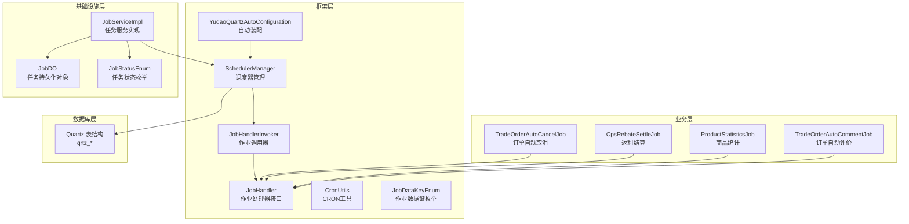
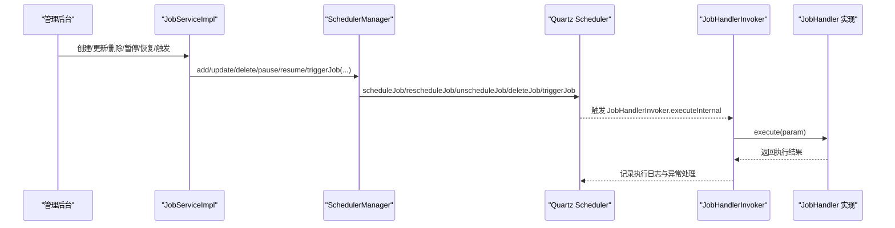
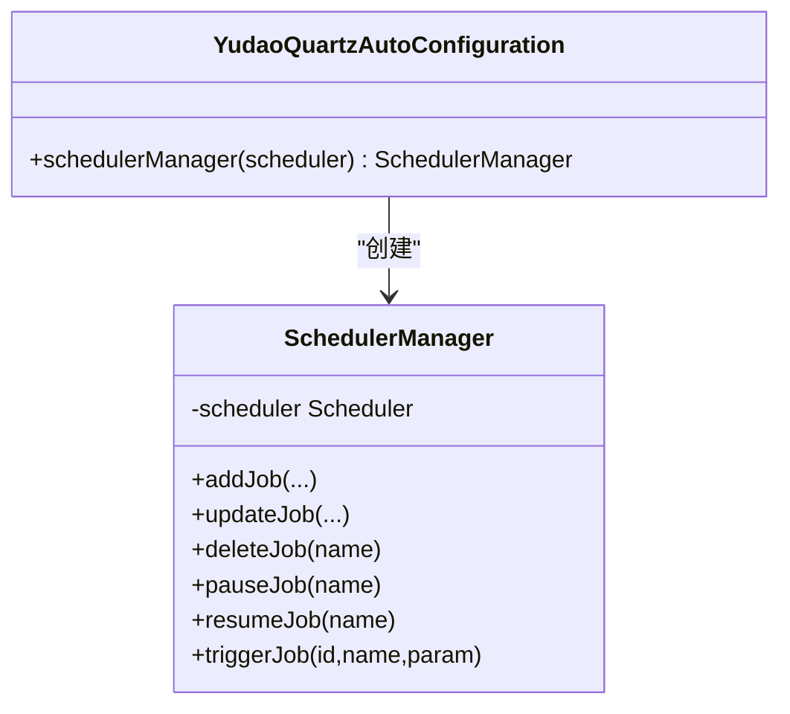
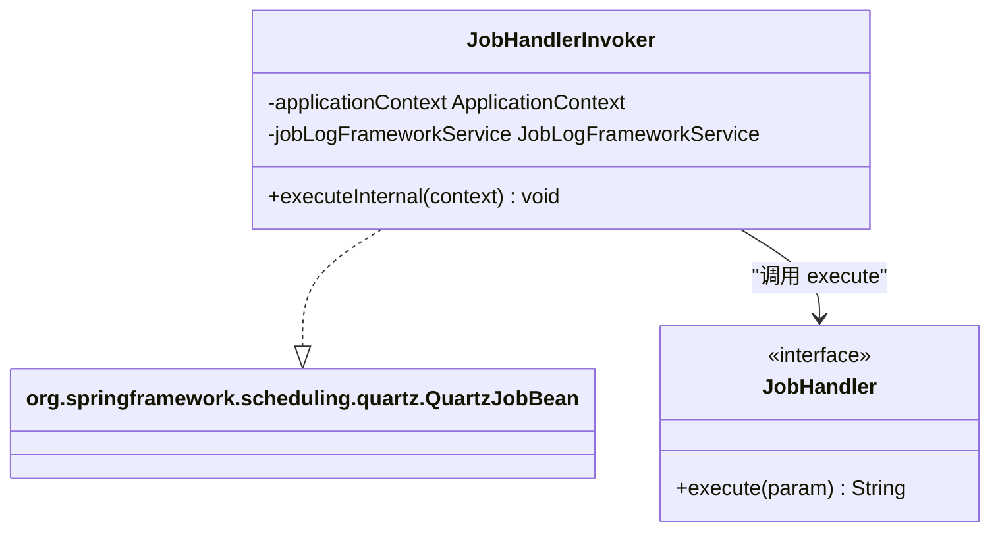
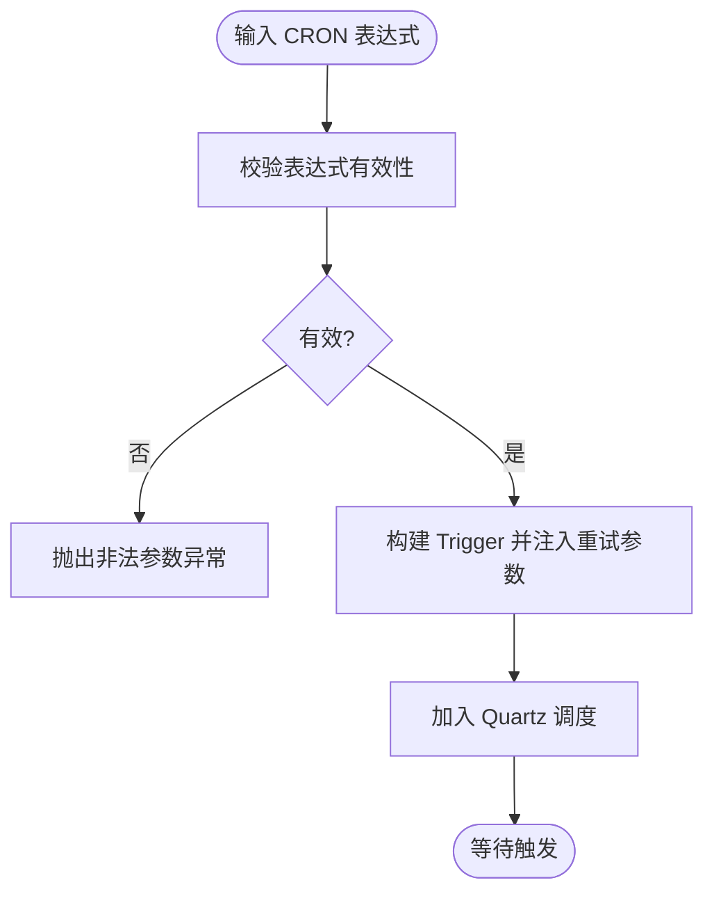
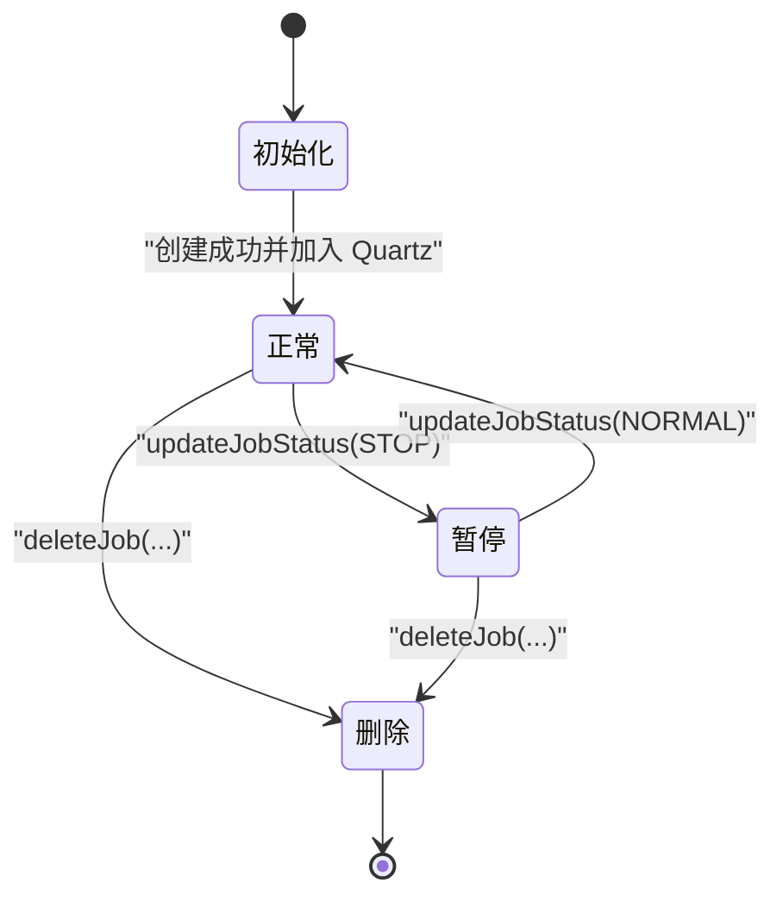
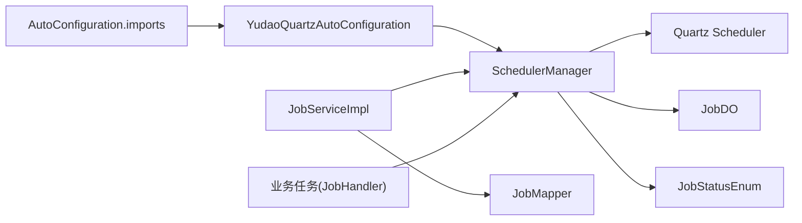

# 定时任务系统

<cite>
**本文引用的文件**
- [YudaoQuartzAutoConfiguration.java](file://backend/yudao-framework/yudao-spring-boot-starter-job/src/main/java/cn/iocoder/yudao/framework/quartz/config/YudaoQuartzAutoConfiguration.java)
- [SchedulerManager.java](file://backend/yudao-framework/yudao-spring-boot-starter-job/src/main/java/cn/iocoder/yudao/framework/quartz/core/scheduler/SchedulerManager.java)
- [JobHandler.java](file://backend/yudao-framework/yudao-spring-boot-starter-job/src/main/java/cn/iocoder/yudao/framework/quartz/core/handler/JobHandler.java)
- [JobHandlerInvoker.java](file://backend/yudao-framework/yudao-spring-boot-starter-job/src/main/java/cn/iocoder/yudao/framework/quartz/core/handler/JobHandlerInvoker.java)
- [JobDataKeyEnum.java](file://backend/yudao-framework/yudao-spring-boot-starter-job/src/main/java/cn/iocoder/yudao/framework/quartz/core/enums/JobDataKeyEnum.java)
- [CronUtils.java](file://backend/yudao-framework/yudao-spring-boot-starter-job/src/main/java/cn/iocoder/yudao/framework/quartz/core/util/CronUtils.java)
- [application-local.yaml](file://backend/yudao-server/src/main/resources/application-local.yaml)
- [JobService.java](file://backend/yudao-module-infra/src/main/java/cn/iocoder/yudao/module/infra/service/job/JobService.java)
- [JobServiceImpl.java](file://backend/yudao-module-infra/src/main/java/cn/iocoder/yudao/module/infra/service/job/JobServiceImpl.java)
- [JobDO.java](file://backend/yudao-module-infra/src/main/java/cn/iocoder/yudao/module/infra/dal/dataobject/job/JobDO.java)
- [JobStatusEnum.java](file://backend/yudao-module-infra/src/main/java/cn/iocoder/yudao/module/infra/enums/job/JobStatusEnum.java)
- [TradeOrderAutoCancelJob.java](file://backend/yudao-module-mall/yudao-module-trade/src/main/java/cn/iocoder/yudao/module/trade/job/order/TradeOrderAutoCancelJob.java)
- [CpsRebateSettleJob.java](file://backend/yudao-module-cps/yudao-module-cps-biz/src/main/java/cn/iocoder/yudao/module/cps/job/CpsRebateSettleJob.java)
- [ProductStatisticsJob.java](file://backend/yudao-module-mall/yudao-module-statistics/src/main/java/cn/iocoder/yudao/module/statistics/job/product/ProductStatisticsJob.java)
- [TradeOrderAutoCommentJob.java](file://backend/yudao-module-mall/yudao-module-trade/src/main/java/cn/iocoder/yudao/module/trade/job/order/TradeOrderAutoCommentJob.java)
- [quartz.sql](file://backend/sql/mysql/quartz.sql)
- [org.springframework.boot.autoconfigure.AutoConfiguration.imports](file://backend/yudao-framework/yudao-spring-boot-starter-job/src/main/resources/META-INF/spring/org.springframework.boot.autoconfigure.AutoConfiguration.imports)
</cite>

## 目录
1. [引言](#引言)
2. [项目结构](#项目结构)
3. [核心组件](#核心组件)
4. [架构总览](#架构总览)
5. [详细组件分析](#详细组件分析)
6. [依赖关系分析](#依赖关系分析)
7. [性能考量](#性能考量)
8. [故障排查指南](#故障排查指南)
9. [结论](#结论)
10. [附录](#附录)

## 引言
本文件面向“定时任务系统”的综合技术文档，围绕 Quartz 定时任务框架在项目中的集成与配置展开，涵盖自动配置类、任务调度器与作业工厂的设置，以及定时任务的生命周期管理、触发器配置与执行监控。文档同时梳理了系统内典型业务场景（订单状态同步、返利结算、数据清理、报表生成等）的任务实现方式，并给出任务的创建、修改、暂停与删除操作流程、最佳实践、性能优化与故障处理策略，以及可复用的配置模板与实现示例路径。

## 项目结构
定时任务能力由“框架层”和“业务层”共同组成：
- 框架层（yudao-spring-boot-starter-job）：提供 Quartz 自动装配、调度器管理、作业调用器、作业处理器接口、CRON 工具与日志服务等通用能力。
- 业务层（各模块 job 包）：通过实现 JobHandler 接口编写具体任务逻辑，并在管理后台统一注册与调度。
- 基础设施层（infra 模块）：提供定时任务的持久化、状态管理、分页查询、同步与运维接口。
- 数据库层：Quartz 内置表结构（如 qrtz_triggers、qrtz_job_details 等）用于持久化任务与触发器。

图表来源
- [YudaoQuartzAutoConfiguration.java:1-30](file://backend/yudao-framework/yudao-spring-boot-starter-job/src/main/java/cn/iocoder/yudao/framework/quartz/config/YudaoQuartzAutoConfiguration.java#L1-L30)
- [SchedulerManager.java:1-151](file://backend/yudao-framework/yudao-spring-boot-starter-job/src/main/java/cn/iocoder/yudao/framework/quartz/core/scheduler/SchedulerManager.java#L1-L151)
- [JobHandlerInvoker.java:1-114](file://backend/yudao-framework/yudao-spring-boot-starter-job/src/main/java/cn/iocoder/yudao/framework/quartz/core/handler/JobHandlerInvoker.java#L1-L114)
- [JobHandler.java:1-20](file://backend/yudao-framework/yudao-spring-boot-starter-job/src/main/java/cn/iocoder/yudao/framework/quartz/core/handler/JobHandler.java#L1-L20)
- [CronUtils.java:1-61](file://backend/yudao-framework/yudao-spring-boot-starter-job/src/main/java/cn/iocoder/yudao/framework/quartz/core/util/CronUtils.java#L1-L61)
- [JobServiceImpl.java:1-216](file://backend/yudao-module-infra/src/main/java/cn/iocoder/yudao/module/infra/service/job/JobServiceImpl.java#L1-L216)
- [JobDO.java:1-77](file://backend/yudao-module-infra/src/main/java/cn/iocoder/yudao/module/infra/dal/dataobject/job/JobDO.java#L1-L77)
- [JobStatusEnum.java:1-43](file://backend/yudao-module-infra/src/main/java/cn/iocoder/yudao/module/infra/enums/job/JobStatusEnum.java#L1-L43)
- [TradeOrderAutoCancelJob.java:1-29](file://backend/yudao-module-mall/yudao-module-trade/src/main/java/cn/iocoder/yudao/module/trade/job/order/TradeOrderAutoCancelJob.java#L1-L29)
- [CpsRebateSettleJob.java:1-60](file://backend/yudao-module-cps/yudao-module-cps-biz/src/main/java/cn/iocoder/yudao/module/cps/job/CpsRebateSettleJob.java#L1-L60)
- [ProductStatisticsJob.java:1-47](file://backend/yudao-module-mall/yudao-module-statistics/src/main/java/cn/iocoder/yudao/module/statistics/job/product/ProductStatisticsJob.java#L1-L47)
- [TradeOrderAutoCommentJob.java:1-28](file://backend/yudao-module-mall/yudao-module-trade/src/main/java/cn/iocoder/yudao/module/trade/job/order/TradeOrderAutoCommentJob.java#L1-L28)
- [quartz.sql](file://backend/sql/mysql/quartz.sql)

章节来源
- [YudaoQuartzAutoConfiguration.java:1-30](file://backend/yudao-framework/yudao-spring-boot-starter-job/src/main/java/cn/iocoder/yudao/framework/quartz/config/YudaoQuartzAutoConfiguration.java#L1-L30)
- [JobServiceImpl.java:1-216](file://backend/yudao-module-infra/src/main/java/cn/iocoder/yudao/module/infra/service/job/JobServiceImpl.java#L1-L216)

## 核心组件
- 自动配置类：负责在启用 Quartz 时注入调度器管理器，若未检测到调度器则标记为“已禁用”，避免误用。
- 调度器管理器：封装 Quartz 的 Job/Trigger 创建、更新、删除、暂停、恢复与立即触发等操作。
- 作业处理器接口与调用器：定义统一的 JobHandler 接口，由 JobHandlerInvoker 在 Quartz 上下文中解析参数、执行任务并记录日志。
- CRON 工具：提供表达式合法性校验与下 N 次触发时间计算。
- 业务服务与实体：infra 模块提供定时任务的 CRUD、状态变更、同步与分页查询，持久化对象包含任务基础信息与重试/监控字段。

章节来源
- [YudaoQuartzAutoConfiguration.java:15-29](file://backend/yudao-framework/yudao-spring-boot-starter-job/src/main/java/cn/iocoder/yudao/framework/quartz/config/YudaoQuartzAutoConfiguration.java#L15-L29)
- [SchedulerManager.java:21-151](file://backend/yudao-framework/yudao-spring-boot-starter-job/src/main/java/cn/iocoder/yudao/framework/quartz/core/scheduler/SchedulerManager.java#L21-L151)
- [JobHandler.java:8-19](file://backend/yudao-framework/yudao-spring-boot-starter-job/src/main/java/cn/iocoder/yudao/framework/quartz/core/handler/JobHandler.java#L8-L19)
- [JobHandlerInvoker.java:29-114](file://backend/yudao-framework/yudao-spring-boot-starter-job/src/main/java/cn/iocoder/yudao/framework/quartz/core/handler/JobHandlerInvoker.java#L29-L114)
- [CronUtils.java:17-61](file://backend/yudao-framework/yudao-spring-boot-starter-job/src/main/java/cn/iocoder/yudao/framework/quartz/core/util/CronUtils.java#L17-L61)
- [JobServiceImpl.java:34-216](file://backend/yudao-module-infra/src/main/java/cn/iocoder/yudao/module/infra/service/job/JobServiceImpl.java#L34-L216)
- [JobDO.java:25-77](file://backend/yudao-module-infra/src/main/java/cn/iocoder/yudao/module/infra/dal/dataobject/job/JobDO.java#L25-L77)

## 架构总览
定时任务系统采用“框架 + 业务 + 基础设施 + 数据库”的分层设计：
- 框架层提供 Quartz 集成与调度抽象；
- 业务层以 JobHandler 为入口实现具体任务；
- 基础设施层负责任务的持久化与运维；
- 数据库层通过 Quartz 内置表持久化任务与触发器。

图表来源
- [JobServiceImpl.java:47-183](file://backend/yudao-module-infra/src/main/java/cn/iocoder/yudao/module/infra/service/job/JobServiceImpl.java#L47-L183)
- [SchedulerManager.java:40-130](file://backend/yudao-framework/yudao-spring-boot-starter-job/src/main/java/cn/iocoder/yudao/framework/quartz/core/scheduler/SchedulerManager.java#L40-L130)
- [JobHandlerInvoker.java:38-111](file://backend/yudao-framework/yudao-spring-boot-starter-job/src/main/java/cn/iocoder/yudao/framework/quartz/core/handler/JobHandlerInvoker.java#L38-L111)
- [JobHandler.java:10-17](file://backend/yudao-framework/yudao-spring-boot-starter-job/src/main/java/cn/iocoder/yudao/framework/quartz/core/handler/JobHandler.java#L10-L17)

## 详细组件分析

### 自动配置类与调度器管理
- 自动配置类在检测到 Quartz 调度器时创建调度器管理器；否则返回“已禁用”状态，避免后续操作报错。
- 调度器管理器封装 Quartz 的 Job/Trigger 生命周期操作，统一使用 jobHandlerName 作为唯一标识，便于与 Spring Bean 对应。

图表来源
- [YudaoQuartzAutoConfiguration.java:20-27](file://backend/yudao-framework/yudao-spring-boot-starter-job/src/main/java/cn/iocoder/yudao/framework/quartz/config/YudaoQuartzAutoConfiguration.java#L20-L27)
- [SchedulerManager.java:23-151](file://backend/yudao-framework/yudao-spring-boot-starter-job/src/main/java/cn/iocoder/yudao/framework/quartz/core/scheduler/SchedulerManager.java#L23-L151)

章节来源
- [YudaoQuartzAutoConfiguration.java:15-29](file://backend/yudao-framework/yudao-spring-boot-starter-job/src/main/java/cn/iocoder/yudao/framework/quartz/config/YudaoQuartzAutoConfiguration.java#L15-L29)
- [SchedulerManager.java:21-151](file://backend/yudao-framework/yudao-spring-boot-starter-job/src/main/java/cn/iocoder/yudao/framework/quartz/core/scheduler/SchedulerManager.java#L21-L151)

### 作业处理器与调用器
- 作业处理器接口定义统一的 execute 方法，业务任务需实现该接口并通过 Spring Bean 名称注册。
- 作业调用器在 Quartz 上下文中解析合并后的 JobDataMap，获取任务 ID、处理器名、参数、重试次数与间隔，执行后异步记录执行日志，并根据异常决定是否重试。

图表来源
- [JobHandler.java:8-19](file://backend/yudao-framework/yudao-spring-boot-starter-job/src/main/java/cn/iocoder/yudao/framework/quartz/core/handler/JobHandler.java#L8-L19)
- [JobHandlerInvoker.java:29-114](file://backend/yudao-framework/yudao-spring-boot-starter-job/src/main/java/cn/iocoder/yudao/framework/quartz/core/handler/JobHandlerInvoker.java#L29-L114)

章节来源
- [JobHandler.java:8-19](file://backend/yudao-framework/yudao-spring-boot-starter-job/src/main/java/cn/iocoder/yudao/framework/quartz/core/handler/JobHandler.java#L8-L19)
- [JobHandlerInvoker.java:38-111](file://backend/yudao-framework/yudao-spring-boot-starter-job/src/main/java/cn/iocoder/yudao/framework/quartz/core/handler/JobHandlerInvoker.java#L38-L111)

### 触发器与 CRON 表达式
- 触发器基于 CRON 表达式构建，支持重试次数与间隔参数注入到 JobDataMap。
- CRON 工具提供表达式合法性校验与下 N 次触发时间计算，便于排障与预估。

图表来源
- [SchedulerManager.java:132-141](file://backend/yudao-framework/yudao-spring-boot-starter-job/src/main/java/cn/iocoder/yudao/framework/quartz/core/scheduler/SchedulerManager.java#L132-L141)
- [CronUtils.java:25-27](file://backend/yudao-framework/yudao-spring-boot-starter-job/src/main/java/cn/iocoder/yudao/framework/quartz/core/util/CronUtils.java#L25-L27)

章节来源
- [SchedulerManager.java:132-141](file://backend/yudao-framework/yudao-spring-boot-starter-job/src/main/java/cn/iocoder/yudao/framework/quartz/core/scheduler/SchedulerManager.java#L132-L141)
- [CronUtils.java:17-61](file://backend/yudao-framework/yudao-spring-boot-starter-job/src/main/java/cn/iocoder/yudao/framework/quartz/core/util/CronUtils.java#L17-L61)

### 任务生命周期与状态管理
- 生命周期：创建 -> 加入 Quartz -> 运行 -> 暂停/恢复 -> 删除。
- 状态枚举映射 Quartz 触发器状态，支持初始化、正常运行与暂停三种状态。
- 业务服务负责校验 CRON 表达式、校验处理器 Bean 存在性与类型、维护任务状态与同步 Quartz。

图表来源
- [JobStatusEnum.java:18-42](file://backend/yudao-module-infra/src/main/java/cn/iocoder/yudao/module/infra/enums/job/JobStatusEnum.java#L18-L42)
- [JobServiceImpl.java:108-129](file://backend/yudao-module-infra/src/main/java/cn/iocoder/yudao/module/infra/service/job/JobServiceImpl.java#L108-L129)

章节来源
- [JobStatusEnum.java:18-42](file://backend/yudao-module-infra/src/main/java/cn/iocoder/yudao/module/infra/enums/job/JobStatusEnum.java#L18-L42)
- [JobServiceImpl.java:108-129](file://backend/yudao-module-infra/src/main/java/cn/iocoder/yudao/module/infra/service/job/JobServiceImpl.java#L108-L129)

### 业务场景与任务实现示例
- 订单状态同步：TradeOrderAutoCancelJob 与 TradeOrderAutoCommentJob 通过 JobHandler 接口实现，分别执行“系统自动取消超时订单”和“系统自动生成评价”。
- 返利结算：CpsRebateSettleJob 支持通过 JSON 参数传入批次大小，按批处理订单返利结算。
- 数据清理与报表：可通过新增 JobHandler 实现定时清理与报表生成任务。

章节来源
- [TradeOrderAutoCancelJob.java:15-28](file://backend/yudao-module-mall/yudao-module-trade/src/main/java/cn/iocoder/yudao/module/trade/job/order/TradeOrderAutoCancelJob.java#L15-L28)
- [TradeOrderAutoCommentJob.java:15-28](file://backend/yudao-module-mall/yudao-module-trade/src/main/java/cn/iocoder/yudao/module/trade/job/order/TradeOrderAutoCommentJob.java#L15-L28)
- [CpsRebateSettleJob.java:26-60](file://backend/yudao-module-cps/yudao-module-cps-biz/src/main/java/cn/iocoder/yudao/module/cps/job/CpsRebateSettleJob.java#L26-L60)
- [ProductStatisticsJob.java:18-47](file://backend/yudao-module-mall/yudao-module-statistics/src/main/java/cn/iocoder/yudao/module/statistics/job/product/ProductStatisticsJob.java#L18-L47)

## 依赖关系分析
- 自动配置导入：通过 AutoConfiguration.imports 文件声明自动装配类，确保启动时加载 Quartz 与异步配置。
- 业务任务依赖：所有业务任务均实现 JobHandler 接口并通过 Spring Bean 名称注册，调度器管理器通过名称定位处理器。
- 数据持久化：JobServiceImpl 依赖 JobMapper 与 SchedulerManager，结合 JobDO 与 JobStatusEnum 完成任务的 CRUD、状态变更与同步。

图表来源
- [org.springframework.boot.autoconfigure.AutoConfiguration.imports:1-2](file://backend/yudao-framework/yudao-spring-boot-starter-job/src/main/resources/META-INF/spring/org.springframework.boot.autoconfigure.AutoConfiguration.imports#L1-L2)
- [YudaoQuartzAutoConfiguration.java:18-27](file://backend/yudao-framework/yudao-spring-boot-starter-job/src/main/java/cn/iocoder/yudao/framework/quartz/config/YudaoQuartzAutoConfiguration.java#L18-L27)
- [JobServiceImpl.java:42-43](file://backend/yudao-module-infra/src/main/java/cn/iocoder/yudao/module/infra/service/job/JobServiceImpl.java#L42-L43)

章节来源
- [org.springframework.boot.autoconfigure.AutoConfiguration.imports:1-2](file://backend/yudao-framework/yudao-spring-boot-starter-job/src/main/resources/META-INF/spring/org.springframework.boot.autoconfigure.AutoConfiguration.imports#L1-L2)
- [JobServiceImpl.java:42-43](file://backend/yudao-module-infra/src/main/java/cn/iocoder/yudao/module/infra/service/job/JobServiceImpl.java#L42-L43)

## 性能考量
- 线程池与集群：通过 application-local.yaml 配置线程池大小与集群检查频率，确保多实例环境下任务一致性与并发能力。
- 重试策略：JobHandlerInvoker 支持基于 refireCount 的重试控制，避免瞬时异常导致任务失败。
- 监控超时：JobDO 提供 monitorTimeout 字段，用于对长时间运行任务发出告警（非强制中断）。
- CRON 合法性：使用 CronUtils 校验表达式，减少无效任务占用资源。

章节来源
- [application-local.yaml:90-113](file://backend/yudao-server/src/main/resources/application-local.yaml#L90-L113)
- [JobHandlerInvoker.java:93-111](file://backend/yudao-framework/yudao-spring-boot-starter-job/src/main/java/cn/iocoder/yudao/framework/quartz/core/handler/JobHandlerInvoker.java#L93-L111)
- [JobDO.java:67-75](file://backend/yudao-module-infra/src/main/java/cn/iocoder/yudao/module/infra/dal/dataobject/job/JobDO.java#L67-L75)
- [CronUtils.java:25-27](file://backend/yudao-framework/yudao-spring-boot-starter-job/src/main/java/cn/iocoder/yudao/framework/quartz/core/util/CronUtils.java#L25-L27)

## 故障排查指南
- 定时任务未生效：确认 Quartz 调度器是否存在，查看自动配置日志输出；检查 application-local.yaml 的 job-store-type 与集群配置。
- 任务无法触发：核对 CRON 表达式合法性；使用 CronUtils.getNextTimes 预测下 N 次触发时间；检查触发器状态与暂停标志。
- 任务执行异常：查看 JobHandlerInvoker 的异常处理逻辑与重试次数；关注 JobLogFrameworkService 的执行日志记录。
- 任务状态不一致：使用 JobServiceImpl.syncJob 强制同步数据库与 Quartz 的任务状态。

章节来源
- [YudaoQuartzAutoConfiguration.java:22-24](file://backend/yudao-framework/yudao-spring-boot-starter-job/src/main/java/cn/iocoder/yudao/framework/quartz/config/YudaoQuartzAutoConfiguration.java#L22-L24)
- [application-local.yaml:95-113](file://backend/yudao-server/src/main/resources/application-local.yaml#L95-L113)
- [CronUtils.java:36-58](file://backend/yudao-framework/yudao-spring-boot-starter-job/src/main/java/cn/iocoder/yudao/framework/quartz/core/util/CronUtils.java#L36-L58)
- [JobHandlerInvoker.java:93-111](file://backend/yudao-framework/yudao-spring-boot-starter-job/src/main/java/cn/iocoder/yudao/framework/quartz/core/handler/JobHandlerInvoker.java#L93-L111)
- [JobServiceImpl.java:142-158](file://backend/yudao-module-infra/src/main/java/cn/iocoder/yudao/module/infra/service/job/JobServiceImpl.java#L142-L158)

## 结论
本定时任务系统以 Quartz 为核心，结合框架层的调度器管理与作业调用器、业务层的统一处理器接口、基础设施层的任务持久化与运维能力，形成一套可扩展、可观测、可运维的定时任务体系。通过规范化的任务生命周期管理、触发器配置与监控告警，能够稳定支撑订单状态同步、返利结算、数据清理与报表生成等业务场景。

## 附录

### 任务操作流程（创建/修改/暂停/删除）
- 创建：校验 CRON 表达式与处理器 Bean，插入 JobDO，调用 SchedulerManager.addJob，更新状态为正常。
- 修改：仅允许在正常状态下修改；更新 JobDO 后 rescheduleJob。
- 暂停/恢复：更新 JobDO 状态并调用 pauseJob/resumeJob。
- 删除：删除 JobDO 并调用 deleteJob 清理 Quartz。

章节来源
- [JobServiceImpl.java:47-92](file://backend/yudao-module-infra/src/main/java/cn/iocoder/yudao/module/infra/service/job/JobServiceImpl.java#L47-L92)
- [JobServiceImpl.java:108-129](file://backend/yudao-module-infra/src/main/java/cn/iocoder/yudao/module/infra/service/job/JobServiceImpl.java#L108-L129)
- [JobServiceImpl.java:162-183](file://backend/yudao-module-infra/src/main/java/cn/iocoder/yudao/module/infra/service/job/JobServiceImpl.java#L162-L183)

### 配置模板（application-local.yaml 关键项）
- spring.quartz.job-store-type: jdbc（推荐生产使用数据库存储）
- spring.quartz.wait-for-jobs-to-complete-on-shutdown: true（优雅关闭）
- spring.quartz.properties.org.quartz.jobStore.isClustered: true（集群）
- spring.quartz.properties.org.quartz.threadPool.threadCount: 25（线程池大小）

章节来源
- [application-local.yaml:90-113](file://backend/yudao-server/src/main/resources/application-local.yaml#L90-L113)

### Quartz 表结构参考
- qrtz_triggers、qrtz_job_details 等表用于持久化任务与触发器，确保集群与重启后任务状态一致。

章节来源
- [quartz.sql](file://backend/sql/mysql/quartz.sql)