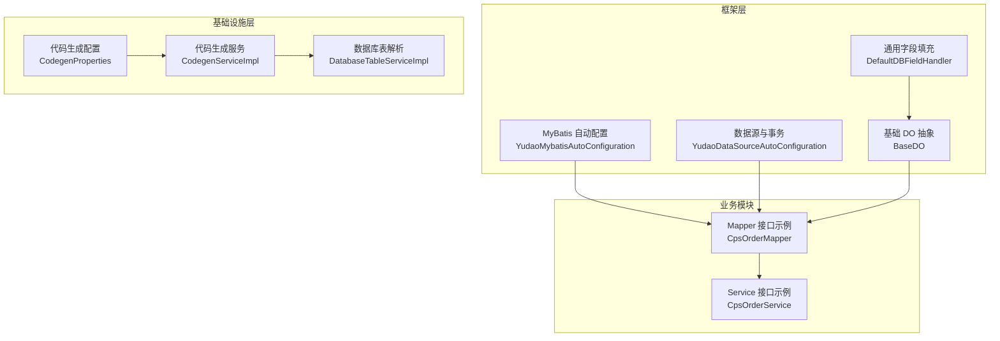
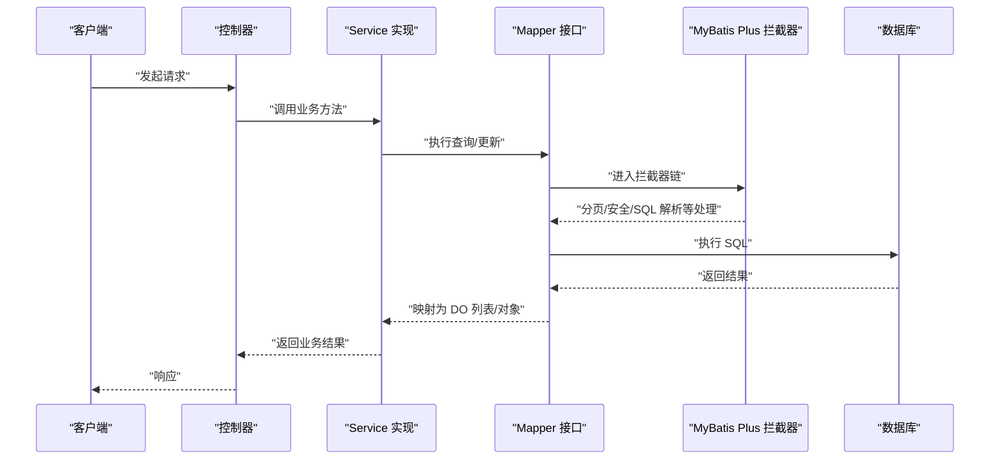
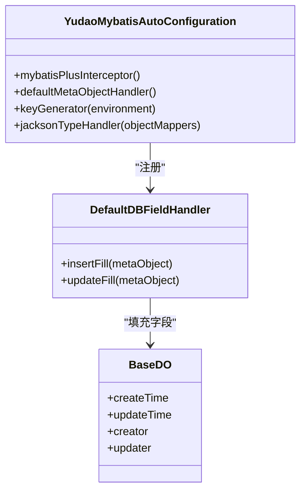
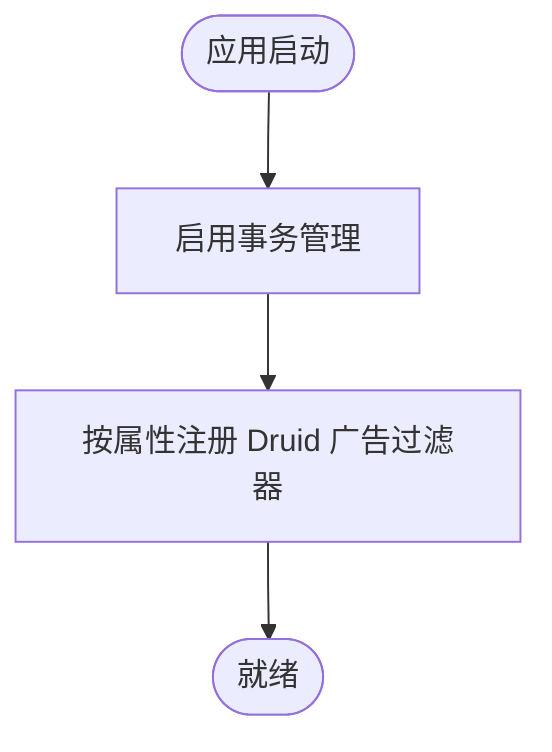
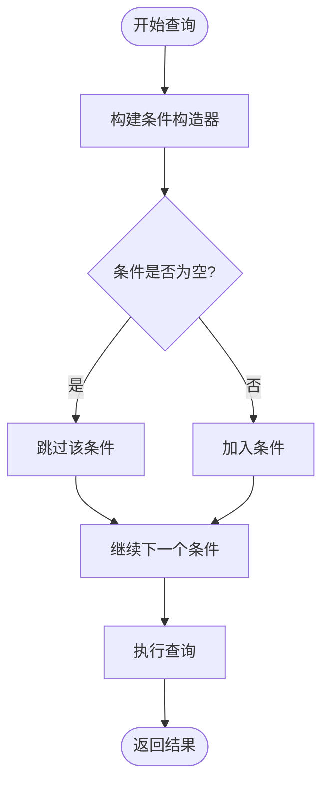
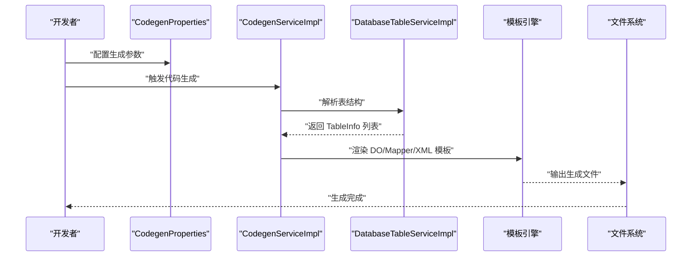
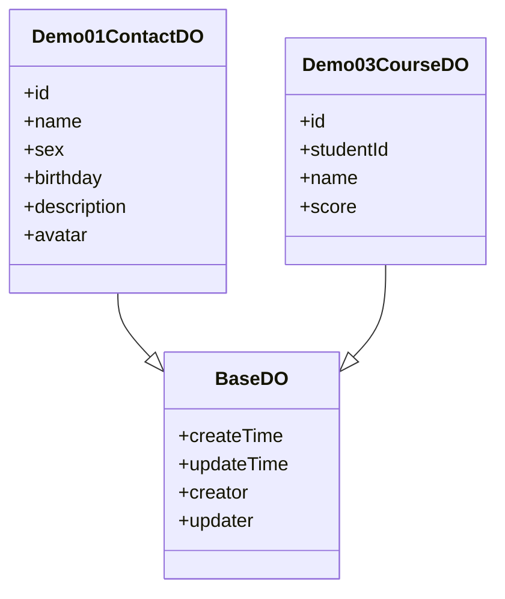
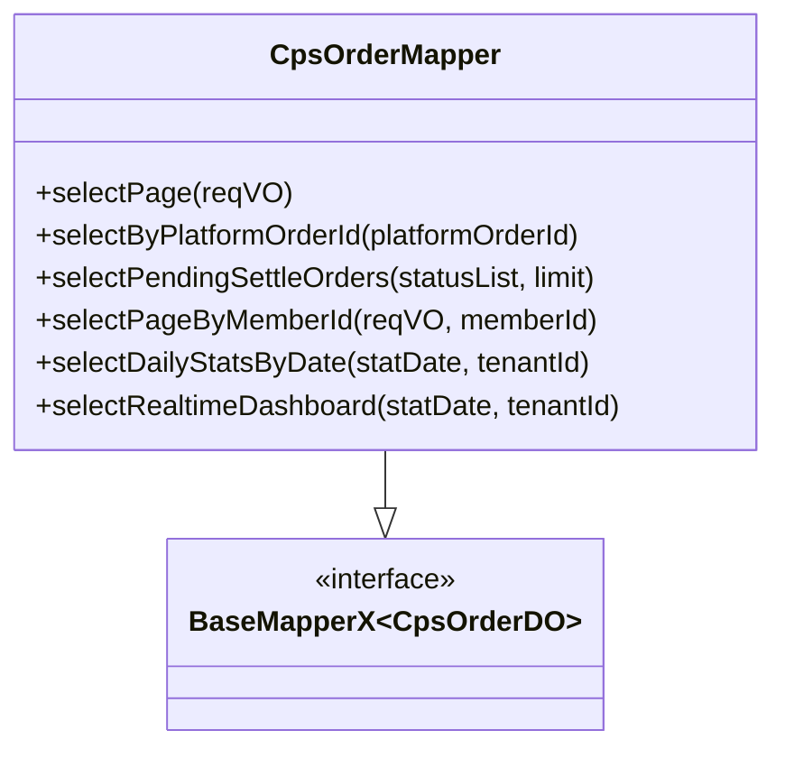
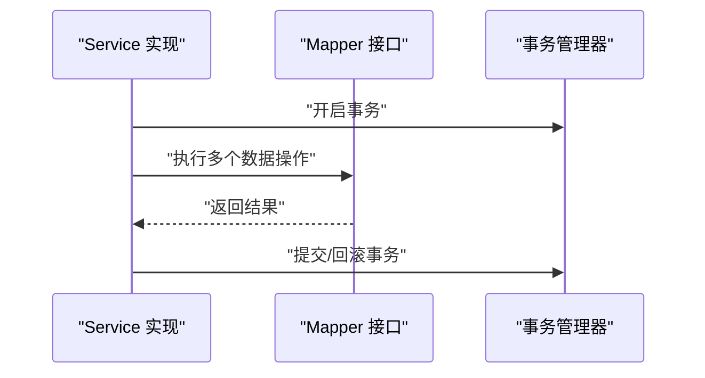
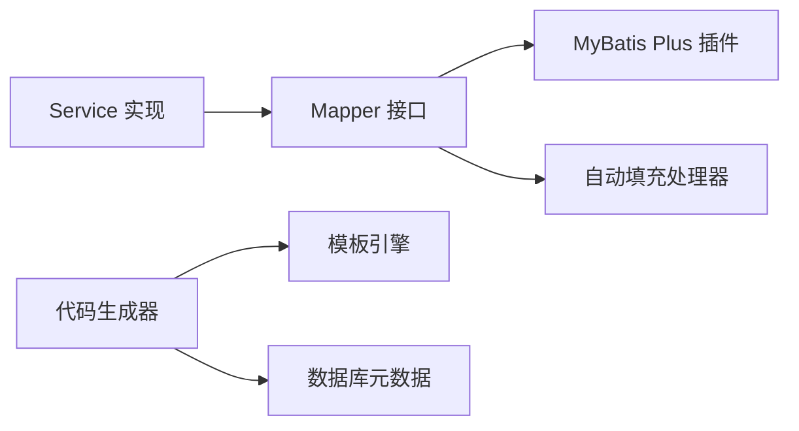

# 数据访问层设计

<cite>
**本文引用的文件**
- [YudaoMybatisAutoConfiguration.java](file://backend/yudao-framework/yudao-spring-boot-starter-mybatis/src/main/java/cn/iocoder/yudao/framework/mybatis/config/YudaoMybatisAutoConfiguration.java)
- [YudaoDataSourceAutoConfiguration.java](file://backend/yudao-framework/yudao-spring-boot-starter-mybatis/src/main/java/cn/iocoder/yudao/framework/datasource/config/YudaoDataSourceAutoConfiguration.java)
- [DefaultDBFieldHandler.java](file://backend/yudao-framework/yudao-spring-boot-starter-mybatis/src/main/java/cn/iocoder/yudao/framework/mybatis/core/handler/DefaultDBFieldHandler.java)
- [BaseDO.java](file://backend/yudao-framework/yudao-spring-boot-starter-mybatis/src/main/java/cn/iocoder/yudao/framework/mybatis/core/dataobject/BaseDO.java)
- [CpsOrderMapper.java](file://backend/yudao-module-cps/yudao-module-cps-biz/src/main/java/cn/iocoder/yudao/module/cps/dal/mysql/order/CpsOrderMapper.java)
- [CpsOrderService.java](file://backend/yudao-module-cps/yudao-module-cps-biz/src/main/java/cn/iocoder/yudao/module/cps/service/order/CpsOrderService.java)
- [DatabaseTableServiceImpl.java](file://backend/yudao-module-infra/src/main/java/cn/iocoder/yudao/module/infra/service/db/DatabaseTableServiceImpl.java)
- [CodegenProperties.java](file://backend/yudao-module-infra/src/main/java/cn/iocoder/yudao/module/infra/framework/codegen/config/CodegenProperties.java)
- [CodegenServiceImpl.java](file://backend/yudao-module-infra/src/main/java/cn/iocoder/yudao/module/infra/service/codegen/CodegenServiceImpl.java)
- [CodegenTableDO.java](file://backend/yudao-module-infra/src/main/java/cn/iocoder/yudao/module/infra/dal/dataobject/codegen/CodegenTableDO.java)
- [mapper.xml.vm](file://backend/yudao-module-infra/src/main/resources/codegen/java/dal/mapper.xml.vm)
- [do.vm](file://backend/yudao-module-infra/src/main/resources/codegen/java/dal/do.vm)
- [do_sub.vm](file://backend/yudao-module-infra/src/main/resources/codegen/java/dal/do_sub.vm)
- [Demo01ContactDO.java](file://backend/yudao-module-infra/src/main/java/cn/iocoder/yudao/module/infra/dal/dataobject/demo/demo01/Demo01ContactDO.java)
- [Demo03CourseDO.java](file://backend/yudao-module-infra/src/main/java/cn/iocoder/yudao/module/infra/dal/dataobject/demo/demo03/Demo03CourseDO.java)
</cite>

## 目录
1. [引言](#引言)
2. [项目结构](#项目结构)
3. [核心组件](#核心组件)
4. [架构总览](#架构总览)
5. [详细组件分析](#详细组件分析)
6. [依赖分析](#依赖分析)
7. [性能考虑](#性能考虑)
8. [故障排查指南](#故障排查指南)
9. [结论](#结论)
10. [附录](#附录)

## 引言
本文件系统化阐述本项目中数据访问层（DAL）的设计与实现，重点覆盖 MyBatis Plus 的集成与配置、代码生成器、分页插件、通用 CRUD 封装、条件构造器与动态表名切换、DAO 与 Service 的交互模式、事务管理与异常处理，以及开发规范与性能优化建议。目标是帮助开发者快速理解并高效构建稳定、可维护的数据访问层。

## 项目结构
- MyBatis Plus 自动配置位于 yudao-spring-boot-starter-mybatis 模块，负责：
  - 扫描 Mapper 接口
  - 注册分页插件
  - 注入通用字段自动填充处理器
  - 针对不同数据库类型的主键生成策略
- 代码生成器位于 yudao-module-infra 模块，提供基于模板的 DO/Mapper/XML 生成能力，并支持多数据库 Schema 与前端类型配置。
- 业务模块（如 cps、ai、member 等）通过 Mapper 接口与 DO 实体进行数据交互；Service 层编排业务逻辑并声明事务边界。

**图表来源**
- [YudaoMybatisAutoConfiguration.java:34-54](file://backend/yudao-framework/yudao-spring-boot-starter-mybatis/src/main/java/cn/iocoder/yudao/framework/mybatis/config/YudaoMybatisAutoConfiguration.java#L34-L54)
- [YudaoDataSourceAutoConfiguration.java:17-18](file://backend/yudao-framework/yudao-spring-boot-starter-mybatis/src/main/java/cn/iocoder/yudao/framework/datasource/config/YudaoDataSourceAutoConfiguration.java#L17-L18)
- [DefaultDBFieldHandler.java:18-62](file://backend/yudao-framework/yudao-spring-boot-starter-mybatis/src/main/java/cn/iocoder/yudao/framework/mybatis/core/handler/DefaultDBFieldHandler.java#L18-L62)
- [BaseDO.java:22-41](file://backend/yudao-framework/yudao-spring-boot-starter-mybatis/src/main/java/cn/iocoder/yudao/framework/mybatis/core/dataobject/BaseDO.java#L22-L41)
- [CodegenProperties.java:13-58](file://backend/yudao-module-infra/src/main/java/cn/iocoder/yudao/module/infra/framework/codegen/config/CodegenProperties.java#L13-L58)
- [CodegenServiceImpl.java:47-55](file://backend/yudao-module-infra/src/main/java/cn/iocoder/yudao/module/infra/service/codegen/CodegenServiceImpl.java#L47-L55)
- [DatabaseTableServiceImpl.java:27-57](file://backend/yudao-module-infra/src/main/java/cn/iocoder/yudao/module/infra/service/db/DatabaseTableServiceImpl.java#L27-L57)
- [CpsOrderMapper.java:21-77](file://backend/yudao-module-cps/yudao-module-cps-biz/src/main/java/cn/iocoder/yudao/module/cps/dal/mysql/order/CpsOrderMapper.java#L21-L77)
- [CpsOrderService.java:15-59](file://backend/yudao-module-cps/yudao-module-cps-biz/src/main/java/cn/iocoder/yudao/module/cps/service/order/CpsOrderService.java#L15-L59)

**章节来源**
- [YudaoMybatisAutoConfiguration.java:34-54](file://backend/yudao-framework/yudao-spring-boot-starter-mybatis/src/main/java/cn/iocoder/yudao/framework/mybatis/config/YudaoMybatisAutoConfiguration.java#L34-L54)
- [YudaoDataSourceAutoConfiguration.java:17-18](file://backend/yudao-framework/yudao-spring-boot-starter-mybatis/src/main/java/cn/iocoder/yudao/framework/datasource/config/YudaoDataSourceAutoConfiguration.java#L17-L18)
- [CodegenProperties.java:13-58](file://backend/yudao-module-infra/src/main/java/cn/iocoder/yudao/module/infra/framework/codegen/config/CodegenProperties.java#L13-L58)
- [CodegenServiceImpl.java:47-55](file://backend/yudao-module-infra/src/main/java/cn/iocoder/yudao/module/infra/service/codegen/CodegenServiceImpl.java#L47-L55)
- [DatabaseTableServiceImpl.java:27-57](file://backend/yudao-module-infra/src/main/java/cn/iocoder/yudao/module/infra/service/db/DatabaseTableServiceImpl.java#L27-L57)
- [CpsOrderMapper.java:21-77](file://backend/yudao-module-cps/yudao-module-cps-biz/src/main/java/cn/iocoder/yudao/module/cps/dal/mysql/order/CpsOrderMapper.java#L21-L77)
- [CpsOrderService.java:15-59](file://backend/yudao-module-cps/yudao-module-cps-biz/src/main/java/cn/iocoder/yudao/module/cps/service/order/CpsOrderService.java#L15-L59)

## 核心组件
- 自动配置与插件
  - Mapper 扫描与懒加载配置
  - 分页插件注册（PaginationInnerInterceptor）
  - JSON 类型处理器与通用字段自动填充
  - 针对不同数据库的主键生成器选择
- 事务与数据源
  - 开启事务管理（proxyTargetClass=true）
  - Druid 监控页面广告过滤器注册
- 通用 DO 与自动填充
  - BaseDO 统一字段（创建/更新时间、创建者/更新者）
  - DefaultDBFieldHandler 在插入/更新时自动填充
- 代码生成器
  - 配置项：基础包、数据库 Schema、前端类型、VO 类型、批量删除与单元测试开关
  - 生成模板：DO、子表 DO、Mapper XML
  - 表结构解析与过滤（忽略视图）

**章节来源**
- [YudaoMybatisAutoConfiguration.java:34-93](file://backend/yudao-framework/yudao-spring-boot-starter-mybatis/src/main/java/cn/iocoder/yudao/framework/mybatis/config/YudaoMybatisAutoConfiguration.java#L34-L93)
- [YudaoDataSourceAutoConfiguration.java:17-38](file://backend/yudao-framework/yudao-spring-boot-starter-mybatis/src/main/java/cn/iocoder/yudao/framework/datasource/config/YudaoDataSourceAutoConfiguration.java#L17-L38)
- [DefaultDBFieldHandler.java:18-62](file://backend/yudao-framework/yudao-spring-boot-starter-mybatis/src/main/java/cn/iocoder/yudao/framework/mybatis/core/handler/DefaultDBFieldHandler.java#L18-L62)
- [BaseDO.java:22-41](file://backend/yudao-framework/yudao-spring-boot-starter-mybatis/src/main/java/cn/iocoder/yudao/framework/mybatis/core/dataobject/BaseDO.java#L22-L41)
- [CodegenProperties.java:13-58](file://backend/yudao-module-infra/src/main/java/cn/iocoder/yudao/module/infra/framework/codegen/config/CodegenProperties.java#L13-L58)
- [CodegenServiceImpl.java:47-55](file://backend/yudao-module-infra/src/main/java/cn/iocoder/yudao/module/infra/service/codegen/CodegenServiceImpl.java#L47-L55)
- [mapper.xml.vm:1-12](file://backend/yudao-module-infra/src/main/resources/codegen/java/dal/mapper.xml.vm#L1-L12)
- [do.vm:1-45](file://backend/yudao-module-infra/src/main/resources/codegen/java/dal/do.vm#L1-L45)
- [do_sub.vm:1-69](file://backend/yudao-module-infra/src/main/resources/codegen/java/dal/do_sub.vm#L1-L69)

## 架构总览
下图展示从请求到数据库的典型流程，涵盖 MyBatis Plus 插件、Mapper、Service、事务与自动填充：

**图表来源**
- [YudaoMybatisAutoConfiguration.java:47-54](file://backend/yudao-framework/yudao-spring-boot-starter-mybatis/src/main/java/cn/iocoder/yudao/framework/mybatis/config/YudaoMybatisAutoConfiguration.java#L47-L54)
- [CpsOrderMapper.java:21-77](file://backend/yudao-module-cps/yudao-module-cps-biz/src/main/java/cn/iocoder/yudao/module/cps/dal/mysql/order/CpsOrderMapper.java#L21-L77)

## 详细组件分析

### MyBatis Plus 自动配置与插件
- Mapper 扫描
  - 通过 MapperScan 注解扫描指定包下的 @Mapper 接口，支持懒加载配置，便于单元测试隔离。
- 分页插件
  - 注册 PaginationInnerInterceptor，提供分页能力；可按需启用 BlockAttackInnerInterceptor 以阻止无条件更新/删除。
- JSON 类型处理器
  - 为避免全局使用 JacksonTypeHandler 带来的副作用，采用特殊 Bean 返回 Object 类型处理器，并设置 ObjectMapper。
- 主键生成器
  - 根据数据库类型选择对应 IKeyGenerator（PostgreSQL、Oracle、H2、Kingbase、DM），找不到时抛出异常。
- 通用字段填充
  - 通过 MetaObjectHandler 在插入/更新时自动填充创建/更新时间与创建者/更新者。

**图表来源**
- [YudaoMybatisAutoConfiguration.java:34-93](file://backend/yudao-framework/yudao-spring-boot-starter-mybatis/src/main/java/cn/iocoder/yudao/framework/mybatis/config/YudaoMybatisAutoConfiguration.java#L34-L93)
- [DefaultDBFieldHandler.java:18-62](file://backend/yudao-framework/yudao-spring-boot-starter-mybatis/src/main/java/cn/iocoder/yudao/framework/mybatis/core/handler/DefaultDBFieldHandler.java#L18-L62)
- [BaseDO.java:22-41](file://backend/yudao-framework/yudao-spring-boot-starter-mybatis/src/main/java/cn/iocoder/yudao/framework/mybatis/core/dataobject/BaseDO.java#L22-L41)

**章节来源**
- [YudaoMybatisAutoConfiguration.java:34-93](file://backend/yudao-framework/yudao-spring-boot-starter-mybatis/src/main/java/cn/iocoder/yudao/framework/mybatis/config/YudaoMybatisAutoConfiguration.java#L34-L93)
- [DefaultDBFieldHandler.java:18-62](file://backend/yudao-framework/yudao-spring-boot-starter-mybatis/src/main/java/cn/iocoder/yudao/framework/mybatis/core/handler/DefaultDBFieldHandler.java#L18-L62)
- [BaseDO.java:22-41](file://backend/yudao-framework/yudao-spring-boot-starter-mybatis/src/main/java/cn/iocoder/yudao/framework/mybatis/core/dataobject/BaseDO.java#L22-L41)

### 事务与数据源配置
- 启用事务管理（proxyTargetClass=true），确保基于类的代理生效。
- Druid 监控页面广告过滤器按配置动态注册，提升监控页面体验。

**图表来源**
- [YudaoDataSourceAutoConfiguration.java:17-38](file://backend/yudao-framework/yudao-spring-boot-starter-mybatis/src/main/java/cn/iocoder/yudao/framework/datasource/config/YudaoDataSourceAutoConfiguration.java#L17-L38)

**章节来源**
- [YudaoDataSourceAutoConfiguration.java:17-38](file://backend/yudao-framework/yudao-spring-boot-starter-mybatis/src/main/java/cn/iocoder/yudao/framework/datasource/config/YudaoDataSourceAutoConfiguration.java#L17-L38)

### 通用 CRUD 与条件构造器
- Mapper 规范
  - Mapper 接口统一继承 BaseMapperX，获得通用 CRUD 能力与分页扩展。
  - 建议在 Mapper 中提供默认方法封装常用查询（如分页、条件筛选、统计等），保持 Service 层简洁。
- 条件构造器
  - 使用 LambdaQueryWrapperX 提供类型安全的链式查询，支持 eqIfPresent、likeIfPresent、betweenIfPresent、in、isNull/isNotNull 等。
- 动态表名切换
  - 通过 MyBatis Plus 的多租户/动态表名插件（如 JsqlParserGlobal 缓存与租户插件）实现动态表名解析与注入，注意与更新批量场景的兼容性。

**图表来源**
- [CpsOrderMapper.java:24-33](file://backend/yudao-module-cps/yudao-module-cps-biz/src/main/java/cn/iocoder/yudao/module/cps/dal/mysql/order/CpsOrderMapper.java#L24-L33)
- [CpsOrderMapper.java:45-52](file://backend/yudao-module-cps/yudao-module-cps-biz/src/main/java/cn/iocoder/yudao/module/cps/dal/mysql/order/CpsOrderMapper.java#L45-L52)

**章节来源**
- [CpsOrderMapper.java:21-77](file://backend/yudao-module-cps/yudao-module-cps-biz/src/main/java/cn/iocoder/yudao/module/cps/dal/mysql/order/CpsOrderMapper.java#L21-L77)

### 代码生成器
- 配置项
  - 基础包、数据库 Schema 列表、默认前端类型、VO 类型、是否生成批量删除接口、是否生成单元测试。
- 生成流程
  - 通过 DatabaseTableServiceImpl 解析表结构，结合 CodegenServiceImpl 与模板引擎生成 DO、Mapper XML、Service/Controller 等代码。
  - 支持多数据库 Schema 与视图过滤（默认忽略视图）。
- 模板
  - DO 模板：@TableName、@KeySequence、Swagger/Excel 注解等。
  - 子表 DO 模板：排除 BaseDO 字段，按需生成注解。
  - Mapper XML 模板：命名空间指向生成的 Mapper 类，提示优先使用 Mapper 进行 CRUD。

**图表来源**
- [CodegenProperties.java:13-58](file://backend/yudao-module-infra/src/main/java/cn/iocoder/yudao/module/infra/framework/codegen/config/CodegenProperties.java#L13-L58)
- [CodegenServiceImpl.java:47-55](file://backend/yudao-module-infra/src/main/java/cn/iocoder/yudao/module/infra/service/codegen/CodegenServiceImpl.java#L47-L55)
- [DatabaseTableServiceImpl.java:34-57](file://backend/yudao-module-infra/src/main/java/cn/iocoder/yudao/module/infra/service/db/DatabaseTableServiceImpl.java#L34-L57)
- [do.vm:1-45](file://backend/yudao-module-infra/src/main/resources/codegen/java/dal/do.vm#L1-L45)
- [do_sub.vm:1-69](file://backend/yudao-module-infra/src/main/resources/codegen/java/dal/do_sub.vm#L1-L69)
- [mapper.xml.vm:1-12](file://backend/yudao-module-infra/src/main/resources/codegen/java/dal/mapper.xml.vm#L1-L12)

**章节来源**
- [CodegenProperties.java:13-58](file://backend/yudao-module-infra/src/main/java/cn/iocoder/yudao/module/infra/framework/codegen/config/CodegenProperties.java#L13-L58)
- [CodegenServiceImpl.java:47-55](file://backend/yudao-module-infra/src/main/java/cn/iocoder/yudao/module/infra/service/codegen/CodegenServiceImpl.java#L47-L55)
- [DatabaseTableServiceImpl.java:27-57](file://backend/yudao-module-infra/src/main/java/cn/iocoder/yudao/module/infra/service/db/DatabaseTableServiceImpl.java#L27-L57)
- [do.vm:1-45](file://backend/yudao-module-infra/src/main/resources/codegen/java/dal/do.vm#L1-L45)
- [do_sub.vm:1-69](file://backend/yudao-module-infra/src/main/resources/codegen/java/dal/do_sub.vm#L1-L69)
- [mapper.xml.vm:1-12](file://backend/yudao-module-infra/src/main/resources/codegen/java/dal/mapper.xml.vm#L1-L12)

### 数据对象（DO）设计
- 基类 BaseDO
  - 统一字段：创建/更新时间、创建者/更新者，使用 MetaObjectHandler 自动填充。
- 示例 DO
  - Demo01ContactDO：演示 @TableName、@KeySequence、Lombok 注解与字段注释。
  - Demo03CourseDO：演示主键、外键与数值字段。
- 生成 DO
  - 模板根据表结构生成字段类型、注解与 Swagger/Excel 支持，适配多数据库序列/自增策略。

**图表来源**
- [BaseDO.java:22-41](file://backend/yudao-framework/yudao-spring-boot-starter-mybatis/src/main/java/cn/iocoder/yudao/framework/mybatis/core/dataobject/BaseDO.java#L22-L41)
- [Demo01ContactDO.java:16-24](file://backend/yudao-module-infra/src/main/java/cn/iocoder/yudao/module/infra/dal/dataobject/demo/demo01/Demo01ContactDO.java#L16-L24)
- [Demo03CourseDO.java:14-22](file://backend/yudao-module-infra/src/main/java/cn/iocoder/yudao/module/infra/dal/dataobject/demo/demo03/Demo03CourseDO.java#L14-L22)

**章节来源**
- [BaseDO.java:22-41](file://backend/yudao-framework/yudao-spring-boot-starter-mybatis/src/main/java/cn/iocoder/yudao/framework/mybatis/core/dataobject/BaseDO.java#L22-L41)
- [Demo01ContactDO.java:16-24](file://backend/yudao-module-infra/src/main/java/cn/iocoder/yudao/module/infra/dal/dataobject/demo/demo01/Demo01ContactDO.java#L16-L24)
- [Demo03CourseDO.java:14-22](file://backend/yudao-module-infra/src/main/java/cn/iocoder/yudao/module/infra/dal/dataobject/demo/demo03/Demo03CourseDO.java#L14-L22)

### Mapper 接口与 XML 组织
- Mapper 接口
  - 统一继承 BaseMapperX，提供分页与通用 CRUD。
  - 默认方法封装常见查询（分页、按平台订单号查询、待结算订单查询、按会员分页等）。
- XML 映射
  - 优先使用 Mapper 进行 CRUD；复杂多表查询再编写 XML。
  - 命名空间指向生成的 Mapper 类，便于 IDE 快速跳转。

**图表来源**
- [CpsOrderMapper.java:21-77](file://backend/yudao-module-cps/yudao-module-cps-biz/src/main/java/cn/iocoder/yudao/module/cps/dal/mysql/order/CpsOrderMapper.java#L21-L77)

**章节来源**
- [CpsOrderMapper.java:21-77](file://backend/yudao-module-cps/yudao-module-cps-biz/src/main/java/cn/iocoder/yudao/module/cps/dal/mysql/order/CpsOrderMapper.java#L21-L77)
- [mapper.xml.vm:1-12](file://backend/yudao-module-infra/src/main/resources/codegen/java/dal/mapper.xml.vm#L1-L12)

### 与 Service 的交互模式、事务与异常
- 交互模式
  - Service 接口定义业务契约，具体实现编排多个 Mapper 的组合查询与更新。
  - Mapper 默认方法封装常用查询，减少重复代码。
- 事务管理
  - 通过 @Transactional 声明式事务控制边界，确保业务一致性。
  - 事务代理采用 proxyTargetClass=true，保证基于类的代理生效。
- 异常处理
  - 建议在 Service 层捕获并转换为领域异常，向上抛出统一错误码与消息，避免泄露底层细节。

**图表来源**
- [YudaoDataSourceAutoConfiguration.java:17-18](file://backend/yudao-framework/yudao-spring-boot-starter-mybatis/src/main/java/cn/iocoder/yudao/framework/datasource/config/YudaoDataSourceAutoConfiguration.java#L17-L18)
- [CpsOrderService.java:15-59](file://backend/yudao-module-cps/yudao-module-cps-biz/src/main/java/cn/iocoder/yudao/module/cps/service/order/CpsOrderService.java#L15-L59)

**章节来源**
- [YudaoDataSourceAutoConfiguration.java:17-18](file://backend/yudao-framework/yudao-spring-boot-starter-mybatis/src/main/java/cn/iocoder/yudao/framework/datasource/config/YudaoDataSourceAutoConfiguration.java#L17-L18)
- [CpsOrderService.java:15-59](file://backend/yudao-module-cps/yudao-module-cps-biz/src/main/java/cn/iocoder/yudao/module/cps/service/order/CpsOrderService.java#L15-L59)

## 依赖分析
- 组件耦合
  - Mapper 依赖 MyBatis Plus 插件与自动填充处理器，间接依赖数据库驱动与连接池。
  - Service 依赖 Mapper 与业务规则，必要时依赖外部系统或定时任务。
  - 代码生成器依赖模板引擎与数据库元数据解析。
- 外部依赖
  - MyBatis Plus、JsqlParser、Druid、Jackson 等。

**图表来源**
- [YudaoMybatisAutoConfiguration.java:47-54](file://backend/yudao-framework/yudao-spring-boot-starter-mybatis/src/main/java/cn/iocoder/yudao/framework/mybatis/config/YudaoMybatisAutoConfiguration.java#L47-L54)
- [DefaultDBFieldHandler.java:18-62](file://backend/yudao-framework/yudao-spring-boot-starter-mybatis/src/main/java/cn/iocoder/yudao/framework/mybatis/core/handler/DefaultDBFieldHandler.java#L18-L62)
- [CodegenServiceImpl.java:47-55](file://backend/yudao-module-infra/src/main/java/cn/iocoder/yudao/module/infra/service/codegen/CodegenServiceImpl.java#L47-L55)

**章节来源**
- [YudaoMybatisAutoConfiguration.java:47-54](file://backend/yudao-framework/yudao-spring-boot-starter-mybatis/src/main/java/cn/iocoder/yudao/framework/mybatis/config/YudaoMybatisAutoConfiguration.java#L47-L54)
- [DefaultDBFieldHandler.java:18-62](file://backend/yudao-framework/yudao-spring-boot-starter-mybatis/src/main/java/cn/iocoder/yudao/framework/mybatis/core/handler/DefaultDBFieldHandler.java#L18-L62)
- [CodegenServiceImpl.java:47-55](file://backend/yudao-module-infra/src/main/java/cn/iocoder/yudao/module/infra/service/codegen/CodegenServiceImpl.java#L47-L55)

## 性能考虑
- 分页与 SQL 解析
  - 启用分页插件，避免一次性加载大量数据；合理设置每页大小。
  - JsqlParser 全局缓存提升动态 SQL 解析性能，注意缓存大小与过期策略。
- 自动填充与 JSON 处理
  - 仅在需要时填充通用字段，避免冗余写入。
  - JacksonTypeHandler 单例化并设置 ObjectMapper，减少反射开销。
- 代码生成与模板
  - 生成代码时尽量使用默认模板，减少自定义逻辑导致的模板复杂度。
  - 生成 DO 时按需引入注解，避免不必要的依赖。

[本节为通用建议，无需特定文件来源]

## 故障排查指南
- 无条件更新/删除被拦截
  - 若启用 BlockAttackInnerInterceptor，确保查询条件完整，否则会被拦截。
- 主键生成异常
  - 检查数据库类型与 IKeyGenerator 的匹配关系，确认环境变量中 DbType 正确。
- 自动填充字段为空
  - 确认 DefaultDBFieldHandler 已注册，且当前登录用户上下文可用。
- 代码生成失败
  - 检查 CodegenProperties 配置项是否齐全，数据库 Schema 是否正确，模板文件是否存在。
- Druid 监控页面广告干扰
  - 确认 spring.datasource.druid.stat-view-servlet.enabled 配置，过滤器已注册。

**章节来源**
- [YudaoMybatisAutoConfiguration.java:51-53](file://backend/yudao-framework/yudao-spring-boot-starter-mybatis/src/main/java/cn/iocoder/yudao/framework/mybatis/config/YudaoMybatisAutoConfiguration.java#L51-L53)
- [YudaoMybatisAutoConfiguration.java:62-82](file://backend/yudao-framework/yudao-spring-boot-starter-mybatis/src/main/java/cn/iocoder/yudao/framework/mybatis/config/YudaoMybatisAutoConfiguration.java#L62-L82)
- [DefaultDBFieldHandler.java:18-62](file://backend/yudao-framework/yudao-spring-boot-starter-mybatis/src/main/java/cn/iocoder/yudao/framework/mybatis/core/handler/DefaultDBFieldHandler.java#L18-L62)
- [CodegenProperties.java:13-58](file://backend/yudao-module-infra/src/main/java/cn/iocoder/yudao/module/infra/framework/codegen/config/CodegenProperties.java#L13-L58)
- [YudaoDataSourceAutoConfiguration.java:25-38](file://backend/yudao-framework/yudao-spring-boot-starter-mybatis/src/main/java/cn/iocoder/yudao/framework/datasource/config/YudaoDataSourceAutoConfiguration.java#L25-L38)

## 结论
本项目通过 MyBatis Plus 自动配置、分页插件与通用字段填充，构建了高内聚、低耦合的数据访问层；借助代码生成器与模板体系，显著提升了 DO/Mapper/XML 的产出效率与一致性。配合 Service 层的事务管理与异常处理，整体架构具备良好的可维护性与扩展性。建议在后续迭代中持续完善条件构造器的复用与动态表名的兼容性，并加强性能监控与日志追踪。

[本节为总结，无需特定文件来源]

## 附录
- 开发规范与命名约定
  - Mapper 接口命名：实体名 + Mapper，如 CpsOrderMapper
  - DO 命名：实体名 + DO，如 CpsOrderDO
  - XML 命名：与 Mapper 类同名，位于 resources/mapper 下
  - 默认方法命名：遵循语义化，如 selectPage、selectByPlatformOrderId
- 最佳实践
  - 优先使用 Mapper 进行 CRUD，复杂查询再编写 XML
  - 使用 LambdaQueryWrapperX 进行类型安全查询
  - 为每个模块提供分页与条件查询的默认方法
  - 通过代码生成器统一生成 DO/Mapper/XML，减少手写错误
  - 合理设置分页大小，避免全量加载
  - 在 Service 层集中处理事务与异常，保持 Mapper 的纯净

[本节为通用建议，无需特定文件来源]