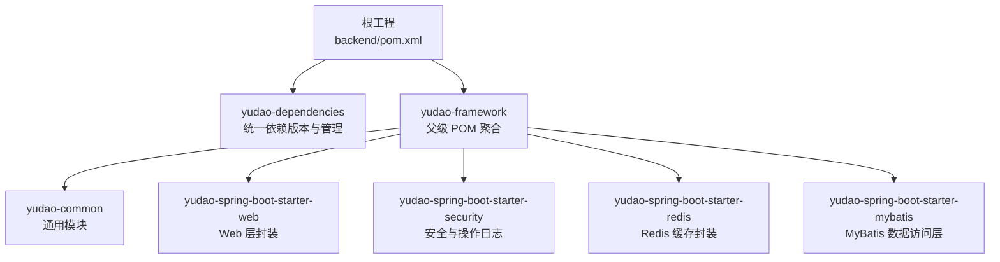
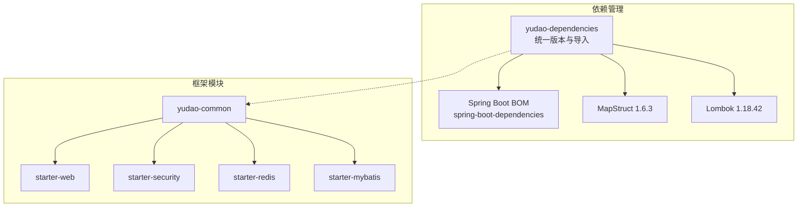
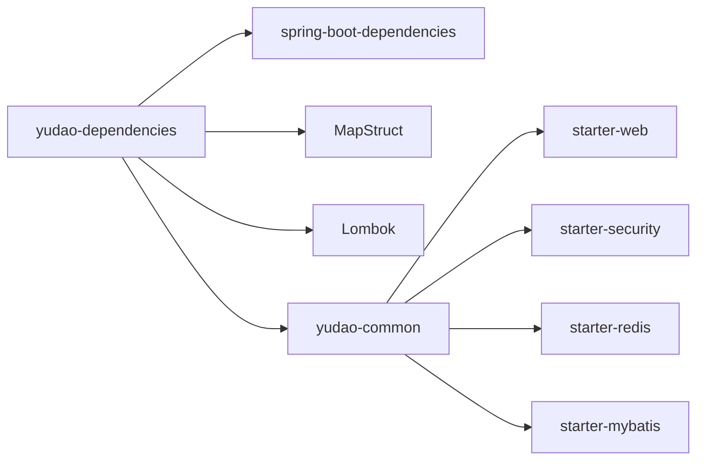

# 核心框架模块

<cite>
**本文档引用的文件**
- [yudao-dependencies/pom.xml](file://backend/yudao-dependencies/pom.xml)
- [yudao-framework/pom.xml](file://backend/yudao-framework/pom.xml)
- [yudao-common/pom.xml](file://backend/yudao-framework/yudao-common/pom.xml)
- [yudao-spring-boot-starter-web/pom.xml](file://backend/yudao-framework/yudao-spring-boot-starter-web/pom.xml)
- [yudao-spring-boot-starter-security/pom.xml](file://backend/yudao-framework/yudao-spring-boot-starter-security/pom.xml)
- [yudao-spring-boot-starter-redis/pom.xml](file://backend/yudao-framework/yudao-spring-boot-starter-redis/pom.xml)
- [yudao-spring-boot-starter-mybatis/pom.xml](file://backend/yudao-framework/yudao-spring-boot-starter-mybatis/pom.xml)
</cite>

## 目录
1. [简介](#简介)
2. [项目结构](#项目结构)
3. [核心组件](#核心组件)
4. [架构总览](#架构总览)
5. [详细组件分析](#详细组件分析)
6. [依赖关系分析](#依赖关系分析)
7. [性能考虑](#性能考虑)
8. [故障排除指南](#故障排除指南)
9. [结论](#结论)

## 简介
本文件聚焦于芋道框架的核心技术组件，系统性阐述以下内容：
- yudao-dependencies 依赖管理模块如何统一管理 Spring Boot 3.5.9、Lombok、MapStruct 等关键依赖版本
- yudao-common 通用模块提供的公共工具类、枚举、异常处理机制与验证注解
- 各 starter 模块的功能边界：web、security、redis、mybatis 等
- 框架模块间的依赖关系、配置加载顺序与扩展机制
- 框架使用指南与自定义扩展的最佳实践

## 项目结构
后端采用多模块聚合结构，yudao-framework 作为父级 POM，统一管理各技术组件模块；yudao-dependencies 提供统一的依赖版本与依赖管理。

**图表来源**
- [yudao-framework/pom.xml:12-31](file://backend/yudao-framework/pom.xml#L12-L31)
- [yudao-dependencies/pom.xml:84-100](file://backend/yudao-dependencies/pom.xml#L84-L100)

**章节来源**
- [yudao-framework/pom.xml:12-31](file://backend/yudao-framework/pom.xml#L12-L31)
- [yudao-dependencies/pom.xml:84-100](file://backend/yudao-dependencies/pom.xml#L84-L100)

## 核心组件
本节从依赖管理与模块功能两个维度，深入解析核心框架模块。

- yudao-dependencies 依赖管理模块
  - 统一版本：集中管理 Spring Boot 3.5.9、Lombok 1.18.42、MapStruct 1.6.3 等关键依赖版本
  - 依赖导入：通过 dependencyManagement 导入 spring-boot-dependencies，确保子模块继承统一版本
  - 扩展组件：统一管理 Web 文档、MyBatis Plus、Redisson、RocketMQ、SkyWalking、JustAuth、微信/支付宝 SDK 等生态组件版本
  - 版本扁平化：使用 flatten-maven-plugin 插件生成扁平化的 POM，便于下游模块直接继承

- yudao-common 通用模块
  - 作用：提供基础 POJO、枚举、工具类、验证注解与异常体系
  - 依赖策略：将 Spring 核心、Servlet API、Jackson、Validation API 等标记为 provided，避免对使用者造成额外传递依赖
  - 工具链：内置 Lombok、MapStruct、Guava、Hutool、TransmittableThreadLocal 等常用工具

- starter 模块
  - web：基于 Spring MVC 的全局异常、API 日志、参数校验、文档集成
  - security：Spring Security 认证授权、AOP 切面、操作日志记录
  - redis：Redisson 分布式能力、Spring Cache 自动装配、JSON 序列化
  - mybatis：Druid 连接池、MyBatis-Plus、动态数据源、联表查询、数据翻译

**章节来源**
- [yudao-dependencies/pom.xml:16-82](file://backend/yudao-dependencies/pom.xml#L16-L82)
- [yudao-dependencies/pom.xml:84-687](file://backend/yudao-dependencies/pom.xml#L84-L687)
- [yudao-common/pom.xml:18-147](file://backend/yudao-framework/yudao-common/pom.xml#L18-L147)
- [yudao-spring-boot-starter-web/pom.xml:18-79](file://backend/yudao-framework/yudao-spring-boot-starter-web/pom.xml#L18-L79)
- [yudao-spring-boot-starter-security/pom.xml:21-62](file://backend/yudao-framework/yudao-spring-boot-starter-security/pom.xml#L21-L62)
- [yudao-spring-boot-starter-redis/pom.xml:18-39](file://backend/yudao-framework/yudao-spring-boot-starter-redis/pom.xml#L18-L39)
- [yudao-spring-boot-starter-mybatis/pom.xml:18-108](file://backend/yudao-framework/yudao-spring-boot-starter-mybatis/pom.xml#L18-L108)

## 架构总览
下图展示 yudao-dependencies 与各 starter 模块之间的版本与依赖关系，体现“统一版本 + 按需装配”的设计思想。

**图表来源**
- [yudao-dependencies/pom.xml:94-100](file://backend/yudao-dependencies/pom.xml#L94-L100)
- [yudao-dependencies/pom.xml:458-477](file://backend/yudao-dependencies/pom.xml#L458-L477)
- [yudao-common/pom.xml:74-90](file://backend/yudao-framework/yudao-common/pom.xml#L74-L90)
- [yudao-spring-boot-starter-web/pom.xml:19-48](file://backend/yudao-framework/yudao-spring-boot-starter-web/pom.xml#L19-L48)
- [yudao-spring-boot-starter-security/pom.xml:22-48](file://backend/yudao-framework/yudao-spring-boot-starter-security/pom.xml#L22-L48)
- [yudao-spring-boot-starter-redis/pom.xml:19-38](file://backend/yudao-framework/yudao-spring-boot-starter-redis/pom.xml#L19-L38)
- [yudao-spring-boot-starter-mybatis/pom.xml:19-98](file://backend/yudao-framework/yudao-spring-boot-starter-mybatis/pom.xml#L19-L98)

## 详细组件分析

### yudao-dependencies 依赖管理模块
- 版本集中管理
  - Spring Boot 3.5.9：通过 spring-boot-dependencies 导入，保证所有子模块使用统一版本
  - Lombok 1.18.42、MapStruct 1.6.3：在 dependencyManagement 中统一声明，避免版本漂移
- 依赖导入与排除
  - 导入 spring-boot-dependencies 与 Netty BOM，确保构建一致性
  - 对第三方组件进行必要的排除，避免与项目内依赖冲突（如 Redisson 排除 actuator、JustAuth 排除 hutool-core）
- 扁平化处理
  - 使用 flatten-maven-plugin 在构建阶段生成扁平化 POM，简化下游模块的版本解析

**章节来源**
- [yudao-dependencies/pom.xml:16-82](file://backend/yudao-dependencies/pom.xml#L16-L82)
- [yudao-dependencies/pom.xml:84-100](file://backend/yudao-dependencies/pom.xml#L84-L100)
- [yudao-dependencies/pom.xml:254-259](file://backend/yudao-dependencies/pom.xml#L254-L259)
- [yudao-dependencies/pom.xml:628-634](file://backend/yudao-dependencies/pom.xml#L628-L634)
- [yudao-dependencies/pom.xml:690-716](file://backend/yudao-dependencies/pom.xml#L690-L716)

### yudao-common 通用模块
- 依赖策略
  - 将 Spring 核心、Servlet API、Jackson、Validation API 等标记为 provided，仅在工具类使用时生效
  - 内置 Lombok、MapStruct、Guava、Hutool、TransmittableThreadLocal 等常用工具
- 功能定位
  - 作为所有业务模块的公共基础，提供统一的工具类、枚举与异常体系
  - 为 starter 模块提供共享依赖，降低重复声明

**章节来源**
- [yudao-common/pom.xml:18-147](file://backend/yudao-framework/yudao-common/pom.xml#L18-L147)

### yudao-spring-boot-starter-web 模块
- 功能边界
  - 基于 Spring MVC 的全局异常处理、API 日志、请求参数脱敏、统一返回体
  - 集成 Knife4j 与 SpringDoc OpenAPI，提供接口文档能力
- 依赖关系
  - 依赖 yudao-common 提供的工具与注解
  - 依赖 spring-boot-starter-web、spring-boot-configuration-processor、AspectJ

**章节来源**
- [yudao-spring-boot-starter-web/pom.xml:18-79](file://backend/yudao-framework/yudao-spring-boot-starter-web/pom.xml#L18-L79)

### yudao-spring-boot-starter-security 模块
- 功能边界
  - Spring Security 认证与授权
  - 基于注解的操作日志记录（bizlog-sdk）
  - AOP 切面能力，结合 yudao-common 与 yudao-spring-boot-starter-web
- 依赖关系
  - 依赖 yudao-common、yudao-spring-boot-starter-web
  - 依赖 spring-boot-starter-aop、spring-boot-starter-security、bizlog-sdk

**章节来源**
- [yudao-spring-boot-starter-security/pom.xml:21-62](file://backend/yudao-framework/yudao-spring-boot-starter-security/pom.xml#L21-L62)

### yudao-spring-boot-starter-redis 模块
- 功能边界
  - Redisson 分布式能力封装
  - Spring Cache 自动装配，支持多种缓存注解
  - JSON 序列化（Jackson JSR310）
- 依赖关系
  - 依赖 yudao-common
  - 依赖 redisson-spring-boot-starter、spring-boot-starter-cache、Jackson JSR310

**章节来源**
- [yudao-spring-boot-starter-redis/pom.xml:18-39](file://backend/yudao-framework/yudao-spring-boot-starter-redis/pom.xml#L18-L39)

### yudao-spring-boot-starter-mybatis 模块
- 功能边界
  - Druid 连接池、MyBatis-Plus、动态数据源、联表查询、数据翻译
  - 多数据库驱动支持（MySQL、Oracle、PostgreSQL、SQLServer、达梦、人大金仓、华为 GaussDB、涛思数据）
- 依赖关系
  - 依赖 yudao-common
  - 依赖 mysql-connector-j、druid、mybatis-plus、dynamic-datasource、mybatis-plus-join、easy-trans

**章节来源**
- [yudao-spring-boot-starter-mybatis/pom.xml:18-108](file://backend/yudao-framework/yudao-spring-boot-starter-mybatis/pom.xml#L18-L108)

## 依赖关系分析
- 模块耦合度
  - yudao-common 为“低耦合高内聚”的基础模块，被其他 starter 模块按需依赖
  - 各 starter 模块相对独立，通过 yudao-dependencies 统一版本，避免循环依赖
- 依赖链路
  - yudao-dependencies 导入 spring-boot-dependencies，确保 Spring 生态版本一致
  - starter 模块通过 yudao-common 间接获得工具类与注解支持
- 版本一致性
  - 通过 dependencyManagement 集中声明版本，避免子模块各自声明导致的版本漂移

**图表来源**
- [yudao-dependencies/pom.xml:94-100](file://backend/yudao-dependencies/pom.xml#L94-L100)
- [yudao-dependencies/pom.xml:458-477](file://backend/yudao-dependencies/pom.xml#L458-L477)
- [yudao-common/pom.xml:74-90](file://backend/yudao-framework/yudao-common/pom.xml#L74-L90)
- [yudao-spring-boot-starter-web/pom.xml:19-48](file://backend/yudao-framework/yudao-spring-boot-starter-web/pom.xml#L19-L48)
- [yudao-spring-boot-starter-security/pom.xml:22-48](file://backend/yudao-framework/yudao-spring-boot-starter-security/pom.xml#L22-L48)
- [yudao-spring-boot-starter-redis/pom.xml:19-38](file://backend/yudao-framework/yudao-spring-boot-starter-redis/pom.xml#L19-L38)
- [yudao-spring-boot-starter-mybatis/pom.xml:19-98](file://backend/yudao-framework/yudao-spring-boot-starter-mybatis/pom.xml#L19-L98)

**章节来源**
- [yudao-dependencies/pom.xml:84-687](file://backend/yudao-dependencies/pom.xml#L84-L687)
- [yudao-framework/pom.xml:12-31](file://backend/yudao-framework/pom.xml#L12-L31)

## 性能考虑
- 依赖扁平化：通过 flatten-maven-plugin 生成扁平化 POM，减少传递依赖层级，提升构建与依赖解析效率
- provided 依赖：yudao-common 将大量运行期非必需依赖标记为 provided，避免对业务模块产生不必要的传递依赖
- 组件选择：根据场景选择合适的数据源与缓存方案（如 Redisson 分布式锁 vs 本地锁），避免过度引入重型依赖

## 故障排除指南
- 版本冲突
  - 症状：启动时报错或运行时类找不到
  - 处理：检查 yudao-dependencies 中是否已声明目标组件版本；确认是否存在不必要的排除或重复声明
- 依赖缺失
  - 症状：编译期找不到工具类或注解
  - 处理：确认模块是否正确依赖 yudao-common 或对应 starter；检查 provided 依赖是否被误用为 compile
- 文档与接口
  - 症状：Knife4j/SpringDoc 文档无法访问
  - 处理：确认 starter-web 是否正确引入 knife4j 与 springdoc 依赖

**章节来源**
- [yudao-dependencies/pom.xml:254-259](file://backend/yudao-dependencies/pom.xml#L254-L259)
- [yudao-dependencies/pom.xml:628-634](file://backend/yudao-dependencies/pom.xml#L628-L634)
- [yudao-spring-boot-starter-web/pom.xml:42-48](file://backend/yudao-framework/yudao-spring-boot-starter-web/pom.xml#L42-L48)

## 结论
yudao-dependencies 通过集中版本管理与依赖导入，为整个框架提供了稳定一致的依赖基线；yudao-common 以“低耦合”策略承载通用能力；各 starter 模块围绕特定领域（Web、Security、Redis、MyBatis）提供开箱即用的能力。遵循“统一版本 + 按需装配 + 明确的 provided 策略”，可有效降低模块间耦合、提升可维护性与可扩展性。