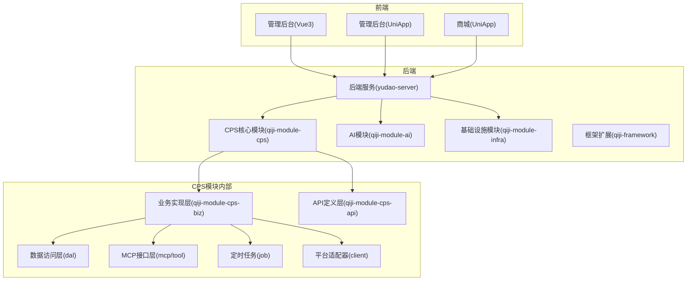
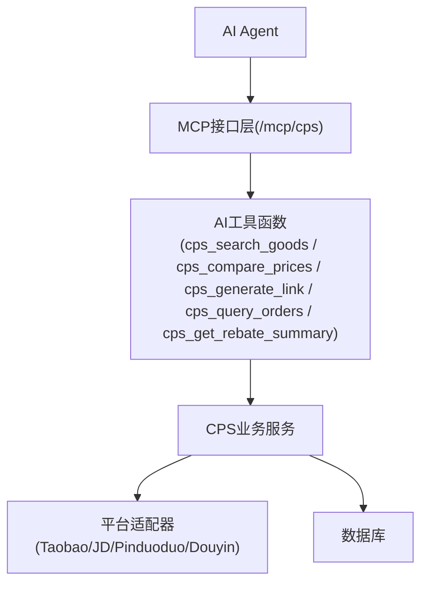
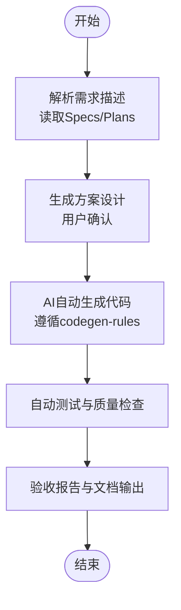
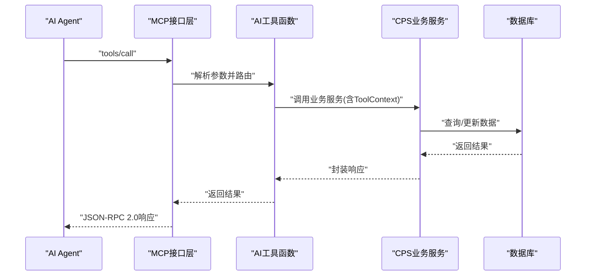
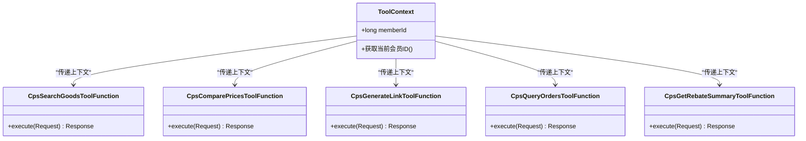
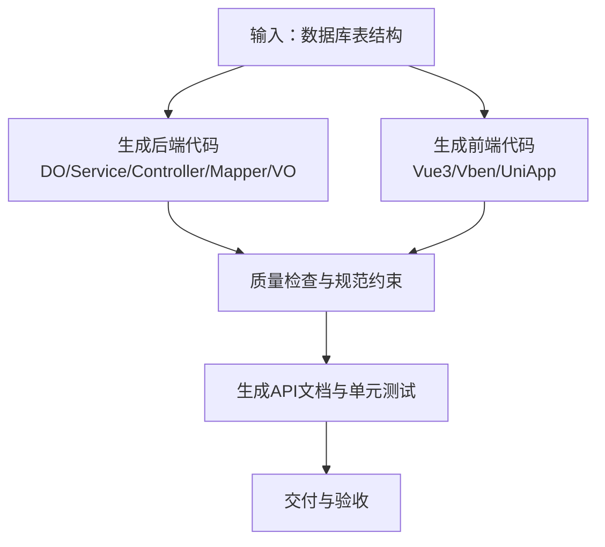
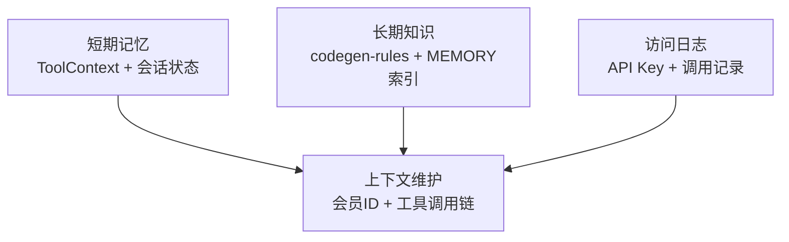
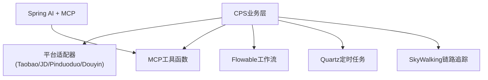

# AI自主编程系统

<cite>
**本文引用的文件**
- [README.md](file://README.md)
- [AGENTS.md](file://AGENTS.md)
- [MEMORY.md](file://agent_improvement/memory/MEMORY.md)
- [codegen-rules.md](file://agent_improvement/memory/codegen-rules.md)
- [config.yaml](file://openspec/config.yaml)
- [CpsSearchGoodsToolFunction.java](file://backend/qiji-module-cps/qiji-module-cps-biz/src/main/java/com/qiji/cps/module/cps/mcp/tool/CpsSearchGoodsToolFunction.java)
- [CpsComparePricesToolFunction.java](file://backend/qiji-module-cps/qiji-module-cps-biz/src/main/java/com/qiji/cps/module/cps/mcp/tool/CpsComparePricesToolFunction.java)
- [CpsGenerateLinkToolFunction.java](file://backend/qiji-module-cps/qiji-module-cps-biz/src/main/java/com/qiji/cps/module/cps/mcp/tool/CpsGenerateLinkToolFunction.java)
- [CpsQueryOrdersToolFunction.java](file://backend/qiji-module-cps/qiji-module-cps-biz/src/main/java/com/qiji/cps/module/cps/mcp/tool/CpsQueryOrdersToolFunction.java)
- [CpsGetRebateSummaryToolFunction.java](file://backend/qiji-module-cps/qiji-module-cps-biz/src/main/java/com/qiji/cps/module/cps/mcp/tool/CpsGetRebateSummaryToolFunction.java)
- [CpsMcpAccessLogDO.java](file://backend/qiji-module-cps/qiji-module-cps-biz/src/main/java/com/qiji/cps/module/cps/dal/dataobject/mcp/CpsMcpAccessLogDO.java)
- [CpsMcpApiKeyDO.java](file://backend/qiji-module-cps/qiji-module-cps-biz/src/main/java/com/qiji/cps/module/cps/dal/dataobject/mcp/CpsMcpApiKeyDO.java)
- [CpsMcpAccessLogMapper.java](file://backend/qiji-module-cps/qiji-module-cps-biz/src/main/java/com/qiji/cps/module/cps/dal/mysql/mcp/CpsMcpAccessLogMapper.java)
- [CpsMcpApiKeyMapper.java](file://backend/qiji-module-cps/qiji-module-cps-biz/src/main/java/com/qiji/cps/module/cps/dal/mysql/mcp/CpsMcpApiKeyMapper.java)
</cite>

## 目录
1. [简介](#简介)
2. [项目结构](#项目结构)
3. [核心组件](#核心组件)
4. [架构总览](#架构总览)
5. [详细组件分析](#详细组件分析)
6. [依赖关系分析](#依赖关系分析)
7. [性能考量](#性能考量)
8. [故障排查指南](#故障排查指南)
9. [结论](#结论)
10. [附录](#附录)

## 简介
本项目是一个融合“Vibe Coding（氛围编程）+ 低代码 + AI 自主编程”的CPS（联盟返利）系统，目标是以自然语言驱动的方式，让AI完成从需求理解、方案设计到代码生成、测试与交付的全流程。系统以规范化工作流为核心，结合MCP（Model Context Protocol）协议，使AI Agent能够直接调用系统能力，实现“说一句话就上线”的敏捷开发体验。

- Vibe Coding工作流：需求对齐 → 方案设计 → AI自主编码 → 自动测试 → 验收交付
- MCP协议：通过标准化工具接口，AI Agent可直接调用搜索、比价、链接生成、订单查询、返利汇总等工具
- AI代理管理：通过角色定义、技能模板、会话状态管理，支撑Agent协作与上下文传递
- 代码生成规则：基于模板引擎与规范约束，确保生成代码的一致性与可维护性
- AI记忆系统：短期记忆与长期知识存储相结合，支撑Agent在多轮交互中的上下文保持与经验复用

## 项目结构
系统采用多模块分层架构，后端以Spring Boot为基础，前端提供Vue3与UniApp多端方案，核心模块集中在CPS系统，并通过MCP接口对外提供AI工具能力。

**图表来源**
- [AGENTS.md:14-62](file://AGENTS.md#L14-L62)
- [README.md:229-249](file://README.md#L229-L249)

**章节来源**
- [AGENTS.md:14-62](file://AGENTS.md#L14-L62)
- [README.md:229-249](file://README.md#L229-L249)

## 核心组件
- Vibe Coding工作流：以Specs/Plans/Agents/Skills为规范，确保AI理解无偏差、方案先行、纯AI自动生成、质量可保障、持续自进化
- MCP协议集成：通过Streamable HTTP(JSON-RPC 2.0)传输，注册5个AI工具，支持API Key鉴权与访问日志
- AI代理管理：定义Agent角色、技能模板、会话状态，结合ToolContext传递当前登录会员ID
- 代码生成规则：基于Velocity模板库的业务系统代码生成规范，覆盖后端分层与前端多模板
- AI记忆系统：短期记忆与长期知识存储，支撑上下文维护与经验复用

**章节来源**
- [README.md:113-144](file://README.md#L113-L144)
- [AGENTS.md:170-189](file://AGENTS.md#L170-L189)
- [MEMORY.md:1-21](file://agent_improvement/memory/MEMORY.md#L1-L21)
- [codegen-rules.md:1-788](file://agent_improvement/memory/codegen-rules.md#L1-L788)

## 架构总览
系统通过MCP协议将AI Agent与CPS业务能力解耦，Agent通过标准化工具调用完成商品搜索、比价、链接生成、订单查询与返利汇总；同时，CPS模块内的平台适配器以策略模式扩展，支持多平台接入；代码生成器与模板引擎保证业务快速落地与一致性。

**图表来源**
- [AGENTS.md:170-189](file://AGENTS.md#L170-L189)
- [CpsSearchGoodsToolFunction.java](file://backend/qiji-module-cps/qiji-module-cps-biz/src/main/java/com/qiji/cps/module/cps/mcp/tool/CpsSearchGoodsToolFunction.java)
- [CpsComparePricesToolFunction.java](file://backend/qiji-module-cps/qiji-module-cps-biz/src/main/java/com/qiji/cps/module/cps/mcp/tool/CpsComparePricesToolFunction.java)
- [CpsGenerateLinkToolFunction.java](file://backend/qiji-module-cps/qiji-module-cps-biz/src/main/java/com/qiji/cps/module/cps/mcp/tool/CpsGenerateLinkToolFunction.java)
- [CpsQueryOrdersToolFunction.java](file://backend/qiji-module-cps/qiji-module-cps-biz/src/main/java/com/qiji/cps/module/cps/mcp/tool/CpsQueryOrdersToolFunction.java)
- [CpsGetRebateSummaryToolFunction.java](file://backend/qiji-module-cps/qiji-module-cps-biz/src/main/java/com/qiji/cps/module/cps/mcp/tool/CpsGetRebateSummaryToolFunction.java)

## 详细组件分析

### Vibe Coding工作流
- 需求描述解析：通过Specs/Plans明确需求边界与验收标准，避免AI“乱写代码”
- 方案设计生成：先设计→再确认→后编码，零返工
- AI编码执行：严格遵循codegen-rules与模板引擎，自动生成后端分层与前端页面
- 质量保障：自动测试+规范约束+验收标准，确保交付质量

**图表来源**
- [README.md:113-144](file://README.md#L113-L144)
- [codegen-rules.md:1-788](file://agent_improvement/memory/codegen-rules.md#L1-L788)

**章节来源**
- [README.md:113-144](file://README.md#L113-L144)
- [codegen-rules.md:1-788](file://agent_improvement/memory/codegen-rules.md#L1-L788)

### MCP协议集成实现
- 协议规范：Streamable HTTP(JSON-RPC 2.0)，端点“/mcp/cps”，支持SSE与HTTP
- 工具函数调用：注册5个工具函数，参数与返回值结构化
- Agent会话管理：通过API Key鉴权，访问日志记录工具名、参数、耗时与客户端IP
- 上下文传递：ToolContext携带当前登录会员ID，用于订单归属与权限控制

**图表来源**
- [AGENTS.md:182-189](file://AGENTS.md#L182-L189)
- [CpsSearchGoodsToolFunction.java](file://backend/qiji-module-cps/qiji-module-cps-biz/src/main/java/com/qiji/cps/module/cps/mcp/tool/CpsSearchGoodsToolFunction.java)
- [CpsComparePricesToolFunction.java](file://backend/qiji-module-cps/qiji-module-cps-biz/src/main/java/com/qiji/cps/module/cps/mcp/tool/CpsComparePricesToolFunction.java)
- [CpsGenerateLinkToolFunction.java](file://backend/qiji-module-cps/qiji-module-cps-biz/src/main/java/com/qiji/cps/module/cps/mcp/tool/CpsGenerateLinkToolFunction.java)
- [CpsQueryOrdersToolFunction.java](file://backend/qiji-module-cps/qiji-module-cps-biz/src/main/java/com/qiji/cps/module/cps/mcp/tool/CpsQueryOrdersToolFunction.java)
- [CpsGetRebateSummaryToolFunction.java](file://backend/qiji-module-cps/qiji-module-cps-biz/src/main/java/com/qiji/cps/module/cps/mcp/tool/CpsGetRebateSummaryToolFunction.java)

**章节来源**
- [AGENTS.md:182-189](file://AGENTS.md#L182-L189)

### AI代理管理设计
- Agent角色定义：明确职责边界与协作流程，结合参考项目与技术栈
- 技能模板配置：基于模板库与命名约定，支撑不同前端框架与模板类型
- 会话状态管理：通过ToolContext传递当前登录会员ID，确保工具调用具备上下文

**图表来源**
- [AGENTS.md:188-189](file://AGENTS.md#L188-L189)
- [CpsSearchGoodsToolFunction.java](file://backend/qiji-module-cps/qiji-module-cps-biz/src/main/java/com/qiji/cps/module/cps/mcp/tool/CpsSearchGoodsToolFunction.java)
- [CpsComparePricesToolFunction.java](file://backend/qiji-module-cps/qiji-module-cps-biz/src/main/java/com/qiji/cps/module/cps/mcp/tool/CpsComparePricesToolFunction.java)
- [CpsGenerateLinkToolFunction.java](file://backend/qiji-module-cps/qiji-module-cps-biz/src/main/java/com/qiji/cps/module/cps/mcp/tool/CpsGenerateLinkToolFunction.java)
- [CpsQueryOrdersToolFunction.java](file://backend/qiji-module-cps/qiji-module-cps-biz/src/main/java/com/qiji/cps/module/cps/mcp/tool/CpsQueryOrdersToolFunction.java)
- [CpsGetRebateSummaryToolFunction.java](file://backend/qiji-module-cps/qiji-module-cps-biz/src/main/java/com/qiji/cps/module/cps/mcp/tool/CpsGetRebateSummaryToolFunction.java)

**章节来源**
- [AGENTS.md:188-189](file://AGENTS.md#L188-L189)

### 代码生成规则实现
- 模板引擎使用：基于Velocity模板库，覆盖后端DO/Service/Controller/VO与前端多模板
- 代码质量检查：通过规范约束与模板变量，确保命名、分层、权限、导出等一致
- 自动生成流程：输入表结构→生成后端分层→生成前端页面→生成API文档→生成单元测试

**图表来源**
- [codegen-rules.md:5-29](file://agent_improvement/memory/codegen-rules.md#L5-L29)
- [codegen-rules.md:327-788](file://agent_improvement/memory/codegen-rules.md#L327-L788)

**章节来源**
- [codegen-rules.md:1-788](file://agent_improvement/memory/codegen-rules.md#L1-L788)

### AI记忆系统架构
- 短期记忆管理：通过ToolContext与会话状态，维持工具调用间的上下文
- 长期知识存储：通过codegen-rules与MEMORY索引，沉淀模板与规范
- 上下文维护机制：API Key鉴权与访问日志，记录工具调用轨迹，便于审计与回放

**图表来源**
- [AGENTS.md:188-189](file://AGENTS.md#L188-L189)
- [MEMORY.md:1-21](file://agent_improvement/memory/MEMORY.md#L1-L21)
- [CpsMcpAccessLogDO.java](file://backend/qiji-module-cps/qiji-module-cps-biz/src/main/java/com/qiji/cps/module/cps/dal/dataobject/mcp/CpsMcpAccessLogDO.java)
- [CpsMcpApiKeyDO.java](file://backend/qiji-module-cps/qiji-module-cps-biz/src/main/java/com/qiji/cps/module/cps/dal/dataobject/mcp/CpsMcpApiKeyDO.java)

**章节来源**
- [AGENTS.md:188-189](file://AGENTS.md#L188-L189)
- [MEMORY.md:1-21](file://agent_improvement/memory/MEMORY.md#L1-L21)

## 依赖关系分析
- 模块耦合：CPS模块内部通过策略模式扩展平台适配器，降低与具体平台的耦合
- 外部依赖：Spring AI与MCP协议支持、Flowable工作流、Quartz定时任务、SkyWalking链路追踪
- 接口契约：MCP工具函数遵循统一参数与返回结构，便于Agent对接

**图表来源**
- [AGENTS.md:152-204](file://AGENTS.md#L152-L204)
- [CpsSearchGoodsToolFunction.java](file://backend/qiji-module-cps/qiji-module-cps-biz/src/main/java/com/qiji/cps/module/cps/mcp/tool/CpsSearchGoodsToolFunction.java)
- [CpsComparePricesToolFunction.java](file://backend/qiji-module-cps/qiji-module-cps-biz/src/main/java/com/qiji/cps/module/cps/mcp/tool/CpsComparePricesToolFunction.java)
- [CpsGenerateLinkToolFunction.java](file://backend/qiji-module-cps/qiji-module-cps-biz/src/main/java/com/qiji/cps/module/cps/mcp/tool/CpsGenerateLinkToolFunction.java)
- [CpsQueryOrdersToolFunction.java](file://backend/qiji-module-cps/qiji-module-cps-biz/src/main/java/com/qiji/cps/module/cps/mcp/tool/CpsQueryOrdersToolFunction.java)
- [CpsGetRebateSummaryToolFunction.java](file://backend/qiji-module-cps/qiji-module-cps-biz/src/main/java/com/qiji/cps/module/cps/mcp/tool/CpsGetRebateSummaryToolFunction.java)

**章节来源**
- [AGENTS.md:152-204](file://AGENTS.md#L152-L204)

## 性能考量
- 搜索与比价：单平台搜索<2秒(P99)，多平台比价<5秒(P99)
- 链接生成：转链生成<1秒
- 订单同步：延迟<30分钟
- 返利入账：平台结算后24小时内
- MCP工具调用：搜索类<3秒，查询类<1秒

**章节来源**
- [AGENTS.md:357-368](file://AGENTS.md#L357-L368)

## 故障排查指南
- 文件编码问题：Windows PowerShell读写UTF-8中文字符会导致损坏，应使用Python进行文件替换与校验
- Docker部署：确认端口映射与环境变量，查看服务日志定位问题
- MCP工具调用：检查API Key配置、访问日志与工具参数，确保ToolContext正确传递

**章节来源**
- [AGENTS.md:266-344](file://AGENTS.md#L266-L344)
- [AGENTS.md:249-265](file://AGENTS.md#L249-L265)

## 结论
AgenticCPS通过Vibe Coding工作流、MCP协议集成、AI代理管理、代码生成规则与AI记忆系统，构建了从需求到交付的全链路自动化能力。系统以规范化与模板化为核心，确保AI在理解需求、生成代码与提供工具调用方面的稳定性与可扩展性，为一人公司与小型团队提供了强大的“AI自主编程”能力。

## 附录
- 开放规范配置：openspec/config.yaml用于项目上下文与制品规则定义
- Agent参考文档：AGENTS.md提供架构、命令、模式与规则说明
- 代码生成规则：agent_improvement/memory/codegen-rules.md提供模板与规范细节

**章节来源**
- [config.yaml:1-21](file://openspec/config.yaml#L1-L21)
- [AGENTS.md:1-368](file://AGENTS.md#L1-L368)
- [codegen-rules.md:1-788](file://agent_improvement/memory/codegen-rules.md#L1-L788)