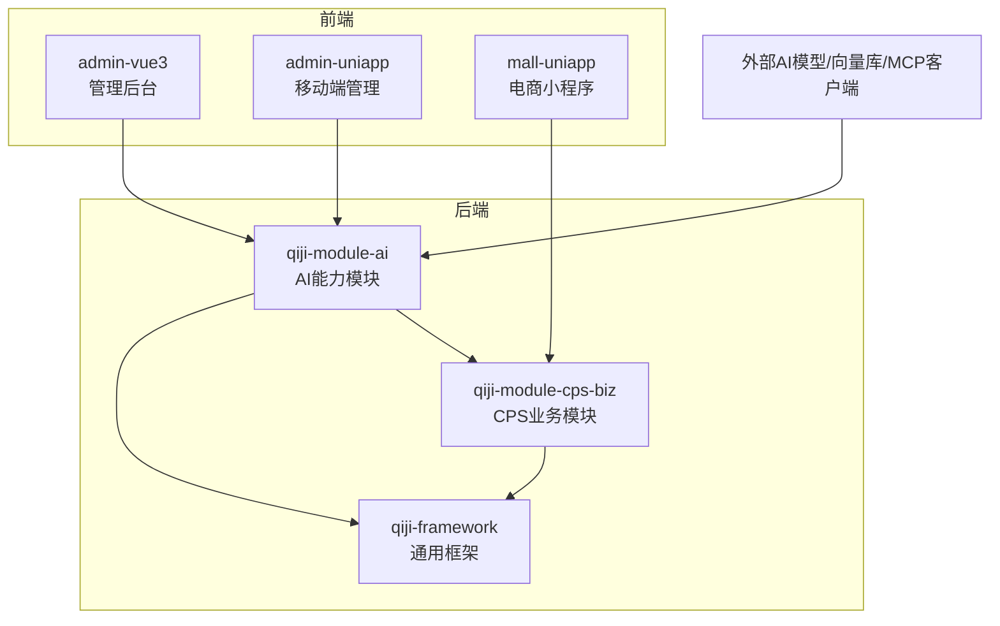
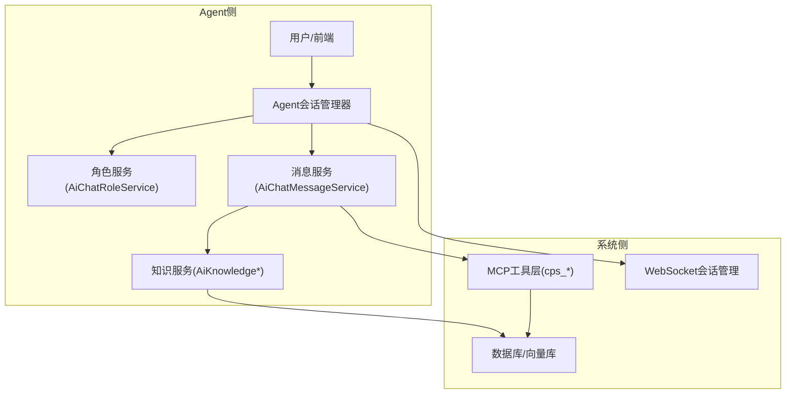
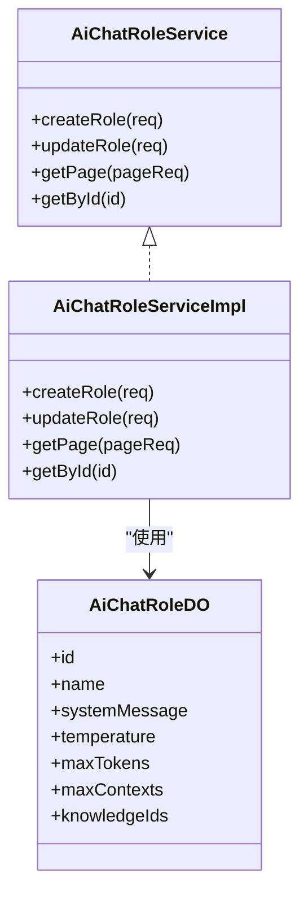
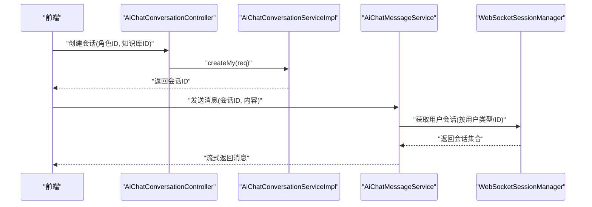
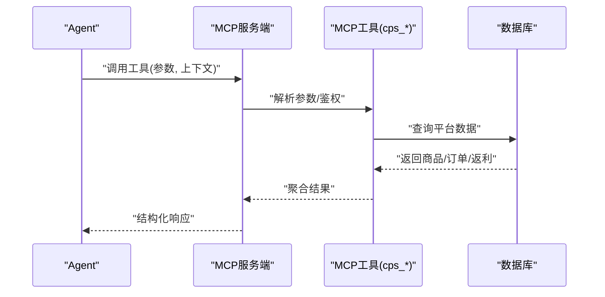
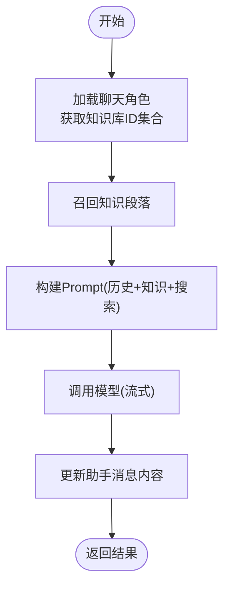
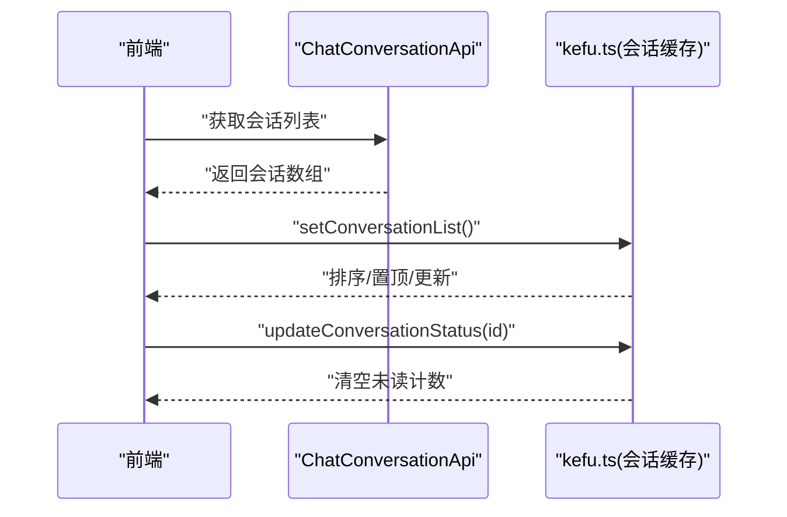
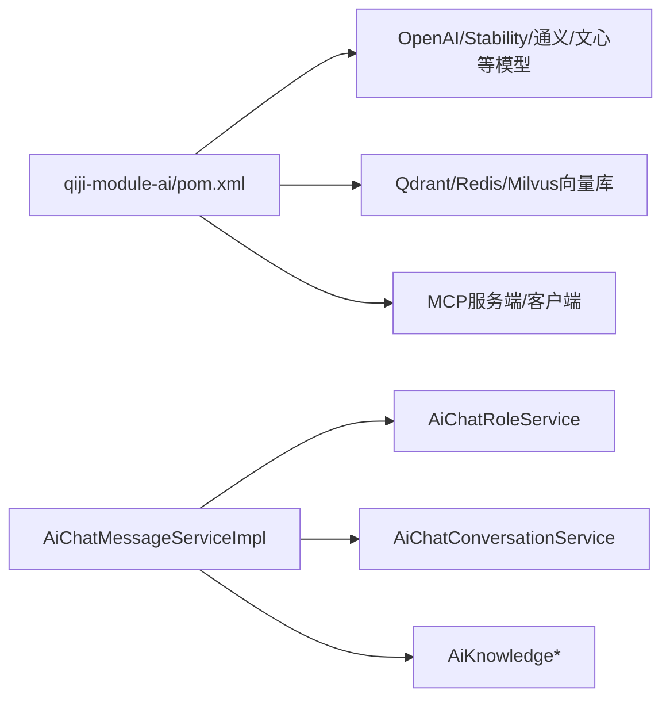

# Agent代理管理

<cite>
**本文引用的文件**
- [AGENTS.md](file://AGENTS.md)
- [CPS系统PRD文档.md](file://docs/CPS系统PRD文档.md)
- [qiji-module-ai/pom.xml](file://backend/qiji-module-ai/pom.xml)
- [AiChatMessageController.java](file://backend/qiji-module-ai/src/main/java/com/qiji/cps/module/ai/controller/admin/chat/AiChatMessageController.java)
- [AiChatConversationController.java](file://backend/qiji-module-ai/src/main/java/com/qiji/cps/module/ai/controller/admin/chat/AiChatConversationController.java)
- [AiChatMessageServiceImpl.java](file://backend/qiji-module-ai/src/main/java/com/qiji/cps/module/ai/service/chat/AiChatMessageServiceImpl.java)
- [AiChatConversationServiceImpl.java](file://backend/qiji-module-ai/src/main/java/com/qiji/cps/module/ai/service/chat/AiChatConversationServiceImpl.java)
- [AiChatRoleService.java](file://backend/qiji-module-ai/src/main/java/com/qiji/cps/module/ai/service/model/AiChatRoleService.java)
- [AiChatRoleServiceImpl.java](file://backend/qiji-module-ai/src/main/java/com/qiji/cps/module/ai/service/model/AiChatRoleServiceImpl.java)
- [AiChatRoleDO.java](file://backend/qiji-module-ai/src/main/java/com/qiji/cps/module/ai/dal/dataobject/model/AiChatRoleDO.java)
- [AiChatConversationDO.java](file://backend/qiji-module-ai/src/main/java/com/qiji/cps/module/ai/dal/dataobject/chat/AiChatConversationDO.java)
- [AiChatMessageDO.java](file://backend/qiji-module-ai/src/main/java/com/qiji/cps/module/ai/dal/dataobject/chat/AiChatMessageDO.java)
- [AiChatMessageController.http](file://backend/qiji-module-ai/src/main/java/com/qiji/cps/module/ai/controller/admin/chat/AiChatMessageController.http)
- [index.ts](file://frontend/admin-vue3/src/api/ai/chat/conversation/index.ts)
- [kefu.ts](file://frontend/admin-vue3/src/store/modules/mall/kefu.ts)
- [KeFuConversationServiceImpl.java](file://backend/qiji-module-mall/qiji-module-promotion/src/main/java/com/qiji/cps/module/promotion/service/kefu/KeFuConversationServiceImpl.java)
- [WebSocketSessionManagerImpl.java](file://backend/qiji-framework/qiji-spring-boot-starter-websocket/src/main/java/com/qiji/cps/framework/websocket/core/session/WebSocketSessionManagerImpl.java)
- [KfSessionHandler.java](file://backend/qiji-module-mp/src/main/java/com/qiji/cps/module/mp/service/handler/other/KfSessionHandler.java)
</cite>

## 目录
1. [简介](#简介)
2. [项目结构](#项目结构)
3. [核心组件](#核心组件)
4. [架构总览](#架构总览)
5. [详细组件分析](#详细组件分析)
6. [依赖关系分析](#依赖关系分析)
7. [性能考量](#性能考量)
8. [故障排查指南](#故障排查指南)
9. [结论](#结论)
10. [附录](#附录)

## 简介
本技术文档围绕Agent代理管理系统展开，聚焦以下目标：
- Agent角色的定义与配置：角色模板设计、权限控制、行为约束
- Agent会话管理：会话创建、状态维护、生命周期管理、资源清理
- Agent技能模板：技能定义、触发条件、执行逻辑、效果评估
- Agent记忆系统：短期记忆管理、长期知识存储、上下文维护
- 提供可直接定位的代码示例路径，帮助快速上手Agent的创建、配置、使用与管理

## 项目结构
本项目采用多模块分层架构，AI能力由独立模块承载，结合MCP协议对外提供工具函数能力；前端提供管理后台与移动端界面。

图表来源
- [AGENTS.md:11-62](file://AGENTS.md#L11-L62)
- [qiji-module-ai/pom.xml:1-265](file://backend/qiji-module-ai/pom.xml#L1-L265)

章节来源
- [AGENTS.md:11-62](file://AGENTS.md#L11-L62)
- [qiji-module-ai/pom.xml:1-265](file://backend/qiji-module-ai/pom.xml#L1-L265)

## 核心组件
- 角色与会话：通过聊天角色(AiChatRole)与对话(AiChatConversation)实现Agent身份与上下文持久化
- 消息与流式响应：通过聊天消息(AiChatMessage)与流式模型调用实现实时交互
- MCP工具层：面向Agent的外部工具函数，如商品搜索、比价、推广链接生成等
- 记忆与知识：基于向量存储与知识库段落召回，支撑上下文增强与推理
- 会话管理：WebSocket会话管理器与客服会话处理器，保障长连接与状态一致性

章节来源
- [AiChatRoleService.java](file://backend/qiji-module-ai/src/main/java/com/qiji/cps/module/ai/service/model/AiChatRoleService.java)
- [AiChatConversationServiceImpl.java](file://backend/qiji-module-ai/src/main/java/com/qiji/cps/module/ai/service/chat/AiChatConversationServiceImpl.java)
- [AiChatMessageServiceImpl.java](file://backend/qiji-module-ai/src/main/java/com/qiji/cps/module/ai/service/chat/AiChatMessageServiceImpl.java)
- [qiji-module-ai/pom.xml:198-221](file://backend/qiji-module-ai/pom.xml#L198-L221)

## 架构总览
Agent代理管理以“角色-会话-消息-工具-记忆”为主线，结合MCP协议与向量检索，形成闭环的智能体交互体系。

图表来源
- [AiChatMessageServiceImpl.java:170-318](file://backend/qiji-module-ai/src/main/java/com/qiji/cps/module/ai/service/chat/AiChatMessageServiceImpl.java#L170-L318)
- [qiji-module-ai/pom.xml:198-221](file://backend/qiji-module-ai/pom.xml#L198-L221)
- [WebSocketSessionManagerImpl.java:1-102](file://backend/qiji-framework/qiji-spring-boot-starter-websocket/src/main/java/com/qiji/cps/framework/websocket/core/session/WebSocketSessionManagerImpl.java#L1-L102)

## 详细组件分析

### 组件A：Agent角色与权限控制
- 角色模板设计
  - 角色实体包含系统提示词、模型参数、上下文长度、绑定的知识库ID集合等
  - 角色服务提供创建、更新、查询与分页能力
- 权限控制
  - 控制器层使用安全注解进行权限校验
  - 角色与知识库绑定，确保不同角色具备不同的知识访问边界
- 行为约束
  - 通过模型参数（温度、最大Token、上下文数量）约束Agent输出行为
  - 通过知识库白名单与工具权限约束Agent可调用能力

图表来源
- [AiChatRoleDO.java](file://backend/qiji-module-ai/src/main/java/com/qiji/cps/module/ai/dal/dataobject/model/AiChatRoleDO.java)
- [AiChatRoleService.java](file://backend/qiji-module-ai/src/main/java/com/qiji/cps/module/ai/service/model/AiChatRoleService.java)
- [AiChatRoleServiceImpl.java](file://backend/qiji-module-ai/src/main/java/com/qiji/cps/module/ai/service/model/AiChatRoleServiceImpl.java)

章节来源
- [AiChatRoleDO.java](file://backend/qiji-module-ai/src/main/java/com/qiji/cps/module/ai/dal/dataobject/model/AiChatRoleDO.java)
- [AiChatRoleService.java](file://backend/qiji-module-ai/src/main/java/com/qiji/cps/module/ai/service/model/AiChatRoleService.java)
- [AiChatRoleServiceImpl.java](file://backend/qiji-module-ai/src/main/java/com/qiji/cps/module/ai/service/model/AiChatRoleServiceImpl.java)

### 组件B：Agent会话管理机制
- 会话创建
  - 前端通过API创建“我的”会话，携带角色ID与知识库ID
  - 后端根据当前登录用户与角色信息创建会话记录
- 状态维护
  - 会话支持置顶、标题、模型参数等状态字段
  - 与消息表建立主从关系，保证消息链完整
- 生命周期管理
  - 会话作为上下文容器，随消息发送/接收动态扩展
  - 支持删除、置顶、更新等生命周期操作
- 资源清理
  - WebSocket会话管理器按用户类型与ID维护连接映射，断开时自动清理
  - 客服会话提供软删除与管理员可见性控制

图表来源
- [AiChatConversationController.java:1-27](file://backend/qiji-module-ai/src/main/java/com/qiji/cps/module/ai/controller/admin/chat/AiChatConversationController.java#L1-L27)
- [AiChatConversationServiceImpl.java:1-28](file://backend/qiji-module-ai/src/main/java/com/qiji/cps/module/ai/service/chat/AiChatConversationServiceImpl.java#L1-L28)
- [AiChatMessageServiceImpl.java:170-318](file://backend/qiji-module-ai/src/main/java/com/qiji/cps/module/ai/service/chat/AiChatMessageServiceImpl.java#L170-L318)
- [WebSocketSessionManagerImpl.java:1-102](file://backend/qiji-framework/qiji-spring-boot-starter-websocket/src/main/java/com/qiji/cps/framework/websocket/core/session/WebSocketSessionManagerImpl.java#L1-L102)

章节来源
- [AiChatConversationController.java:1-27](file://backend/qiji-module-ai/src/main/java/com/qiji/cps/module/ai/controller/admin/chat/AiChatConversationController.java#L1-L27)
- [AiChatConversationServiceImpl.java:1-28](file://backend/qiji-module-ai/src/main/java/com/qiji/cps/module/ai/service/chat/AiChatConversationServiceImpl.java#L1-L28)
- [AiChatMessageServiceImpl.java:170-318](file://backend/qiji-module-ai/src/main/java/com/qiji/cps/module/ai/service/chat/AiChatMessageServiceImpl.java#L170-L318)
- [WebSocketSessionManagerImpl.java:1-102](file://backend/qiji-framework/qiji-spring-boot-starter-websocket/src/main/java/com/qiji/cps/framework/websocket/core/session/WebSocketSessionManagerImpl.java#L1-L102)
- [KfSessionHandler.java:1-26](file://backend/qiji-module-mp/src/main/java/com/qiji/cps/module/mp/service/handler/other/KfSessionHandler.java#L1-L26)
- [KeFuConversationServiceImpl.java:32-62](file://backend/qiji-module-mall/qiji-module-promotion/src/main/java/com/qiji/cps/module/promotion/service/kefu/KeFuConversationServiceImpl.java#L32-L62)

### 组件C：Agent技能模板（MCP工具）
- 技能定义
  - 工具函数注册于MCP服务端，统一暴露在SSE/HTTP端点
  - 工具名称与权限级别在PRD中明确，如搜索、比价、推广链接生成、订单查询、返利汇总
- 触发条件
  - Agent根据用户意图与上下文决定调用时机
  - 工具调用携带当前登录成员ID，用于订单归属与审计
- 执行逻辑
  - 工具函数并发查询多平台数据，计算实付价格与返利
  - 返回结构化结果与推荐理由
- 效果评估
  - 访问日志记录工具名、参数、耗时、客户端IP，便于统计与限流

图表来源
- [AGENTS.md:170-189](file://AGENTS.md#L170-L189)
- [CPS系统PRD文档.md:654-737](file://docs/CPS系统PRD文档.md#L654-L737)

章节来源
- [AGENTS.md:170-189](file://AGENTS.md#L170-L189)
- [CPS系统PRD文档.md:654-737](file://docs/CPS系统PRD文档.md#L654-L737)

### 组件D：Agent记忆系统（短期记忆与长期知识）
- 短期记忆管理
  - 基于会话消息历史与上下文长度限制，动态裁剪历史消息
  - 流式模型调用过程中，逐步更新助手消息内容
- 长期知识存储
  - 基于向量存储与Tika文档解析，构建知识库
  - 角色绑定知识库ID集合，实现按角色的知识访问控制
- 上下文维护
  - 消息发送时可选择是否使用上下文，支持联网搜索增强
  - 知识段落召回与文档映射，提升回答准确性与可溯源性

图表来源
- [AiChatMessageServiceImpl.java:170-318](file://backend/qiji-module-ai/src/main/java/com/qiji/cps/module/ai/service/chat/AiChatMessageServiceImpl.java#L170-L318)

章节来源
- [AiChatMessageServiceImpl.java:170-318](file://backend/qiji-module-ai/src/main/java/com/qiji/cps/module/ai/service/chat/AiChatMessageServiceImpl.java#L170-L318)

### 组件E：前端交互与会话缓存
- 前端提供会话列表、置顶、已读状态等缓存操作
- 通过API封装与类型定义，简化会话与消息的CRUD操作

图表来源
- [index.ts:1-37](file://frontend/admin-vue3/src/api/ai/chat/conversation/index.ts#L1-L37)
- [kefu.ts:31-67](file://frontend/admin-vue3/src/store/modules/mall/kefu.ts#L31-L67)

章节来源
- [index.ts:1-37](file://frontend/admin-vue3/src/api/ai/chat/conversation/index.ts#L1-L37)
- [kefu.ts:31-67](file://frontend/admin-vue3/src/store/modules/mall/kefu.ts#L31-L67)

## 依赖关系分析
- 模块依赖
  - qiji-module-ai依赖系统与基础设施模块，接入多种大模型与向量存储
  - MCP服务端与客户端依赖需避免与WebFlux冲突，采用WebMvc实现
- 组件耦合
  - 消息服务依赖角色服务与知识服务，形成清晰的职责边界
  - 会话服务与消息服务强关联，共同维护上下文完整性

图表来源
- [qiji-module-ai/pom.xml:77-261](file://backend/qiji-module-ai/pom.xml#L77-L261)
- [AiChatMessageServiceImpl.java:170-318](file://backend/qiji-module-ai/src/main/java/com/qiji/cps/module/ai/service/chat/AiChatMessageServiceImpl.java#L170-L318)

章节来源
- [qiji-module-ai/pom.xml:77-261](file://backend/qiji-module-ai/pom.xml#L77-L261)
- [AiChatMessageServiceImpl.java:170-318](file://backend/qiji-module-ai/src/main/java/com/qiji/cps/module/ai/service/chat/AiChatMessageServiceImpl.java#L170-L318)

## 性能考量
- 搜索与比价延迟：多平台并发查询与聚合，需关注P99延迟目标
- 流式响应：使用Flux进行增量更新，降低首屏等待时间
- 向量检索：合理设置上下文数量与最大Token，平衡质量与性能
- 会话并发：WebSocket会话管理器采用并发安全结构，避免锁竞争

## 故障排查指南
- 会话异常
  - 检查WebSocket会话是否正确添加/移除
  - 核对用户类型与用户ID映射是否一致
- 消息流式更新失败
  - 确认租户隔离与异步更新逻辑
  - 校验模型调用返回内容是否为空
- MCP工具调用失败
  - 校验API Key权限级别与限流配置
  - 查看访问日志定位具体工具与参数

章节来源
- [WebSocketSessionManagerImpl.java:1-102](file://backend/qiji-framework/qiji-spring-boot-starter-websocket/src/main/java/com/qiji/cps/framework/websocket/core/session/WebSocketSessionManagerImpl.java#L1-L102)
- [AiChatMessageServiceImpl.java:291-303](file://backend/qiji-module-ai/src/main/java/com/qiji/cps/module/ai/service/chat/AiChatMessageServiceImpl.java#L291-L303)
- [CPS系统PRD文档.md:694-737](file://docs/CPS系统PRD文档.md#L694-L737)

## 结论
本系统通过“角色-会话-消息-工具-记忆”的完整闭环，实现了可配置、可观测、可扩展的Agent代理管理能力。MCP工具层与向量知识库的结合，使得Agent能够在多平台场景下完成复杂任务；完善的会话与权限控制保障了系统的安全性与稳定性。

## 附录
- 快速开始（示例路径）
  - 创建会话：[AiChatConversationController.java:1-27](file://backend/qiji-module-ai/src/main/java/com/qiji/cps/module/ai/controller/admin/chat/AiChatConversationController.java#L1-L27)
  - 发送消息（流式）：[AiChatMessageController.http:49-66](file://backend/qiji-module-ai/src/main/java/com/qiji/cps/module/ai/controller/admin/chat/AiChatMessageController.http#L49-L66)
  - 获取会话列表（前端）：[index.ts:25-37](file://frontend/admin-vue3/src/api/ai/chat/conversation/index.ts#L25-L37)
  - 会话缓存更新（前端）：[kefu.ts:31-67](file://frontend/admin-vue3/src/store/modules/mall/kefu.ts#L31-L67)
  - 角色与知识库绑定：[AiChatRoleDO.java](file://backend/qiji-module-ai/src/main/java/com/qiji/cps/module/ai/dal/dataobject/model/AiChatRoleDO.java)
  - MCP工具与权限：[AGENTS.md:170-189](file://AGENTS.md#L170-L189)