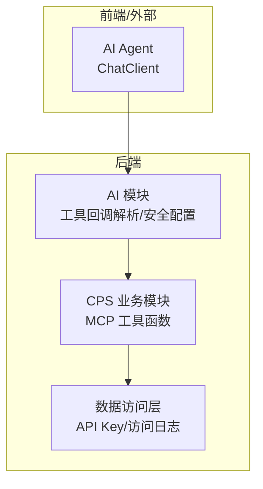
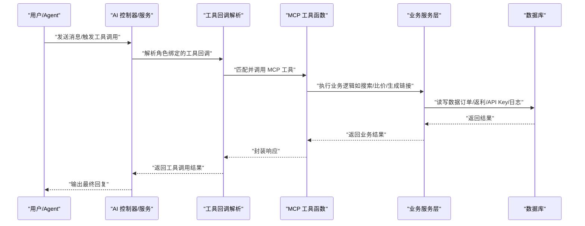
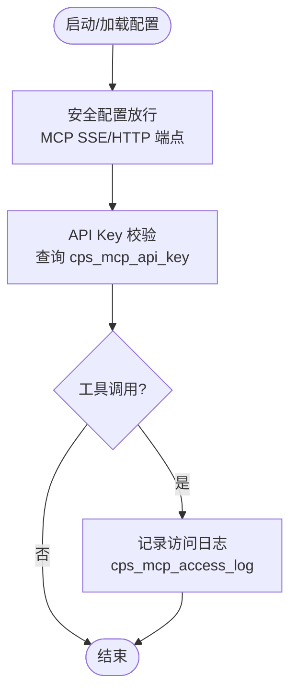
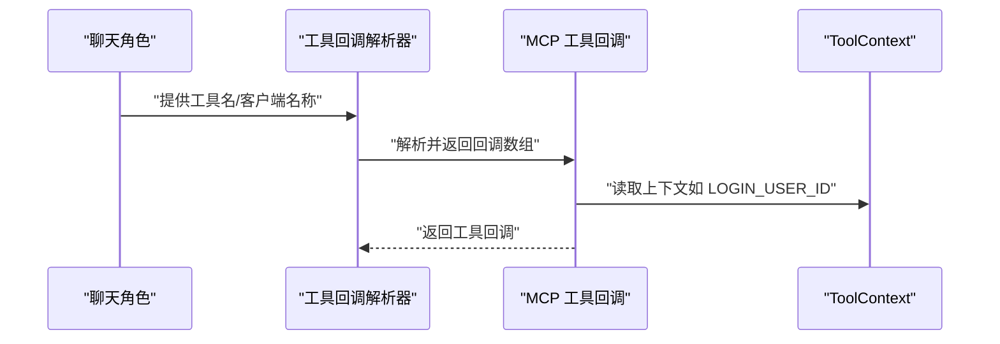
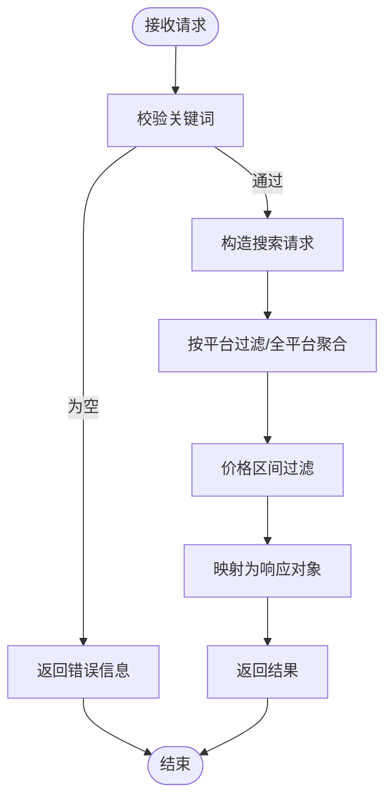
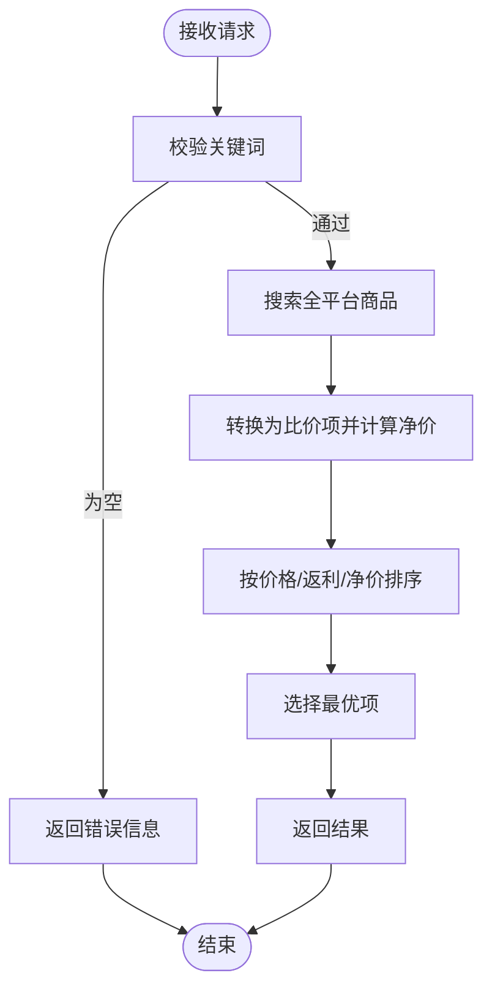
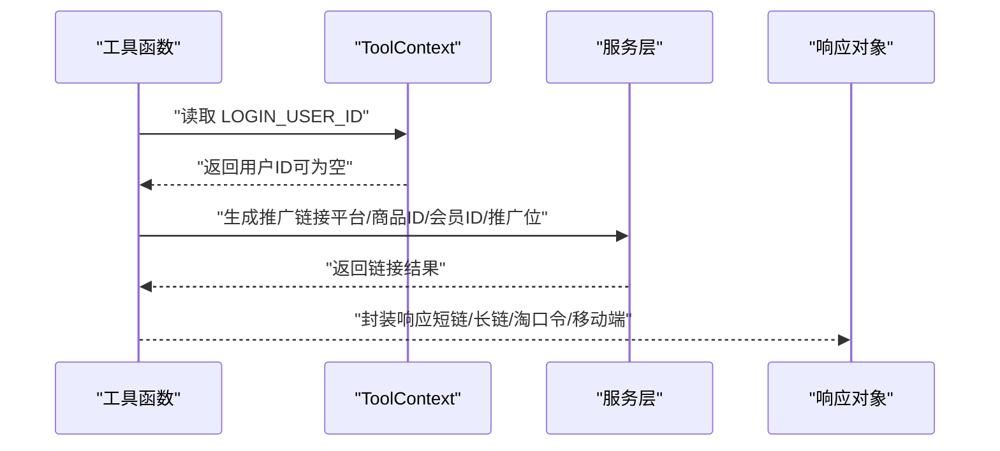
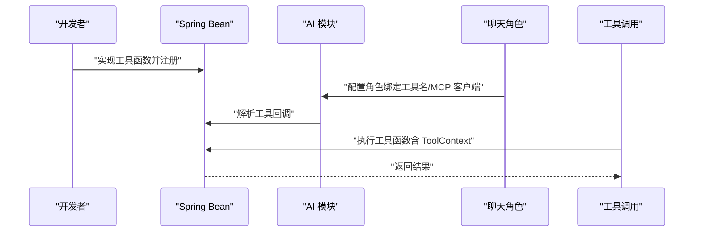
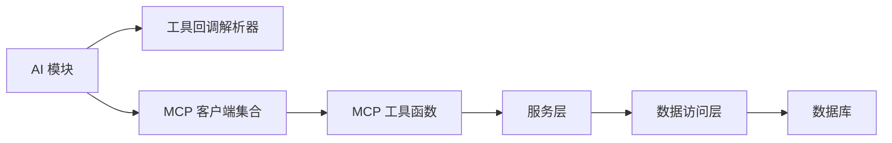

# MCP协议集成

<cite>
**本文引用的文件**
- [AGENTS.md](file://AGENTS.md)
- [AiChatMessageServiceImpl.java](file://backend/qiji-module-ai/src/main/java/com/qiji/cps/module/ai/service/chat/AiChatMessageServiceImpl.java)
- [SecurityConfiguration.java](file://backend/qiji-module-ai/src/main/java/com/qiji/cps/module/ai/framework/security/config/SecurityConfiguration.java)
- [CpsSearchGoodsToolFunction.java](file://backend/qiji-module-cps/qiji-module-cps-biz/src/main/java/com/qiji/cps/module/cps/mcp/tool/CpsSearchGoodsToolFunction.java)
- [CpsComparePricesToolFunction.java](file://backend/qiji-module-cps/qiji-module-cps-biz/src/main/java/com/qiji/cps/module/cps/mcp/tool/CpsComparePricesToolFunction.java)
- [CpsGenerateLinkToolFunction.java](file://backend/qiji-module-cps/qiji-module-cps-biz/src/main/java/com/qiji/cps/module/cps/mcp/tool/CpsGenerateLinkToolFunction.java)
- [CpsQueryOrdersToolFunction.java](file://backend/qiji-module-cps/qiji-module-cps-biz/src/main/java/com/qiji/cps/module/cps/mcp/tool/CpsQueryOrdersToolFunction.java)
- [CpsGetRebateSummaryToolFunction.java](file://backend/qiji-module-cps/qiji-module-cps-biz/src/main/java/com/qiji/cps/module/cps/mcp/tool/CpsGetRebateSummaryToolFunction.java)
- [CpsMcpApiKeyDO.java](file://backend/qiji-module-cps/qiji-module-cps-biz/src/main/java/com/qiji/cps/module/cps/dal/dataobject/mcp/CpsMcpApiKeyDO.java)
- [CpsMcpAccessLogDO.java](file://backend/qiji-module-cps/qiji-module-cps-biz/src/main/java/com/qiji/cps/module/cps/dal/dataobject/mcp/CpsMcpAccessLogDO.java)
- [CpsMcpApiKeyMapper.java](file://backend/qiji-module-cps/qiji-module-cps-biz/src/main/java/com/qiji/cps/module/cps/dal/mysql/mcp/CpsMcpApiKeyMapper.java)
- [CpsMcpAccessLogMapper.java](file://backend/qiji-module-cps/qiji-module-cps-biz/src/main/java/com/qiji/cps/module/cps/dal/mysql/mcp/CpsMcpAccessLogMapper.java)
- [DouBaoMcpTests.java](file://backend/qiji-module-ai/src/test/java/com/qiji/cps/module/ai/framework/ai/core/model/mcp/DouBaoMcpTests.java)
</cite>

## 目录
1. [简介](#简介)
2. [项目结构](#项目结构)
3. [核心组件](#核心组件)
4. [架构总览](#架构总览)
5. [详细组件分析](#详细组件分析)
6. [依赖关系分析](#依赖关系分析)
7. [性能考量](#性能考量)
8. [故障排查指南](#故障排查指南)
9. [结论](#结论)
10. [附录](#附录)

## 简介
本文件面向在 AgenticCPS 中集成 MCP（模型上下文协议）的开发者，系统性阐述 MCP 协议在本项目中的实现原理与使用方式，涵盖协议规范解析、工具函数调用机制、会话状态管理、客户端配置与使用、认证与访问控制、消息格式处理、工具函数开发规范、以及完整的开发与注册流程示例。

## 项目结构
MCP 集成主要分布在以下模块与目录：
- 后端 AI 模块：负责与 AI 模型交互、工具回调解析、安全策略放行 MCP SSE/HTTP 端点
- CPS 业务模块：提供 5 个 MCP 工具函数，覆盖商品搜索、跨平台比价、生成推广链接、查询订单、返利账户汇总
- 数据访问层：提供 MCP API Key 与访问日志的持久化能力
- 测试用例：演示如何通过 ChatClient 注册并调用工具函数

**图表来源**
- [AiChatMessageServiceImpl.java:127-136](file://backend/qiji-module-ai/src/main/java/com/qiji/cps/module/ai/service/chat/AiChatMessageServiceImpl.java#L127-L136)
- [CpsSearchGoodsToolFunction.java:1-177](file://backend/qiji-module-cps/qiji-module-cps-biz/src/main/java/com/qiji/cps/module/cps/mcp/tool/CpsSearchGoodsToolFunction.java#L1-L177)
- [CpsMcpApiKeyDO.java:1-60](file://backend/qiji-module-cps/qiji-module-cps-biz/src/main/java/com/qiji/cps/module/cps/dal/dataobject/mcp/CpsMcpApiKeyDO.java#L1-L60)
- [CpsMcpAccessLogDO.java:1-62](file://backend/qiji-module-cps/qiji-module-cps-biz/src/main/java/com/qiji/cps/module/cps/dal/dataobject/mcp/CpsMcpAccessLogDO.java#L1-L62)

**章节来源**
- [AGENTS.md:170-189](file://AGENTS.md#L170-L189)

## 核心组件
- MCP 工具函数集合
  - cps_search_goods：多平台商品搜索，支持关键词、平台过滤、分页与价格区间筛选
  - cps_compare_prices：跨平台比价，输出最便宜、返利最高、综合最优商品
  - cps_generate_link：生成带返利追踪的推广链接（短链/长链/淘口令/移动端）
  - cps_query_orders：查询会员订单与返利状态
  - cps_get_rebate_summary：查询返利账户汇总与最近返利记录
- 安全与认证
  - Spring Security 放行 MCP SSE 与 HTTP 端点
  - API Key 管理与访问日志记录
- 会话与上下文
  - ToolContext 传递当前登录会员 ID，用于订单归因
  - 历史消息上下文抽取，支持角色绑定工具集

**章节来源**
- [AGENTS.md:170-189](file://AGENTS.md#L170-L189)
- [AiChatMessageServiceImpl.java:410-425](file://backend/qiji-module-ai/src/main/java/com/qiji/cps/module/ai/service/chat/AiChatMessageServiceImpl.java#L410-L425)

## 架构总览
MCP 在本项目中的运行路径如下：
- AI Agent 通过 ChatClient 发起请求
- AI 模块根据角色配置解析工具回调，包含 MCP 工具
- MCP 工具函数执行业务逻辑（调用服务层），必要时从 ToolContext 读取登录用户信息
- 访问控制与认证由安全配置与 API Key 管理保障
- 访问日志记录工具名、参数、耗时、客户端 IP 等

**图表来源**
- [AiChatMessageServiceImpl.java:410-425](file://backend/qiji-module-ai/src/main/java/com/qiji/cps/module/ai/service/chat/AiChatMessageServiceImpl.java#L410-L425)
- [CpsSearchGoodsToolFunction.java:120-174](file://backend/qiji-module-cps/qiji-module-cps-biz/src/main/java/com/qiji/cps/module/cps/mcp/tool/CpsSearchGoodsToolFunction.java#L120-L174)
- [CpsMcpApiKeyDO.java:24-60](file://backend/qiji-module-cps/qiji-module-cps-biz/src/main/java/com/qiji/cps/module/cps/dal/dataobject/mcp/CpsMcpApiKeyDO.java#L24-L60)
- [CpsMcpAccessLogDO.java:22-62](file://backend/qiji-module-cps/qiji-module-cps-biz/src/main/java/com/qiji/cps/module/cps/dal/dataobject/mcp/CpsMcpAccessLogDO.java#L22-L62)

## 详细组件分析

### MCP 协议与客户端配置
- 协议与端点
  - 传输：Streamable HTTP（JSON-RPC 2.0）
  - 端点：/mcp/cps
- 安全放行
  - Spring Security 配置放行 MCP SSE 与 HTTP 端点，允许 AI Agent 访问
- 认证机制
  - 使用 API Key 管理，存储于 cps_mcp_api_key 表
  - 访问日志记录于 cps_mcp_access_log 表，包含工具名、参数、耗时、客户端 IP
- 会话与上下文
  - ToolContext 传递当前登录会员 ID，用于订单归因与权限判断

**图表来源**
- [SecurityConfiguration.java:25-42](file://backend/qiji-module-ai/src/main/java/com/qiji/cps/module/ai/framework/security/config/SecurityConfiguration.java#L25-L42)
- [CpsMcpApiKeyDO.java:24-60](file://backend/qiji-module-cps/qiji-module-cps-biz/src/main/java/com/qiji/cps/module/cps/dal/dataobject/mcp/CpsMcpApiKeyDO.java#L24-L60)
- [CpsMcpAccessLogDO.java:22-62](file://backend/qiji-module-cps/qiji-module-cps-biz/src/main/java/com/qiji/cps/module/cps/dal/dataobject/mcp/CpsMcpAccessLogDO.java#L22-L62)

**章节来源**
- [AGENTS.md:182-189](file://AGENTS.md#L182-L189)
- [SecurityConfiguration.java:25-42](file://backend/qiji-module-ai/src/main/java/com/qiji/cps/module/ai/framework/security/config/SecurityConfiguration.java#L25-L42)

### 工具函数调用机制与会话状态管理
- 角色绑定工具
  - AI 模块根据角色配置解析工具回调，包含 MCP 工具
  - 通过工具名解析到具体工具函数
- 会话上下文
  - ToolContext 传递当前登录用户 ID，工具函数可从上下文中提取
  - 历史消息上下文抽取，支持角色绑定的工具集

**图表来源**
- [AiChatMessageServiceImpl.java:390-425](file://backend/qiji-module-ai/src/main/java/com/qiji/cps/module/ai/service/chat/AiChatMessageServiceImpl.java#L390-L425)

**章节来源**
- [AiChatMessageServiceImpl.java:390-425](file://backend/qiji-module-ai/src/main/java/com/qiji/cps/module/ai/service/chat/AiChatMessageServiceImpl.java#L390-L425)

### 工具函数开发规范
- 接口定义
  - Function/ BiFunction 实现，请求对象与响应对象需具备清晰的 JSON 属性注解
  - 使用 @Component 注册为 Spring Bean，并指定唯一工具名
- 参数传递
  - 使用 Jackson 注解声明必填字段与描述，便于 AI Agent 理解
  - 可选参数限制（如 topN、pageSize、recentCount）需进行边界处理
- 结果返回
  - 响应对象包含业务字段与错误信息字段，统一错误处理
- 错误处理
  - 明确的空值与非法输入校验，返回结构化的错误信息
  - 异常捕获并转换为错误信息，避免泄露内部细节

**章节来源**
- [CpsSearchGoodsToolFunction.java:28-177](file://backend/qiji-module-cps/qiji-module-cps-biz/src/main/java/com/qiji/cps/module/cps/mcp/tool/CpsSearchGoodsToolFunction.java#L28-L177)
- [CpsComparePricesToolFunction.java:22-176](file://backend/qiji-module-cps/qiji-module-cps-biz/src/main/java/com/qiji/cps/module/cps/mcp/tool/CpsComparePricesToolFunction.java#L22-L176)
- [CpsGenerateLinkToolFunction.java:19-142](file://backend/qiji-module-cps/qiji-module-cps-biz/src/main/java/com/qiji/cps/module/cps/mcp/tool/CpsGenerateLinkToolFunction.java#L19-L142)
- [CpsQueryOrdersToolFunction.java:25-169](file://backend/qiji-module-cps/qiji-module-cps-biz/src/main/java/com/qiji/cps/module/cps/mcp/tool/CpsQueryOrdersToolFunction.java#L25-L169)
- [CpsGetRebateSummaryToolFunction.java:24-162](file://backend/qiji-module-cps/qiji-module-cps-biz/src/main/java/com/qiji/cps/module/cps/mcp/tool/CpsGetRebateSummaryToolFunction.java#L24-L162)

### MCP 工具函数实现与调用流程

#### 商品搜索工具（cps_search_goods）
- 功能：在淘宝/京东/拼多多/抖音平台搜索商品，支持关键词、平台过滤、分页与价格区间筛选
- 关键点：请求参数校验、价格区间过滤、响应对象映射

**图表来源**
- [CpsSearchGoodsToolFunction.java:120-174](file://backend/qiji-module-cps/qiji-module-cps-biz/src/main/java/com/qiji/cps/module/cps/mcp/tool/CpsSearchGoodsToolFunction.java#L120-L174)

**章节来源**
- [CpsSearchGoodsToolFunction.java:28-177](file://backend/qiji-module-cps/qiji-module-cps-biz/src/main/java/com/qiji/cps/module/cps/mcp/tool/CpsSearchGoodsToolFunction.java#L28-L177)

#### 跨平台比价工具（cps_compare_prices）
- 功能：跨平台搜索同一关键词，按券后价、返利金额、净价排序，输出最优推荐
- 关键点：净价计算（券后价 - 佣金）、排序与最优选择

**图表来源**
- [CpsComparePricesToolFunction.java:113-173](file://backend/qiji-module-cps/qiji-module-cps-biz/src/main/java/com/qiji/cps/module/cps/mcp/tool/CpsComparePricesToolFunction.java#L113-L173)

**章节来源**
- [CpsComparePricesToolFunction.java:22-176](file://backend/qiji-module-cps/qiji-module-cps-biz/src/main/java/com/qiji/cps/module/cps/mcp/tool/CpsComparePricesToolFunction.java#L22-L176)

#### 生成推广链接工具（cps_generate_link）
- 功能：为指定商品生成带返利追踪的推广链接（短链/长链/淘口令/移动端）
- 关键点：从 ToolContext 或请求参数获取会员 ID，调用服务层生成链接

**图表来源**
- [CpsGenerateLinkToolFunction.java:97-139](file://backend/qiji-module-cps/qiji-module-cps-biz/src/main/java/com/qiji/cps/module/cps/mcp/tool/CpsGenerateLinkToolFunction.java#L97-L139)

**章节来源**
- [CpsGenerateLinkToolFunction.java:19-142](file://backend/qiji-module-cps/qiji-module-cps-biz/src/main/java/com/qiji/cps/module/cps/mcp/tool/CpsGenerateLinkToolFunction.java#L19-L142)

#### 查询订单工具（cps_query_orders）
- 功能：查询当前登录会员的订单列表及返利状态
- 关键点：从 ToolContext 提取会员 ID，分页查询并映射为响应对象

**章节来源**
- [CpsQueryOrdersToolFunction.java:25-169](file://backend/qiji-module-cps/qiji-module-cps-biz/src/main/java/com/qiji/cps/module/cps/mcp/tool/CpsQueryOrdersToolFunction.java#L25-L169)

#### 返利账户汇总工具（cps_get_rebate_summary）
- 功能：查询返利账户余额、待结算金额、累计返利总额、最近返利记录
- 关键点：账户初始化与最近记录分页查询

**章节来源**
- [CpsGetRebateSummaryToolFunction.java:24-162](file://backend/qiji-module-cps/qiji-module-cps-biz/src/main/java/com/qiji/cps/module/cps/mcp/tool/CpsGetRebateSummaryToolFunction.java#L24-L162)

### 开发与注册流程示例
- 开发步骤
  - 实现 Function/BiFunction 接口，定义请求/响应对象，标注 @Component 与工具名
  - 在服务层注入所需依赖，执行业务逻辑
  - 统一错误处理，返回结构化结果
- 注册与调用
  - 将工具对象注册为 Spring Bean，AI 模块通过工具名解析回调
  - 角色配置绑定工具名或 MCP 客户端名称，AI 服务在调用时自动解析工具回调

**图表来源**
- [AiChatMessageServiceImpl.java:390-425](file://backend/qiji-module-ai/src/main/java/com/qiji/cps/module/ai/service/chat/AiChatMessageServiceImpl.java#L390-L425)
- [DouBaoMcpTests.java:29-35](file://backend/qiji-module-ai/src/test/java/com/qiji/cps/module/ai/framework/ai/core/model/mcp/DouBaoMcpTests.java#L29-L35)

**章节来源**
- [AiChatMessageServiceImpl.java:390-425](file://backend/qiji-module-ai/src/main/java/com/qiji/cps/module/ai/service/chat/AiChatMessageServiceImpl.java#L390-L425)
- [DouBaoMcpTests.java:29-35](file://backend/qiji-module-ai/src/test/java/com/qiji/cps/module/ai/framework/ai/core/model/mcp/DouBaoMcpTests.java#L29-L35)

## 依赖关系分析
- 组件耦合
  - AI 模块依赖工具回调解析器与 MCP 客户端集合
  - MCP 工具函数依赖服务层（商品搜索、推广链接生成、订单与返利查询）
  - 数据访问层提供 API Key 与访问日志持久化
- 外部依赖
  - Spring AI MCP Server 自动配置暴露 SSE/HTTP 端点
  - Spring Security 放行端点，配合 API Key 认证

**图表来源**
- [AiChatMessageServiceImpl.java:127-136](file://backend/qiji-module-ai/src/main/java/com/qiji/cps/module/ai/service/chat/AiChatMessageServiceImpl.java#L127-L136)
- [CpsSearchGoodsToolFunction.java:32-35](file://backend/qiji-module-cps/qiji-module-cps-biz/src/main/java/com/qiji/cps/module/cps/mcp/tool/CpsSearchGoodsToolFunction.java#L32-L35)
- [CpsMcpApiKeyMapper.java:12-19](file://backend/qiji-module-cps/qiji-module-cps-biz/src/main/java/com/qiji/cps/module/cps/dal/mysql/mcp/CpsMcpApiKeyMapper.java#L12-L19)
- [CpsMcpAccessLogMapper.java:12-15](file://backend/qiji-module-cps/qiji-module-cps-biz/src/main/java/com/qiji/cps/module/cps/dal/mysql/mcp/CpsMcpAccessLogMapper.java#L12-L15)

**章节来源**
- [AiChatMessageServiceImpl.java:127-136](file://backend/qiji-module-ai/src/main/java/com/qiji/cps/module/ai/service/chat/AiChatMessageServiceImpl.java#L127-L136)
- [CpsMcpApiKeyMapper.java:12-19](file://backend/qiji-module-cps/qiji-module-cps-biz/src/main/java/com/qiji/cps/module/cps/dal/mysql/mcp/CpsMcpApiKeyMapper.java#L12-L19)
- [CpsMcpAccessLogMapper.java:12-15](file://backend/qiji-module-cps/qiji-module-cps-biz/src/main/java/com/qiji/cps/module/cps/dal/mysql/mcp/CpsMcpAccessLogMapper.java#L12-L15)

## 性能考量
- 工具调用延迟目标
  - 搜索类工具：< 3s（P99）
  - 查询类工具：< 1s（P99）
- 优化建议
  - 合理设置分页大小与 topN，避免一次性返回过多数据
  - 对跨平台聚合操作进行缓存与限流
  - 访问日志异步落库，避免阻塞主流程

[本节为通用指导，无需列出具体文件来源]

## 故障排查指南
- 认证失败
  - 检查 API Key 是否存在、状态是否启用、是否过期
  - 查看访问日志表记录，确认工具名、参数与耗时
- 工具调用异常
  - 检查请求参数是否符合注解要求（必填字段、数值范围）
  - 查看工具函数异常捕获与错误信息返回
- 权限与上下文问题
  - 确认 ToolContext 中是否包含 LOGIN_USER_ID
  - 检查角色配置是否正确绑定工具名或 MCP 客户端名称

**章节来源**
- [CpsMcpApiKeyDO.java:24-60](file://backend/qiji-module-cps/qiji-module-cps-biz/src/main/java/com/qiji/cps/module/cps/dal/dataobject/mcp/CpsMcpApiKeyDO.java#L24-L60)
- [CpsMcpAccessLogDO.java:22-62](file://backend/qiji-module-cps/qiji-module-cps-biz/src/main/java/com/qiji/cps/module/cps/dal/dataobject/mcp/CpsMcpAccessLogDO.java#L22-L62)
- [AiChatMessageServiceImpl.java:410-425](file://backend/qiji-module-ai/src/main/java/com/qiji/cps/module/ai/service/chat/AiChatMessageServiceImpl.java#L410-L425)

## 结论
本项目基于 Spring AI 的 MCP 支持，提供了完整的工具函数体系与安全认证机制。通过角色绑定与 ToolContext 上下文，实现了灵活的工具调用与订单归因。开发规范明确、调用流程清晰，适合在 CPS 场景中快速扩展更多 MCP 工具。

[本节为总结性内容，无需列出具体文件来源]

## 附录
- 配置要点
  - 端点与传输：/mcp/cps，Streamable HTTP（JSON-RPC 2.0）
  - 安全放行：MCP SSE/HTTP 端点
  - 认证：API Key 管理与访问日志
- 工具清单
  - cps_search_goods、cps_compare_prices、cps_generate_link、cps_query_orders、cps_get_rebate_summary

**章节来源**
- [AGENTS.md:170-189](file://AGENTS.md#L170-L189)