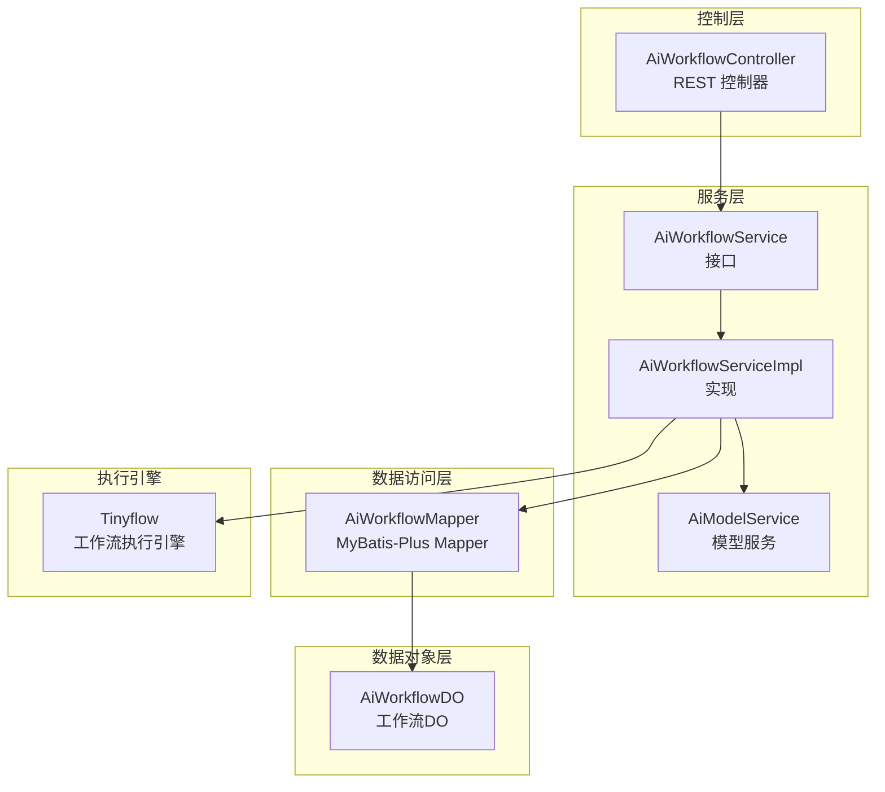
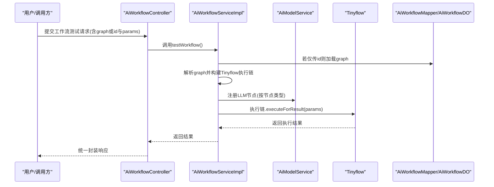
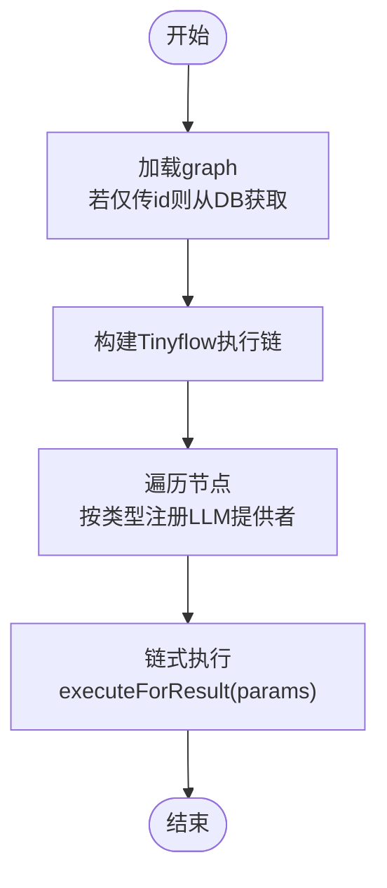
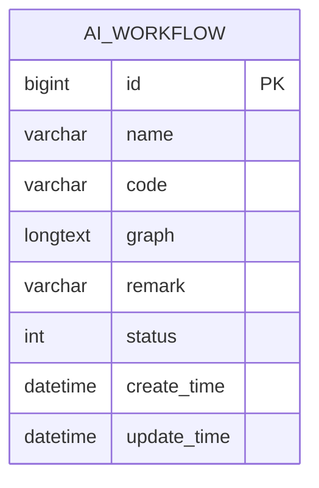
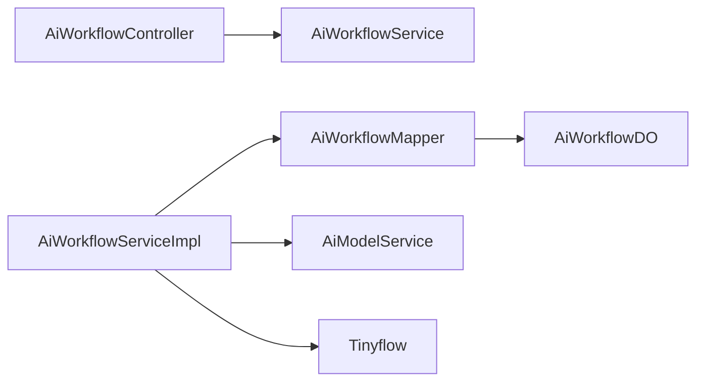

# Vibe Coding工作流

<cite>
**本文引用的文件**
- [AiWorkflowController.java](file://backend/qiji-module-ai/src/main/java/com/qiji/cps/module/ai/controller/admin/workflow/AiWorkflowController.java)
- [AiWorkflowService.java](file://backend/qiji-module-ai/src/main/java/com/qiji/cps/module/ai/service/workflow/AiWorkflowService.java)
- [AiWorkflowServiceImpl.java](file://backend/qiji-module-ai/src/main/java/com/qiji/cps/module/ai/service/workflow/AiWorkflowServiceImpl.java)
- [AiWorkflowDO.java](file://backend/qiji-module-ai/src/main/java/com/qiji/cps/module/ai/dal/dataobject/workflow/AiWorkflowDO.java)
- [AiWorkflowMapper.java](file://backend/qiji-module-ai/src/main/java/com/qiji/cps/module/ai/dal/mysql/workflow/AiWorkflowMapper.java)
- [AiWorkflowSaveReqVO.java](file://backend/qiji-module-ai/src/main/java/com/qiji/cps/module/ai/controller/admin/workflow/vo/AiWorkflowSaveReqVO.java)
- [AiWorkflowTestReqVO.java](file://backend/qiji-module-ai/src/main/java/com/qiji/cps/module/ai/controller/admin/workflow/vo/AiWorkflowTestReqVO.java)
- [AiModelService.java](file://backend/qiji-module-ai/src/main/java/com/qiji/cps/module/ai/service/model/AiModelService.java)
- [Tinyflow.java](file://backend/qiji-module-ai/src/main/java/com/qiji/cps/module/ai/service/workflow/AiWorkflowServiceImpl.java)
</cite>

## 目录
1. [引言](#引言)
2. [项目结构](#项目结构)
3. [核心组件](#核心组件)
4. [架构总览](#架构总览)
5. [详细组件分析](#详细组件分析)
6. [依赖分析](#依赖分析)
7. [性能考虑](#性能考虑)
8. [故障排查指南](#故障排查指南)
9. [结论](#结论)
10. [附录](#附录)

## 引言
本技术文档围绕“Vibe Coding工作流”展开，系统性阐述从自然语言需求到代码生成的完整流程，覆盖需求解析、方案设计生成、AI编码执行、质量检查等阶段；并详细说明工作流的状态管理、并发处理机制（多用户会话、任务队列、资源分配）、以及配置与使用方法（需求模板、执行参数、结果处理）。本文以后端AI工作流模块为核心，结合控制器、服务层、数据对象与持久化层，给出清晰的架构图与流程图，并在每个涉及具体实现的章节提供“章节来源”。

## 项目结构
Vibe Coding工作流位于后端模块“qiji-module-ai”的“workflow”子域中，采用典型的分层架构：
- 控制器层：对外暴露REST API，负责请求参数校验与响应封装
- 服务层：编排业务逻辑，解析工作流图并驱动Tinyflow执行
- 数据访问层：基于MyBatis-Plus进行工作流配置的增删改查
- 数据对象层：持久化工作流元数据（名称、标识、状态、模型JSON）
- 模型服务：对接大模型提供方，向Tinyflow注册LLM节点

图表来源
- [AiWorkflowController.java:1-78](file://backend/qiji-module-ai/src/main/java/com/qiji/cps/module/ai/controller/admin/workflow/AiWorkflowController.java#L1-L78)
- [AiWorkflowService.java:1-63](file://backend/qiji-module-ai/src/main/java/com/qiji/cps/module/ai/service/workflow/AiWorkflowService.java#L1-L63)
- [AiWorkflowServiceImpl.java:1-145](file://backend/qiji-module-ai/src/main/java/com/qiji/cps/module/ai/service/workflow/AiWorkflowServiceImpl.java#L1-L145)
- [AiWorkflowMapper.java:1-31](file://backend/qiji-module-ai/src/main/java/com/qiji/cps/module/ai/dal/mysql/workflow/AiWorkflowMapper.java#L1-L31)
- [AiWorkflowDO.java:1-52](file://backend/qiji-module-ai/src/main/java/com/qiji/cps/module/ai/dal/dataobject/workflow/AiWorkflowDO.java#L1-L52)

章节来源
- [AiWorkflowController.java:1-78](file://backend/qiji-module-ai/src/main/java/com/qiji/cps/module/ai/controller/admin/workflow/AiWorkflowController.java#L1-L78)
- [AiWorkflowService.java:1-63](file://backend/qiji-module-ai/src/main/java/com/qiji/cps/module/ai/service/workflow/AiWorkflowService.java#L1-L63)
- [AiWorkflowServiceImpl.java:1-145](file://backend/qiji-module-ai/src/main/java/com/qiji/cps/module/ai/service/workflow/AiWorkflowServiceImpl.java#L1-L145)
- [AiWorkflowMapper.java:1-31](file://backend/qiji-module-ai/src/main/java/com/qiji/cps/module/ai/dal/mysql/workflow/AiWorkflowMapper.java#L1-L31)
- [AiWorkflowDO.java:1-52](file://backend/qiji-module-ai/src/main/java/com/qiji/cps/module/ai/dal/dataobject/workflow/AiWorkflowDO.java#L1-L52)

## 核心组件
- 控制器：提供创建工作流、更新、删除、查询、分页、测试等接口，统一返回CommonResult包装
- 服务接口与实现：负责工作流配置的CRUD、唯一性校验、工作流测试执行
- 数据对象与映射：持久化工作流元数据与模型JSON
- 执行引擎：Tinyflow解析graph并按节点类型注册LLM提供者，支持链式执行
- 模型服务：向Tinyflow注入LLM节点，桥接外部大模型能力

章节来源
- [AiWorkflowController.java:29-75](file://backend/qiji-module-ai/src/main/java/com/qiji/cps/module/ai/controller/admin/workflow/AiWorkflowController.java#L29-L75)
- [AiWorkflowService.java:15-62](file://backend/qiji-module-ai/src/main/java/com/qiji/cps/module/ai/service/workflow/AiWorkflowService.java#L15-L62)
- [AiWorkflowServiceImpl.java:41-142](file://backend/qiji-module-ai/src/main/java/com/qiji/cps/module/ai/service/workflow/AiWorkflowServiceImpl.java#L41-L142)
- [AiWorkflowDO.java:18-51](file://backend/qiji-module-ai/src/main/java/com/qiji/cps/module/ai/dal/dataobject/workflow/AiWorkflowDO.java#L18-L51)
- [AiWorkflowMapper.java:18-28](file://backend/qiji-module-ai/src/main/java/com/qiji/cps/module/ai/dal/mysql/workflow/AiWorkflowMapper.java#L18-L28)

## 架构总览
下图展示了从“自然语言需求”到“代码生成结果”的端到端流程，涵盖需求接收、解析、方案生成、AI编码执行、质量检查与结果输出。

图表来源
- [AiWorkflowController.java:70-75](file://backend/qiji-module-ai/src/main/java/com/qiji/cps/module/ai/controller/admin/workflow/AiWorkflowController.java#L70-L75)
- [AiWorkflowServiceImpl.java:109-121](file://backend/qiji-module-ai/src/main/java/com/qiji/cps/module/ai/service/workflow/AiWorkflowServiceImpl.java#L109-L121)
- [AiWorkflowServiceImpl.java:123-142](file://backend/qiji-module-ai/src/main/java/com/qiji/cps/module/ai/service/workflow/AiWorkflowServiceImpl.java#L123-L142)
- [AiWorkflowMapper.java:18-20](file://backend/qiji-module-ai/src/main/java/com/qiji/cps/module/ai/dal/mysql/workflow/AiWorkflowMapper.java#L18-L20)

## 详细组件分析

### 控制器层：AiWorkflowController
- 职责：暴露REST接口，完成权限校验、参数校验、结果封装
- 关键接口：
  - 创建：POST /ai/workflow/create
  - 更新：PUT /ai/workflow/update
  - 删除：DELETE /ai/workflow/delete?id=...
  - 查询：GET /ai/workflow/get?id=...
  - 分页：GET /ai/workflow/page
  - 测试：POST /ai/workflow/test

章节来源
- [AiWorkflowController.java:29-75](file://backend/qiji-module-ai/src/main/java/com/qiji/cps/module/ai/controller/admin/workflow/AiWorkflowController.java#L29-L75)

### 服务层：AiWorkflowService与AiWorkflowServiceImpl
- 服务接口：定义工作流CRUD与测试方法
- 服务实现：
  - 唯一性校验：code唯一、记录存在性校验
  - 测试执行：加载graph、构建Tinyflow、注册LLM节点、链式执行、返回结果
  - 图解析：遍历节点，按类型注册LLM提供者

图表来源
- [AiWorkflowServiceImpl.java:109-121](file://backend/qiji-module-ai/src/main/java/com/qiji/cps/module/ai/service/workflow/AiWorkflowServiceImpl.java#L109-L121)
- [AiWorkflowServiceImpl.java:123-142](file://backend/qiji-module-ai/src/main/java/com/qiji/cps/module/ai/service/workflow/AiWorkflowServiceImpl.java#L123-L142)

章节来源
- [AiWorkflowService.java:15-62](file://backend/qiji-module-ai/src/main/java/com/qiji/cps/module/ai/service/workflow/AiWorkflowService.java#L15-L62)
- [AiWorkflowServiceImpl.java:41-97](file://backend/qiji-module-ai/src/main/java/com/qiji/cps/module/ai/service/workflow/AiWorkflowServiceImpl.java#L41-L97)
- [AiWorkflowServiceImpl.java:109-142](file://backend/qiji-module-ai/src/main/java/com/qiji/cps/module/ai/service/workflow/AiWorkflowServiceImpl.java#L109-L142)

### 数据访问层：AiWorkflowMapper与AiWorkflowDO
- Mapper：提供按code查询、分页查询（支持状态、名称、标识、时间范围）
- DO：持久化字段包含id、name、code、graph、remark、status等

图表来源
- [AiWorkflowDO.java:18-51](file://backend/qiji-module-ai/src/main/java/com/qiji/cps/module/ai/dal/dataobject/workflow/AiWorkflowDO.java#L18-L51)
- [AiWorkflowMapper.java:18-28](file://backend/qiji-module-ai/src/main/java/com/qiji/cps/module/ai/dal/mysql/workflow/AiWorkflowMapper.java#L18-L28)

章节来源
- [AiWorkflowDO.java:18-51](file://backend/qiji-module-ai/src/main/java/com/qiji/cps/module/ai/dal/dataobject/workflow/AiWorkflowDO.java#L18-L51)
- [AiWorkflowMapper.java:18-28](file://backend/qiji-module-ai/src/main/java/com/qiji/cps/module/ai/dal/mysql/workflow/AiWorkflowMapper.java#L18-L28)

### 请求值对象：AiWorkflowSaveReqVO与AiWorkflowTestReqVO
- SaveReqVO：用于创建/更新工作流，包含code、name、graph、status等
- TestReqVO：用于测试工作流，支持传入id或graph，以及执行参数params；二者必有其一

章节来源
- [AiWorkflowSaveReqVO.java:10-34](file://backend/qiji-module-ai/src/main/java/com/qiji/cps/module/ai/controller/admin/workflow/vo/AiWorkflowSaveReqVO.java#L10-L34)
- [AiWorkflowTestReqVO.java:12-28](file://backend/qiji-module-ai/src/main/java/com/qiji/cps/module/ai/controller/admin/workflow/vo/AiWorkflowTestReqVO.java#L12-L28)

### 执行引擎与模型集成：Tinyflow与AiModelService
- Tinyflow：接收graph字符串构造执行链，按节点类型注册LLM提供者
- AiModelService：向Tinyflow注入LLM节点，桥接大模型能力

章节来源
- [AiWorkflowServiceImpl.java:123-142](file://backend/qiji-module-ai/src/main/java/com/qiji/cps/module/ai/service/workflow/AiWorkflowServiceImpl.java#L123-L142)
- [AiModelService.java](file://backend/qiji-module-ai/src/main/java/com/qiji/cps/module/ai/service/model/AiModelService.java)

## 依赖分析
- 控制器依赖服务接口
- 服务实现依赖Mapper与模型服务
- Mapper依赖DO
- 执行链依赖Tinyflow与模型服务

图表来源
- [AiWorkflowController.java:26-27](file://backend/qiji-module-ai/src/main/java/com/qiji/cps/module/ai/controller/admin/workflow/AiWorkflowController.java#L26-L27)
- [AiWorkflowServiceImpl.java:35-39](file://backend/qiji-module-ai/src/main/java/com/qiji/cps/module/ai/service/workflow/AiWorkflowServiceImpl.java#L35-L39)
- [AiWorkflowMapper.java:15](file://backend/qiji-module-ai/src/main/java/com/qiji/cps/module/ai/dal/mysql/workflow/AiWorkflowMapper.java#L15)
- [AiWorkflowDO.java:18-51](file://backend/qiji-module-ai/src/main/java/com/qiji/cps/module/ai/dal/dataobject/workflow/AiWorkflowDO.java#L18-L51)

章节来源
- [AiWorkflowController.java:26-27](file://backend/qiji-module-ai/src/main/java/com/qiji/cps/module/ai/controller/admin/workflow/AiWorkflowController.java#L26-L27)
- [AiWorkflowServiceImpl.java:35-39](file://backend/qiji-module-ai/src/main/java/com/qiji/cps/module/ai/service/workflow/AiWorkflowServiceImpl.java#L35-L39)
- [AiWorkflowMapper.java:15](file://backend/qiji-module-ai/src/main/java/com/qiji/cps/module/ai/dal/mysql/workflow/AiWorkflowMapper.java#L15)
- [AiWorkflowDO.java:18-51](file://backend/qiji-module-ai/src/main/java/com/qiji/cps/module/ai/dal/dataobject/workflow/AiWorkflowDO.java#L18-L51)

## 性能考虑
- 图解析复杂度：节点数量N，注册LLM提供者为O(N)，建议控制节点规模与层级深度
- 执行链开销：Tinyflow链式执行受节点间依赖影响，建议合理拆分任务与缓存中间结果
- 并发与资源：服务层未显式声明并发控制，建议在高并发场景引入任务队列与限流策略，避免瞬时峰值导致资源争用
- I/O优化：Mapper分页查询支持多条件过滤，建议结合索引与分页参数优化查询性能

## 故障排查指南
- 工作流不存在：当传入id但数据库未命中时抛出异常，需确认id正确性与数据一致性
- 标识重复：code唯一性校验失败时抛出异常，需调整code或清理冲突记录
- 图与参数校验：测试请求要求id或graph至少一个，否则校验失败
- 执行异常：Tinyflow执行失败时检查graph结构与节点类型是否匹配

章节来源
- [AiWorkflowServiceImpl.java:72-97](file://backend/qiji-module-ai/src/main/java/com/qiji/cps/module/ai/service/workflow/AiWorkflowServiceImpl.java#L72-L97)
- [AiWorkflowTestReqVO.java:23-26](file://backend/qiji-module-ai/src/main/java/com/qiji/cps/module/ai/controller/admin/workflow/vo/AiWorkflowTestReqVO.java#L23-L26)

## 结论
Vibe Coding工作流以Tinyflow为核心执行引擎，结合AiModelService与AiWorkflowService，实现了从工作流配置到链式执行的闭环。通过清晰的分层架构与统一的请求/响应封装，系统具备良好的扩展性与可维护性。建议在生产环境中进一步完善并发控制、任务队列与资源隔离策略，以支撑多用户、高并发场景下的稳定运行。

## 附录

### 工作流状态管理
- 状态字段：AiWorkflowDO.status对应通用状态枚举，可用于启用/停用工作流
- 生命周期：创建—启用—测试—更新—停用/删除
- 建议：在控制器与服务层增加状态变更校验与审计日志

章节来源
- [AiWorkflowDO.java:48-49](file://backend/qiji-module-ai/src/main/java/com/qiji/cps/module/ai/dal/dataobject/workflow/AiWorkflowDO.java#L48-L49)

### 并发处理机制
- 当前实现：服务层未显式声明线程安全或并发控制
- 建议：
  - 使用任务队列异步执行测试请求
  - 引入限流与熔断，防止瞬时高峰
  - 对graph解析与Tinyflow执行进行超时控制与重试策略

### 配置与使用示例（路径指引）
- 创建工作流
  - 接口：POST /ai/workflow/create
  - 请求体：AiWorkflowSaveReqVO
  - 参考路径：[AiWorkflowController.java:32](file://backend/qiji-module-ai/src/main/java/com/qiji/cps/module/ai/controller/admin/workflow/AiWorkflowController.java#L32), [AiWorkflowSaveReqVO.java:10-34](file://backend/qiji-module-ai/src/main/java/com/qiji/cps/module/ai/controller/admin/workflow/vo/AiWorkflowSaveReqVO.java#L10-L34)
- 更新工作流
  - 接口：PUT /ai/workflow/update
  - 请求体：AiWorkflowSaveReqVO
  - 参考路径：[AiWorkflowController.java:39](file://backend/qiji-module-ai/src/main/java/com/qiji/cps/module/ai/controller/admin/workflow/AiWorkflowController.java#L39), [AiWorkflowSaveReqVO.java:10-34](file://backend/qiji-module-ai/src/main/java/com/qiji/cps/module/ai/controller/admin/workflow/vo/AiWorkflowSaveReqVO.java#L10-L34)
- 删除工作流
  - 接口：DELETE /ai/workflow/delete?id=...
  - 参考路径：[AiWorkflowController.java:48](file://backend/qiji-module-ai/src/main/java/com/qiji/cps/module/ai/controller/admin/workflow/AiWorkflowController.java#L48)
- 查询与分页
  - 接口：GET /ai/workflow/get?id=... 与 GET /ai/workflow/page
  - 参考路径：[AiWorkflowController.java:57-67](file://backend/qiji-module-ai/src/main/java/com/qiji/cps/module/ai/controller/admin/workflow/AiWorkflowController.java#L57-L67)
- 测试工作流
  - 接口：POST /ai/workflow/test
  - 请求体：AiWorkflowTestReqVO（id或graph二选一，params为执行参数）
  - 参考路径：[AiWorkflowController.java:74](file://backend/qiji-module-ai/src/main/java/com/qiji/cps/module/ai/controller/admin/workflow/AiWorkflowController.java#L74), [AiWorkflowTestReqVO.java:12-28](file://backend/qiji-module-ai/src/main/java/com/qiji/cps/module/ai/controller/admin/workflow/vo/AiWorkflowTestReqVO.java#L12-L28)
- 工作流图结构
  - graph字段为JSON，nodes数组中包含节点类型（如llmNode），参考解析逻辑
  - 参考路径：[AiWorkflowServiceImpl.java:123-142](file://backend/qiji-module-ai/src/main/java/com/qiji/cps/module/ai/service/workflow/AiWorkflowServiceImpl.java#L123-L142)