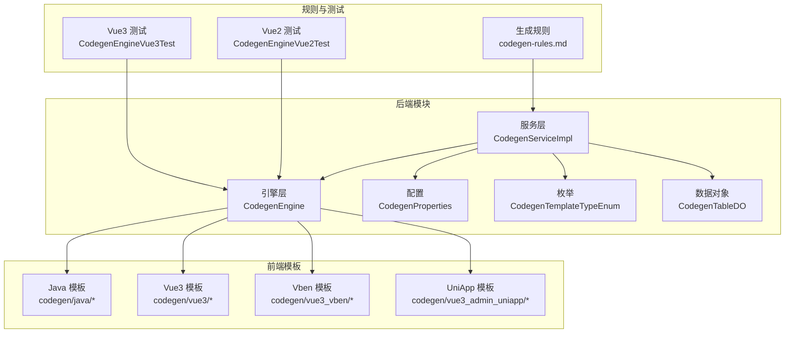
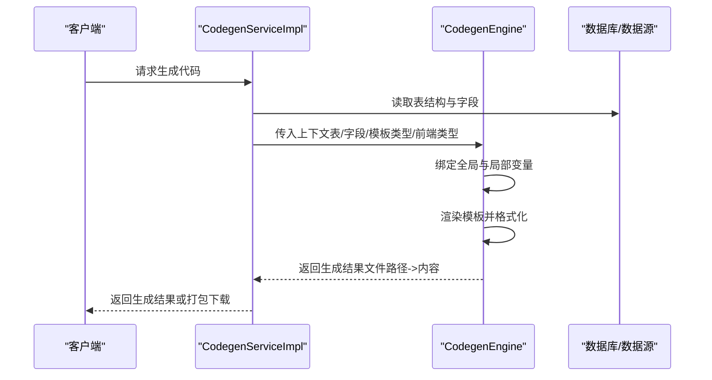
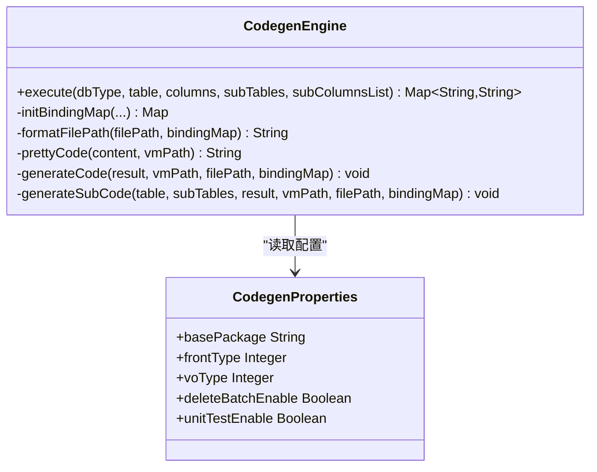
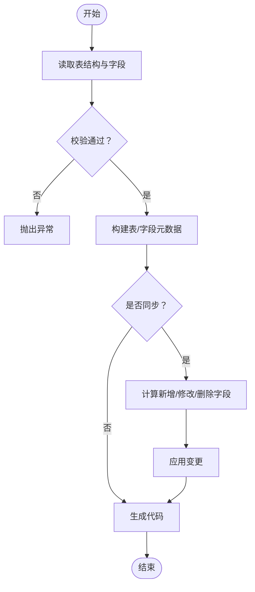
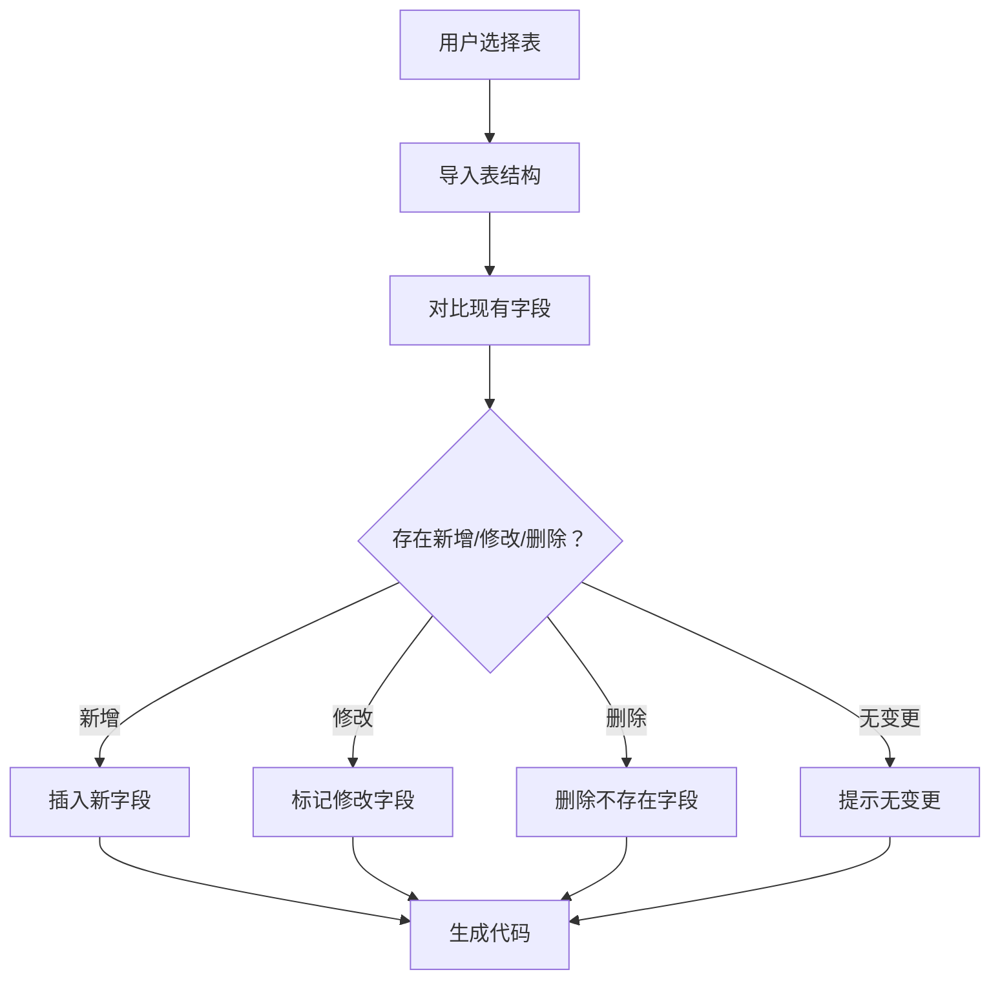
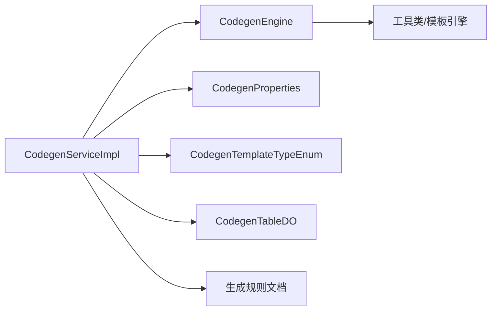

# 代码生成系统

<cite>
**本文引用的文件**
- [CodegenEngine.java](file://backend/qiji-module-infra/src/main/java/com/qiji/cps/module/infra/service/codegen/inner/CodegenEngine.java)
- [CodegenServiceImpl.java](file://backend/qiji-module-infra/src/main/java/com/qiji/cps/module/infra/service/codegen/CodegenServiceImpl.java)
- [CodegenProperties.java](file://backend/qiji-module-infra/src/main/java/com/qiji/cps/module/infra/framework/codegen/config/CodegenProperties.java)
- [CodegenTemplateTypeEnum.java](file://backend/qiji-module-infra/src/main/java/com/qiji/cps/module/infra/enums/codegen/CodegenTemplateTypeEnum.java)
- [CodegenTableDO.java](file://backend/qiji-module-infra/src/main/java/com/qiji/cps/module/infra/dal/dataobject/codegen/CodegenTableDO.java)
- [codegen-rules.md](file://agent_improvement/memory/codegen-rules.md)
- [CodegenEngineVue2Test.java](file://backend/qiji-module-infra/src/test/java/com/qiji/cps/module/infra/service/codegen/inner/CodegenEngineVue2Test.java)
- [CodegenEngineVue3Test.java](file://backend/qiji-module-infra/src/test/java/com/qiji/cps/module/infra/service/codegen/inner/CodegenEngineVue3Test.java)
- [CollectionUtils.java](file://backend/qiji-framework/qiji-common/src/main/java/com/qiji/cps/framework/common/util/collection/CollectionUtils.java)
</cite>

## 目录
1. [简介](#简介)
2. [项目结构](#项目结构)
3. [核心组件](#核心组件)
4. [架构总览](#架构总览)
5. [详细组件分析](#详细组件分析)
6. [依赖关系分析](#依赖关系分析)
7. [性能考量](#性能考量)
8. [故障排查指南](#故障排查指南)
9. [结论](#结论)
10. [附录](#附录)

## 简介
本项目提供一套完整的代码生成系统，覆盖后端 Java 代码与前端多套 UI 模板（Vue2、Vue3 Element Plus、Vben、UniApp 等）。系统通过模板引擎渲染、上下文绑定、路径格式化与代码美化等机制，实现从数据库表结构到前后端完整业务代码的自动化生成。同时支持批量生成、增量同步、主子表与树表等复杂场景，并内置质量控制与命名规范约束。

## 项目结构
- 后端核心位于 qiji-module-infra 模块，包含代码生成服务、引擎、属性配置与数据模型。
- 前端模板位于资源目录 codegen 下，按 UI 框架与语言分类组织。
- 生成规则与命名规范集中在 agent_improvement/memory 目录下的规则文档。

**图表来源**
- [CodegenServiceImpl.java:47-311](file://backend/qiji-module-infra/src/main/java/com/qiji/cps/module/infra/service/codegen/CodegenServiceImpl.java#L47-L311)
- [CodegenEngine.java:60-680](file://backend/qiji-module-infra/src/main/java/com/qiji/cps/module/infra/service/codegen/inner/CodegenEngine.java#L60-L680)
- [CodegenProperties.java:13-59](file://backend/qiji-module-infra/src/main/java/com/qiji/cps/module/infra/framework/codegen/config/CodegenProperties.java#L13-L59)
- [CodegenTemplateTypeEnum.java:14-53](file://backend/qiji-module-infra/src/main/java/com/qiji/cps/module/infra/enums/codegen/CodegenTemplateTypeEnum.java#L14-L53)
- [CodegenTableDO.java:20-42](file://backend/qiji-module-infra/src/main/java/com/qiji/cps/module/infra/dal/dataobject/codegen/CodegenTableDO.java#L20-L42)
- [codegen-rules.md:1-788](file://agent_improvement/memory/codegen-rules.md#L1-L788)

**章节来源**
- [CodegenServiceImpl.java:47-311](file://backend/qiji-module-infra/src/main/java/com/qiji/cps/module/infra/service/codegen/CodegenServiceImpl.java#L47-L311)
- [CodegenEngine.java:60-680](file://backend/qiji-module-infra/src/main/java/com/qiji/cps/module/infra/service/codegen/inner/CodegenEngine.java#L60-L680)
- [CodegenProperties.java:13-59](file://backend/qiji-module-infra/src/main/java/com/qiji/cps/module/infra/framework/codegen/config/CodegenProperties.java#L13-L59)
- [CodegenTemplateTypeEnum.java:14-53](file://backend/qiji-module-infra/src/main/java/com/qiji/cps/module/infra/enums/codegen/CodegenTemplateTypeEnum.java#L14-L53)
- [CodegenTableDO.java:20-42](file://backend/qiji-module-infra/src/main/java/com/qiji/cps/module/infra/dal/dataobject/codegen/CodegenTableDO.java#L20-L42)
- [codegen-rules.md:1-788](file://agent_improvement/memory/codegen-rules.md#L1-L788)

## 核心组件
- 代码生成引擎（CodegenEngine）：负责模板装载、上下文绑定、路径格式化、代码生成与美化。
- 代码生成服务（CodegenServiceImpl）：负责表结构导入、字段同步、主子表与树表处理、调用引擎执行生成。
- 配置（CodegenProperties）：基础包、前端类型、VO 类型、是否生成批量删除、是否生成单元测试等全局开关。
- 枚举（CodegenTemplateTypeEnum）：模板类型（单表、树表、主子表不同模式）。
- 数据对象（CodegenTableDO）：表与字段元数据持久化载体。
- 规则文档（codegen-rules.md）：生成产物的层级结构、命名约定、Java/前端模板变量与 HTML 映射等。

**章节来源**
- [CodegenEngine.java:60-680](file://backend/qiji-module-infra/src/main/java/com/qiji/cps/module/infra/service/codegen/inner/CodegenEngine.java#L60-L680)
- [CodegenServiceImpl.java:47-311](file://backend/qiji-module-infra/src/main/java/com/qiji/cps/module/infra/service/codegen/CodegenServiceImpl.java#L47-L311)
- [CodegenProperties.java:13-59](file://backend/qiji-module-infra/src/main/java/com/qiji/cps/module/infra/framework/codegen/config/CodegenProperties.java#L13-L59)
- [CodegenTemplateTypeEnum.java:14-53](file://backend/qiji-module-infra/src/main/java/com/qiji/cps/module/infra/enums/codegen/CodegenTemplateTypeEnum.java#L14-L53)
- [CodegenTableDO.java:20-42](file://backend/qiji-module-infra/src/main/java/com/qiji/cps/module/infra/dal/dataobject/codegen/CodegenTableDO.java#L20-L42)
- [codegen-rules.md:1-788](file://agent_improvement/memory/codegen-rules.md#L1-L788)

## 架构总览
系统采用“服务层 + 引擎层 + 模板资源”的分层设计。服务层负责数据准备与业务规则校验，引擎层负责模板渲染与产物格式化，模板资源按 UI 框架与语言分类存放。

**图表来源**
- [CodegenServiceImpl.java:260-298](file://backend/qiji-module-infra/src/main/java/com/qiji/cps/module/infra/service/codegen/CodegenServiceImpl.java#L260-L298)
- [CodegenEngine.java:321-351](file://backend/qiji-module-infra/src/main/java/com/qiji/cps/module/infra/service/codegen/inner/CodegenEngine.java#L321-L351)

## 详细组件分析

### 代码生成引擎（CodegenEngine）
- 模板配置：维护后端与前端模板映射表，支持多 UI 框架与多前端类型。
- 上下文绑定：初始化全局变量（基础包、Jakarta/Javax 兼容、VO 类型、工具类等），并根据表/字段/模板类型动态注入变量。
- 路径格式化：将模板中的占位符替换为实际包路径与文件路径。
- 代码美化：对前端模板进行逗号、字典、日期格式化等清理，保证生成代码风格一致。
- 主子表与树表：针对不同模板类型进行分支处理，避免冗余生成。

**图表来源**
- [CodegenEngine.java:60-680](file://backend/qiji-module-infra/src/main/java/com/qiji/cps/module/infra/service/codegen/inner/CodegenEngine.java#L60-L680)
- [CodegenProperties.java:13-59](file://backend/qiji-module-infra/src/main/java/com/qiji/cps/module/infra/framework/codegen/config/CodegenProperties.java#L13-L59)

**章节来源**
- [CodegenEngine.java:69-232](file://backend/qiji-module-infra/src/main/java/com/qiji/cps/module/infra/service/codegen/inner/CodegenEngine.java#L69-L232)
- [CodegenEngine.java:277-310](file://backend/qiji-module-infra/src/main/java/com/qiji/cps/module/infra/service/codegen/inner/CodegenEngine.java#L277-L310)
- [CodegenEngine.java:430-518](file://backend/qiji-module-infra/src/main/java/com/qiji/cps/module/infra/service/codegen/inner/CodegenEngine.java#L430-L518)
- [CodegenEngine.java:545-575](file://backend/qiji-module-infra/src/main/java/com/qiji/cps/module/infra/service/codegen/inner/CodegenEngine.java#L545-L575)

### 代码生成服务（CodegenServiceImpl）
- 表导入与校验：从数据源读取表结构，校验注释与字段完整性，构建表与字段元数据。
- 字段同步：计算新增、修改、删除字段，仅同步变更，避免全量重建。
- 主子表与树表：识别模板类型，加载子表与其字段，确保关联字段存在。
- 生成调用：根据数据源类型（DbType）调用引擎生成代码。

**图表来源**
- [CodegenServiceImpl.java:77-127](file://backend/qiji-module-infra/src/main/java/com/qiji/cps/module/infra/service/codegen/CodegenServiceImpl.java#L77-L127)
- [CodegenServiceImpl.java:169-215](file://backend/qiji-module-infra/src/main/java/com/qiji/cps/module/infra/service/codegen/CodegenServiceImpl.java#L169-L215)
- [CodegenServiceImpl.java:260-298](file://backend/qiji-module-infra/src/main/java/com/qiji/cps/module/infra/service/codegen/CodegenServiceImpl.java#L260-L298)

**章节来源**
- [CodegenServiceImpl.java:68-153](file://backend/qiji-module-infra/src/main/java/com/qiji/cps/module/infra/service/codegen/CodegenServiceImpl.java#L68-L153)
- [CodegenServiceImpl.java:155-215](file://backend/qiji-module-infra/src/main/java/com/qiji/cps/module/infra/service/codegen/CodegenServiceImpl.java#L155-L215)
- [CodegenServiceImpl.java:260-298](file://backend/qiji-module-infra/src/main/java/com/qiji/cps/module/infra/service/codegen/CodegenServiceImpl.java#L260-L298)

### 配置与定制（CodegenProperties）
- 基础包：生成代码的基础包名。
- 前端类型：默认前端模板类型（Vue2/Element UI、Vue3/Element Plus、Vben、UniApp 等）。
- VO 类型：生成 VO 还是 DO 作为请求/响应体。
- 批量删除：是否生成批量删除接口。
- 单元测试：是否生成单元测试与 H2 SQL。

**章节来源**
- [CodegenProperties.java:13-59](file://backend/qiji-module-infra/src/main/java/com/qiji/cps/module/infra/framework/codegen/config/CodegenProperties.java#L13-L59)

### 模板类型与规则（CodegenTemplateTypeEnum、codegen-rules.md）
- 模板类型：单表（增删改查）、树表（列表+父子校验）、主子表（普通/ERP/内嵌）。
- 生成规则：层级结构、命名约定、DO/Mapper/Service/Controller/VO 规范、前端模板变量与 HTML 映射。

**章节来源**
- [CodegenTemplateTypeEnum.java:14-53](file://backend/qiji-module-infra/src/main/java/com/qiji/cps/module/infra/enums/codegen/CodegenTemplateTypeEnum.java#L14-L53)
- [codegen-rules.md:1-788](file://agent_improvement/memory/codegen-rules.md#L1-L788)

### 质量控制与命名规范
- 语法检查：模板渲染后对前端代码进行逗号、字典、日期格式等清理，减少格式校验失败。
- 逻辑验证：服务层对表/字段注释、主键、模板类型与关联字段进行严格校验。
- 性能优化：仅同步变更字段，避免全量重建；模板映射表有序，生成顺序稳定。
- 安全审计：生成规则文档明确权限前缀、错误码常量等安全相关约定。

**章节来源**
- [CodegenEngine.java:401-428](file://backend/qiji-module-infra/src/main/java/com/qiji/cps/module/infra/service/codegen/inner/CodegenEngine.java#L401-L428)
- [CodegenServiceImpl.java:111-127](file://backend/qiji-module-infra/src/main/java/com/qiji/cps/module/infra/service/codegen/CodegenServiceImpl.java#L111-L127)
- [codegen-rules.md:315-325](file://agent_improvement/memory/codegen-rules.md#L315-L325)

### 批量生成与增量更新
- 批量生成：服务层遍历表名逐一导入并生成，适合小批量快速迭代。
- 增量更新：字段同步阶段计算新增、修改、删除字段，仅对变更部分进行数据库操作。
- 冲突处理：若字段元数据发生变化（如主键、可空、注释、顺序），标记为需修改并重新插入。
- 版本管理：通过模板映射与路径格式化，生成产物可直接纳入版本控制。

**图表来源**
- [CodegenServiceImpl.java:169-215](file://backend/qiji-module-infra/src/main/java/com/qiji/cps/module/infra/service/codegen/CodegenServiceImpl.java#L169-L215)

**章节来源**
- [CodegenServiceImpl.java:169-215](file://backend/qiji-module-infra/src/main/java/com/qiji/cps/module/infra/service/codegen/CodegenServiceImpl.java#L169-L215)

### 代码示例（使用方法）
以下示例展示如何使用生成器进行规则配置、模板开发与批量生成流程（以路径代替具体代码）：

- 规则配置
  - 在配置类中设置基础包、前端类型、VO 类型、是否生成批量删除与单元测试。
  - 参考路径：[CodegenProperties.java:13-59](file://backend/qiji-module-infra/src/main/java/com/qiji/cps/module/infra/framework/codegen/config/CodegenProperties.java#L13-L59)

- 模板开发
  - 后端模板位于资源目录：[codegen/java/*](file://backend/qiji-module-infra/src/main/resources/codecgen/java/)
  - 前端模板位于资源目录：
    - Vue3：[codegen/vue3/*](file://backend/qiji-module-infra/src/main/resources/codecgen/vue3/)
    - Vben：[codegen/vue3_vben/*](file://backend/qiji-module-infra/src/main/resources/codecgen/vue3_vben/)
    - UniApp：[codegen/vue3_admin_uniapp/*](file://backend/qiji-module-infra/src/main/resources/codecgen/vue3_admin_uniapp/)

- 批量生成流程
  - 服务层导入多个表并逐个生成：[CodegenServiceImpl.java:68-75](file://backend/qiji-module-infra/src/main/java/com/qiji/cps/module/infra/service/codegen/CodegenServiceImpl.java#L68-L75)
  - 引擎执行生成与路径格式化：[CodegenEngine.java:321-351](file://backend/qiji-module-infra/src/main/java/com/qiji/cps/module/infra/service/codegen/inner/CodegenEngine.java#L321-L351)

- 单元测试
  - Vue2/Element UI 单元测试：[CodegenEngineVue2Test.java:20-39](file://backend/qiji-module-infra/src/test/java/com/qiji/cps/module/infra/service/codegen/inner/CodegenEngineVue2Test.java#L20-L39)
  - Vue3/Element Plus 单元测试：[CodegenEngineVue3Test.java:20-39](file://backend/qiji-module-infra/src/test/java/com/qiji/cps/module/infra/service/codegen/inner/CodegenEngineVue3Test.java#L20-L39)

**章节来源**
- [CodegenProperties.java:13-59](file://backend/qiji-module-infra/src/main/java/com/qiji/cps/module/infra/framework/codegen/config/CodegenProperties.java#L13-L59)
- [CodegenServiceImpl.java:68-75](file://backend/qiji-module-infra/src/main/java/com/qiji/cps/module/infra/service/codegen/CodegenServiceImpl.java#L68-L75)
- [CodegenEngine.java:321-351](file://backend/qiji-module-infra/src/main/java/com/qiji/cps/module/infra/service/codegen/inner/CodegenEngine.java#L321-L351)
- [CodegenEngineVue2Test.java:20-39](file://backend/qiji-module-infra/src/test/java/com/qiji/cps/module/infra/service/codegen/inner/CodegenEngineVue2Test.java#L20-L39)
- [CodegenEngineVue3Test.java:20-39](file://backend/qiji-module-infra/src/test/java/com/qiji/cps/module/infra/service/codegen/inner/CodegenEngineVue3Test.java#L20-L39)

## 依赖关系分析
- 服务层依赖引擎层与配置类，同时依赖数据库服务与数据访问层。
- 引擎层依赖模板引擎与工具类，负责模板装载与代码美化。
- 枚举与数据对象为服务层与引擎层提供类型与数据支撑。
- 规则文档为生成产物提供约束与一致性保障。

**图表来源**
- [CodegenServiceImpl.java:47-311](file://backend/qiji-module-infra/src/main/java/com/qiji/cps/module/infra/service/codegen/CodegenServiceImpl.java#L47-L311)
- [CodegenEngine.java:60-680](file://backend/qiji-module-infra/src/main/java/com/qiji/cps/module/infra/service/codegen/inner/CodegenEngine.java#L60-L680)
- [CodegenProperties.java:13-59](file://backend/qiji-module-infra/src/main/java/com/qiji/cps/module/infra/framework/codegen/config/CodegenProperties.java#L13-L59)
- [CodegenTemplateTypeEnum.java:14-53](file://backend/qiji-module-infra/src/main/java/com/qiji/cps/module/infra/enums/codegen/CodegenTemplateTypeEnum.java#L14-L53)
- [CodegenTableDO.java:20-42](file://backend/qiji-module-infra/src/main/java/com/qiji/cps/module/infra/dal/dataobject/codegen/CodegenTableDO.java#L20-L42)
- [codegen-rules.md:1-788](file://agent_improvement/memory/codegen-rules.md#L1-L788)

**章节来源**
- [CodegenServiceImpl.java:47-311](file://backend/qiji-module-infra/src/main/java/com/qiji/cps/module/infra/service/codegen/CodegenServiceImpl.java#L47-L311)
- [CodegenEngine.java:60-680](file://backend/qiji-module-infra/src/main/java/com/qiji/cps/module/infra/service/codegen/inner/CodegenEngine.java#L60-L680)

## 性能考量
- 模板渲染：使用 Velocity 引擎，模板路径与变量绑定经过优化，避免重复计算。
- 字段同步：仅对变更字段进行插入/删除，降低数据库压力。
- 生成顺序：模板映射表有序，生成产物顺序稳定，便于版本控制与对比。
- 代码美化：前端模板一次性清理，减少后续格式化开销。

[本节为通用指导，无需特定文件引用]

## 故障排查指南
- 表/字段注释缺失：服务层在导入时会校验表与字段注释，缺失将抛出异常。
- 主键缺失：若表无主键，将默认将第一个字段设为主键。
- 模板类型不匹配：主子表模板仅在相应模板类型下生成，避免冗余。
- 前端格式问题：引擎会对生成的前端代码进行逗号、字典、日期格式清理，若仍有格式问题，检查模板变量是否正确。
- 单元测试与 H2 SQL：可通过配置关闭生成，以减少构建时间。

**章节来源**
- [CodegenServiceImpl.java:111-127](file://backend/qiji-module-infra/src/main/java/com/qiji/cps/module/infra/service/codegen/CodegenServiceImpl.java#L111-L127)
- [CodegenEngine.java:401-428](file://backend/qiji-module-infra/src/main/java/com/qiji/cps/module/infra/service/codegen/inner/CodegenEngine.java#L401-L428)
- [CodegenProperties.java:52-58](file://backend/qiji-module-infra/src/main/java/com/qiji/cps/module/infra/framework/codegen/config/CodegenProperties.java#L52-L58)

## 结论
该代码生成系统通过清晰的分层设计、完善的模板体系与严格的校验机制，实现了从数据库表结构到前后端完整业务代码的高效生成。系统支持多种前端 UI 框架、主子表与树表等复杂场景，并提供批量生成与增量同步能力。结合规则文档与质量控制策略，能够有效提升代码一致性与开发效率。

[本节为总结性内容，无需特定文件引用]

## 附录
- 主子表批量操作差异计算：使用集合工具类对旧列表与新列表进行差异拆分，分别执行插入、更新、删除。
  - 参考路径：[CollectionUtils.java:235-265](file://backend/qiji-framework/qiji-common/src/main/java/com/qiji/cps/framework/common/util/collection/CollectionUtils.java#L235-L265)
  - 示例参考：[Demo03StudentNormalServiceImpl.java:127-158](file://backend/qiji-module-infra/src/main/java/com/qiji/cps/module/infra/service/demo/demo03/normal/Demo03StudentNormalServiceImpl.java#L127-L158)

**章节来源**
- [CollectionUtils.java:235-265](file://backend/qiji-framework/qiji-common/src/main/java/com/qiji/cps/framework/common/util/collection/CollectionUtils.java#L235-L265)
- [Demo03StudentNormalServiceImpl.java:127-158](file://backend/qiji-module-infra/src/main/java/com/qiji/cps/module/infra/service/demo/demo03/normal/Demo03StudentNormalServiceImpl.java#L127-L158)