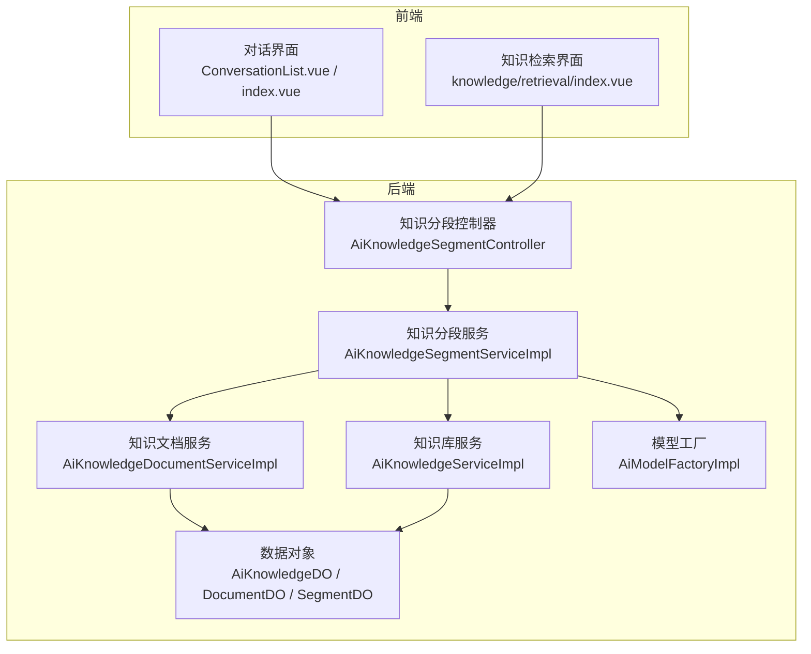
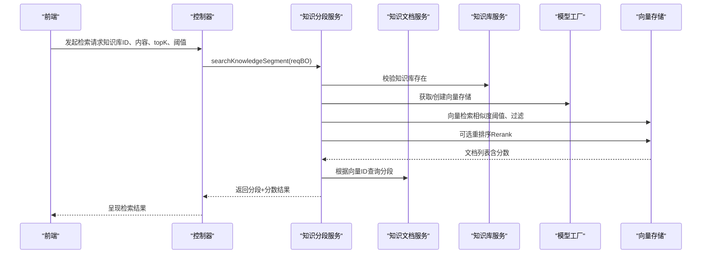
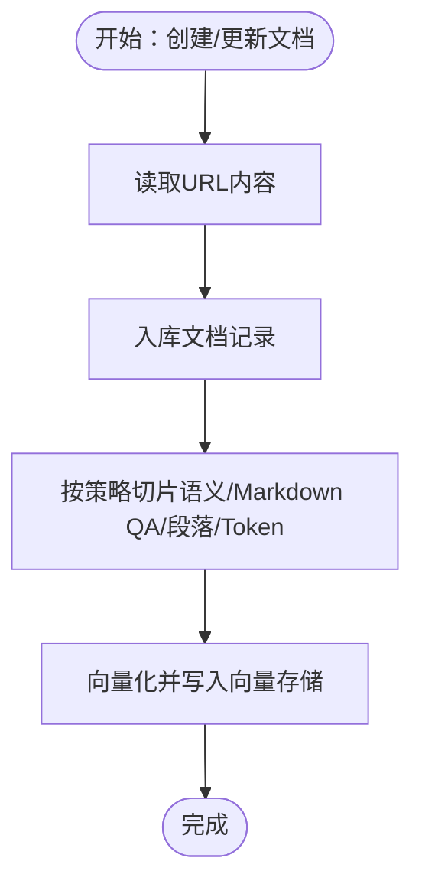
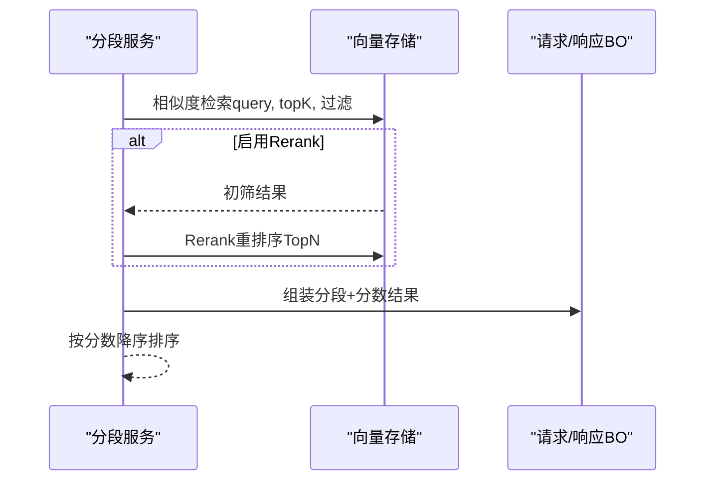
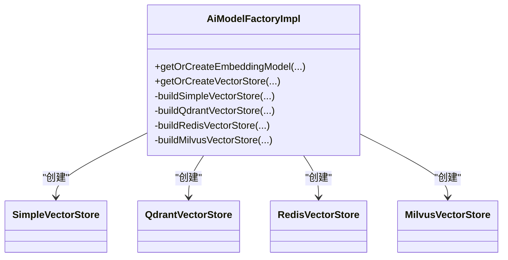
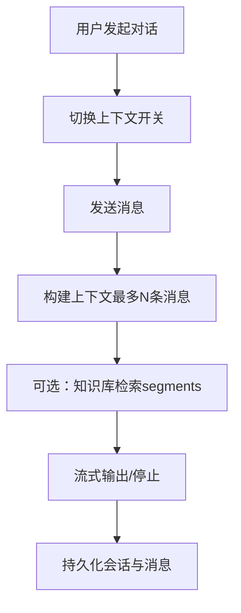
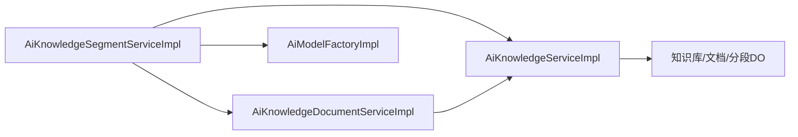

# 记忆与知识系统

<cite>
**本文引用的文件**
- [AiKnowledgeSegmentServiceImpl.java](file://backend/qiji-module-ai/src/main/java/com/qiji/cps/module/ai/service/knowledge/AiKnowledgeSegmentServiceImpl.java)
- [AiKnowledgeDocumentServiceImpl.java](file://backend/qiji-module-ai/src/main/java/com/qiji/cps/module/ai/service/knowledge/AiKnowledgeDocumentServiceImpl.java)
- [AiKnowledgeServiceImpl.java](file://backend/qiji-module-ai/src/main/java/com/qiji/cps/module/ai/service/knowledge/AiKnowledgeServiceImpl.java)
- [AiKnowledgeDO.java](file://backend/qiji-module-ai/src/main/java/com/qiji/cps/module/ai/dal/dataobject/knowledge/AiKnowledgeDO.java)
- [AiKnowledgeDocumentDO.java](file://backend/qiji-module-ai/src/main/java/com/qiji/cps/module/ai/dal/dataobject/knowledge/AiKnowledgeDocumentDO.java)
- [AiKnowledgeSegmentDO.java](file://backend/qiji-module-ai/src/main/java/com/qiji/cps/module/ai/dal/dataobject/knowledge/AiKnowledgeSegmentDO.java)
- [AiModelFactoryImpl.java](file://backend/qiji-module-ai/src/main/java/com/qiji/cps/module/ai/framework/ai/core/model/AiModelFactoryImpl.java)
- [AiKnowledgeSegmentSearchReqBO.java](file://backend/qiji-module-ai/src/main/java/com/qiji/cps/module/ai/service/knowledge/bo/AiKnowledgeSegmentSearchReqBO.java)
- [AiKnowledgeSegmentSearchRespBO.java](file://backend/qiji-module-ai/src/main/java/com/qiji/cps/module/ai/service/knowledge/bo/AiKnowledgeSegmentSearchRespBO.java)
- [AiKnowledgeSegmentController.java](file://backend/qiji-module-ai/src/main/java/com/qiji/cps/module/ai/controller/admin/knowledge/AiKnowledgeSegmentController.java)
- [AiKnowledgeSegmentSaveReqVO.java](file://backend/qiji-module-ai/src/main/java/com/qiji/cps/module/ai/controller/admin/knowledge/vo/segment/AiKnowledgeSegmentSaveReqVO.java)
- [AiKnowledgeSegmentSearchRespVO.java](file://backend/qiji-module-ai/src/main/java/com/qiji/cps/module/ai/controller/admin/knowledge/vo/segment/AiKnowledgeSegmentSearchRespVO.java)
- [AiChatMessageRespVO.java](file://backend/qiji-module-ai/src/main/java/com/qiji/cps/module/ai/controller/admin/chat/vo/message/AiChatMessageRespVO.java)
- [AiChatConversationUpdateMyReqVO.java](file://backend/qiji-module-ai/src/main/java/com/qiji/cps/module/ai/controller/admin/chat/vo/conversation/AiChatConversationUpdateMyReqVO.java)
- [ConversationList.vue](file://frontend/admin-vue3/src/views/ai/chat/index/components/conversation/ConversationList.vue)
- [index.vue](file://frontend/admin-vue3/src/views/ai/chat/index/index.vue)
- [index.vue](file://frontend/admin-vue3/src/views/ai/knowledge/knowledge/retrieval/index.vue)
- [MEMORY.md](file://agent_improvement/memory/MEMORY.md)
- [codegen-rules.md](file://agent_improvement/memory/codegen-rules.md)
</cite>

## 目录
1. [简介](#简介)
2. [项目结构](#项目结构)
3. [核心组件](#核心组件)
4. [架构总览](#架构总览)
5. [详细组件分析](#详细组件分析)
6. [依赖关系分析](#依赖关系分析)
7. [性能考量](#性能考量)
8. [故障排查指南](#故障排查指南)
9. [结论](#结论)
10. [附录](#附录)

## 简介
本技术文档围绕“记忆与知识系统”的设计与实现，系统性阐述以下方面：
- AI记忆系统的架构设计：短期记忆管理、长期知识存储、上下文维护机制
- 知识库的组织与管理：知识分类、索引建立、检索算法、更新策略
- 记忆的持久化与恢复：数据序列化、存储优化、加载性能、一致性保证
- 上下文窗口管理与对话历史维护：长度控制、重要性排序、压缩算法、丢失保护
- 使用示例：知识添加、查询检索、上下文构建、会话恢复

## 项目结构
本项目采用前后端分离架构，AI相关能力集中在后端模块 qiji-module-ai 中，前端通过 Vue3 提供交互界面。知识与记忆相关的核心代码位于：
- 后端知识库与检索：service、controller、dal
- 向量存储与模型工厂：framework/ai/core/model
- 前端对话与知识检索界面：frontend/admin-vue3

图表来源
- [AiKnowledgeSegmentServiceImpl.java:49-496](file://backend/qiji-module-ai/src/main/java/com/qiji/cps/module/ai/service/knowledge/AiKnowledgeSegmentServiceImpl.java#L49-L496)
- [AiKnowledgeDocumentServiceImpl.java:36-226](file://backend/qiji-module-ai/src/main/java/com/qiji/cps/module/ai/service/knowledge/AiKnowledgeDocumentServiceImpl.java#L36-L226)
- [AiKnowledgeServiceImpl.java:22-109](file://backend/qiji-module-ai/src/main/java/com/qiji/cps/module/ai/service/knowledge/AiKnowledgeServiceImpl.java#L22-L109)
- [AiKnowledgeSegmentController.java:1-27](file://backend/qiji-module-ai/src/main/java/com/qiji/cps/module/ai/controller/admin/knowledge/AiKnowledgeSegmentController.java#L1-L27)
- [AiModelFactoryImpl.java:320-845](file://backend/qiji-module-ai/src/main/java/com/qiji/cps/module/ai/framework/ai/core/model/AiModelFactoryImpl.java#L320-L845)

章节来源
- [AiKnowledgeSegmentServiceImpl.java:49-496](file://backend/qiji-module-ai/src/main/java/com/qiji/cps/module/ai/service/knowledge/AiKnowledgeSegmentServiceImpl.java#L49-L496)
- [AiKnowledgeDocumentServiceImpl.java:36-226](file://backend/qiji-module-ai/src/main/java/com/qiji/cps/module/ai/service/knowledge/AiKnowledgeDocumentServiceImpl.java#L36-L226)
- [AiKnowledgeServiceImpl.java:22-109](file://backend/qiji-module-ai/src/main/java/com/qiji/cps/module/ai/service/knowledge/AiKnowledgeServiceImpl.java#L22-L109)
- [AiKnowledgeSegmentController.java:1-27](file://backend/qiji-module-ai/src/main/java/com/qiji/cps/module/ai/controller/admin/knowledge/AiKnowledgeSegmentController.java#L1-L27)
- [AiModelFactoryImpl.java:320-845](file://backend/qiji-module-ai/src/main/java/com/qiji/cps/module/ai/framework/ai/core/model/AiModelFactoryImpl.java#L320-L845)

## 核心组件
- 知识库（AiKnowledgeDO）：描述知识库的基本信息、嵌入模型、topK、相似度阈值、状态等
- 文档（AiKnowledgeDocumentDO）：描述知识库下的文档，包含内容、长度、tokens、分片最大tokens、召回次数、状态
- 分段（AiKnowledgeSegmentDO）：文档切片后的最小检索单元，包含内容、长度、向量ID、tokens、召回次数、状态
- 知识分段服务（AiKnowledgeSegmentServiceImpl）：负责文档切片、向量化、检索、重索引、状态变更
- 知识文档服务（AiKnowledgeDocumentServiceImpl）：负责文档下载、入库、批量导入、状态变更触发的切片重建
- 知识库服务（AiKnowledgeServiceImpl）：负责知识库创建、更新、删除，以及模型变更触发的重索引
- 模型工厂（AiModelFactoryImpl）：统一创建 EmbeddingModel 与 VectorStore，支持 Simple/Qdrant/Redis/Milvus 等
- 控制器（AiKnowledgeSegmentController）：对外暴露知识检索、分段管理等接口
- 前端界面：对话界面与知识检索界面，支持上下文开关、检索参数配置、会话历史管理

章节来源
- [AiKnowledgeDO.java:1-64](file://backend/qiji-module-ai/src/main/java/com/qiji/cps/module/ai/dal/dataobject/knowledge/AiKnowledgeDO.java#L1-L64)
- [AiKnowledgeDocumentDO.java:1-69](file://backend/qiji-module-ai/src/main/java/com/qiji/cps/module/ai/dal/dataobject/knowledge/AiKnowledgeDocumentDO.java#L1-L69)
- [AiKnowledgeSegmentDO.java:1-72](file://backend/qiji-module-ai/src/main/java/com/qiji/cps/module/ai/dal/dataobject/knowledge/AiKnowledgeSegmentDO.java#L1-L72)
- [AiKnowledgeSegmentServiceImpl.java:49-496](file://backend/qiji-module-ai/src/main/java/com/qiji/cps/module/ai/service/knowledge/AiKnowledgeSegmentServiceImpl.java#L49-L496)
- [AiKnowledgeDocumentServiceImpl.java:36-226](file://backend/qiji-module-ai/src/main/java/com/qiji/cps/module/ai/service/knowledge/AiKnowledgeDocumentServiceImpl.java#L36-L226)
- [AiKnowledgeServiceImpl.java:22-109](file://backend/qiji-module-ai/src/main/java/com/qiji/cps/module/ai/service/knowledge/AiKnowledgeServiceImpl.java#L22-L109)
- [AiModelFactoryImpl.java:320-845](file://backend/qiji-module-ai/src/main/java/com/qiji/cps/module/ai/framework/ai/core/model/AiModelFactoryImpl.java#L320-L845)
- [AiKnowledgeSegmentController.java:1-27](file://backend/qiji-module-ai/src/main/java/com/qiji/cps/module/ai/controller/admin/knowledge/AiKnowledgeSegmentController.java#L1-L27)

## 架构总览
系统以“知识库-文档-分段”三层结构组织知识，通过向量检索与可选重排序（Rerank）实现高效检索；同时提供上下文窗口与会话历史管理，保障对话连贯性与性能。

图表来源
- [AiKnowledgeSegmentServiceImpl.java:227-295](file://backend/qiji-module-ai/src/main/java/com/qiji/cps/module/ai/service/knowledge/AiKnowledgeSegmentServiceImpl.java#L227-L295)
- [AiKnowledgeSegmentController.java:1-27](file://backend/qiji-module-ai/src/main/java/com/qiji/cps/module/ai/controller/admin/knowledge/AiKnowledgeSegmentController.java#L1-L27)
- [AiModelFactoryImpl.java:316-335](file://backend/qiji-module-ai/src/main/java/com/qiji/cps/module/ai/framework/ai/core/model/AiModelFactoryImpl.java#L316-L335)

## 详细组件分析

### 知识库与文档管理
- 知识库（AiKnowledgeDO）：包含嵌入模型ID/名称、topK、相似度阈值、状态等，作为检索参数的默认值来源
- 文档（AiKnowledgeDocumentDO）：记录原始内容、长度、tokens、分片最大tokens、召回次数、状态
- 文档服务（AiKnowledgeDocumentServiceImpl）：
  - 支持单文档与批量导入，异步执行切片与向量化
  - 状态变更触发切片重建或删除
  - URL读取与内容解析，异常处理完善

图表来源
- [AiKnowledgeDocumentServiceImpl.java:58-101](file://backend/qiji-module-ai/src/main/java/com/qiji/cps/module/ai/service/knowledge/AiKnowledgeDocumentServiceImpl.java#L58-L101)
- [AiKnowledgeSegmentServiceImpl.java:95-123](file://backend/qiji-module-ai/src/main/java/com/qiji/cps/module/ai/service/knowledge/AiKnowledgeSegmentServiceImpl.java#L95-L123)

章节来源
- [AiKnowledgeDO.java:1-64](file://backend/qiji-module-ai/src/main/java/com/qiji/cps/module/ai/dal/dataobject/knowledge/AiKnowledgeDO.java#L1-L64)
- [AiKnowledgeDocumentDO.java:1-69](file://backend/qiji-module-ai/src/main/java/com/qiji/cps/module/ai/dal/dataobject/knowledge/AiKnowledgeDocumentDO.java#L1-L69)
- [AiKnowledgeDocumentServiceImpl.java:36-226](file://backend/qiji-module-ai/src/main/java/com/qiji/cps/module/ai/service/knowledge/AiKnowledgeDocumentServiceImpl.java#L36-L226)

### 知识分段与检索
- 分段（AiKnowledgeSegmentDO）：最小检索单元，包含内容、长度、tokens、向量ID、召回次数、状态
- 分段服务（AiKnowledgeSegmentServiceImpl）：
  - 检索流程：向量检索 + 可选重排序（Rerank）+ 结果排序
  - 切片策略：自动检测（Markdown QA/Markdown/语义/Token），按最大tokens切分
  - 状态与索引：启用/禁用状态与向量存储同步，支持按知识库重索引
  - 召回计数：命中后递增，便于后续统计与优化

图表来源
- [AiKnowledgeSegmentServiceImpl.java:268-295](file://backend/qiji-module-ai/src/main/java/com/qiji/cps/module/ai/service/knowledge/AiKnowledgeSegmentServiceImpl.java#L268-L295)
- [AiKnowledgeSegmentSearchReqBO.java:1-39](file://backend/qiji-module-ai/src/main/java/com/qiji/cps/module/ai/service/knowledge/bo/AiKnowledgeSegmentSearchReqBO.java#L1-L39)
- [AiKnowledgeSegmentSearchRespBO.java:1-45](file://backend/qiji-module-ai/src/main/java/com/qiji/cps/module/ai/service/knowledge/bo/AiKnowledgeSegmentSearchRespBO.java#L1-L45)

章节来源
- [AiKnowledgeSegmentDO.java:1-72](file://backend/qiji-module-ai/src/main/java/com/qiji/cps/module/ai/dal/dataobject/knowledge/AiKnowledgeSegmentDO.java#L1-L72)
- [AiKnowledgeSegmentServiceImpl.java:49-496](file://backend/qiji-module-ai/src/main/java/com/qiji/cps/module/ai/service/knowledge/AiKnowledgeSegmentServiceImpl.java#L49-L496)
- [AiKnowledgeSegmentSearchReqBO.java:1-39](file://backend/qiji-module-ai/src/main/java/com/qiji/cps/module/ai/service/knowledge/bo/AiKnowledgeSegmentSearchReqBO.java#L1-L39)
- [AiKnowledgeSegmentSearchRespBO.java:1-45](file://backend/qiji-module-ai/src/main/java/com/qiji/cps/module/ai/service/knowledge/bo/AiKnowledgeSegmentSearchRespBO.java#L1-L45)

### 向量存储与模型工厂
- 模型工厂（AiModelFactoryImpl）：
  - 统一创建 EmbeddingModel 与 VectorStore
  - 支持 Simple/Qdrant/Redis/Milvus 等多种实现
  - SimpleVectorStore：本地JSON文件持久化，定时与关闭时保存
  - Qdrant/Redis/Milvus：初始化索引，支持元数据字段配置

图表来源
- [AiModelFactoryImpl.java:316-802](file://backend/qiji-module-ai/src/main/java/com/qiji/cps/module/ai/framework/ai/core/model/AiModelFactoryImpl.java#L316-L802)

章节来源
- [AiModelFactoryImpl.java:320-845](file://backend/qiji-module-ai/src/main/java/com/qiji/cps/module/ai/framework/ai/core/model/AiModelFactoryImpl.java#L320-L845)

### 上下文窗口与对话历史
- 前端对话界面：
  - 支持上下文开关、联网搜索开关
  - 会话列表按时间分组（置顶/今天/一天前/三天前/七天前/三十天前）
  - 消息列表支持 systemMessage 展示与滚动到底部
- 控制器响应体（AiChatMessageRespVO）：
  - 支持 useContext、segments、webSearchPages、attachmentUrls 等字段
- 会话参数（AiChatConversationUpdateMyReqVO）：
  - 包含模型、知识库、systemMessage、温度、maxTokens、maxContexts 等

图表来源
- [index.vue:86-115](file://frontend/admin-vue3/src/views/ai/chat/index/index.vue#L86-L115)
- [ConversationList.vue:231-272](file://frontend/admin-vue3/src/views/ai/chat/index/components/conversation/ConversationList.vue#L231-L272)
- [AiChatMessageRespVO.java:34-66](file://backend/qiji-module-ai/src/main/java/com/qiji/cps/module/ai/controller/admin/chat/vo/message/AiChatMessageRespVO.java#L34-L66)
- [AiChatConversationUpdateMyReqVO.java:1-39](file://backend/qiji-module-ai/src/main/java/com/qiji/cps/module/ai/controller/admin/chat/vo/conversation/AiChatConversationUpdateMyReqVO.java#L1-L39)

章节来源
- [index.vue:261-630](file://frontend/admin-vue3/src/views/ai/chat/index/index.vue#L261-L630)
- [ConversationList.vue:1-290](file://frontend/admin-vue3/src/views/ai/chat/index/components/conversation/ConversationList.vue#L1-L290)
- [AiChatMessageRespVO.java:34-66](file://backend/qiji-module-ai/src/main/java/com/qiji/cps/module/ai/controller/admin/chat/vo/message/AiChatMessageRespVO.java#L34-L66)
- [AiChatConversationUpdateMyReqVO.java:1-39](file://backend/qiji-module-ai/src/main/java/com/qiji/cps/module/ai/controller/admin/chat/vo/conversation/AiChatConversationUpdateMyReqVO.java#L1-L39)

### 知识检索界面与使用示例
- 前端检索界面（knowledge/retrieval/index.vue）：
  - 输入知识库ID、查询内容、topK、相似度阈值
  - 调用后端检索接口，展示召回段落与文档名称
- 控制器与BO：
  - AiKnowledgeSegmentController 暴露检索接口
  - AiKnowledgeSegmentSearchReqBO/AiKnowledgeSegmentSearchRespBO 规范请求/响应

章节来源
- [index.vue:68-163](file://frontend/admin-vue3/src/views/ai/knowledge/knowledge/retrieval/index.vue#L68-L163)
- [AiKnowledgeSegmentController.java:1-27](file://backend/qiji-module-ai/src/main/java/com/qiji/cps/module/ai/controller/admin/knowledge/AiKnowledgeSegmentController.java#L1-L27)
- [AiKnowledgeSegmentSearchReqBO.java:1-39](file://backend/qiji-module-ai/src/main/java/com/qiji/cps/module/ai/service/knowledge/bo/AiKnowledgeSegmentSearchReqBO.java#L1-L39)
- [AiKnowledgeSegmentSearchRespBO.java:1-45](file://backend/qiji-module-ai/src/main/java/com/qiji/cps/module/ai/service/knowledge/bo/AiKnowledgeSegmentSearchRespBO.java#L1-L45)

## 依赖关系分析
- 服务层依赖：
  - AiKnowledgeSegmentServiceImpl 依赖 AiKnowledgeService、AiKnowledgeDocumentService、AiModelService、TokenCountEstimator、RerankModel
  - AiKnowledgeDocumentServiceImpl 依赖 AiKnowledgeService、AiKnowledgeSegmentService、TokenCountEstimator
  - AiKnowledgeServiceImpl 依赖 AiKnowledgeMapper、AiModelService、AiKnowledgeSegmentService、AiKnowledgeDocumentService
- 数据层依赖：
  - DO 之间通过外键关联（知识库-文档-分段）
- 模型与向量存储：
  - 通过 AiModelFactoryImpl 统一创建与缓存 EmbeddingModel 与 VectorStore

图表来源
- [AiKnowledgeSegmentServiceImpl.java:72-87](file://backend/qiji-module-ai/src/main/java/com/qiji/cps/module/ai/service/knowledge/AiKnowledgeSegmentServiceImpl.java#L72-L87)
- [AiKnowledgeDocumentServiceImpl.java:48-55](file://backend/qiji-module-ai/src/main/java/com/qiji/cps/module/ai/service/knowledge/AiKnowledgeDocumentServiceImpl.java#L48-L55)
- [AiKnowledgeServiceImpl.java:31-40](file://backend/qiji-module-ai/src/main/java/com/qiji/cps/module/ai/service/knowledge/AiKnowledgeServiceImpl.java#L31-L40)
- [AiModelFactoryImpl.java:316-335](file://backend/qiji-module-ai/src/main/java/com/qiji/cps/module/ai/framework/ai/core/model/AiModelFactoryImpl.java#L316-L335)

章节来源
- [AiKnowledgeSegmentServiceImpl.java:72-87](file://backend/qiji-module-ai/src/main/java/com/qiji/cps/module/ai/service/knowledge/AiKnowledgeSegmentServiceImpl.java#L72-L87)
- [AiKnowledgeDocumentServiceImpl.java:48-55](file://backend/qiji-module-ai/src/main/java/com/qiji/cps/module/ai/service/knowledge/AiKnowledgeDocumentServiceImpl.java#L48-L55)
- [AiKnowledgeServiceImpl.java:31-40](file://backend/qiji-module-ai/src/main/java/com/qiji/cps/module/ai/service/knowledge/AiKnowledgeServiceImpl.java#L31-L40)
- [AiModelFactoryImpl.java:316-335](file://backend/qiji-module-ai/src/main/java/com/qiji/cps/module/ai/framework/ai/core/model/AiModelFactoryImpl.java#L316-L335)

## 性能考量
- 向量检索与重排序：
  - 检索阶段先扩大 topK（RERANK_RETRIEVAL_FACTOR）再重排序，提高召回质量
  - 相似度阈值在重排序阶段生效，减少无效结果
- 切片策略：
  - 自动检测文档格式（Markdown QA/Markdown/语义/Token），按最大tokens切分，兼顾语义与性能
- 向量存储：
  - SimpleVectorStore 本地JSON文件，定时持久化与关闭时保存，适合开发/测试
  - 生产推荐 Qdrant/Milvus 等，具备更好的索引与查询性能
- Token估算：
  - 使用 TokenCountEstimator 估算内容长度，避免超长分段导致的向量化失败

章节来源
- [AiKnowledgeSegmentServiceImpl.java:68-70](file://backend/qiji-module-ai/src/main/java/com/qiji/cps/module/ai/service/knowledge/AiKnowledgeSegmentServiceImpl.java#L68-L70)
- [AiKnowledgeSegmentServiceImpl.java:268-295](file://backend/qiji-module-ai/src/main/java/com/qiji/cps/module/ai/service/knowledge/AiKnowledgeSegmentServiceImpl.java#L268-L295)
- [AiModelFactoryImpl.java:685-711](file://backend/qiji-module-ai/src/main/java/com/qiji/cps/module/ai/framework/ai/core/model/AiModelFactoryImpl.java#L685-L711)

## 故障排查指南
- 文档读取失败：
  - URL下载异常、空内容、解析失败均抛出明确异常，需检查网络与URL有效性
- 分段内容过长：
  - 超过分片最大tokens将拒绝入库，需调整 segmentMaxTokens 或优化内容
- 向量存储异常：
  - SimpleVectorStore 文件损坏或权限问题，可清理后重启自动重建
- 检索无结果：
  - 检查知识库状态、模型ID、topK、相似度阈值、是否启用Rerank
- 会话历史异常：
  - 检查会话参数（maxContexts、maxTokens、temperature）与前端开关（上下文/联网搜索）

章节来源
- [AiKnowledgeDocumentServiceImpl.java:173-196](file://backend/qiji-module-ai/src/main/java/com/qiji/cps/module/ai/service/knowledge/AiKnowledgeDocumentServiceImpl.java#L173-L196)
- [AiKnowledgeSegmentServiceImpl.java:465-468](file://backend/qiji-module-ai/src/main/java/com/qiji/cps/module/ai/service/knowledge/AiKnowledgeSegmentServiceImpl.java#L465-L468)
- [AiModelFactoryImpl.java:685-711](file://backend/qiji-module-ai/src/main/java/com/qiji/cps/module/ai/framework/ai/core/model/AiModelFactoryImpl.java#L685-L711)

## 结论
本记忆与知识系统以“知识库-文档-分段”为核心，结合向量检索与可选重排序，实现了高可用的知识组织与检索能力；通过上下文窗口与会话历史管理，保障了对话的连贯性与性能。生产环境建议采用 Qdrant/Milvus 等向量存储，配合合理的切片策略与阈值配置，以获得最佳检索质量与吞吐表现。

## 附录
- 记忆与知识系统文档索引：MEMORY.md
- 代码生成规则：codegen-rules.md

章节来源
- [MEMORY.md:1-21](file://agent_improvement/memory/MEMORY.md#L1-L21)
- [codegen-rules.md:1-788](file://agent_improvement/memory/codegen-rules.md#L1-L788)