# CPS联盟返利系统

<cite>
**本文档引用的文件**
- [CpsPlatformClientFactory.java](file://backend/qiji-module-cps/qiji-module-cps-biz/src/main/java/com/qiji/cps/module/cps/client/CpsPlatformClientFactory.java)
- [CpsPlatformClient.java](file://backend/qiji-module-cps/qiji-module-cps-biz/src/main/java/com/qiji/cps/module/cps/client/CpsPlatformClient.java)
- [CpsApiVendorClient.java](file://backend/qiji-module-cps/qiji-module-cps-biz/src/main/java/com/qiji/cps/module/cps/client/CpsApiVendorClient.java)
- [CpsGoodsService.java](file://backend/qiji-module-cps/qiji-module-cps-biz/src/main/java/com/qiji/cps/module/cps/service/goods/CpsGoodsService.java)
- [CpsGoodsServiceImpl.java](file://backend/qiji-module-cps/qiji-module-cps-biz/src/main/java/com/qiji/cps/module/cps/service/goods/CpsGoodsServiceImpl.java)
- [CpsComparePricesToolFunction.java](file://backend/qiji-module-cps/qiji-module-cps-biz/src/main/java/com/qiji/cps/module/cps/mcp/tool/CpsComparePricesToolFunction.java)
- [CpsOrderService.java](file://backend/qiji-module-cps/qiji-module-cps-biz/src/main/java/com/qiji/cps/module/cps/service/order/CpsOrderService.java)
- [AppTradeOrderController.java](file://backend/qiji-module-mall/qiji-module-trade/src/main/java/com/qiji/cps/module/trade/controller/app/order/AppTradeOrderController.java)
- [AppOrderExpressTrackRespDTO.java](file://backend/qiji-module-mall/qiji-module-trade/src/main/java/com/qiji/cps/module/trade/controller/app/order/vo/AppOrderExpressTrackRespDTO.java)
- [TradeStatusSyncToWxaOrderHandler.java](file://backend/qiji-module-mall/qiji-module-trade/src/main/java/com/qiji/cps/module/trade/service/order/handler/TradeStatusSyncToWxaOrderHandler.java)
- [CpsRebateSettleService.java](file://backend/qiji-module-cps/qiji-module-cps-biz/src/main/java/com/qiji/cps/module/cps/service/rebate/CpsRebateSettleService.java)
- [CpsRebateSettleServiceImpl.java](file://backend/qiji-module-cps/qiji-module-cps-biz/src/main/java/com/qiji/cps/module/cps/service/rebate/CpsRebateSettleServiceImpl.java)
- [CpsRebateConfigService.java](file://backend/qiji-module-cps/qiji-module-cps-biz/src/main/java/com/qiji/cps/module/cps/service/rebate/CpsRebateConfigService.java)
- [CpsWithdrawService.java](file://backend/qiji-module-cps/qiji-module-cps-biz/src/main/java/com/qiji/cps/module/cps/service/withdraw/CpsWithdrawService.java)
- [CpsRiskService.java](file://backend/qiji-module-cps/qiji-module-cps-biz/src/main/java/com/qiji/cps/module/cps/service/risk/CpsRiskService.java)
- [CpsRiskRuleController.java](file://backend/qiji-module-cps/qiji-module-cps-biz/src/main/java/com/qiji/cps/module/cps/controller/admin/risk/CpsRiskRuleController.java)
- [CpsRiskRuleRespVO.java](file://backend/qiji-module-cps/qiji-module-cps-biz/src/main/java/com/qiji/cps/module/cps/controller/admin/risk/vo/CpsRiskRuleRespVO.java)
- [CpsRiskRulePageReqVO.java](file://backend/qiji-module-cps/qiji-module-cps-biz/src/main/java/com/qiji/cps/module/cps/controller/admin/risk/vo/CpsRiskRulePageReqVO.java)
- [CpsGetRebateSummaryToolFunction.java](file://backend/qiji-module-cps/qiji-module-cps-biz/src/main/java/com/qiji/cps/module/cps/mcp/tool/CpsGetRebateSummaryToolFunction.java)
- [CpsRebateRecordRespVO.java](file://backend/qiji-module-cps/qiji-module-cps-biz/src/main/java/com/qiji/cps/module/cps/controller/admin/rebate/vo/CpsRebateRecordRespVO.java)
- [withdraw.vue](file://frontend/mall-uniapp/pages/commission/withdraw.vue)
- [withdraw.ts](file://frontend/admin-vue3/src/api/cps/withdraw.ts)
- [AppBrokerageWithdrawRespVO.java](file://backend/qiji-module-mall/qiji-module-trade/src/main/java/com/qiji/cps/module/trade/controller/app/brokerage/vo/withdraw/AppBrokerageWithdrawRespVO.java)
- [CPS系统PRD文档.md](file://docs/CPS系统PRD文档.md)
- [CpsAdzoneTypeEnum.java](file://backend/qiji-module-cps/qiji-module-cps-api/src/main/java/com/qiji/cps/module/cps/enums/CpsAdzoneTypeEnum.java)
- [CpsAdzoneSaveReqVO.java](file://backend/qiji-module-cps/qiji-module-cps-biz/src/main/java/com/qiji/cps/module/cps/controller/admin/adzone/vo/CpsAdzoneSaveReqVO.java)
- [CpsAdzoneService.java](file://backend/qiji-module-cps/qiji-module-cps-biz/src/main/java/com/qiji/cps/module/cps/service/adzone/CpsAdzoneService.java)
- [CpsAdzoneServiceImpl.java](file://backend/qiji-module-cps/qiji-module-cps-biz/src/main/java/com/qiji/cps/module/cps/service/adzone/CpsAdzoneServiceImpl.java)
- [CpsAdzoneController.java](file://backend/qiji-module-cps/qiji-module-cps-biz/src/main/java/com/qiji/cps/module/cps/controller/admin/adzone/CpsAdzoneController.java)
- [CpsAdzoneDO.java](file://backend/qiji-module-cps/qiji-module-cps-biz/src/main/java/com/qiji/cps/module/cps/dal/dataobject/adzone/CpsAdzoneDO.java)
- [CpsAdzoneMapper.java](file://backend/qiji-module-cps/qiji-module-cps-biz/src/main/java/com/qiji/cps/module/cps/dal/mysql/adzone/CpsAdzoneMapper.java)
- [AdzoneSelectDialog.vue](file://frontend/admin-vue3/src/views/cps/components/AdzoneSelectDialog.vue)
- [adzone.ts](file://frontend/admin-vue3/src/api/cps/adzone.ts)
- [index.vue](file://frontend/admin-vue3/src/views/cps/platform/index.vue)
- [index.vue](file://frontend/admin-vue3/src/views/cps/apiVendor/index.vue)
</cite>

## 更新摘要
**所做更改**
- 新增广告位管理功能章节，详细介绍推广位类型枚举验证机制
- 更新平台与供应商管理界面，集成推广位选择对话框功能
- 新增广告位控制器与服务层实现，支持推广位的完整生命周期管理
- 更新前端组件，实现从简单输入到复杂下拉选择的界面升级

## 目录
1. [引言](#引言)
2. [项目结构](#项目结构)
3. [核心组件](#核心组件)
4. [架构总览](#架构总览)
5. [详细组件分析](#详细组件分析)
6. [广告位管理功能](#广告位管理功能)
7. [依赖关系分析](#依赖关系分析)
8. [性能考量](#性能考量)
9. [故障排查指南](#故障排查指南)
10. [结论](#结论)
11. [附录](#附录)

## 引言
本技术文档围绕CPS联盟返利系统，系统性阐述以下关键能力：
- 平台适配器设计的策略模式实现，包括CpsPlatformClientFactory的双维度路由机制、平台客户端注册与管理。
- 商品搜索与比价算法，涵盖多平台数据聚合、价格比较逻辑与结果排序策略。
- 订单全链路追踪机制，包括订单状态管理、异步回调处理与数据一致性保障。
- 返利计算引擎设计，包括返利规则配置、计算精度处理与批量结算流程。
- 提现管理流程，包括申请审核、资金转账与到账通知。
- 风控系统设计，包括风险规则配置、异常检测与自动冻结机制。
- **新增** 广告位管理功能，包括推广位类型枚举验证、推广位选择对话框与完整生命周期管理。

## 项目结构
系统采用模块化分层架构，后端以Spring Boot微服务模块划分，前端包含管理端与移动端应用。核心模块包括：
- qiji-module-cps：CPS业务域（平台、商品、订单、返利、提现、风控、**推广位**）。
- qiji-module-trade：交易与订单相关（订单查询、物流轨迹、状态同步）。
- qiji-module-mall：商品与促销相关（商品、活动、优惠券等，支撑CPS搜索与比价）。
- qiji-module-pay：支付相关（支付渠道、转账、回调）。
- 前端：admin-vue3（管理端）、mall-uniapp（移动端）。

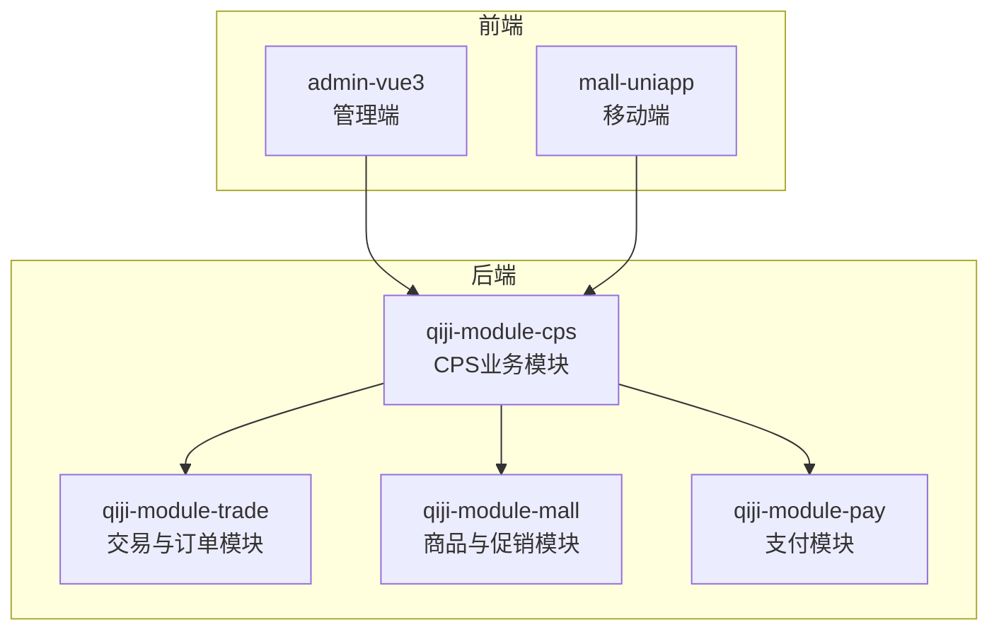
```mermaid
graph TB
subgraph "后端"
CPS["qiji-module-cps<br/>CPS业务模块"]
TRADE["qiji-module-trade<br/>交易与订单模块"]
MALL["qiji-module-mall<br/>商品与促销模块"]
PAY["qiji-module-pay<br/>支付模块"]
end
subgraph "前端"
ADMIN["admin-vue3<br/>管理端"]
MOBILE["mall-uniapp<br/>移动端"]
end
ADMIN --> CPS
MOBILE --> CPS
CPS --> TRADE
CPS --> MALL
CPS --> PAY
```

**章节来源**
- [CpsPlatformClientFactory.java:1-139](file://backend/qiji-module-cps/qiji-module-cps-biz/src/main/java/com/qiji/cps/module/cps/client/CpsPlatformClientFactory.java#L1-L139)
- [CpsGoodsService.java:1-49](file://backend/qiji-module-cps/qiji-module-cps-biz/src/main/java/com/qiji/cps/module/cps/service/goods/CpsGoodsService.java#L1-L49)
- [CpsOrderService.java:1-60](file://backend/qiji-module-cps/qiji-module-cps-biz/src/main/java/com/qiji/cps/module/cps/service/order/CpsOrderService.java#L1-L60)

## 核心组件
- 平台适配器与工厂：通过策略接口与工厂注册中心，实现"平台客户端"与"供应商客户端"的双维度路由与扩展。
- 商品服务：封装平台搜索、跨平台聚合与转链生成，提供统一的商品检索与推广链接生成能力。
- 订单服务：负责订单的幂等保存、批量同步与管理端查询。
- 返利服务：负责返利计算、账户入账、批量结算与退款扣回。
- 提现服务：管理提现申请的分页查询、审核与状态流转。
- 风控服务：提供频率限制与黑名单检查，支持规则的增删改查。
- **新增** 广告位服务：管理推广位的创建、更新、删除、查询与分页，支持推广位类型枚举验证与关联关系管理。
- 前端集成：管理端与移动端分别提供风控、提现、返利与**推广位管理**等界面与API对接。

**章节来源**
- [CpsPlatformClient.java:1-55](file://backend/qiji-module-cps/qiji-module-cps-biz/src/main/java/com/qiji/cps/module/cps/client/CpsPlatformClient.java#L1-L55)
- [CpsApiVendorClient.java:1-84](file://backend/qiji-module-cps/qiji-module-cps-biz/src/main/java/com/qiji/cps/module/cps/client/CpsApiVendorClient.java#L1-L84)
- [CpsGoodsService.java:10-49](file://backend/qiji-module-cps/qiji-module-cps-biz/src/main/java/com/qiji/cps/module/cps/service/goods/CpsGoodsService.java#L10-L49)
- [CpsOrderService.java:10-60](file://backend/qiji-module-cps/qiji-module-cps-biz/src/main/java/com/qiji/cps/module/cps/service/order/CpsOrderService.java#L10-L60)
- [CpsRebateSettleService.java:1-48](file://backend/qiji-module-cps/qiji-module-cps-biz/src/main/java/com/qiji/cps/module/cps/service/rebate/CpsRebateSettleService.java#L1-L48)
- [CpsWithdrawService.java:1-47](file://backend/qiji-module-cps/qiji-module-cps-biz/src/main/java/com/qiji/cps/module/cps/service/withdraw/CpsWithdrawService.java#L1-L47)
- [CpsRiskService.java:1-68](file://backend/qiji-module-cps/qiji-module-cps-biz/src/main/java/com/qiji/cps/module/cps/service/risk/CpsRiskService.java#L1-L68)

## 架构总览
系统采用"策略+工厂+服务层"的解耦架构：
- 策略接口定义平台与供应商客户端能力边界。
- 工厂在启动时自动注册所有实现，提供双维度路由（平台维度与供应商×平台维度）。
- 服务层编排业务流程，如商品搜索聚合、订单同步、返利结算、提现审核、风控检查与**推广位管理**。

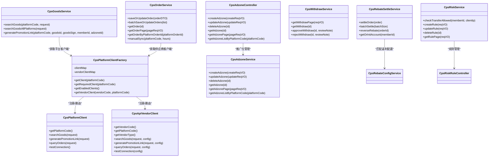
```mermaid
classDiagram
class CpsPlatformClient {
+getPlatformCode()
+searchGoods(request)
+generatePromotionLink(request)
+queryOrders(request)
+testConnection()
}
class CpsApiVendorClient {
+getVendorCode()
+getPlatformCode()
+getVendorType()
+searchGoods(request, config)
+generatePromotionLink(request, config)
+queryOrders(request, config)
+testConnection(config)
}
class CpsPlatformClientFactory {
-clientMap
-vendorClientMap
+getClient(platformCode)
+getRequiredClient(platformCode)
+getEnabledClients()
+getVendorClient(vendorCode, platformCode)
}
class CpsGoodsService {
+searchGoods(platformCode, request)
+searchGoodsAllPlatforms(request)
+generatePromotionLink(platformCode, goodsId, goodsSign, memberId, adzoneId)
}
class CpsOrderService {
+saveOrUpdateOrder(orderDTO)
+batchSaveOrUpdateOrders(list)
+getOrder(id)
+getOrderPage(pageReqVO)
+getOrderByPlatformOrderId(platformOrderId)
+manualSync(platformCode, hours)
}
class CpsRebateSettleService {
+settleOrder(order)
+batchSettle(batchSize)
+reverseRebate(orderId)
+getOrInitAccount(memberId)
}
class CpsWithdrawService {
+getWithdrawPage(reqVO)
+getWithdraw(id)
+approveWithdraw(id, reviewNote)
+rejectWithdraw(id, reviewNote)
}
class CpsRiskService {
+checkTransferAllowed(memberId, clientIp)
+createRule(reqVO)
+updateRule(reqVO)
+deleteRule(id)
+getRulePage(reqVO)
}
class CpsAdzoneService {
+createAdzone(createReqVO)
+updateAdzone(updateReqVO)
+deleteAdzone(id)
+getAdzone(id)
+getAdzonePage(pageReqVO)
+getAdzoneListByPlatformCode(platformCode)
}
class CpsAdzoneController {
+createAdzone(createReqVO)
+updateAdzone(updateReqVO)
+deleteAdzone(id)
+getAdzone(id)
+getAdzonePage(pageReqVO)
+getAdzoneListByPlatformCode(platformCode)
}
CpsPlatformClientFactory --> CpsPlatformClient : "注册/路由"
CpsPlatformClientFactory --> CpsApiVendorClient : "注册/路由"
CpsGoodsService --> CpsPlatformClientFactory : "获取平台客户端"
CpsOrderService --> CpsPlatformClientFactory : "获取供应商客户端"
CpsRebateSettleService --> CpsRebateConfigService : "匹配返利配置"
CpsRiskService --> CpsRiskRuleController : "规则管理"
CpsAdzoneController --> CpsAdzoneService : "推广位管理"
```

**图表来源**
- [CpsPlatformClientFactory.java:17-139](file://backend/qiji-module-cps/qiji-module-cps-biz/src/main/java/com/qiji/cps/module/cps/client/CpsPlatformClientFactory.java#L17-L139)
- [CpsPlatformClient.java:7-55](file://backend/qiji-module-cps/qiji-module-cps-biz/src/main/java/com/qiji/cps/module/cps/client/CpsPlatformClient.java#L7-L55)
- [CpsApiVendorClient.java:7-84](file://backend/qiji-module-cps/qiji-module-cps-biz/src/main/java/com/qiji/cps/module/cps/client/CpsApiVendorClient.java#L7-L84)
- [CpsGoodsService.java:10-49](file://backend/qiji-module-cps/qiji-module-cps-biz/src/main/java/com/qiji/cps/module/cps/service/goods/CpsGoodsService.java#L10-L49)
- [CpsOrderService.java:10-60](file://backend/qiji-module-cps/qiji-module-cps-biz/src/main/java/com/qiji/cps/module/cps/service/order/CpsOrderService.java#L10-L60)
- [CpsRebateSettleService.java:6-48](file://backend/qiji-module-cps/qiji-module-cps-biz/src/main/java/com/qiji/cps/module/cps/service/rebate/CpsRebateSettleService.java#L6-L48)
- [CpsRiskService.java:9-68](file://backend/qiji-module-cps/qiji-module-cps-biz/src/main/java/com/qiji/cps/module/cps/service/risk/CpsRiskService.java#L9-L68)
- [CpsAdzoneService.java:16-48](file://backend/qiji-module-cps/qiji-module-cps-biz/src/main/java/com/qiji/cps/module/cps/service/adzone/CpsAdzoneService.java#L16-L48)
- [CpsAdzoneController.java:28-83](file://backend/qiji-module-cps/qiji-module-cps-biz/src/main/java/com/qiji/cps/module/cps/controller/admin/adzone/CpsAdzoneController.java#L28-83)

## 详细组件分析

### 平台适配器与工厂（策略模式与双维度路由）
- 设计要点
  - 平台客户端策略接口定义平台能力边界，新增平台仅需实现接口并注册为Spring Bean。
  - 工厂在启动时扫描并注册所有平台客户端与供应商客户端，提供按平台编码与"供应商×平台"双维度路由。
  - 支持启用状态过滤，仅对已启用平台提供服务；同时支持供应商维度的多供应商对接同一平台。
- 关键流程
  - 平台维度：通过平台编码获取客户端，必要时抛出异常提示未找到。
  - 供应商维度：通过"供应商编码:平台编码"键获取具体供应商实现，便于对接多家供应商。
  - 启用过滤：从数据库获取已启用平台列表，仅返回已注册且启用的客户端集合。

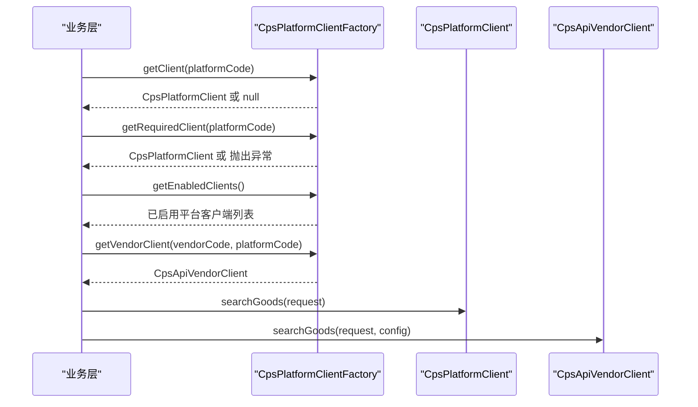
```mermaid
sequenceDiagram
participant Biz as "业务层"
participant Factory as "CpsPlatformClientFactory"
participant Plat as "CpsPlatformClient"
participant Vend as "CpsApiVendorClient"
Biz->>Factory : getClient(platformCode)
Factory-->>Biz : CpsPlatformClient 或 null
Biz->>Factory : getRequiredClient(platformCode)
Factory-->>Biz : CpsPlatformClient 或 抛出异常
Biz->>Factory : getEnabledClients()
Factory-->>Biz : 已启用平台客户端列表
Biz->>Factory : getVendorClient(vendorCode, platformCode)
Factory-->>Biz : CpsApiVendorClient
Biz->>Plat : searchGoods(request)
Biz->>Vend : searchGoods(request, config)
```

**图表来源**
- [CpsPlatformClientFactory.java:82-139](file://backend/qiji-module-cps/qiji-module-cps-biz/src/main/java/com/qiji/cps/module/cps/client/CpsPlatformClientFactory.java#L82-L139)
- [CpsPlatformClient.java:14-55](file://backend/qiji-module-cps/qiji-module-cps-biz/src/main/java/com/qiji/cps/module/cps/client/CpsPlatformClient.java#L14-L55)
- [CpsApiVendorClient.java:25-84](file://backend/qiji-module-cps/qiji-module-cps-biz/src/main/java/com/qiji/cps/module/cps/client/CpsApiVendorClient.java#L25-L84)

**章节来源**
- [CpsPlatformClientFactory.java:17-139](file://backend/qiji-module-cps/qiji-module-cps-biz/src/main/java/com/qiji/cps/module/cps/client/CpsPlatformClientFactory.java#L17-L139)
- [CpsPlatformClient.java:7-55](file://backend/qiji-module-cps/qiji-module-cps-biz/src/main/java/com/qiji/cps/module/cps/client/CpsPlatformClient.java#L7-L55)
- [CpsApiVendorClient.java:7-84](file://backend/qiji-module-cps/qiji-module-cps-biz/src/main/java/com/qiji/cps/module/cps/client/CpsApiVendorClient.java#L7-L84)

### 商品搜索与跨平台比价算法
- 功能概述
  - 单平台搜索：根据平台编码与请求参数调用对应平台客户端。
  - 跨平台聚合：遍历已启用平台，拉取各平台搜索结果，合并后按券后价升序排序。
  - 转链生成：优先使用会员专属推广位，其次平台默认推广位，并携带外部用户标识用于订单归因。
- 算法细节
  - 每平台最多取前10条用于比价，避免过多IO与排序开销。
  - 排序策略：券后价升序，空值排到最后，确保有效价格优先。
  - 异常处理：某平台调用失败时记录告警并跳过，不影响其他平台结果。
- AI工具集成
  - MCP Tool提供跨平台比价能力，支持按关键词搜索并在所有已启用平台中对比价格与返利，输出最优购买方案。

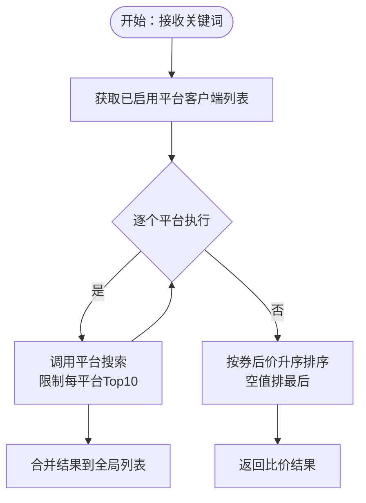
```mermaid
flowchart TD
Start(["开始：接收关键词"]) --> GetEnabled["获取已启用平台客户端列表"]
GetEnabled --> Loop{"逐个平台执行"}
Loop --> |是| Search["调用平台搜索<br/>限制每平台Top10"]
Search --> Merge["合并结果到全局列表"]
Loop --> |否| Sort["按券后价升序排序<br/>空值排最后"]
Sort --> Return["返回比价结果"]
Search --> Loop
```

**图表来源**
- [CpsGoodsServiceImpl.java:50-74](file://backend/qiji-module-cps/qiji-module-cps-biz/src/main/java/com/qiji/cps/module/cps/service/goods/CpsGoodsServiceImpl.java#L50-L74)
- [CpsComparePricesToolFunction.java:22-175](file://backend/qiji-module-cps/qiji-module-cps-biz/src/main/java/com/qiji/cps/module/cps/mcp/tool/CpsComparePricesToolFunction.java#L22-L175)

**章节来源**
- [CpsGoodsService.java:17-49](file://backend/qiji-module-cps/qiji-module-cps-biz/src/main/java/com/qiji/cps/module/cps/service/goods/CpsGoodsService.java#L17-L49)
- [CpsGoodsServiceImpl.java:41-147](file://backend/qiji-module-cps/qiji-module-cps-biz/src/main/java/com/qiji/cps/module/cps/service/goods/CpsGoodsServiceImpl.java#L41-L147)
- [CpsComparePricesToolFunction.java:22-175](file://backend/qiji-module-cps/qiji-module-cps-biz/src/main/java/com/qiji/cps/module/cps/mcp/tool/CpsComparePricesToolFunction.java#L22-L175)

### 订单全链路追踪机制
- 订单状态管理
  - 幂等保存：根据平台订单号判断新增或更新，避免重复入库。
  - 批量同步：支持批量保存与统计，提升同步效率。
  - 手动同步：支持按平台与时间窗口手动触发同步任务。
- 异步回调与一致性
  - 订单查询：通过供应商客户端按时间窗口查询平台订单，统一转换为内部订单模型。
  - 物流轨迹：提供物流轨迹查询接口，返回时间与内容字段，便于前端展示。
  - 状态同步：针对特定支付渠道（如微信小程序）在发货/收货后进行状态同步与通知。
- 数据一致性
  - 幂等性：通过平台订单号去重，避免重复更新。
  - 事务与重试：结合数据库版本号与重试策略，保证并发场景下的数据一致。

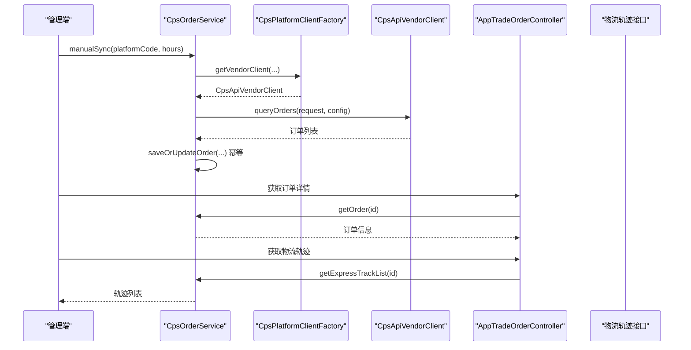
```mermaid
sequenceDiagram
participant Admin as "管理端"
participant OrderSvc as "CpsOrderService"
participant Factory as "CpsPlatformClientFactory"
participant Vend as "CpsApiVendorClient"
participant TradeCtrl as "AppTradeOrderController"
participant Track as "物流轨迹接口"
Admin->>OrderSvc : manualSync(platformCode, hours)
OrderSvc->>Factory : getVendorClient(...)
Factory-->>OrderSvc : CpsApiVendorClient
OrderSvc->>Vend : queryOrders(request, config)
Vend-->>OrderSvc : 订单列表
OrderSvc->>OrderSvc : saveOrUpdateOrder(...) 幂等
Admin->>TradeCtrl : 获取订单详情
TradeCtrl->>OrderSvc : getOrder(id)
OrderSvc-->>TradeCtrl : 订单信息
Admin->>TradeCtrl : 获取物流轨迹
TradeCtrl->>OrderSvc : getExpressTrackList(id)
OrderSvc-->>Admin : 轨迹列表
```

**图表来源**
- [CpsOrderService.java:17-60](file://backend/qiji-module-cps/qiji-module-cps-biz/src/main/java/com/qiji/cps/module/cps/service/order/CpsOrderService.java#L17-L60)
- [CpsPlatformClientFactory.java:134-139](file://backend/qiji-module-cps/qiji-module-cps-biz/src/main/java/com/qiji/cps/module/cps/client/CpsPlatformClientFactory.java#L134-L139)
- [AppTradeOrderController.java:106-131](file://backend/qiji-module-mall/qiji-module-trade/src/main/java/com/qiji/cps/module/trade/controller/app/order/AppTradeOrderController.java#L106-L131)
- [AppOrderExpressTrackRespDTO.java:8-23](file://backend/qiji-module-mall/qiji-module-trade/src/main/java/com/qiji/cps/module/trade/controller/app/order/vo/AppOrderExpressTrackRespDTO.java#L8-L23)
- [TradeStatusSyncToWxaOrderHandler.java:25-60](file://backend/qiji-module-mall/qiji-module-trade/src/main/java/com/qiji/cps/module/trade/service/order/handler/TradeStatusSyncToWxaOrderHandler.java#L25-L60)

**章节来源**
- [CpsOrderService.java:17-60](file://backend/qiji-module-cps/qiji-module-cps-biz/src/main/java/com/qiji/cps/module/cps/service/order/CpsOrderService.java#L17-L60)
- [AppTradeOrderController.java:106-131](file://backend/qiji-module-mall/qiji-module-trade/src/main/java/com/qiji/cps/module/trade/controller/app/order/AppTradeOrderController.java#L106-L131)
- [AppOrderExpressTrackRespDTO.java:8-23](file://backend/qiji-module-mall/qiji-module-trade/src/main/java/com/qiji/cps/module/trade/controller/app/order/vo/AppOrderExpressTrackRespDTO.java#L8-L23)
- [TradeStatusSyncToWxaOrderHandler.java:25-60](file://backend/qiji-module-mall/qiji-module-trade/src/main/java/com/qiji/cps/module/trade/service/order/handler/TradeStatusSyncToWxaOrderHandler.java#L25-L60)

### 返利计算引擎设计
- 返利规则配置
  - 支持按会员等级与平台编码的多级匹配，优先级：等级+平台 > 等级+全平台 > 全等级+平台 > 全等级+全平台。
  - 支持配置返利比例、上下限金额，兜底比例默认80%。
- 计算精度与批量结算
  - 返利金额 = 佣金 × 返利比例，保留两位小数；应用上下限后取值。
  - 账户入账采用乐观锁与重试机制，最多重试3次，避免并发冲突导致丢失。
  - 批量结算支持分批处理，返回成功/跳过/失败统计。
- 退款扣回
  - 订单退款后对已入账返利进行扣回，保证财务一致性。

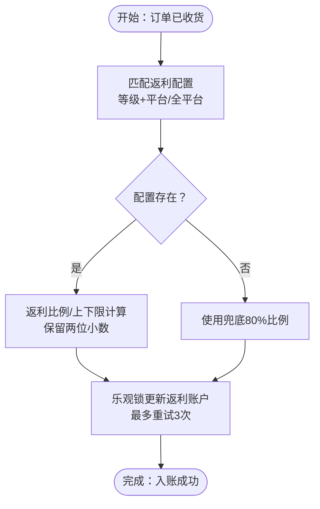
```mermaid
flowchart TD
S(["开始：订单已收货"]) --> Match["匹配返利配置<br/>等级+平台/全平台"]
Match --> Rate{"配置存在？"}
Rate --> |是| Calc["返利比例/上下限计算<br/>保留两位小数"]
Rate --> |否| Fallback["使用兜底80%比例"]
Calc --> Account["乐观锁更新返利账户<br/>最多重试3次"]
Fallback --> Account
Account --> Done(["完成：入账成功"])
```

**图表来源**
- [CpsRebateSettleService.java:14-48](file://backend/qiji-module-cps/qiji-module-cps-biz/src/main/java/com/qiji/cps/module/cps/service/rebate/CpsRebateSettleService.java#L14-L48)
- [CpsRebateSettleServiceImpl.java:215-262](file://backend/qiji-module-cps/qiji-module-cps-biz/src/main/java/com/qiji/cps/module/cps/service/rebate/CpsRebateSettleServiceImpl.java#L215-L262)
- [CpsRebateConfigService.java:48-65](file://backend/qiji-module-cps/qiji-module-cps-biz/src/main/java/com/qiji/cps/module/cps/service/rebate/CpsRebateConfigService.java#L48-L65)

**章节来源**
- [CpsRebateSettleService.java:14-48](file://backend/qiji-module-cps/qiji-module-cps-biz/src/main/java/com/qiji/cps/module/cps/service/rebate/CpsRebateSettleService.java#L14-L48)
- [CpsRebateSettleServiceImpl.java:215-262](file://backend/qiji-module-cps/qiji-module-cps-biz/src/main/java/com/qiji/cps/module/cps/service/rebate/CpsRebateSettleServiceImpl.java#L215-L262)
- [CpsRebateConfigService.java:48-65](file://backend/qiji-module-cps/qiji-module-cps-biz/src/main/java/com/qiji/cps/module/cps/service/rebate/CpsRebateConfigService.java#L48-L65)

### 提现管理流程
- 申请与审核
  - 管理端提供分页查询、详情查看、审核通过与驳回功能。
  - 审核通过后进入转账流程，记录转账单号与状态。
- 前端集成
  - 移动端展示可提现金额与提现记录入口，支持选择提现方式（余额/银行卡）。
  - 管理端API定义了完整的提现管理接口，包括分页、详情、审核等。

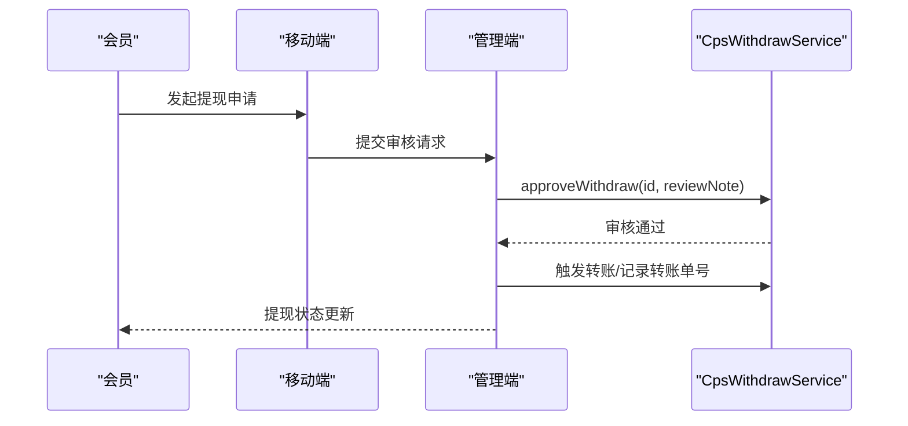
```mermaid
sequenceDiagram
participant Member as "会员"
participant Mobile as "移动端"
participant Admin as "管理端"
participant WithdrawSvc as "CpsWithdrawService"
Member->>Mobile : 发起提现申请
Mobile->>Admin : 提交审核请求
Admin->>WithdrawSvc : approveWithdraw(id, reviewNote)
WithdrawSvc-->>Admin : 审核通过
Admin->>WithdrawSvc : 触发转账/记录转账单号
Admin-->>Member : 提现状态更新
```

**图表来源**
- [withdraw.vue:1-32](file://frontend/mall-uniapp/pages/commission/withdraw.vue#L1-L32)
- [withdraw.ts:38-57](file://frontend/admin-vue3/src/api/cps/withdraw.ts#L38-L57)
- [CpsWithdrawService.java:14-47](file://backend/qiji-module-cps/qiji-module-cps-biz/src/main/java/com/qiji/cps/module/cps/service/withdraw/CpsWithdrawService.java#L14-L47)
- [AppBrokerageWithdrawRespVO.java:8-44](file://backend/qiji-module-mall/qiji-module-trade/src/main/java/com/qiji/cps/module/trade/controller/app/brokerage/vo/withdraw/AppBrokerageWithdrawRespVO.java#L8-L44)

**章节来源**
- [withdraw.vue:1-32](file://frontend/mall-uniapp/pages/commission/withdraw.vue#L1-L32)
- [withdraw.ts:38-57](file://frontend/admin-vue3/src/api/cps/withdraw.ts#L38-L57)
- [CpsWithdrawService.java:14-47](file://backend/qiji-module-cps/qiji-module-cps-biz/src/main/java/com/qiji/cps/module/cps/service/withdraw/CpsWithdrawService.java#L14-L47)
- [AppBrokerageWithdrawRespVO.java:8-44](file://backend/qiji-module-mall/qiji-module-trade/src/main/java/com/qiji/cps/module/trade/controller/app/brokerage/vo/withdraw/AppBrokerageWithdrawRespVO.java#L8-L44)

### 风控系统设计
- 风控检查流程
  - 顺序检查：会员ID黑名单 → IP黑名单（可选）→ Redis频率限制计数器。
  - 任一拦截即拒绝转链，全部通过放行。
- 规则管理
  - 支持创建、更新、删除与分页查询风控规则。
  - 规则类型包括频率限制与黑名单两类，目标类型支持会员与IP。
- 管理端集成
  - 提供完整的风控规则管理菜单与权限控制。

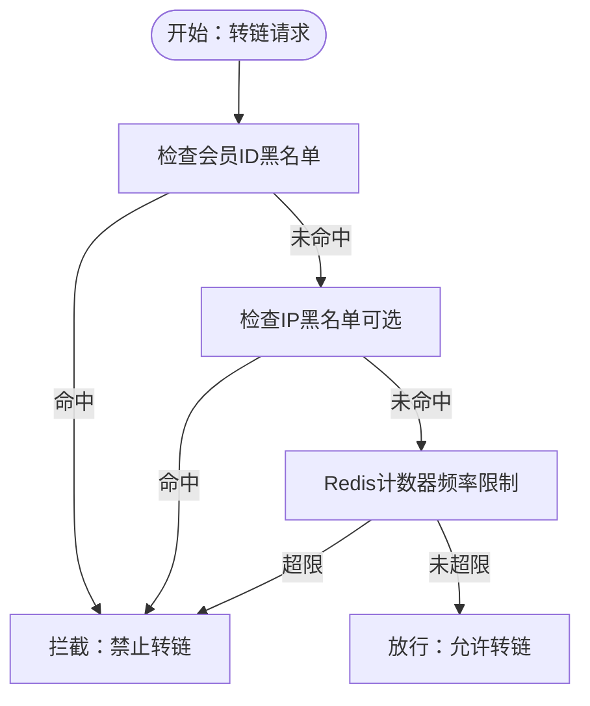
```mermaid
flowchart TD
Start(["开始：转链请求"]) --> BlackMember["检查会员ID黑名单"]
BlackMember --> |命中| Block["拦截：禁止转链"]
BlackMember --> |未命中| BlackIP["检查IP黑名单可选"]
BlackIP --> |命中| Block
BlackIP --> |未命中| RateLimit["Redis计数器频率限制"]
RateLimit --> |超限| Block
RateLimit --> |未超限| Allow["放行：允许转链"]
```

**图表来源**
- [CpsRiskService.java:17-33](file://backend/qiji-module-cps/qiji-module-cps-biz/src/main/java/com/qiji/cps/module/cps/service/risk/CpsRiskService.java#L17-L33)
- [CpsRiskRuleController.java:30-71](file://backend/qiji-module-cps/qiji-module-cps-biz/src/main/java/com/qiji/cps/module/cps/controller/admin/risk/CpsRiskRuleController.java#L30-L71)
- [CpsRiskRuleRespVO.java:13-41](file://backend/qiji-module-cps/qiji-module-cps-biz/src/main/java/com/qiji/cps/module/cps/controller/admin/risk/vo/CpsRiskRuleRespVO.java#L13-L41)
- [CpsRiskRulePageReqVO.java:14-26](file://backend/qiji-module-cps/qiji-module-cps-biz/src/main/java/com/qiji/cps/module/cps/controller/admin/risk/vo/CpsRiskRulePageReqVO.java#L14-L26)

**章节来源**
- [CpsRiskService.java:17-33](file://backend/qiji-module-cps/qiji-module-cps-biz/src/main/java/com/qiji/cps/module/cps/service/risk/CpsRiskService.java#L17-L33)
- [CpsRiskRuleController.java:30-71](file://backend/qiji-module-cps/qiji-module-cps-biz/src/main/java/com/qiji/cps/module/cps/controller/admin/risk/CpsRiskRuleController.java#L30-L71)
- [CpsRiskRuleRespVO.java:13-41](file://backend/qiji-module-cps/qiji-module-cps-biz/src/main/java/com/qiji/cps/module/cps/controller/admin/risk/vo/CpsRiskRuleRespVO.java#L13-L41)
- [CpsRiskRulePageReqVO.java:14-26](file://backend/qiji-module-cps/qiji-module-cps-biz/src/main/java/com/qiji/cps/module/cps/controller/admin/risk/vo/CpsRiskRulePageReqVO.java#L14-L26)

## 广告位管理功能

### 推广位类型枚举验证机制
- 枚举定义
  - 推广位类型包括通用（general）、渠道专属（channel）、用户专属（member）三种类型。
  - 通过InEnum注解实现后端参数验证，确保推广位类型值的有效性。
- 验证规则
  - 创建和更新推广位时，adzoneType字段必须为枚举值之一。
  - 自动同步关联类型（relationType），根据推广位类型设置对应的关联关系。
- 关联关系管理
  - 渠道专属类型：relationType为channel，relationId存储渠道ID。
  - 用户专属类型：relationType为member，relationId存储用户ID。
  - 通用类型：relationType为空，无需关联特定实体。

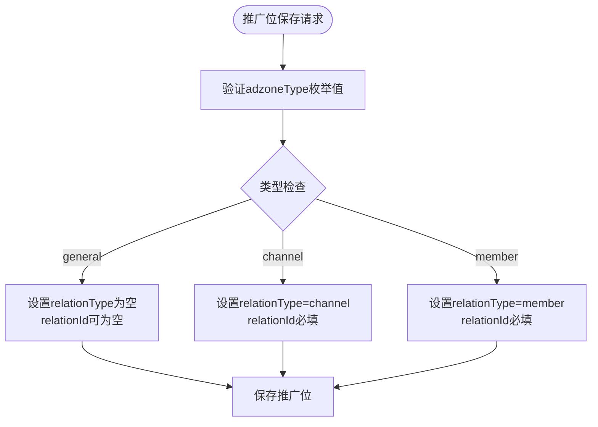
```mermaid
flowchart TD
Start(["推广位保存请求"]) --> Validate["验证adzoneType枚举值"]
Validate --> TypeCheck{"类型检查"}
TypeCheck --> |general| General["设置relationType为空<br/>relationId可为空"]
TypeCheck --> |channel| Channel["设置relationType=channel<br/>relationId必填"]
TypeCheck --> |member| Member["设置relationType=member<br/>relationId必填"]
General --> Save["保存推广位"]
Channel --> Save
Member --> Save
```

**图表来源**
- [CpsAdzoneSaveReqVO.java:28-30](file://backend/qiji-module-cps/qiji-module-cps-biz/src/main/java/com/qiji/cps/module/cps/controller/admin/adzone/vo/CpsAdzoneSaveReqVO.java#L28-L30)
- [CpsAdzoneTypeEnum.java:16-21](file://backend/qiji-module-cps/qiji-module-cps-api/src/main/java/com/qiji/cps/module/cps/enums/CpsAdzoneTypeEnum.java#L16-L21)

**章节来源**
- [CpsAdzoneTypeEnum.java:16-40](file://backend/qiji-module-cps/qiji-module-cps-api/src/main/java/com/qiji/cps/module/cps/enums/CpsAdzoneTypeEnum.java#L16-L40)
- [CpsAdzoneSaveReqVO.java:28-43](file://backend/qiji-module-cps/qiji-module-cps-biz/src/main/java/com/qiji/cps/module/cps/controller/admin/adzone/vo/CpsAdzoneSaveReqVO.java#L28-L43)

### 推广位选择对话框功能
- 界面升级
  - 从简单的文本输入升级为复杂的下拉选择对话框。
  - 支持按平台编码、推广位名称、推广位类型、状态等条件筛选。
- 用户体验
  - 提供实时搜索和筛选功能，支持键盘快捷键操作。
  - 双击行可直接确认选择，提高操作效率。
  - 显示推广位详细信息，包括平台编码、类型标签、状态等。
- 功能特性
  - 支持分页加载，每页可显示10/20/50条记录。
  - 提供空状态提示和加载状态指示。
  - 自动同步当前选择状态，支持取消和确认操作。

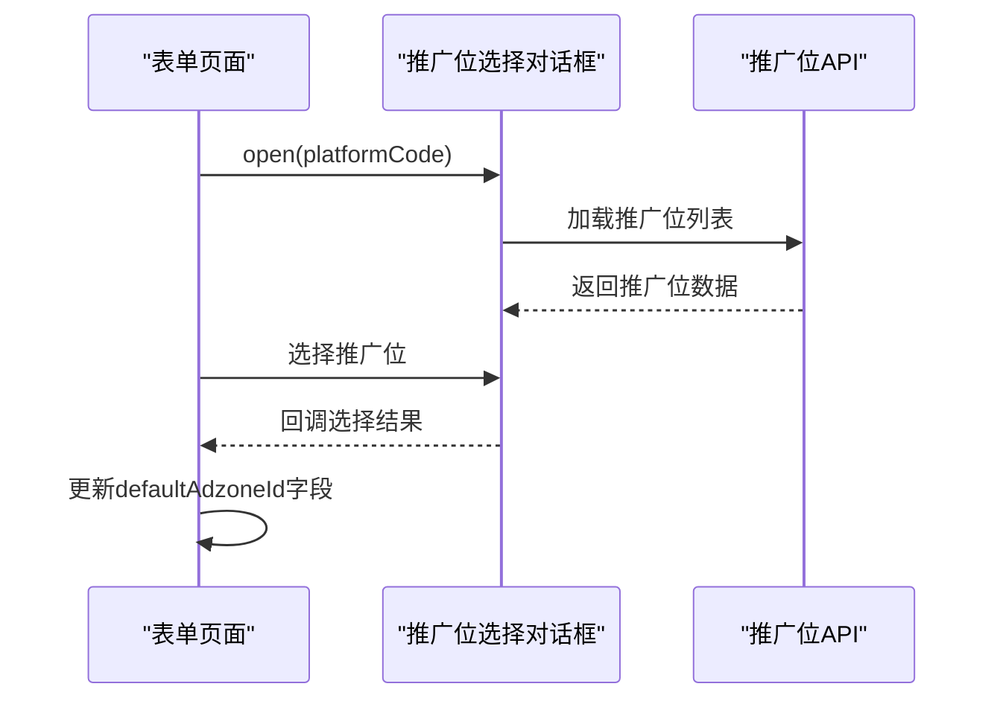
```mermaid
sequenceDiagram
participant Form as "表单页面"
participant Dialog as "推广位选择对话框"
participant API as "推广位API"
Form->>Dialog : open(platformCode)
Dialog->>API : 加载推广位列表
API-->>Dialog : 返回推广位数据
Form->>Dialog : 选择推广位
Dialog-->>Form : 回调选择结果
Form->>Form : 更新defaultAdzoneId字段
```

**图表来源**
- [AdzoneSelectDialog.vue:177-191](file://frontend/admin-vue3/src/views/cps/components/AdzoneSelectDialog.vue#L177-L191)
- [AdzoneSelectDialog.vue:209-224](file://frontend/admin-vue3/src/views/cps/components/AdzoneSelectDialog.vue#L209-L224)
- [AdzoneSelectDialog.vue:253-257](file://frontend/admin-vue3/src/views/cps/components/AdzoneSelectDialog.vue#L253-L257)

**章节来源**
- [AdzoneSelectDialog.vue:1-282](file://frontend/admin-vue3/src/views/cps/components/AdzoneSelectDialog.vue#L1-L282)

### 推广位控制器与服务层实现
- 控制器功能
  - 提供推广位的完整RESTful API接口。
  - 支持创建、更新、删除、查询、分页查询和按平台查询。
  - 集成权限控制，基于角色的访问控制（RBAC）。
- 服务层实现
  - 封装推广位业务逻辑，提供事务性和数据一致性保障。
  - 支持默认推广位查询和按平台查询功能。
  - 实现推广位存在性验证和异常处理。
- 数据访问层
  - 提供灵活的查询条件组合，支持多字段精确匹配。
  - 支持按创建时间倒序排列，确保最新数据优先显示。

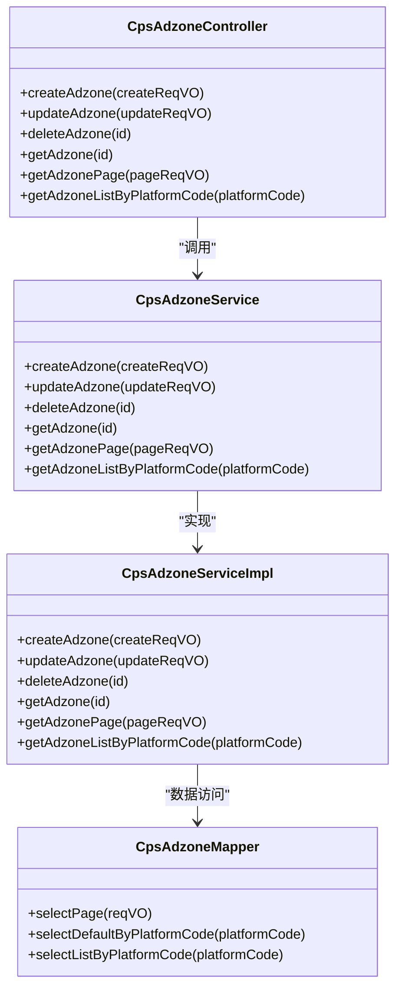
```mermaid
classDiagram
class CpsAdzoneController {
+createAdzone(createReqVO)
+updateAdzone(updateReqVO)
+deleteAdzone(id)
+getAdzone(id)
+getAdzonePage(pageReqVO)
+getAdzoneListByPlatformCode(platformCode)
}
class CpsAdzoneService {
+createAdzone(createReqVO)
+updateAdzone(updateReqVO)
+deleteAdzone(id)
+getAdzone(id)
+getAdzonePage(pageReqVO)
+getAdzoneListByPlatformCode(platformCode)
}
class CpsAdzoneServiceImpl {
+createAdzone(createReqVO)
+updateAdzone(updateReqVO)
+deleteAdzone(id)
+getAdzone(id)
+getAdzonePage(pageReqVO)
+getAdzoneListByPlatformCode(platformCode)
}
class CpsAdzoneMapper {
+selectPage(reqVO)
+selectDefaultByPlatformCode(platformCode)
+selectListByPlatformCode(platformCode)
}
CpsAdzoneController --> CpsAdzoneService : "调用"
CpsAdzoneService --> CpsAdzoneServiceImpl : "实现"
CpsAdzoneServiceImpl --> CpsAdzoneMapper : "数据访问"
```

**图表来源**
- [CpsAdzoneController.java:33-81](file://backend/qiji-module-cps/qiji-module-cps-biz/src/main/java/com/qiji/cps/module/cps/controller/admin/adzone/CpsAdzoneController.java#L33-L81)
- [CpsAdzoneService.java:21-46](file://backend/qiji-module-cps/qiji-module-cps-biz/src/main/java/com/qiji/cps/module/cps/service/adzone/CpsAdzoneService.java#L21-L46)
- [CpsAdzoneServiceImpl.java:31-63](file://backend/qiji-module-cps/qiji-module-cps-biz/src/main/java/com/qiji/cps/module/cps/service/adzone/CpsAdzoneServiceImpl.java#L31-L63)
- [CpsAdzoneMapper.java:20-40](file://backend/qiji-module-cps/qiji-module-cps-biz/src/main/java/com/qiji/cps/module/cps/dal/mysql/adzone/CpsAdzoneMapper.java#L20-L40)

**章节来源**
- [CpsAdzoneController.java:28-83](file://backend/qiji-module-cps/qiji-module-cps-biz/src/main/java/com/qiji/cps/module/cps/controller/admin/adzone/CpsAdzoneController.java#L28-83)
- [CpsAdzoneService.java:16-48](file://backend/qiji-module-cps/qiji-module-cps-biz/src/main/java/com/qiji/cps/module/cps/service/adzone/CpsAdzoneService.java#L16-48)
- [CpsAdzoneServiceImpl.java:25-71](file://backend/qiji-module-cps/qiji-module-cps-biz/src/main/java/com/qiji/cps/module/cps/service/adzone/CpsAdzoneServiceImpl.java#L25-71)
- [CpsAdzoneMapper.java:18-42](file://backend/qiji-module-cps/qiji-module-cps-biz/src/main/java/com/qiji/cps/module/cps/dal/mysql/adzone/CpsAdzoneMapper.java#L18-42)

### 前端界面集成与交互
- 平台管理界面升级
  - 在平台配置表单中集成推广位选择按钮。
  - 支持通过对话框选择默认推广位，自动填充到表单字段。
  - 提供推广位信息的实时显示和更新。
- 供应商管理界面集成
  - 在供应商配置表单中同样集成推广位选择功能。
  - 支持按平台过滤推广位列表，确保选择的推广位与平台匹配。
- API集成
  - 定义完整的推广位API接口，支持分页查询和按平台查询。
  - 提供推广位选项数据，支持前端下拉选择组件使用。

**章节来源**
- [index.vue:283-291](file://frontend/admin-vue3/src/views/cps/platform/index.vue#L283-L291)
- [index.vue:288-291](file://frontend/admin-vue3/src/views/cps/platform/index.vue#L288-L291)
- [index.vue:274-275](file://frontend/admin-vue3/src/views/cps/platform/index.vue#L274-L275)
- [index.vue:290-291](file://frontend/admin-vue3/src/views/cps/platform/index.vue#L290-L291)
- [index.vue:302-334](file://frontend/admin-vue3/src/views/cps/platform/index.vue#L302-L334)
- [index.vue:274-275](file://frontend/admin-vue3/src/views/cps/apiVendor/index.vue#L274-L275)
- [adzone.ts:41-71](file://frontend/admin-vue3/src/api/cps/adzone.ts#L41-L71)

## 依赖关系分析
- 组件耦合
  - 服务层通过工厂解耦平台与供应商客户端，降低对具体实现的依赖。
  - 订单服务依赖工厂获取供应商客户端，实现多平台订单统一同步。
  - 返利服务依赖配置服务进行规则匹配，保证策略可配置化。
  - **新增** 广告位服务独立于核心业务，通过API接口与前端交互。
- 外部依赖
  - 平台API：通过供应商客户端对接不同平台与供应商。
  - 支付与转账：通过支付模块完成提现转账与状态回传。
  - Redis：用于风控频率限制计数器。
  - **新增** 数据库：推广位数据持久化存储，支持多字段查询和索引优化。

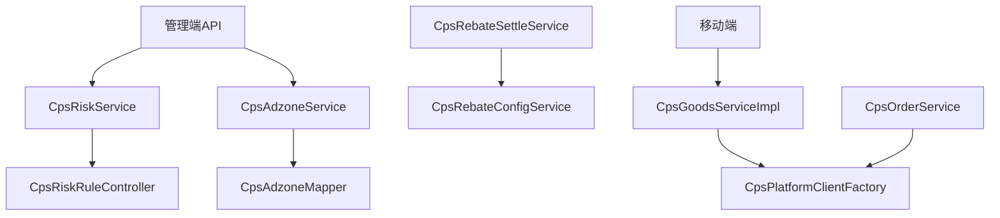
```mermaid
graph TB
GoodsSvc["CpsGoodsServiceImpl"] --> Factory["CpsPlatformClientFactory"]
OrderSvc["CpsOrderService"] --> Factory
RebateSvc["CpsRebateSettleService"] --> ConfigSvc["CpsRebateConfigService"]
RiskSvc["CpsRiskService"] --> RuleCtrl["CpsRiskRuleController"]
AdzoneSvc["CpsAdzoneService"] --> AdzoneMapper["CpsAdzoneMapper"]
FrontAdmin["管理端API"] --> RiskSvc
FrontAdmin --> AdzoneSvc
FrontMobile["移动端"] --> GoodsSvc
```

**图表来源**
- [CpsGoodsServiceImpl.java:32-48](file://backend/qiji-module-cps/qiji-module-cps-biz/src/main/java/com/qiji/cps/module/cps/service/goods/CpsGoodsServiceImpl.java#L32-L48)
- [CpsOrderService.java:17-60](file://backend/qiji-module-cps/qiji-module-cps-biz/src/main/java/com/qiji/cps/module/cps/service/order/CpsOrderService.java#L17-L60)
- [CpsRebateSettleService.java:14-48](file://backend/qiji-module-cps/qiji-module-cps-biz/src/main/java/com/qiji/cps/module/cps/service/rebate/CpsRebateSettleService.java#L14-L48)
- [CpsRebateConfigService.java:48-65](file://backend/qiji-module-cps/qiji-module-cps-biz/src/main/java/com/qiji/cps/module/cps/service/rebate/CpsRebateConfigService.java#L48-L65)
- [CpsRiskService.java:17-33](file://backend/qiji-module-cps/qiji-module-cps-biz/src/main/java/com/qiji/cps/module/cps/service/risk/CpsRiskService.java#L17-L33)
- [CpsRiskRuleController.java:30-71](file://backend/qiji-module-cps/qiji-module-cps-biz/src/main/java/com/qiji/cps/module/cps/controller/admin/risk/CpsRiskRuleController.java#L30-L71)
- [CpsAdzoneService.java:16-48](file://backend/qiji-module-cps/qiji-module-cps-biz/src/main/java/com/qiji/cps/module/cps/service/adzone/CpsAdzoneService.java#L16-L48)
- [CpsAdzoneMapper.java:18-42](file://backend/qiji-module-cps/qiji-module-cps-biz/src/main/java/com/qiji/cps/module/cps/dal/mysql/adzone/CpsAdzoneMapper.java#L18-42)

**章节来源**
- [CpsGoodsServiceImpl.java:32-48](file://backend/qiji-module-cps/qiji-module-cps-biz/src/main/java/com/qiji/cps/module/cps/service/goods/CpsGoodsServiceImpl.java#L32-L48)
- [CpsOrderService.java:17-60](file://backend/qiji-module-cps/qiji-module-cps-biz/src/main/java/com/qiji/cps/module/cps/service/order/CpsOrderService.java#L17-L60)
- [CpsRebateSettleService.java:14-48](file://backend/qiji-module-cps/qiji-module-cps-biz/src/main/java/com/qiji/cps/module/cps/service/rebate/CpsRebateSettleService.java#L14-L48)
- [CpsRebateConfigService.java:48-65](file://backend/qiji-module-cps/qiji-module-cps-biz/src/main/java/com/qiji/cps/module/cps/service/rebate/CpsRebateConfigService.java#L48-L65)
- [CpsRiskService.java:17-33](file://backend/qiji-module-cps/qiji-module-cps-biz/src/main/java/com/qiji/cps/module/cps/service/risk/CpsRiskService.java#L17-L33)
- [CpsRiskRuleController.java:30-71](file://backend/qiji-module-cps/qiji-module-cps-biz/src/main/java/com/qiji/cps/module/cps/controller/admin/risk/CpsRiskRuleController.java#L30-L71)
- [CpsAdzoneService.java:16-48](file://backend/qiji-module-cps/qiji-module-cps-biz/src/main/java/com/qiji/cps/module/cps/service/adzone/CpsAdzoneService.java#L16-L48)
- [CpsAdzoneMapper.java:18-42](file://backend/qiji-module-cps/qiji-module-cps-biz/src/main/java/com/qiji/cps/module/cps/dal/mysql/adzone/CpsAdzoneMapper.java#L18-42)

## 性能考量
- 并发与一致性
  - 返利入账采用乐观锁与重试，减少锁竞争与丢失概率。
  - 订单同步支持批量处理，降低平台轮询压力。
  - **新增** 推广位查询支持索引优化，按平台编码和状态快速筛选。
- IO与排序优化
  - 跨平台比价限制每平台Top10，避免大量IO与大规模排序。
  - 排序时对空值进行特殊处理，确保有效价格优先。
  - **新增** 推广位分页查询支持多字段组合查询，避免全表扫描。
- 缓存与限流
  - 风控使用Redis计数器进行频率限制，降低数据库压力。
  - 建议对平台搜索结果进行短期缓存，减少重复调用。
  - **新增** 推广位默认值查询支持内存缓存，减少数据库访问。

## 故障排查指南
- 平台适配器未注册
  - 现象：按平台编码获取客户端为空或抛异常。
  - 排查：确认实现类是否为Spring Bean并正确注册；检查平台启用状态。
- 跨平台比价无结果
  - 现象：关键词搜索无结果或部分平台超时。
  - 排查：检查平台API连通性与配置；关注日志中的跳过告警。
- 订单未入账或重复入账
  - 现象：订单状态异常或返利未到账。
  - 排查：确认幂等保存逻辑与平台订单号唯一性；检查批量结算任务运行情况。
- 提现审核后未到账
  - 现象：审核通过但账户余额未增加。
  - 排查：检查转账流程与回调状态；核对提现单号与转账单号映射。
- 风控拦截频繁
  - 现象：转链请求被频繁拦截。
  - 排查：检查黑名单规则与频率限制阈值；确认会员ID/IP是否误判。
- **新增** 推广位选择异常
  - 现象：推广位选择对话框无法打开或选择无效。
  - 排查：检查平台编码选项配置；确认推广位数据是否存在；验证权限设置。

**章节来源**
- [CpsPlatformClientFactory.java:82-139](file://backend/qiji-module-cps/qiji-module-cps-biz/src/main/java/com/qiji/cps/module/cps/client/CpsPlatformClientFactory.java#L82-L139)
- [CpsGoodsServiceImpl.java:50-74](file://backend/qiji-module-cps/qiji-module-cps-biz/src/main/java/com/qiji/cps/module/cps/service/goods/CpsGoodsServiceImpl.java#L50-L74)
- [CpsOrderService.java:17-60](file://backend/qiji-module-cps/qiji-module-cps-biz/src/main/java/com/qiji/cps/module/cps/service/order/CpsOrderService.java#L17-L60)
- [CpsRebateSettleServiceImpl.java:255-262](file://backend/qiji-module-cps/qiji-module-cps-biz/src/main/java/com/qiji/cps/module/cps/service/rebate/CpsRebateSettleServiceImpl.java#L255-L262)
- [CpsRiskService.java:17-33](file://backend/qiji-module-cps/qiji-module-cps-biz/src/main/java/com/qiji/cps/module/cps/service/risk/CpsRiskService.java#L17-L33)
- [AdzoneSelectDialog.vue:177-191](file://frontend/admin-vue3/src/views/cps/components/AdzoneSelectDialog.vue#L177-L191)

## 结论
本系统通过策略模式与工厂注册中心实现了平台与供应商的灵活扩展，结合服务层编排与模块化设计，覆盖了商品搜索、订单同步、返利结算、提现与风控等核心业务闭环。双维度路由机制与可配置的返利规则提升了系统的可维护性与业务适应性；跨平台比价与订单全链路追踪增强了用户体验与运营效率；风控与提现流程保障了业务安全与资金合规。

**新增的广告位管理功能**进一步完善了系统的业务能力，通过推广位类型枚举验证、复杂的下拉选择对话框和完整的生命周期管理，为CPS业务提供了更加精细化的推广位管理能力。前端界面的升级显著提升了用户体验，后端服务的完善确保了数据的一致性和安全性。

## 附录
- PRD参考：商品搜索与比价的筛选与排序策略、异常处理与展示规范。
- 前端参考：管理端与移动端的接口定义与页面交互。
- **新增** 推广位管理参考：推广位类型枚举定义、选择对话框交互规范、API接口文档。

**章节来源**
- [CPS系统PRD文档.md:389-419](file://docs/CPS系统PRD文档.md#L389-L419)
- [CpsAdzoneTypeEnum.java:16-40](file://backend/qiji-module-cps/qiji-module-cps-api/src/main/java/com/qiji/cps/module/cps/enums/CpsAdzoneTypeEnum.java#L16-L40)
- [AdzoneSelectDialog.vue:1-282](file://frontend/admin-vue3/src/views/cps/components/AdzoneSelectDialog.vue#L1-L282)