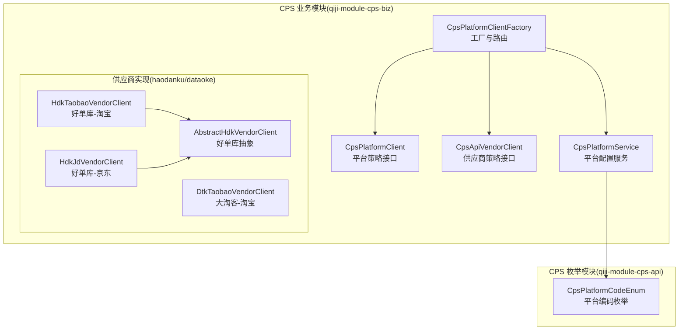
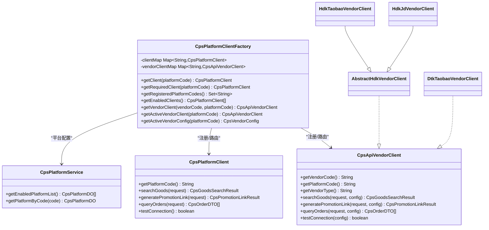
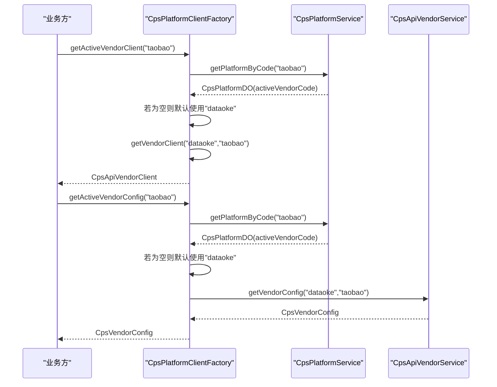
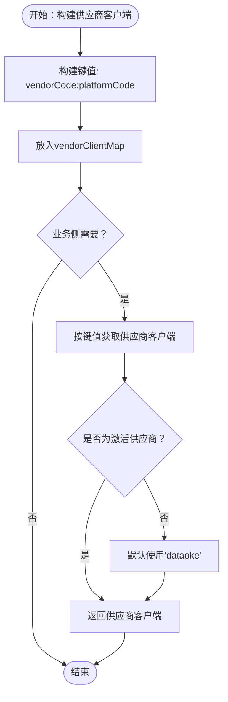
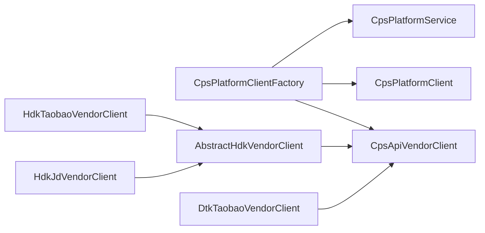

# 平台适配器设计

<cite>
**本文引用的文件**
- [CpsPlatformClientFactory.java](file://backend/qiji-module-cps/qiji-module-cps-biz/src/main/java/com/qiji/cps/module/cps/client/CpsPlatformClientFactory.java)
- [CpsPlatformClient.java](file://backend/qiji-module-cps/qiji-module-cps-biz/src/main/java/com/qiji/cps/module/cps/client/CpsPlatformClient.java)
- [CpsApiVendorClient.java](file://backend/qiji-module-cps/qiji-module-cps-biz/src/main/java/com/qiji/cps/module/cps/client/CpsApiVendorClient.java)
- [CpsPlatformCodeEnum.java](file://backend/qiji-module-cps/qiji-module-cps-api/src/main/java/com/qiji/cps/module/cps/enums/CpsPlatformCodeEnum.java)
- [CpsPlatformService.java](file://backend/qiji-module-cps/qiji-module-cps-biz/src/main/java/com/qiji/cps/module/cps/service/platform/CpsPlatformService.java)
- [AbstractHdkVendorClient.java](file://backend/qiji-module-cps/qiji-module-cps-biz/src/main/java/com/qiji/cps/module/cps/client/haodanku/AbstractHdkVendorClient.java)
- [HdkTaobaoVendorClient.java](file://backend/qiji-module-cps/qiji-module-cps-biz/src/main/java/com/qiji/cps/module/cps/client/haodanku/HdkTaobaoVendorClient.java)
- [HdkJdVendorClient.java](file://backend/qiji-module-cps/qiji-module-cps-biz/src/main/java/com/qiji/cps/module/cps/client/haodanku/HdkJdVendorClient.java)
- [DtkTaobaoVendorClient.java](file://backend/qiji-module-cps/qiji-module-cps-biz/src/main/java/com/qiji/cps/module/cps/client/dataoke/DtkTaobaoVendorClient.java)
- [CpsPlatformClientFactoryTest.java](file://backend/qiji-module-cps/qiji-module-cps-biz/src/test/java/com/qiji/cps/module/cps/client/CpsPlatformClientFactoryTest.java)
</cite>

## 目录
1. [引言](#引言)
2. [项目结构](#项目结构)
3. [核心组件](#核心组件)
4. [架构总览](#架构总览)
5. [详细组件分析](#详细组件分析)
6. [依赖关系分析](#依赖关系分析)
7. [性能考虑](#性能考虑)
8. [故障排查指南](#故障排查指南)
9. [结论](#结论)
10. [附录](#附录)

## 引言
本文件围绕平台适配器设计展开，重点阐述策略模式在CPS平台适配器中的实现原理，以及CpsPlatformClientFactory的双维度路由机制（平台维度与供应商维度）。文档将详细说明平台客户端的注册与管理流程（Spring Bean自动注入、客户端映射表维护、并发安全保证）、供应商维度路由的设计思路（vendorCode:platformCode键值构建、供应商客户端选择逻辑、默认供应商回退机制），并给出淘宝、京东等主流电商平台的适配器实现模式。最后覆盖平台配置管理、客户端生命周期管理与错误处理机制。

## 项目结构
本项目采用模块化分层组织，平台适配器相关的核心代码集中在“qiji-module-cps-biz”模块的client与service包内；平台与供应商枚举定义位于“qiji-module-cps-api”模块的enums包内。

图表来源
- [CpsPlatformClientFactory.java:1-197](file://backend/qiji-module-cps/qiji-module-cps-biz/src/main/java/com/qiji/cps/module/cps/client/CpsPlatformClientFactory.java#L1-L197)
- [CpsPlatformClient.java:1-55](file://backend/qiji-module-cps/qiji-module-cps-biz/src/main/java/com/qiji/cps/module/cps/client/CpsPlatformClient.java#L1-L55)
- [CpsApiVendorClient.java:1-84](file://backend/qiji-module-cps/qiji-module-cps-biz/src/main/java/com/qiji/cps/module/cps/client/CpsApiVendorClient.java#L1-L84)
- [CpsPlatformService.java:1-54](file://backend/qiji-module-cps/qiji-module-cps-biz/src/main/java/com/qiji/cps/module/cps/service/platform/CpsPlatformService.java#L1-L54)
- [AbstractHdkVendorClient.java:1-104](file://backend/qiji-module-cps/qiji-module-cps-biz/src/main/java/com/qiji/cps/module/cps/client/haodanku/AbstractHdkVendorClient.java#L1-L104)
- [HdkTaobaoVendorClient.java:1-193](file://backend/qiji-module-cps/qiji-module-cps-biz/src/main/java/com/qiji/cps/module/cps/client/haodanku/HdkTaobaoVendorClient.java#L1-L193)
- [HdkJdVendorClient.java:1-179](file://backend/qiji-module-cps/qiji-module-cps-biz/src/main/java/com/qiji/cps/module/cps/client/haodanku/HdkJdVendorClient.java#L1-L179)
- [DtkTaobaoVendorClient.java:1-216](file://backend/qiji-module-cps/qiji-module-cps-biz/src/main/java/com/qiji/cps/module/cps/client/dataoke/DtkTaobaoVendorClient.java#L1-L216)
- [CpsPlatformCodeEnum.java:1-47](file://backend/qiji-module-cps/qiji-module-cps-api/src/main/java/com/qiji/cps/module/cps/enums/CpsPlatformCodeEnum.java#L1-L47)

章节来源
- [CpsPlatformClientFactory.java:1-197](file://backend/qiji-module-cps/qiji-module-cps-biz/src/main/java/com/qiji/cps/module/cps/client/CpsPlatformClientFactory.java#L1-L197)
- [CpsPlatformClient.java:1-55](file://backend/qiji-module-cps/qiji-module-cps-biz/src/main/java/com/qiji/cps/module/cps/client/CpsPlatformClient.java#L1-L55)
- [CpsApiVendorClient.java:1-84](file://backend/qiji-module-cps/qiji-module-cps-biz/src/main/java/com/qiji/cps/module/cps/client/CpsApiVendorClient.java#L1-L84)
- [CpsPlatformService.java:1-54](file://backend/qiji-module-cps/qiji-module-cps-biz/src/main/java/com/qiji/cps/module/cps/service/platform/CpsPlatformService.java#L1-L54)
- [AbstractHdkVendorClient.java:1-104](file://backend/qiji-module-cps/qiji-module-cps-biz/src/main/java/com/qiji/cps/module/cps/client/haodanku/AbstractHdkVendorClient.java#L1-L104)
- [HdkTaobaoVendorClient.java:1-193](file://backend/qiji-module-cps/qiji-module-cps-biz/src/main/java/com/qiji/cps/module/cps/client/haodanku/HdkTaobaoVendorClient.java#L1-L193)
- [HdkJdVendorClient.java:1-179](file://backend/qiji-module-cps/qiji-module-cps-biz/src/main/java/com/qiji/cps/module/cps/client/haodanku/HdkJdVendorClient.java#L1-L179)
- [DtkTaobaoVendorClient.java:1-216](file://backend/qiji-module-cps/qiji-module-cps-biz/src/main/java/com/qiji/cps/module/cps/client/dataoke/DtkTaobaoVendorClient.java#L1-L216)
- [CpsPlatformCodeEnum.java:1-47](file://backend/qiji-module-cps/qiji-module-cps-api/src/main/java/com/qiji/cps/module/cps/enums/CpsPlatformCodeEnum.java#L1-L47)

## 核心组件
- 策略接口
  - 平台策略接口：CpsPlatformClient，定义平台维度的统一能力（搜索商品、生成推广链接、查询订单、连通性测试）。
  - 供应商策略接口：CpsApiVendorClient，定义供应商×平台双维度的能力，参数中显式注入CpsVendorConfig以实现配置与逻辑解耦。
- 工厂与路由：CpsPlatformClientFactory，负责：
  - Spring Bean自动注入平台与供应商客户端集合；
  - 启动时注册到clientMap与vendorClientMap；
  - 提供平台维度与供应商维度的路由方法；
  - 通过平台配置服务与供应商配置服务进行运行时配置获取与校验。
- 平台配置服务：CpsPlatformService，提供平台启用状态、平台配置查询等能力。
- 平台编码枚举：CpsPlatformCodeEnum，统一管理平台编码常量。
- 供应商实现示例：
  - 好单库抽象与具体实现：AbstractHdkVendorClient、HdkTaobaoVendorClient、HdkJdVendorClient；
  - 大淘客实现：DtkTaobaoVendorClient。

章节来源
- [CpsPlatformClient.java:1-55](file://backend/qiji-module-cps/qiji-module-cps-biz/src/main/java/com/qiji/cps/module/cps/client/CpsPlatformClient.java#L1-L55)
- [CpsApiVendorClient.java:1-84](file://backend/qiji-module-cps/qiji-module-cps-biz/src/main/java/com/qiji/cps/module/cps/client/CpsApiVendorClient.java#L1-L84)
- [CpsPlatformClientFactory.java:1-197](file://backend/qiji-module-cps/qiji-module-cps-biz/src/main/java/com/qiji/cps/module/cps/client/CpsPlatformClientFactory.java#L1-L197)
- [CpsPlatformService.java:1-54](file://backend/qiji-module-cps/qiji-module-cps-biz/src/main/java/com/qiji/cps/module/cps/service/platform/CpsPlatformService.java#L1-L54)
- [CpsPlatformCodeEnum.java:1-47](file://backend/qiji-module-cps/qiji-module-cps-api/src/main/java/com/qiji/cps/module/cps/enums/CpsPlatformCodeEnum.java#L1-L47)
- [AbstractHdkVendorClient.java:1-104](file://backend/qiji-module-cps/qiji-module-cps-biz/src/main/java/com/qiji/cps/module/cps/client/haodanku/AbstractHdkVendorClient.java#L1-L104)
- [HdkTaobaoVendorClient.java:1-193](file://backend/qiji-module-cps/qiji-module-cps-biz/src/main/java/com/qiji/cps/module/cps/client/haodanku/HdkTaobaoVendorClient.java#L1-L193)
- [HdkJdVendorClient.java:1-179](file://backend/qiji-module-cps/qiji-module-cps-biz/src/main/java/com/qiji/cps/module/cps/client/haodanku/HdkJdVendorClient.java#L1-L179)
- [DtkTaobaoVendorClient.java:1-216](file://backend/qiji-module-cps/qiji-module-cps-biz/src/main/java/com/qiji/cps/module/cps/client/dataoke/DtkTaobaoVendorClient.java#L1-L216)

## 架构总览
策略模式+工厂+双维度路由的整体架构如下：

图表来源
- [CpsPlatformClientFactory.java:1-197](file://backend/qiji-module-cps/qiji-module-cps-biz/src/main/java/com/qiji/cps/module/cps/client/CpsPlatformClientFactory.java#L1-L197)
- [CpsPlatformClient.java:1-55](file://backend/qiji-module-cps/qiji-module-cps-biz/src/main/java/com/qiji/cps/module/cps/client/CpsPlatformClient.java#L1-L55)
- [CpsApiVendorClient.java:1-84](file://backend/qiji-module-cps/qiji-module-cps-biz/src/main/java/com/qiji/cps/module/cps/client/CpsApiVendorClient.java#L1-L84)
- [AbstractHdkVendorClient.java:1-104](file://backend/qiji-module-cps/qiji-module-cps-biz/src/main/java/com/qiji/cps/module/cps/client/haodanku/AbstractHdkVendorClient.java#L1-L104)
- [HdkTaobaoVendorClient.java:1-193](file://backend/qiji-module-cps/qiji-module-cps-biz/src/main/java/com/qiji/cps/module/cps/client/haodanku/HdkTaobaoVendorClient.java#L1-L193)
- [HdkJdVendorClient.java:1-179](file://backend/qiji-module-cps/qiji-module-cps-biz/src/main/java/com/qiji/cps/module/cps/client/haodanku/HdkJdVendorClient.java#L1-L179)
- [DtkTaobaoVendorClient.java:1-216](file://backend/qiji-module-cps/qiji-module-cps-biz/src/main/java/com/qiji/cps/module/cps/client/dataoke/DtkTaobaoVendorClient.java#L1-L216)
- [CpsPlatformService.java:1-54](file://backend/qiji-module-cps/qiji-module-cps-biz/src/main/java/com/qiji/cps/module/cps/service/platform/CpsPlatformService.java#L1-L54)

## 详细组件分析

### 工厂与双维度路由（CpsPlatformClientFactory）
- Spring Bean自动注入与初始化
  - 通过@Resource注入平台客户端与供应商客户端集合，并在@PostConstruct中完成注册。
  - 平台客户端注册到clientMap（平台编码→客户端）。
  - 供应商客户端注册到vendorClientMap（vendorCode:platformCode→客户端）。
- 并发安全
  - 使用ConcurrentHashMap维护两个映射表，确保多线程环境下的安全访问。
- 平台维度路由
  - getClient/getRequiredClient：根据平台编码获取平台客户端，后者在找不到时抛出异常。
  - getRegisteredPlatformCodes：返回所有已注册平台编码。
  - getEnabledClients：结合平台配置服务，过滤启用状态的平台客户端。
- 供应商维度路由
  - getVendorClient：直接按vendorCode:platformCode键值获取供应商客户端。
  - getActiveVendorClient：从平台配置中读取activeVendorCode，若为空则默认使用“dataoke”，再调用getVendorClient。
  - getActiveVendorConfig：通过供应商配置服务获取当前激活供应商的运行时配置（包含appKey、appSecret、API基础地址等）。

图表来源
- [CpsPlatformClientFactory.java:60-197](file://backend/qiji-module-cps/qiji-module-cps-biz/src/main/java/com/qiji/cps/module/cps/client/CpsPlatformClientFactory.java#L60-L197)
- [CpsPlatformService.java:44-51](file://backend/qiji-module-cps/qiji-module-cps-biz/src/main/java/com/qiji/cps/module/cps/service/platform/CpsPlatformService.java#L44-L51)

章节来源
- [CpsPlatformClientFactory.java:1-197](file://backend/qiji-module-cps/qiji-module-cps-biz/src/main/java/com/qiji/cps/module/cps/client/CpsPlatformClientFactory.java#L1-L197)

### 平台策略接口（CpsPlatformClient）
- 角色定位：面向业务层，按平台维度（如taobao/jd/pdd）进行路由。
- 能力边界：统一的商品搜索、推广转链、订单查询、连通性测试接口，便于业务方无感切换不同平台。

章节来源
- [CpsPlatformClient.java:1-55](file://backend/qiji-module-cps/qiji-module-cps-biz/src/main/java/com/qiji/cps/module/cps/client/CpsPlatformClient.java#L1-L55)

### 供应商策略接口（CpsApiVendorClient）
- 角色定位：面向底层实现，按供应商×平台双维度（vendorCode:platformCode）进行路由。
- 设计要点：
  - 明确区分平台维度与供应商维度，避免业务层直接感知供应商细节。
  - 将CpsVendorConfig作为参数传入，实现“配置与逻辑分离”，便于测试与多租户支持。

章节来源
- [CpsApiVendorClient.java:1-84](file://backend/qiji-module-cps/qiji-module-cps-biz/src/main/java/com/qiji/cps/module/cps/client/CpsApiVendorClient.java#L1-L84)

### 供应商实现模式（好单库与大淘客）
- 好单库抽象（AbstractHdkVendorClient）
  - 统一好单库的鉴权方式（apikey参数）、响应格式判断、转链域名替换等差异。
  - 重写转链流程以满足好单库v3域名与POST方式的要求。
- 好单库-淘宝（HdkTaobaoVendorClient）
  - 实现搜索、转链、订单查询的具体参数构建与响应解析。
  - 提供连接测试的端点与参数。
- 好单库-京东（HdkJdVendorClient）
  - 针对京东搜索接口的特殊响应码与字段映射进行适配。
  - 订单查询与转链参数按好单库规范实现。
- 大淘客-淘宝（DtkTaobaoVendorClient）
  - 实现大淘客开放平台的搜索、转链、订单查询接口。
  - 字段解析与排序规则按大淘客API文档实现。

图表来源
- [CpsPlatformClientFactory.java:72-80](file://backend/qiji-module-cps/qiji-module-cps-biz/src/main/java/com/qiji/cps/module/cps/client/CpsPlatformClientFactory.java#L72-L80)
- [CpsPlatformClientFactory.java:164-171](file://backend/qiji-module-cps/qiji-module-cps-biz/src/main/java/com/qiji/cps/module/cps/client/CpsPlatformClientFactory.java#L164-L171)

章节来源
- [AbstractHdkVendorClient.java:1-104](file://backend/qiji-module-cps/qiji-module-cps-biz/src/main/java/com/qiji/cps/module/cps/client/haodanku/AbstractHdkVendorClient.java#L1-L104)
- [HdkTaobaoVendorClient.java:1-193](file://backend/qiji-module-cps/qiji-module-cps-biz/src/main/java/com/qiji/cps/module/cps/client/haodanku/HdkTaobaoVendorClient.java#L1-L193)
- [HdkJdVendorClient.java:1-179](file://backend/qiji-module-cps/qiji-module-cps-biz/src/main/java/com/qiji/cps/module/cps/client/haodanku/HdkJdVendorClient.java#L1-L179)
- [DtkTaobaoVendorClient.java:1-216](file://backend/qiji-module-cps/qiji-module-cps-biz/src/main/java/com/qiji/cps/module/cps/client/dataoke/DtkTaobaoVendorClient.java#L1-L216)

### 平台配置管理与生命周期
- 平台配置服务（CpsPlatformService）
  - 提供平台启用列表与按编码查询平台配置的能力，供工厂在运行期过滤可用平台客户端。
- 工厂生命周期
  - @PostConstruct阶段完成Bean集合的注册与映射表初始化。
  - 运行期通过平台配置服务与供应商配置服务动态获取激活供应商与配置信息。

章节来源
- [CpsPlatformService.java:1-54](file://backend/qiji-module-cps/qiji-module-cps-biz/src/main/java/com/qiji/cps/module/cps/service/platform/CpsPlatformService.java#L1-L54)
- [CpsPlatformClientFactory.java:60-80](file://backend/qiji-module-cps/qiji-module-cps-biz/src/main/java/com/qiji/cps/module/cps/client/CpsPlatformClientFactory.java#L60-L80)

### 错误处理机制
- 未找到平台客户端：getClient返回null并记录告警日志；getRequiredClient抛出IllegalArgumentException。
- 供应商维度默认回退：当平台未设置activeVendorCode时，默认使用“dataoke”。
- 供应商客户端执行异常：供应商实现内部捕获异常并返回null或记录错误日志，保证上层调用不被中断。

章节来源
- [CpsPlatformClientFactory.java:90-110](file://backend/qiji-module-cps/qiji-module-cps-biz/src/main/java/com/qiji/cps/module/cps/client/CpsPlatformClientFactory.java#L90-L110)
- [CpsPlatformClientFactory.java:164-171](file://backend/qiji-module-cps/qiji-module-cps-biz/src/main/java/com/qiji/cps/module/cps/client/CpsPlatformClientFactory.java#L164-L171)
- [AbstractHdkVendorClient.java:96-101](file://backend/qiji-module-cps/qiji-module-cps-biz/src/main/java/com/qiji/cps/module/cps/client/haodanku/AbstractHdkVendorClient.java#L96-L101)

## 依赖关系分析
- 组件耦合
  - 工厂对平台与供应商客户端接口具有依赖，但对具体实现无硬编码依赖，体现开闭原则。
  - 供应商实现通过抽象基类复用公共逻辑，降低重复代码。
- 外部依赖
  - 通过平台配置服务与供应商配置服务获取运行时配置，实现配置与逻辑解耦。
- 潜在循环依赖
  - 工厂与服务之间为单向依赖，未见循环依赖迹象。

图表来源
- [CpsPlatformClientFactory.java:1-197](file://backend/qiji-module-cps/qiji-module-cps-biz/src/main/java/com/qiji/cps/module/cps/client/CpsPlatformClientFactory.java#L1-L197)
- [CpsApiVendorClient.java:1-84](file://backend/qiji-module-cps/qiji-module-cps-biz/src/main/java/com/qiji/cps/module/cps/client/CpsApiVendorClient.java#L1-L84)
- [AbstractHdkVendorClient.java:1-104](file://backend/qiji-module-cps/qiji-module-cps-biz/src/main/java/com/qiji/cps/module/cps/client/haodanku/AbstractHdkVendorClient.java#L1-L104)
- [HdkTaobaoVendorClient.java:1-193](file://backend/qiji-module-cps/qiji-module-cps-biz/src/main/java/com/qiji/cps/module/cps/client/haodanku/HdkTaobaoVendorClient.java#L1-L193)
- [HdkJdVendorClient.java:1-179](file://backend/qiji-module-cps/qiji-module-cps-biz/src/main/java/com/qiji/cps/module/cps/client/haodanku/HdkJdVendorClient.java#L1-L179)
- [DtkTaobaoVendorClient.java:1-216](file://backend/qiji-module-cps/qiji-module-cps-biz/src/main/java/com/qiji/cps/module/cps/client/dataoke/DtkTaobaoVendorClient.java#L1-L216)

章节来源
- [CpsPlatformClientFactory.java:1-197](file://backend/qiji-module-cps/qiji-module-cps-biz/src/main/java/com/qiji/cps/module/cps/client/CpsPlatformClientFactory.java#L1-L197)
- [CpsApiVendorClient.java:1-84](file://backend/qiji-module-cps/qiji-module-cps-biz/src/main/java/com/qiji/cps/module/cps/client/CpsApiVendorClient.java#L1-L84)
- [AbstractHdkVendorClient.java:1-104](file://backend/qiji-module-cps/qiji-module-cps-biz/src/main/java/com/qiji/cps/module/cps/client/haodanku/AbstractHdkVendorClient.java#L1-L104)
- [HdkTaobaoVendorClient.java:1-193](file://backend/qiji-module-cps/qiji-module-cps-biz/src/main/java/com/qiji/cps/module/cps/client/haodanku/HdkTaobaoVendorClient.java#L1-L193)
- [HdkJdVendorClient.java:1-179](file://backend/qiji-module-cps/qiji-module-cps-biz/src/main/java/com/qiji/cps/module/cps/client/haodanku/HdkJdVendorClient.java#L1-L179)
- [DtkTaobaoVendorClient.java:1-216](file://backend/qiji-module-cps/qiji-module-cps-biz/src/main/java/com/qiji/cps/module/cps/client/dataoke/DtkTaobaoVendorClient.java#L1-L216)

## 性能考虑
- 并发安全：映射表采用ConcurrentHashMap，适合高并发场景下的读多写少访问。
- 初始化成本：@PostConstruct阶段一次性注册，运行期仅做查表操作，延迟极低。
- 供应商维度键值构建：字符串拼接简单高效，建议保持简洁以减少内存与CPU开销。
- 日志与异常：适度的日志输出有助于问题定位，但应避免在高频路径中产生过多IO。

## 故障排查指南
- 未找到平台适配器
  - 现象：getClient返回null，日志出现未找到适配器告警。
  - 排查：确认平台编码是否正确、对应Bean是否被Spring扫描并注册。
- 未找到供应商客户端
  - 现象：getActiveVendorClient返回null或抛出异常。
  - 排查：确认平台activeVendorCode配置、vendorCode:platformCode键值是否正确、供应商Bean是否注册。
- 默认供应商回退
  - 现象：平台未设置activeVendorCode时默认使用“dataoke”。
  - 排查：确认平台配置与默认逻辑一致。
- 连接测试失败
  - 现象：testConnection返回false或异常。
  - 排查：核对供应商配置（appKey/appSecret/baseUrl）、网络连通性与API端点。

章节来源
- [CpsPlatformClientFactory.java:90-110](file://backend/qiji-module-cps/qiji-module-cps-biz/src/main/java/com/qiji/cps/module/cps/client/CpsPlatformClientFactory.java#L90-L110)
- [CpsPlatformClientFactory.java:164-171](file://backend/qiji-module-cps/qiji-module-cps-biz/src/main/java/com/qiji/cps/module/cps/client/CpsPlatformClientFactory.java#L164-L171)
- [AbstractHdkVendorClient.java:96-101](file://backend/qiji-module-cps/qiji-module-cps-biz/src/main/java/com/qiji/cps/module/cps/client/haodanku/AbstractHdkVendorClient.java#L96-L101)

## 结论
本设计以策略模式为核心，通过工厂与双维度路由实现平台与供应商的灵活扩展。平台维度面向业务层，供应商维度面向底层实现，二者协同工作，既满足多平台接入需求，又支持同一平台对接多家供应商。Spring Bean自动注入与并发安全的数据结构保证了系统的可维护性与稳定性。通过明确的配置与逻辑分离，系统具备良好的可测试性与多租户支持能力。

## 附录
- 平台编码枚举：统一管理平台编码常量，确保跨模块一致性。
- 单元测试参考：CpsPlatformClientFactoryTest覆盖了平台与供应商维度的关键路由逻辑，可作为扩展新平台或供应商时的参考模板。

章节来源
- [CpsPlatformCodeEnum.java:1-47](file://backend/qiji-module-cps/qiji-module-cps-api/src/main/java/com/qiji/cps/module/cps/enums/CpsPlatformCodeEnum.java#L1-L47)
- [CpsPlatformClientFactoryTest.java:1-185](file://backend/qiji-module-cps/qiji-module-cps-biz/src/test/java/com/qiji/cps/module/cps/client/CpsPlatformClientFactoryTest.java#L1-L185)