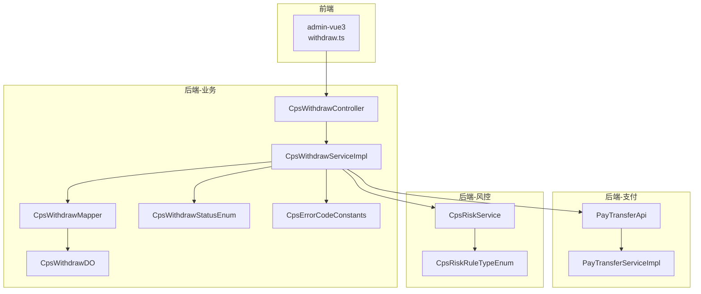
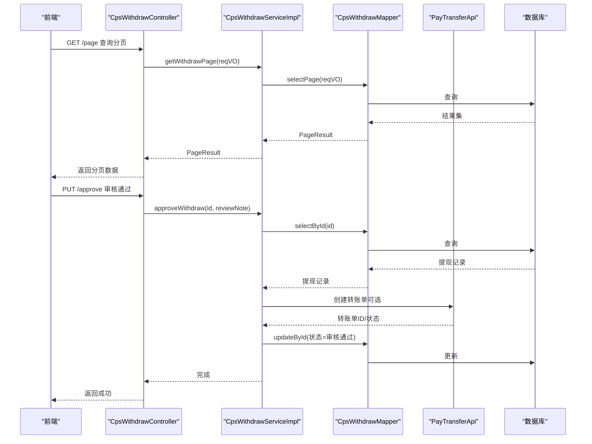
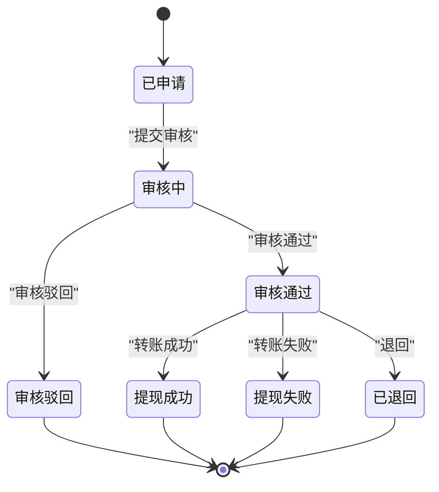
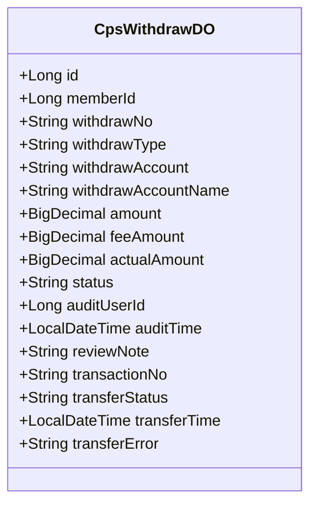
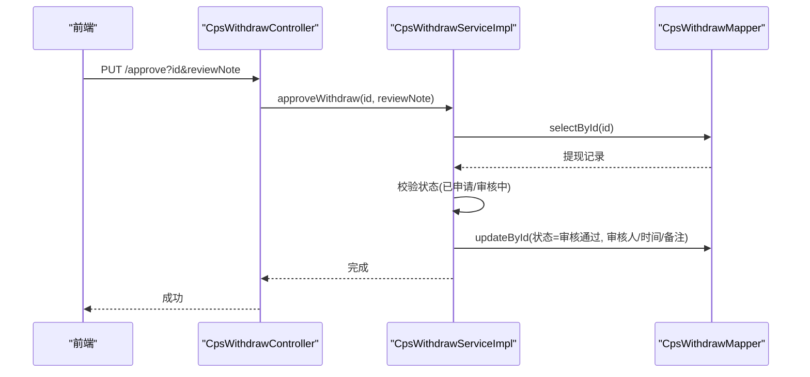
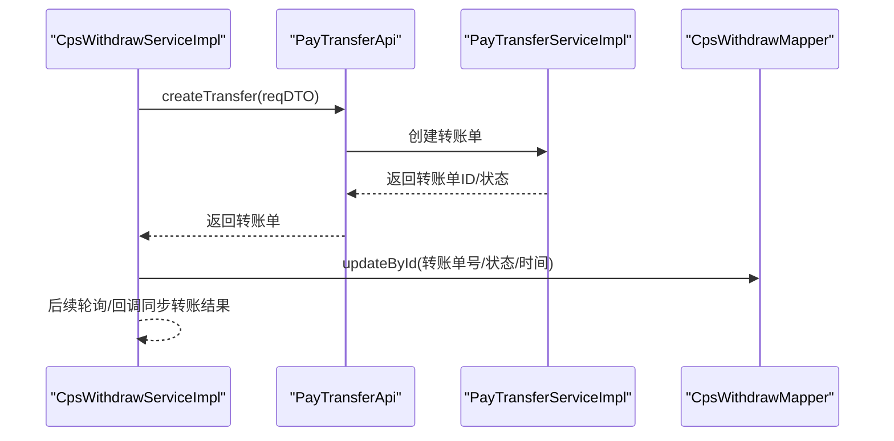
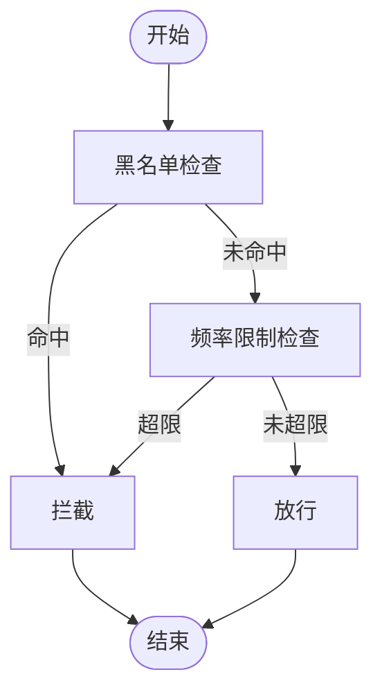
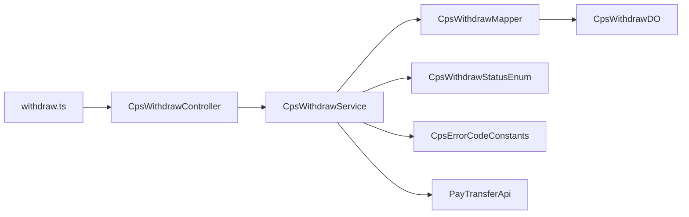

# 提现管理流程

<cite>
**本文引用的文件**
- [CpsWithdrawStatusEnum.java](file://backend/qiji-module-cps/qiji-module-cps-api/src/main/java/com/qiji/cps/module/cps/enums/CpsWithdrawStatusEnum.java)
- [CpsWithdrawDO.java](file://backend/qiji-module-cps/qiji-module-cps-biz/src/main/java/com/qiji/cps/module/cps/dal/dataobject/withdraw/CpsWithdrawDO.java)
- [CpsWithdrawMapper.java](file://backend/qiji-module-cps/qiji-module-cps-biz/src/main/java/com/qiji/cps/module/cps/dal/mysql/withdraw/CpsWithdrawMapper.java)
- [CpsWithdrawService.java](file://backend/qiji-module-cps/qiji-module-cps-biz/src/main/java/com/qiji/cps/module/cps/service/withdraw/CpsWithdrawService.java)
- [CpsWithdrawServiceImpl.java](file://backend/qiji-module-cps/qiji-module-cps-biz/src/main/java/com/qiji/cps/module/cps/service/withdraw/CpsWithdrawServiceImpl.java)
- [CpsWithdrawController.java](file://backend/qiji-module-cps/qiji-module-cps-biz/src/main/java/com/qiji/cps/module/cps/controller/admin/withdraw/CpsWithdrawController.java)
- [CpsWithdrawPageReqVO.java](file://backend/qiji-module-cps/qiji-module-cps-biz/src/main/java/com/qiji/cps/module/cps/controller/admin/withdraw/vo/CpsWithdrawPageReqVO.java)
- [CpsWithdrawRespVO.java](file://backend/qiji-module-cps/qiji-module-cps-biz/src/main/java/com/qiji/cps/module/cps/controller/admin/withdraw/vo/CpsWithdrawRespVO.java)
- [withdraw.ts](file://frontend/admin-vue3/src/api/cps/withdraw.ts)
- [CpsErrorCodeConstants.java](file://backend/qiji-module-cps/qiji-module-cps-api/src/main/java/com/qiji/cps/module/cps/enums/CpsErrorCodeConstants.java)
- [PayTransferApi.java](file://backend/qiji-module-pay/src/main/java/com/qiji/cps/module/pay/api/transfer/PayTransferApi.java)
- [PayTransferServiceImpl.java](file://backend/qiji-module-pay/src/main/java/com/qiji/cps/module/pay/service/transfer/PayTransferServiceImpl.java)
- [BrokerageWithdrawServiceImpl.java](file://backend/qiji-module-mall/qiji-module-trade/src/main/java/com/qiji/cps/module/trade/service/brokerage/BrokerageWithdrawServiceImpl.java)
- [CpsRiskService.java](file://backend/qiji-module-cps/qiji-module-cps-biz/src/main/java/com/qiji/cps/module/cps/service/risk/CpsRiskService.java)
- [CpsRiskRuleTypeEnum.java](file://backend/qiji-module-cps/qiji-module-cps-api/src/main/java/com/qiji/cps/module/cps/enums/CpsRiskRuleTypeEnum.java)
- [CpsRiskRulePageReqVO.java](file://backend/qiji-module-cps/qiji-module-cps-biz/src/main/java/com/qiji/cps/module/cps/controller/admin/risk/vo/CpsRiskRulePageReqVO.java)
- [CpsRiskRuleController.java](file://backend/qiji-module-cps/qiji-module-cps-biz/src/main/java/com/qiji/cps/module/cps/controller/admin/risk/CpsRiskRuleController.java)
</cite>

## 目录
1. [引言](#引言)
2. [项目结构](#项目结构)
3. [核心组件](#核心组件)
4. [架构总览](#架构总览)
5. [详细组件分析](#详细组件分析)
6. [依赖分析](#依赖分析)
7. [性能考虑](#性能考虑)
8. [故障排查指南](#故障排查指南)
9. [结论](#结论)
10. [附录](#附录)

## 引言
本技术文档围绕“提现管理流程”展开，覆盖提现申请从提交到完成的全流程设计与实现要点，包括：
- 提现申请提交与审核流程
- 资金转账对接与状态同步
- 到账通知与异常处理
- 提现状态管理机制（状态定义、转换规则、异常策略）
- 提现数据模型（金额验证、手续费计算、银行账户信息）
- 审核机制（人工审核、自动审核规则、风险控制）
- 合规性与安全防护

文档以代码级事实为基础，结合序列图、类图与流程图帮助读者快速理解系统行为。

## 项目结构
提现相关能力分布在多个模块中：
- API 层：状态枚举、错误码等通用定义
- 业务层：提现控制器、服务、数据对象、Mapper
- 前端：提现管理 API 定义
- 支付模块：转账接口与实现（用于对接第三方支付通道）
- 风控模块：频率限制与黑名单等风控能力

图表来源
- [CpsWithdrawController.java:27-75](file://backend/qiji-module-cps/qiji-module-cps-biz/src/main/java/com/qiji/cps/module/cps/controller/admin/withdraw/CpsWithdrawController.java#L27-L75)
- [CpsWithdrawServiceImpl.java:24-79](file://backend/qiji-module-cps/qiji-module-cps-biz/src/main/java/com/qiji/cps/module/cps/service/withdraw/CpsWithdrawServiceImpl.java#L24-L79)
- [CpsWithdrawMapper.java:15-27](file://backend/qiji-module-cps/qiji-module-cps-biz/src/main/java/com/qiji/cps/module/cps/dal/mysql/withdraw/CpsWithdrawMapper.java#L15-L27)
- [CpsWithdrawDO.java:18-100](file://backend/qiji-module-cps/qiji-module-cps-biz/src/main/java/com/qiji/cps/module/cps/dal/dataobject/withdraw/CpsWithdrawDO.java#L18-L100)
- [CpsWithdrawStatusEnum.java:14-43](file://backend/qiji-module-cps/qiji-module-cps-api/src/main/java/com/qiji/cps/module/cps/enums/CpsWithdrawStatusEnum.java#L14-L43)
- [CpsErrorCodeConstants.java:10-68](file://backend/qiji-module-cps/qiji-module-cps-api/src/main/java/com/qiji/cps/module/cps/enums/CpsErrorCodeConstants.java#L10-L68)
- [PayTransferApi.java:13-31](file://backend/qiji-module-pay/src/main/java/com/qiji/cps/module/pay/api/transfer/PayTransferApi.java#L13-L31)
- [PayTransferServiceImpl.java:104-130](file://backend/qiji-module-pay/src/main/java/com/qiji/cps/module/pay/service/transfer/PayTransferServiceImpl.java#L104-L130)
- [CpsRiskService.java:15-46](file://backend/qiji-module-cps/qiji-module-cps-biz/src/main/java/com/qiji/cps/module/cps/service/risk/CpsRiskService.java#L15-L46)
- [CpsRiskRuleTypeEnum.java:14-38](file://backend/qiji-module-cps/qiji-module-cps-api/src/main/java/com/qiji/cps/module/cps/enums/CpsRiskRuleTypeEnum.java#L14-L38)

章节来源
- [CpsWithdrawController.java:27-75](file://backend/qiji-module-cps/qiji-module-cps-biz/src/main/java/com/qiji/cps/module/cps/controller/admin/withdraw/CpsWithdrawController.java#L27-L75)
- [CpsWithdrawServiceImpl.java:24-79](file://backend/qiji-module-cps/qiji-module-cps-biz/src/main/java/com/qiji/cps/module/cps/service/withdraw/CpsWithdrawServiceImpl.java#L24-L79)
- [CpsWithdrawMapper.java:15-27](file://backend/qiji-module-cps/qiji-module-cps-biz/src/main/java/com/qiji/cps/module/cps/dal/mysql/withdraw/CpsWithdrawMapper.java#L15-L27)
- [CpsWithdrawDO.java:18-100](file://backend/qiji-module-cps/qiji-module-cps-biz/src/main/java/com/qiji/cps/module/cps/dal/dataobject/withdraw/CpsWithdrawDO.java#L18-L100)
- [CpsWithdrawStatusEnum.java:14-43](file://backend/qiji-module-cps/qiji-module-cps-api/src/main/java/com/qiji/cps/module/cps/enums/CpsWithdrawStatusEnum.java#L14-L43)
- [CpsErrorCodeConstants.java:10-68](file://backend/qiji-module-cps/qiji-module-cps-api/src/main/java/com/qiji/cps/module/cps/enums/CpsErrorCodeConstants.java#L10-L68)
- [PayTransferApi.java:13-31](file://backend/qiji-module-pay/src/main/java/com/qiji/cps/module/pay/api/transfer/PayTransferApi.java#L13-L31)
- [PayTransferServiceImpl.java:104-130](file://backend/qiji-module-pay/src/main/java/com/qiji/cps/module/pay/service/transfer/PayTransferServiceImpl.java#L104-L130)
- [CpsRiskService.java:15-46](file://backend/qiji-module-cps/qiji-module-cps-biz/src/main/java/com/qiji/cps/module/cps/service/risk/CpsRiskService.java#L15-L46)
- [CpsRiskRuleTypeEnum.java:14-38](file://backend/qiji-module-cps/qiji-module-cps-api/src/main/java/com/qiji/cps/module/cps/enums/CpsRiskRuleTypeEnum.java#L14-L38)

## 核心组件
- 状态枚举：定义提现状态集合及数组值，支撑前后端一致性与校验
- 数据对象：承载提现申请的字段，包含金额、手续费、账户信息、转账状态等
- Mapper：提供分页查询与条件过滤
- Service：实现审核通过/驳回、状态校验与更新
- Controller：对外暴露分页查询、详情、审核接口，并做权限控制
- 前端 API：定义提现管理的 HTTP 接口契约
- 支付接口：封装转账创建与查询，作为资金转账集成点
- 风控服务：提供黑名单与频率限制等风控能力

章节来源
- [CpsWithdrawStatusEnum.java:14-43](file://backend/qiji-module-cps/qiji-module-cps-api/src/main/java/com/qiji/cps/module/cps/enums/CpsWithdrawStatusEnum.java#L14-L43)
- [CpsWithdrawDO.java:18-100](file://backend/qiji-module-cps/qiji-module-cps-biz/src/main/java/com/qiji/cps/module/cps/dal/dataobject/withdraw/CpsWithdrawDO.java#L18-L100)
- [CpsWithdrawMapper.java:15-27](file://backend/qiji-module-cps/qiji-module-cps-biz/src/main/java/com/qiji/cps/module/cps/dal/mysql/withdraw/CpsWithdrawMapper.java#L15-L27)
- [CpsWithdrawService.java:12-46](file://backend/qiji-module-cps/qiji-module-cps-biz/src/main/java/com/qiji/cps/module/cps/service/withdraw/CpsWithdrawService.java#L12-L46)
- [CpsWithdrawServiceImpl.java:24-79](file://backend/qiji-module-cps/qiji-module-cps-biz/src/main/java/com/qiji/cps/module/cps/service/withdraw/CpsWithdrawServiceImpl.java#L24-L79)
- [CpsWithdrawController.java:27-75](file://backend/qiji-module-cps/qiji-module-cps-biz/src/main/java/com/qiji/cps/module/cps/controller/admin/withdraw/CpsWithdrawController.java#L27-L75)
- [withdraw.ts:36-57](file://frontend/admin-vue3/src/api/cps/withdraw.ts#L36-L57)
- [PayTransferApi.java:13-31](file://backend/qiji-module-pay/src/main/java/com/qiji/cps/module/pay/api/transfer/PayTransferApi.java#L13-L31)

## 架构总览
提现管理采用典型的三层结构：前端通过 HTTP 接口调用后端控制器；控制器委派给服务层；服务层访问数据访问层并调用支付模块完成转账；风控模块在必要时参与前置校验。

图表来源
- [CpsWithdrawController.java:35-73](file://backend/qiji-module-cps/qiji-module-cps-biz/src/main/java/com/qiji/cps/module/cps/controller/admin/withdraw/CpsWithdrawController.java#L35-L73)
- [CpsWithdrawServiceImpl.java:41-77](file://backend/qiji-module-cps/qiji-module-cps-biz/src/main/java/com/qiji/cps/module/cps/service/withdraw/CpsWithdrawServiceImpl.java#L41-L77)
- [CpsWithdrawMapper.java:18-25](file://backend/qiji-module-cps/qiji-module-cps-biz/src/main/java/com/qiji/cps/module/cps/dal/mysql/withdraw/CpsWithdrawMapper.java#L18-L25)
- [PayTransferApi.java:13-31](file://backend/qiji-module-pay/src/main/java/com/qiji/cps/module/pay/api/transfer/PayTransferApi.java#L13-L31)

## 详细组件分析

### 状态管理机制
- 状态枚举定义了完整的生命周期状态，包括“已申请、审核中、审核通过、审核驳回、提现成功、提现失败、已退回”
- 服务层在审核时对当前状态进行合法性校验，仅允许在“已申请”或“审核中”状态下执行审核动作
- 审核通过/驳回会更新审核人、审核时间、审核备注，并将状态推进至对应目标状态

图表来源
- [CpsWithdrawStatusEnum.java:16-25](file://backend/qiji-module-cps/qiji-module-cps-api/src/main/java/com/qiji/cps/module/cps/enums/CpsWithdrawStatusEnum.java#L16-L25)
- [CpsWithdrawServiceImpl.java:42-77](file://backend/qiji-module-cps/qiji-module-cps-biz/src/main/java/com/qiji/cps/module/cps/service/withdraw/CpsWithdrawServiceImpl.java#L42-L77)

章节来源
- [CpsWithdrawStatusEnum.java:14-43](file://backend/qiji-module-cps/qiji-module-cps-api/src/main/java/com/qiji/cps/module/cps/enums/CpsWithdrawStatusEnum.java#L14-L43)
- [CpsWithdrawServiceImpl.java:41-77](file://backend/qiji-module-cps/qiji-module-cps-biz/src/main/java/com/qiji/cps/module/cps/service/withdraw/CpsWithdrawServiceImpl.java#L41-L77)

### 提现数据模型与字段说明
- 关键字段：会员ID、提现单号、提现类型（alipay/wechat/bank）、账户与账户名、提现金额、手续费、实际到账金额、状态、审核人与时间、审核备注、转账单号、转账状态、转账时间与错误信息
- 字段约束：状态与转账状态分别由各自枚举或常量控制，确保数据一致性
- 金额相关：提现金额、手续费、实际到账金额三者关系需在业务侧保证（例如实际到账=提现金额-手续费）

图表来源
- [CpsWithdrawDO.java:26-100](file://backend/qiji-module-cps/qiji-module-cps-biz/src/main/java/com/qiji/cps/module/cps/dal/dataobject/withdraw/CpsWithdrawDO.java#L26-L100)

章节来源
- [CpsWithdrawDO.java:18-100](file://backend/qiji-module-cps/qiji-module-cps-biz/src/main/java/com/qiji/cps/module/cps/dal/dataobject/withdraw/CpsWithdrawDO.java#L18-L100)

### 审核流程与人工审核
- 控制器提供“审核通过”和“驳回”两个接口，均需具备相应权限
- 服务层在执行审核前进行存在性与状态合法性校验，非法状态直接抛出错误码
- 审核通过/驳回会写入审核人、审核时间与备注，并更新状态

图表来源
- [CpsWithdrawController.java:53-62](file://backend/qiji-module-cps/qiji-module-cps-biz/src/main/java/com/qiji/cps/module/cps/controller/admin/withdraw/CpsWithdrawController.java#L53-L62)
- [CpsWithdrawServiceImpl.java:42-58](file://backend/qiji-module-cps/qiji-module-cps-biz/src/main/java/com/qiji/cps/module/cps/service/withdraw/CpsWithdrawServiceImpl.java#L42-L58)
- [CpsWithdrawMapper.java:18-25](file://backend/qiji-module-cps/qiji-module-cps-biz/src/main/java/com/qiji/cps/module/cps/dal/mysql/withdraw/CpsWithdrawMapper.java#L18-L25)

章节来源
- [CpsWithdrawController.java:53-73](file://backend/qiji-module-cps/qiji-module-cps-biz/src/main/java/com/qiji/cps/module/cps/controller/admin/withdraw/CpsWithdrawController.java#L53-L73)
- [CpsWithdrawServiceImpl.java:41-77](file://backend/qiji-module-cps/qiji-module-cps-biz/src/main/java/com/qiji/cps/module/cps/service/withdraw/CpsWithdrawServiceImpl.java#L41-L77)

### 资金转账集成与状态同步
- 支付模块提供转账接口，支持创建转账单与查询转账单
- 在提现审核通过后，可调用支付模块创建转账单，随后根据转账结果同步提现状态
- 示例参考佣金提现实现：先校验转账单状态与金额一致性，再更新提现状态与时间、错误信息

图表来源
- [PayTransferApi.java:13-31](file://backend/qiji-module-pay/src/main/java/com/qiji/cps/module/pay/api/transfer/PayTransferApi.java#L13-L31)
- [PayTransferServiceImpl.java:104-130](file://backend/qiji-module-pay/src/main/java/com/qiji/cps/module/pay/service/transfer/PayTransferServiceImpl.java#L104-L130)
- [BrokerageWithdrawServiceImpl.java:234-267](file://backend/qiji-module-mall/qiji-module-trade/src/main/java/com/qiji/cps/module/trade/service/brokerage/BrokerageWithdrawServiceImpl.java#L234-L267)

章节来源
- [PayTransferApi.java:13-31](file://backend/qiji-module-pay/src/main/java/com/qiji/cps/module/pay/api/transfer/PayTransferApi.java#L13-L31)
- [PayTransferServiceImpl.java:104-130](file://backend/qiji-module-pay/src/main/java/com/qiji/cps/module/pay/service/transfer/PayTransferServiceImpl.java#L104-L130)
- [BrokerageWithdrawServiceImpl.java:234-267](file://backend/qiji-module-mall/qiji-module-trade/src/main/java/com/qiji/cps/module/trade/service/brokerage/BrokerageWithdrawServiceImpl.java#L234-L267)

### 风险控制与自动审核
- 风控服务提供“黑名单+频率限制”的基础风控能力，可在提现申请阶段调用
- 风控规则类型包含“频率限制”和“黑名单”，支持分页查询与管理
- 自动审核可通过风控结果决定是否放行或拦截

图表来源
- [CpsRiskService.java:15-46](file://backend/qiji-module-cps/qiji-module-cps-biz/src/main/java/com/qiji/cps/module/cps/service/risk/CpsRiskService.java#L15-L46)
- [CpsRiskRuleTypeEnum.java:14-38](file://backend/qiji-module-cps/qiji-module-cps-api/src/main/java/com/qiji/cps/module/cps/enums/CpsRiskRuleTypeEnum.java#L14-L38)
- [CpsRiskRulePageReqVO.java:18-26](file://backend/qiji-module-cps/qiji-module-cps-biz/src/main/java/com/qiji/cps/module/cps/controller/admin/risk/vo/CpsRiskRulePageReqVO.java#L18-L26)
- [CpsRiskRuleController.java:31-35](file://backend/qiji-module-cps/qiji-module-cps-biz/src/main/java/com/qiji/cps/module/cps/controller/admin/risk/CpsRiskRuleController.java#L31-L35)

章节来源
- [CpsRiskService.java:15-46](file://backend/qiji-module-cps/qiji-module-cps-biz/src/main/java/com/qiji/cps/module/cps/service/risk/CpsRiskService.java#L15-L46)
- [CpsRiskRuleTypeEnum.java:14-38](file://backend/qiji-module-cps/qiji-module-cps-api/src/main/java/com/qiji/cps/module/cps/enums/CpsRiskRuleTypeEnum.java#L14-L38)
- [CpsRiskRulePageReqVO.java:18-26](file://backend/qiji-module-cps/qiji-module-cps-biz/src/main/java/com/qiji/cps/module/cps/controller/admin/risk/vo/CpsRiskRulePageReqVO.java#L18-L26)
- [CpsRiskRuleController.java:31-35](file://backend/qiji-module-cps/qiji-module-cps-biz/src/main/java/com/qiji/cps/module/cps/controller/admin/risk/CpsRiskRuleController.java#L31-L35)

### 前端交互与数据展示
- 前端定义了提现分页、详情、审核通过、驳回等接口契约
- 响应 VO 与数据对象字段保持一致，便于前后端协作

章节来源
- [withdraw.ts:36-57](file://frontend/admin-vue3/src/api/cps/withdraw.ts#L36-L57)
- [CpsWithdrawRespVO.java:14-73](file://backend/qiji-module-cps/qiji-module-cps-biz/src/main/java/com/qiji/cps/module/cps/controller/admin/withdraw/vo/CpsWithdrawRespVO.java#L14-L73)

## 依赖分析
- 控制器依赖服务接口，服务实现依赖 Mapper 与支付接口
- 数据对象依赖状态枚举，错误码集中定义于统一枚举
- 前端通过 API 文件与后端控制器对接

图表来源
- [CpsWithdrawController.java:27-75](file://backend/qiji-module-cps/qiji-module-cps-biz/src/main/java/com/qiji/cps/module/cps/controller/admin/withdraw/CpsWithdrawController.java#L27-L75)
- [CpsWithdrawServiceImpl.java:24-79](file://backend/qiji-module-cps/qiji-module-cps-biz/src/main/java/com/qiji/cps/module/cps/service/withdraw/CpsWithdrawServiceImpl.java#L24-L79)
- [CpsWithdrawMapper.java:15-27](file://backend/qiji-module-cps/qiji-module-cps-biz/src/main/java/com/qiji/cps/module/cps/dal/mysql/withdraw/CpsWithdrawMapper.java#L15-L27)
- [CpsWithdrawDO.java:18-100](file://backend/qiji-module-cps/qiji-module-cps-biz/src/main/java/com/qiji/cps/module/cps/dal/dataobject/withdraw/CpsWithdrawDO.java#L18-L100)
- [CpsWithdrawStatusEnum.java:14-43](file://backend/qiji-module-cps/qiji-module-cps-api/src/main/java/com/qiji/cps/module/cps/enums/CpsWithdrawStatusEnum.java#L14-L43)
- [CpsErrorCodeConstants.java:10-68](file://backend/qiji-module-cps/qiji-module-cps-api/src/main/java/com/qiji/cps/module/cps/enums/CpsErrorCodeConstants.java#L10-L68)
- [PayTransferApi.java:13-31](file://backend/qiji-module-pay/src/main/java/com/qiji/cps/module/pay/api/transfer/PayTransferApi.java#L13-L31)
- [withdraw.ts:36-57](file://frontend/admin-vue3/src/api/cps/withdraw.ts#L36-L57)

章节来源
- [同上图表来源文件]

## 性能考虑
- 分页查询：通过 Mapper 的条件构造器进行高效分页，建议在常用查询字段建立索引（如会员ID、状态、创建时间）
- 审核操作：仅更新状态与审计字段，避免大字段频繁写入
- 转账同步：采用轮询或回调方式异步同步转账结果，降低实时调用压力
- 风控检查：黑名单与频率限制基于缓存与数据库组合，注意缓存失效与并发一致性

## 故障排查指南
- 提现不存在或状态非法
  - 现象：执行审核时报错“提现申请不存在”或“提现状态不合法”
  - 排查：确认提现ID正确、当前状态是否允许操作
  - 参考
    - [CpsErrorCodeConstants.java:38-42](file://backend/qiji-module-cps/qiji-module-cps-api/src/main/java/com/qiji/cps/module/cps/enums/CpsErrorCodeConstants.java#L38-L42)
    - [CpsWithdrawServiceImpl.java:44-49](file://backend/qiji-module-cps/qiji-module-cps-biz/src/main/java/com/qiji/cps/module/cps/service/withdraw/CpsWithdrawServiceImpl.java#L44-L49)

- 转账金额不一致或转账单状态未结束
  - 现象：同步转账结果时报错“金额不匹配”或“转账未结束”
  - 排查：核对转账单金额、状态与提现单是否一致
  - 参考
    - [BrokerageWithdrawServiceImpl.java:269-291](file://backend/qiji-module-mall/qiji-module-trade/src/main/java/com/qiji/cps/module/trade/service/brokerage/BrokerageWithdrawServiceImpl.java#L269-L291)

- 权限不足
  - 现象：接口返回无权限
  - 排查：确认登录用户具备“cps:withdraw:query”或“cps:withdraw:audit”权限
  - 参考
    - [CpsWithdrawController.java:37-67](file://backend/qiji-module-cps/qiji-module-cps-biz/src/main/java/com/qiji/cps/module/cps/controller/admin/withdraw/CpsWithdrawController.java#L37-L67)

章节来源
- [CpsErrorCodeConstants.java:38-42](file://backend/qiji-module-cps/qiji-module-cps-api/src/main/java/com/qiji/cps/module/cps/enums/CpsErrorCodeConstants.java#L38-L42)
- [CpsWithdrawServiceImpl.java:44-49](file://backend/qiji-module-cps/qiji-module-cps-biz/src/main/java/com/qiji/cps/module/cps/service/withdraw/CpsWithdrawServiceImpl.java#L44-L49)
- [BrokerageWithdrawServiceImpl.java:269-291](file://backend/qiji-module-mall/qiji-module-trade/src/main/java/com/qiji/cps/module/trade/service/brokerage/BrokerageWithdrawServiceImpl.java#L269-L291)
- [CpsWithdrawController.java:37-67](file://backend/qiji-module-cps/qiji-module-cps-biz/src/main/java/com/qiji/cps/module/cps/controller/admin/withdraw/CpsWithdrawController.java#L37-L67)

## 结论
提现管理流程以清晰的状态机为核心，结合风控前置与支付模块的转账能力，实现了从申请、审核到转账、同步的闭环。通过统一的错误码与数据模型，系统在可维护性与扩展性方面具备良好基础。后续可在转账回调与重试机制、手续费计算规则、合规审计日志等方面进一步完善。

## 附录
- 提现状态枚举与含义
  - 已申请、审核中、审核通过、审核驳回、提现成功、提现失败、已退回
  - 参考：[CpsWithdrawStatusEnum.java:16-25](file://backend/qiji-module-cps/qiji-module-cps-api/src/main/java/com/qiji/cps/module/cps/enums/CpsWithdrawStatusEnum.java#L16-L25)

- 提现错误码
  - 提现不存在、状态不合法、最低限额、当日次数上限
  - 参考：[CpsErrorCodeConstants.java:38-43](file://backend/qiji-module-cps/qiji-module-cps-api/src/main/java/com/qiji/cps/module/cps/enums/CpsErrorCodeConstants.java#L38-L43)

- 前端接口契约
  - 分页、详情、审核通过、驳回
  - 参考：[withdraw.ts:36-57](file://frontend/admin-vue3/src/api/cps/withdraw.ts#L36-L57)