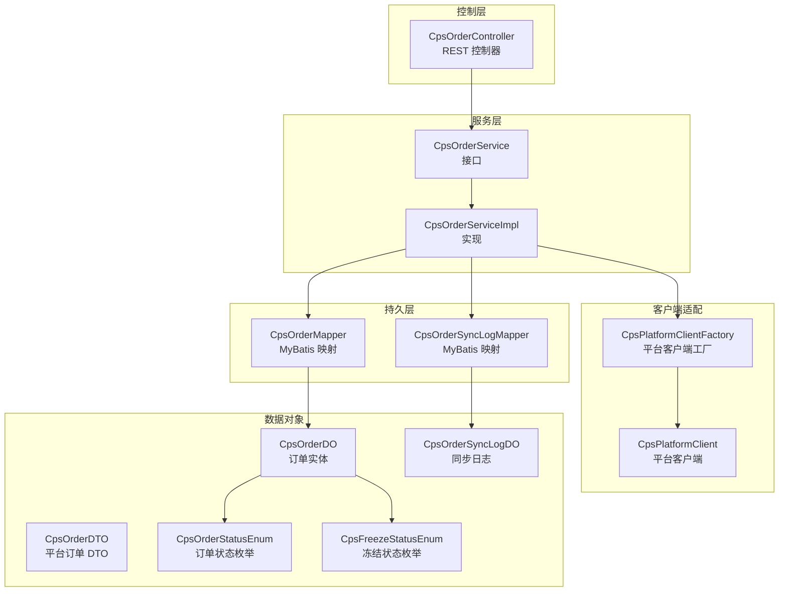
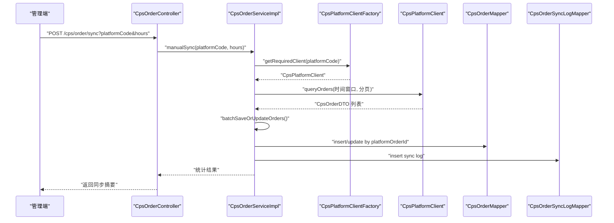
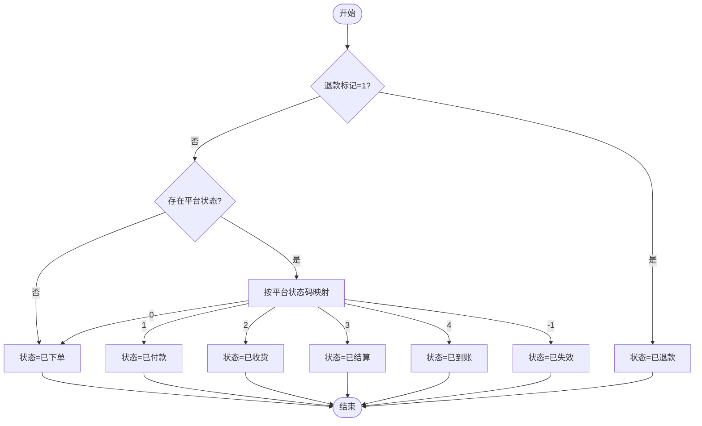
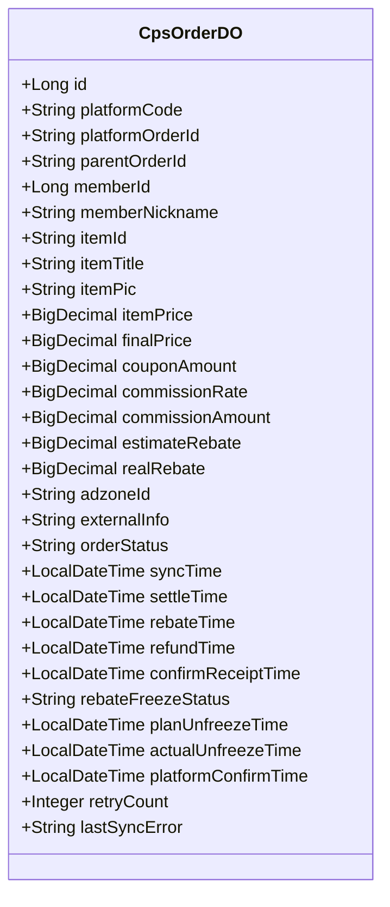
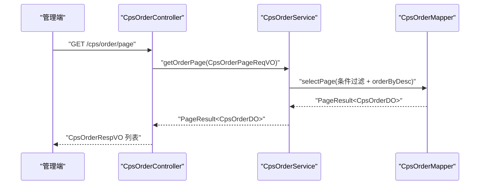
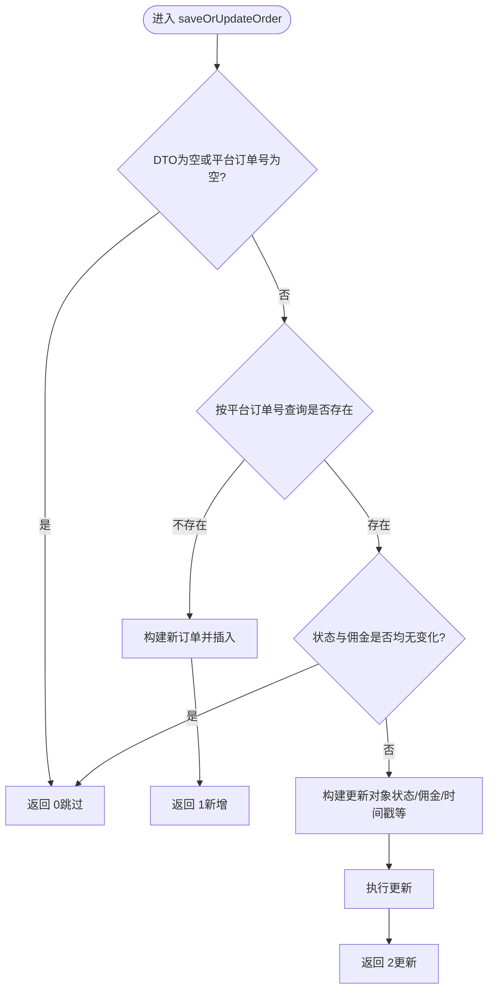
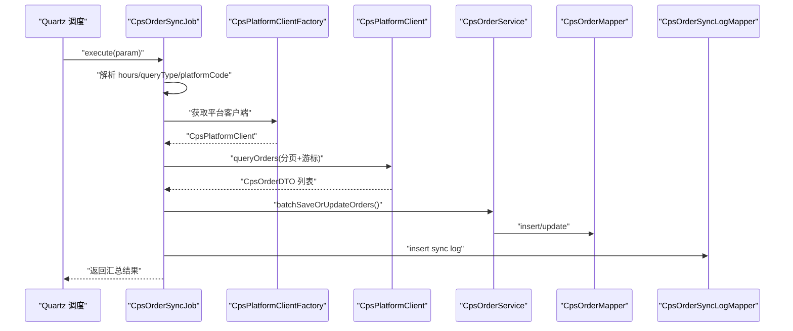
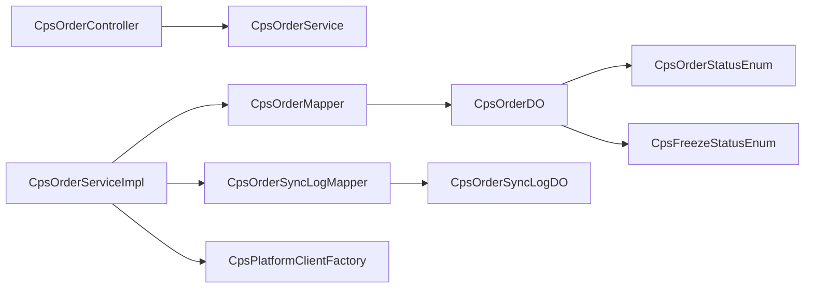

# 订单管理系统

<cite>
**本文引用的文件**
- [CpsOrderStatusEnum.java](file://backend/qiji-module-cps/qiji-module-cps-api/src/main/java/com/qiji/cps/module/cps/enums/CpsOrderStatusEnum.java)
- [CpsFreezeStatusEnum.java](file://backend/qiji-module-cps/qiji-module-cps-api/src/main/java/com/qiji/cps/module/cps/enums/CpsFreezeStatusEnum.java)
- [CpsOrderDO.java](file://backend/qiji-module-cps/qiji-module-cps-biz/src/main/java/com/qiji/cps/module/cps/dal/dataobject/order/CpsOrderDO.java)
- [CpsOrderDTO.java](file://backend/qiji-module-cps/qiji-module-cps-biz/src/main/java/com/qiji/cps/module/cps/client/dto/CpsOrderDTO.java)
- [CpsOrderService.java](file://backend/qiji-module-cps/qiji-module-cps-biz/src/main/java/com/qiji/cps/module/cps/service/order/CpsOrderService.java)
- [CpsOrderServiceImpl.java](file://backend/qiji-module-cps/qiji-module-cps-biz/src/main/java/com/qiji/cps/module/cps/service/order/CpsOrderServiceImpl.java)
- [CpsOrderController.java](file://backend/qiji-module-cps/qiji-module-cps-biz/src/main/java/com/qiji/cps/module/cps/controller/admin/order/CpsOrderController.java)
- [CpsOrderMapper.java](file://backend/qiji-module-cps/qiji-module-cps-biz/src/main/java/com/qiji/cps/module/cps/dal/mysql/order/CpsOrderMapper.java)
- [CpsOrderSyncLogDO.java](file://backend/qiji-module-cps/qiji-module-cps-biz/src/main/java/com/qiji/cps/module/cps/dal/dataobject/order/CpsOrderSyncLogDO.java)
- [CpsOrderSyncJob.java](file://backend/qiji-module-cps/qiji-module-cps-biz/src/main/java/com/qiji/cps/module/cps/job/CpsOrderSyncJob.java)
- [CpsOrderPageReqVO.java](file://backend/qiji-module-cps/qiji-module-cps-biz/src/main/java/com/qiji/cps/module/cps/controller/admin/order/vo/CpsOrderPageReqVO.java)
- [CpsOrderRespVO.java](file://backend/qiji-module-cps/qiji-module-cps-biz/src/main/java/com/qiji/cps/module/cps/controller/admin/order/vo/CpsOrderRespVO.java)
</cite>

## 目录
1. [引言](#引言)
2. [项目结构](#项目结构)
3. [核心组件](#核心组件)
4. [架构总览](#架构总览)
5. [详细组件分析](#详细组件分析)
6. [依赖关系分析](#依赖关系分析)
7. [性能考量](#性能考量)
8. [故障排查指南](#故障排查指南)
9. [结论](#结论)
10. [附录](#附录)

## 引言
本技术文档围绕订单管理系统展开，重点覆盖订单全链路追踪机制、状态管理与状态机、数据模型设计、查询接口实现、异步回调与幂等处理、以及重试与一致性保障策略。通过对核心代码文件的逐层剖析，帮助读者快速理解并高效运维该系统。

## 项目结构
订单管理模块位于后端工程的 cps 子模块中，采用“接口-实现-控制器-持久层”的分层组织方式，配合枚举、DTO、VO、DO 等数据对象，形成清晰的职责边界与可扩展的数据流。

图表来源
- [CpsOrderController.java:30-63](file://backend/qiji-module-cps/qiji-module-cps-biz/src/main/java/com/qiji/cps/module/cps/controller/admin/order/CpsOrderController.java#L30-L63)
- [CpsOrderService.java:15-59](file://backend/qiji-module-cps/qiji-module-cps-biz/src/main/java/com/qiji/cps/module/cps/service/order/CpsOrderService.java#L15-L59)
- [CpsOrderServiceImpl.java:38-197](file://backend/qiji-module-cps/qiji-module-cps-biz/src/main/java/com/qiji/cps/module/cps/service/order/CpsOrderServiceImpl.java#L38-L197)
- [CpsOrderMapper.java:22-77](file://backend/qiji-module-cps/qiji-module-cps-biz/src/main/java/com/qiji/cps/module/cps/dal/mysql/order/CpsOrderMapper.java#L22-L77)
- [CpsOrderSyncLogDO.java:26-104](file://backend/qiji-module-cps/qiji-module-cps-biz/src/main/java/com/qiji/cps/module/cps/dal/dataobject/order/CpsOrderSyncLogDO.java#L26-L104)
- [CpsOrderDO.java:27-155](file://backend/qiji-module-cps/qiji-module-cps-biz/src/main/java/com/qiji/cps/module/cps/dal/dataobject/order/CpsOrderDO.java#L27-L155)
- [CpsOrderStatusEnum.java:16-47](file://backend/qiji-module-cps/qiji-module-cps-api/src/main/java/com/qiji/cps/module/cps/enums/CpsOrderStatusEnum.java#L16-L47)
- [CpsFreezeStatusEnum.java:16-40](file://backend/qiji-module-cps/qiji-module-cps-api/src/main/java/com/qiji/cps/module/cps/enums/CpsFreezeStatusEnum.java#L16-L40)

章节来源
- [CpsOrderController.java:30-63](file://backend/qiji-module-cps/qiji-module-cps-biz/src/main/java/com/qiji/cps/module/cps/controller/admin/order/CpsOrderController.java#L30-L63)
- [CpsOrderService.java:15-59](file://backend/qiji-module-cps/qiji-module-cps-biz/src/main/java/com/qiji/cps/module/cps/service/order/CpsOrderService.java#L15-L59)
- [CpsOrderServiceImpl.java:38-197](file://backend/qiji-module-cps/qiji-module-cps-biz/src/main/java/com/qiji/cps/module/cps/service/order/CpsOrderServiceImpl.java#L38-L197)
- [CpsOrderMapper.java:22-77](file://backend/qiji-module-cps/qiji-module-cps-biz/src/main/java/com/qiji/cps/module/cps/dal/mysql/order/CpsOrderMapper.java#L22-L77)
- [CpsOrderSyncLogDO.java:26-104](file://backend/qiji-module-cps/qiji-module-cps-biz/src/main/java/com/qiji/cps/module/cps/dal/dataobject/order/CpsOrderSyncLogDO.java#L26-L104)
- [CpsOrderDO.java:27-155](file://backend/qiji-module-cps/qiji-module-cps-biz/src/main/java/com/qiji/cps/module/cps/dal/dataobject/order/CpsOrderDO.java#L27-L155)
- [CpsOrderStatusEnum.java:16-47](file://backend/qiji-module-cps/qiji-module-cps-api/src/main/java/com/qiji/cps/module/cps/enums/CpsOrderStatusEnum.java#L16-L47)
- [CpsFreezeStatusEnum.java:16-40](file://backend/qiji-module-cps/qiji-module-cps-api/src/main/java/com/qiji/cps/module/cps/enums/CpsFreezeStatusEnum.java#L16-L40)

## 核心组件
- 订单状态枚举：统一管理订单生命周期状态，提供状态映射与数组化能力，支撑状态机与查询过滤。
- 订单数据对象：承载订单核心字段，包含平台订单号、商品信息、价格与返利、状态与时间戳、冻结状态等。
- 订单服务接口与实现：负责幂等保存/更新、批量处理、手动同步、状态映射与时间解析。
- 订单持久层：提供分页查询、按平台/会员/状态/时间等多维过滤，以及待结算订单检索。
- 控制器：暴露分页查询、详情查询、手动同步等管理端接口。
- 同步日志：记录定时/手动同步的执行结果、耗时与错误信息，便于监控与排障。
- 平台适配：通过工厂模式获取平台客户端，统一拉取订单并进行幂等落库。

章节来源
- [CpsOrderStatusEnum.java:16-47](file://backend/qiji-module-cps/qiji-module-cps-api/src/main/java/com/qiji/cps/module/cps/enums/CpsOrderStatusEnum.java#L16-L47)
- [CpsOrderDO.java:27-155](file://backend/qiji-module-cps/qiji-module-cps-biz/src/main/java/com/qiji/cps/module/cps/dal/dataobject/order/CpsOrderDO.java#L27-L155)
- [CpsOrderService.java:15-59](file://backend/qiji-module-cps/qiji-module-cps-biz/src/main/java/com/qiji/cps/module/cps/service/order/CpsOrderService.java#L15-L59)
- [CpsOrderServiceImpl.java:38-197](file://backend/qiji-module-cps/qiji-module-cps-biz/src/main/java/com/qiji/cps/module/cps/service/order/CpsOrderServiceImpl.java#L38-L197)
- [CpsOrderMapper.java:22-77](file://backend/qiji-module-cps/qiji-module-cps-biz/src/main/java/com/qiji/cps/module/cps/dal/mysql/order/CpsOrderMapper.java#L22-L77)
- [CpsOrderController.java:30-63](file://backend/qiji-module-cps/qiji-module-cps-biz/src/main/java/com/qiji/cps/module/cps/controller/admin/order/CpsOrderController.java#L30-L63)
- [CpsOrderSyncLogDO.java:26-104](file://backend/qiji-module-cps/qiji-module-cps-biz/src/main/java/com/qiji/cps/module/cps/dal/dataobject/order/CpsOrderSyncLogDO.java#L26-L104)

## 架构总览
订单管理采用“定时任务 + 平台客户端 + 幂等落库 + 日志监控”的架构，确保跨平台订单数据的稳定接入与一致存储。

图表来源
- [CpsOrderController.java:52-61](file://backend/qiji-module-cps/qiji-module-cps-biz/src/main/java/com/qiji/cps/module/cps/controller/admin/order/CpsOrderController.java#L52-L61)
- [CpsOrderServiceImpl.java:146-197](file://backend/qiji-module-cps/qiji-module-cps-biz/src/main/java/com/qiji/cps/module/cps/service/order/CpsOrderServiceImpl.java#L146-L197)
- [CpsOrderSyncJob.java:59-175](file://backend/qiji-module-cps/qiji-module-cps-biz/src/main/java/com/qiji/cps/module/cps/job/CpsOrderSyncJob.java#L59-L175)
- [CpsOrderMapper.java:22-77](file://backend/qiji-module-cps/qiji-module-cps-biz/src/main/java/com/qiji/cps/module/cps/dal/mysql/order/CpsOrderMapper.java#L22-L77)
- [CpsOrderSyncLogDO.java:26-104](file://backend/qiji-module-cps/qiji-module-cps-biz/src/main/java/com/qiji/cps/module/cps/dal/dataobject/order/CpsOrderSyncLogDO.java#L26-L104)

## 详细组件分析

### 订单状态管理与状态机
- 状态定义：系统定义了完整的订单生命周期状态，包括已下单、已付款、已收货、已结算、已到账、已退款、已失效等。
- 状态映射：服务实现将平台原始状态与退款标记映射为系统统一状态，确保跨平台一致性。
- 状态转换规则：
  - 若退款标记为已退款，则直接置为已退款。
  - 否则依据平台状态码映射：0→已下单，1→已付款，2→已收货，3→已结算，4→已到账，-1→已失效。
- 状态机实现：通过状态枚举与映射函数形成确定性状态机，避免状态漂移与歧义。

图表来源
- [CpsOrderServiceImpl.java:252-269](file://backend/qiji-module-cps/qiji-module-cps-biz/src/main/java/com/qiji/cps/module/cps/service/order/CpsOrderServiceImpl.java#L252-L269)
- [CpsOrderStatusEnum.java:16-47](file://backend/qiji-module-cps/qiji-module-cps-api/src/main/java/com/qiji/cps/module/cps/enums/CpsOrderStatusEnum.java#L16-L47)

章节来源
- [CpsOrderStatusEnum.java:16-47](file://backend/qiji-module-cps/qiji-module-cps-api/src/main/java/com/qiji/cps/module/cps/enums/CpsOrderStatusEnum.java#L16-L47)
- [CpsOrderServiceImpl.java:252-269](file://backend/qiji-module-cps/qiji-module-cps-biz/src/main/java/com/qiji/cps/module/cps/service/order/CpsOrderServiceImpl.java#L252-L269)

### 订单数据模型与字段语义
- 主键与租户：继承基础租户模型，支持多租户隔离。
- 平台与订单号：平台编码与平台订单号唯一标识一条订单，用于幂等落库。
- 商品信息：商品ID、标题、主图、原价、券后价、优惠券金额等。
- 价格与返利：佣金比例（万分比）、预估佣金、预估返利、实际返利。
- 推广与归因：推广位ID、外部追踪参数；外部ID用于会员归因，尝试解析为会员ID。
- 状态与时序：订单状态、同步时间、结算时间、返利入账时间、退款时间、确认收货时间、平台确认时间。
- 冻结与解冻：返利冻结状态、计划解冻时间、实际解冻时间。
- 同步重试：重试次数与最后同步错误信息，便于重试与排障。

图表来源
- [CpsOrderDO.java:27-155](file://backend/qiji-module-cps/qiji-module-cps-biz/src/main/java/com/qiji/cps/module/cps/dal/dataobject/order/CpsOrderDO.java#L27-L155)

章节来源
- [CpsOrderDO.java:27-155](file://backend/qiji-module-cps/qiji-module-cps-biz/src/main/java/com/qiji/cps/module/cps/dal/dataobject/order/CpsOrderDO.java#L27-L155)

### 订单查询接口与分页排序
- 分页请求：支持平台编码、会员ID、订单状态、商品标题、平台订单号、创建时间区间等条件过滤。
- 排序规则：默认按主键降序，确保最新订单优先展示。
- 会员维度：提供按会员ID的分页查询，满足移动端“我的订单”场景。
- 统计接口：提供按日期的平台订单聚合与实时看板汇总，便于运营分析。

图表来源
- [CpsOrderController.java:35-41](file://backend/qiji-module-cps/qiji-module-cps-biz/src/main/java/com/qiji/cps/module/cps/controller/admin/order/CpsOrderController.java#L35-L41)
- [CpsOrderMapper.java:24-33](file://backend/qiji-module-cps/qiji-module-cps-biz/src/main/java/com/qiji/cps/module/cps/dal/mysql/order/CpsOrderMapper.java#L24-L33)
- [CpsOrderPageReqVO.java:18-39](file://backend/qiji-module-cps/qiji-module-cps-biz/src/main/java/com/qiji/cps/module/cps/controller/admin/order/vo/CpsOrderPageReqVO.java#L18-L39)
- [CpsOrderRespVO.java:16-99](file://backend/qiji-module-cps/qiji-module-cps-biz/src/main/java/com/qiji/cps/module/cps/controller/admin/order/vo/CpsOrderRespVO.java#L16-L99)

章节来源
- [CpsOrderController.java:35-41](file://backend/qiji-module-cps/qiji-module-cps-biz/src/main/java/com/qiji/cps/module/cps/controller/admin/order/CpsOrderController.java#L35-L41)
- [CpsOrderMapper.java:24-33](file://backend/qiji-module-cps/qiji-module-cps-biz/src/main/java/com/qiji/cps/module/cps/dal/mysql/order/CpsOrderMapper.java#L24-L33)
- [CpsOrderPageReqVO.java:18-39](file://backend/qiji-module-cps/qiji-module-cps-biz/src/main/java/com/qiji/cps/module/cps/controller/admin/order/vo/CpsOrderPageReqVO.java#L18-L39)
- [CpsOrderRespVO.java:16-99](file://backend/qiji-module-cps/qiji-module-cps-biz/src/main/java/com/qiji/cps/module/cps/controller/admin/order/vo/CpsOrderRespVO.java#L16-L99)

### 异步回调与幂等处理
- 幂等性：以平台订单号为主键进行存在性检查，若已存在则比较状态与佣金，无变化则跳过，避免重复更新。
- 状态更新：在更新路径中，仅更新必要字段（状态、佣金、时间戳等），并对收货/结算/退款等关键节点进行条件更新。
- 批量处理：批量保存/更新时统计新增、更新、跳过的数量，异常订单计入跳过并继续处理。
- 时间解析：对平台返回的时间字符串进行安全解析，失败时记录告警并忽略该字段。

图表来源
- [CpsOrderServiceImpl.java:74-125](file://backend/qiji-module-cps/qiji-module-cps-biz/src/main/java/com/qiji/cps/module/cps/service/order/CpsOrderServiceImpl.java#L74-L125)

章节来源
- [CpsOrderServiceImpl.java:74-125](file://backend/qiji-module-cps/qiji-module-cps-biz/src/main/java/com/qiji/cps/module/cps/service/order/CpsOrderServiceImpl.java#L74-L125)

### 订单同步与重试机制
- 定时任务：支持按小时回溯、按下单/付款/结算/更新时间维度查询，支持指定平台或全量平台同步。
- 游标翻页：平台客户端支持游标翻页，最多拉取固定页数，避免死循环。
- 统一落库：将拉取到的订单列表交由服务层进行批量幂等保存，记录同步日志。
- 重试与监控：同步日志记录耗时、新增/更新/跳过数量、错误信息，便于重试与监控。

图表来源
- [CpsOrderSyncJob.java:59-175](file://backend/qiji-module-cps/qiji-module-cps-biz/src/main/java/com/qiji/cps/module/cps/job/CpsOrderSyncJob.java#L59-L175)
- [CpsOrderServiceImpl.java:127-142](file://backend/qiji-module-cps/qiji-module-cps-biz/src/main/java/com/qiji/cps/module/cps/service/order/CpsOrderServiceImpl.java#L127-L142)
- [CpsOrderSyncLogDO.java:26-104](file://backend/qiji-module-cps/qiji-module-cps-biz/src/main/java/com/qiji/cps/module/cps/dal/dataobject/order/CpsOrderSyncLogDO.java#L26-L104)

章节来源
- [CpsOrderSyncJob.java:59-175](file://backend/qiji-module-cps/qiji-module-cps-biz/src/main/java/com/qiji/cps/module/cps/job/CpsOrderSyncJob.java#L59-L175)
- [CpsOrderServiceImpl.java:127-142](file://backend/qiji-module-cps/qiji-module-cps-biz/src/main/java/com/qiji/cps/module/cps/service/order/CpsOrderServiceImpl.java#L127-L142)
- [CpsOrderSyncLogDO.java:26-104](file://backend/qiji-module-cps/qiji-module-cps-biz/src/main/java/com/qiji/cps/module/cps/dal/dataobject/order/CpsOrderSyncLogDO.java#L26-L104)

### 订单号生成与平台映射
- 平台订单号：作为幂等主键，必须唯一对应平台的一笔订单。
- 平台编码：用于区分不同平台的订单域，便于后续适配与查询。
- 外部追踪参数：用于归因与扩展字段，系统会尝试从外部ID解析会员ID。

章节来源
- [CpsOrderDO.java:37-101](file://backend/qiji-module-cps/qiji-module-cps-biz/src/main/java/com/qiji/cps/module/cps/dal/dataobject/order/CpsOrderDO.java#L37-L101)
- [CpsOrderDTO.java:15-122](file://backend/qiji-module-cps/qiji-module-cps-biz/src/main/java/com/qiji/cps/module/cps/client/dto/CpsOrderDTO.java#L15-L122)
- [CpsOrderServiceImpl.java:204-244](file://backend/qiji-module-cps/qiji-module-cps-biz/src/main/java/com/qiji/cps/module/cps/service/order/CpsOrderServiceImpl.java#L204-L244)

## 依赖关系分析
- 控制器依赖服务接口，服务实现依赖持久层与平台客户端工厂。
- 订单实体依赖状态与冻结状态枚举，用于字段语义与校验。
- 同步日志贯穿定时/手动同步流程，提供可观测性与可追溯性。

图表来源
- [CpsOrderController.java:30-63](file://backend/qiji-module-cps/qiji-module-cps-biz/src/main/java/com/qiji/cps/module/cps/controller/admin/order/CpsOrderController.java#L30-L63)
- [CpsOrderService.java:15-59](file://backend/qiji-module-cps/qiji-module-cps-biz/src/main/java/com/qiji/cps/module/cps/service/order/CpsOrderService.java#L15-L59)
- [CpsOrderServiceImpl.java:38-197](file://backend/qiji-module-cps/qiji-module-cps-biz/src/main/java/com/qiji/cps/module/cps/service/order/CpsOrderServiceImpl.java#L38-L197)
- [CpsOrderMapper.java:22-77](file://backend/qiji-module-cps/qiji-module-cps-biz/src/main/java/com/qiji/cps/module/cps/dal/mysql/order/CpsOrderMapper.java#L22-L77)
- [CpsOrderDO.java:27-155](file://backend/qiji-module-cps/qiji-module-cps-biz/src/main/java/com/qiji/cps/module/cps/dal/dataobject/order/CpsOrderDO.java#L27-L155)
- [CpsOrderStatusEnum.java:16-47](file://backend/qiji-module-cps/qiji-module-cps-api/src/main/java/com/qiji/cps/module/cps/enums/CpsOrderStatusEnum.java#L16-L47)
- [CpsFreezeStatusEnum.java:16-40](file://backend/qiji-module-cps/qiji-module-cps-api/src/main/java/com/qiji/cps/module/cps/enums/CpsFreezeStatusEnum.java#L16-L40)
- [CpsOrderSyncLogDO.java:26-104](file://backend/qiji-module-cps/qiji-module-cps-biz/src/main/java/com/qiji/cps/module/cps/dal/dataobject/order/CpsOrderSyncLogDO.java#L26-L104)

章节来源
- [同上:30-63](file://backend/qiji-module-cps/qiji-module-cps-biz/src/main/java/com/qiji/cps/module/cps/controller/admin/order/CpsOrderController.java#L30-L63)

## 性能考量
- 批量处理：批量保存/更新时统计三类结果，异常订单不阻塞整体流程，提升吞吐。
- 分页与索引：分页查询使用条件过滤与主键降序，建议在高频查询字段建立合适索引。
- 游标翻页：限制最大页数，避免无限拉取导致资源浪费。
- 时间解析：对时间字符串进行安全解析，失败时记录告警，减少脏数据影响。
- 同步日志：记录耗时与统计指标，便于定位慢点与异常平台。

## 故障排查指南
- 同步失败：检查同步日志中的错误信息与耗时，确认平台凭证、时间窗口与查询类型参数。
- 幂等异常：核对平台订单号是否唯一，确认状态与佣金字段是否被正确映射。
- 退款处理：确认退款标记字段是否正确传递，系统会将订单置为已退款并记录退款时间。
- 会员归因：确认外部ID格式是否为合法会员ID，否则将忽略归因字段。

章节来源
- [CpsOrderSyncJob.java:156-167](file://backend/qiji-module-cps/qiji-module-cps-biz/src/main/java/com/qiji/cps/module/cps/job/CpsOrderSyncJob.java#L156-L167)
- [CpsOrderServiceImpl.java:115-124](file://backend/qiji-module-cps/qiji-module-cps-biz/src/main/java/com/qiji/cps/module/cps/service/order/CpsOrderServiceImpl.java#L115-L124)
- [CpsOrderSyncLogDO.java:99-102](file://backend/qiji-module-cps/qiji-module-cps-biz/src/main/java/com/qiji/cps/module/cps/dal/dataobject/order/CpsOrderSyncLogDO.java#L99-L102)

## 结论
该订单管理系统通过统一的状态枚举、幂等的保存逻辑、完善的同步日志与灵活的查询接口，实现了跨平台订单数据的高可靠接入与可观测性。结合状态机与条件更新策略，系统在保证数据一致性的同时，具备良好的扩展性与运维友好性。

## 附录
- 订单状态枚举：已下单、已付款、已收货、已结算、已到账、已退款、已失效。
- 冻结状态枚举：待冻结、已冻结、解冻中、已解冻。
- 关键字段：平台订单号、商品信息、价格与返利、状态与时序、冻结状态、外部追踪参数。
- 接口能力：分页查询、详情查询、手动同步、按会员维度查询、统计看板。