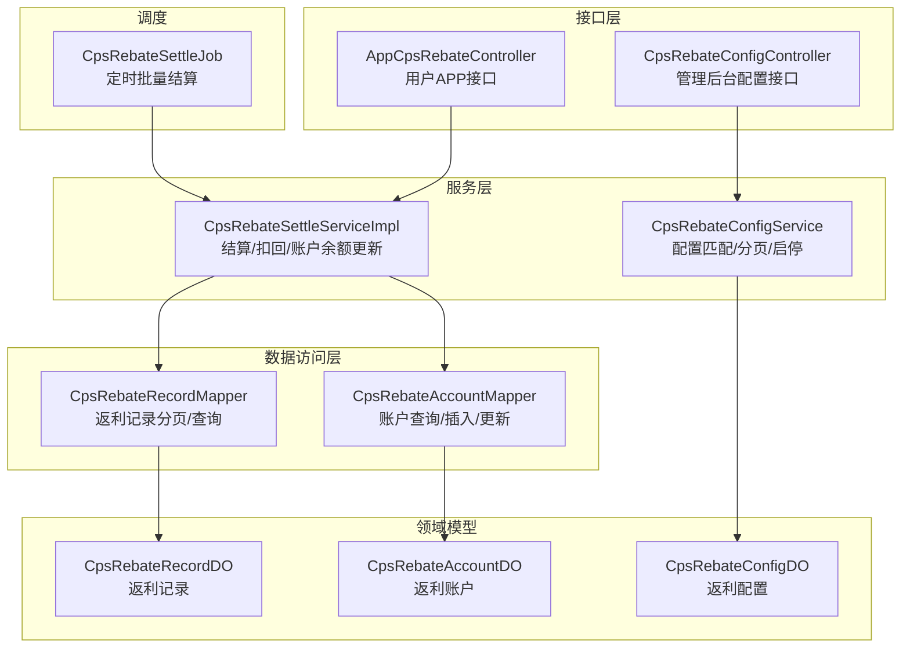
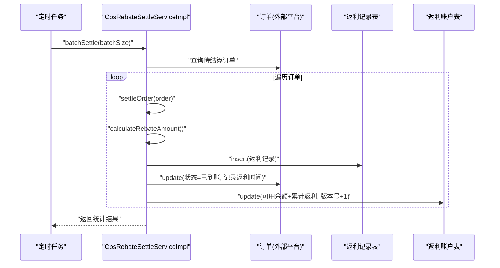
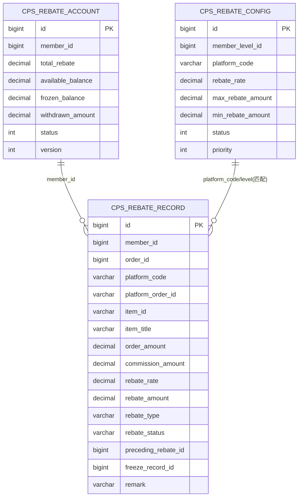
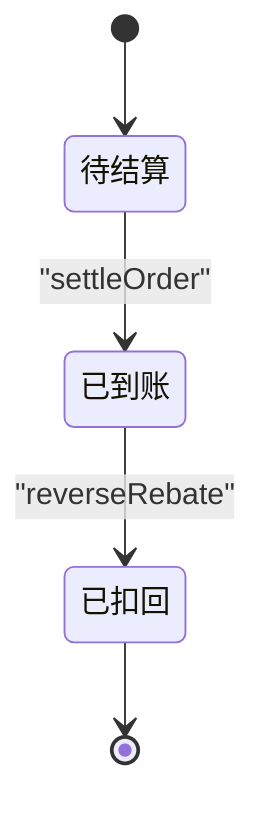
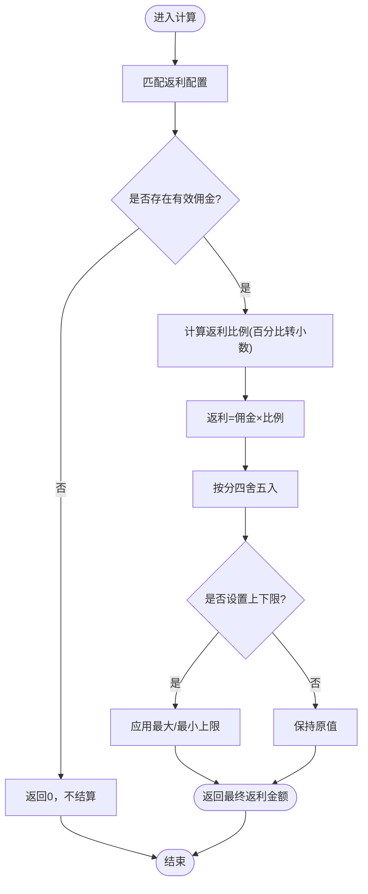
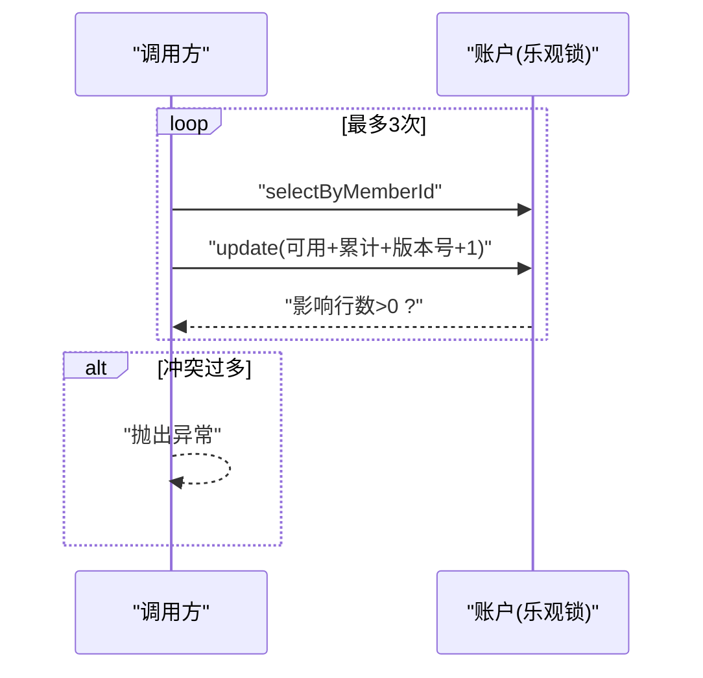
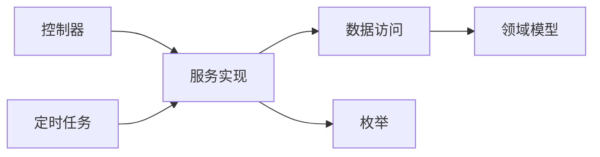

# 返利计算引擎

<cite>
**本文引用的文件**
- [CpsRebateStatusEnum.java](file://backend/qiji-module-cps/qiji-module-cps-api/src/main/java/com/qiji/cps/module/cps/enums/CpsRebateStatusEnum.java)
- [CpsRebateTypeEnum.java](file://backend/qiji-module-cps/qiji-module-cps-api/src/main/java/com/qiji/cps/module/cps/enums/CpsRebateTypeEnum.java)
- [CpsRebateAccountDO.java](file://backend/qiji-module-cps/qiji-module-cps-biz/src/main/java/com/qiji/cps/module/cps/dal/dataobject/rebate/CpsRebateAccountDO.java)
- [CpsRebateRecordDO.java](file://backend/qiji-module-cps/qiji-module-cps-biz/src/main/java/com/qiji/cps/module/cps/dal/dataobject/rebate/CpsRebateRecordDO.java)
- [CpsRebateConfigDO.java](file://backend/qiji-module-cps/qiji-module-cps-biz/src/main/java/com/qiji/cps/module/cps/dal/dataobject/rebate/CpsRebateConfigDO.java)
- [CpsRebateSettleServiceImpl.java](file://backend/qiji-module-cps/qiji-module-cps-biz/src/main/java/com/qiji/cps/module/cps/service/rebate/CpsRebateSettleServiceImpl.java)
- [CpsRebateSettleJob.java](file://backend/qiji-module-cps/qiji-module-cps-biz/src/main/java/com/qiji/cps/module/cps/job/CpsRebateSettleJob.java)
- [CpsRebateConfigService.java](file://backend/qiji-module-cps/qiji-module-cps-biz/src/main/java/com/qiji/cps/module/cps/service/rebate/CpsRebateConfigService.java)
- [CpsRebateRecordMapper.java](file://backend/qiji-module-cps/qiji-module-cps-biz/src/main/java/com/qiji/cps/module/cps/dal/mysql/rebate/CpsRebateRecordMapper.java)
- [AppCpsRebateController.java](file://backend/qiji-module-cps/qiji-module-cps-biz/src/main/java/com/qiji/cps/module/cps/controller/app/rebate/AppCpsRebateController.java)
- [CpsRebateConfigController.java](file://backend/qiji-module-cps/qiji-module-cps-biz/src/main/java/com/qiji/cps/module/cps/controller/admin/rebate/CpsRebateConfigController.java)
</cite>

## 目录
1. [简介](#简介)
2. [项目结构](#项目结构)
3. [核心组件](#核心组件)
4. [架构总览](#架构总览)
5. [详细组件分析](#详细组件分析)
6. [依赖分析](#依赖分析)
7. [性能考虑](#性能考虑)
8. [故障排查指南](#故障排查指南)
9. [结论](#结论)
10. [附录](#附录)

## 简介
本技术文档围绕“返利计算引擎”展开，系统性阐述返利规则配置、计算精度处理、批量结算流程；详解返利账户管理机制（CpsRebateAccountDO 的数据模型设计、余额管理、交易流水记录）；明确返利状态管理（CpsRebateStatusEnum 的状态定义、状态流转控制、异常状态处理）；说明返利计算的触发时机与执行流程（订单确认后的自动计算、手动重新计算、批量处理机制）；并提供返利对账与审计能力（计算准确性验证、差异处理、报表生成）以及性能优化策略与错误处理机制。

## 项目结构
返利计算引擎位于后端模块 qiji-module-cps 下，采用“接口层-服务层-数据访问层-领域模型”的分层组织方式：
- 枚举层：CpsRebateStatusEnum、CpsRebateTypeEnum 提供状态与类型定义
- 控制器层：面向管理后台与用户APP的控制器，负责请求接入与响应封装
- 服务层：CpsRebateSettleServiceImpl 实现结算、扣回、账户余额更新等核心业务
- 数据访问层：CpsRebateRecordMapper、CpsRebateAccountMapper 等提供数据库操作
- 领域模型：CpsRebateAccountDO、CpsRebateRecordDO、CpsRebateConfigDO 描述账户、记录与配置

图表来源
- [AppCpsRebateController.java:1-68](file://backend/qiji-module-cps/qiji-module-cps-biz/src/main/java/com/qiji/cps/module/cps/controller/app/rebate/AppCpsRebateController.java#L1-L68)
- [CpsRebateConfigController.java:1-88](file://backend/qiji-module-cps/qiji-module-cps-biz/src/main/java/com/qiji/cps/module/cps/controller/admin/rebate/CpsRebateConfigController.java#L1-L88)
- [CpsRebateSettleServiceImpl.java:1-308](file://backend/qiji-module-cps/qiji-module-cps-biz/src/main/java/com/qiji/cps/module/cps/service/rebate/CpsRebateSettleServiceImpl.java#L1-L308)
- [CpsRebateConfigService.java:1-65](file://backend/qiji-module-cps/qiji-module-cps-biz/src/main/java/com/qiji/cps/module/cps/service/rebate/CpsRebateConfigService.java#L1-L65)
- [CpsRebateRecordMapper.java:1-39](file://backend/qiji-module-cps/qiji-module-cps-biz/src/main/java/com/qiji/cps/module/cps/dal/mysql/rebate/CpsRebateRecordMapper.java#L1-L39)
- [CpsRebateSettleJob.java:1-60](file://backend/qiji-module-cps/qiji-module-cps-biz/src/main/java/com/qiji/cps/module/cps/job/CpsRebateSettleJob.java#L1-L60)

章节来源
- [CpsRebateStatusEnum.java:1-40](file://backend/qiji-module-cps/qiji-module-cps-api/src/main/java/com/qiji/cps/module/cps/enums/CpsRebateStatusEnum.java#L1-L40)
- [CpsRebateTypeEnum.java:1-40](file://backend/qiji-module-cps/qiji-module-cps-api/src/main/java/com/qiji/cps/module/cps/enums/CpsRebateTypeEnum.java#L1-L40)
- [CpsRebateAccountDO.java:1-63](file://backend/qiji-module-cps/qiji-module-cps-biz/src/main/java/com/qiji/cps/module/cps/dal/dataobject/rebate/CpsRebateAccountDO.java#L1-L63)
- [CpsRebateRecordDO.java:1-99](file://backend/qiji-module-cps/qiji-module-cps-biz/src/main/java/com/qiji/cps/module/cps/dal/dataobject/rebate/CpsRebateRecordDO.java#L1-L99)
- [CpsRebateConfigDO.java:1-64](file://backend/qiji-module-cps/qiji-module-cps-biz/src/main/java/com/qiji/cps/module/cps/dal/dataobject/rebate/CpsRebateConfigDO.java#L1-L64)
- [CpsRebateSettleServiceImpl.java:1-308](file://backend/qiji-module-cps/qiji-module-cps-biz/src/main/java/com/qiji/cps/module/cps/service/rebate/CpsRebateSettleServiceImpl.java#L1-L308)
- [CpsRebateSettleJob.java:1-60](file://backend/qiji-module-cps/qiji-module-cps-biz/src/main/java/com/qiji/cps/module/cps/job/CpsRebateSettleJob.java#L1-L60)
- [CpsRebateConfigService.java:1-65](file://backend/qiji-module-cps/qiji-module-cps-biz/src/main/java/com/qiji/cps/module/cps/service/rebate/CpsRebateConfigService.java#L1-L65)
- [CpsRebateRecordMapper.java:1-39](file://backend/qiji-module-cps/qiji-module-cps-biz/src/main/java/com/qiji/cps/module/cps/dal/mysql/rebate/CpsRebateRecordMapper.java#L1-L39)
- [AppCpsRebateController.java:1-68](file://backend/qiji-module-cps/qiji-module-cps-biz/src/main/java/com/qiji/cps/module/cps/controller/app/rebate/AppCpsRebateController.java#L1-L68)
- [CpsRebateConfigController.java:1-88](file://backend/qiji-module-cps/qiji-module-cps-biz/src/main/java/com/qiji/cps/module/cps/controller/admin/rebate/CpsRebateConfigController.java#L1-L88)

## 核心组件
- 状态与类型枚举：CpsRebateStatusEnum 定义“待结算/已到账/已扣回”，CpsRebateTypeEnum 定义“返利入账/返利扣回/系统调整”
- 配置模型：CpsRebateConfigDO 描述会员等级、平台编码、返利比例、上下限、优先级与状态
- 账户模型：CpsRebateAccountDO 描述累计返利总额、可用/冻结余额、已提现金额、状态与版本号
- 记录模型：CpsRebateRecordDO 描述订单维度的返利明细、比例、金额、类型、状态与关联字段
- 结算服务：CpsRebateSettleServiceImpl 实现订单结算、批量结算、扣回、账户余额更新（含乐观锁）
- 定时任务：CpsRebateSettleJob 周期性扫描并批量结算
- 配置服务：CpsRebateConfigService 提供配置匹配与分页查询
- 记录映射：CpsRebateRecordMapper 提供分页与幂等查询
- 控制器：AppCpsRebateController 对外暴露账户与记录查询；CpsRebateConfigController 对外暴露配置管理

章节来源
- [CpsRebateStatusEnum.java:1-40](file://backend/qiji-module-cps/qiji-module-cps-api/src/main/java/com/qiji/cps/module/cps/enums/CpsRebateStatusEnum.java#L1-L40)
- [CpsRebateTypeEnum.java:1-40](file://backend/qiji-module-cps/qiji-module-cps-api/src/main/java/com/qiji/cps/module/cps/enums/CpsRebateTypeEnum.java#L1-L40)
- [CpsRebateConfigDO.java:1-64](file://backend/qiji-module-cps/qiji-module-cps-biz/src/main/java/com/qiji/cps/module/cps/dal/dataobject/rebate/CpsRebateConfigDO.java#L1-L64)
- [CpsRebateAccountDO.java:1-63](file://backend/qiji-module-cps/qiji-module-cps-biz/src/main/java/com/qiji/cps/module/cps/dal/dataobject/rebate/CpsRebateAccountDO.java#L1-L63)
- [CpsRebateRecordDO.java:1-99](file://backend/qiji-module-cps/qiji-module-cps-biz/src/main/java/com/qiji/cps/module/cps/dal/dataobject/rebate/CpsRebateRecordDO.java#L1-L99)
- [CpsRebateSettleServiceImpl.java:1-308](file://backend/qiji-module-cps/qiji-module-cps-biz/src/main/java/com/qiji/cps/module/cps/service/rebate/CpsRebateSettleServiceImpl.java#L1-L308)
- [CpsRebateSettleJob.java:1-60](file://backend/qiji-module-cps/qiji-module-cps-biz/src/main/java/com/qiji/cps/module/cps/job/CpsRebateSettleJob.java#L1-L60)
- [CpsRebateConfigService.java:1-65](file://backend/qiji-module-cps/qiji-module-cps-biz/src/main/java/com/qiji/cps/module/cps/service/rebate/CpsRebateConfigService.java#L1-L65)
- [CpsRebateRecordMapper.java:1-39](file://backend/qiji-module-cps/qiji-module-cps-biz/src/main/java/com/qiji/cps/module/cps/dal/mysql/rebate/CpsRebateRecordMapper.java#L1-L39)
- [AppCpsRebateController.java:1-68](file://backend/qiji-module-cps/qiji-module-cps-biz/src/main/java/com/qiji/cps/module/cps/controller/app/rebate/AppCpsRebateController.java#L1-L68)
- [CpsRebateConfigController.java:1-88](file://backend/qiji-module-cps/qiji-module-cps-biz/src/main/java/com/qiji/cps/module/cps/controller/admin/rebate/CpsRebateConfigController.java#L1-L88)

## 架构总览
返利计算引擎遵循“配置驱动 + 事务一致性 + 乐观锁保障 + 定时批处理”的设计原则：
- 配置驱动：通过 CpsRebateConfigDO 的优先级与匹配规则，决定返利比例与上下限
- 事务一致性：结算与账户更新在单事务内完成，保证数据一致
- 乐观锁保障：账户余额更新采用乐观锁重试，避免并发写丢失
- 定时批处理：CpsRebateSettleJob 周期扫描并批量结算，提升吞吐

图表来源
- [CpsRebateSettleJob.java:1-60](file://backend/qiji-module-cps/qiji-module-cps-biz/src/main/java/com/qiji/cps/module/cps/job/CpsRebateSettleJob.java#L1-L60)
- [CpsRebateSettleServiceImpl.java:130-148](file://backend/qiji-module-cps/qiji-module-cps-biz/src/main/java/com/qiji/cps/module/cps/service/rebate/CpsRebateSettleServiceImpl.java#L130-L148)

## 详细组件分析

### 数据模型与关系
CpsRebateAccountDO、CpsRebateRecordDO、CpsRebateConfigDO 三者构成返利引擎的核心数据模型，彼此通过业务主键与外键关联，形成清晰的“账户-记录-配置”闭环。

图表来源
- [CpsRebateAccountDO.java:1-63](file://backend/qiji-module-cps/qiji-module-cps-biz/src/main/java/com/qiji/cps/module/cps/dal/dataobject/rebate/CpsRebateAccountDO.java#L1-L63)
- [CpsRebateRecordDO.java:1-99](file://backend/qiji-module-cps/qiji-module-cps-biz/src/main/java/com/qiji/cps/module/cps/dal/dataobject/rebate/CpsRebateRecordDO.java#L1-L99)
- [CpsRebateConfigDO.java:1-64](file://backend/qiji-module-cps/qiji-module-cps-biz/src/main/java/com/qiji/cps/module/cps/dal/dataobject/rebate/CpsRebateConfigDO.java#L1-L64)

章节来源
- [CpsRebateAccountDO.java:1-63](file://backend/qiji-module-cps/qiji-module-cps-biz/src/main/java/com/qiji/cps/module/cps/dal/dataobject/rebate/CpsRebateAccountDO.java#L1-L63)
- [CpsRebateRecordDO.java:1-99](file://backend/qiji-module-cps/qiji-module-cps-biz/src/main/java/com/qiji/cps/module/cps/dal/dataobject/rebate/CpsRebateRecordDO.java#L1-L99)
- [CpsRebateConfigDO.java:1-64](file://backend/qiji-module-cps/qiji-module-cps-biz/src/main/java/com/qiji/cps/module/cps/dal/dataobject/rebate/CpsRebateConfigDO.java#L1-L64)

### 返利状态管理
CpsRebateStatusEnum 定义了三种状态：
- 待结算（pending）
- 已到账（received）
- 已扣回（refunded）

状态流转控制严格遵循幂等与原子性：
- 正常结算：settleOrder 将记录状态置为“已到账”
- 扣回场景：reverseRebate 将原记录置为“已扣回”，并写入一条负值的返利记录
- 异常状态处理：当原记录状态非“已到账”时，扣回流程直接跳过，避免误操作

图表来源
- [CpsRebateStatusEnum.java:1-40](file://backend/qiji-module-cps/qiji-module-cps-api/src/main/java/com/qiji/cps/module/cps/enums/CpsRebateStatusEnum.java#L1-L40)
- [CpsRebateSettleServiceImpl.java:150-192](file://backend/qiji-module-cps/qiji-module-cps-biz/src/main/java/com/qiji/cps/module/cps/service/rebate/CpsRebateSettleServiceImpl.java#L150-L192)

章节来源
- [CpsRebateStatusEnum.java:1-40](file://backend/qiji-module-cps/qiji-module-cps-api/src/main/java/com/qiji/cps/module/cps/enums/CpsRebateStatusEnum.java#L1-L40)
- [CpsRebateSettleServiceImpl.java:150-192](file://backend/qiji-module-cps/qiji-module-cps-biz/src/main/java/com/qiji/cps/module/cps/service/rebate/CpsRebateSettleServiceImpl.java#L150-L192)

### 返利规则配置与匹配
CpsRebateConfigService 提供配置匹配能力，匹配优先级如下：
1) 会员等级 + 平台编码（精确匹配）
2) 会员等级 + 全平台（platformCode 为空）
3) 全等级 + 平台编码（memberLevelId 为空）
4) 全等级 + 全平台（兜底配置）

该策略确保在多维度约束下选择最优返利比例与上下限。

章节来源
- [CpsRebateConfigService.java:48-62](file://backend/qiji-module-cps/qiji-module-cps-biz/src/main/java/com/qiji/cps/module/cps/service/rebate/CpsRebateConfigService.java#L48-L62)
- [CpsRebateConfigDO.java:1-64](file://backend/qiji-module-cps/qiji-module-cps-biz/src/main/java/com/qiji/cps/module/cps/dal/dataobject/rebate/CpsRebateConfigDO.java#L1-L64)

### 计算精度与上下限处理
计算流程要点：
- 返利金额 = 佣金 × 返利比例（百分比转换为小数，保留四位精度）
- 结果按分（两位小数）四舍五入
- 应用配置的上下限（最大/最小返利金额），最终返利金额被钳制在区间内
- 若佣金为空或非正，直接返回 0，不进行结算

图表来源
- [CpsRebateSettleServiceImpl.java:222-253](file://backend/qiji-module-cps/qiji-module-cps-biz/src/main/java/com/qiji/cps/module/cps/service/rebate/CpsRebateSettleServiceImpl.java#L222-L253)
- [CpsRebateConfigDO.java:42-51](file://backend/qiji-module-cps/qiji-module-cps-biz/src/main/java/com/qiji/cps/module/cps/dal/dataobject/rebate/CpsRebateConfigDO.java#L42-L51)

章节来源
- [CpsRebateSettleServiceImpl.java:222-253](file://backend/qiji-module-cps/qiji-module-cps-biz/src/main/java/com/qiji/cps/module/cps/service/rebate/CpsRebateSettleServiceImpl.java#L222-L253)
- [CpsRebateConfigDO.java:42-51](file://backend/qiji-module-cps/qiji-module-cps-biz/src/main/java/com/qiji/cps/module/cps/dal/dataobject/rebate/CpsRebateConfigDO.java#L42-L51)

### 账户余额管理与乐观锁
账户余额更新采用乐观锁策略：
- 入账：可用余额与累计返利同时增加，版本号自增
- 扣回：可用余额减少，累计返利相应减少，余额不足时保底为 0
- 冲突重试：最多重试三次，避免并发写丢失

图表来源
- [CpsRebateSettleServiceImpl.java:260-305](file://backend/qiji-module-cps/qiji-module-cps-biz/src/main/java/com/qiji/cps/module/cps/service/rebate/CpsRebateSettleServiceImpl.java#L260-L305)

章节来源
- [CpsRebateSettleServiceImpl.java:260-305](file://backend/qiji-module-cps/qiji-module-cps-biz/src/main/java/com/qiji/cps/module/cps/service/rebate/CpsRebateSettleServiceImpl.java#L260-L305)

### 触发时机与执行流程
- 自动触发：订单状态为“已收货/已结算”且未入账时，settleOrder 自动计算并入账
- 定时批量：CpsRebateSettleJob 每小时扫描并批量结算，支持传参指定批次大小
- 手动重新计算：可通过管理后台接口或作业参数调整策略（当前代码未提供直接的“重新计算”入口，但可结合配置变更与批量任务实现）

章节来源
- [CpsRebateSettleServiceImpl.java:68-128](file://backend/qiji-module-cps/qiji-module-cps-biz/src/main/java/com/qiji/cps/module/cps/service/rebate/CpsRebateSettleServiceImpl.java#L68-L128)
- [CpsRebateSettleJob.java:1-60](file://backend/qiji-module-cps/qiji-module-cps-biz/src/main/java/com/qiji/cps/module/cps/job/CpsRebateSettleJob.java#L1-L60)

### 对账与审计
- 记录完整性：CpsRebateRecordMapper 支持按会员、平台、类型、状态、时间范围分页查询，便于对账
- 平台对账：通过 platformCode 与 platformOrderId 维度核对返利与订单的一致性
- 账户对账：CpsRebateAccountDO 的 totalRebate 与可用/冻结余额应与记录汇总一致
- 差异处理：发现差异时，结合记录与账户版本号定位并发冲突或重复结算问题

章节来源
- [CpsRebateRecordMapper.java:1-39](file://backend/qiji-module-cps/qiji-module-cps-biz/src/main/java/com/qiji/cps/module/cps/dal/mysql/rebate/CpsRebateRecordMapper.java#L1-L39)
- [CpsRebateAccountDO.java:1-63](file://backend/qiji-module-cps/qiji-module-cps-biz/src/main/java/com/qiji/cps/module/cps/dal/dataobject/rebate/CpsRebateAccountDO.java#L1-L63)

### 用户接口与权限
- 用户APP：AppCpsRebateController 提供“我的返利账户”与“返利记录分页”查询
- 管理后台：CpsRebateConfigController 提供配置的增删改查与分页查询

章节来源
- [AppCpsRebateController.java:1-68](file://backend/qiji-module-cps/qiji-module-cps-biz/src/main/java/com/qiji/cps/module/cps/controller/app/rebate/AppCpsRebateController.java#L1-L68)
- [CpsRebateConfigController.java:1-88](file://backend/qiji-module-cps/qiji-module-cps-biz/src/main/java/com/qiji/cps/module/cps/controller/admin/rebate/CpsRebateConfigController.java#L1-L88)

## 依赖分析
- 低耦合高内聚：服务层仅依赖接口与数据对象，避免跨模块耦合
- 明确边界：控制器仅负责请求接入与响应封装，业务逻辑集中在服务层
- 可观测性：日志覆盖关键路径（成功、跳过、失败），便于排障与审计

图表来源
- [CpsRebateSettleServiceImpl.java:1-308](file://backend/qiji-module-cps/qiji-module-cps-biz/src/main/java/com/qiji/cps/module/cps/service/rebate/CpsRebateSettleServiceImpl.java#L1-L308)
- [CpsRebateSettleJob.java:1-60](file://backend/qiji-module-cps/qiji-module-cps-biz/src/main/java/com/qiji/cps/module/cps/job/CpsRebateSettleJob.java#L1-L60)

章节来源
- [CpsRebateSettleServiceImpl.java:1-308](file://backend/qiji-module-cps/qiji-module-cps-biz/src/main/java/com/qiji/cps/module/cps/service/rebate/CpsRebateSettleServiceImpl.java#L1-L308)
- [CpsRebateSettleJob.java:1-60](file://backend/qiji-module-cps/qiji-module-cps-biz/src/main/java/com/qiji/cps/module/cps/job/CpsRebateSettleJob.java#L1-L60)

## 性能考虑
- 批量处理：CpsRebateSettleJob 支持通过参数指定批次大小，平衡吞吐与资源占用
- 并发控制：账户更新采用乐观锁与重试，降低锁竞争
- 精度控制：统一使用 BigDecimal 四舍五入到分，避免浮点误差累积
- 查询优化：记录分页与幂等查询使用条件过滤，减少无效扫描

## 故障排查指南
- 结算未生效
  - 检查订单状态是否满足“已收货/已结算”且未存在同类型返利记录
  - 核对佣金字段是否为空或非正
  - 查看日志中“跳过/失败”统计
- 余额不一致
  - 对比账户 totalRebate 与记录汇总
  - 检查是否存在“已扣回”记录抵消
  - 关注乐观锁冲突日志与重试次数
- 定时任务异常
  - 检查 Quartz 作业参数（batchSize）
  - 查看作业返回结果与日志

章节来源
- [CpsRebateSettleServiceImpl.java:130-148](file://backend/qiji-module-cps/qiji-module-cps-biz/src/main/java/com/qiji/cps/module/cps/service/rebate/CpsRebateSettleServiceImpl.java#L130-L148)
- [CpsRebateSettleJob.java:34-57](file://backend/qiji-module-cps/qiji-module-cps-biz/src/main/java/com/qiji/cps/module/cps/job/CpsRebateSettleJob.java#L34-L57)

## 结论
返利计算引擎以配置驱动为核心，通过严谨的计算精度控制、幂等的结算流程、乐观锁的并发保障与定时批量处理，实现了高可靠、可扩展的返利结算能力。配合完善的记录与账户模型，满足对账与审计需求，并为后续扩展（如手动重新计算、差异化规则）提供了清晰的演进路径。

## 附录
- 关键流程图与类图已在前述章节中给出，读者可结合对应源码文件进一步理解实现细节
- 如需扩展功能（例如“手动重新计算”），可在现有服务层基础上新增接口与作业，复用现有配置匹配与账户更新逻辑