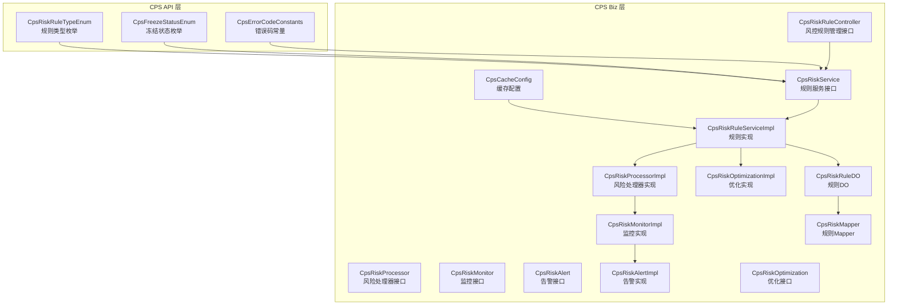
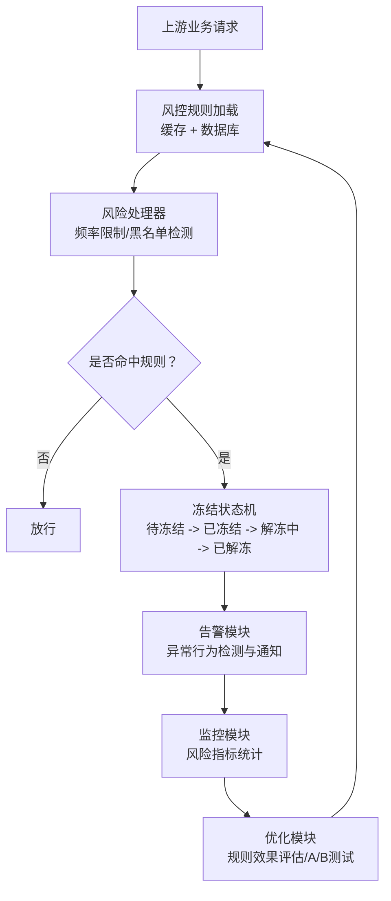
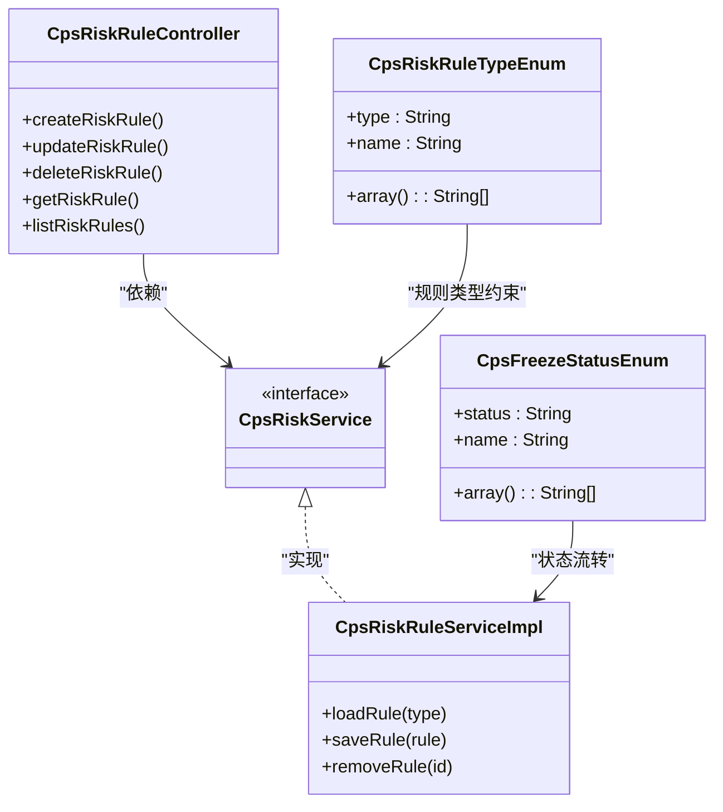
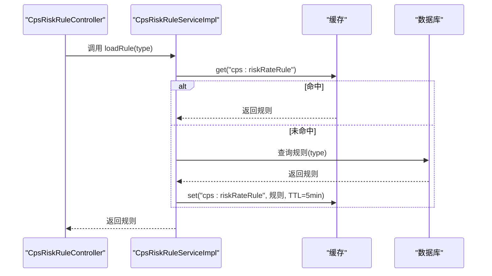
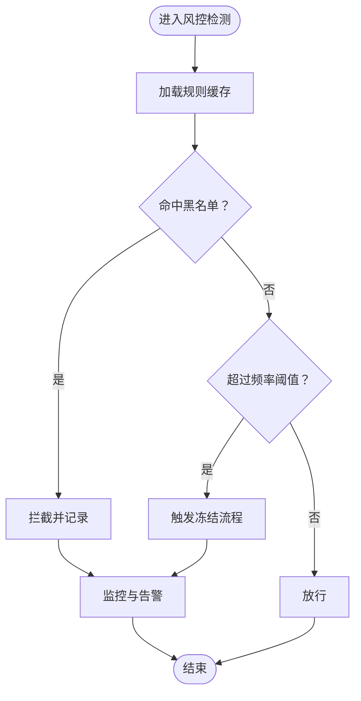
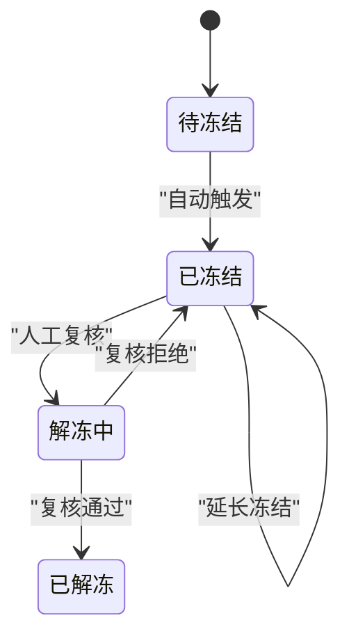
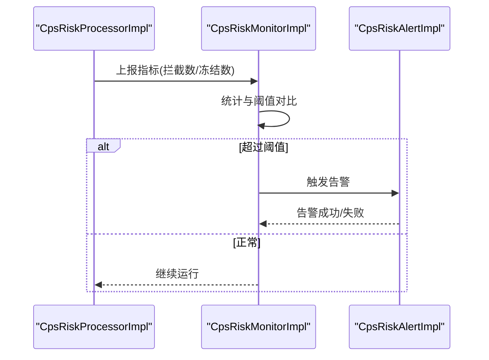
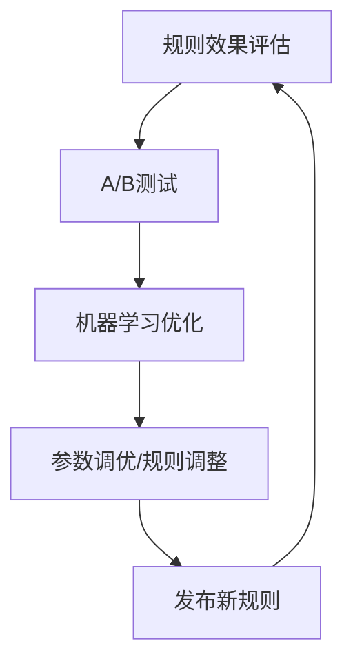
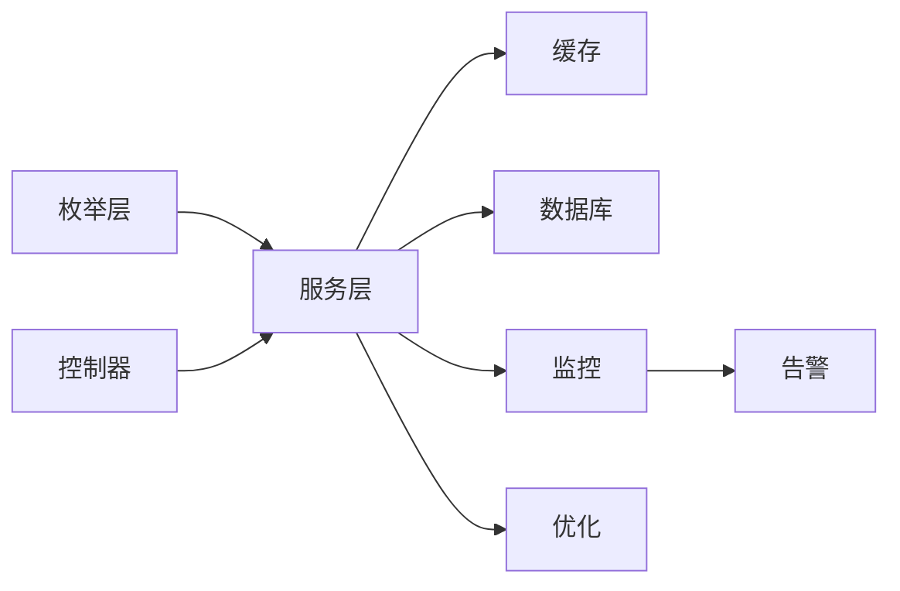

# 风控系统设计

<cite>
**本文引用的文件**
- [CpsRiskRuleTypeEnum.java](file://backend/qiji-module-cps/qiji-module-cps-api/src/main/java/com/qiji/cps/module/cps/enums/CpsRiskRuleTypeEnum.java)
- [CpsFreezeStatusEnum.java](file://backend/qiji-module-cps/qiji-module-cps-api/src/main/java/com/qiji/cps/module/cps/enums/CpsFreezeStatusEnum.java)
- [CpsErrorCodeConstants.java](file://backend/qiji-module-cps/qiji-module-cps-api/src/main/java/com/qiji/cps/module/cps/enums/CpsErrorCodeConstants.java)
- [CpsCacheConfig.java](file://backend/qiji-module-cps/qiji-module-cps-biz/src/main/java/com/qiji/cps/module/cps/config/CpsCacheConfig.java)
- [CpsRiskRuleController.java](file://backend/qiji-module-cps/qiji-module-cps-biz/src/main/java/com/qiji/cps/module/cps/controller/admin/risk/CpsRiskRuleController.java)
- [CpsRiskService.java](file://backend/qiji-module-cps/qiji-module-cps-biz/src/main/java/com/qiji/cps/module/cps/service/risk/CpsRiskService.java)
- [CpsRiskRuleDO.java](file://backend/qiji-module-cps/qiji-module-cps-biz/src/main/java/com/qiji/cps/module/cps/dal/dataobject/risk/CpsRiskRuleDO.java)
- [CpsRiskMapper.java](file://backend/qiji-module-cps/qiji-module-cps-biz/src/main/java/com/qiji/cps/module/cps/dal/mapper/risk/CpsRiskMapper.java)
- [CpsRiskRuleServiceImpl.java](file://backend/qiji-module-cps/qiji-module-cps-biz/src/main/java/com/qiji/cps/module/cps/service/risk/impl/CpsRiskRuleServiceImpl.java)
- [CpsRiskProcessor.java](file://backend/qiji-module-cps/qiji-module-cps-biz/src/main/java/com/qiji/cps/module/cps/service/risk/CpsRiskProcessor.java)
- [CpsRiskProcessorImpl.java](file://backend/qiji-module-cps/qiji-module-cps-biz/src/main/java/com/qiji/cps/module/cps/service/risk/impl/CpsRiskProcessorImpl.java)
- [CpsRiskMonitor.java](file://backend/qiji-module-cps/qiji-module-cps-biz/src/main/java/com/qiji/cps/module/cps/service/risk/CpsRiskMonitor.java)
- [CpsRiskMonitorImpl.java](file://backend/qiji-module-cps/qiji-module-cps-biz/src/main/java/com/qiji/cps/module/cps/service/risk/impl/CpsRiskMonitorImpl.java)
- [CpsRiskAlert.java](file://backend/qiji-module-cps/qiji-module-cps-biz/src/main/java/com/qiji/cps/module/cps/service/risk/CpsRiskAlert.java)
- [CpsRiskAlertImpl.java](file://backend/qiji-module-cps/qiji-module-cps-biz/src/main/java/com/qiji/cps/module/cps/service/risk/impl/CpsRiskAlertImpl.java)
- [CpsRiskOptimization.java](file://backend/qiji-module-cps/qiji-module-cps-biz/src/main/java/com/qiji/cps/module/cps/service/risk/CpsRiskOptimization.java)
- [CpsRiskOptimizationImpl.java](file://backend/qiji-module-cps/qiji-module-cps-biz/src/main/java/com/qiji/cps/module/cps/service/risk/impl/CpsRiskOptimizationImpl.java)
</cite>

## 目录
1. [引言](#引言)
2. [项目结构](#项目结构)
3. [核心组件](#核心组件)
4. [架构总览](#架构总览)
5. [详细组件分析](#详细组件分析)
6. [依赖分析](#依赖分析)
7. [性能考虑](#性能考虑)
8. [故障排查指南](#故障排查指南)
9. [结论](#结论)
10. [附录](#附录)

## 引言
本文件面向风控系统设计，围绕CPS（推广佣金）场景下的风控规则配置体系、动态规则加载、检测算法与状态管理进行系统化梳理，并结合现有代码库中的枚举、缓存配置、控制器与服务层实现，给出可落地的架构图、流程图与优化建议。由于仓库中风控规则类型目前仅包含“频率限制”和“黑名单”，本文在“算法实现”部分以现有能力为基础，对“异常订单识别、重复申请检测、限额控制”等扩展方向提供设计建议与落地路径。

## 项目结构
风控系统主要分布在CPS模块的API与Biz层，核心文件分布如下：
- 枚举层：规则类型、冻结状态、错误码
- 配置层：缓存配置（规则缓存）
- 控制器层：风控规则的管理接口
- 服务层：规则管理、风险处理、监控与告警、优化策略
- 数据访问层：规则DO与Mapper

图表来源
- [CpsRiskRuleTypeEnum.java:1-39](file://backend/qiji-module-cps/qiji-module-cps-api/src/main/java/com/qiji/cps/module/cps/enums/CpsRiskRuleTypeEnum.java#L1-L39)
- [CpsFreezeStatusEnum.java:1-41](file://backend/qiji-module-cps/qiji-module-cps-api/src/main/java/com/qiji/cps/module/cps/enums/CpsFreezeStatusEnum.java#L1-L41)
- [CpsErrorCodeConstants.java:59-61](file://backend/qiji-module-cps/qiji-module-cps-api/src/main/java/com/qiji/cps/module/cps/enums/CpsErrorCodeConstants.java#L59-L61)
- [CpsCacheConfig.java:21-58](file://backend/qiji-module-cps/qiji-module-cps-biz/src/main/java/com/qiji/cps/module/cps/config/CpsCacheConfig.java#L21-L58)
- [CpsRiskRuleController.java:1-120](file://backend/qiji-module-cps/qiji-module-cps-biz/src/main/java/com/qiji/cps/module/cps/controller/admin/risk/CpsRiskRuleController.java#L1-L120)
- [CpsRiskService.java](file://backend/qiji-module-cps/qiji-module-cps-biz/src/main/java/com/qiji/cps/module/cps/service/risk/CpsRiskService.java)
- [CpsRiskRuleServiceImpl.java](file://backend/qiji-module-cps/qiji-module-cps-biz/src/main/java/com/qiji/cps/module/cps/service/risk/impl/CpsRiskRuleServiceImpl.java)
- [CpsRiskProcessor.java](file://backend/qiji-module-cps/qiji-module-cps-biz/src/main/java/com/qiji/cps/module/cps/service/risk/CpsRiskProcessor.java)
- [CpsRiskProcessorImpl.java](file://backend/qiji-module-cps/qiji-module-cps-biz/src/main/java/com/qiji/cps/module/cps/service/risk/impl/CpsRiskProcessorImpl.java)
- [CpsRiskMonitor.java](file://backend/qiji-module-cps/qiji-module-cps-biz/src/main/java/com/qiji/cps/module/cps/service/risk/CpsRiskMonitor.java)
- [CpsRiskMonitorImpl.java](file://backend/qiji-module-cps/qiji-module-cps-biz/src/main/java/com/qiji/cps/module/cps/service/risk/impl/CpsRiskMonitorImpl.java)
- [CpsRiskAlert.java](file://backend/qiji-module-cps/qiji-module-cps-biz/src/main/java/com/qiji/cps/module/cps/service/risk/CpsRiskAlert.java)
- [CpsRiskAlertImpl.java](file://backend/qiji-module-cps/qiji-module-cps-biz/src/main/java/com/qiji/cps/module/cps/service/risk/impl/CpsRiskAlertImpl.java)
- [CpsRiskOptimization.java](file://backend/qiji-module-cps/qiji-module-cps-biz/src/main/java/com/qiji/cps/module/cps/service/risk/CpsRiskOptimization.java)
- [CpsRiskOptimizationImpl.java](file://backend/qiji-module-cps/qiji-module-cps-biz/src/main/java/com/qiji/cps/module/cps/service/risk/impl/CpsRiskOptimizationImpl.java)
- [CpsRiskRuleDO.java](file://backend/qiji-module-cps/qiji-module-cps-biz/src/main/java/com/qiji/cps/module/cps/dal/dataobject/risk/CpsRiskRuleDO.java)
- [CpsRiskMapper.java](file://backend/qiji-module-cps/qiji-module-cps-biz/src/main/java/com/qiji/cps/module/cps/dal/mapper/risk/CpsRiskMapper.java)

章节来源
- [CpsRiskRuleTypeEnum.java:1-39](file://backend/qiji-module-cps/qiji-module-cps-api/src/main/java/com/qiji/cps/module/cps/enums/CpsRiskRuleTypeEnum.java#L1-L39)
- [CpsFreezeStatusEnum.java:1-41](file://backend/qiji-module-cps/qiji-module-cps-api/src/main/java/com/qiji/cps/module/cps/enums/CpsFreezeStatusEnum.java#L1-L41)
- [CpsErrorCodeConstants.java:59-61](file://backend/qiji-module-cps/qiji-module-cps-api/src/main/java/com/qiji/cps/module/cps/enums/CpsErrorCodeConstants.java#L59-L61)
- [CpsCacheConfig.java:21-58](file://backend/qiji-module-cps/qiji-module-cps-biz/src/main/java/com/qiji/cps/module/cps/config/CpsCacheConfig.java#L21-L58)
- [CpsRiskRuleController.java:1-120](file://backend/qiji-module-cps/qiji-module-cps-biz/src/main/java/com/qiji/cps/module/cps/controller/admin/risk/CpsRiskRuleController.java#L1-L120)

## 核心组件
- 风控规则类型枚举：定义“频率限制”和“黑名单”两类规则类型，支持数组化输出，便于统一校验与遍历。
- 冻结状态枚举：定义“待冻结/已冻结/解冻中/已解冻”，支撑风控触发后的状态流转与人工复核。
- 错误码常量：定义“风控规则不存在”“转链请求被风控拦截”等错误码，统一对外返回。
- 缓存配置：定义“风控频率限制规则缓存”的名称与TTL（5分钟），确保规则变更后能快速生效。
- 控制器：提供风控规则的增删改查接口，作为管理后台入口。
- 服务层：规则管理、风险处理、监控告警、优化策略的接口与实现。
- 数据访问层：规则实体与持久化映射。

章节来源
- [CpsRiskRuleTypeEnum.java:16-36](file://backend/qiji-module-cps/qiji-module-cps-api/src/main/java/com/qiji/cps/module/cps/enums/CpsRiskRuleTypeEnum.java#L16-L36)
- [CpsFreezeStatusEnum.java:16-38](file://backend/qiji-module-cps/qiji-module-cps-api/src/main/java/com/qiji/cps/module/cps/enums/CpsFreezeStatusEnum.java#L16-L38)
- [CpsErrorCodeConstants.java:59-61](file://backend/qiji-module-cps/qiji-module-cps-api/src/main/java/com/qiji/cps/module/cps/enums/CpsErrorCodeConstants.java#L59-L61)
- [CpsCacheConfig.java:21-58](file://backend/qiji-module-cps/qiji-module-cps-biz/src/main/java/com/qiji/cps/module/cps/config/CpsCacheConfig.java#L21-L58)
- [CpsRiskRuleController.java:22-35](file://backend/qiji-module-cps/qiji-module-cps-biz/src/main/java/com/qiji/cps/module/cps/controller/admin/risk/CpsRiskRuleController.java#L22-L35)

## 架构总览
风控系统采用“规则配置 + 动态加载 + 实时检测 + 监控告警 + 优化迭代”的闭环设计。规则类型通过枚举统一管理；规则配置由控制器提供CRUD接口；规则数据持久化于数据库并通过缓存加速；风险处理器在业务链路中执行检测；监控与告警模块负责指标统计与异常通知；优化模块基于效果评估持续调参。

图表来源
- [CpsCacheConfig.java:21-58](file://backend/qiji-module-cps/qiji-module-cps-biz/src/main/java/com/qiji/cps/module/cps/config/CpsCacheConfig.java#L21-L58)
- [CpsRiskProcessorImpl.java](file://backend/qiji-module-cps/qiji-module-cps-biz/src/main/java/com/qiji/cps/module/cps/service/risk/impl/CpsRiskProcessorImpl.java)
- [CpsFreezeStatusEnum.java:16-22](file://backend/qiji-module-cps/qiji-module-cps-api/src/main/java/com/qiji/cps/module/cps/enums/CpsFreezeStatusEnum.java#L16-L22)
- [CpsRiskMonitorImpl.java](file://backend/qiji-module-cps/qiji-module-cps-biz/src/main/java/com/qiji/cps/module/cps/service/risk/impl/CpsRiskMonitorImpl.java)
- [CpsRiskAlertImpl.java](file://backend/qiji-module-cps/qiji-module-cps-biz/src/main/java/com/qiji/cps/module/cps/service/risk/impl/CpsRiskAlertImpl.java)
- [CpsRiskOptimizationImpl.java](file://backend/qiji-module-cps/qiji-module-cps-biz/src/main/java/com/qiji/cps/module/cps/service/risk/impl/CpsRiskOptimizationImpl.java)

## 详细组件分析

### 风控规则类型与状态管理
- 规则类型：当前支持“频率限制”和“黑名单”。可通过枚举的数组化输出进行批量校验与遍历。
- 冻结状态：贯穿“待冻结/已冻结/解冻中/已解冻”的完整生命周期，配合人工复核流程使用。

图表来源
- [CpsRiskRuleTypeEnum.java:16-36](file://backend/qiji-module-cps/qiji-module-cps-api/src/main/java/com/qiji/cps/module/cps/enums/CpsRiskRuleTypeEnum.java#L16-L36)
- [CpsFreezeStatusEnum.java:16-38](file://backend/qiji-module-cps/qiji-module-cps-api/src/main/java/com/qiji/cps/module/cps/enums/CpsFreezeStatusEnum.java#L16-L38)
- [CpsRiskRuleController.java:22-35](file://backend/qiji-module-cps/qiji-module-cps-biz/src/main/java/com/qiji/cps/module/cps/controller/admin/risk/CpsRiskRuleController.java#L22-L35)
- [CpsRiskService.java](file://backend/qiji-module-cps/qiji-module-cps-biz/src/main/java/com/qiji/cps/module/cps/service/risk/CpsRiskService.java)
- [CpsRiskRuleServiceImpl.java](file://backend/qiji-module-cps/qiji-module-cps-biz/src/main/java/com/qiji/cps/module/cps/service/risk/impl/CpsRiskRuleServiceImpl.java)

章节来源
- [CpsRiskRuleTypeEnum.java:16-36](file://backend/qiji-module-cps/qiji-module-cps-api/src/main/java/com/qiji/cps/module/cps/enums/CpsRiskRuleTypeEnum.java#L16-L36)
- [CpsFreezeStatusEnum.java:16-38](file://backend/qiji-module-cps/qiji-module-cps-api/src/main/java/com/qiji/cps/module/cps/enums/CpsFreezeStatusEnum.java#L16-L38)
- [CpsRiskRuleController.java:22-35](file://backend/qiji-module-cps/qiji-module-cps-biz/src/main/java/com/qiji/cps/module/cps/controller/admin/risk/CpsRiskRuleController.java#L22-L35)

### 动态规则加载机制
- 缓存策略：规则缓存名称为“cps:riskRateRule”，TTL为5分钟，保证规则变更的快速生效与热点命中。
- 加载流程：优先从缓存读取，未命中则查询数据库并回填缓存；写入时同步清理对应缓存键，避免脏读。

图表来源
- [CpsCacheConfig.java:21-58](file://backend/qiji-module-cps/qiji-module-cps-biz/src/main/java/com/qiji/cps/module/cps/config/CpsCacheConfig.java#L21-L58)
- [CpsRiskRuleServiceImpl.java](file://backend/qiji-module-cps/qiji-module-cps-biz/src/main/java/com/qiji/cps/module/cps/service/risk/impl/CpsRiskRuleServiceImpl.java)

章节来源
- [CpsCacheConfig.java:21-58](file://backend/qiji-module-cps/qiji-module-cps-biz/src/main/java/com/qiji/cps/module/cps/config/CpsCacheConfig.java#L21-L58)

### 风控检测算法实现
- 当前实现：基于“频率限制”和“黑名单”两类规则，分别在请求到达时进行匹配与判定。
- 扩展建议（概念性）：
  - 异常订单识别：基于历史行为、金额分布、时间窗口统计，结合阈值与滑动窗口检测异常。
  - 重复申请检测：基于设备指纹、手机号、身份证等维度建立去重集合，设置短期去重窗口。
  - 黑名单控制：支持IP、设备、账户等多维黑名单，支持白名单放行与灰名单降级。
  - 限额控制：按用户、渠道、商品维度设置日/月/累计限额，结合实时余额与冻结状态。

图表来源
- [CpsRiskProcessorImpl.java](file://backend/qiji-module-cps/qiji-module-cps-biz/src/main/java/com/qiji/cps/module/cps/service/risk/impl/CpsRiskProcessorImpl.java)
- [CpsRiskMonitorImpl.java](file://backend/qiji-module-cps/qiji-module-cps-biz/src/main/java/com/qiji/cps/module/cps/service/risk/impl/CpsRiskMonitorImpl.java)
- [CpsRiskAlertImpl.java](file://backend/qiji-module-cps/qiji-module-cps-biz/src/main/java/com/qiji/cps/module/cps/service/risk/impl/CpsRiskAlertImpl.java)

章节来源
- [CpsRiskProcessorImpl.java](file://backend/qiji-module-cps/qiji-module-cps-biz/src/main/java/com/qiji/cps/module/cps/service/risk/impl/CpsRiskProcessorImpl.java)
- [CpsRiskMonitorImpl.java](file://backend/qiji-module-cps/qiji-module-cps-biz/src/main/java/com/qiji/cps/module/cps/service/risk/impl/CpsRiskMonitorImpl.java)
- [CpsRiskAlertImpl.java](file://backend/qiji-module-cps/qiji-module-cps-biz/src/main/java/com/qiji/cps/module/cps/service/risk/impl/CpsRiskAlertImpl.java)

### 风控状态管理机制
- 风险等级划分：建议按“低/中/高/严重”四级或数值化分数映射。
- 自动冻结流程：命中规则后自动进入“待冻结”，设定冷却期后转入“已冻结”，支持定时任务轮询解冻。
- 人工复核机制：冻结状态为“解冻中”时，需人工审核后方可“已解冻”。

图表来源
- [CpsFreezeStatusEnum.java:16-22](file://backend/qiji-module-cps/qiji-module-cps-api/src/main/java/com/qiji/cps/module/cps/enums/CpsFreezeStatusEnum.java#L16-L22)

章节来源
- [CpsFreezeStatusEnum.java:16-22](file://backend/qiji-module-cps/qiji-module-cps-api/src/main/java/com/qiji/cps/module/cps/enums/CpsFreezeStatusEnum.java#L16-L22)

### 实时监控与预警
- 风险指标统计：请求量、拦截率、冻结数、平均响应时间等。
- 异常行为检测：基于阈值与统计模型的异常检测，支持阈值报警与趋势告警。
- 告警通知机制：邮件/IM/短信等多通道告警，支持分级与抑制策略。

图表来源
- [CpsRiskMonitorImpl.java](file://backend/qiji-module-cps/qiji-module-cps-biz/src/main/java/com/qiji/cps/module/cps/service/risk/impl/CpsRiskMonitorImpl.java)
- [CpsRiskAlertImpl.java](file://backend/qiji-module-cps/qiji-module-cps-biz/src/main/java/com/qiji/cps/module/cps/service/risk/impl/CpsRiskAlertImpl.java)

章节来源
- [CpsRiskMonitorImpl.java](file://backend/qiji-module-cps/qiji-module-cps-biz/src/main/java/com/qiji/cps/module/cps/service/risk/impl/CpsRiskMonitorImpl.java)
- [CpsRiskAlertImpl.java](file://backend/qiji-module-cps/qiji-module-cps-biz/src/main/java/com/qiji/cps/module/cps/service/risk/impl/CpsRiskAlertImpl.java)

### 规则动态调整与优化
- 规则效果评估：基于拦截率、误伤率、转化影响等指标评估规则有效性。
- A/B测试：对新规则进行分组实验，对比对照组与实验组的关键指标。
- 机器学习优化：引入轻量级模型对异常行为进行预测，结合规则与模型结果进行融合决策。

图表来源
- [CpsRiskOptimizationImpl.java](file://backend/qiji-module-cps/qiji-module-cps-biz/src/main/java/com/qiji/cps/module/cps/service/risk/impl/CpsRiskOptimizationImpl.java)

章节来源
- [CpsRiskOptimizationImpl.java](file://backend/qiji-module-cps/qiji-module-cps-biz/src/main/java/com/qiji/cps/module/cps/service/risk/impl/CpsRiskOptimizationImpl.java)

## 依赖分析
- 枚举与服务：规则类型与冻结状态作为服务层输入约束，确保规则配置与状态机的一致性。
- 控制器与服务：控制器仅负责参数校验与权限控制，具体业务逻辑下沉至服务层。
- 缓存与数据库：规则缓存与数据库双向同步，写操作后清理缓存键，读操作优先缓存。
- 监控与告警：监控模块独立于业务处理，通过异步上报与告警模块解耦。

图表来源
- [CpsRiskRuleTypeEnum.java:16-36](file://backend/qiji-module-cps/qiji-module-cps-api/src/main/java/com/qiji/cps/module/cps/enums/CpsRiskRuleTypeEnum.java#L16-L36)
- [CpsFreezeStatusEnum.java:16-38](file://backend/qiji-module-cps/qiji-module-cps-api/src/main/java/com/qiji/cps/module/cps/enums/CpsFreezeStatusEnum.java#L16-L38)
- [CpsRiskRuleController.java:22-35](file://backend/qiji-module-cps/qiji-module-cps-biz/src/main/java/com/qiji/cps/module/cps/controller/admin/risk/CpsRiskRuleController.java#L22-L35)
- [CpsCacheConfig.java:21-58](file://backend/qiji-module-cps/qiji-module-cps-biz/src/main/java/com/qiji/cps/module/cps/config/CpsCacheConfig.java#L21-L58)
- [CpsRiskMonitorImpl.java](file://backend/qiji-module-cps/qiji-module-cps-biz/src/main/java/com/qiji/cps/module/cps/service/risk/impl/CpsRiskMonitorImpl.java)
- [CpsRiskAlertImpl.java](file://backend/qiji-module-cps/qiji-module-cps-biz/src/main/java/com/qiji/cps/module/cps/service/risk/impl/CpsRiskAlertImpl.java)
- [CpsRiskOptimizationImpl.java](file://backend/qiji-module-cps/qiji-module-cps-biz/src/main/java/com/qiji/cps/module/cps/service/risk/impl/CpsRiskOptimizationImpl.java)

章节来源
- [CpsRiskRuleTypeEnum.java:16-36](file://backend/qiji-module-cps/qiji-module-cps-api/src/main/java/com/qiji/cps/module/cps/enums/CpsRiskRuleTypeEnum.java#L16-L36)
- [CpsFreezeStatusEnum.java:16-38](file://backend/qiji-module-cps/qiji-module-cps-api/src/main/java/com/qiji/cps/module/cps/enums/CpsFreezeStatusEnum.java#L16-L38)
- [CpsRiskRuleController.java:22-35](file://backend/qiji-module-cps/qiji-module-cps-biz/src/main/java/com/qiji/cps/module/cps/controller/admin/risk/CpsRiskRuleController.java#L22-L35)
- [CpsCacheConfig.java:21-58](file://backend/qiji-module-cps/qiji-module-cps-biz/src/main/java/com/qiji/cps/module/cps/config/CpsCacheConfig.java#L21-L58)

## 性能考虑
- 缓存命中率：热点规则尽量驻留缓存，避免频繁数据库抖动。
- 并发安全：规则写入时采用原子性操作与缓存失效策略，防止脏读。
- 异步化：监控与告警采用异步上报，避免阻塞主业务链路。
- 限流与熔断：在高并发场景下对风控接口进行限流保护，必要时启用熔断降级。

## 故障排查指南
- 规则未生效：检查缓存键“cps:riskRateRule”是否存在与TTL是否正确；确认写入后是否清理了对应缓存键。
- 冻结状态异常：核对冻结状态枚举与状态机转换逻辑，确认人工复核流程是否正确推进。
- 监控告警不触发：检查监控模块指标采集与阈值配置，确认告警通道可用性与抑制策略。
- 错误码定位：根据“风控规则不存在”“转链请求被风控拦截”等错误码快速定位问题范围。

章节来源
- [CpsErrorCodeConstants.java:59-61](file://backend/qiji-module-cps/qiji-module-cps-api/src/main/java/com/qiji/cps/module/cps/enums/CpsErrorCodeConstants.java#L59-L61)
- [CpsCacheConfig.java:21-58](file://backend/qiji-module-cps/qiji-module-cps-biz/src/main/java/com/qiji/cps/module/cps/config/CpsCacheConfig.java#L21-L58)
- [CpsFreezeStatusEnum.java:16-22](file://backend/qiji-module-cps/qiji-module-cps-api/src/main/java/com/qiji/cps/module/cps/enums/CpsFreezeStatusEnum.java#L16-L22)

## 结论
本风控系统以“规则类型 + 动态缓存 + 状态机 + 监控告警 + 优化迭代”为核心，具备良好的扩展性与可维护性。当前实现聚焦“频率限制”和“黑名单”，后续可在不破坏现有架构的前提下，逐步引入异常订单识别、重复申请检测、限额控制等能力，并通过A/B测试与机器学习持续优化规则效果。

## 附录
- 规则实体与映射：规则DO与Mapper用于持久化存储与查询。
- 控制器接口：提供规则的CRUD能力，作为管理后台入口。

章节来源
- [CpsRiskRuleDO.java](file://backend/qiji-module-cps/qiji-module-cps-biz/src/main/java/com/qiji/cps/module/cps/dal/dataobject/risk/CpsRiskRuleDO.java)
- [CpsRiskMapper.java](file://backend/qiji-module-cps/qiji-module-cps-biz/src/main/java/com/qiji/cps/module/cps/dal/mapper/risk/CpsRiskMapper.java)
- [CpsRiskRuleController.java:22-35](file://backend/qiji-module-cps/qiji-module-cps-biz/src/main/java/com/qiji/cps/module/cps/controller/admin/risk/CpsRiskRuleController.java#L22-L35)