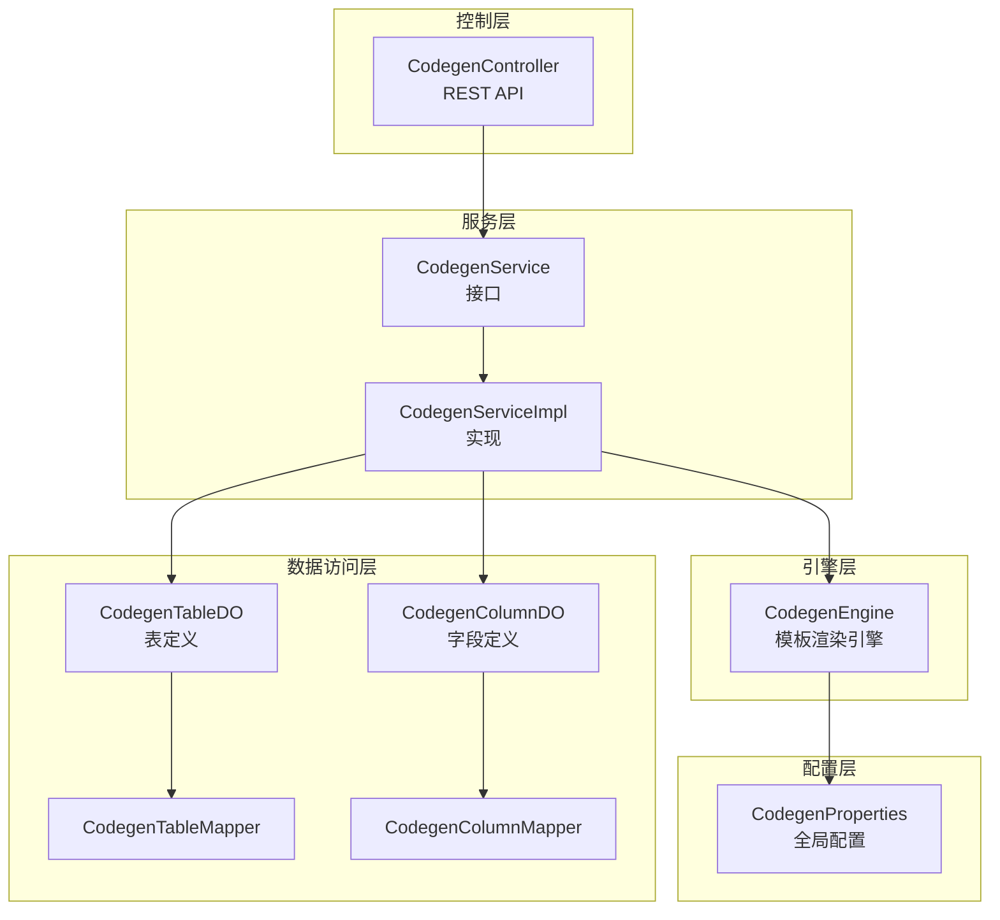
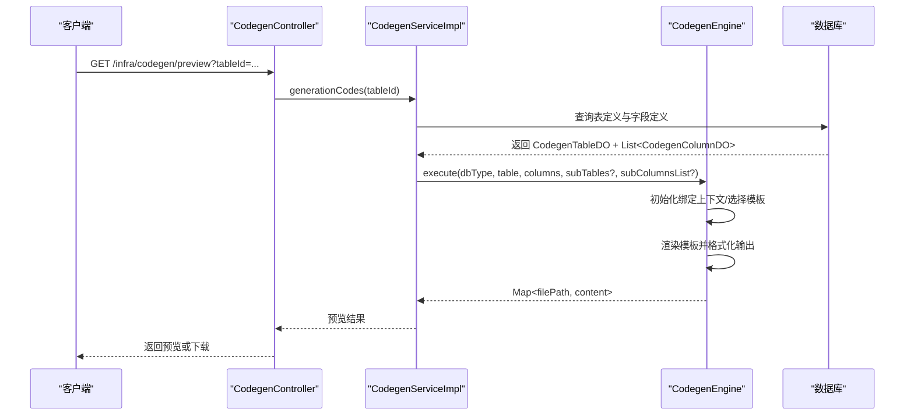
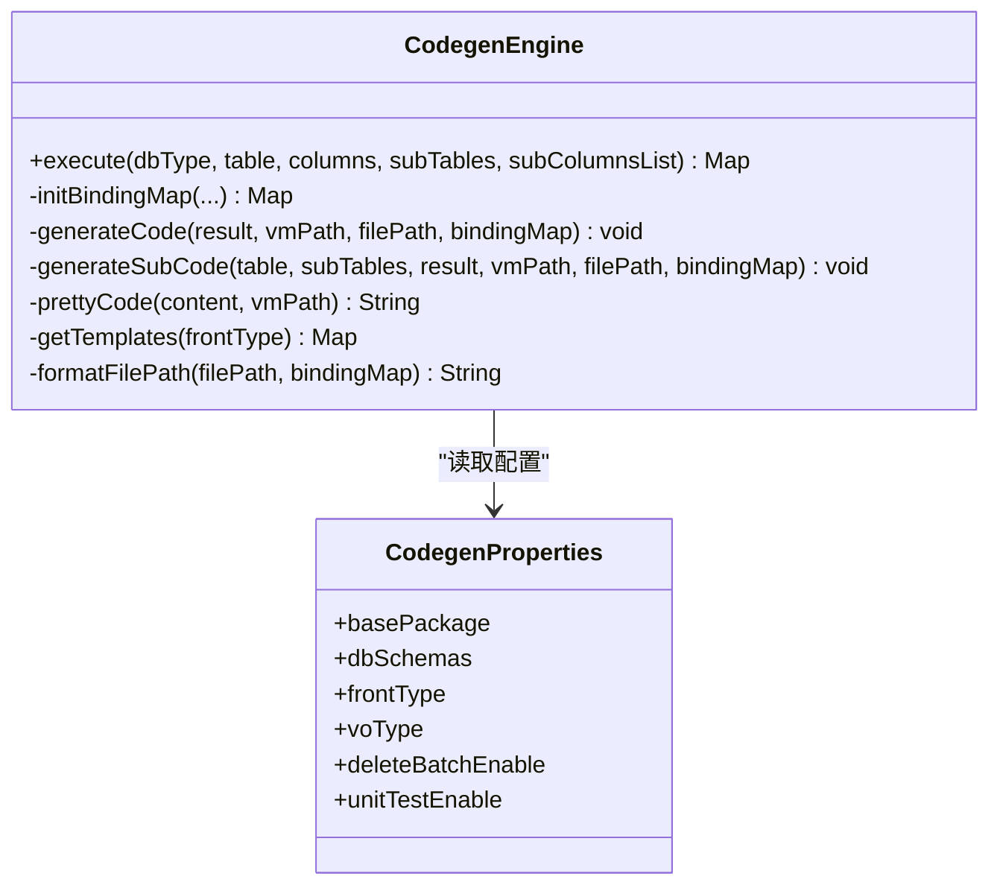
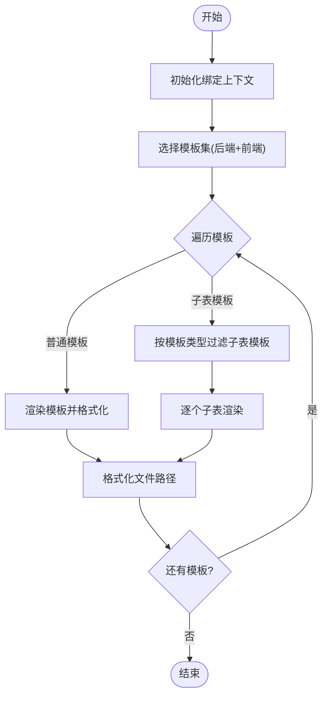
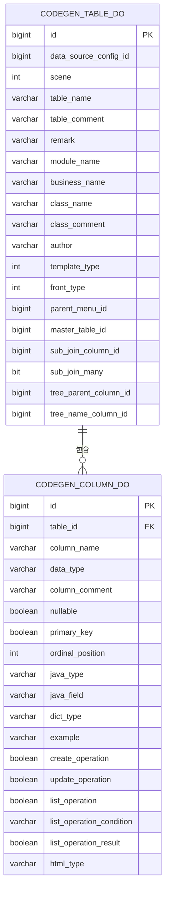
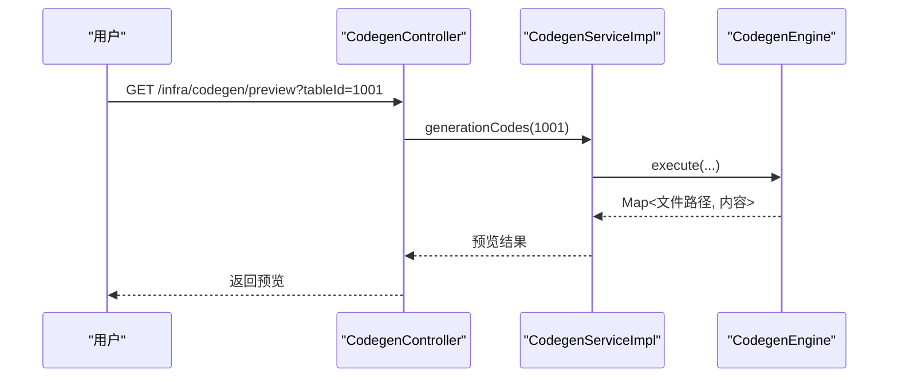
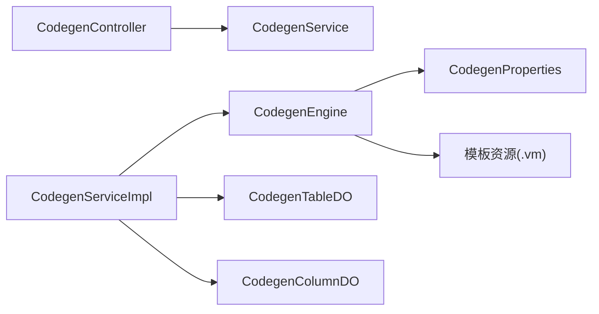

# 代码生成器

<cite>
**本文引用的文件**
- [CodegenEngine.java](file://backend/qiji-module-infra/src/main/java/com/qiji/cps/module/infra/service/codegen/inner/CodegenEngine.java)
- [CodegenController.java](file://backend/qiji-module-infra/src/main/java/com/qiji/cps/module/infra/controller/admin/codegen/CodegenController.java)
- [CodegenService.java](file://backend/qiji-module-infra/src/main/java/com/qiji/cps/module/infra/service/codegen/CodegenService.java)
- [CodegenServiceImpl.java](file://backend/qiji-module-infra/src/main/java/com/qiji/cps/module/infra/service/codegen/CodegenServiceImpl.java)
- [CodegenTableDO.java](file://backend/qiji-module-infra/src/main/java/com/qiji/cps/module/infra/dal/dataobject/codegen/CodegenTableDO.java)
- [CodegenColumnDO.java](file://backend/qiji-module-infra/src/main/java/com/qiji/cps/module/infra/dal/dataobject/codegen/CodegenColumnDO.java)
- [CodegenProperties.java](file://backend/qiji-module-infra/src/main/java/com/qiji/cps/module/infra/framework/codegen/config/CodegenProperties.java)
- [codegen-rules.md](file://agent_improvement/memory/codegen-rules.md)
- [CodegenEngineAbstractTest.java](file://backend/qiji-module-infra/src/test/java/com/qiji/cps/module/infra/service/codegen/inner/CodegenEngineAbstractTest.java)
- [CodegenEngineVue2Test.java](file://backend/qiji-module-infra/src/test/java/com/qiji/cps/module/infra/service/codegen/inner/CodegenEngineVue2Test.java)
- [CodegenEngineVue3Test.java](file://backend/qiji-module-infra/src/test/java/com/qiji/cps/module/infra/service/codegen/inner/CodegenEngineVue3Test.java)
- [CodegenServiceImplTest.java](file://backend/qiji-module-infra/src/test/java/com/qiji/cps/module/infra/service/codegen/CodegenServiceImplTest.java)
- [create_tables.sql](file://backend/qiji-module-infra/src/test/resources/sql/create_tables.sql)
- [ruoyi-vue-pro.sql](file://backend/sql/sqlserver/ruoyi-vue-pro.sql)
</cite>

## 目录
1. [简介](#简介)
2. [项目结构](#项目结构)
3. [核心组件](#核心组件)
4. [架构总览](#架构总览)
5. [详细组件分析](#详细组件分析)
6. [依赖关系分析](#依赖关系分析)
7. [性能考虑](#性能考虑)
8. [故障排查指南](#故障排查指南)
9. [结论](#结论)
10. [附录](#附录)

## 简介
本文件面向“代码生成器”模块，系统化阐述其核心架构与实现细节，覆盖以下主题：
- CodegenEngine 引擎的实现原理与执行流程
- 模板引擎（基于 Velocity 的 Hutool 封装）使用机制
- 数据库表结构解析与映射（CodegenTableDO/CodegenColumnDO）
- 从数据库表定义到最终代码文件生成的完整流程
- 模板系统的变量绑定、条件渲染与路径格式化
- 代码生成的配置项（作者、模块命名、文件路径等）
- 使用示例：基于现有数据库表快速生成 CRUD 页面、Service 层、Controller 层等
- 常见问题与性能优化建议

## 项目结构
代码生成器位于后端模块 infra 中，主要由以下层次构成：
- 控制层：对外暴露 REST API，负责接收请求、调用服务层并输出预览/下载结果
- 服务层：封装业务逻辑，协调数据访问与引擎执行
- 引擎层：核心代码生成引擎，负责模板加载、变量绑定、渲染与输出
- 数据访问层：持久化“表定义”和“字段定义”，并与数据库交互
- 配置层：全局代码生成属性（基础包、前端类型、VO 类型、开关等）

图表来源
- [CodegenController.java:40-161](file://backend/qiji-module-infra/src/main/java/com/qiji/cps/module/infra/controller/admin/codegen/CodegenController.java#L40-L161)
- [CodegenService.java:14-109](file://backend/qiji-module-infra/src/main/java/com/qiji/cps/module/infra/service/codegen/CodegenService.java#L14-L109)
- [CodegenServiceImpl.java](file://backend/qiji-module-infra/src/main/java/com/qiji/cps/module/infra/service/codegen/CodegenServiceImpl.java)
- [CodegenEngine.java:60-680](file://backend/qiji-module-infra/src/main/java/com/qiji/cps/module/infra/service/codegen/inner/CodegenEngine.java#L60-L680)
- [CodegenTableDO.java:15-157](file://backend/qiji-module-infra/src/main/java/com/qiji/cps/module/infra/dal/dataobject/codegen/CodegenTableDO.java#L15-L157)
- [CodegenColumnDO.java:13-135](file://backend/qiji-module-infra/src/main/java/com/qiji/cps/module/infra/dal/dataobject/codegen/CodegenColumnDO.java#L13-L135)
- [CodegenProperties.java:13-59](file://backend/qiji-module-infra/src/main/java/com/qiji/cps/module/infra/framework/codegen/config/CodegenProperties.java#L13-L59)

章节来源
- [CodegenController.java:40-161](file://backend/qiji-module-infra/src/main/java/com/qiji/cps/module/infra/controller/admin/codegen/CodegenController.java#L40-L161)
- [CodegenEngine.java:60-680](file://backend/qiji-module-infra/src/main/java/com/qiji/cps/module/infra/service/codegen/inner/CodegenEngine.java#L60-L680)
- [CodegenTableDO.java:15-157](file://backend/qiji-module-infra/src/main/java/com/qiji/cps/module/infra/dal/dataobject/codegen/CodegenTableDO.java#L15-L157)
- [CodegenColumnDO.java:13-135](file://backend/qiji-module-infra/src/main/java/com/qiji/cps/module/infra/dal/dataobject/codegen/CodegenColumnDO.java#L13-L135)
- [CodegenProperties.java:13-59](file://backend/qiji-module-infra/src/main/java/com/qiji/cps/module/infra/framework/codegen/config/CodegenProperties.java#L13-L59)

## 核心组件
- CodegenEngine：模板引擎驱动者，负责模板选择、变量绑定、渲染与输出；支持后端 Java 模板与多种前端模板族
- CodegenService/Impl：服务接口与实现，封装表/字段定义的增删改查、从数据库同步、生成代码与打包下载
- CodegenController：对外 API，提供数据库表列表、表定义分页、预览/下载、同步/更新/删除等功能
- CodegenTableDO/CodegenColumnDO：表与字段的持久化模型，承载生成所需的所有元数据
- CodegenProperties：全局配置，决定基础包、前端类型、VO 类型、是否生成单元测试等

章节来源
- [CodegenEngine.java:60-680](file://backend/qiji-module-infra/src/main/java/com/qiji/cps/module/infra/service/codegen/inner/CodegenEngine.java#L60-L680)
- [CodegenService.java:14-109](file://backend/qiji-module-infra/src/main/java/com/qiji/cps/module/infra/service/codegen/CodegenService.java#L14-L109)
- [CodegenServiceImpl.java](file://backend/qiji-module-infra/src/main/java/com/qiji/cps/module/infra/service/codegen/CodegenServiceImpl.java)
- [CodegenController.java:40-161](file://backend/qiji-module-infra/src/main/java/com/qiji/cps/module/infra/controller/admin/codegen/CodegenController.java#L40-L161)
- [CodegenTableDO.java:15-157](file://backend/qiji-module-infra/src/main/java/com/qiji/cps/module/infra/dal/dataobject/codegen/CodegenTableDO.java#L15-L157)
- [CodegenColumnDO.java:13-135](file://backend/qiji-module-infra/src/main/java/com/qiji/cps/module/infra/dal/dataobject/codegen/CodegenColumnDO.java#L13-L135)
- [CodegenProperties.java:13-59](file://backend/qiji-module-infra/src/main/java/com/qiji/cps/module/infra/framework/codegen/config/CodegenProperties.java#L13-L59)

## 架构总览
代码生成器采用“控制器-服务-引擎-数据访问-配置”的分层架构。核心流程如下：
- 控制器接收请求，调用服务层
- 服务层根据表定义与字段定义，调用引擎执行模板渲染
- 引擎按模板类型与前端类型选择模板，绑定上下文变量，渲染生成代码
- 服务层将结果以预览或压缩包形式返回给客户端

图表来源
- [CodegenController.java:134-158](file://backend/qiji-module-infra/src/main/java/com/qiji/cps/module/infra/controller/admin/codegen/CodegenController.java#L134-L158)
- [CodegenEngine.java:321-351](file://backend/qiji-module-infra/src/main/java/com/qiji/cps/module/infra/service/codegen/inner/CodegenEngine.java#L321-L351)
- [CodegenService.java:90-96](file://backend/qiji-module-infra/src/main/java/com/qiji/cps/module/infra/service/codegen/CodegenService.java#L90-L96)

## 详细组件分析

### CodegenEngine 引擎
- 模板体系
  - 后端模板：控制器、VO、Service、ServiceImpl、Mapper、DO、Mapper XML、测试类、SQL 脚本等
  - 前端模板：Vue2 Element UI、Vue3 Element Plus、Vben Antd/EP、UniApp 等多套模板族
  - 模板映射：通过常量表/映射表将模板路径与生成目标路径进行绑定，并支持按前端类型动态选择
- 变量绑定
  - 全局变量：基础包、Jakarta/Javax 支持、VO 类型、是否启用批量删除、是否生成单元测试、常用类名等
  - 表级变量：表名、模块名、业务名、类名、权限前缀、场景枚举、主键字段等
  - 树表变量：父字段、名称字段及其下划线命名
  - 主子表变量：子表集合、子表主键、关联字段、子表类名等
  - VO 类型变量：根据配置选择 VO 或 DO 作为请求/响应载体
- 渲染与输出
  - 按模板映射逐个渲染，支持主子表循环渲染
  - 特殊模板分支：树表/主子表专用模板、PageReqVO/ListReqVO 条件渲染
  - 文件路径格式化：将 ${variable} 替换为实际值，支持场景枚举与主子表索引
  - 代码美化：对前端模板进行逗号、引用、字典等清理，保证格式一致性
- 运行时开关
  - 云环境开关：根据是否存在特定类判定是否启用 Cloud 模块路径
  - 单元测试开关：按配置移除测试模板
  - VO 类型开关：按配置移除 VO 模板

图表来源
- [CodegenEngine.java:60-680](file://backend/qiji-module-infra/src/main/java/com/qiji/cps/module/infra/service/codegen/inner/CodegenEngine.java#L60-L680)
- [CodegenProperties.java:13-59](file://backend/qiji-module-infra/src/main/java/com/qiji/cps/module/infra/framework/codegen/config/CodegenProperties.java#L13-L59)

章节来源
- [CodegenEngine.java:69-232](file://backend/qiji-module-infra/src/main/java/com/qiji/cps/module/infra/service/codegen/inner/CodegenEngine.java#L69-L232)
- [CodegenEngine.java:277-309](file://backend/qiji-module-infra/src/main/java/com/qiji/cps/module/infra/service/codegen/inner/CodegenEngine.java#L277-L309)
- [CodegenEngine.java:321-351](file://backend/qiji-module-infra/src/main/java/com/qiji/cps/module/infra/service/codegen/inner/CodegenEngine.java#L321-L351)
- [CodegenEngine.java:353-428](file://backend/qiji-module-infra/src/main/java/com/qiji/cps/module/infra/service/codegen/inner/CodegenEngine.java#L353-L428)
- [CodegenEngine.java:520-543](file://backend/qiji-module-infra/src/main/java/com/qiji/cps/module/infra/service/codegen/inner/CodegenEngine.java#L520-L543)
- [CodegenEngine.java:545-575](file://backend/qiji-module-infra/src/main/java/com/qiji/cps/module/infra/service/codegen/inner/CodegenEngine.java#L545-L575)

### 模板系统与变量绑定
- 模板语法
  - 基于 Velocity 的 .vm 模板，通过 Hutool 的 TemplateEngine 渲染
  - 支持条件渲染（如树表/主子表）、循环渲染（主子表多表）
- 变量替换
  - 全局变量：基础包、Jakarta/Javax、常用工具类名、枚举类名等
  - 表级变量：模块名、业务名、类名、权限前缀、场景枚举、主键字段等
  - 树表变量：父字段、名称字段及其下划线命名
  - 主子表变量：子表集合、子表主键、关联字段、子表类名等
  - 路径变量：${basePackage}、${sceneEnum.basePackage}、${table.moduleName} 等
- 条件渲染逻辑
  - PageReqVO：树表不生成
  - ListReqVO：非树表不生成
  - 主子表模板：按模板类型（ERP/内嵌/普通）过滤

图表来源
- [CodegenEngine.java:321-351](file://backend/qiji-module-infra/src/main/java/com/qiji/cps/module/infra/service/codegen/inner/CodegenEngine.java#L321-L351)
- [CodegenEngine.java:362-389](file://backend/qiji-module-infra/src/main/java/com/qiji/cps/module/infra/service/codegen/inner/CodegenEngine.java#L362-L389)
- [CodegenEngine.java:520-543](file://backend/qiji-module-infra/src/main/java/com/qiji/cps/module/infra/service/codegen/inner/CodegenEngine.java#L520-L543)
- [CodegenEngine.java:545-575](file://backend/qiji-module-infra/src/main/java/com/qiji/cps/module/infra/service/codegen/inner/CodegenEngine.java#L545-L575)

章节来源
- [codegen-rules.md:307-326](file://agent_improvement/memory/codegen-rules.md#L307-L326)
- [codegen-rules.md:327-788](file://agent_improvement/memory/codegen-rules.md#L327-L788)

### 数据库表结构解析
- 表定义 CodegenTableDO
  - 关键字段：数据源编号、场景、表名/注释、模块名/业务名、类名/注释、作者、模板类型、前端类型、菜单父编号、主子表关联字段、树表父子字段等
- 字段定义 CodegenColumnDO
  - 关键字段：表编号、字段名/类型/注释、是否可空/主键/排序、Java 类型/字段、字典类型、示例、CRUD 操作标记、UI 显示类型等
- 解析流程
  - 服务层从数据库读取表与字段定义，构建上下文传入引擎
  - 引擎根据模板类型与前端类型选择模板，渲染生成代码

图表来源
- [CodegenTableDO.java:15-157](file://backend/qiji-module-infra/src/main/java/com/qiji/cps/module/infra/dal/dataobject/codegen/CodegenTableDO.java#L15-L157)
- [CodegenColumnDO.java:13-135](file://backend/qiji-module-infra/src/main/java/com/qiji/cps/module/infra/dal/dataobject/codegen/CodegenColumnDO.java#L13-L135)
- [create_tables.sql:164-196](file://backend/qiji-module-infra/src/test/resources/sql/create_tables.sql#L164-L196)

章节来源
- [CodegenTableDO.java:15-157](file://backend/qiji-module-infra/src/main/java/com/qiji/cps/module/infra/dal/dataobject/codegen/CodegenTableDO.java#L15-L157)
- [CodegenColumnDO.java:13-135](file://backend/qiji-module-infra/src/main/java/com/qiji/cps/module/infra/dal/dataobject/codegen/CodegenColumnDO.java#L13-L135)
- [create_tables.sql:164-196](file://backend/qiji-module-infra/src/test/resources/sql/create_tables.sql#L164-L196)

### 代码生成流程（从数据库到文件）
- 步骤概览
  - 控制器接收请求，调用服务层生成代码
  - 服务层查询表与字段定义，调用引擎执行
  - 引擎按模板映射渲染，生成文件路径与内容
  - 服务层将结果以预览或 ZIP 下载返回
- 关键路径
  - 预览：/infra/codegen/preview
  - 下载：/infra/codegen/download

图表来源
- [CodegenController.java:134-141](file://backend/qiji-module-infra/src/main/java/com/qiji/cps/module/infra/controller/admin/codegen/CodegenController.java#L134-L141)
- [CodegenEngine.java:321-351](file://backend/qiji-module-infra/src/main/java/com/qiji/cps/module/infra/service/codegen/inner/CodegenEngine.java#L321-L351)

章节来源
- [CodegenController.java:134-158](file://backend/qiji-module-infra/src/main/java/com/qiji/cps/module/infra/controller/admin/codegen/CodegenController.java#L134-L158)
- [CodegenEngine.java:321-351](file://backend/qiji-module-infra/src/main/java/com/qiji/cps/module/infra/service/codegen/inner/CodegenEngine.java#L321-L351)

### 配置选项详解
- 基础包 basePackage：生成代码的基础包名
- 数据库名数组 dbSchemas：用于扫描的数据库 Schema
- 前端类型 frontType：默认前端模板类型（Vue2/Vue3 Element Plus/Vben/Antd/UniApp 等）
- VO 类型 voType：请求/响应载体类型（VO 或 DO）
- 批量删除开关 deleteBatchEnable：是否生成批量删除接口
- 单元测试开关 unitTestEnable：是否生成单元测试与 H2 SQL

章节来源
- [CodegenProperties.java:13-59](file://backend/qiji-module-infra/src/main/java/com/qiji/cps/module/infra/framework/codegen/config/CodegenProperties.java#L13-L59)

### 使用示例
- 快速生成 CRUD 页面与后端代码
  - 在管理后台选择数据库表，创建代码生成定义
  - 配置作者、模块名、业务名、类名、模板类型、前端类型等
  - 预览生成结果，确认无误后下载 ZIP 包
- 常见场景
  - 通用 CRUD：模板类型 1
  - 树表：模板类型 2
  - ERP 主表：模板类型 11（主子表独立增删改查）

章节来源
- [CodegenController.java:49-114](file://backend/qiji-module-infra/src/main/java/com/qiji/cps/module/infra/controller/admin/codegen/CodegenController.java#L49-L114)
- [codegen-rules.md:307-314](file://agent_improvement/memory/codegen-rules.md#L307-L314)

## 依赖关系分析
- 控制器依赖服务层接口
- 服务实现依赖引擎与数据访问层
- 引擎依赖配置与模板资源
- 表/字段模型依赖枚举与注解

图表来源
- [CodegenController.java:40-161](file://backend/qiji-module-infra/src/main/java/com/qiji/cps/module/infra/controller/admin/codegen/CodegenController.java#L40-L161)
- [CodegenEngine.java:60-680](file://backend/qiji-module-infra/src/main/java/com/qiji/cps/module/infra/service/codegen/inner/CodegenEngine.java#L60-L680)
- [CodegenService.java:14-109](file://backend/qiji-module-infra/src/main/java/com/qiji/cps/module/infra/service/codegen/CodegenService.java#L14-L109)
- [CodegenProperties.java:13-59](file://backend/qiji-module-infra/src/main/java/com/qiji/cps/module/infra/framework/codegen/config/CodegenProperties.java#L13-L59)

章节来源
- [CodegenController.java:40-161](file://backend/qiji-module-infra/src/main/java/com/qiji/cps/module/infra/controller/admin/codegen/CodegenController.java#L40-L161)
- [CodegenEngine.java:60-680](file://backend/qiji-module-infra/src/main/java/com/qiji/cps/module/infra/service/codegen/inner/CodegenEngine.java#L60-L680)
- [CodegenService.java:14-109](file://backend/qiji-module-infra/src/main/java/com/qiji/cps/module/infra/service/codegen/CodegenService.java#L14-L109)
- [CodegenProperties.java:13-59](file://backend/qiji-module-infra/src/main/java/com/qiji/cps/module/infra/framework/codegen/config/CodegenProperties.java#L13-L59)

## 性能考虑
- 模板数量与渲染次数：模板越多，渲染开销越大；可通过减少不必要的模板（如禁用单元测试）降低开销
- 路径格式化与字符串替换：避免重复替换，保持绑定上下文简洁
- 前端模板美化：仅在必要时进行字符串清理，避免过度正则替换
- 并发与缓存：当前实现为单次请求渲染，若需高并发可在上层引入缓存与异步任务

## 故障排查指南
- 预览/下载失败
  - 检查表定义与字段定义是否正确保存
  - 确认模板路径映射与前端类型配置一致
- 前端格式校验失败
  - 引擎会对前端模板进行逗号、引用、字典等清理；若仍失败，请检查模板内容
- 云环境路径异常
  - 若未启用 Cloud 模块，引擎会移除 api/server 模块路径；请确认配置
- 单元测试模板缺失
  - 若关闭了单元测试开关，测试模板不会生成；请开启 unitTestEnable

章节来源
- [CodegenEngine.java:401-428](file://backend/qiji-module-infra/src/main/java/com/qiji/cps/module/infra/service/codegen/inner/CodegenEngine.java#L401-L428)
- [CodegenEngine.java:524-543](file://backend/qiji-module-infra/src/main/java/com/qiji/cps/module/infra/service/codegen/inner/CodegenEngine.java#L524-L543)
- [CodegenEngineAbstractTest.java](file://backend/qiji-module-infra/src/test/java/com/qiji/cps/module/infra/service/codegen/inner/CodegenEngineAbstractTest.java)
- [CodegenEngineVue2Test.java](file://backend/qiji-module-infra/src/test/java/com/qiji/cps/module/infra/service/codegen/inner/CodegenEngineVue2Test.java)
- [CodegenEngineVue3Test.java](file://backend/qiji-module-infra/src/test/java/com/qiji/cps/module/infra/service/codegen/inner/CodegenEngineVue3Test.java)
- [CodegenServiceImplTest.java:510-531](file://backend/qiji-module-infra/src/test/java/com/qiji/cps/module/infra/service/codegen/CodegenServiceImplTest.java#L510-L531)

## 结论
代码生成器通过清晰的分层设计与灵活的模板系统，实现了从数据库表定义到前后端代码的一体化生成。其核心优势在于：
- 可扩展的模板体系与条件渲染
- 丰富的配置项满足不同项目需求
- 严谨的数据模型与上下文绑定
- 完善的测试覆盖与质量保障

## 附录
- 模板类型与前端类型对照参考：见规则文档中的模板类型与前端模板变量说明
- 数据库表/字段定义的 SQL 参考：见测试 SQL 与数据库脚本

章节来源
- [codegen-rules.md:307-326](file://agent_improvement/memory/codegen-rules.md#L307-L326)
- [codegen-rules.md:746-788](file://agent_improvement/memory/codegen-rules.md#L746-L788)
- [create_tables.sql:164-196](file://backend/qiji-module-infra/src/test/resources/sql/create_tables.sql#L164-L196)
- [ruoyi-vue-pro.sql:793-847](file://backend/sql/sqlserver/ruoyi-vue-pro.sql#L793-L847)