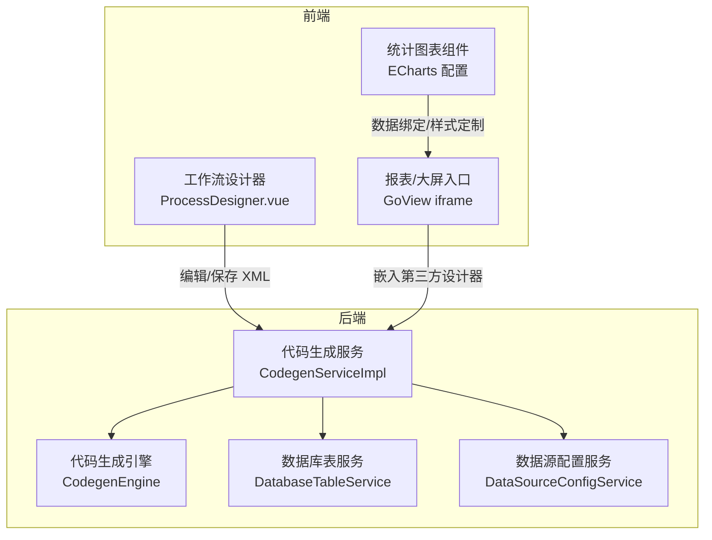
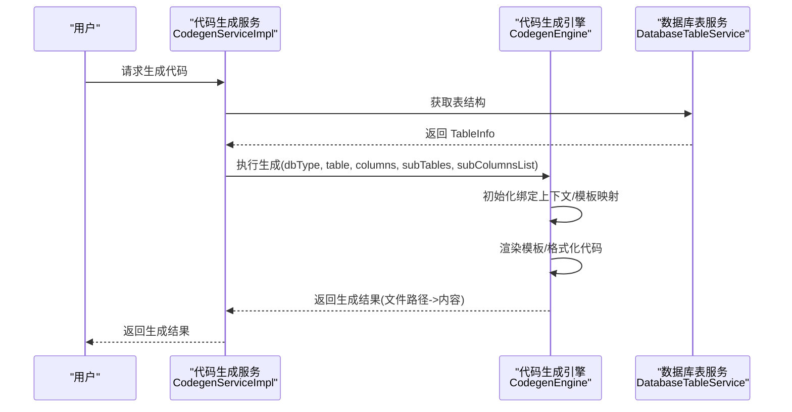
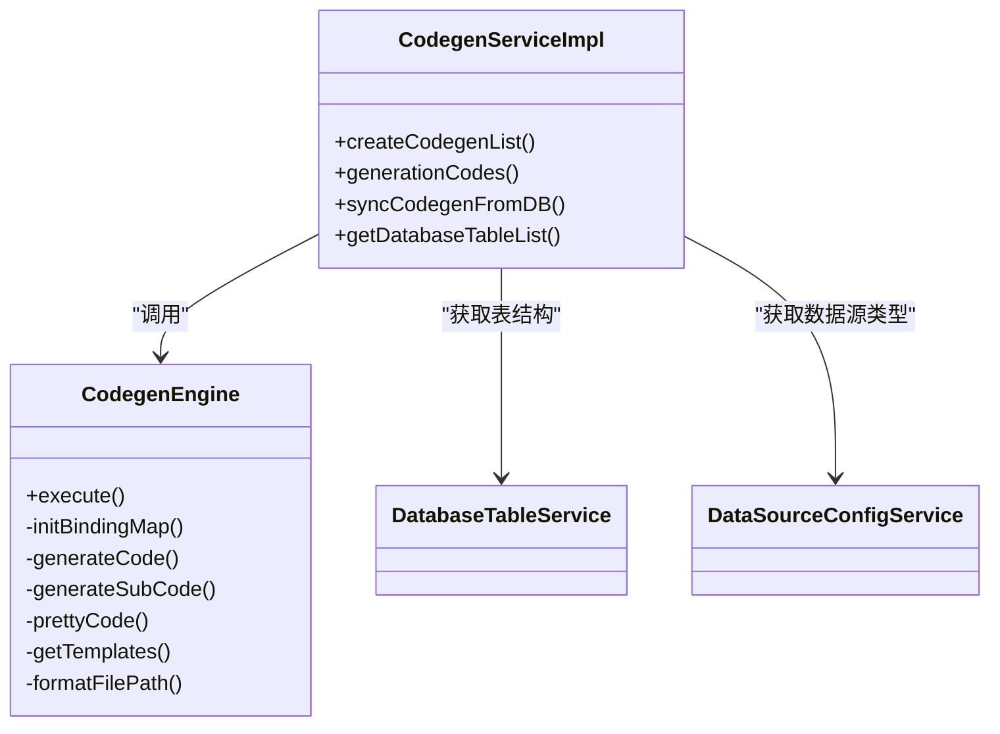
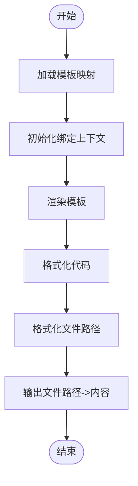
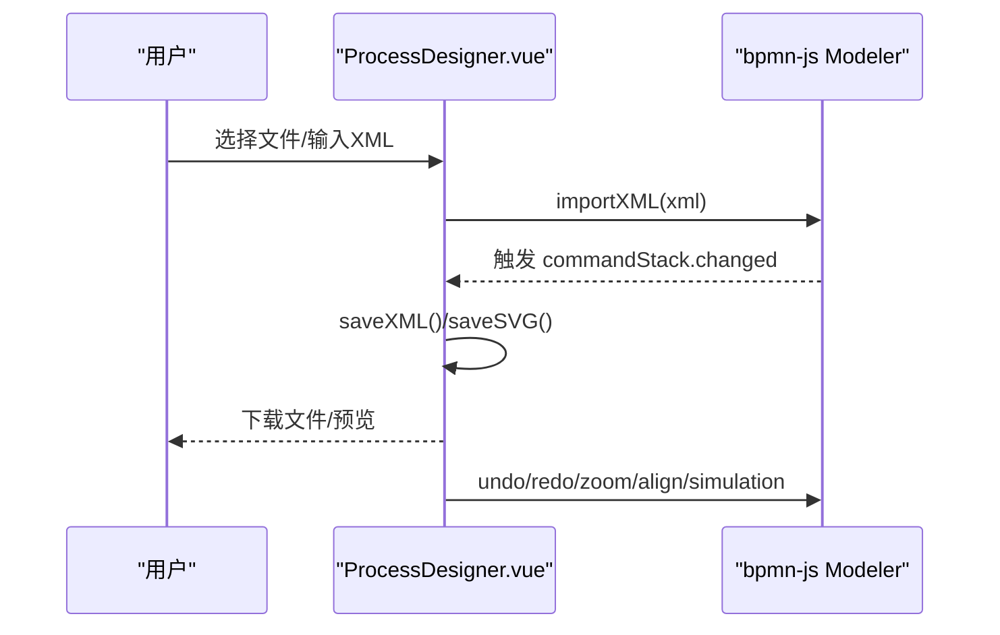
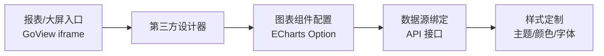
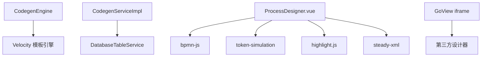

# 低代码开发平台

<cite>
**本文档引用的文件**
- [CodegenEngine.java](file://backend/qiji-module-infra/src/main/java/com/qiji/cps/module/infra/service/codegen/inner/CodegenEngine.java)
- [CodegenServiceImpl.java](file://backend/qiji-module-infra/src/main/java/com/qiji/cps/module/infra/service/codegen/CodegenServiceImpl.java)
- [CodegenEngineVue2Test.java](file://backend/qiji-module-infra/src/test/java/com/qiji/cps/module/infra/service/codegen/inner/CodegenEngineVue2Test.java)
- [CodegenEngineVue3Test.java](file://backend/qiji-module-infra/src/test/java/com/qiji/cps/module/infra/service/codegen/inner/CodegenEngineVue3Test.java)
- [index.vue](file://backend/qiji-module-infra/src/main/resources/codegen/vue3/views/index.vue.vm)
- [ProcessDesigner.vue](file://frontend/admin-vue3/src/components/bpmnProcessDesigner/package/designer/ProcessDesigner.vue)
- [index.vue](file://frontend/admin-vue3/src/views/bpm/model/form/editor/index.vue)
- [index.vue](file://frontend/admin-vue3/src/views/report/goview/index.vue)
- [ProductSummary.vue](file://frontend/admin-vue3/src/views/mall/statistics/product/components/ProductSummary.vue)
- [BusinessInversionRateSummary.vue](file://frontend/admin-vue3/src/views/crm/statistics/funnel/components/BusinessInversionRateSummary.vue)
- [TimeSummaryChart.vue](file://frontend/admin-vue3/src/views/erp/home/components/TimeSummaryChart.vue)
</cite>

## 目录
1. [简介](#简介)
2. [项目结构](#项目结构)
3. [核心组件](#核心组件)
4. [架构总览](#架构总览)
5. [详细组件分析](#详细组件分析)
6. [依赖分析](#依赖分析)
7. [性能考虑](#性能考虑)
8. [故障排查指南](#故障排查指南)
9. [结论](#结论)
10. [附录](#附录)

## 简介
本项目是一个低代码开发平台，提供以下核心能力：
- 代码生成器：基于数据库表结构，自动生成后端 Java 代码与前端页面代码，支持多种前端框架模板与主子表、树表等高级模板类型。
- 可视化工作流设计器：基于 bpmn-js 构建，支持 BPMN 图形编辑、XML/SVG/BPMN 导出、模拟执行、撤销/恢复、对齐与缩放等交互。
- 报表设计器：集成第三方大屏组件（GoView），支持图表组件配置、数据源绑定与样式定制。
- 大屏设计器：通过 iframe 嵌入第三方大屏设计器，提供实时预览与权限集成。

## 项目结构
整体采用前后端分离架构：
- 后端：Spring Boot + MyBatis，位于 backend 目录，核心代码生成服务位于 qiji-module-infra 模块。
- 前端：admin-vue3 与 mall-uniapp 等多套前端工程，分别提供管理后台与移动端页面能力。
- 报表与大屏：通过 iframe 集成第三方 GoView 与积木报表。

**图表来源**
- [CodegenServiceImpl.java:1-311](file://backend/qiji-module-infra/src/main/java/com/qiji/cps/module/infra/service/codegen/CodegenServiceImpl.java#L1-L311)
- [CodegenEngine.java:1-680](file://backend/qiji-module-infra/src/main/java/com/qiji/cps/module/infra/service/codegen/inner/CodegenEngine.java#L1-L680)
- [ProcessDesigner.vue:1-656](file://frontend/admin-vue3/src/components/bpmnProcessDesigner/package/designer/ProcessDesigner.vue#L1-L656)
- [index.vue:1-17](file://frontend/admin-vue3/src/views/report/goview/index.vue#L1-L17)

**章节来源**
- [CodegenServiceImpl.java:1-311](file://backend/qiji-module-infra/src/main/java/com/qiji/cps/module/infra/service/codegen/CodegenServiceImpl.java#L1-L311)
- [CodegenEngine.java:1-680](file://backend/qiji-module-infra/src/main/java/com/qiji/cps/module/infra/service/codegen/inner/CodegenEngine.java#L1-L680)
- [ProcessDesigner.vue:1-656](file://frontend/admin-vue3/src/components/bpmnProcessDesigner/package/designer/ProcessDesigner.vue#L1-L656)
- [index.vue:1-17](file://frontend/admin-vue3/src/views/report/goview/index.vue#L1-L17)

## 核心组件
- 代码生成服务（CodegenServiceImpl）：负责从数据库导入表结构、校验与同步、生成代码并返回结果。
- 代码生成引擎（CodegenEngine）：负责模板加载、变量绑定、路径格式化、代码渲染与美化。
- 工作流设计器（ProcessDesigner.vue）：基于 bpmn-js 提供 BPMN 图形编辑、事件监听、下载与预览。
- 报表/大屏入口：通过 iframe 嵌入第三方设计器，实现实时预览与权限传递。

**章节来源**
- [CodegenServiceImpl.java:68-311](file://backend/qiji-module-infra/src/main/java/com/qiji/cps/module/infra/service/codegen/CodegenServiceImpl.java#L68-L311)
- [CodegenEngine.java:311-428](file://backend/qiji-module-infra/src/main/java/com/qiji/cps/module/infra/service/codegen/inner/CodegenEngine.java#L311-L428)
- [ProcessDesigner.vue:198-656](file://frontend/admin-vue3/src/components/bpmnProcessDesigner/package/designer/ProcessDesigner.vue#L198-L656)

## 架构总览
后端通过数据库表服务获取表结构，结合代码生成服务与引擎，输出后端 Java 代码与前端页面代码；前端通过工作流设计器与报表/大屏入口与后端交互。

**图表来源**
- [CodegenServiceImpl.java:260-298](file://backend/qiji-module-infra/src/main/java/com/qiji/cps/module/infra/service/codegen/CodegenServiceImpl.java#L260-L298)
- [CodegenEngine.java:321-351](file://backend/qiji-module-infra/src/main/java/com/qiji/cps/module/infra/service/codegen/inner/CodegenEngine.java#L321-L351)

## 详细组件分析

### 代码生成器实现原理
- 数据库表结构解析：通过数据库表服务获取表信息与字段元数据，校验注释完整性，并构建 CodegenTableDO 与 CodegenColumnDO。
- 模板引擎使用：采用 hutool 的 Velocity 模板封装，支持后端与前端模板的统一渲染。
- 代码文件生成流程：
  - 初始化全局绑定变量（包名、工具类、枚举等）。
  - 根据前端类型与模板类型选择模板集合。
  - 渲染模板，格式化前端代码，输出文件路径与内容映射。
  - 支持主子表与树表的特殊模板分支。

**图表来源**
- [CodegenServiceImpl.java:68-311](file://backend/qiji-module-infra/src/main/java/com/qiji/cps/module/infra/service/codegen/CodegenServiceImpl.java#L68-L311)
- [CodegenEngine.java:321-543](file://backend/qiji-module-infra/src/main/java/com/qiji/cps/module/infra/service/codegen/inner/CodegenEngine.java#L321-L543)

**章节来源**
- [CodegenServiceImpl.java:77-127](file://backend/qiji-module-infra/src/main/java/com/qiji/cps/module/infra/service/codegen/CodegenServiceImpl.java#L77-L127)
- [CodegenEngine.java:430-518](file://backend/qiji-module-infra/src/main/java/com/qiji/cps/module/infra/service/codegen/inner/CodegenEngine.java#L430-L518)

#### 模板系统与变量替换
- 模板语法：后端模板采用 Velocity 语法（如 #foreach、#if、#set），前端模板采用 .vm 文件。
- 变量替换：引擎在 initBindingMap 中注入全局与表级变量，如 basePackage、table、columns、permissionPrefix 等。
- 条件渲染：根据模板类型（普通/树表/主子表）与前端类型（Vue2/Vue3/UniApp/vben 等）动态选择模板与生成路径。

**图表来源**
- [CodegenEngine.java:353-360](file://backend/qiji-module-infra/src/main/java/com/qiji/cps/module/infra/service/codegen/inner/CodegenEngine.java#L353-L360)
- [index.vue:11-83](file://backend/qiji-module-infra/src/main/resources/codegen/vue3/views/index.vue.vm#L11-L83)

**章节来源**
- [CodegenEngine.java:69-232](file://backend/qiji-module-infra/src/main/java/com/qiji/cps/module/infra/service/codegen/inner/CodegenEngine.java#L69-L232)
- [index.vue:1-424](file://backend/qiji-module-infra/src/main/resources/codegen/vue3/views/index.vue.vm#L1-L424)

#### 单元测试与模板验证
- Vue2/Vue3 代码生成器单元测试：通过构造表与字段，调用引擎执行并断言生成结果，确保模板正确渲染。

**章节来源**
- [CodegenEngineVue2Test.java:23-37](file://backend/qiji-module-infra/src/test/java/com/qiji/cps/module/infra/service/codegen/inner/CodegenEngineVue2Test.java#L23-L37)
- [CodegenEngineVue3Test.java:24-37](file://backend/qiji-module-infra/src/test/java/com/qiji/cps/module/infra/service/codegen/inner/CodegenEngineVue3Test.java#L24-L37)

### 可视化工作流设计器
- 架构：基于 bpmn-js Modeler，提供容器、键盘绑定、额外模块与 Moddle 扩展。
- 交互：支持打开本地文件、下载 XML/SVG/BPMN、预览 XML/JSON、撤销/恢复、缩放、对齐、模拟执行等。
- 事件：监听 commandStack.changed、canvas.viewbox.changed 等事件，实时回传 XML 并触发保存。

**图表来源**
- [ProcessDesigner.vue:407-482](file://frontend/admin-vue3/src/components/bpmnProcessDesigner/package/designer/ProcessDesigner.vue#L407-L482)
- [ProcessDesigner.vue:503-577](file://frontend/admin-vue3/src/components/bpmnProcessDesigner/package/designer/ProcessDesigner.vue#L503-L577)

**章节来源**
- [ProcessDesigner.vue:241-482](file://frontend/admin-vue3/src/components/bpmnProcessDesigner/package/designer/ProcessDesigner.vue#L241-L482)
- [index.vue:1-39](file://frontend/admin-vue3/src/views/bpm/model/form/editor/index.vue#L1-L39)

### 报表设计器与图表组件
- 大屏设计器：通过 iframe 嵌入第三方 GoView，传递访问令牌以实现鉴权与预览。
- 图表组件：基于 ECharts 配置，支持工具箱、提示框、坐标轴、系列等配置项，数据通过接口拉取并填充。

**图表来源**
- [index.vue:1-17](file://frontend/admin-vue3/src/views/report/goview/index.vue#L1-L17)
- [ProductSummary.vue:179-252](file://frontend/admin-vue3/src/views/mall/statistics/product/components/ProductSummary.vue#L179-L252)
- [BusinessInversionRateSummary.vue:175-273](file://frontend/admin-vue3/src/views/crm/statistics/funnel/components/BusinessInversionRateSummary.vue#L175-L273)
- [TimeSummaryChart.vue:50-86](file://frontend/admin-vue3/src/views/erp/home/components/TimeSummaryChart.vue#L50-L86)

**章节来源**
- [index.vue:8-16](file://frontend/admin-vue3/src/views/report/goview/index.vue#L8-L16)
- [ProductSummary.vue:179-252](file://frontend/admin-vue3/src/views/mall/statistics/product/components/ProductSummary.vue#L179-L252)
- [BusinessInversionRateSummary.vue:175-273](file://frontend/admin-vue3/src/views/crm/statistics/funnel/components/BusinessInversionRateSummary.vue#L175-L273)
- [TimeSummaryChart.vue:50-86](file://frontend/admin-vue3/src/views/erp/home/components/TimeSummaryChart.vue#L50-L86)

## 依赖分析
- 后端依赖：MyBatis、Hutool 模板引擎、bpmn-js（前端设计器）、第三方 GoView（大屏）。
- 前端依赖：Element Plus、bpmn-js、bpmn-js-token-simulation、highlight.js、steady-xml。

**图表来源**
- [CodegenEngine.java:258-275](file://backend/qiji-module-infra/src/main/java/com/qiji/cps/module/infra/service/codegen/inner/CodegenEngine.java#L258-L275)
- [ProcessDesigner.vue:205-237](file://frontend/admin-vue3/src/components/bpmnProcessDesigner/package/designer/ProcessDesigner.vue#L205-L237)
- [index.vue:13-15](file://frontend/admin-vue3/src/views/report/goview/index.vue#L13-L15)

**章节来源**
- [CodegenEngine.java:258-275](file://backend/qiji-module-infra/src/main/java/com/qiji/cps/module/infra/service/codegen/inner/CodegenEngine.java#L258-L275)
- [ProcessDesigner.vue:205-237](file://frontend/admin-vue3/src/components/bpmnProcessDesigner/package/designer/ProcessDesigner.vue#L205-L237)

## 性能考虑
- 模板渲染：前端 Vue 模板在生成后统一进行代码美化与冗余清理，减少格式校验错误。
- 事件监听：设计器仅在必要时触发保存与预览，避免频繁渲染。
- 大屏预览：iframe 方式隔离第三方设计器，降低前端资源占用。

## 故障排查指南
- 代码生成失败：检查表注释与字段注释是否完整，确认数据源配置与表是否存在。
- 工作流设计器异常：查看命令栈事件回调与视图缩放事件，确认 XML 导入与保存是否成功。
- 报表/大屏无数据：检查令牌传递与接口返回，确认 ECharts 配置项与数据映射。

**章节来源**
- [CodegenServiceImpl.java:112-127](file://backend/qiji-module-infra/src/main/java/com/qiji/cps/module/infra/service/codegen/CodegenServiceImpl.java#L112-L127)
- [ProcessDesigner.vue:463-482](file://frontend/admin-vue3/src/components/bpmnProcessDesigner/package/designer/ProcessDesigner.vue#L463-L482)
- [index.vue:13-15](file://frontend/admin-vue3/src/views/report/goview/index.vue#L13-L15)

## 结论
该低代码平台通过“数据库表结构 + 模板引擎”的方式，实现了后端与前端的自动化代码生成；配合可视化工作流设计器与第三方大屏/报表组件，覆盖了从 CRUD 页面到复杂业务流程与数据可视化的全链路需求。建议在实际使用中关注模板变量与路径格式化的一致性，以及设计器与第三方组件的版本兼容性。

## 附录
- 快速生成 CRUD 页面步骤
  1) 在后端选择数据源与目标表，调用生成服务。
  2) 服务解析表结构并构建绑定上下文。
  3) 引擎根据前端类型选择模板并渲染，输出文件路径与内容。
  4) 前端直接使用生成的页面与 API 进行二次开发。
- 复杂业务功能示例
  - 主子表：通过主表模板类型与子表字段关联生成联动列表与表单。
  - 树表：启用树形模板，生成树形结构的列表与操作。
  - 工作流：在设计器中绘制流程图，导出 XML/SVG/BPMN，接入后端流程引擎。
  - 报表：在 GoView 中配置图表与样式，绑定数据源接口，实现实时预览。

**章节来源**
- [CodegenServiceImpl.java:260-298](file://backend/qiji-module-infra/src/main/java/com/qiji/cps/module/infra/service/codegen/CodegenServiceImpl.java#L260-L298)
- [CodegenEngine.java:362-389](file://backend/qiji-module-infra/src/main/java/com/qiji/cps/module/infra/service/codegen/inner/CodegenEngine.java#L362-L389)
- [ProcessDesigner.vue:503-577](file://frontend/admin-vue3/src/components/bpmnProcessDesigner/package/designer/ProcessDesigner.vue#L503-L577)
- [index.vue:13-15](file://frontend/admin-vue3/src/views/report/goview/index.vue#L13-L15)