# 可视化工作流设计器

<cite>
**本文引用的文件**
- [defaultEmpty.js](file://frontend/admin-vue3/src/components/bpmnProcessDesigner/package/designer/plugins/defaultEmpty.js)
- [CustomPalette.js](file://frontend/admin-vue3/src/components/bpmnProcessDesigner/package/designer/plugins/palette/CustomPalette.js)
- [contentPadProvider.js](file://frontend/admin-vue3/src/components/bpmnProcessDesigner/package/designer/plugins/content-pad/contentPadProvider.js)
- [CustomRules.js](file://frontend/admin-vue3/src/components/bpmnProcessDesigner/src/modules/rules/CustomRules.js)
- [flowableDescriptor.json](file://frontend/admin-vue3/src/components/bpmnProcessDesigner/package/designer/plugins/descriptor/flowableDescriptor.json)
- [index.js](file://frontend/admin-vue3/src/components/bpmnProcessDesigner/package/designer/plugins/extension-moddle/flowable/index.js)
- [consts.ts](file://frontend/admin-vue3/src/components/SimpleProcessDesignerV2/src/consts.ts)
- [ProcessInstanceSimpleViewer.vue](file://frontend/admin-vue3/src/views/bpm/processInstance/detail/ProcessInstanceSimpleViewer.vue)
- [ProcessInstanceOperationButton.vue](file://frontend/admin-vue3/src/views/bpm/processInstance/detail/ProcessInstanceOperationButton.vue)
- [index.vue](file://frontend/admin-uniapp/src/pages-bpm/processInstance/detail/audit/index.vue)
- [index.ts](file://frontend/admin-vue3/src/api/bpm/task/index.ts)
- [index.ts](file://frontend/admin-vue3/src/api/bpm/processInstance/index.ts)
- [index.ts](file://frontend/admin-vue3/src/api/bpm/model/index.ts)
- [index.ts](file://frontend/admin-vue3/src/api/bpm/definition/index.ts)
- [biz-bpm-enum.ts](file://frontend/admin-uniapp/src/utils/constants/biz-bpm-enum.ts)
</cite>

## 目录
1. [引言](#引言)
2. [项目结构](#项目结构)
3. [核心组件](#核心组件)
4. [架构总览](#架构总览)
5. [详细组件分析](#详细组件分析)
6. [依赖分析](#依赖分析)
7. [性能考虑](#性能考虑)
8. [故障排查指南](#故障排查指南)
9. [结论](#结论)
10. [附录](#附录)

## 引言
本技术文档面向“可视化工作流设计器”，围绕前端设计器组件、后端流程定义存储、流程节点拖拽交互、节点类型与连线配置、流程属性设置、Flowable引擎集成、流程实例启动与执行、任务分配与审批、配置项（名称、描述、版本、权限）、常见业务场景示例以及调试测试与部署最佳实践进行全面阐述。文档以仓库现有实现为依据，结合前端设计器与后端API，帮助开发者快速理解并扩展工作流能力。

## 项目结构
工作流相关能力主要分布在前端admin-vue3与admin-uniapp两个客户端工程中，后端通过统一的API接口提供流程定义、流程实例、任务等能力。前端包含两类设计器：
- 基于bpmn-js的可视化设计器插件集合（palette、rules、content-pad、moddle扩展、默认流程模板）
- 基于简单节点模型的“简易流程设计器V2”（节点类型、审批策略、监听器、超时/拒绝/空审批处理等）

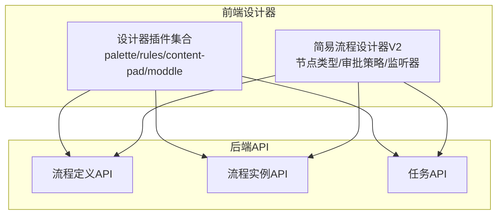

图示来源
- [CustomPalette.js:1-234](file://frontend/admin-vue3/src/components/bpmnProcessDesigner/package/designer/plugins/palette/CustomPalette.js#L1-L234)
- [CustomRules.js:1-16](file://frontend/admin-vue3/src/components/bpmnProcessDesigner/src/modules/rules/CustomRules.js#L1-L16)
- [contentPadProvider.js:319-423](file://frontend/admin-vue3/src/components/bpmnProcessDesigner/package/designer/plugins/content-pad/contentPadProvider.js#L319-L423)
- [index.ts](file://frontend/admin-vue3/src/api/bpm/definition/index.ts)
- [index.ts](file://frontend/admin-vue3/src/api/bpm/processInstance/index.ts)
- [index.ts](file://frontend/admin-vue3/src/api/bpm/task/index.ts)

章节来源
- [CustomPalette.js:1-234](file://frontend/admin-vue3/src/components/bpmnProcessDesigner/package/designer/plugins/palette/CustomPalette.js#L1-L234)
- [CustomRules.js:1-16](file://frontend/admin-vue3/src/components/bpmnProcessDesigner/src/modules/rules/CustomRules.js#L1-L16)
- [contentPadProvider.js:319-423](file://frontend/admin-vue3/src/components/bpmnProcessDesigner/package/designer/plugins/content-pad/contentPadProvider.js#L319-L423)
- [index.ts](file://frontend/admin-vue3/src/api/bpm/definition/index.ts)
- [index.ts](file://frontend/admin-vue3/src/api/bpm/processInstance/index.ts)
- [index.ts](file://frontend/admin-vue3/src/api/bpm/task/index.ts)

## 核心组件
- 设计器插件集合：提供画布工具、节点面板、内容菜单、规则限制、Flowable扩展描述符与moddle扩展注册。
- 简易流程设计器V2：提供节点类型枚举、审批策略、监听器、超时/拒绝/空审批处理、路由分支、延迟器、触发器等配置。
- 流程实例查看与审批：支持流程状态映射、审批操作弹层、退回节点选择、自选审批人等。
- API层：流程定义、流程实例、任务等后端接口。

章节来源
- [consts.ts:1-800](file://frontend/admin-vue3/src/components/SimpleProcessDesignerV2/src/consts.ts#L1-L800)
- [ProcessInstanceSimpleViewer.vue:70-142](file://frontend/admin-vue3/src/views/bpm/processInstance/detail/ProcessInstanceSimpleViewer.vue#L70-L142)
- [ProcessInstanceOperationButton.vue:697-832](file://frontend/admin-vue3/src/views/bpm/processInstance/detail/ProcessInstanceOperationButton.vue#L697-L832)
- [index.vue:284-327](file://frontend/admin-uniapp/src/pages-bpm/processInstance/detail/audit/index.vue#L284-L327)
- [index.ts](file://frontend/admin-vue3/src/api/bpm/task/index.ts)
- [index.ts](file://frontend/admin-vue3/src/api/bpm/processInstance/index.ts)
- [index.ts](file://frontend/admin-vue3/src/api/bpm/model/index.ts)
- [index.ts](file://frontend/admin-vue3/src/api/bpm/definition/index.ts)

## 架构总览
前端设计器通过插件化扩展bpmn-js，实现节点拖拽、连线、上下文菜单、规则约束与Flowable扩展。后端提供流程定义、流程实例、任务等REST接口，前端在流程实例详情页进行状态渲染与审批操作。

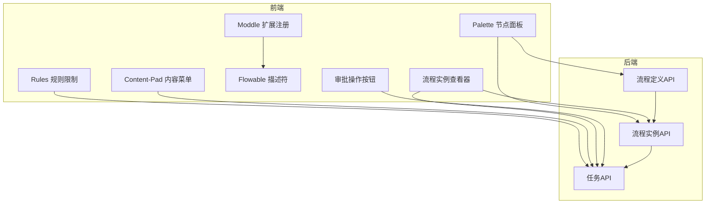

图示来源
- [CustomPalette.js:1-234](file://frontend/admin-vue3/src/components/bpmnProcessDesigner/package/designer/plugins/palette/CustomPalette.js#L1-L234)
- [CustomRules.js:1-16](file://frontend/admin-vue3/src/components/bpmnProcessDesigner/src/modules/rules/CustomRules.js#L1-L16)
- [contentPadProvider.js:319-423](file://frontend/admin-vue3/src/components/bpmnProcessDesigner/package/designer/plugins/content-pad/contentPadProvider.js#L319-L423)
- [index.js:1-10](file://frontend/admin-vue3/src/components/bpmnProcessDesigner/package/designer/plugins/extension-moddle/flowable/index.js#L1-L10)
- [flowableDescriptor.json:1-64](file://frontend/admin-vue3/src/components/bpmnProcessDesigner/package/designer/plugins/descriptor/flowableDescriptor.json#L1-L64)
- [ProcessInstanceSimpleViewer.vue:70-142](file://frontend/admin-vue3/src/views/bpm/processInstance/detail/ProcessInstanceSimpleViewer.vue#L70-L142)
- [ProcessInstanceOperationButton.vue:697-832](file://frontend/admin-vue3/src/views/bpm/processInstance/detail/ProcessInstanceOperationButton.vue#L697-L832)
- [index.ts](file://frontend/admin-vue3/src/api/bpm/task/index.ts)
- [index.ts](file://frontend/admin-vue3/src/api/bpm/processInstance/index.ts)
- [index.ts](file://frontend/admin-vue3/src/api/bpm/definition/index.ts)

## 详细组件分析

### 组件A：BPMN节点面板（Palette）
- 职责：提供节点创建入口（开始事件、中间/边界事件、结束事件、网关、用户任务、服务任务、数据对象/存储、子流程、参与者、分组等），以及工具（抓手、套索、空间、全局连接）。
- 关键点：继承bpmn-js的PaletteProvider，重写getPaletteEntries，统一注入工具与节点创建行为。

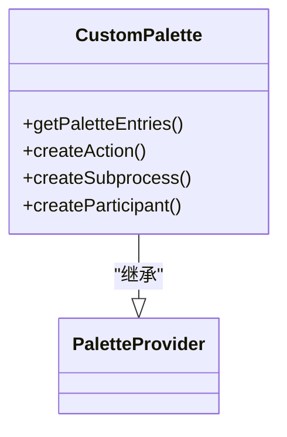

图示来源
- [CustomPalette.js:1-234](file://frontend/admin-vue3/src/components/bpmnProcessDesigner/package/designer/plugins/palette/CustomPalette.js#L1-L234)

章节来源
- [CustomPalette.js:1-234](file://frontend/admin-vue3/src/components/bpmnProcessDesigner/package/designer/plugins/palette/CustomPalette.js#L1-L234)

### 组件B：连线与上下文菜单（Content-Pad）
- 职责：为流程节点提供“连接/关联/注释/删除”等上下文菜单项，支持基于规则的删除允许性判断。
- 关键点：根据业务对象类型动态生成菜单项，统一使用startConnect与removeElement。

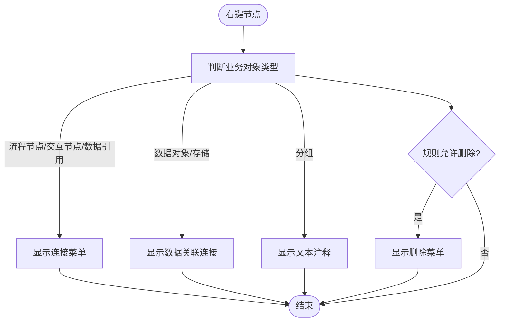

图示来源
- [contentPadProvider.js:319-423](file://frontend/admin-vue3/src/components/bpmnProcessDesigner/package/designer/plugins/content-pad/contentPadProvider.js#L319-L423)

章节来源
- [contentPadProvider.js:319-423](file://frontend/admin-vue3/src/components/bpmnProcessDesigner/package/designer/plugins/content-pad/contentPadProvider.js#L319-L423)

### 组件C：规则限制（Rules）
- 职责：通过覆盖bpmn-js的BpmnRules，限制元素拖拽与移动，确保设计器符合业务约束。
- 关键点：canDrop与canMove返回false，禁止外部拖入与自由移动。

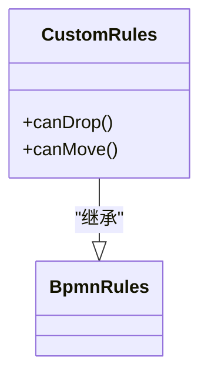

图示来源
- [CustomRules.js:1-16](file://frontend/admin-vue3/src/components/bpmnProcessDesigner/src/modules/rules/CustomRules.js#L1-L16)

章节来源
- [CustomRules.js:1-16](file://frontend/admin-vue3/src/components/bpmnProcessDesigner/src/modules/rules/CustomRules.js#L1-L16)

### 组件D：Flowable扩展与描述符
- 职责：注册Flowable扩展moddle，提供Flowable命名空间与扩展类型（如InOutBinding、异步能力等），并声明描述符。
- 关键点：index.js导出扩展注册表，flowableDescriptor.json定义扩展类型与属性。

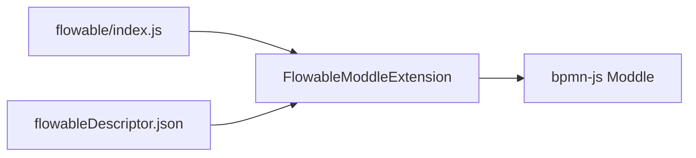

图示来源
- [index.js:1-10](file://frontend/admin-vue3/src/components/bpmnProcessDesigner/package/designer/plugins/extension-moddle/flowable/index.js#L1-L10)
- [flowableDescriptor.json:1-64](file://frontend/admin-vue3/src/components/bpmnProcessDesigner/package/designer/plugins/descriptor/flowableDescriptor.json#L1-L64)

章节来源
- [index.js:1-10](file://frontend/admin-vue3/src/components/bpmnProcessDesigner/package/designer/plugins/extension-moddle/flowable/index.js#L1-L10)
- [flowableDescriptor.json:1-64](file://frontend/admin-vue3/src/components/bpmnProcessDesigner/package/designer/plugins/descriptor/flowableDescriptor.json#L1-L64)

### 组件E：默认流程模板（Empty Template）
- 职责：生成可执行的BPMN2定义XML，默认命名空间适配Flowable/Camunda/Activiti。
- 关键点：根据传入key/name/type生成基础流程定义。

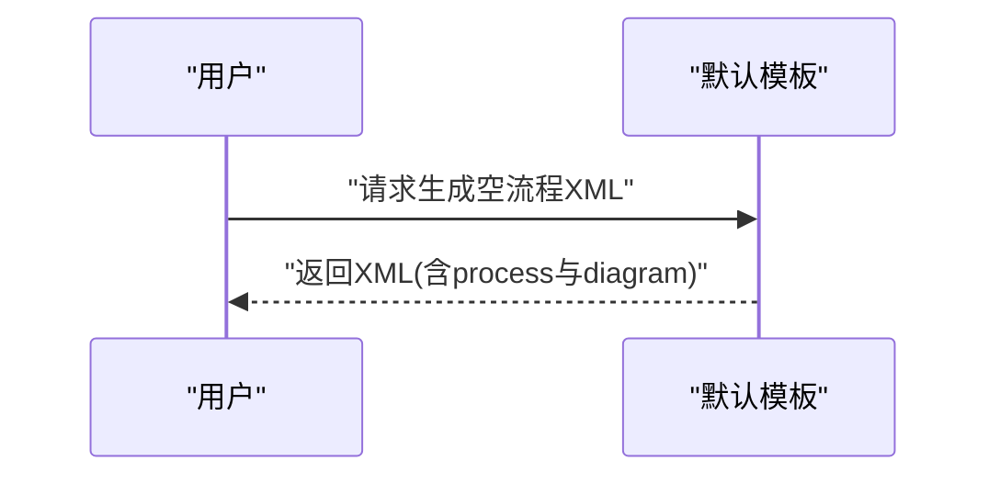

图示来源
- [defaultEmpty.js:1-24](file://frontend/admin-vue3/src/components/bpmnProcessDesigner/package/designer/plugins/defaultEmpty.js#L1-L24)

章节来源
- [defaultEmpty.js:1-24](file://frontend/admin-vue3/src/components/bpmnProcessDesigner/package/designer/plugins/defaultEmpty.js#L1-L24)

### 组件F：简易流程设计器V2（节点类型与配置）
- 节点类型：结束事件、发起人、审批人、抄送人、办理人、延迟器、触发器、子流程、条件节点、分支节点（排他/并行/包容/路由）。
- 审批策略：候选人策略（角色/部门/岗位/用户/自选/发起人相关/表达式）、多人审批方式（顺序/会签/或签/随机）、审批类型（人工/自动通过/自动拒绝）。
- 监听器与处理：任务创建/指派/完成监听器、超时处理（提醒/自动同意/自动拒绝）、拒绝处理（终止/退回）、空审批处理（自动通过/拒绝/指定用户/转交管理员）、发起人与审批人相同处理。
- 其他：条件设置（表达式/规则）、路由分支、延迟器（固定时长/固定日期）、触发器（HTTP请求/回调/表单更新/删除）、签名、审批意见、跳过表达式、子流程设置等。

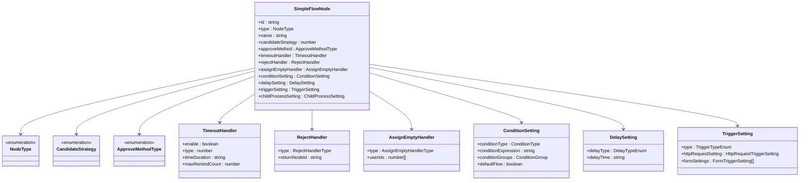

图示来源
- [consts.ts:1-800](file://frontend/admin-vue3/src/components/SimpleProcessDesignerV2/src/consts.ts#L1-L800)

章节来源
- [consts.ts:1-800](file://frontend/admin-vue3/src/components/SimpleProcessDesignerV2/src/consts.ts#L1-L800)

### 组件G：流程实例查看与状态映射
- 职责：根据流程实例运行状态与已完成/进行中/被拒绝活动ID，映射节点活动状态（未开始/进行中/通过/拒绝/抄送/延迟器/触发器/条件分支）。
- 关键点：区分结束节点、审批节点、抄送节点、延迟器节点、触发器节点、条件节点、网关节点的不同状态计算逻辑。

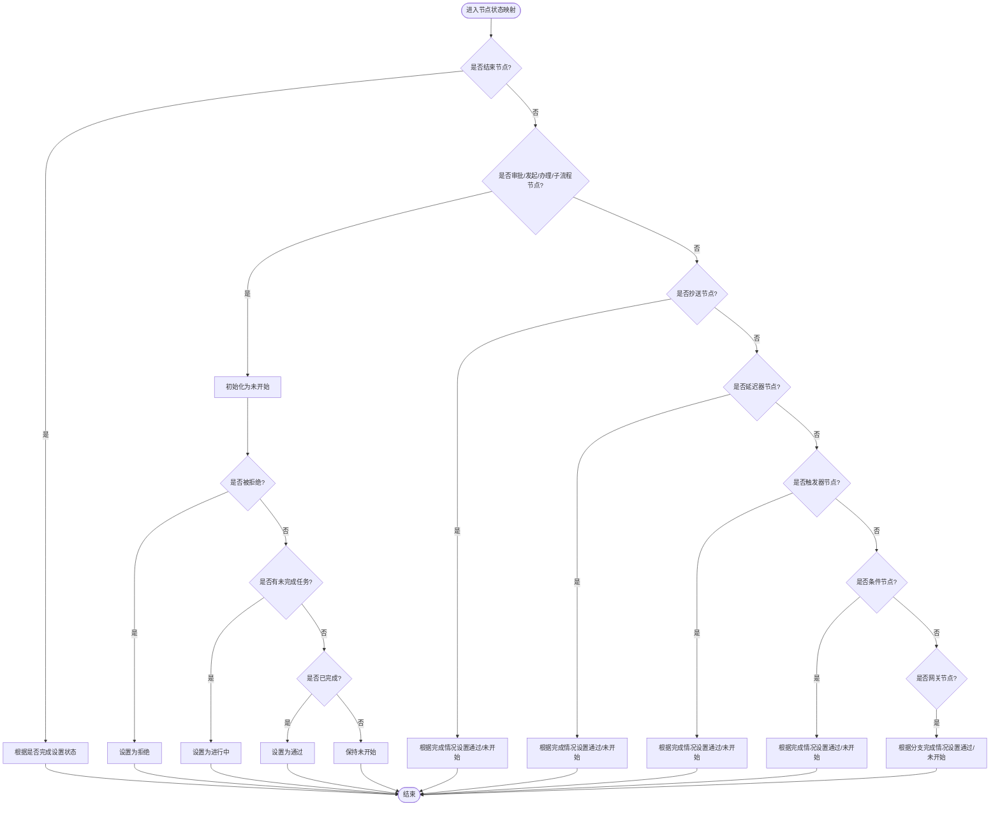

图示来源
- [ProcessInstanceSimpleViewer.vue:70-142](file://frontend/admin-vue3/src/views/bpm/processInstance/detail/ProcessInstanceSimpleViewer.vue#L70-L142)

章节来源
- [ProcessInstanceSimpleViewer.vue:70-142](file://frontend/admin-vue3/src/views/bpm/processInstance/detail/ProcessInstanceSimpleViewer.vue#L70-L142)

### 组件H：审批操作与退回节点选择
- 职责：审批通过/拒绝、退回节点选择、自选审批人、签名、多表单校验与变量合并、任务完成后的UI反馈。
- 关键点：根据任务状态与表单变量动态查询下一审批节点，支持退回节点列表获取与选择。

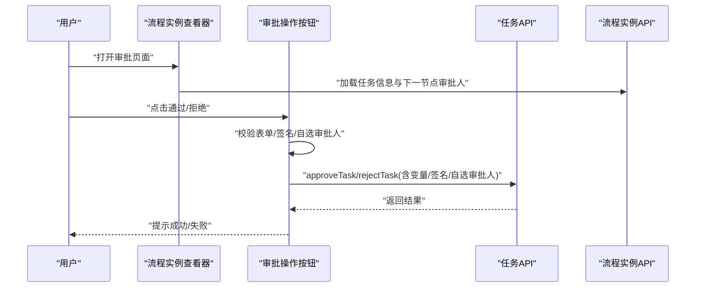

图示来源
- [ProcessInstanceOperationButton.vue:697-832](file://frontend/admin-vue3/src/views/bpm/processInstance/detail/ProcessInstanceOperationButton.vue#L697-L832)
- [index.vue:284-327](file://frontend/admin-uniapp/src/pages-bpm/processInstance/detail/audit/index.vue#L284-L327)
- [index.ts](file://frontend/admin-vue3/src/api/bpm/task/index.ts)
- [index.ts](file://frontend/admin-vue3/src/api/bpm/processInstance/index.ts)

章节来源
- [ProcessInstanceOperationButton.vue:697-832](file://frontend/admin-vue3/src/views/bpm/processInstance/detail/ProcessInstanceOperationButton.vue#L697-L832)
- [index.vue:284-327](file://frontend/admin-uniapp/src/pages-bpm/processInstance/detail/audit/index.vue#L284-L327)
- [index.ts](file://frontend/admin-vue3/src/api/bpm/task/index.ts)
- [index.ts](file://frontend/admin-vue3/src/api/bpm/processInstance/index.ts)

## 依赖分析
- 前端设计器依赖bpmn-js及其插件（palette、rules、content-pad、moddle），并通过Flowable扩展描述符增强BPMN语义。
- 流程实例查看与审批依赖后端任务API与流程实例API，实现状态映射与操作提交。
- 常量与类型定义集中在简易流程设计器V2的consts.ts中，统一了节点类型、审批策略、监听器与处理策略等。

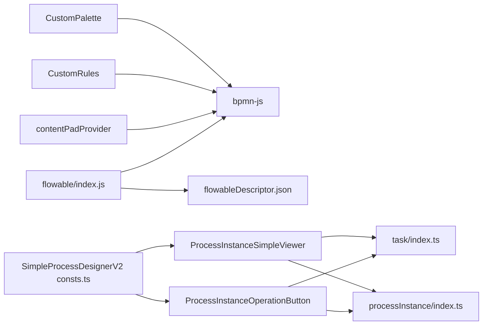

图示来源
- [CustomPalette.js:1-234](file://frontend/admin-vue3/src/components/bpmnProcessDesigner/package/designer/plugins/palette/CustomPalette.js#L1-L234)
- [CustomRules.js:1-16](file://frontend/admin-vue3/src/components/bpmnProcessDesigner/src/modules/rules/CustomRules.js#L1-L16)
- [contentPadProvider.js:319-423](file://frontend/admin-vue3/src/components/bpmnProcessDesigner/package/designer/plugins/content-pad/contentPadProvider.js#L319-L423)
- [index.js:1-10](file://frontend/admin-vue3/src/components/bpmnProcessDesigner/package/designer/plugins/extension-moddle/flowable/index.js#L1-L10)
- [flowableDescriptor.json:1-64](file://frontend/admin-vue3/src/components/bpmnProcessDesigner/package/designer/plugins/descriptor/flowableDescriptor.json#L1-L64)
- [ProcessInstanceSimpleViewer.vue:70-142](file://frontend/admin-vue3/src/views/bpm/processInstance/detail/ProcessInstanceSimpleViewer.vue#L70-L142)
- [ProcessInstanceOperationButton.vue:697-832](file://frontend/admin-vue3/src/views/bpm/processInstance/detail/ProcessInstanceOperationButton.vue#L697-L832)
- [index.ts](file://frontend/admin-vue3/src/api/bpm/task/index.ts)
- [index.ts](file://frontend/admin-vue3/src/api/bpm/processInstance/index.ts)
- [consts.ts:1-800](file://frontend/admin-vue3/src/components/SimpleProcessDesignerV2/src/consts.ts#L1-L800)

章节来源
- [CustomPalette.js:1-234](file://frontend/admin-vue3/src/components/bpmnProcessDesigner/package/designer/plugins/palette/CustomPalette.js#L1-L234)
- [CustomRules.js:1-16](file://frontend/admin-vue3/src/components/bpmnProcessDesigner/src/modules/rules/CustomRules.js#L1-L16)
- [contentPadProvider.js:319-423](file://frontend/admin-vue3/src/components/bpmnProcessDesigner/package/designer/plugins/content-pad/contentPadProvider.js#L319-L423)
- [index.js:1-10](file://frontend/admin-vue3/src/components/bpmnProcessDesigner/package/designer/plugins/extension-moddle/flowable/index.js#L1-L10)
- [flowableDescriptor.json:1-64](file://frontend/admin-vue3/src/components/bpmnProcessDesigner/package/designer/plugins/descriptor/flowableDescriptor.json#L1-L64)
- [ProcessInstanceSimpleViewer.vue:70-142](file://frontend/admin-vue3/src/views/bpm/processInstance/detail/ProcessInstanceSimpleViewer.vue#L70-L142)
- [ProcessInstanceOperationButton.vue:697-832](file://frontend/admin-vue3/src/views/bpm/processInstance/detail/ProcessInstanceOperationButton.vue#L697-L832)
- [index.ts](file://frontend/admin-vue3/src/api/bpm/task/index.ts)
- [index.ts](file://frontend/admin-vue3/src/api/bpm/processInstance/index.ts)
- [consts.ts:1-800](file://frontend/admin-vue3/src/components/SimpleProcessDesignerV2/src/consts.ts#L1-L800)

## 性能考虑
- 设计器插件：避免在Palette与Rules中执行重型逻辑，尽量通过事件与最小化DOM操作提升拖拽与连线性能。
- 流程实例查看：状态映射应按需计算，避免对大量节点重复遍历；对完成/进行中/被拒绝ID集合使用高效查找结构。
- 审批操作：批量清理自定义审批人数据与表单校验，减少不必要的重绘与网络请求。
- 后端接口：对流程实例与任务分页查询使用合理分页大小，避免一次性加载过多数据。

## 故障排查指南
- 节点无法拖拽/移动：检查Rules是否禁用了拖拽与移动，确认业务对象类型与规则匹配。
- 上下文菜单缺失：检查content-pad对业务对象类型的判断与菜单生成逻辑。
- Flowable扩展无效：确认moddle扩展注册与描述符加载顺序正确，命名空间与类型定义一致。
- 审批状态异常：核对流程实例状态映射逻辑，确保完成/进行中/被拒绝ID集合与节点类型匹配。
- 审批操作失败：检查任务API返回码与错误消息，确认表单校验、签名、自选审批人与变量传递正确。

章节来源
- [CustomRules.js:1-16](file://frontend/admin-vue3/src/components/bpmnProcessDesigner/src/modules/rules/CustomRules.js#L1-L16)
- [contentPadProvider.js:319-423](file://frontend/admin-vue3/src/components/bpmnProcessDesigner/package/designer/plugins/content-pad/contentPadProvider.js#L319-L423)
- [index.js:1-10](file://frontend/admin-vue3/src/components/bpmnProcessDesigner/package/designer/plugins/extension-moddle/flowable/index.js#L1-L10)
- [flowableDescriptor.json:1-64](file://frontend/admin-vue3/src/components/bpmnProcessDesigner/package/designer/plugins/descriptor/flowableDescriptor.json#L1-L64)
- [ProcessInstanceSimpleViewer.vue:70-142](file://frontend/admin-vue3/src/views/bpm/processInstance/detail/ProcessInstanceSimpleViewer.vue#L70-L142)
- [ProcessInstanceOperationButton.vue:697-832](file://frontend/admin-vue3/src/views/bpm/processInstance/detail/ProcessInstanceOperationButton.vue#L697-L832)

## 结论
本工作流设计器通过bpmn-js插件化扩展与简易节点模型，实现了从流程设计到实例执行与审批的完整闭环。Flowable扩展与描述符增强了BPMN语义表达，常量与类型定义保证了节点配置的一致性与可维护性。建议在实际业务中结合具体审批策略与监听器配置，持续优化前端交互与后端接口性能。

## 附录

### 使用示例：请假流程
- 设计阶段：添加“发起人节点”、“审批人节点”（候选人策略：部门负责人/自选）、“抄送人节点”（部门同事）、“结束事件”。
- 审批策略：审批人为空时自动转交管理员；超时自动提醒；拒绝时终止流程。
- 执行阶段：提交后进入审批人任务，审批通过后进入下一节点，最终结束。

章节来源
- [consts.ts:1-800](file://frontend/admin-vue3/src/components/SimpleProcessDesignerV2/src/consts.ts#L1-L800)
- [ProcessInstanceOperationButton.vue:697-832](file://frontend/admin-vue3/src/views/bpm/processInstance/detail/ProcessInstanceOperationButton.vue#L697-L832)

### 使用示例：采购审批流程
- 设计阶段：添加“发起人节点”、“条件节点”（金额阈值）、“审批人节点”（角色：采购主管）、“延迟器节点”（节假日顺延）、“结束事件”。
- 审批策略：多人会签通过比例≥80%；超时自动拒绝；拒绝时退回至发起人。
- 执行阶段：根据条件分支选择不同审批路径，延迟器节点等待条件满足后继续。

章节来源
- [consts.ts:1-800](file://frontend/admin-vue3/src/components/SimpleProcessDesignerV2/src/consts.ts#L1-L800)
- [ProcessInstanceSimpleViewer.vue:70-142](file://frontend/admin-vue3/src/views/bpm/processInstance/detail/ProcessInstanceSimpleViewer.vue#L70-L142)

### 配置选项清单
- 流程名称/描述/版本：通过流程定义API设置与更新。
- 权限控制：审批人策略（角色/部门/岗位/用户/自选/发起人相关/表达式）与按钮权限（通过/拒绝/转办/委派/加签/退回/抄送）。
- 监听器：任务创建/指派/完成监听器，支持HTTP请求参数（固定值/表单）。
- 超时/拒绝/空审批处理：自动提醒/自动同意/自动拒绝；终止/退回；指定用户/转交管理员。
- 路由/延迟/触发器：条件表达式/规则；固定时长/固定日期；HTTP请求/回调/表单更新/删除。

章节来源
- [index.ts](file://frontend/admin-vue3/src/api/bpm/definition/index.ts)
- [consts.ts:1-800](file://frontend/admin-vue3/src/components/SimpleProcessDesignerV2/src/consts.ts#L1-L800)

### 调试、测试与部署最佳实践
- 调试：使用浏览器开发者工具观察设计器事件与API请求，核对流程XML生成与上传；在流程实例详情页验证状态映射与审批操作。
- 测试：编写单元测试覆盖节点类型与审批策略配置，集成测试覆盖流程提交、审批通过/拒绝、退回与结束路径。
- 部署：确保Flowable扩展描述符与moddle扩展随前端打包发布；后端API接口连通性与鉴权配置正确；监控任务超时与审批拒绝的告警。