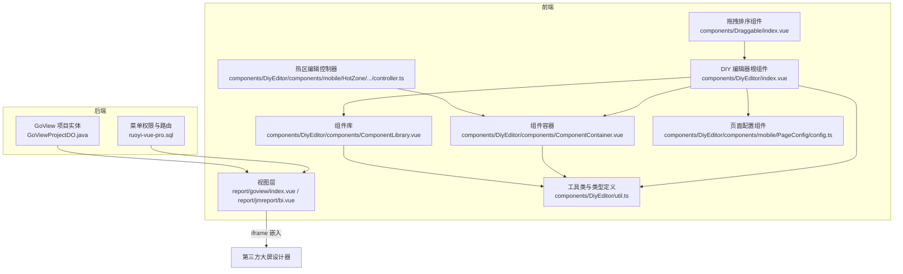
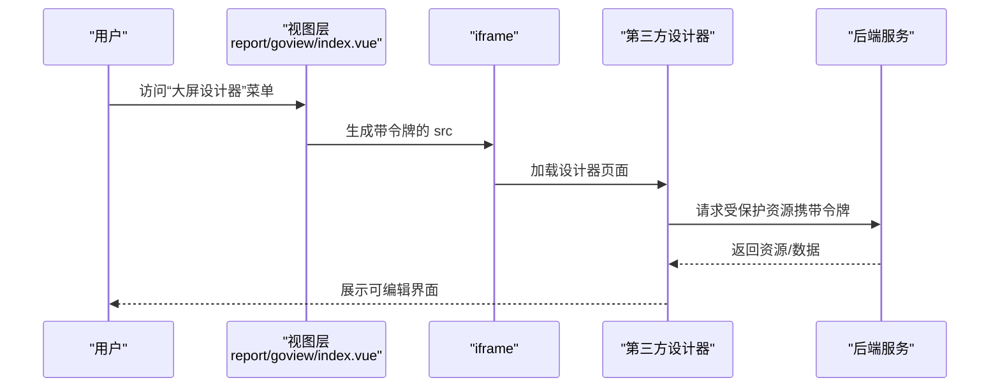
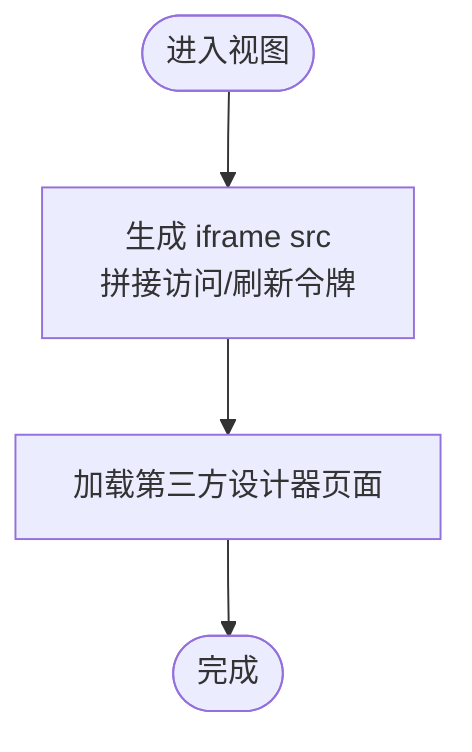
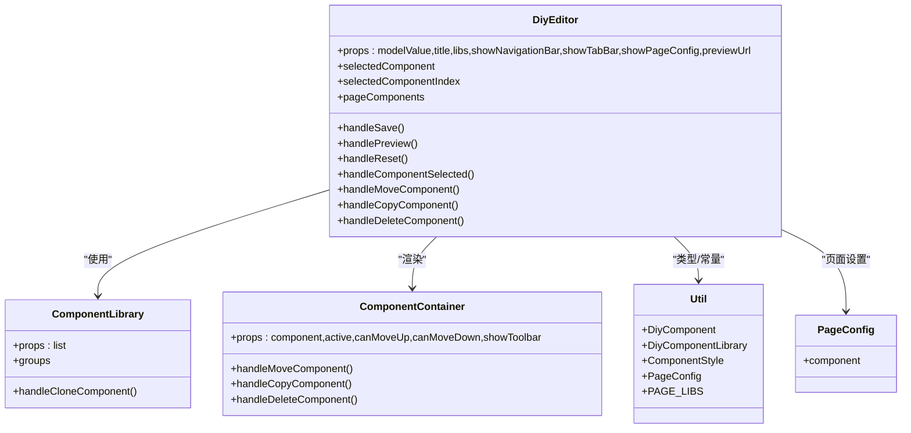
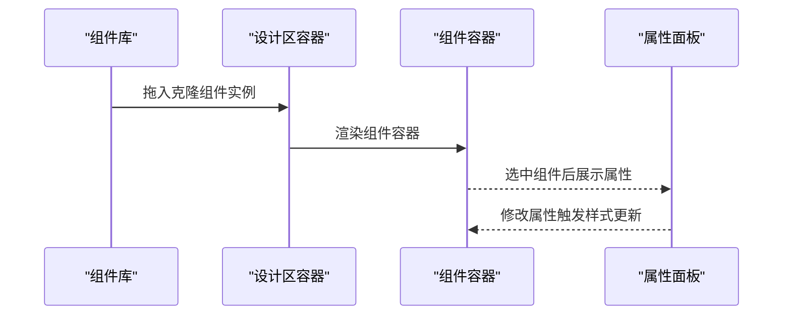
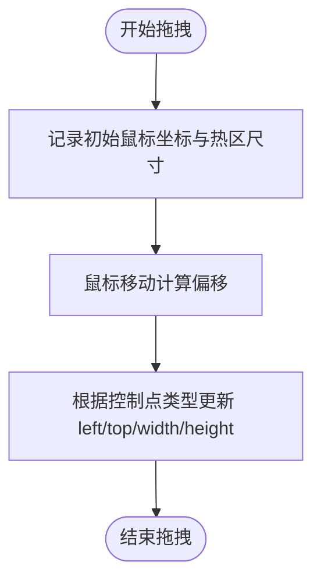
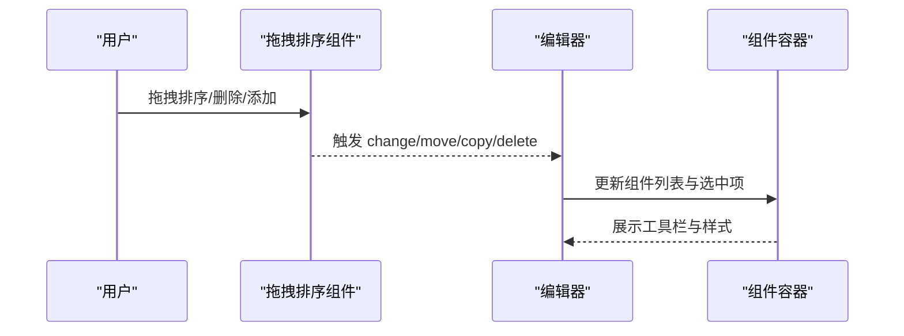
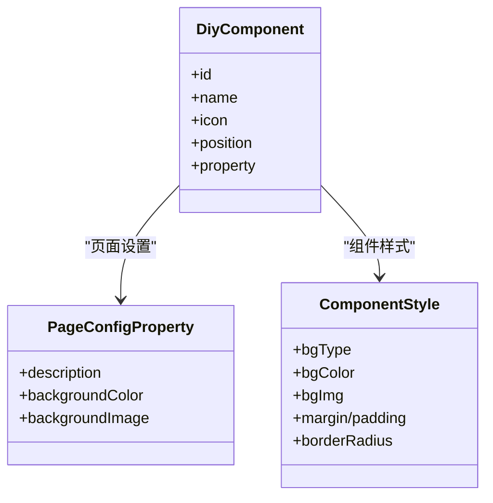
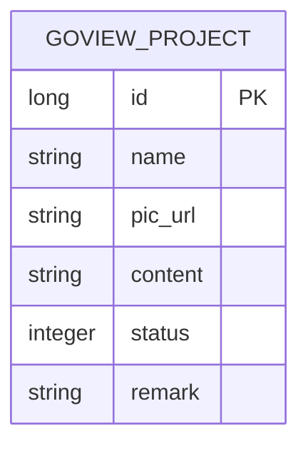
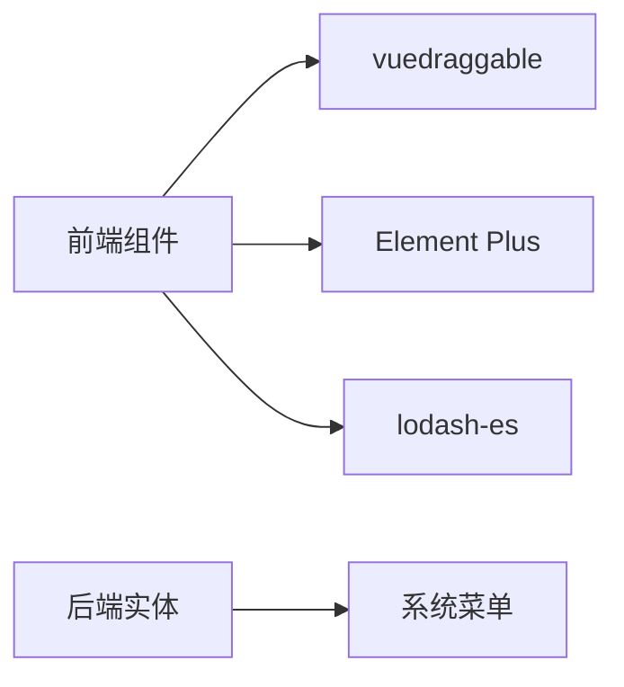

# 大屏设计器

<cite>
**本文引用的文件**
- [index.vue](file://frontend/admin-vue3/src/views/report/goview/index.vue)
- [bi.vue](file://frontend/admin-vue3/src/views/report/jmreport/bi.vue)
- [index.vue](file://frontend/admin-vue3/src/components/DiyEditor/index.vue)
- [ComponentLibrary.vue](file://frontend/admin-vue3/src/components/DiyEditor/components/ComponentLibrary.vue)
- [ComponentContainer.vue](file://frontend/admin-vue3/src/components/DiyEditor/components/ComponentContainer.vue)
- [util.ts](file://frontend/admin-vue3/src/components/DiyEditor/util.ts)
- [config.ts](file://frontend/admin-vue3/src/components/DiyEditor/components/mobile/PageConfig/config.ts)
- [controller.ts](file://frontend/admin-vue3/src/components/DiyEditor/components/mobile/HotZone/components/HotZoneEditDialog/controller.ts)
- [index.vue](file://frontend/admin-vue3/src/components/DiyEditor/components/mobile/HotZone/components/HotZoneEditDialog/index.vue)
- [index.vue](file://frontend/admin-vue3/src/components/Draggable/index.vue)
- [GoViewProjectDO.java](file://backend/qiji-module-report/src/main/java/com/qiji/cps/module/report/dal/dataobject/goview/GoViewProjectDO.java)
- [ruoyi-vue-pro.sql](file://backend/sql/mysql/ruoyi-vue-pro.sql)
</cite>

## 目录
1. [简介](#简介)
2. [项目结构](#项目结构)
3. [核心组件](#核心组件)
4. [架构总览](#架构总览)
5. [详细组件分析](#详细组件分析)
6. [依赖关系分析](#依赖关系分析)
7. [性能考虑](#性能考虑)
8. [故障排查指南](#故障排查指南)
9. [结论](#结论)
10. [附录](#附录)

## 简介
本技术文档面向“大屏设计器”能力，围绕前端可视化编辑器、拖拽式布局系统、实时预览机制进行系统化梳理；同时阐述组件库分类、组件属性配置与样式定制、画布管理与交互（层级控制、对齐吸附）、以及与后端数据的集成方式（实时数据绑定、数据刷新与图表动态更新）。文档还提供运营看板、监控大屏、数据分析大屏等典型场景的使用示例，并给出响应式设计、性能优化与跨设备适配的最佳实践。

## 项目结构
大屏设计器在前端采用 Vue3 + Element Plus + vuedraggable 的组合，在后端通过菜单路由与数据模型支撑项目管理与持久化。前端入口以 iframe 方式嵌入第三方大屏设计器（GoView、JimuBI），并在内部提供可复用的 DIY 编辑器组件体系，用于构建移动端风格的大屏页面。

**图示来源**
- [index.vue:1-17](file://frontend/admin-vue3/src/views/report/goview/index.vue#L1-L17)
- [bi.vue:1-16](file://frontend/admin-vue3/src/views/report/jmreport/bi.vue#L1-L16)
- [index.vue:1-605](file://frontend/admin-vue3/src/components/DiyEditor/index.vue#L1-L605)
- [ComponentLibrary.vue:1-212](file://frontend/admin-vue3/src/components/DiyEditor/components/ComponentLibrary.vue#L1-L212)
- [ComponentContainer.vue:1-240](file://frontend/admin-vue3/src/components/DiyEditor/components/ComponentContainer.vue#L1-L240)
- [util.ts:1-126](file://frontend/admin-vue3/src/components/DiyEditor/util.ts#L1-L126)
- [config.ts:1-24](file://frontend/admin-vue3/src/components/DiyEditor/components/mobile/PageConfig/config.ts#L1-L24)
- [controller.ts:47-143](file://frontend/admin-vue3/src/components/DiyEditor/components/mobile/HotZone/components/HotZoneEditDialog/controller.ts#L47-L143)
- [index.vue:1-43](file://frontend/admin-vue3/src/components/Draggable/index.vue#L1-L43)
- [GoViewProjectDO.java:1-57](file://backend/qiji-module-report/src/main/java/com/qiji/cps/module/report/dal/dataobject/goview/GoViewProjectDO.java#L1-L57)
- [ruoyi-vue-pro.sql:1741-1743](file://backend/sql/mysql/ruoyi-vue-pro.sql#L1741-L1743)

**章节来源**
- [index.vue:1-17](file://frontend/admin-vue3/src/views/report/goview/index.vue#L1-L17)
- [bi.vue:1-16](file://frontend/admin-vue3/src/views/report/jmreport/bi.vue#L1-L16)
- [index.vue:1-605](file://frontend/admin-vue3/src/components/DiyEditor/index.vue#L1-L605)
- [ComponentLibrary.vue:1-212](file://frontend/admin-vue3/src/components/DiyEditor/components/ComponentLibrary.vue#L1-L212)
- [ComponentContainer.vue:1-240](file://frontend/admin-vue3/src/components/DiyEditor/components/ComponentContainer.vue#L1-L240)
- [util.ts:1-126](file://frontend/admin-vue3/src/components/DiyEditor/util.ts#L1-L126)
- [config.ts:1-24](file://frontend/admin-vue3/src/components/DiyEditor/components/mobile/PageConfig/config.ts#L1-L24)
- [controller.ts:47-143](file://frontend/admin-vue3/src/components/DiyEditor/components/mobile/HotZone/components/HotZoneEditDialog/controller.ts#L47-L143)
- [index.vue:1-43](file://frontend/admin-vue3/src/components/Draggable/index.vue#L1-L43)
- [GoViewProjectDO.java:1-57](file://backend/qiji-module-report/src/main/java/com/qiji/cps/module/report/dal/dataobject/goview/GoViewProjectDO.java#L1-L57)
- [ruoyi-vue-pro.sql:1741-1743](file://backend/sql/mysql/ruoyi-vue-pro.sql#L1741-L1743)

## 核心组件
- 视图层（iframe 嵌入）
  - GoView 视图：通过访问令牌与刷新令牌拼接参数加载第三方设计器。
  - JimuBI 视图：通过刷新令牌加载设计器列表页。
- DIY 编辑器
  - 根组件：提供工具栏、左侧组件库、中间设计区、右侧属性面板、预览弹窗。
  - 组件库：按分组展示组件，支持克隆并拖入设计区。
  - 组件容器：为组件提供外边距、内边距、圆角、背景色/图等样式包装与工具栏。
  - 工具类与类型：统一定义组件、组件库、页面配置、组件样式等接口与页面组件库清单。
  - 页面配置组件：定义页面背景色/图、描述等全局属性。
  - 热区编辑控制器：提供热区缩放、拖拽、调整尺寸与位置的逻辑。
  - 拖拽排序组件：通用的可拖拽列表，支持排序、删除、限制数量等。

**章节来源**
- [index.vue:1-17](file://frontend/admin-vue3/src/views/report/goview/index.vue#L1-L17)
- [bi.vue:1-16](file://frontend/admin-vue3/src/views/report/jmreport/bi.vue#L1-L16)
- [index.vue:1-605](file://frontend/admin-vue3/src/components/DiyEditor/index.vue#L1-L605)
- [ComponentLibrary.vue:1-212](file://frontend/admin-vue3/src/components/DiyEditor/components/ComponentLibrary.vue#L1-L212)
- [ComponentContainer.vue:1-240](file://frontend/admin-vue3/src/components/DiyEditor/components/ComponentContainer.vue#L1-L240)
- [util.ts:1-126](file://frontend/admin-vue3/src/components/DiyEditor/util.ts#L1-L126)
- [config.ts:1-24](file://frontend/admin-vue3/src/components/DiyEditor/components/mobile/PageConfig/config.ts#L1-L24)
- [controller.ts:47-143](file://frontend/admin-vue3/src/components/DiyEditor/components/mobile/HotZone/components/HotZoneEditDialog/controller.ts#L47-L143)
- [index.vue:1-43](file://frontend/admin-vue3/src/components/Draggable/index.vue#L1-L43)

## 架构总览
大屏设计器采用“视图层 + 编辑器组件库”的双路径设计：
- 外部路径：通过 iframe 嵌入第三方设计器（GoView、JimuBI），支持基于令牌的鉴权与预览。
- 内部路径：提供 DIY 编辑器，支持组件库拖拽、组件容器样式包装、属性面板联动、热区编辑与拖拽排序。

**图示来源**
- [index.vue:1-17](file://frontend/admin-vue3/src/views/report/goview/index.vue#L1-L17)
- [GoViewProjectDO.java:1-57](file://backend/qiji-module-report/src/main/java/com/qiji/cps/module/report/dal/dataobject/goview/GoViewProjectDO.java#L1-L57)
- [ruoyi-vue-pro.sql:1741-1743](file://backend/sql/mysql/ruoyi-vue-pro.sql#L1741-L1743)

## 详细组件分析

### 视图层（iframe 嵌入）
- GoView 视图：根据环境变量拼接访问与刷新令牌，打开第三方设计器。
- JimuBI 视图：使用刷新令牌访问设计器列表页。

**图示来源**
- [index.vue:1-17](file://frontend/admin-vue3/src/views/report/goview/index.vue#L1-L17)
- [bi.vue:1-16](file://frontend/admin-vue3/src/views/report/jmreport/bi.vue#L1-L16)

**章节来源**
- [index.vue:1-17](file://frontend/admin-vue3/src/views/report/goview/index.vue#L1-L17)
- [bi.vue:1-16](file://frontend/admin-vue3/src/views/report/jmreport/bi.vue#L1-L16)

### DIY 编辑器根组件
- 结构：顶部工具栏（重置、预览、保存）、左侧组件库、中间设计区（顶部导航、页面滚动区、底部导航、固定组件操作区）、右侧属性面板。
- 数据流：props 输入页面配置，解析为页面设置、导航栏、底部导航、组件列表；watch 监听变更并向上游 emit 更新。
- 交互：组件选中、复制、删除、上下移动、拖拽排序、预览弹窗。

**图示来源**
- [index.vue:1-605](file://frontend/admin-vue3/src/components/DiyEditor/index.vue#L1-L605)
- [ComponentLibrary.vue:1-212](file://frontend/admin-vue3/src/components/DiyEditor/components/ComponentLibrary.vue#L1-L212)
- [ComponentContainer.vue:1-240](file://frontend/admin-vue3/src/components/DiyEditor/components/ComponentContainer.vue#L1-L240)
- [util.ts:1-126](file://frontend/admin-vue3/src/components/DiyEditor/util.ts#L1-L126)
- [config.ts:1-24](file://frontend/admin-vue3/src/components/DiyEditor/components/mobile/PageConfig/config.ts#L1-L24)

**章节来源**
- [index.vue:1-605](file://frontend/admin-vue3/src/components/DiyEditor/index.vue#L1-L605)
- [ComponentLibrary.vue:1-212](file://frontend/admin-vue3/src/components/DiyEditor/components/ComponentLibrary.vue#L1-L212)
- [ComponentContainer.vue:1-240](file://frontend/admin-vue3/src/components/DiyEditor/components/ComponentContainer.vue#L1-L240)
- [util.ts:1-126](file://frontend/admin-vue3/src/components/DiyEditor/util.ts#L1-L126)
- [config.ts:1-24](file://frontend/admin-vue3/src/components/DiyEditor/components/mobile/PageConfig/config.ts#L1-L24)

### 组件库与组件容器
- 组件库：按分组展示组件，支持克隆组件实例（含唯一 uid），拖入设计区。
- 组件容器：计算并应用组件样式（外边距、内边距、圆角、背景色/图），提供工具栏（上移、下移、复制、删除）。

**图示来源**
- [ComponentLibrary.vue:1-212](file://frontend/admin-vue3/src/components/DiyEditor/components/ComponentLibrary.vue#L1-L212)
- [ComponentContainer.vue:1-240](file://frontend/admin-vue3/src/components/DiyEditor/components/ComponentContainer.vue#L1-L240)
- [index.vue:1-605](file://frontend/admin-vue3/src/components/DiyEditor/index.vue#L1-L605)

**章节来源**
- [ComponentLibrary.vue:1-212](file://frontend/admin-vue3/src/components/DiyEditor/components/ComponentLibrary.vue#L1-L212)
- [ComponentContainer.vue:1-240](file://frontend/admin-vue3/src/components/DiyEditor/components/ComponentContainer.vue#L1-L240)
- [index.vue:1-605](file://frontend/admin-vue3/src/components/DiyEditor/index.vue#L1-L605)

### 热区编辑与拖拽控制
- 热区缩放：提供放大/缩小比例，便于在桌面端编辑移动端热区。
- 拖拽控制：封装鼠标事件监听，计算移动宽高，回调更新热区位置与尺寸。
- 调整尺寸：根据控制点类型（LEFT/TOP/WIDTH/HEIGHT）分别更新对应属性。

**图示来源**
- [controller.ts:47-143](file://frontend/admin-vue3/src/components/DiyEditor/components/mobile/HotZone/components/HotZoneEditDialog/controller.ts#L47-L143)
- [index.vue:80-125](file://frontend/admin-vue3/src/components/DiyEditor/components/mobile/HotZone/components/HotZoneEditDialog/index.vue#L80-L125)

**章节来源**
- [controller.ts:47-143](file://frontend/admin-vue3/src/components/DiyEditor/components/mobile/HotZone/components/HotZoneEditDialog/controller.ts#L47-L143)
- [index.vue:80-125](file://frontend/admin-vue3/src/components/DiyEditor/components/mobile/HotZone/components/HotZoneEditDialog/index.vue#L80-L125)

### 拖拽排序与层级控制
- 拖拽排序：基于 vuedraggable 实现组件列表的拖拽排序、新增克隆、删除、限制数量等。
- 层级控制：组件容器提供工具栏按钮，支持上移、下移、复制、删除，配合 watch 保持选中状态。

**图示来源**
- [index.vue:348-406](file://frontend/admin-vue3/src/components/DiyEditor/index.vue#L348-L406)
- [index.vue:1-43](file://frontend/admin-vue3/src/components/Draggable/index.vue#L1-L43)

**章节来源**
- [index.vue:348-406](file://frontend/admin-vue3/src/components/DiyEditor/index.vue#L348-L406)
- [index.vue:1-43](file://frontend/admin-vue3/src/components/Draggable/index.vue#L1-L43)

### 页面配置与样式定制
- 页面配置：定义页面背景色、背景图、描述等全局属性。
- 样式定制：组件容器根据组件属性计算并应用外边距、内边距、圆角、背景色/图等。

**图示来源**
- [config.ts:1-24](file://frontend/admin-vue3/src/components/DiyEditor/components/mobile/PageConfig/config.ts#L1-L24)
- [ComponentContainer.vue:74-96](file://frontend/admin-vue3/src/components/DiyEditor/components/ComponentContainer.vue#L74-L96)
- [util.ts:38-78](file://frontend/admin-vue3/src/components/DiyEditor/util.ts#L38-L78)

**章节来源**
- [config.ts:1-24](file://frontend/admin-vue3/src/components/DiyEditor/components/mobile/PageConfig/config.ts#L1-L24)
- [ComponentContainer.vue:74-96](file://frontend/admin-vue3/src/components/DiyEditor/components/ComponentContainer.vue#L74-L96)
- [util.ts:38-78](file://frontend/admin-vue3/src/components/DiyEditor/util.ts#L38-L78)

### 后端集成与数据持久化
- 菜单路由：系统菜单中包含“大屏设计器”及其子权限，用于控制访问。
- 项目实体：GoView 项目表存储项目名称、预览图、内容（JSON 配置）、状态与备注。

**图示来源**
- [GoViewProjectDO.java:1-57](file://backend/qiji-module-report/src/main/java/com/qiji/cps/module/report/dal/dataobject/goview/GoViewProjectDO.java#L1-L57)
- [ruoyi-vue-pro.sql:1741-1743](file://backend/sql/mysql/ruoyi-vue-pro.sql#L1741-L1743)

**章节来源**
- [GoViewProjectDO.java:1-57](file://backend/qiji-module-report/src/main/java/com/qiji/cps/module/report/dal/dataobject/goview/GoViewProjectDO.java#L1-L57)
- [ruoyi-vue-pro.sql:1741-1743](file://backend/sql/mysql/ruoyi-vue-pro.sql#L1741-L1743)

## 依赖关系分析
- 前端依赖
  - Vue3 + Element Plus：提供 UI 组件与布局能力。
  - vuedraggable：提供拖拽排序与克隆能力。
  - lodash-es：深拷贝与工具方法。
  - 自定义组件：DIY 编辑器、组件库、组件容器、热区编辑、拖拽排序。
- 后端依赖
  - 菜单权限：系统菜单与权限控制。
  - 实体模型：GoView 项目实体，存储 JSON 配置。

**图示来源**
- [index.vue:1-605](file://frontend/admin-vue3/src/components/DiyEditor/index.vue#L1-L605)
- [GoViewProjectDO.java:1-57](file://backend/qiji-module-report/src/main/java/com/qiji/cps/module/report/dal/dataobject/goview/GoViewProjectDO.java#L1-L57)
- [ruoyi-vue-pro.sql:1741-1743](file://backend/sql/mysql/ruoyi-vue-pro.sql#L1741-L1743)

**章节来源**
- [index.vue:1-605](file://frontend/admin-vue3/src/components/DiyEditor/index.vue#L1-L605)
- [GoViewProjectDO.java:1-57](file://backend/qiji-module-report/src/main/java/com/qiji/cps/module/report/dal/dataobject/goview/GoViewProjectDO.java#L1-L57)
- [ruoyi-vue-pro.sql:1741-1743](file://backend/sql/mysql/ruoyi-vue-pro.sql#L1741-L1743)

## 性能考虑
- 拖拽性能
  - 使用 vuedraggable 的动画与回退策略，避免强制回流。
  - 在组件克隆时仅生成必要字段（如 uid），减少不必要的深拷贝成本。
- 渲染优化
  - 组件容器样式计算使用 computed，避免重复计算。
  - 设计区滚动容器按需渲染，减少 DOM 数量。
- 预览与 iframe
  - iframe 延迟加载，仅在需要时打开预览弹窗。
  - 令牌传递采用环境变量注入，避免频繁请求刷新。

[本节为通用建议，无需特定文件引用]

## 故障排查指南
- 令牌无效或过期
  - GoView：确认访问令牌与刷新令牌拼接正确，检查后端签发逻辑。
  - JimuBI：确认刷新令牌可用，避免因令牌刷新机制导致的鉴权失败。
- 拖拽异常
  - 检查 vuedraggable 的 group、sort、clone 配置是否一致。
  - 确认组件克隆时 uid 唯一性，避免同名组件冲突。
- 样式不生效
  - 检查组件容器样式计算逻辑，确保属性值存在且合法。
  - 确认页面背景图路径与权限。
- 预览二维码无法扫描
  - 检查预览 URL 生成逻辑与网络可达性。
  - 确认二维码组件可用与网络环境正常。

**章节来源**
- [index.vue:1-17](file://frontend/admin-vue3/src/views/report/goview/index.vue#L1-L17)
- [bi.vue:1-16](file://frontend/admin-vue3/src/views/report/jmreport/bi.vue#L1-L16)
- [index.vue:1-605](file://frontend/admin-vue3/src/components/DiyEditor/index.vue#L1-L605)
- [ComponentContainer.vue:74-96](file://frontend/admin-vue3/src/components/DiyEditor/components/ComponentContainer.vue#L74-L96)

## 结论
本大屏设计器通过“外部 iframe 嵌入 + 内部 DIY 编辑器”的双路径设计，既满足快速接入第三方设计器的需求，又提供可扩展的组件化编辑体验。前端以组件库、组件容器与属性面板为核心，结合拖拽排序与热区编辑，实现灵活的布局与交互；后端以菜单与项目实体支撑权限与数据持久化。该架构在保证易用性的同时，兼顾性能与可维护性，适用于运营看板、监控大屏、数据分析大屏等多种场景。

[本节为总结，无需特定文件引用]

## 附录

### 使用示例
- 运营看板
  - 步骤：进入“大屏设计器”，选择 GoView 或 DIY 编辑器；从组件库拖拽标题栏、统计卡片、图表等组件至设计区；在属性面板配置数据源与样式；保存并预览。
- 监控大屏
  - 步骤：使用 DIY 编辑器构建移动端风格页面；利用热区编辑为点击区域设定跳转链接；配置页面背景与全局样式；导出配置并集成到后端项目实体。
- 数据分析大屏
  - 步骤：在第三方设计器中导入数据集；拖拽图表组件并绑定字段；设置自动刷新周期；通过菜单权限控制访问。

[本节为概念性示例，无需特定文件引用]