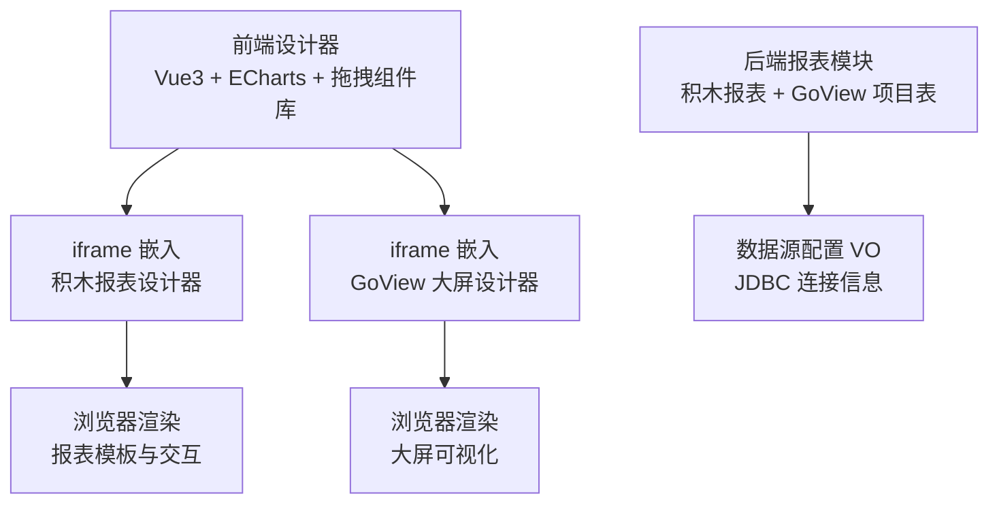
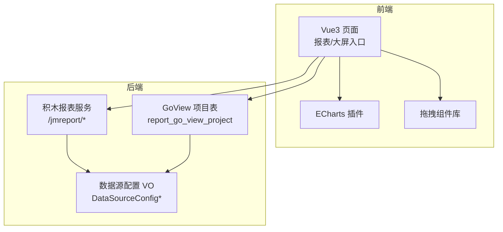
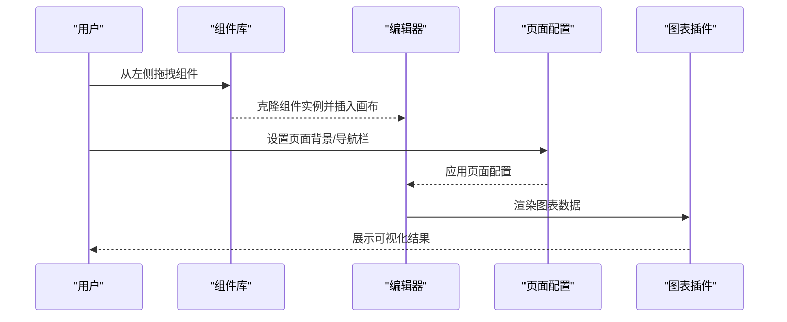
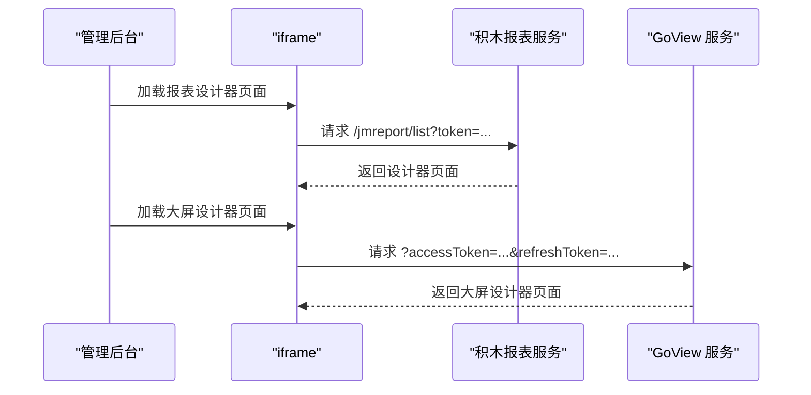
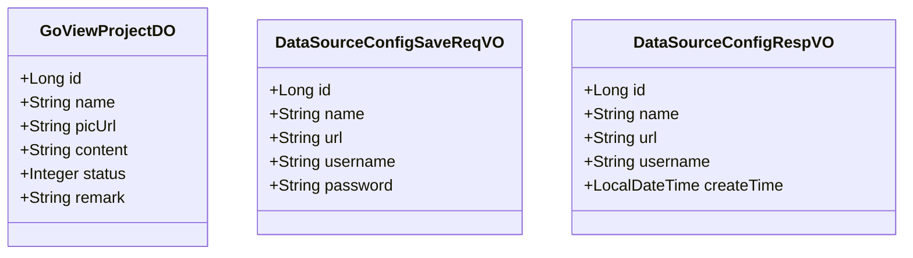
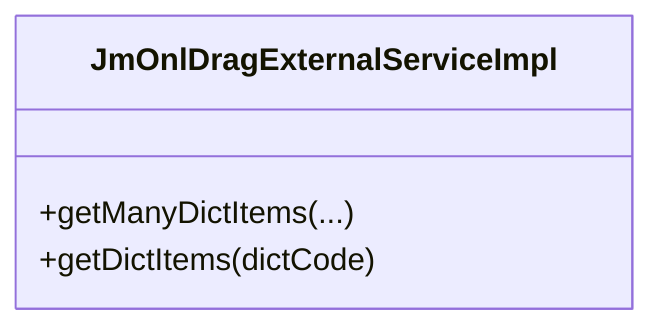
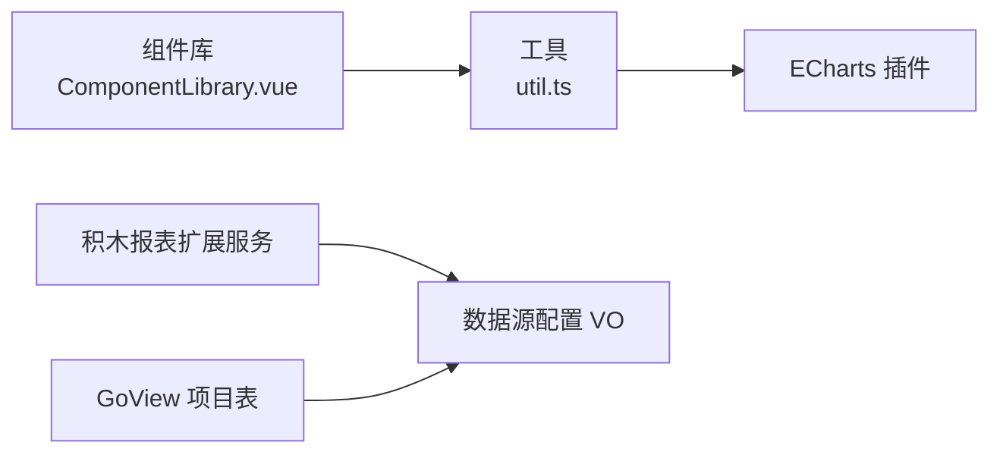

# 报表设计器

<cite>
**本文引用的文件**   
- [frontend/admin-vue3/src/views/report/jmreport/index.vue](file://frontend/admin-vue3/src/views/report/jmreport/index.vue)
- [frontend/admin-vue3/src/views/report/jmreport/bi.vue](file://frontend/admin-vue3/src/views/report/jmreport/bi.vue)
- [frontend/admin-vue3/src/views/report/goview/index.vue](file://frontend/admin-vue3/src/views/report/goview/index.vue)
- [frontend/admin-vue3/src/plugins/echarts/index.ts](file://frontend/admin-vue3/src/plugins/echarts/index.ts)
- [frontend/admin-vue3/src/components/Echart/index.ts](file://frontend/admin-vue3/src/components/Echart/index.ts)
- [frontend/admin-vue3/src/components/DiyEditor/components/ComponentLibrary.vue](file://frontend/admin-vue3/src/components/DiyEditor/components/ComponentLibrary.vue)
- [frontend/admin-vue3/src/components/DiyEditor/util.ts](file://frontend/admin-vue3/src/components/DiyEditor/util.ts)
- [backend/qiji-module-report/src/main/java/com/qiji/cps/module/report/package-info.java](file://backend/qiji-module-report/src/main/java/com/qiji/cps/module/report/package-info.java)
- [backend/qiji-module-report/src/main/java/com/qiji/cps/module/report/framework/jmreport/core/service/JmOnlDragExternalServiceImpl.java](file://backend/qiji-module-report/src/main/java/com/qiji/cps/module/report/framework/jmreport/core/service/JmOnlDragExternalServiceImpl.java)
- [backend/qiji-module-infra/src/main/java/com/qiji/cps/module/infra/controller/admin/db/vo/DataSourceConfigSaveReqVO.java](file://backend/qiji-module-infra/src/main/java/com/qiji/cps/module/infra/controller/admin/db/vo/DataSourceConfigSaveReqVO.java)
- [backend/qiji-module-infra/src/main/java/com/qiji/cps/module/infra/controller/admin/db/vo/DataSourceConfigRespVO.java](file://backend/qiji-module-infra/src/main/java/com/qiji/cps/module/infra/controller/admin/db/vo/DataSourceConfigRespVO.java)
- [backend/qiji-module-report/src/main/java/com/qiji/cps/module/report/dal/dataobject/goview/GoViewProjectDO.java](file://backend/qiji-module-report/src/main/java/com/qiji/cps/module/report/dal/dataobject/goview/GoViewProjectDO.java)
- [backend/sql/mysql/ruoyi-vue-pro.sql](file://backend/sql/mysql/ruoyi-vue-pro.sql)
</cite>

## 目录
1. [引言](#引言)
2. [项目结构](#项目结构)
3. [核心组件](#核心组件)
4. [架构总览](#架构总览)
5. [详细组件分析](#详细组件分析)
6. [依赖分析](#依赖分析)
7. [性能考虑](#性能考虑)
8. [故障排查指南](#故障排查指南)
9. [结论](#结论)
10. [附录](#附录)

## 引言
本技术文档面向“报表设计器”子系统，聚焦于前端可视化编辑器、后端报表模板管理与数据源配置机制，系统性阐述报表组件实现、拖拽式布局设计、字段选择器、过滤器与排序配置、报表与数据源的连接方式（数据库查询、API 接口调用），并给出销售报表、用户统计报表、财务分析报表的使用示例与最佳实践（性能优化、缓存策略、安全控制）。

## 项目结构
报表设计器由“前端设计器 + 后端报表模块 + 数据源配置”三部分组成：
- 前端：Vue3 + Element Plus + ECharts 插件；提供拖拽式可视化编辑器与组件库；通过 iframe 嵌入第三方积木报表与自研 GoView 大屏设计器。
- 后端：基于“积木报表”提供报表设计能力；自研 GoView 大屏项目表；提供数据源配置的 VO 定义与权限菜单。
- 数据源：统一在基础设施模块中进行配置与管理，支持 JDBC 连接信息与凭证。

**图示来源**
- [frontend/admin-vue3/src/views/report/jmreport/index.vue:1-16](file://frontend/admin-vue3/src/views/report/jmreport/index.vue#L1-L16)
- [frontend/admin-vue3/src/views/report/jmreport/bi.vue:1-16](file://frontend/admin-vue3/src/views/report/jmreport/bi.vue#L1-L16)
- [frontend/admin-vue3/src/views/report/goview/index.vue:1-17](file://frontend/admin-vue3/src/views/report/goview/index.vue#L1-L17)
- [backend/qiji-module-report/src/main/java/com/qiji/cps/module/report/framework/jmreport/core/service/JmOnlDragExternalServiceImpl.java:1-32](file://backend/qiji-module-report/src/main/java/com/qiji/cps/module/report/framework/jmreport/core/service/JmOnlDragExternalServiceImpl.java#L1-L32)
- [backend/qiji-module-infra/src/main/java/com/qiji/cps/module/infra/controller/admin/db/vo/DataSourceConfigSaveReqVO.java:1-30](file://backend/qiji-module-infra/src/main/java/com/qiji/cps/module/infra/controller/admin/db/vo/DataSourceConfigSaveReqVO.java#L1-L30)

**章节来源**
- [frontend/admin-vue3/src/views/report/jmreport/index.vue:1-16](file://frontend/admin-vue3/src/views/report/jmreport/index.vue#L1-L16)
- [frontend/admin-vue3/src/views/report/jmreport/bi.vue:1-16](file://frontend/admin-vue3/src/views/report/jmreport/bi.vue#L1-L16)
- [frontend/admin-vue3/src/views/report/goview/index.vue:1-17](file://frontend/admin-vue3/src/views/report/goview/index.vue#L1-L17)
- [backend/qiji-module-report/src/main/java/com/qiji/cps/module/report/package-info.java:1-9](file://backend/qiji-module-report/src/main/java/com/qiji/cps/module/report/package-info.java#L1-L9)

## 核心组件
- 可视化设计器前端
  - 拖拽组件库：左侧组件库支持克隆与拖拽，定义组件类型、属性与样式基线。
  - 页面配置：页面背景、导航栏、标签栏等全局配置。
  - 图表插件：ECharts 插件按需引入多种图表与组件，支撑报表渲染。
- 报表设计器后端
  - 积木报表：通过 iframe 嵌入，提供报表设计与模板管理。
  - GoView 大屏：自研大屏项目表，支持 JSON 配置与发布状态。
- 数据源配置
  - VO 定义：名称、URL、用户名、密码等字段，便于统一校验与持久化。
  - 权限菜单：为不同查询方式（SQL、HTTP）提供细粒度权限控制。

**章节来源**
- [frontend/admin-vue3/src/components/DiyEditor/components/ComponentLibrary.vue:1-212](file://frontend/admin-vue3/src/components/DiyEditor/components/ComponentLibrary.vue#L1-L212)
- [frontend/admin-vue3/src/components/DiyEditor/util.ts:1-126](file://frontend/admin-vue3/src/components/DiyEditor/util.ts#L1-L126)
- [frontend/admin-vue3/src/plugins/echarts/index.ts:1-51](file://frontend/admin-vue3/src/plugins/echarts/index.ts#L1-L51)
- [backend/qiji-module-report/src/main/java/com/qiji/cps/module/report/dal/dataobject/goview/GoViewProjectDO.java:1-57](file://backend/qiji-module-report/src/main/java/com/qiji/cps/module/report/dal/dataobject/goview/GoViewProjectDO.java#L1-L57)
- [backend/qiji-module-infra/src/main/java/com/qiji/cps/module/infra/controller/admin/db/vo/DataSourceConfigSaveReqVO.java:1-30](file://backend/qiji-module-infra/src/main/java/com/qiji/cps/module/infra/controller/admin/db/vo/DataSourceConfigSaveReqVO.java#L1-L30)

## 架构总览
前端通过 iframe 将报表与大屏设计器嵌入到管理后台页面，后端提供报表模板与数据源配置能力，并通过权限菜单控制不同数据查询方式的访问。

**图示来源**
- [frontend/admin-vue3/src/views/report/jmreport/index.vue:1-16](file://frontend/admin-vue3/src/views/report/jmreport/index.vue#L1-L16)
- [frontend/admin-vue3/src/views/report/goview/index.vue:1-17](file://frontend/admin-vue3/src/views/report/goview/index.vue#L1-L17)
- [backend/qiji-module-report/src/main/java/com/qiji/cps/module/report/dal/dataobject/goview/GoViewProjectDO.java:1-57](file://backend/qiji-module-report/src/main/java/com/qiji/cps/module/report/dal/dataobject/goview/GoViewProjectDO.java#L1-L57)
- [backend/qiji-module-infra/src/main/java/com/qiji/cps/module/infra/controller/admin/db/vo/DataSourceConfigSaveReqVO.java:1-30](file://backend/qiji-module-infra/src/main/java/com/qiji/cps/module/infra/controller/admin/db/vo/DataSourceConfigSaveReqVO.java#L1-L30)

## 详细组件分析

### 前端可视化编辑器
- 组件库与拖拽
  - 组件库按分组展示，支持克隆组件实例，拖拽到画布区域。
  - 通过 ghost-class 实现拖拽占位提示，提升交互体验。
- 页面配置
  - 页面背景色/图、导航栏、标签栏等全局属性，统一管理。
- 图表渲染
  - ECharts 插件按需注册多种图表与组件，满足多维报表需求。

**图示来源**
- [frontend/admin-vue3/src/components/DiyEditor/components/ComponentLibrary.vue:1-212](file://frontend/admin-vue3/src/components/DiyEditor/components/ComponentLibrary.vue#L1-L212)
- [frontend/admin-vue3/src/components/DiyEditor/util.ts:1-126](file://frontend/admin-vue3/src/components/DiyEditor/util.ts#L1-L126)
- [frontend/admin-vue3/src/plugins/echarts/index.ts:1-51](file://frontend/admin-vue3/src/plugins/echarts/index.ts#L1-L51)

**章节来源**
- [frontend/admin-vue3/src/components/DiyEditor/components/ComponentLibrary.vue:1-212](file://frontend/admin-vue3/src/components/DiyEditor/components/ComponentLibrary.vue#L1-L212)
- [frontend/admin-vue3/src/components/DiyEditor/util.ts:1-126](file://frontend/admin-vue3/src/components/DiyEditor/util.ts#L1-L126)
- [frontend/admin-vue3/src/plugins/echarts/index.ts:1-51](file://frontend/admin-vue3/src/plugins/echarts/index.ts#L1-L51)

### 报表设计器入口与 iframe 嵌入
- 报表设计器入口：通过 iframe 加载积木报表列表页，携带刷新令牌参数。
- 大屏设计器入口：通过 iframe 加载 GoView，携带访问与刷新令牌参数。
- BI 入口：同样采用 iframe 方式加载积木报表大屏列表页。

**图示来源**
- [frontend/admin-vue3/src/views/report/jmreport/index.vue:1-16](file://frontend/admin-vue3/src/views/report/jmreport/index.vue#L1-L16)
- [frontend/admin-vue3/src/views/report/jmreport/bi.vue:1-16](file://frontend/admin-vue3/src/views/report/jmreport/bi.vue#L1-L16)
- [frontend/admin-vue3/src/views/report/goview/index.vue:1-17](file://frontend/admin-vue3/src/views/report/goview/index.vue#L1-L17)

**章节来源**
- [frontend/admin-vue3/src/views/report/jmreport/index.vue:1-16](file://frontend/admin-vue3/src/views/report/jmreport/index.vue#L1-L16)
- [frontend/admin-vue3/src/views/report/jmreport/bi.vue:1-16](file://frontend/admin-vue3/src/views/report/jmreport/bi.vue#L1-L16)
- [frontend/admin-vue3/src/views/report/goview/index.vue:1-17](file://frontend/admin-vue3/src/views/report/goview/index.vue#L1-L17)

### 后端报表模板与数据源配置
- 报表模块说明：基于积木报表提供报表设计能力；大屏设计器自研，控制器与表名前缀与积木报表区分。
- GoView 项目表：存储项目名称、预览图、JSON 配置、发布状态与备注。
- 数据源配置 VO：统一定义名称、URL、用户名、密码等字段，便于校验与持久化。
- 权限菜单：为“查询项目”“使用 SQL 查询数据”“使用 HTTP 查询数据”等提供细粒度权限。

**图示来源**
- [backend/qiji-module-report/src/main/java/com/qiji/cps/module/report/dal/dataobject/goview/GoViewProjectDO.java:1-57](file://backend/qiji-module-report/src/main/java/com/qiji/cps/module/report/dal/dataobject/goview/GoViewProjectDO.java#L1-L57)
- [backend/qiji-module-infra/src/main/java/com/qiji/cps/module/infra/controller/admin/db/vo/DataSourceConfigSaveReqVO.java:1-30](file://backend/qiji-module-infra/src/main/java/com/qiji/cps/module/infra/controller/admin/db/vo/DataSourceConfigSaveReqVO.java#L1-L30)
- [backend/qiji-module-infra/src/main/java/com/qiji/cps/module/infra/controller/admin/db/vo/DataSourceConfigRespVO.java:1-27](file://backend/qiji-module-infra/src/main/java/com/qiji/cps/module/infra/controller/admin/db/vo/DataSourceConfigRespVO.java#L1-L27)

**章节来源**
- [backend/qiji-module-report/src/main/java/com/qiji/cps/module/report/package-info.java:1-9](file://backend/qiji-module-report/src/main/java/com/qiji/cps/module/report/package-info.java#L1-L9)
- [backend/qiji-module-report/src/main/java/com/qiji/cps/module/report/dal/dataobject/goview/GoViewProjectDO.java:1-57](file://backend/qiji-module-report/src/main/java/com/qiji/cps/module/report/dal/dataobject/goview/GoViewProjectDO.java#L1-L57)
- [backend/qiji-module-infra/src/main/java/com/qiji/cps/module/infra/controller/admin/db/vo/DataSourceConfigSaveReqVO.java:1-30](file://backend/qiji-module-infra/src/main/java/com/qiji/cps/module/infra/controller/admin/db/vo/DataSourceConfigSaveReqVO.java#L1-L30)
- [backend/qiji-module-infra/src/main/java/com/qiji/cps/module/infra/controller/admin/db/vo/DataSourceConfigRespVO.java:1-27](file://backend/qiji-module-infra/src/main/java/com/qiji/cps/module/infra/controller/admin/db/vo/DataSourceConfigRespVO.java#L1-L27)
- [backend/sql/mysql/ruoyi-vue-pro.sql:1744-1746](file://backend/sql/mysql/ruoyi-vue-pro.sql#L1744-L1746)

### 积木报表外部扩展服务
- 通过实现外部扩展接口，提供字典项等能力，便于与业务系统集成。

**图示来源**
- [backend/qiji-module-report/src/main/java/com/qiji/cps/module/report/framework/jmreport/core/service/JmOnlDragExternalServiceImpl.java:1-32](file://backend/qiji-module-report/src/main/java/com/qiji/cps/module/report/framework/jmreport/core/service/JmOnlDragExternalServiceImpl.java#L1-L32)

**章节来源**
- [backend/qiji-module-report/src/main/java/com/qiji/cps/module/report/framework/jmreport/core/service/JmOnlDragExternalServiceImpl.java:1-32](file://backend/qiji-module-report/src/main/java/com/qiji/cps/module/report/framework/jmreport/core/service/JmOnlDragExternalServiceImpl.java#L1-L32)

## 依赖分析
- 前端依赖
  - 拖拽组件库依赖 vuedraggable，支持克隆与占位提示。
  - ECharts 插件按需注册多种图表与组件，降低包体积。
- 后端依赖
  - 报表模块基于积木报表提供设计器能力；自研 GoView 项目表用于大屏。
  - 数据源配置 VO 作为基础设施模块的输入输出对象，被报表模块与权限菜单共同使用。

**图示来源**
- [frontend/admin-vue3/src/components/DiyEditor/components/ComponentLibrary.vue:1-212](file://frontend/admin-vue3/src/components/DiyEditor/components/ComponentLibrary.vue#L1-L212)
- [frontend/admin-vue3/src/components/DiyEditor/util.ts:1-126](file://frontend/admin-vue3/src/components/DiyEditor/util.ts#L1-L126)
- [frontend/admin-vue3/src/plugins/echarts/index.ts:1-51](file://frontend/admin-vue3/src/plugins/echarts/index.ts#L1-L51)
- [backend/qiji-module-report/src/main/java/com/qiji/cps/module/report/framework/jmreport/core/service/JmOnlDragExternalServiceImpl.java:1-32](file://backend/qiji-module-report/src/main/java/com/qiji/cps/module/report/framework/jmreport/core/service/JmOnlDragExternalServiceImpl.java#L1-L32)
- [backend/qiji-module-report/src/main/java/com/qiji/cps/module/report/dal/dataobject/goview/GoViewProjectDO.java:1-57](file://backend/qiji-module-report/src/main/java/com/qiji/cps/module/report/dal/dataobject/goview/GoViewProjectDO.java#L1-L57)
- [backend/qiji-module-infra/src/main/java/com/qiji/cps/module/infra/controller/admin/db/vo/DataSourceConfigSaveReqVO.java:1-30](file://backend/qiji-module-infra/src/main/java/com/qiji/cps/module/infra/controller/admin/db/vo/DataSourceConfigSaveReqVO.java#L1-L30)

**章节来源**
- [frontend/admin-vue3/src/components/DiyEditor/components/ComponentLibrary.vue:1-212](file://frontend/admin-vue3/src/components/DiyEditor/components/ComponentLibrary.vue#L1-L212)
- [frontend/admin-vue3/src/components/DiyEditor/util.ts:1-126](file://frontend/admin-vue3/src/components/DiyEditor/util.ts#L1-L126)
- [frontend/admin-vue3/src/plugins/echarts/index.ts:1-51](file://frontend/admin-vue3/src/plugins/echarts/index.ts#L1-L51)
- [backend/qiji-module-report/src/main/java/com/qiji/cps/module/report/framework/jmreport/core/service/JmOnlDragExternalServiceImpl.java:1-32](file://backend/qiji-module-report/src/main/java/com/qiji/cps/module/report/framework/jmreport/core/service/JmOnlDragExternalServiceImpl.java#L1-L32)
- [backend/qiji-module-report/src/main/java/com/qiji/cps/module/report/dal/dataobject/goview/GoViewProjectDO.java:1-57](file://backend/qiji-module-report/src/main/java/com/qiji/cps/module/report/dal/dataobject/goview/GoViewProjectDO.java#L1-L57)
- [backend/qiji-module-infra/src/main/java/com/qiji/cps/module/infra/controller/admin/db/vo/DataSourceConfigSaveReqVO.java:1-30](file://backend/qiji-module-infra/src/main/java/com/qiji/cps/module/infra/controller/admin/db/vo/DataSourceConfigSaveReqVO.java#L1-L30)

## 性能考虑
- 前端性能
  - 按需引入 ECharts 图表与组件，减少首屏体积。
  - 拖拽克隆使用深拷贝，避免引用污染；合理设置动画时长与占位提示，保证流畅性。
- 后端性能
  - 报表模板与大屏配置采用 JSON 存储，建议对热点项目启用缓存（如 Redis）。
  - 数据源配置 VO 字段尽量精简，避免冗余序列化。
- 数据查询
  - SQL 查询建议使用分页与索引；HTTP 接口调用建议设置超时与重试策略。
  - 对高频查询结果进行缓存，结合过期时间与失效策略。

[本节为通用指导，无需列出具体文件来源]

## 故障排查指南
- iframe 无法加载
  - 检查令牌参数是否正确传递（访问令牌/刷新令牌）。
  - 确认后端服务可用且路由映射正确。
- 组件拖拽异常
  - 检查 vuedraggable 版本与 ghost-class 样式是否生效。
  - 确认组件克隆逻辑未破坏属性结构。
- 图表不渲染
  - 确认 ECharts 插件已按需注册所需图表与组件。
  - 检查数据格式与维度是否匹配。
- 权限不足
  - 核对系统菜单中的权限点（查询项目、SQL/HTTP 查询数据）是否已授权。

**章节来源**
- [frontend/admin-vue3/src/views/report/jmreport/index.vue:1-16](file://frontend/admin-vue3/src/views/report/jmreport/index.vue#L1-L16)
- [frontend/admin-vue3/src/views/report/goview/index.vue:1-17](file://frontend/admin-vue3/src/views/report/goview/index.vue#L1-L17)
- [frontend/admin-vue3/src/plugins/echarts/index.ts:1-51](file://frontend/admin-vue3/src/plugins/echarts/index.ts#L1-L51)
- [backend/sql/mysql/ruoyi-vue-pro.sql:1744-1746](file://backend/sql/mysql/ruoyi-vue-pro.sql#L1744-L1746)

## 结论
报表设计器通过“前端可视化编辑器 + 后端报表模板与数据源配置”的组合，实现了从拖拽布局到图表渲染的完整闭环。积木报表提供成熟的报表设计能力，自研 GoView 大屏满足定制化需求；数据源配置与权限菜单确保了系统的可维护性与安全性。结合缓存与性能优化策略，可在保证用户体验的同时提升系统稳定性。

[本节为总结性内容，无需列出具体文件来源]

## 附录

### 使用示例：创建典型报表
- 销售报表
  - 步骤：在报表设计器中拖拽“折线图/柱状图”组件，绑定日期与销售额字段，设置筛选器（时间范围、地区），应用排序与聚合。
  - 数据源：使用 SQL 查询或 HTTP 接口获取销售明细。
- 用户统计报表
  - 步骤：拖拽“饼图/漏斗图”，绑定用户来源与转化率字段，配置过滤器（注册时间、渠道），设置排序。
  - 数据源：通过 HTTP 接口拉取用户行为日志。
- 财务分析报表
  - 步骤：拖拽“仪表盘/雷达图”，绑定收入、成本、利润字段，设置筛选器（会计期间、部门），启用排序。
  - 数据源：使用 SQL 查询财务数据，必要时结合缓存策略。

[本节为概念性示例，无需列出具体文件来源]