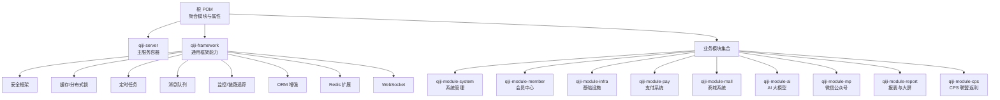
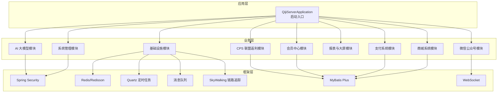
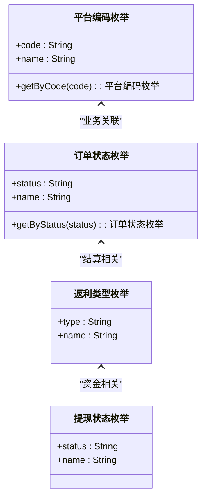
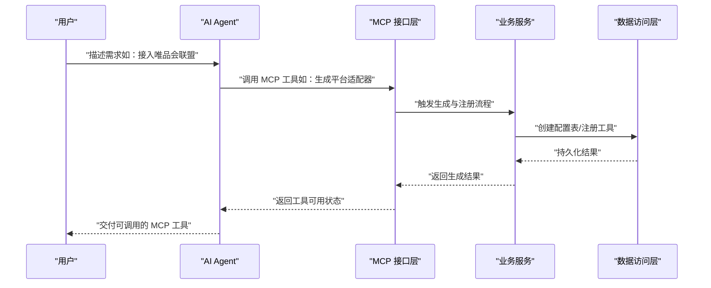
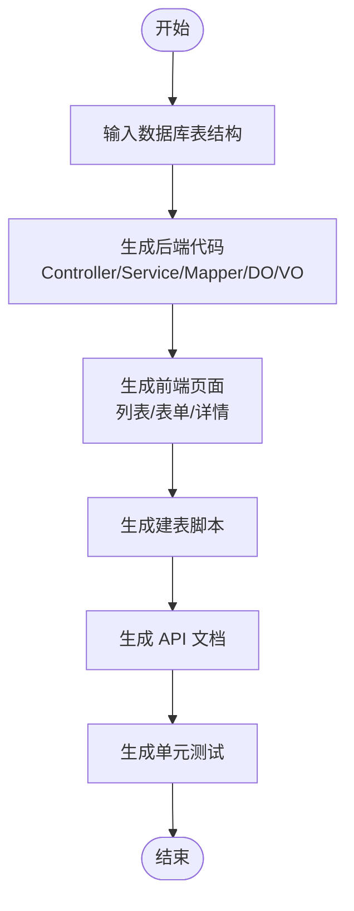
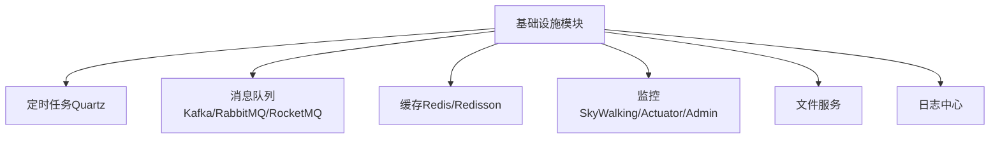
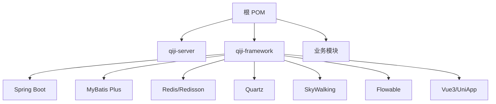

# 后端系统

<cite>
**本文引用的文件**
- [backend/pom.xml](file://backend/pom.xml)
- [backend/qiji-server/src/main/java/com/qiji/cps/server/QijiServerApplication.java](file://backend/qiji-server/src/main/java/com/qiji/cps/server/QijiServerApplication.java)
- [backend/README.md](file://backend/README.md)
- [backend/qiji-module-cps/qiji-module-cps-api/src/main/java/com/qiji/cps/module/cps/enums/CpsPlatformCodeEnum.java](file://backend/qiji-module-cps/qiji-module-cps-api/src/main/java/com/qiji/cps/module/cps/enums/CpsPlatformCodeEnum.java)
- [backend/qiji-module-cps/qiji-module-cps-api/src/main/java/com/qiji/cps/module/cps/enums/CpsOrderStatusEnum.java](file://backend/qiji-module-cps/qiji-module-cps-api/src/main/java/com/qiji/cps/module/cps/enums/CpsOrderStatusEnum.java)
- [backend/qiji-module-cps/qiji-module-cps-api/src/main/java/com/qiji/cps/module/cps/enums/CpsRebateTypeEnum.java](file://backend/qiji-module-cps/qiji-module-cps-api/src/main/java/com/qiji/cps/module/cps/enums/CpsRebateTypeEnum.java)
- [backend/qiji-module-cps/qiji-module-cps-api/src/main/java/com/qiji/cps/module/cps/enums/CpsWithdrawStatusEnum.java](file://backend/qiji-module-cps/qiji-module-cps-api/src/main/java/com/qiji/cps/module/cps/enums/CpsWithdrawStatusEnum.java)
- [backend/qiji-framework/qiji-spring-boot-starter-job/《芋道 Spring Boot 定时任务入门》.md](file://backend/qiji-framework/qiji-spring-boot-starter-job/《芋道 Spring Boot 定时任务入门》.md)
- [backend/qiji-framework/qiji-spring-boot-starter-monitor/《芋道 Spring Boot 链路追踪 SkyWalking 入门》.md](file://backend/qiji-framework/qiji-spring-boot-starter-monitor/《芋道 Spring Boot 链路追踪 SkyWalking 入门》.md)
- [backend/qiji-framework/qiji-spring-boot-starter-mq/《芋道 Spring Boot 消息队列 Kafka 入门》.md](file://backend/qiji-framework/qiji-spring-boot-starter-mq/《芋道 Spring Boot 消息队列 Kafka 入门》.md)
- [backend/qiji-framework/qiji-spring-boot-starter-mybatis/《芋道 Spring Boot MyBatis 入门》.md](file://backend/qiji-framework/qiji-spring-boot-starter-mybatis/《芋道 Spring Boot MyBatis 入门》.md)
- [backend/qiji-framework/qiji-spring-boot-starter-redis/《芋道 Spring Boot Redis 入门》.md](file://backend/qiji-framework/qiji-spring-boot-starter-redis/《芋道 Spring Boot Redis 入门》.md)
- [backend/qiji-framework/qiji-spring-boot-starter-security/《芋道 Spring Boot 安全框架 Spring Security 入门》.md](file://backend/qiji-framework/qiji-spring-boot-starter-security/《芋道 Spring Boot 安全框架 Spring Security 入门》.md)
- [backend/qiji-framework/qiji-spring-boot-starter-websocket/《芋道 Spring Boot WebSocket 入门》.md](file://backend/qiji-framework/qiji-spring-boot-starter-websocket/《芋道 Spring Boot WebSocket 入门》.md)
</cite>

## 目录
1. [简介](#简介)
2. [项目结构](#项目结构)
3. [核心组件](#核心组件)
4. [架构总览](#架构总览)
5. [详细组件分析](#详细组件分析)
6. [依赖分析](#依赖分析)
7. [性能考虑](#性能考虑)
8. [故障排查指南](#故障排查指南)
9. [结论](#结论)
10. [附录](#附录)

## 简介
AgenticCPS 后端系统是一个以模块化为核心的 Spring Boot 应用，围绕“CPS 联盟返利”“AI 自主编程”“低代码开发平台”三大主线展开。系统采用多模块聚合工程，主服务容器负责扫描与装配各业务模块；核心模块包括系统管理、基础设施、会员中心、支付系统、商城系统、AI 大模型、微信公众号、报表与大屏、以及 CPS 联盟返利系统。

系统强调“开箱即用”的能力矩阵：多平台 CPS 接入、商品搜索与比价、会员返利体系、订单全链路追踪、提现管理、MCP AI 接口、运营数据看板、风控管理；同时提供低代码能力：代码生成器、可视化工作流、报表与大屏设计器，并通过 MCP 协议实现 AI Agent 的零代码接入。

章节来源
- [backend/README.md:206-258](file://backend/README.md#L206-L258)
- [backend/README.md:261-296](file://backend/README.md#L261-L296)

## 项目结构
后端采用 Maven 聚合工程，顶层 POM 定义了模块清单与公共属性，主服务容器模块负责应用启动与包扫描，框架模块提供通用能力（安全、缓存、定时任务、监控、消息队列、MyBatis、Redis、WebSocket 等），业务模块按领域拆分（系统、会员、支付、商城、AI、报表、CPS 等）。

图表来源
- [backend/pom.xml:10-25](file://backend/pom.xml#L10-L25)
- [backend/pom.xml:31-45](file://backend/pom.xml#L31-L45)

章节来源
- [backend/pom.xml:1-176](file://backend/pom.xml#L1-L176)
- [backend/qiji-server/src/main/java/com/qiji/cps/server/QijiServerApplication.java:15-16](file://backend/qiji-server/src/main/java/com/qiji/cps/server/QijiServerApplication.java#L15-L16)

## 核心组件
- 启动入口与扫描范围
  - 主服务容器通过启动类配置包扫描路径，确保 server 与 module 包下的组件被加载。
- 模块化架构
  - 通过聚合 POM 组织各模块，框架模块提供横切能力，业务模块聚焦具体领域。
- 枚举体系（CPS 模块）
  - 平台编码、订单状态、返利类型、提现状态等枚举，统一了业务状态与类型表达，便于跨模块一致使用。

章节来源
- [backend/qiji-server/src/main/java/com/qiji/cps/server/QijiServerApplication.java:15-16](file://backend/qiji-server/src/main/java/com/qiji/cps/server/QijiServerApplication.java#L15-L16)
- [backend/pom.xml:10-25](file://backend/pom.xml#L10-L25)
- [backend/qiji-module-cps/qiji-module-cps-api/src/main/java/com/qiji/cps/module/cps/enums/CpsPlatformCodeEnum.java:14-46](file://backend/qiji-module-cps/qiji-module-cps-api/src/main/java/com/qiji/cps/module/cps/enums/CpsPlatformCodeEnum.java#L14-L46)
- [backend/qiji-module-cps/qiji-module-cps-api/src/main/java/com/qiji/cps/module/cps/enums/CpsOrderStatusEnum.java:14-47](file://backend/qiji-module-cps/qiji-module-cps-api/src/main/java/com/qiji/cps/module/cps/enums/CpsOrderStatusEnum.java#L14-L47)
- [backend/qiji-module-cps/qiji-module-cps-api/src/main/java/com/qiji/cps/module/cps/enums/CpsRebateTypeEnum.java:14-39](file://backend/qiji-module-cps/qiji-module-cps-api/src/main/java/com/qiji/cps/module/cps/enums/CpsRebateTypeEnum.java#L14-L39)
- [backend/qiji-module-cps/qiji-module-cps-api/src/main/java/com/qiji/cps/module/cps/enums/CpsWithdrawStatusEnum.java:14-43](file://backend/qiji-module-cps/qiji-module-cps-api/src/main/java/com/qiji/cps/module/cps/enums/CpsWithdrawStatusEnum.java#L14-L43)

## 架构总览
系统采用“主服务容器 + 多模块 + 框架能力”的分层架构。主服务容器负责启动与装配，框架模块提供横切能力（安全、缓存、定时任务、监控、消息队列、MyBatis、Redis、WebSocket 等），业务模块按领域划分，CPS 模块包含 API 定义与业务实现，支撑多平台接入、搜索比价、订单追踪、返利计算、提现与风控。

图表来源
- [backend/qiji-server/src/main/java/com/qiji/cps/server/QijiServerApplication.java:15-16](file://backend/qiji-server/src/main/java/com/qiji/cps/server/QijiServerApplication.java#L15-L16)
- [backend/qiji-framework/qiji-spring-boot-starter-job/《芋道 Spring Boot 定时任务入门》.md](file://backend/qiji-framework/qiji-spring-boot-starter-job/《芋道 Spring Boot 定时任务入门》.md)
- [backend/qiji-framework/qiji-spring-boot-starter-monitor/《芋道 Spring Boot 链路追踪 SkyWalking 入门》.md](file://backend/qiji-framework/qiji-spring-boot-starter-monitor/《芋道 Spring Boot 链路追踪 SkyWalking 入门》.md)
- [backend/qiji-framework/qiji-spring-boot-starter-mq/《芋道 Spring Boot 消息队列 Kafka 入门》.md](file://backend/qiji-framework/qiji-spring-boot-starter-mq/《芋道 Spring Boot 消息队列 Kafka 入门》.md)
- [backend/qiji-framework/qiji-spring-boot-starter-mybatis/《芋道 Spring Boot MyBatis 入门》.md](file://backend/qiji-framework/qiji-spring-boot-starter-mybatis/《芋道 Spring Boot MyBatis 入门》.md)
- [backend/qiji-framework/qiji-spring-boot-starter-redis/《芋道 Spring Boot Redis 入门》.md](file://backend/qiji-framework/qiji-spring-boot-starter-redis/《芋道 Spring Boot Redis 入门》.md)
- [backend/qiji-framework/qiji-spring-boot-starter-security/《芋道 Spring Boot 安全框架 Spring Security 入门》.md](file://backend/qiji-framework/qiji-spring-boot-starter-security/《芋道 Spring Boot 安全框架 Spring Security 入门》.md)
- [backend/qiji-framework/qiji-spring-boot-starter-websocket/《芋道 Spring Boot WebSocket 入门》.md](file://backend/qiji-framework/qiji-spring-boot-starter-websocket/《芋道 Spring Boot WebSocket 入门》.md)

## 详细组件分析

### CPS 联盟返利系统
- 平台适配器设计
  - 通过平台编码枚举统一多平台标识，便于策略扩展与适配器模式落地。
- 商品搜索与比价
  - 提供跨平台搜索与比价能力，结合 MCP 工具接口，支持 AI Agent 直接调用。
- 订单全链路追踪
  - 订单状态枚举覆盖从下单到结算、返利到账、退款、失效等关键节点。
- 返利计算与提现
  - 返利类型枚举涵盖入账、扣回、系统调整；提现状态枚举覆盖申请、审核、成功、失败、退回等。
- 风控系统
  - 通过风控规则类型枚举与订单状态联动，实现异常行为检测与风险控制。

图表来源
- [backend/qiji-module-cps/qiji-module-cps-api/src/main/java/com/qiji/cps/module/cps/enums/CpsPlatformCodeEnum.java:14-46](file://backend/qiji-module-cps/qiji-module-cps-api/src/main/java/com/qiji/cps/module/cps/enums/CpsPlatformCodeEnum.java#L14-L46)
- [backend/qiji-module-cps/qiji-module-cps-api/src/main/java/com/qiji/cps/module/cps/enums/CpsOrderStatusEnum.java:14-47](file://backend/qiji-module-cps/qiji-module-cps-api/src/main/java/com/qiji/cps/module/cps/enums/CpsOrderStatusEnum.java#L14-L47)
- [backend/qiji-module-cps/qiji-module-cps-api/src/main/java/com/qiji/cps/module/cps/enums/CpsRebateTypeEnum.java:14-39](file://backend/qiji-module-cps/qiji-module-cps-api/src/main/java/com/qiji/cps/module/cps/enums/CpsRebateTypeEnum.java#L14-L39)
- [backend/qiji-module-cps/qiji-module-cps-api/src/main/java/com/qiji/cps/module/cps/enums/CpsWithdrawStatusEnum.java:14-43](file://backend/qiji-module-cps/qiji-module-cps-api/src/main/java/com/qiji/cps/module/cps/enums/CpsWithdrawStatusEnum.java#L14-L43)

章节来源
- [backend/README.md:208-222](file://backend/README.md#L208-L222)
- [backend/README.md:179-203](file://backend/README.md#L179-L203)

### AI 自主编程系统（Vibe Coding + MCP 协议）
- 工作流与规范
  - 基于 Specs/Plans 的规范化 AI 编程，实现“需求对齐 → 方案设计 → 自主编码 → 验收交付”的闭环。
- MCP 协议集成
  - 提供开箱即用的 AI Tools，支持 AI Agent 直接调用，无需额外开发。
- AI 代理与记忆
  - 通过 AI Agent 与 AI Memory 的协同，实现上下文记忆与任务执行。

图表来源
- [backend/README.md:78-138](file://backend/README.md#L78-L138)
- [backend/README.md:179-203](file://backend/README.md#L179-L203)

章节来源
- [backend/README.md:78-138](file://backend/README.md#L78-L138)
- [backend/README.md:179-203](file://backend/README.md#L179-L203)

### 低代码开发平台
- 代码生成器
  - 输入数据库表结构，一键生成前后端代码、SQL 脚本、Swagger 文档与单元测试。
- 可视化工作流
  - 基于 Flowable 引擎，拖拽设计审批流程（提现审核、返利结算、平台接入等）。
- 报表与大屏设计器
  - 拖拽生成数据报表、图形报表、大屏与打印模板，支持导出与打印。

图表来源
- [backend/README.md:141-178](file://backend/README.md#L141-L178)

章节来源
- [backend/README.md:141-178](file://backend/README.md#L141-L178)

### 基础设施服务
- 系统管理
  - 用户、角色、菜单、部门、字典、日志等基础能力，配合代码生成器与拖拽配置。
- 支付系统
  - 支付宝/微信支付、退款、钱包、转账能力，开箱即用。
- 文件存储
  - 文件服务在线管理界面，支持上传与访问。
- 消息队列
  - 支持多种消息队列（Kafka/RabbitMQ/RocketMQ），满足异步解耦与削峰填谷。
- 定时任务
  - Quartz 定时任务，支持订单同步、状态更新等周期性任务。
- 监控告警
  - SkyWalking 链路追踪与日志中心，结合 Actuator/Admin 监控端点，实现全链路可观测。

图表来源
- [backend/qiji-framework/qiji-spring-boot-starter-job/《芋道 Spring Boot 定时任务入门》.md](file://backend/qiji-framework/qiji-spring-boot-starter-job/《芋道 Spring Boot 定时任务入门》.md)
- [backend/qiji-framework/qiji-spring-boot-starter-mq/《芋道 Spring Boot 消息队列 Kafka 入门》.md](file://backend/qiji-framework/qiji-spring-boot-starter-mq/《芋道 Spring Boot 消息队列 Kafka 入门》.md)
- [backend/qiji-framework/qiji-spring-boot-starter-redis/《芋道 Spring Boot Redis 入门》.md](file://backend/qiji-framework/qiji-spring-boot-starter-redis/《芋道 Spring Boot Redis 入门》.md)
- [backend/qiji-framework/qiji-spring-boot-starter-monitor/《芋道 Spring Boot 链路追踪 SkyWalking 入门》.md](file://backend/qiji-framework/qiji-spring-boot-starter-monitor/《芋道 Spring Boot 链路追踪 SkyWalking 入门》.md)
- [backend/qiji-framework/qiji-spring-boot-starter-mybatis/《芋道 Spring Boot MyBatis 入门》.md](file://backend/qiji-framework/qiji-spring-boot-starter-mybatis/《芋道 Spring Boot MyBatis 入门》.md)
- [backend/qiji-framework/qiji-spring-boot-starter-security/《芋道 Spring Boot 安全框架 Spring Security 入门》.md](file://backend/qiji-framework/qiji-spring-boot-starter-security/《芋道 Spring Boot 安全框架 Spring Security 入门》.md)
- [backend/qiji-framework/qiji-spring-boot-starter-websocket/《芋道 Spring Boot WebSocket 入门》.md](file://backend/qiji-framework/qiji-spring-boot-starter-websocket/《芋道 Spring Boot WebSocket 入门》.md)

章节来源
- [backend/README.md:249-258](file://backend/README.md#L249-L258)

## 依赖分析
- 模块依赖
  - 根 POM 聚合各模块，主服务容器负责扫描与装配；框架模块提供横切能力，业务模块按需依赖。
- 外部依赖
  - Spring Boot 3.5.9、MyBatis Plus、Redis/Redisson、Quartz、SkyWalking、Flowable、Vue3/UniApp 等。

图表来源
- [backend/pom.xml:10-25](file://backend/pom.xml#L10-L25)
- [backend/README.md:280-296](file://backend/README.md#L280-L296)

章节来源
- [backend/pom.xml:1-176](file://backend/pom.xml#L1-L176)
- [backend/README.md:280-296](file://backend/README.md#L280-L296)

## 性能考虑
- 搜索与比价
  - 单平台搜索 P99 < 2 秒，多平台比价 P99 < 5 秒，转链生成 < 1 秒。
- 订单同步与返利入账
  - 订单同步延迟 < 30 分钟，返利入账平台结算后 24 小时内。
- MCP 工具调用
  - 搜索类 < 3 秒，查询类 < 1 秒。

章节来源
- [backend/README.md:326-336](file://backend/README.md#L326-L336)

## 故障排查指南
- 启动问题
  - 启动类配置了包扫描路径，若启动失败请参考注释中的文档链接进行排查。
- 模块扫描
  - 确认主服务容器的扫描基包包含 server 与 module 包，避免组件未被加载。
- 枚举一致性
  - CPS 模块的平台编码、订单状态、返利类型、提现状态等枚举应保持与业务状态一致，避免状态错配。

章节来源
- [backend/qiji-server/src/main/java/com/qiji/cps/server/QijiServerApplication.java:15-16](file://backend/qiji-server/src/main/java/com/qiji/cps/server/QijiServerApplication.java#L15-L16)
- [backend/qiji-module-cps/qiji-module-cps-api/src/main/java/com/qiji/cps/module/cps/enums/CpsPlatformCodeEnum.java:14-46](file://backend/qiji-module-cps/qiji-module-cps-api/src/main/java/com/qiji/cps/module/cps/enums/CpsPlatformCodeEnum.java#L14-L46)
- [backend/qiji-module-cps/qiji-module-cps-api/src/main/java/com/qiji/cps/module/cps/enums/CpsOrderStatusEnum.java:14-47](file://backend/qiji-module-cps/qiji-module-cps-api/src/main/java/com/qiji/cps/module/cps/enums/CpsOrderStatusEnum.java#L14-L47)
- [backend/qiji-module-cps/qiji-module-cps-api/src/main/java/com/qiji/cps/module/cps/enums/CpsRebateTypeEnum.java:14-39](file://backend/qiji-module-cps/qiji-module-cps-api/src/main/java/com/qiji/cps/module/cps/enums/CpsRebateTypeEnum.java#L14-L39)
- [backend/qiji-module-cps/qiji-module-cps-api/src/main/java/com/qiji/cps/module/cps/enums/CpsWithdrawStatusEnum.java:14-43](file://backend/qiji-module-cps/qiji-module-cps-api/src/main/java/com/qiji/cps/module/cps/enums/CpsWithdrawStatusEnum.java#L14-L43)

## 结论
AgenticCPS 后端系统通过模块化设计与框架能力复用，实现了从 CPS 联盟返利到 AI 自主编程再到低代码开发的全栈覆盖。系统具备高扩展性与自动化能力，能够以极低的人力成本实现平台对接、订单追踪、返利计算、提现管理与风控治理，并通过 MCP 协议与低代码工具链，将“自然语言描述 → AI 自动实现”的愿景落地为可运行的生产系统。

## 附录
- 快速开始
  - 环境要求：JDK 17/21、MySQL 5.7/8.0+、Redis 5.0+、Maven 3.8+、Node.js 16+。
  - 三步启动：克隆项目 → 初始化数据库 → 启动后端。
- 性能指标
  - 搜索/比价/转链/同步/入账/MCP 工具调用均有明确的性能目标，确保用户体验与系统稳定性。

章节来源
- [backend/README.md:299-336](file://backend/README.md#L299-L336)