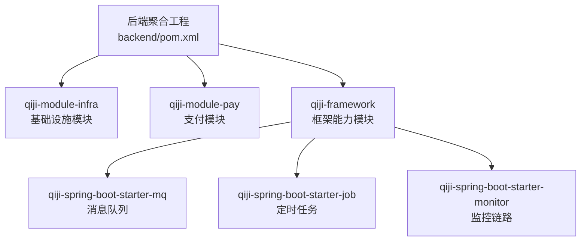
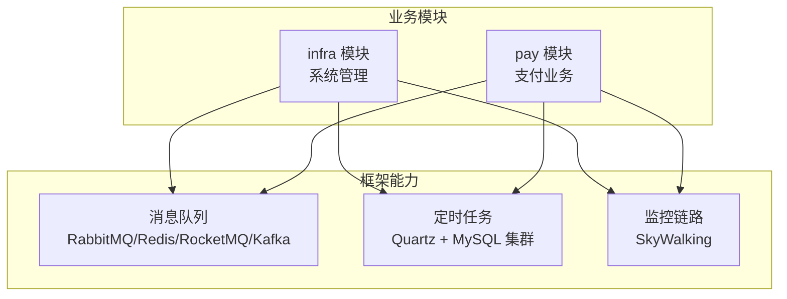
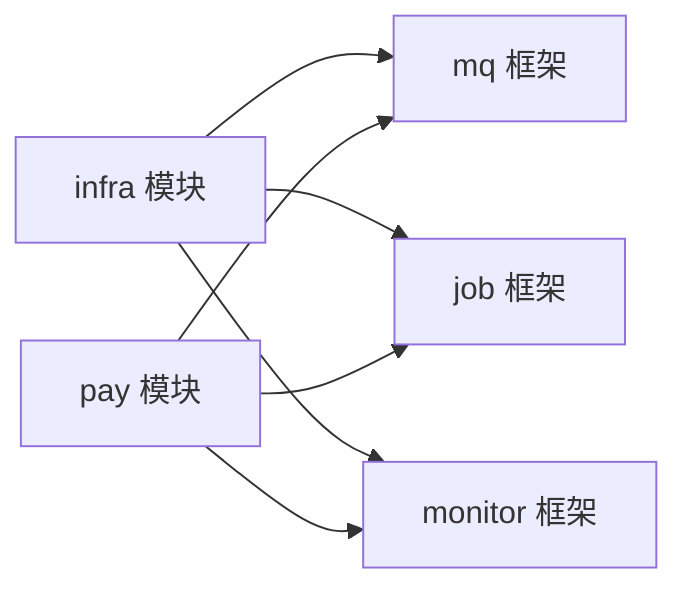

# 基础设施服务

<cite>
**本文引用的文件**
- [pom.xml](file://backend/pom.xml)
- [package-info.java（infra 模块）](file://backend/qiji-module-infra/src/main/java/com/qiji/cps/module/infra/package-info.java)
- [package-info.java（pay 模块）](file://backend/qiji-module-pay/src/main/java/com/qiji/cps/module/pay/package-info.java)
- [package-info.java（消息队列框架）](file://backend/qiji-framework/qiji-spring-boot-starter-mq/src/main/java/com/qiji(cps/framework/mq/package-info.java)
- [package-info.java（定时任务框架）](file://backend/qiji-framework/qiji-spring-boot-starter-job/src/main/java/com/qiji(cps/framework/quartz/package-info.java)
- [package-info.java（链路追踪框架）](file://backend/qiji-framework/qiji-spring-boot-starter-monitor/src/main/java/com/qiji(cps/framework/tracer/package-info.java)
</cite>

## 目录
1. [简介](#简介)
2. [项目结构](#项目结构)
3. [核心组件](#核心组件)
4. [架构总览](#架构总览)
5. [详细组件分析](#详细组件分析)
6. [依赖分析](#依赖分析)
7. [性能考虑](#性能考虑)
8. [故障排查指南](#故障排查指南)
9. [结论](#结论)
10. [附录](#附录)

## 简介
本技术文档聚焦于基础设施服务，围绕以下目标展开：
- 系统管理模块设计：用户管理、角色权限、菜单配置、部门管理等能力的实现思路与职责边界。
- 支付系统架构：钱包服务、订单支付、退款处理、转账管理的完整流程与模块划分。
- 文件存储服务：文件上传、下载、删除、存储策略的设计要点。
- 消息队列集成：RabbitMQ、Redis 等消息处理与异步任务执行机制。
- 定时任务管理：Quartz 集成、任务调度与执行监控。
- 监控告警系统：系统性能监控、日志收集分析、告警规则配置。

文档基于仓库现有模块与包说明进行系统化梳理，并提供架构图与流程图帮助理解。

## 项目结构
后端采用多模块聚合工程组织，基础设施相关的关键模块如下：
- qiji-module-infra：基础设施运维与管理、研发工具（如代码生成器、接口文档等），控制器 URL 以 /infra/ 开头，数据对象表名以 infra_ 开头。
- qiji-module-pay：支付业务模块，控制器 URL 以 /pay/ 开头，数据对象表名以 pay_ 开头。
- qiji-framework：框架级能力，包含消息队列（支持 RabbitMQ、Redis、RocketMQ、Kafka）、定时任务（Quartz 进程内 + MySQL 集群）、监控（SkyWalking 链路追踪）等。

图表来源
- [pom.xml](file://backend/pom.xml)
- [package-info.java（infra 模块）](file://backend/qiji-module-infra/src/main/java/com/qiji/cps/module/infra/package-info.java)
- [package-info.java（pay 模块）](file://backend/qiji-module-pay/src/main/java/com/qiji/cps/module/pay/package-info.java)
- [package-info.java（消息队列框架）](file://backend/qiji-framework/qiji-spring-boot-starter-mq/src/main/java/com/qiji(cps/framework/mq/package-info.java)
- [package-info.java（定时任务框架）](file://backend/qiji-framework/qiji-spring-boot-starter-job/src/main/java/com/qiji(cps/framework/quartz/package-info.java)
- [package-info.java（链路追踪框架）](file://backend/qiji-framework/qiji-spring-boot-starter-monitor/src/main/java/com/qiji(cps/framework/tracer/package-info.java)

章节来源
- [pom.xml](file://backend/pom.xml)
- [package-info.java（infra 模块）](file://backend/qiji-module-infra/src/main/java/com/qiji/cps/module/infra/package-info.java)
- [package-info.java（pay 模块）](file://backend/qiji-module-pay/src/main/java/com/qiji/cps/module/pay/package-info.java)

## 核心组件
- 系统管理模块（infra）
  - 职责：基础设施运维与管理、研发工具。
  - 控制器命名规范：以 /infra/ 开头。
  - 数据对象命名规范：以 infra_ 开头。
- 支付模块（pay）
  - 职责：支付业务能力，如商户、应用、支付、退款等。
  - 控制器命名规范：以 /pay/ 开头。
  - 数据对象命名规范：以 pay_ 开头。
- 框架能力（qiji-framework）
  - 消息队列：支持 RabbitMQ、Redis、RocketMQ、Kafka。
  - 定时任务：Quartz 进程内 + MySQL 集群方案。
  - 监控链路：SkyWalking 链路追踪与日志中心。

章节来源
- [package-info.java（infra 模块）](file://backend/qiji-module-infra/src/main/java/com/qiji/cps/module/infra/package-info.java)
- [package-info.java（pay 模块）](file://backend/qiji-module-pay/src/main/java/com/qiji/cps/module/pay/package-info.java)
- [package-info.java（消息队列框架）](file://backend/qiji-framework/qiji-spring-boot-starter-mq/src/main/java/com/qiji(cps/framework/mq/package-info.java)
- [package-info.java（定时任务框架）](file://backend/qiji-framework/qiji-spring-boot-starter-job/src/main/java/com/qiji(cps/framework/quartz/package-info.java)
- [package-info.java（链路追踪框架）](file://backend/qiji-framework/qiji-spring-boot-starter-monitor/src/main/java/com/qiji(cps/framework/tracer/package-info.java)

## 架构总览
基础设施服务整体采用“模块化 + 框架能力”的分层架构：
- 业务模块：infra（系统管理）、pay（支付）等。
- 框架模块：mq（消息队列）、job（定时任务）、monitor（监控链路）等。
- 数据与存储：各模块遵循统一的命名规范，便于数据库层面的隔离与治理。
- 通信与集成：通过消息队列实现异步解耦；通过定时任务实现周期性作业；通过监控链路实现可观测性。

图表来源
- [package-info.java（消息队列框架）](file://backend/qiji-framework/qiji-spring-boot-starter-mq/src/main/java/com/qiji(cps/framework/mq/package-info.java)
- [package-info.java（定时任务框架）](file://backend/qiji-framework/qiji-spring-boot-starter-job/src/main/java/com/qiji(cps/framework/quartz/package-info.java)
- [package-info.java（链路追踪框架）](file://backend/qiji-framework/qiji-spring-boot-starter-monitor/src/main/java/com/qiji(cps/framework/tracer/package-info.java)

## 详细组件分析

### 系统管理模块（infra）
- 设计要点
  - 控制器命名以 /infra/ 开头，避免与其他模块冲突。
  - 数据对象表名以 infra_ 开头，便于数据库层面的清晰隔离。
  - 职责边界：基础设施运维与管理、研发工具（如代码生成器、接口文档等）。
- 功能域建议
  - 用户管理：用户增删改查、状态管理、登录审计。
  - 角色权限：角色定义、权限分配、菜单授权、数据权限。
  - 菜单配置：菜单树结构、路由映射、前端动态加载。
  - 部门管理：组织架构、上下级关系、人员归属。
- 命名规范
  - 控制器：/infra/{业务领域}/*。
  - 数据对象：infra_{entity}。
- 与框架协作
  - 权限与审计：结合安全框架与数据权限组件。
  - 日志与监控：接入监控链路，记录关键操作链路。

章节来源
- [package-info.java（infra 模块）](file://backend/qiji-module-infra/src/main/java/com/qiji/cps/module/infra/package-info.java)

### 支付模块（pay）
- 设计要点
  - 控制器命名以 /pay/ 开头，数据对象以 pay_ 开头。
  - 模块边界：商户、应用、支付、退款、转账等支付相关能力。
- 支付系统流程（概念性）
  - 订单创建：校验商品与价格，生成待支付订单。
  - 支付发起：选择支付渠道，调用支付网关，返回支付链接或二维码。
  - 支付回调：接收并验证支付结果，更新订单状态。
  - 退款处理：校验退款条件，发起退款请求，回写退款状态。
  - 转账管理：余额变动、流水记录、对账与风控。
- 与框架协作
  - 消息队列：异步处理支付回调、退款通知、对账任务。
  - 定时任务：周期性对账、超时取消、退款重试。
  - 监控链路：埋点关键路径，异常告警。

章节来源
- [package-info.java（pay 模块）](file://backend/qiji-module-pay/src/main/java/com/qiji/cps/module/pay/package-info.java)

### 消息队列集成（mq）
- 能力范围
  - 支持 RabbitMQ、Redis、RocketMQ、Kafka 四种消息中间件。
- 应用场景
  - 异步解耦：支付回调、退款通知、日志上报、文件处理。
  - 广播与分区：运营活动推送、统计任务分片。
- 选型建议
  - 高吞吐：Kafka/RocketMQ。
  - 简易场景：Redis Stream。
  - 企业级：RabbitMQ。
- 与业务协作
  - 支付模块：异步落库、异步通知、异步对账。
  - 系统管理：异步导出、异步清理、异步审计。

章节来源
- [package-info.java（消息队列框架）](file://backend/qiji-framework/qiji-spring-boot-starter-mq/src/main/java/com/qiji(cps/framework/mq/package-info.java)

### 定时任务管理（job）
- 能力范围
  - 定时任务：Quartz 进程内 + MySQL 集群方案，保证高可用。
  - 异步任务：Spring Async 异步执行。
- 应用场景
  - 支付模块：对账、超时取消、退款重试。
  - 系统管理：数据清理、报表生成、缓存预热。
- 与监控协作
  - 结合监控链路，记录任务执行耗时、失败原因、重试次数。

章节来源
- [package-info.java（定时任务框架）](file://backend/qiji-framework/qiji-spring-boot-starter-job/src/main/java/com/qiji(cps/framework/quartz/package-info.java)

### 监控告警系统（monitor）
- 能力范围
  - SkyWalking 链路追踪与日志中心，提供系统性能监控与问题定位。
- 应用场景
  - 关键路径埋点：支付回调、退款处理、文件上传。
  - 日志采集：统一格式、分级过滤、聚合分析。
  - 告警规则：阈值告警、异常检测、SLA 监控。
- 与业务协作
  - 与消息队列、定时任务、支付模块协同，形成闭环监控。

章节来源
- [package-info.java（链路追踪框架）](file://backend/qiji-framework/qiji-spring-boot-starter-monitor/src/main/java/com/qiji(cps/framework/tracer/package-info.java)

## 依赖分析
- 模块间依赖
  - 业务模块（infra、pay）依赖框架模块（mq、job、monitor）提供的能力。
  - 框架模块相互独立，可按需启用。
- 命名规范与数据治理
  - 控制器 URL 前缀与数据对象表前缀统一，降低跨模块耦合与维护成本。
- 可观测性
  - 通过监控链路贯穿所有模块，确保问题可追踪、可定位。

图表来源
- [package-info.java（消息队列框架）](file://backend/qiji-framework/qiji-spring-boot-starter-mq/src/main/java/com/qiji(cps/framework/mq/package-info.java)
- [package-info.java（定时任务框架）](file://backend/qiji-framework/qiji-spring-boot-starter-job/src/main/java/com/qiji(cps/framework/quartz/package-info.java)
- [package-info.java（链路追踪框架）](file://backend/qiji-framework/qiji-spring-boot-starter-monitor/src/main/java/com/qiji(cps/framework/tracer/package-info.java)

## 性能考虑
- 消息队列
  - 选择合适的消息中间件：高吞吐场景优先 Kafka/RocketMQ，Redis 适合轻量异步。
  - 合理设置分区/队列数量，避免热点与堆积。
- 定时任务
  - 使用 Quartz MySQL 集群方案，避免单点；合理拆分任务粒度，避免长耗时任务阻塞。
- 监控链路
  - 关键路径埋点，避免过度采样导致信息缺失；统一日志格式，便于检索与分析。
- 存储与命名
  - 遵循 infra_/pay_ 前缀，便于数据库层面的资源隔离与容量规划。

## 故障排查指南
- 支付回调未达
  - 检查消息队列消费者是否正常消费、幂等处理是否正确。
  - 查看监控链路中的回调链路耗时与异常。
- 退款失败
  - 核对退款条件与风控策略；检查退款重试任务是否触发。
- 定时任务未执行
  - 检查 Quartz 集群状态与任务配置；确认任务是否被禁用或重复。
- 日志缺失
  - 检查日志采集配置与输出级别；确认 SkyWalking Agent 是否正常注入。

## 结论
基础设施服务通过模块化与框架能力的结合，实现了系统管理、支付业务、消息队列、定时任务与监控链路的协同。遵循统一的命名规范与职责边界，有助于提升系统的可维护性与可扩展性。建议在实际落地时，结合业务场景细化各模块的实现细节，并完善监控与告警体系。

## 附录
- 配置示例与使用方法（基于仓库已提供的包说明）
  - 控制器命名规范
    - infra 模块：/infra/{业务领域}/*
    - pay 模块：/pay/{业务领域}/*
  - 数据对象命名规范
    - infra 模块：infra_{entity}
    - pay 模块：pay_{entity}
  - 框架能力启用
    - 消息队列：根据需求引入 RabbitMQ/Redis/RocketMQ/Kafka Starter。
    - 定时任务：启用 Quartz + MySQL 集群配置。
    - 监控链路：接入 SkyWalking Agent 并配置采集规则。

章节来源
- [package-info.java（infra 模块）](file://backend/qiji-module-infra/src/main/java/com/qiji/cps/module/infra/package-info.java)
- [package-info.java（pay 模块）](file://backend/qiji-module-pay/src/main/java/com/qiji/cps/module/pay/package-info.java)
- [package-info.java（消息队列框架）](file://backend/qiji-framework/qiji-spring-boot-starter-mq/src/main/java/com/qiji(cps/framework/mq/package-info.java)
- [package-info.java（定时任务框架）](file://backend/qiji-framework/qiji-spring-boot-starter-job/src/main/java/com/qiji(cps/framework/quartz/package-info.java)
- [package-info.java（链路追踪框架）](file://backend/qiji-framework/qiji-spring-boot-starter-monitor/src/main/java/com/qiji(cps/framework/tracer/package-info.java)